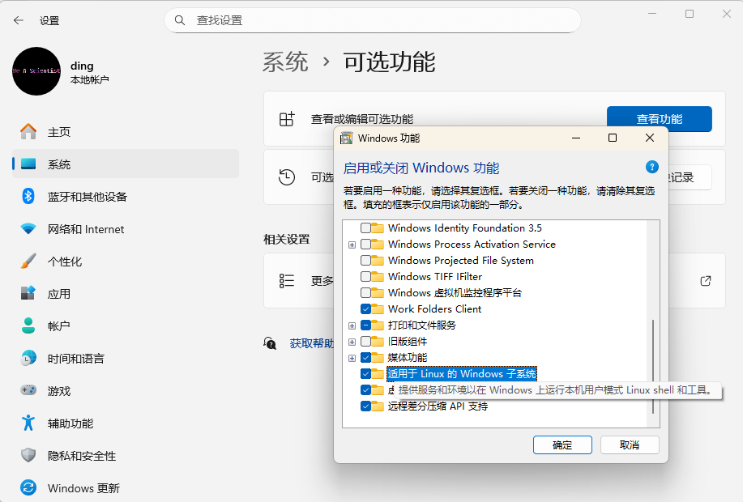

# wsl:Ubuntu2004系统导出/导入到移动固态硬盘的配置记录

> 以下配置的目的是将wsl:ubuntu24.04系统安装到移动固态硬盘，并安装配置好开发环境，
> 以便在任何一台windows电脑上零配置进入开发环境，避免耗时的环境安装配置和git pull。

**确保安装wsl**


**查看可安装的wsl分发版系统**

```bash
> wsl --list --online
以下是可安装的有效分发的列表。
使用 'wsl.exe --install <Distro>' 安装。

NAME                            FRIENDLY NAME
Ubuntu                          Ubuntu
Debian                          Debian GNU/Linux
kali-linux                      Kali Linux Rolling
Ubuntu-20.04                    Ubuntu 20.04 LTS
Ubuntu-22.04                    Ubuntu 22.04 LTS
Ubuntu-24.04                    Ubuntu 24.04 LTS
OracleLinux_7_9                 Oracle Linux 7.9
OracleLinux_8_10                Oracle Linux 8.10
OracleLinux_9_5                 Oracle Linux 9.5
openSUSE-Leap-15.6              openSUSE Leap 15.6
SUSE-Linux-Enterprise-15-SP6    SUSE Linux Enterprise 15 SP6
openSUSE-Tumbleweed             openSUSE Tumbleweed
```

**安装Ubuntu-24.04**

```bash
wsl --install -d Ubuntu-24.04
```

**查看已安装的wsl**

```bash
wsl --list
适用于 Linux 的 Windows 子系统分发:
Ubuntu2404 (默认)
```

**导出到u盘**

```bash
# wsl --export Ubuntu2404 u://wsl-linuxs//ubuntu-24.04.tar
wsl --export Ubuntu2404 u://wsl-linuxs//ubuntu-24.04.vhdx --vhd
```

**注销并删除默认存在于C盘的Ubuntu系统**

```bash
wsl --unregister Ubuntu2404
# 查看是否注销成功
wsl --list
```

**导入Ubuntu系统**

```bash
# 普通导入：复制到C盘，并注册到wsl的系统列表
# wsl --import Ubuntu2204 u://wsl-linuxs//ubuntu-24.04.vhdx
# wsl --import Ubuntu2204 u://wsl-linuxs//ubuntu-24.04.tar
# 原地导入：不复制，原地注册到wsl的系统列表（执行注销命令会导致文件被删除！）
wsl --import-in-place Ubuntu2204 u://wsl-linuxs//ubuntu-24.04.vhdx
# 查看是否导入成功
wsl --list
```


**Ubuntu配置**
```bash
apt update
apt install build-essential

The following NEW packages will be installed:
  build-essential bzip2 cpp cpp-13 cpp-13-x86-64-linux-gnu cpp-x86-64-linux-gnu dpkg-dev fakeroot g++ g++-13
  g++-13-x86-64-linux-gnu g++-x86-64-linux-gnu gcc gcc-13 gcc-13-base gcc-13-x86-64-linux-gnu gcc-x86-64-linux-gnu
  libalgorithm-diff-perl libalgorithm-diff-xs-perl libalgorithm-merge-perl libaom3 libasan8 libatomic1 libc-dev-bin
  libc-devtools libc6-dev libcc1-0 libcrypt-dev libde265-0 libdpkg-perl libfakeroot libfile-fcntllock-perl
  libgcc-13-dev libgd3 libgomp1 libheif-plugin-aomdec libheif-plugin-aomenc libheif-plugin-libde265 libheif1
  libhwasan0 libisl23 libitm1 liblsan0 libmpc3 libquadmath0 libstdc++-13-dev libtsan2 libubsan1 libxpm4 linux-libc-dev
  lto-disabled-list make manpages-dev rpcsvc-proto
The following packages will be upgraded:
  dpkg libc-bin libc6 locales
4 upgraded, 54 newly installed, 0 to remove and 194 not upgraded.
```

**检查gcc版本**

```bash
gcc -v
g++ -v

gcc version 13.3.0 (Ubuntu 13.3.0-6ubuntu2~24.04)


make -v

GNU Make 4.3
Built for x86_64-pc-linux-gnu
```