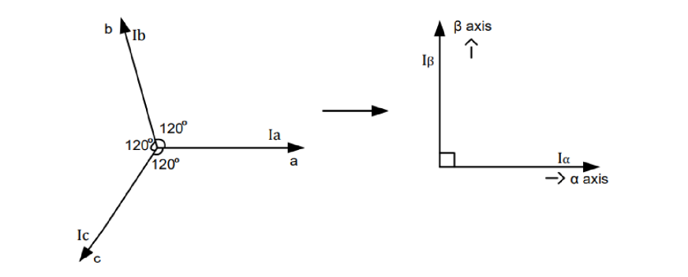

## 克拉克变换

- 克拉克变换就是把相位差为120度的三相电映射到二维平面上。
- 具体做法就是把三相电看成三个矢量（也反映了三个方向的磁场强度）
- 把三个矢量相加得到一个矢量（也反应了定子产生磁场的方向和强度）
- 这个矢量只需要用两个量（α、β）来表示。

### 基本形式推导

- 这个推导过程很简单
- 就是分别计算三个分量作用在α轴、β轴上的值。
- 如
  - ia
    - $x = \cos{0} * i_a$，所以 $I_α+=1 * i_a$
    - $y = \sin{0} * i_a$，所以 $I_β+=0 * i_a$
  - ib
    - $x= \cos{120} * i_b$，所以 $I_α+=-\frac{1}{2} i_a$
    - $y = \sin{120} * i_b$，所以 $I_β+=\frac{\sqrt{3}}{2} i_b$
  - ic
    - $x=\cos{-120} * i_b$，所以 $I_α+=-\frac{1}{2}i_a$
    - $y=\sin{-120} * i_b$，所以 $I_β+=-\frac{\sqrt{3}}{2} i_b$

也就是其 ==基本形式== ：

$$

I_\alpha  = \cos{0\degree} * i_a + \cos{120\degree} * i_b + \cos{240\degree}* i_c  \\
I_\beta   = \sin{0\degree} * i_a + \sin{120\degree} * i_b + \sin{240\degree}* i_c  \\

\left[
    \begin{matrix}
        I_\alpha \\
        I_\beta
    \end{matrix}
\right]
=
\left[
    \begin{matrix}
        \cos{0\degree} & \cos{120\degree} & \cos{240\degree} \\
        \sin{0\degree} & \sin{120\degree} & \sin{240\degree} \\
    \end{matrix}
\right]
\left[
    \begin{matrix}
        i_a \\
        i_b \\
        i_c \\
    \end{matrix}
\right]

\\

\left[
    \begin{matrix}
        I_\alpha \\
        I_\beta
    \end{matrix}
\right]
=
\left[
    \begin{matrix}
        1 & -\frac{1}{2} & -\frac{1}{2} \\
        0 & \frac{\sqrt{3}}{2} & -\frac{\sqrt{3}}{2} \\
    \end{matrix}
\right]
\left[
    \begin{matrix}
        i_a \\
        i_b \\
        i_c \\
    \end{matrix}
\right]
$$
> 上面这里特意写成三角函数，因为感觉形式比较优美

还可以利用基尔霍夫电流定律进一步化简：

$$
i_a+i_b+i_c=0 \\
i_c=-(i_a+i_b) \\
$$
$$
I_\alpha  = \cos{0\degree} * i_a + \cos{120\degree} * i_b + \cos{240\degree}* -(i_a+i_b)  \\
I_\beta   = \sin{0\degree} * i_a + \sin{120\degree} * i_b + \sin{240\degree}* -(i_a+i_b)  \\
$$

$$
I_\alpha  = (\cos{0\degree}-\cos{240\degree}) * i_a + (\cos{120\degree}-\cos{240\degree}) * i_b  \\
I_\beta   = (\sin{0\degree}-\sin{240\degree}) * i_a + (\sin{120\degree}-\sin{240\degree}) * i_b  \\
$$
得到：
$$

\left[
    \begin{matrix}
        I_\alpha \\
        I_\beta
    \end{matrix}
\right]
=
\left[
    \begin{matrix}
         (\cos{0\degree}-\cos{240\degree}) & (\cos{120\degree}-\cos{240\degree}) \\
        (\sin{0\degree}-\sin{240\degree}) & (\sin{120\degree}-\sin{240\degree}) \\
    \end{matrix}
\right]
\left[
    \begin{matrix}
        i_a \\
        i_b \\
    \end{matrix}
\right]
$$

### 等幅值形式的推导

- 简单来说，就是添加了一个系数，使得变换前后的电流的幅值都为1
- 先假设流入A相电流1A，则根据基尔霍夫电流定律，流出B相、C相的电流为-1/2A
- 求得Iα为3/2

$$
\left[
    \begin{matrix}
        I_\alpha=\frac{3}{2} \\
        I_\beta=0
    \end{matrix}
\right]

=

\left[
    \begin{matrix}
        \cos{0\degree} & \cos{120\degree} & \cos{240\degree} \\
        \sin{0\degree} & \sin{120\degree} & \sin{240\degree} \\
    \end{matrix}
\right]

\left[
    \begin{matrix}
        i_a=1 \\
        i_b=-\frac{1}{2} \\
        i_c=-\frac{1}{2} \\
    \end{matrix}
\right]
$$

- 为了让幅值相同，所以等式右边乘上一个2/3

$$
\left[
    \begin{matrix}
        I_\alpha=1 \\
        I_\beta=0
    \end{matrix}
\right]
=
\frac{2}{3}
\left[
    \begin{matrix}
        \cos{0\degree} & \cos{120\degree} & \cos{240\degree} \\
        \sin{0\degree} & \sin{120\degree} & \sin{240\degree} \\
    \end{matrix}
\right]

\left[
    \begin{matrix}
        i_a=1 \\
        i_b=-\frac{1}{2} \\
        i_c=-\frac{1}{2} \\
    \end{matrix}
\right]
$$

- 所以得到克拉克变换的 ==等幅值形式== ：

$$
\left[
    \begin{matrix}
        I_\alpha \\
        I_\beta
    \end{matrix}
\right]
=
\frac{2}{3}
\left[
    \begin{matrix}
        \cos{0\degree} & \cos{120\degree} & \cos{240\degree} \\
        \sin{0\degree} & \sin{120\degree} & \sin{240\degree} \\
    \end{matrix}
\right]

\left[
    \begin{matrix}
        i_a \\
        i_b \\
        i_c \\
    \end{matrix}
\right]

\\

\left[
    \begin{matrix}
        I_\alpha \\
        I_\beta
    \end{matrix}
\right]
=
\frac{2}{3}
\left[
    \begin{matrix}
        1 & -\frac{1}{2} & -\frac{1}{2} \\
        0 & \frac{\sqrt{3}}{2} & -\frac{\sqrt{3}}{2} \\
    \end{matrix}
\right]

\left[
    \begin{matrix}
        i_a \\
        i_b \\
        i_c \\
    \end{matrix}
\right]

$$

- 继续化简可以得到:

$$

\\

\left[
    \begin{matrix}
        I_\alpha \\
        I_\beta
    \end{matrix}
\right]
=
\frac{2}{3}
\left[
    \begin{matrix}
         (\cos{0\degree}-\cos{240\degree}) & (\cos{120\degree}-\cos{240\degree}) \\
        (\sin{0\degree}-\sin{240\degree}) & (\sin{120\degree}-\sin{240\degree}) \\
    \end{matrix}
\right]
\left[
    \begin{matrix}
        i_a \\
        i_b \\
    \end{matrix}
\right]

$$
$$
I_\alpha = i_a \\
I_\beta = \frac{1}{\sqrt{3}}(2i_a+i_b)
$$

- 逆变换

$$
i_a= I_\alpha \\
i_b= \frac{\sqrt{3}I_\beta-I_\alpha}{2} \\
i_c= \frac{-I_\alpha-\sqrt{3}I_\beta}{2}
$$

### 等功率形式的推导
