**串口通信**

- 原始串口通信
- `RS-232`
- `RS-485`

> `RS-232`、`RS-485`都是原始串口通信的变种

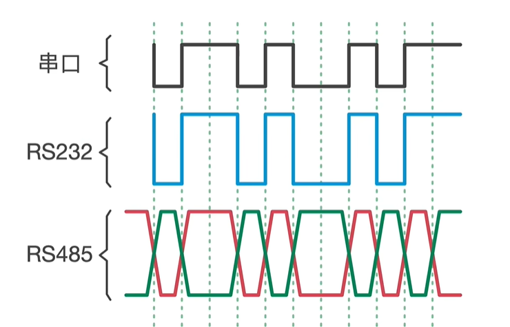

## 原始串口通信

> 原始串口通信是全双工通信，可以同时进行数据的收发工作。

**接口**

- TX 数据发送线
- RX 数据接收线
- GND 地线，两单片机的参考电压。

**帧格式**

- 常见帧格式
  - 起始位低电平，停止位高电平
  - 中间8bit数据位
  - 
- 其他帧格式
  - 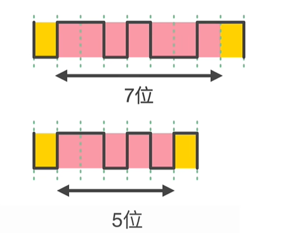

**波特率**

- 1秒之内能够传输的高低电平个数。
- 常见的波特率
  - 9600 代表一秒之内串口可以传输9600个bit
  - 19200
  - 38400
  - 115200
- 高低电平范围
  - TTL逻辑电平范围，一般高低电平为5V 0V
  - 大于2.4V为高电平
  - 低于0.4V为低电平
  - 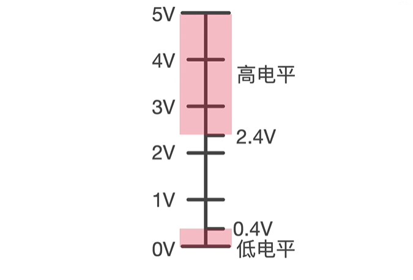
  - 由于其高低电平范围比较窄，所以抗干扰能力比较弱
  - 
  - 静电可能导致低电平变成高电平
  - 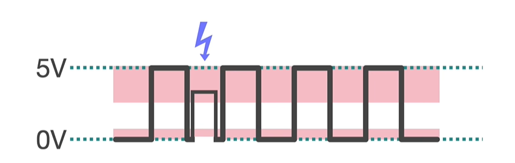
  - 抗干扰能力比较弱，通信距离较短，一米之内。
  - 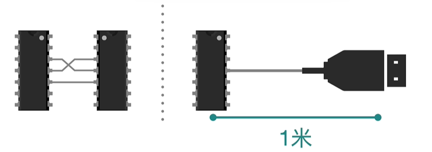
  - 应用场景一般为芯片之间，芯片和电脑之间
  - 
  - 

## RS232

- RS表示推荐标准
- 为了提升原始串口通讯的距离和稳定性，美国电子工业联盟指定的标准
- 该标准支持全双工通信，即同时收法数据。

**RS232接口**

- 原理就是通过一个MAX23芯片，
- 把发送的5v转为12V，发送0v转换为-12V
- 把收到的12V转为5V，收到-12v转换为0V
  - 其实，RS232是负逻辑，232芯片收到的电压是5V,它输出-12V,收到0V，它输出+12V
- 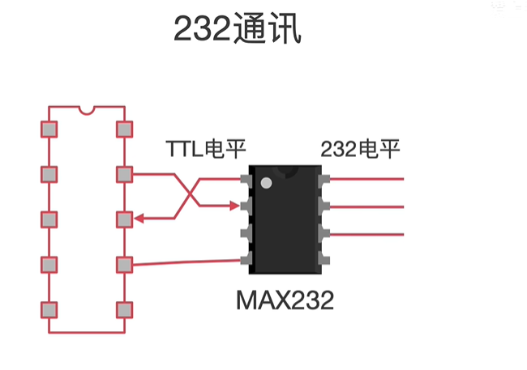
- 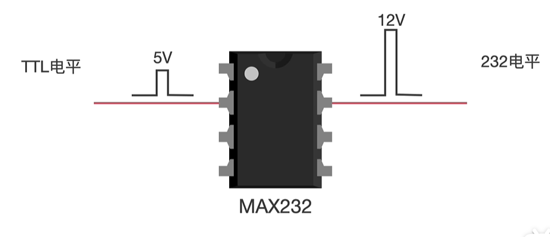
- 
- 

**高低电平范围**

- `[3,15]`为高电平
- `[-3,-15]`为低电平
- 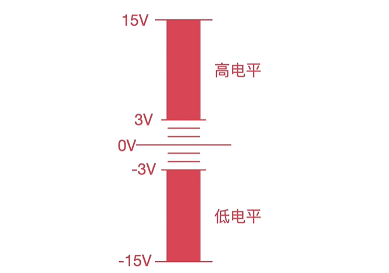
- 高低电平间相差了20v,抗干扰能力强
  - 
  - 
- 通信距离增长，但速率只有20k,即19200波特率
  - 

**插头**

- 
- 

## RS458标准

RS458也是一个推荐标准，制定是为了解决RS232中传输速率低的问题。

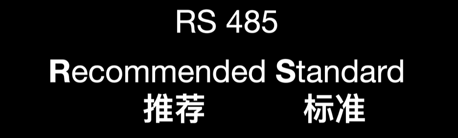

RS458和RS232一样，是在串口通信的基础上加了一个电平转换芯片。

485芯片可以把TTL电平信号转换为差分信号。

- 差分信号只需要两根线，不再需要地线。
- 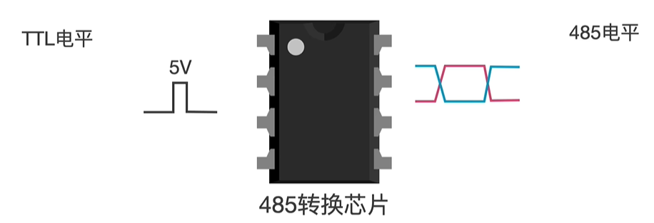
- 信号A大于信号B,代表逻辑0
- 信号B大于信号A,代表逻辑1
- 
- 差分信号的优点是抗干扰能力强。
- 因为它使用的是两根信号线的差值来代表逻辑0和逻辑1
- 
- 由于其使用双绞线（具有抗电磁干扰特性），即使受到干扰，导致电压改变，也是两根线的电压同时改变，他们之间的差值将会保持。
- 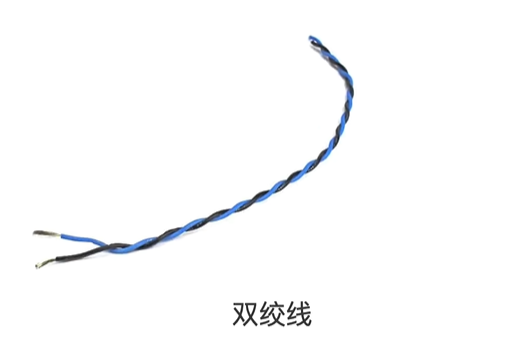
- 
- 传输距离更远：1200米
- 频率更高：50M
- 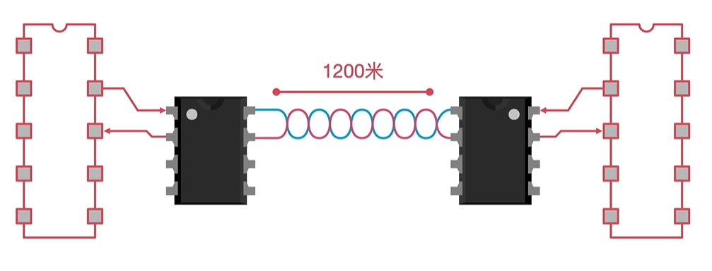

**缺点**

- 只能进行半双工通信，即同一时刻只能收或发数据。
- 
- 由于这样的特性，其可以支持一主多从的组网通信
- 

串口通信和RS232只能进行简单的点对点通信

## 总结

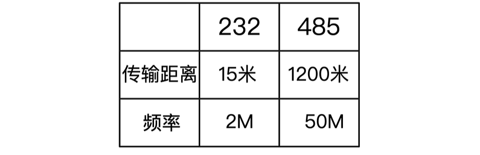
