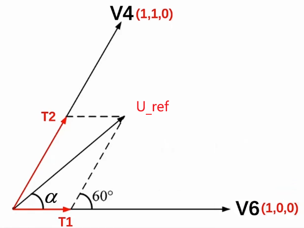
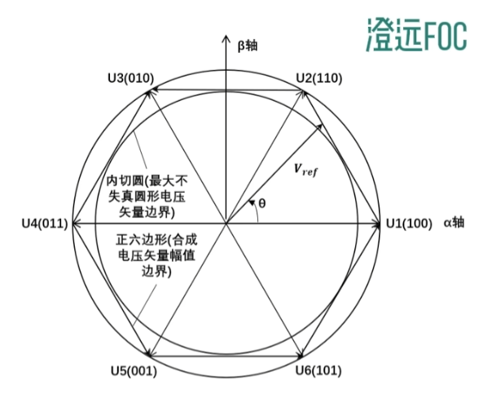
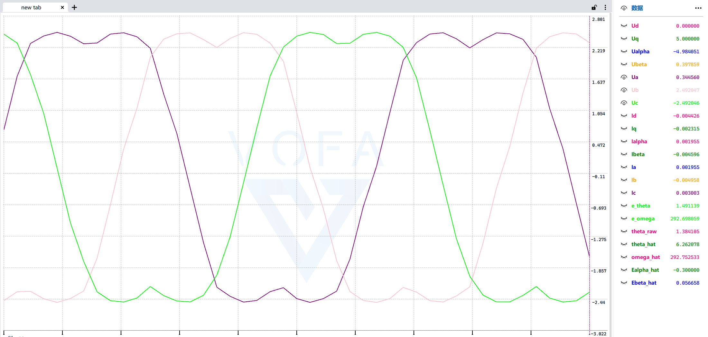

### SVPWM算法公式推导：从几何原理到代码实现

在磁场定向控制（FOC）中，空间矢量脉宽调制（SVPWM）负责将二维的电压参考矢量 $\vec{U}_{ref}$ 转换为三相逆变器的占空比信号。其核心是计算两个相邻有效矢量（Active Vector）的作用时间。

#### 1. 符号定义与前提

- $\vec{U}_{ref}$: 目标电压空间矢量，位于 $\alpha-\beta$ 静止坐标系。
- $U_s$: $\vec{U}_{ref}$ 的幅值，即 $U_s = |\vec{U}_{ref}| = \sqrt{U_\alpha^2 + U_\beta^2}$。
- $\theta$: $\vec{U}_{ref}$ 在 $\alpha-\beta$ 坐标系中的角度（电角度）。
- $U_{dc}$: 直流母线电压。
- $T_s$: PWM周期（载波周期）。
- $T_a, T_b$: 两个相邻有效矢量 $V_a$ 和 $V_b$ 在一个 $T_s$ 内需要作用的时间。它们对应于代码中的 `T1` 和 `T2`。
- $T_0$: 零矢量（$V_0$ 或 $V_7$）的作用时间，$T_s = T_a + T_b + T_0$。

**前提**：采用 **Clarke等幅值变换**。这意味着变换前后电压矢量的幅值（模长）物理意义保持不变，即相电压峰值与 $\alpha-\beta$ 坐标系下矢量幅值对应。
$$
\sqrt{U_\alpha^2 + U_\beta^2} = \frac{2}{3}\sqrt{u_a^2 + u_b^2 + u_c^2}
$$
其中 $u_a, u_b, u_c$ 为三相相电压瞬时值。

#### 2. 基于伏秒平衡与正弦定理的原始公式推导

根据SVPWM原理，在一个PWM周期 $T_s$ 内，通过两个相邻的有效矢量 $V_a$、$V_b$ 和零矢量的组合来合成 $\vec{U}_{ref}$，遵循伏秒平衡原则：
$$
\vec{U}_{ref} T_s = V_a T_a + V_b T_b
$$

考虑 $\vec{U}_{ref}$ 位于扇区I（即0号扇区，介于 $V_4$ 和 $V_6$ 之间，对应下图情形）。以 $V_6$ 为 $V_a$， $V_4$ 为 $V_b$。由基本空间矢量图可知，$V_a$、$V_b$ 和 $\vec{U}_{ref}$ 构成一个三角形。



对该三角形应用 **正弦定理**：

$$
\frac{T_a / T_s |V_a|}{\sin(60^\circ - \alpha)} = \frac{T_b / T_s |V_b|}{\sin(\alpha)} = \frac{|U_{ref}|}{\sin(120^\circ)}
$$

定义$Ts=1$为一个pwm时钟周期，则 $T_a$、$T_b$、$T_0$ 表示的就是占空比，且满足 $T_a + T_b + T_0 = 1$。

定义$U_s = |\vec{U}_{ref}|$,表示空间电压矢量幅值。

通过逆变电路的导通状态和三相绕组的连接情况可知，六个基本矢量的幅值均为 $\frac{2}{3}U_{dc}$，即：$|V_a| = |V_b| = \frac{2}{3}U_{dc}$。

同时可知 $\sin(120^\circ) = \sin(60^\circ) = \frac{\sqrt{3}}{2}$。

代入上式可得：

$$
\begin{aligned}
T_a &= \frac{|U_{ref}|\sin(60^\circ - \alpha)}{T_s|V_a|\sin(120^\circ)} \\
  &= \frac{U_s}{\frac{2}{3}U_{dc} \frac{\sqrt{3}}{2}}\sin(60^\circ - \alpha) \\
  &= \frac{U_s}{\frac{\sqrt{3}}{3}U_{dc}}\sin(60^\circ - \alpha) \\
\end{aligned}
$$

同理：
$$
T_b = \frac{U_s}{\frac{\sqrt{3}}{3}U_{dc}}\sin(\alpha)
$$

同时:

$$
T_0 = 1 - T_a - T_b
$$

#### 电压归一化与六边形内切圆半径



SVPWM的线性调制区（即能合成圆形旋转磁场而不畸变的区域）由六个有效矢量构成的正六边形的 **内切圆** 所限定。

该内切圆的半径 $R$ 即为能够合成空间电压矢量 $\vec{U}_{ref}$ 的最大幅值 $U_{s\_max}$：

$$
R = U_{s\_max} = \frac{\sqrt{3}}{2} |U_a| = \frac{\sqrt{3}}{2} \frac{2}{3}U_{dc} = \frac{\sqrt{3}}{3}U_{dc}
$$

观察下面两个表达式

$$
\begin{aligned}
  T_a &= \frac{U_s}{\frac{\sqrt{3}}{3}U_{dc}}\sin(60^\circ - \alpha) \\
  U_{s\_max} &= \frac{\sqrt{3}}{3}U_{dc}
\end{aligned}
$$

可以发现分母完全相同, 这意味着如果进行 **电压归一化**，将电压矢量幅值 $U_s$ 表示为相对于最大值 $U_{s\_max}$ 的比例：

$$
\frac{U_s}{U_{s\_max}} = \frac{U_s}{\frac{\sqrt{3}}{3}U_{dc}} \in [0, 1]
$$

记这个归一化电压为 $U_{norml}$，则公式可简化为：

$$
\begin{aligned}
T_a &= U_{norml} \sin(60^\circ - \alpha) \\
T_b &= U_{norml} \sin(\alpha)
\end{aligned}
$$

这就是最终得到的简洁形式。在实际实现中，我们以直流母线电压 $U_{dc}$ 为参考电压基准 `power_supply`，则：

$$
U_{norml} = \frac{U_s}{\frac{\sqrt{3}}{3}U_{dc}} \approx \frac{U_s}{U_{dc}}
$$

在FOC控制中，我们主要关注q轴电压 $U_q$（用于产生转矩），d轴电压 $U_d$ 通常设为0（弱磁控制除外）。经Park逆变换后，$\vec{U}_{ref}$ 的幅值主要由 $U_q$ 决定，因此代码中直接使用：

```c
float T1 = self->Uq / self->power_supply * _sin(M_PI_3 - alpha);
float T2 = self->Uq / self->power_supply * _sin(alpha);
float T0 = 1 - T1 - T2;
```

- `self->Uq / self->power_supply`：归一化电压比例，对应理论公式中的 $U_{norml}$
- `M_PI_3`：$60^\circ$ 的弧度值（$\pi/3$）
- `alpha`：当前扇区内角度 $\alpha = \theta - \text{sector} \times 60^\circ$
- `_sin()`：正弦函数实现

#### 扇区分配与PWM占空比计算

计算出相邻两个有效矢量的作用时间 $T_1$ 和 $T_2$ 后，需要根据扇区位置分配到三相的PWM占空比。SVPWM采用对称开关策略，将零矢量时间 $T_0$ 平均分配到每个PWM周期的首尾。

以扇区0（$0^\circ \leq \theta < 60^\circ$）为例：

- $T_a$ 对应 $V_6$ 的作用时间 $T_1$
- $T_b$ 对应 $V_4$ 的作用时间 $T_2$
- 开关序列：$V_0 \rightarrow V_6 \rightarrow V_4 \rightarrow V_7 \rightarrow V_4 \rightarrow V_6 \rightarrow V_0$

对应的相电压（中心对齐）占空比为：

- $T_a = T_1 + T_2 + T_0/2$
- $T_b = T_2 + T_0/2$
- $T_c = T_0/2$

其他扇区类似，只需重新分配 $T_1$ 和 $T_2$ 到三相即可。

#### 完整代码

```c
void motor_set_e_theta_omega(Motor *self, float e_theta, float e_omega)
{
    e_theta = _normlalizeAngle(e_theta);
    self->e_theta = e_theta;
    self->e_omega = e_omega;
    self->sin_e_theta = _sin(e_theta);
    self->cos_e_theta = _cos(e_theta);
}
/**
 * 设置dq轴电压
 * - 为防止重复计算三角函数 需要先调用 motor_set_e_theta_omega
 */
void motor_set_dq_voltage(Motor *self, float Ud, float Uq)
{
    self->Ud = Ud;
    self->Uq = Uq;

    // 帕克逆变换
    // Ualpha = cos(θ) * Ud - sin(θ) * Uq
    // Ubeta = sin(θ) * Ud + cos(θ) * Uq
    self->Ualpha = self->cos_e_theta * Ud - self->sin_e_theta * Uq;
    self->Ubeta = self->sin_e_theta * Ud + self->cos_e_theta * Uq;

    switch (self->modulation)
    {
    case SPWM: // 克拉克逆变换
    {
#define M_SQRT3_2 0.8660254037844386 // (sqrt(3)/2)

        // 克拉克逆变换(等赋值形式)
        // Ua = Ualpha
        // Ub = -0.5 * Ualpha + (sqrt(3)/2) * Ubeta
        // Uc = -0.5 * Ualpha - (sqrt(3)/2) * Ubeta = -(Ua + Ub) // 基尔霍夫电压电流定律
        self->Ua = self->Ualpha;
        self->Ub = -0.5f * self->Ualpha + M_SQRT3_2 * self->Ubeta;
        self->Uc = -(self->Ua + self->Ub);

        // 计算PWM占空比
        // [-power_supply,+power_supply] => [-0.5,+0.5] => [0,1]
        self->Ta = self->Ua / self->power_supply * 0.5f + 0.5f;
        self->Tb = self->Ub / self->power_supply * 0.5f + 0.5f;
        self->Tc = self->Uc / self->power_supply * 0.5f + 0.5f;
    }
    break;
    case SVPWM:
    {
#define M_PI_3 1.0471975511965979 // 60° = PI/3

        int sector = self->e_theta / M_PI_3;
        float alpha = self->e_theta - sector * M_PI_3;

        // Uq∈[-power_supply,+power_supply]
        // self->Uq / self->power_supply ∈ [-1,1]
        float T1 = self->Uq / self->power_supply * _sin(M_PI_3 - alpha);
        float T2 = self->Uq / self->power_supply * _sin(alpha);
        float T0 = 1 - T1 - T2;

        float Ta, Tb, Tc;
        switch (sector)
        {
        case 0:
            Ta = T1 + T2 + T0 / 2;
            Tb = T2 + T0 / 2;
            Tc = T0 / 2;
            break;
        case 1:
            Ta = T1 + T0 / 2;
            Tb = T1 + T2 + T0 / 2;
            Tc = T0 / 2;
            break;
        case 2:
            Ta = T0 / 2;
            Tb = T1 + T2 + T0 / 2;
            Tc = T2 + T0 / 2;
            break;
        case 3:
            Ta = T0 / 2;
            Tb = T1 + T0 / 2;
            Tc = T1 + T2 + T0 / 2;
            break;
        case 4:
            Ta = T2 + T0 / 2;
            Tb = T0 / 2;
            Tc = T1 + T2 + T0 / 2;
            break;
        case 5:
            Ta = T1 + T2 + T0 / 2;
            Tb = T0 / 2;
            Tc = T1 + T0 / 2;
            break;
        default:
            Ta = 0;
            Tb = 0;
            Tc = 0;
        }

        // 相电压
        // [0,1] => [-0.5, 0.5] => [-power_supply, +power_supply]
        self->Ua = (Ta - 0.5) * self->power_supply;
        self->Ub = (Tb - 0.5) * self->power_supply;
        self->Uc = (Tc - 0.5) * self->power_supply;

        // pwm占空比
        self->Ta = Ta;
        self->Tb = Tb;
        self->Tc = Tc;
    }
    break;
    default:
        break;
    }
}
```

**输出效果**



> 参考代码
>
> - 一分钟玩转FOC SVPWM <https://www.bilibili.com/video/BV1PC411n7QQ>
> - ESP32单片机仿真代码: <https://wokwi.com/projects/396507548266030081>
