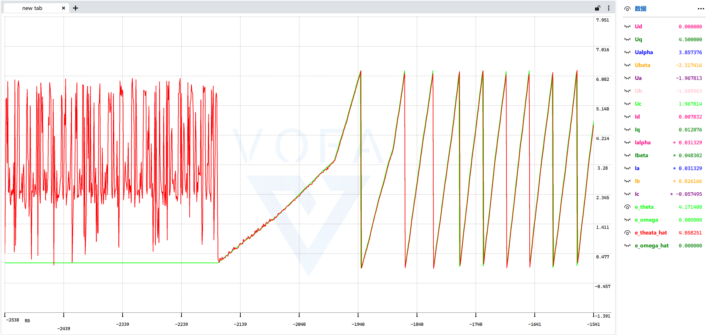

### **从电机方程到滑模观测器：无传感器FOC位置估计的完整推导与实现**

**摘要**：本文旨在提供一份关于滑模观测器应用于永磁同步电机无传感器控制的系统性、教学性推导。我们将从最基本的单相电机模型出发，逐步构建三相及两相静止坐标系下的数学模型，阐明反电动势与转子位置的内在联系，揭示直接计算法的固有缺陷，并最终详细推导滑模观测器的核心思想、数学原理、稳定性分析及C语言代码实现，力求在理论与工程实践之间架起清晰的桥梁。

---

### **一、 电机数学模型的建立：从单相到两相静止坐标系**

#### **1.1 基础：单相绕组的电压方程**

任何一相电机绕组都可以等效为一个电阻（R）与电感（L）串联，并包含一个由转子永磁磁场旋转感应的反电动势（e）的电路。根据基尔霍夫电压定律，其端电压方程可表示为：

$$
u = R i + L \frac{di}{dt} + e
$$

其中，$u$ 是施加的相电压，$i$ 是相电流，$e$ 是反电动势。这是所有推导的物理基础。

#### **1.2 扩展：三相PMSM在自然坐标系下的模型**

对于一台三相永磁同步电机（PMSM），其在ABC三相静止坐标系下的电压方程组为：

$$
\begin{bmatrix} v_a \\ v_b \\ v_c \end{bmatrix} = R_s \begin{bmatrix} i_a \\ i_b \\ i_c \end{bmatrix} + L_s \frac{d}{dt} \begin{bmatrix} i_a \\ i_b \\ i_c \end{bmatrix} + \begin{bmatrix} e_a \\ e_b \\ e_c \end{bmatrix}
$$

这里假设电机为面贴式PMSM（$L_d = L_q$），因此定子电感矩阵可简化为标量 $L_s$。$e_a, e_b, e_c$ 是由转子永磁体产生的三相反电动势。

#### **1.3 简化：克拉克变换到两相静止坐标系(α-β)**

三相变量分析复杂，且其和为0（对于星形连接无中线系统）。通过**克拉克变换**，我们可以将其简化为两相正交变量，该变换保持了合成矢量的幅值和相位信息。采用等幅值变换：

$$
\begin{bmatrix} i_{\alpha} \\ i_{\beta} \end{bmatrix} = \frac{2}{3} \begin{bmatrix} 1 & -\frac{1}{2} & -\frac{1}{2} \\ 0 & \frac{\sqrt{3}}{2} & -\frac{\sqrt{3}}{2} \end{bmatrix} \begin{bmatrix} i_a \\ i_b \\ i_c \end{bmatrix}
$$

电压与反电动势进行相同的变换。在α-β两相静止坐标系下，电机电压方程简化为两个独立的、结构相同的方程：

$$
\boxed{
\begin{aligned}
u_{\alpha} &= R_s i_{\alpha} + L_s \frac{di_{\alpha}}{dt} + e_{\alpha} \\
u_{\beta} &= R_s i_{\beta} + L_s \frac{di_{\beta}}{dt} + e_{\beta}
\end{aligned}}
$$

这一形式（**核心方程**）极大地简化了后续分析。

#### **1.4 关键：反电动势与转子位置的关系**

永磁体磁链在 αβ 坐标系中的分量通常表示为：

$$
\psi_{pm,\alpha} = \Psi_m \cos(\theta_e) \\ 
\quad \psi_{pm,\beta} = \Psi_m \sin(\theta_e)
$$

这里，$\theta_e$ 直接就是磁链矢量的角度，也是转子 d 轴的方向。

**反电动势** 是磁链的负导数：$e = -d\psi/dt$。

因此：

$$
e_\alpha = -\frac{d}{dt}(\Psi_m \cos\theta_e) = \omega_e \Psi_m \sin\theta_e \\
e_\beta = -\frac{d}{dt}(\Psi_m \sin\theta_e) = -\omega_e \Psi_m \cos\theta_e
$$


### **1.5 反电动势与电角度提取**

#### **1.5.1 反电动势中的电角度信息**

观察 $e_\alpha$ 和 $e_\beta$ 的表达式，可以看出它们包含了转子位置信息。将两式相除：

$$
\frac{e_\alpha}{e_\beta} = \frac{-\sin(\theta_e)}{\cos(\theta_e)} = -\tan(\theta_e)
$$

因此，电角度可以通过反正切函数计算：

$$
\theta_e = -\arctan\left(\frac{e_\alpha}{e_\beta}\right)
$$

需要注意的是，实际应用中需使用四象限反正切函数（如 `atan2`）以避免象限模糊：

$$
\boxed{ \theta_e = -\operatorname{atan2}(e_\alpha, e_\beta) }
$$

使用 `atan2` 函数可以自动处理四个象限，得到 $[-\pi, \pi]$ 范围内的唯一角度。

> 所以，只要能准确获取 $e_{\alpha}$ 和 $e_{\beta}$，即可提取转子位置。

---

### **二、 为什么需要观测器？直接计算法的困境**

从核心方程似乎可以直接解出反电动势，例如对α轴方程离散化（前向欧拉法）：

$$
e_{\alpha}(k) \approx u_{\alpha}(k) - R_s i_{\alpha}(k) - L_s \frac{i_{\alpha}(k) - i_{\alpha}(k-1)}{T_s}
$$

然而，这种方法在实践中**完全不可行**，原因有二：

1. **噪声放大**：差分项 $(i(k)-i(k-1))/T_s$ 构成一个数值微分器，会极度放大电流采样信号中的开关噪声、量化误差和测量噪声，导致计算结果毛刺极大。
2. **参数敏感性**：电阻 $R_s$ 和电感 $L_s$ 会随电机温度、工作点（磁饱和）而变化，固定的模型参数代入计算将引入持续误差。

因此，必须采用一种**闭环的、鲁棒的状态估计方法**来从含噪的测量信号中“观测”出反电动势，这就是滑模观测器的用武之地。

---

### **三、 滑模观测器：思想、设计与推导**

#### **3.1 核心思想——构建电流跟踪器**

滑模观测器的基本思路是：**构造一个电机的软件复制品（观测器模型），通过一个强鲁棒的非线性反馈（滑模控制律），动态调整模型中的反电动势估计值，迫使观测器输出的电流信号紧紧跟踪实际测量的电流信号。当跟踪误差为零时，模型中的反电动势估计值就等于真实的反电动势。**

#### **3.2 观测器结构设计**

我们复制一份核心方程，但使用**估计值** $\hat{i}$ 和 $\hat{e}$：

$$
\frac{d}{dt} \begin{bmatrix} \hat{i}_{\alpha} \\ \hat{i}_{\beta} \end{bmatrix} = -\frac{R_s}{L_s} \begin{bmatrix} \hat{i}_{\alpha} \\ \hat{i}_{\beta} \end{bmatrix} + \frac{1}{L_s} \left( \begin{bmatrix} u_{\alpha} \\ u_{\beta} \end{bmatrix} - \begin{bmatrix} \hat{e}_{\alpha} \\ \hat{e}_{\beta} \end{bmatrix} \right)
$$

$\hat{e}_{\alpha}, \hat{e}_{\beta}$ 在这里是**需要设计的控制输入**，目标是让 $\hat{i} \rightarrow i$。

定义电流估计误差（此即**滑模面**）：

$$
\boxed{
\begin{aligned}
s_{\alpha} &= \hat{i}_{\alpha} - i_{\alpha} \\
s_{\beta} &= \hat{i}_{\beta} - i_{\beta}
\end{aligned}}
$$

滑模观测器通过控制律设计，使得 $\hat{i} \to i$（即 $s \to 0$）。

#### **3.3 滑模控制律设计与稳定性分析**

滑模控制的核心在于设计控制律使系统状态趋近并保持在滑模面上。由于控制系统的动态方程通常以微分形式描述，我们需要分析误差随时间的变化特性。因此，对误差 $s$ 求导，并代入真实系统与观测器的方程：

$$
\begin{aligned}
\dot{s}_{\alpha} &= \dot{\hat{i}}_{\alpha} - \dot{i}_{\alpha} \\
&= \left[ -\frac{R_s}{L_s} \hat{i}_{\alpha} + \frac{1}{L_s}(u_{\alpha} - \hat{e}_{\alpha}) \right] - \left[ -\frac{R_s}{L_s} i_{\alpha} + \frac{1}{L_s}(u_{\alpha} - e_{\alpha}) \right] \\
&= -\frac{R_s}{L_s} s_{\alpha} - \frac{1}{L_s} (\hat{e}_{\alpha} - e_{\alpha})
\end{aligned}
$$

为了迫使误差 $s$ 收敛到零，我们设计**滑模趋近律**。选择经典的等速趋近律 $\dot{s} = -K \cdot \operatorname{sat}(s/\delta)$，其中 $K>0$，$\operatorname{sat}()$ 为饱和函数。

令 $\dot{s}_{\alpha} = -K \cdot \operatorname{sat}(s_{\alpha}/\delta)$，代入上式：

$$
-\frac{R_s}{L_s} s_{\alpha} - \frac{1}{L_s} (\hat{e}_{\alpha} - e_{\alpha}) = -K \cdot \operatorname{sat}(s_{\alpha}/\delta)
$$

上式可重新整理为：

$$
\frac{1}{L_s} (\hat{e}_{\alpha} - e_{\alpha}) = K \cdot \operatorname{sat}(s_{\alpha}/\delta) - \frac{R_s}{L_s} s_{\alpha}
$$

即：
$$
\hat{e}_{\alpha} = L_s K \cdot \operatorname{sat}(s_{\alpha}/\delta) - R_s s_{\alpha} + e_{\alpha}
$$

注意到：
- $e_{\alpha}$ 为真实反电动势，是未知量，但有界
- 当系统稳定时，$s_{\alpha} \approx 0$（误差收敛到零）
- 此时 $\operatorname{sat}(s_{\alpha}/\delta) \approx 0$（在边界层内）

因此，在稳态下近似有 $\hat{e}_{\alpha} \approx e_{\alpha}$，即观测器输出的估计值收敛到真实反电动势。

在工程实践中，为简化实现，通常采用如下控制律形式：

$$
\boxed{
    \begin{aligned}
    \hat{e}_{\alpha} &= h \cdot \operatorname{sat}(s_{\alpha}/\delta) \\
    \hat{e}_{\beta} &= h \cdot \operatorname{sat}(s_{\beta}/\delta)
    \end{aligned}
}
$$

其中 $h = L_s K$ 称为**滑模增益**。

**为什么用饱和函数而非符号函数？**
符号函数 $\operatorname{sign}(s)$ 会导致系统状态在滑模面两侧高频切换，产生严重的**抖振**。饱和函数在边界层 $|s| < \delta$ 内采用线性反馈，之外与符号函数相同：

$$
\operatorname{sat}(x, \delta) = \begin{cases} 
1, & x > \delta \\
x/\delta, & |x| \le \delta \\
-1, & x < -\delta 
\end{cases}
$$

这能有效平滑控制信号，抑制抖振，是工程实践中的首选。

**稳定性简述**：选取李雅普诺夫函数 $V = \frac{1}{2}s_{\alpha}^2$。可以证明，当滑模增益 $h$ 选择得足够大（大于反电动势幅值的上界），在边界层外有 $\dot{V} < 0$，系统状态能被吸引并保持在滑模面 $s \approx 0$ 的邻域内，从而保证 $\hat{e}$ 收敛到 $e$ 附近。

#### **3.4 离散化实现**

在数字控制系统中，需对连续方程进行离散化（前向欧拉法，采样周期 $T_s$）：

- **观测器模型（预测电流）**：

$$
\begin{aligned}
\hat{i}_{\alpha}(k) &= \hat{i}_{\alpha}(k-1) + T_s \left[ -\frac{R_s}{L_s} \hat{i}_{\alpha}(k-1) + \frac{1}{L_s}(u_{\alpha}(k-1) - \hat{e}_{\alpha}(k-1)) \right] \\
\hat{i}_{\beta}(k) &= \hat{i}_{\beta}(k-1) + T_s \left[ -\frac{R_s}{L_s} \hat{i}_{\beta}(k-1) + \frac{1}{L_s}(u_{\beta}(k-1) - \hat{e}_{\beta}(k-1)) \right]
\end{aligned}
$$

- **滑模控制律（更新反电动势估计）**：

$$
\begin{aligned}
\hat{e}_{\alpha}(k) &= h \cdot \operatorname{sat}\left( \frac{\hat{i}_{\alpha}(k) - i_{\alpha}(k)}{\delta} \right) \\
\hat{e}_{\beta}(k) &= h \cdot \operatorname{sat}\left( \frac{\hat{i}_{\beta}(k) - i_{\beta}(k)}{\delta} \right)
\end{aligned}
$$

#### **3.5 滤波与角度提取**

滑模控制项 $\hat{e}$ 包含高频开关分量，需经低通滤波器平滑后才能用于角度计算。

$$
\begin{aligned}
\hat{e}_{\alpha, flt}(k) &= \alpha \cdot \hat{e}_{\alpha, flt}(k-1) + (1-\alpha) \cdot \hat{e}_{\alpha}(k) \\
\hat{e}_{\beta, flt}(k) &= \alpha \cdot \hat{e}_{\beta, flt}(k-1) + (1-\alpha) \cdot \hat{e}_{\beta}(k)
\end{aligned}
$$

其中 $\alpha$ 为滤波系数（$0.9 \sim 0.99$）。最后，提取转子电角度：

$$
\boxed{ \theta_e(k) = \operatorname{atan2}\left( -\hat{e}_{\alpha, flt}(k), \hat{e}_{\beta, flt}(k) \right) }
$$

---

### **四、 C语言代码实现**


```c
// 滑模观测器结构体
typedef struct
{
    // 电流估计值：观测器模型的输出电流
    float Ialpha_hat, Ibeta_hat;

    // 反电动势估计值：通过滑模控制律调整，使其逼真实反电动势
    float Ealpha_hat, Ebeta_hat;

    // 滑模增益 h：决定观测器收敛速度和鲁棒性
    float Hgain;

    // 边界层厚度 δ：控制饱和函数的平滑程度，抑制抖振
    float delta;

    // 角度与角速度估计值
    float theta_raw;   // 原始角度（未滤波）
    float theta_hat;   // 滤波后的角度
    float omega_hat;   // 角速度估计
} Observer_SMO;

// 滑模观测器初始化
void observer_smo_init(Observer_SMO *self)
{
    // 初始化电流估计值为零
    self->Ialpha_hat = 0.0f;
    self->Ibeta_hat = 0.0f;

    // 初始化反电动势估计值为零
    self->Ealpha_hat = 0.0f;
    self->Ebeta_hat = 0.0f;

    // 滑模增益参数，需根据电机参数调整
    self->Hgain = 0.3f;

    // 边界层厚度，过小会导致抖振，过大会降低鲁棒性
    self->delta = 0.5f;

    // 初始化状态变量
    self->theta_raw = 0.0f;
    self->theta_hat = 0.0f;
    self->omega_hat = 0.0f;
}

// 饱和函数 sat(x, δ)
// 相比符号函数 sign(x)，在边界层内使用线性函数，有效抑制抖振
float smo_sat(float x, float delta)
{
    // 超过正边界层，输出 +1（同符号函数）
    if (x > delta)
        return 1;

    // 超过负边界层，输出 -1（同符号函数）
    if (x < -delta)
        return -1;

    // 在边界层内，使用线性过渡 x/δ，平滑输出
    return x / delta;
}

// 滑模观测器更新函数
// self: 观测器实例指针
// motor: 电机结构体，包含 R、L、Uα、Uβ、Iα、Iβ 等参数
// Ts: 采样周期（控制周期）
void observer_smo_update(Observer_SMO *self, Motor *motor, float Ts)
{
    // 步骤1：电流观测器模型（前向欧拉离散化）
    // 预测下一个采样时刻的电流估计值
    // 公式：Î(k) = Î(k-1) + Ts × [-(R/L) × Î(k-1) + (1/L) × (u - Ê)]
    // 对应连续方程：dî/dt = -(R/L)î + (1/L)(u - ê)

    // αβ轴电流预测
    self->Ialpha_hat += Ts * (-(motor->R / motor->L) * self->Ialpha_hat + (1.0f / motor->L) * (motor->Ualpha - self->Ealpha_hat));
    self->Ibeta_hat += Ts * (-(motor->R / motor->L) * self->Ibeta_hat + (1.0f / motor->L) * (motor->Ubeta - self->Ebeta_hat));

    // 步骤2：滑模控制律更新反电动势估计
    // 使用电流估计误差作为滑模面：s = Î - I
    // 控制律：Ê = h × sat(s, δ)
    // 目标：调整Ê使电流估计误差 s → 0，此时Ê → e（真实反电动势）

    // αβ轴反电动势估计（基于电流跟踪误差）
    self->Ealpha_hat = self->Hgain * smo_sat(self->Ialpha_hat - motor->Ialpha, self->delta);
    self->Ebeta_hat = self->Hgain * smo_sat(self->Ibeta_hat - motor->Ibeta, self->delta);

    // 步骤3：从反电动势提取转子位置
    // 根据反电动势与位置的关系：θ = -atan2(eα, eβ)
    // _normalizeAngle: 角度归一化到 [-π, π] 范围
    self->theta_raw = _normalizeAngle(_atan2(self->Ealpha_hat, -self->Ebeta_hat));
}
```

**VF模式启动：滑膜观测器计算位置与实际位置**



---

### **五、 调参要点与注意事项**

1. **滑模增益 ($h$ 或 `h_gain`)**：决定观测器动态响应速度与抗扰能力。
    - **过小**：收敛慢，对反电动势跟踪能力弱，低速性能差。
    - **过大**：引起较大抖振，虽仍能收敛但噪声大。
    - **调参**：从较小值开始增加，直到电流跟踪误差收敛且反电动势波形相对平滑。

2. **边界层厚度 ($\delta$)**：平衡稳态精度与平滑性的关键。
    - **过小**：趋近符号函数，抖振加剧。
    - **过大**：系统在边界层内表现为线性反馈，鲁棒性下降，可能存在稳态误差。
    - **调参**：通常设为电流最大误差的 $10\% \sim 50\%$，需与增益 $h$ 配合调整。

3. **低通滤波器系数 ($\alpha$ 或 `lpf_alpha`)**：用于滤除反电动势估计值中的高频噪声。
    - **截止频率选择**：截止频率 $f_c = \frac{(1-\alpha)}{2\pi T_s}$ 应高于电机最高电气频率（以保证动态响应），但远低于开关频率/PWM频率（以滤除开关噪声）。
    - **影响**：滤波过强（$\alpha$ 过大）会引入相位滞后，影响角度估算的实时性，可能导致高速下性能下降。

4. **离散化与采样频率**：采样频率 $f_s = 1/T_s$ 应满足香农采样定理，且通常需远高于（如20倍以上）电机的最高电气频率，以保证离散化近似的精度和系统的稳定性。

5. **初始状态与启动**：观测器状态变量（如 `i_alpha_hat`, `e_alpha_flt`）需合理初始化（通常为0）。在电机启动阶段，反电动势很小，观测器可能无法可靠工作，需结合I/F启动等开环启动策略。

### **六、 总结**

滑模观测器通过构建一个电流跟踪闭环，利用非线性反馈（滑模控制律）动态调整模型内部的“虚拟反电动势”，使其逼真实系统的反电动势。其优势在于**对电机参数变化（如电阻、电感）和测量噪声具有较强的鲁棒性**，且结构简单，易于在微控制器上实现。

从单相电机方程出发，到三相模型简化，再到滑模观测器的设计与离散化实现，本文完整地串联了整个技术链条。理解每一步的物理意义和数学原理，是进行工程实现和参数调试的基础。在实际应用中，需根据具体电机和控制系统性能要求，仔细调整滑模增益、边界层和滤波器参数，以达到最佳的无传感器控制效果。


