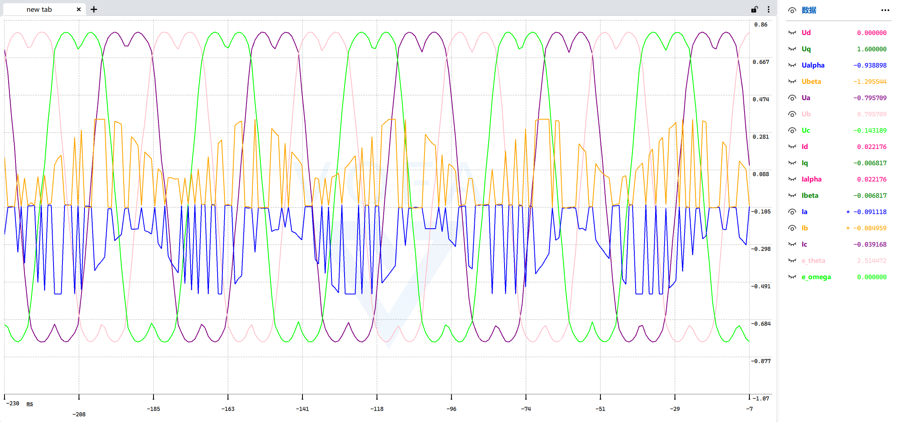
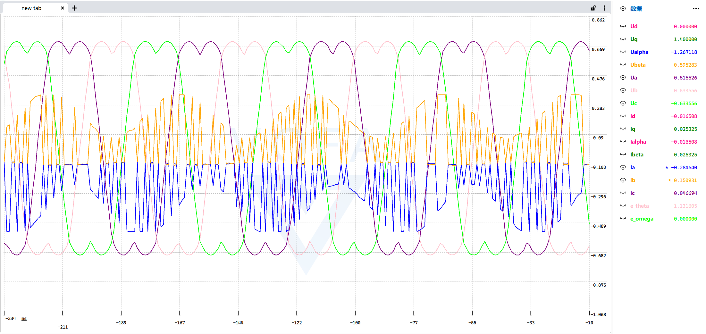
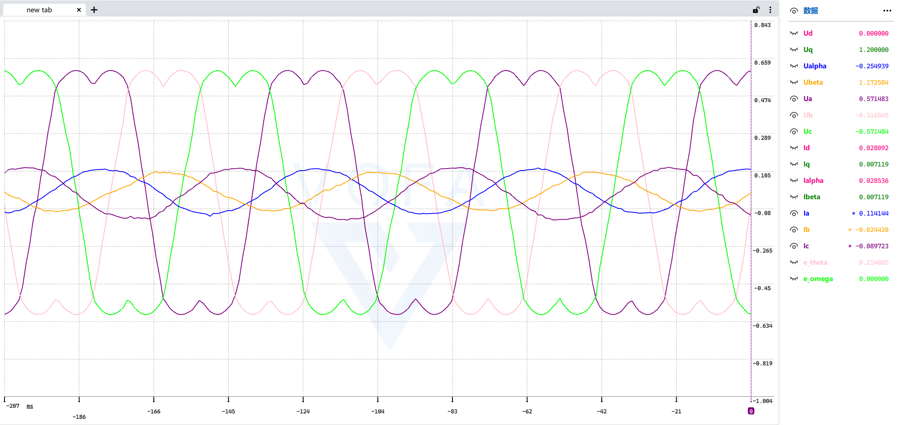
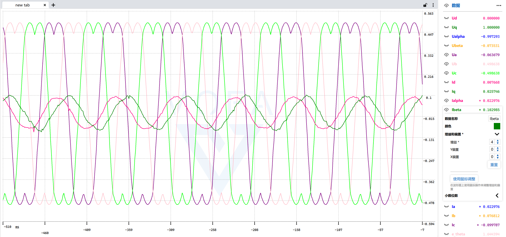
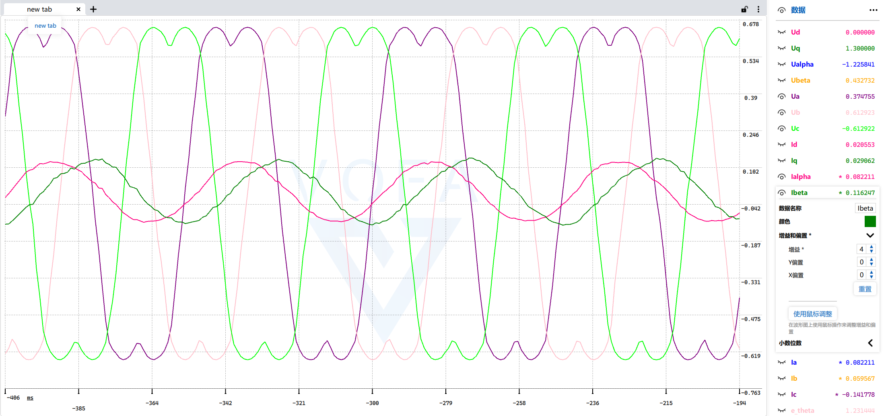

```c
// pwm频率24khz
// TIM_CounterMode_CenterAligned3
// TIM_OCMode_PWM2
// 时钟源      输出频率     分辨率      预分频器
// 72Mhz ->   / 24khz       /1000       = 3

// adc
// 时钟源       预分频          采样周期         采样通道       采样频率
// 72M            /6              /1.5            /3            2.81M
```


```c
// pwm频率24khz
// TIM_CounterMode_CenterAligned3
// TIM_OCMode_PWM2
// 时钟源      输出频率     分辨率      预分频器
// 72Mhz ->   / 24khz       /1000       = 3

// adc
// 时钟源       预分频          采样周期         采样通道       采样频率
// 72M            /6              /19.5           /3            205.12khz
```


```c
// pwm频率24khz
// TIM_CounterMode_CenterAligned2
// TIM_OCMode_PWM2
// 时钟源      输出频率     分辨率      预分频器
// 72Mhz ->   / 24khz       /1000       = 3

// adc
// 时钟源       预分频          采样周期         采样通道       采样频率
// 72M            /6              /19.5           /3            205.12khz
// 但使用cnt过滤掉一次零值的写入（暂时不知道原因）
void adc_update()
{
    static uint8_t cnt = 0;
    cnt++;
    if (cnt % 2 == 0)
        return;

    // I240A2 电流采样
    // [0,1] -> [-0.5,0.5] /3.3 -> U_r -> 采样电阻0.01Ω 放大倍数50倍 i=u/r
    motor.i240a2.Ia_mes = (ADC_GET_VALUE(0) - 0.5f) / 3.3f / 0.01f / 50;
    motor.i240a2.Ib_mes = (ADC_GET_VALUE(1) - 0.5f) / 3.3f / 0.01f / 50;
    motor.i240a2.Ic_mes = -(motor.i240a2.Ia_mes + motor.i240a2.Ib_mes);
    // AS5600 analog引脚
    // motor.as5600.theta_mes = ADC_GET_VALUE(2) * M_TWOPI;
}
```





```c
// pwm频率24khz
// TIM_CounterMode_CenterAligned2
// TIM_OCMode_PWM2
// 时钟源      输出频率     分辨率      预分频器
// 72Mhz ->   / 24khz       /1000       = 3

// adc
// 时钟源       预分频          采样周期         采样通道       采样频率
// 72M            /6              /1.5            /3            2.81M
// 但使用cnt过滤掉一次零值的写入（暂时不知道原因）
void adc_update()
{
    static uint8_t cnt = 0;
    cnt++;
    if (cnt % 2 == 0)
        return;
}
```


