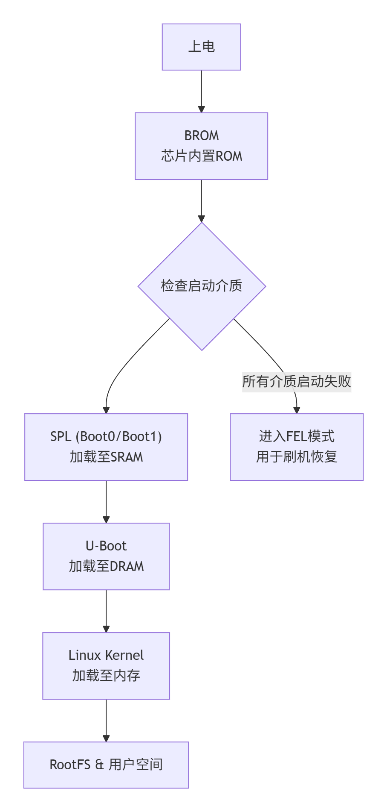
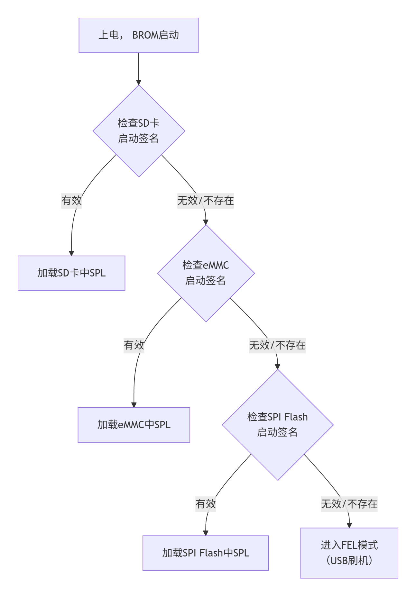

# 嵌入式Linux系统移植与系统镜像制作：uboot+linux+busybox根文件系统

## 目录

- [嵌入式Linux系统移植与系统镜像制作：uboot+linux+busybox根文件系统](#嵌入式linux系统移植与系统镜像制作ubootlinuxbusybox根文件系统)
  - [目录](#目录)
  - [wsl: Ubuntu 22.04开发环境配置](#wsl-ubuntu-2204开发环境配置)
  - [u-boot 的配置、编译、烧写](#u-boot-的配置编译烧写)
  - [Linux 6.18.2内核的配置、编译、烧录](#linux-6182内核的配置编译烧录)
  - [busybox配置和编译/制作根文件系统](#busybox配置和编译制作根文件系统)
  - [制作U盘镜像](#制作u盘镜像)
  - [启动linux](#启动linux)
  - [关于分区大小的调整](#关于分区大小的调整)
  - [其他](#其他)
    - [（按需）处理动态链接库](#按需处理动态链接库)
    - [（按需）制作ramdisk](#按需制作ramdisk)
    - [报错](#报错)

## wsl: Ubuntu 22.04开发环境配置

**安装gcc编译器**

```bash
sudo update
# 安装 build-essential(gcc/g++/make/dpkg-dev/libc...)
sudo apt install build-essential
# 编译u-boot要求gcc版本>10
# Ubuntu 20.04 默认 装的是GCC 9.4
# Ubuntu 22.04 默认 装的是GCC 11.3
```

**在Linux系统安装ARM交叉编译工具**

```bash
# 从arm官网找到下载链接
# 注意不要下载嵌入式的编译工具gcc-arm-none-eabi
wget https://developer.arm.com/-/media/Files/downloads/gnu/14.3.rel1/binrel/arm-gnu-toolchain-14.3.rel1-x86_64-aarch64-none-linux-gnu.tar.xz
# 解压
tar -xJvf arm-gnu-toolchain-14.3.rel1-x86_64-aarch64-none-linux-gnu.tar.xz 

# 安装
mkdir ~/.tools
mv ./arm-gnu-toolchain-14.3.rel1-x86_64-aarch64-none-linux-gnu/ ~/.tools/
vi ~/.bashrc
export PATH=$PATH:/root/.tools/arm-gnu-toolchain-14.3.rel1-x86_64-aarch64-none-linux-gnu/bin/
source ~/.bashrc
```

**配置wsl: Ubuntu 22.04**

```bash
cat >> /etc/wsl.conf << EOF
# 互操作设置
[interop]
# 是否支持启动 Windows 进程
enabled=false
# 是否将 Windows 路径元素添加到 $PATH 环境变量
appendWindowsPath=false
EOF
# 关闭重启 WSL
# wsl.exe --shutdown
# 移动wsl到D盘
# wsl --list --all
# wsl --manage Ubuntu-24.04 --move D:\WSL\Ubuntu
```

**将window下的usb设备共享给wsl环境**

在window系统安装 `usbipd-win`

- 项目地址 <https://github.com/dorssel/usbipd-win>
- 下载地址 <https://github.com/dorssel/usbipd-win/releases/download/v5.3.0/usbipd-win_5.3.0_x64.msi>

**查看windows系统下的usb设备**

```bash
(base) PS C:\Users\ASUS> usbipd list
Connected:
BUSID  VID:PID    DEVICE                                                        STATE
1-5    046d:c341  USB 输入设备                                                  Not shared
1-6    046d:c092  G102 LIGHTSYNC, USB 输入设备, 虚拟 HID 框架(VHF) HID 设备     Not shared
1-8    0b05:19af  AURA LED Controller, USB 输入设备                             Not shared
1-11   174c:55aa  USB Attached SCSI (UAS) 大容量存储设备                        Not shared
3-3    14cd:1212  USB 大容量存储设备                                            Not shared
3-4    10d7:b012  Generic Bluetooth Adapter                                     Not shared

Persisted:
GUID                                  DEVICE
```

**共享USB设备(管理员方式运行)**

```bash
(base) PS C:\Users\ASUS> usbipd bind --busid 3-3
(base) PS C:\Users\ASUS> usbipd list
Connected:
BUSID  VID:PID    DEVICE                                                        STATE
1-5    046d:c341  USB 输入设备                                                  Not shared
1-6    046d:c092  G102 LIGHTSYNC, USB 输入设备, 虚拟 HID 框架(VHF) HID 设备     Not shared
1-8    0b05:19af  AURA LED Controller, USB 输入设备                             Not shared
1-11   174c:55aa  USB Attached SCSI (UAS) 大容量存储设备                        Not shared
3-3    14cd:1212  USB 大容量存储设备                                            Shared
3-4    10d7:b012  Generic Bluetooth Adapter                                     Not shared

Persisted:
GUID                                  DEVICE
```

**附加USB设备给wsl（普通用户权限）**

```bash
# 断开连接: 物理上拔除设备或执行命令
# usbipd detach --busid <busid>

(base) PS C:\Users\ASUS> usbipd attach --wsl --busid 3-3
usbipd: info: Using WSL distribution 'ubuntu2204' to attach; the device will be available in all WSL 2 distributions.
usbipd: info: Loading vhci_hcd module.
usbipd: info: Detected networking mode 'nat'.
usbipd: info: Using IP address 172.20.16.1 to reach the host.
WSL wsl: �hKm0R localhost �NtM�n
                                �FO*g\��P0R WSL0NAT !j_
                                                       N�v WSL
WSL N/ec localhost �Nt0
WSL
WSL

# 查看USB设备状态
(base) PS C:\Users\ASUS> usbipd list
Connected:
BUSID  VID:PID    DEVICE                                                        STATE
1-5    046d:c341  USB 输入设备                                                  Not shared
1-6    046d:c092  G102 LIGHTSYNC, USB 输入设备, 虚拟 HID 框架(VHF) HID 设备     Not shared
1-8    0b05:19af  AURA LED Controller, USB 输入设备                             Not shared
1-11   174c:55aa  USB Attached SCSI (UAS) 大容量存储设备                        Not shared
3-3    14cd:1212  USB 大容量存储设备                                            Attached
3-4    10d7:b012  Generic Bluetooth Adapter                                     Not shared

Persisted:
GUID                                  DEVICE
```

**在wsl查看附加的设备**

```bash
C:\Users\24496>wsl
root@DESKTOP-J2QM63T:~# lsusb
Bus 002 Device 001: ID 1d6b:0003 Linux Foundation 3.0 root hub
Bus 001 Device 002: ID 14cd:1212 Super Top microSD card reader (SY-T18)
Bus 001 Device 001: ID 1d6b:0002 Linux Foundation 2.0 root hub
root@DESKTOP-J2QM63T:~# lsblk
NAME      MAJ:MIN RM   SIZE RO TYPE MOUNTPOINTS
sde         8:112  1  29.7G  0 disk 
└─sde1      8:113  1  29.7G  0 part 
```

## u-boot 的配置、编译、烧写

**u-boot代码的获取**

- 官网获取 <https://u-boot.org/>
- github获取 <https://github.com/u-boot/u-boot>
- 开发板厂商提供

**根据u-boot文档，需先为H618构建 Arm 可信固件 (TF-A)**

```bash
git clone https://git.trustedfirmware.org/TF-A/trusted-firmware-a.git
cd trusted-firmware-a
# 编译 目标平台=sun50i_h616 (根据dts设备树描述，h618的cpu和h616共用一个)
make CROSS_COMPILE=aarch64-none-linux-gnu- PLAT=sun50i_h616 DEBUG=1
export BL31=$(pwd)/build/sun50i_h616/debug/bl31.bin
```

**编译 u-boot**

> [u-boot官方文档基于全志SoC的电路板](https://docs.u-boot.org/en/latest/board/allwinner/sunxi.html)

```bash
wget https://github.com/u-boot/u-boot/archive/refs/tags/v2026.01-rc4.tar.gz
tar -xzvf u-boot-2026.01-rc4.tar.gz
cd u-boot-2026.01-rc4
# 安装后续编译操作的依赖项 否则将依次报错缺失相关文件
sudo apt-get install bison flex swig python3-dev libssl-dev libgnutls28-dev
# export BL31=../trusted-firmware-a/build/sun50i_h616/debug/bl31.bin 
export CROSS_COMPILE=aarch64-none-linux-gnu-
# 查看支持的开发板
ls configs/ | grep orangepi
# 生成配置文件 .config
# cp configs/orangepi_zero2w_defconfig .config
make orangepi_zero2w_defconfig
# 生成 u-boot
make -j4
# 将 ./tools/mkimage 工具添加到环境变量
export PATH=${PATH}:$(pwd)/tools/
```

```bash
 .config - U-Boot 2026.01-rc4 Configuration

# 允许保存环境变量到的设备
 > Environment
          [*] Environment in flash memory   
          [*] Environment in an MMC device 

# 启用默认的bootcmd和bootargs
#   如果忘了配置需进入u-boot后手动修改：setenv bootcmd "run distro_bootcmd";saveenv;
 > Boot options
          [*] Enable a default value for bootcmd      
          (run distro_bootcmd) bootcmd value (NEW)
          [*] Enable boot arguments   
          ()    Boot arguments (NEW)
```


**使用 lsblk 命令 找到usb存储设备**

```bash
root@DESKTOP-J2QM63T:~/u-boot-2026.01-rc4# lsblk
NAME   MAJ:MIN RM   SIZE RO TYPE MOUNTPOINTS
sda      8:0    0 388.6M  1 disk 
sdb      8:16   0   186M  1 disk 
sdc      8:32   0     2G  0 disk [SWAP]
sdd      8:48   0     1T  0 disk /mnt/wslg/distro
                                 /
sde      8:64   1  29.7G  0 disk 
└─sde1   8:65   1  29.7G  0 part 
```


根据容量推测32G内存卡的设备名为`sde`

**全志SOC启动流程和顺序**

- 全志H618芯片在上电后，其内置的BROM会按照一个明确的优先级顺序来检查各种启动介质，并加载其中的程序。
- 
- 启动顺序：`SD卡` -> `EMMC` -> `SPI Flash`
- 

**关于SPL**

- Secondary Program Loader​ 的缩写，中文可译为二级程序加载器
- 在全志H618平台，SPL是引导加载程序,内部有Boot0和Boot1两个执行阶段，它们被先后运行。
- Boot0：
  - 这是SPL的第一阶段。
  - 芯片上电后，固化的BROM（Boot ROM）会从存储介质（如SD卡、eMMC）的特定位置将Boot0代码加载到芯片内部的一小块SRAM中运行。
  - 由于SRAM空间有限（例如只有32KB），Boot0阶段的核心任务非常专注：初始化关键的硬件，尤其是DDR内存。
  - 它为后续加载更大的程序做好准备。
- Boot1：
  - 当Boot0成功初始化DDR内存后，SPL进入第二阶段，即Boot1。
  - 此时程序可以在容量大得多的DDR内存中运行。
  - Boot1的任务更加复杂，包括进行系统调频，以及加载功能完整的U-Boot引导程序到内存中。
- 将SPL分为Boot0和Boot1两个阶段，主要是为了在有限的内部SRAM空间内，通过分步操作完成复杂的启动准备

**SD卡启动位置**

- 传统上，Allwinner BootROM 从 SD 卡的 8KB 扇区（第 16 扇区）加载启动盘。（兼容MBR分区）
- 较新的 SoC（从 2014 年末的 H3 开始）也支持从 128KB 扇区启动。（兼容GPT分区）


**烧录带有SPL的u-boot到sd卡**

```bash
# u-boot-sunxi-with-spl.bin. 该文件可用于 SD 卡、eMMC 设备、SPI 闪存以及基于 USB-OTG 的启动方式 (FEL)
# 块大小（bs）8kB
# 寻找（seek）第1个块的位置
root@DESKTOP-J2QM63T:~/u-boot-2026.01-rc4# dd if=u-boot-sunxi-with-spl.bin  of=/dev/sde bs=8k seek=1
106+1 records in
106+1 records out
872577 bytes (873 kB, 852 KiB) copied, 0.115722 s, 7.5 MB/s
```

**orangepi-zero-2w插入SD卡启动**

```bash
U-Boot SPL 2026.01-rc4 (Dec 20 2025 - 22:04:58 +0800)
DRAM: 1024 MiB
Trying to boot from MMC1
NOTICE:  BL31: v2.14.0(debug):sandbox/v2.14-94-ge9db137a7
NOTICE:  BL31: Built : 05:23:50, Dec 14 2025
NOTICE:  BL31: Detected Allwinner H616 SoC (1823)
NOTICE:  BL31: Found U-Boot DTB at 0x4a0b5be8, model: OrangePi Zero 2W
INFO:    ARM GICv2 driver initialized
INFO:    Configuring SPC Controller
INFO:    Probing for PMIC on I2C:
INFO:    PMIC: found AXP313
INFO:    BL31: Platform setup done
INFO:    BL31: Initializing runtime services
INFO:    BL31: cortex_a53: CPU workaround for erratum 855873 was applied
INFO:    BL31: cortex_a53: CPU workaround for erratum 1530924 was applied
INFO:    PSCI: Suspend is unavailable
INFO:    BL31: Preparing for EL3 exit to normal world
INFO:    Entry point address = 0x4a000000
INFO:    SPSR = 0x3c9
INFO:    Changed devicetree.


U-Boot 2026.01-rc4 (Dec 20 2025 - 22:04:58 +0800) Allwinner Technology

CPU:   Allwinner H616 (SUN50I)
Model: OrangePi Zero 2W
DRAM:  1 GiB
Core:  58 devices, 24 uclasses, devicetree: separate
WDT:   Not starting watchdog@30090a0
MMC:   mmc@4020000: 0
Loading Environment from FAT... ** No valid partitions found **
In:    serial@5000000
Out:   serial@5000000
Err:   serial@5000000
Allwinner mUSB OTG (Peripheral)
Net:   using musb-hdrc, OUT ep1out IN ep1in STATUS ep2in
MAC de:ad:be:ef:00:01
HOST MAC de:ad:be:ef:00:00
RNDIS ready
eth0: usb_ether
starting USB...
USB EHCI 1.00
USB OHCI 1.0
Bus usb@5200000: 1 USB Device(s) found
Bus usb@5200400: 1 USB Device(s) found
       scanning usb for storage devices... 0 Storage Device(s) found
Hit any key to stop autoboot: 0
=> <INTERRUPT>
=> 
```

## Linux 6.18.2内核的配置、编译、烧录

**获取最新源代码**

```bash
wget https://cdn.kernel.org/pub/linux/kernel/v6.x/linux-6.18.2.tar.xz
tar -xvf linux-6.18.2.tar.xz
cd linux-6.18.2
```

**配置并编译**

```bash
sudo apt-get install libncurses-dev
# H618{4核Arm® Cortex®-A53{ ARMv8-A }}
export ARCH=arm64
export CROSS_COMPILE=aarch64-none-linux-gnu-
# make sunxi_defconfig
cp ./arch/arm/configs/sunxi_defconfig .config
make menuconfig
```

**menuconfig：配置Linux内核**
```bash
.config - Linux/arm64 6.18.2 Kernel Configuration

# （按需）编写默认内核启动命令
 → Boot options
        ()  Default kernel command string      

# （按需）启用文件系统对中文和UTF-8的支持
 → File systems → Native language support
        <*>   Simplified Chinese charset (CP936, GB2312) 
        <*>   raditional Chinese charset (Big5)
        <*>   ASCII (United States) 
        <*>   NLS UTF-8

# （按需）启用对Arm32的支持
→ Kernel Features
        [*] Kernel support for 32-bit EL0

# （按需）启用对ROM只读文件系统的支持（cramfs）
→ File systems → Miscellaneous filesystems
        <*>   Compressed ROM file system support (cramfs)

# （按需）启用对RAM文件系统的支持 RamDisk(initrd)(ext2)
→ Device Drivers → Block devices
        <*>   RAM block device support
        (1)     Default number of RAM disks
        (102400) Default RAM disk size (kbytes) # (100M)
 → File systems
        <*> Second extended fs support (DEPRECATED)
 → General setup
        [*] Initial RAM filesystem and RAM disk (initramfs/initrd) support
        [*]   Support initial ramdisk/ramfs compressed using gzip

# （按需）启用对NFS文件系统的支持
→ File systems → Network File Systems
          <*>     NFS client support
          <*>     NFS client support for NFS version 3
          <*>     NFS client support for NFS version 4
          [*]   Root file system on NFS
```
**编译**

```bash
make -j4
```

**查看编译结果**

```bash
root@DESKTOP-J2QM63T:~/linux-6.18.2# ls ./arch/arm64/boot/ -l | grep Image
-rw-r--r--  1 root root 14944768 Dec 25 21:14 Image
-rw-r--r--  1 root root  6172135 Dec 25 21:14 Image.gz

root@DESKTOP-J2QM63T:~/linux-6.18.2/# ls arch/arm64/boot/dts/allwinner -l | grep orangepi-zero2w
-rw-r--r-- 1 root root 21710 Dec 25 21:13 sun50i-h618-orangepi-zero2w.dtb
-rw-rw-r-- 1 root root  4042 Dec 18 21:03 sun50i-h618-orangepi-zero2w.dts
```

## busybox配置和编译/制作根文件系统

**下载并解压源代码**

```bash
wget https://busybox.net/downloads/busybox-1.37.0.tar.bz2
tar -xvf busybox-1.37.0.tar.bz2
cd busybox-1.37.0
```

**配置并编译**

```bash
# 设置环境变量
export ARCH=arm64
export CROSS_COMPILE=aarch64-none-linux-gnu-
# 配置
# 注：如果报错 `error: ‘sha1_process_block64_shaNI’ undeclared`,需关闭SHA1硬件加速 `CONFIG_SHA1_HWACCEL=n`;
make menuconfig
```

**配置**
```bash
# (按需开启) 无线硬件开关控制​ 内核子系统及配套命令行工具，射频设备硬/软开关
-> Miscellaneous Utilities
        [*] rfkill (4.4 kb) 
# （按需）静态编译
Settings  --->   
        [*] Build static binary (no shared libs)   
```

**编译**
```bash
# 编译
make -j44
```

**安装到`_install`目录**

```bash
make install
```


**创建并编写`/etc/inittab`文件**

- 内核启动时，会根据参数 `init=/linuxrc` 执行1号程序
- linuxrc 会 解析 `/etc/inittab`
- 注：如果没有这个文件会执行默认配置

```bash
root@DESKTOP-J2QM63T:~/busybox-1.37.0/_install# mkdir ./etc/
root@DESKTOP-J2QM63T:~/busybox-1.37.0/_install# vi ./etc/inittab
root@DESKTOP-J2QM63T:~/busybox-1.37.0/_install# cat ./etc/inittab
```

```conf
# /etc/inittab

# 文件格式: 
# console_id控制台终端id:run_level运行级别:action行为:process任务
# 对于嵌入式环境 前两项一般为空 所以这里基本是以::开头

# `系统初始化` 行为触发时执行 `/etc/init.d/rcS` 脚本文件
::sysinit:/etc/init.d/rcS

# `开机/重启` 行为触发时执行 `-/bin/sh` 程序
# 符号 `-` 表示这是一个登录shell，会执行/etc/profile和~/.profile或 ~/.bash_profile等脚本文件
::askfirst:-/bin/sh
/dev/ttyS0::askfirst:-/bin/sh # 注：若将这行注释掉，整个配置文件就是默认配置（当没有/etc/inittab文件）
/dev/tty2::askfirst:-/bin/sh
/dev/tty3::askfirst:-/bin/sh
/dev/tty4::askfirst:-/bin/sh

# `按下ctrl+alt+del组合键` 行为触发时执行 `/sbin/reboot` 程序
::ctrlaltdel:/sbin/reboot

# `关机` 行为触发时执行 关闭所有交换分区
::shutdown:/bin/swapoff -a

# `关机` 行为触发时执行 卸载所有文件系统（-a），若失败则只读重新挂载（-r）
::shutdown:/bin/umount -a -r

# 在当 init进程收到重启信号（如 init 6）时，重新执行 init自身
::restart:/sbin/init
```

```conf
# /etc/inittab

::sysinit:/etc/init.d/rcS
::askfirst:-/bin/sh
/dev/ttyS0::askfirst:-/bin/sh
/dev/tty2::askfirst:-/bin/sh
/dev/tty3::askfirst:-/bin/sh
/dev/tty4::askfirst:-/bin/sh
::ctrlaltdel:/sbin/reboot
::shutdown:/bin/swapoff -a
::shutdown:/bin/umount -a -r
::restart:/sbin/init
```

**注：不明确指定ttyS0可能导致一号进程启动后在控制台看不到输出**

- 内核启动时根据启动参数的内容将输出写到：`console=>ttyS0`
- init进程启动时，`console=x=>ttyS0`

```sequence
participant Kernel
participant RootFS as 根文件系统 /dev
participant Init as Init 进程 (BusyBox)
participant Getty as Getty/Shell 进程
participant User as 用户终端

Note over Kernel: 1. 内核启动<br>解析参数 console=ttyS0
Kernel->>Kernel: 将内核控制台绑定到 ttyS0<br>所有内核消息输出至此

Note over Kernel: 2. 挂载根文件系统
Kernel->>RootFS: 挂载包含静态 /dev 的根文件系统

Note over Kernel: 3. 启动 init 进程
Kernel->>Init: 执行 /linuxrc (BusyBox)<br>并将 init 进程的标准输入/输出/错误<br>关联到内核控制台 (ttyS0)

Note over Init: 4. Init 解析 inittab

alt 配置 A: 明确指定 ttyS0
    Init->>Init: 读取行: ttyS0::askfirst:-/bin/sh
    Init->>Getty: 在 /dev/ttyS0 上衍生 getty/Shell 进程
    Getty->>User: 在 ttyS0 上显示 "Please press Enter..."
    User->>Getty: 用户按下回车键
    Getty->>User: 激活 /bin/sh，出现提示符 ~ #
    
else 配置 B: 使用空字段
    Init->>Init: 读取行: ::askfirst:-/bin/sh
    Note over Init: 解释为：在 init 的控制台<br>(即 /dev/console) 上启动 Shell
    Init->>Getty: 尝试在 /dev/console 上衍生进程
    Note over Getty: 关键问题：/dev/console 可能<br>未指向有效的终端设备
    Getty-->>User: 进程无法正常进行 I/O<br>终端无响应，系统“卡住”
end
```


**创建并编写`/etc/profile`文件**

- 根据源代码，busybox会执行`/etc/profile` `~/.profile`文件

```bash
root@DESKTOP-J2QM63T:~/busybox-1.37.0/_install# vi /etc/profile
root@DESKTOP-J2QM63T:~/busybox-1.37.0/_install# cat /etc/profile
```

```bash
# /etc/profile
# 设置环境变量
export PATH="/sbin:/bin:/usr/sbin:/usr/bin:/usr/local/sbin:/usr/local/bin"
export LD_LIBRARY_PATH="/lib:/lib64:/usr/lib:/usr/lib64:/usr/local/lib:/usr/local/lib64"
```

**创建并编写`/etc/init.d/rcS`文件**

```bash
root@DESKTOP-J2QM63T:~/busybox-1.37.0/_install# mkdir etc/init.d
root@DESKTOP-J2QM63T:~/busybox-1.37.0/_install# vi ./etc/init.d/rcS
root@DESKTOP-J2QM63T:~/busybox-1.37.0/_install# chmod +x ./etc/init.d/rcS
root@DESKTOP-J2QM63T:~/busybox-1.37.0/_install# cat ./etc/init.d/rcS
```

```sh
#!/bin/sh

# 挂载虚拟文件系统（或者写在/etc/fstab中，二选一）
# mount -t proc proc /proc
# mount -t sysfs sysfs /sys
# mount -t tmpfs tmpfs /tmp
# mount -t devtmpfs devtmpfs /dev # 内核自动创建设备节点

# 自动挂载所有(-a --all) /etc/fstab 中提及的所有文件系统
mount -a

# 挂载虚拟终端设备 管理伪终端（Pseudo-Terminal） 用于SSH/Telnet
mkdir -p /dev/pts/ && mount -t devpts devpts /dev/pts

# 运行ssh和telnet服务端程序（确保rootfs有这两个命令）
# sshd &
# telnetd &

# led心跳（确保有驱动）
# echo heartbeat > /sys/devices/platform/leds/leds/green:status/trigger
# echo 1 > /sys/devices/platform/leds/leds/green:status/invert

# 扫描(-s) /sys/目录 并在/dev/ 下创建设备节点
# mdev -s 
# 用户空间的热插拔事件处理
# 需确保内核编译时勾选（CONFIG_HOTPLUG等相关环境变量）否则可能提示 /proc/sys/kernel/hotplug: nonexistent directory
# echo /sbin/mdev > /proc/sys/kernel/hotplug

# echo "System initialization completed."
```

**创建并编写`/etc/fstab`文件**

```bash
root@DESKTOP-J2QM63T:~/busybox-1.37.0/_install# vi ./etc/fstab
root@DESKTOP-J2QM63T:~/busybox-1.37.0/_install# cat ./etc/fstab
```

```conf
# /etc/fstab
# 文件格式： 
# 分区  挂载点          文件系统类型  挂载参数  是否需要备份  是否做格式检查

# 挂载虚拟文件系统：（或者写在/etc/init.d/rcS中）
proc    /proc           proc        defaults  0           0 
sysfs   /sys            sysfs       defaults  0           0 
tmpfs   /tmp            tmpfs       defaults  0           0 
tmpfs   /dev            devtmpfs    defaults  0           0 
# devpts  /dev/pts        devpts      defaults  0           0 # 此时没有/dev/pts文件，无法挂载

# 挂载其他分区：
# /dev/xxxs0p1  /boot     fat32      defaults  0           0 
# /dev/???  /mnt/sdcard     ext4      defaults  0           0 
```

**创建`/etc/fstab`文件所需的`/proc /tmp /sys /dev /boot`目录**

```bash
root@DESKTOP-J2QM63T:~/busybox-1.37.0/_install# mkdir proc tmp sys dev
root@DESKTOP-J2QM63T:~/busybox-1.37.0/_install# ls
bin  dev  etc  lib  linuxrc  proc  sbin  sys  tmp  usr
```

**创建必要的目录文件`/mnt /opt /var/run /home /root`**

```bash
root@DESKTOP-J2QM63T:~/busybox-1.37.0/_install# mkdir -p  mnt opt var/run home root
root@DESKTOP-J2QM63T:~/busybox-1.37.0/_install# ls
bin  dev  etc  home  lib  linuxrc  mnt  opt  proc  root  sbin  sys  tmp  usr  var
```

**创建必要的设备文件`/dev/console /dev/null`**

- 注：这些手动创建的设备文件会在执行mount -a挂载tmpfs到/dev后被覆盖掉，但会在执行umount -a卸载后出现。主要起到的作用是临时为linuxrc程序提供设备文件。
- 

```bash
root@DESKTOP-J2QM63T:~/busybox-1.37.0/_install# ls /dev/console /dev/null  -al
crw--w---- 1 root tty  5, 1 Dec 27 03:59 /dev/console
crw-rw-rw- 1 root root 1, 3 Dec 27 03:59 /dev/null
# 命令格式： mknod创建节点 path路径 c字符设备 5主设备号 1次设备号
root@DESKTOP-J2QM63T:~/busybox-1.37.0/_install# sudo mknod dev/console c 5 1
root@DESKTOP-J2QM63T:~/busybox-1.37.0/_install# sudo mknod dev/null c 1 3
root@DESKTOP-J2QM63T:~/busybox-1.37.0/_install# sudo mknod dev/ttyS0 c 4 64 # 最好添加
root@DESKTOP-J2QM63T:~/busybox-1.37.0/_install# sudo mknod dev/ram0 b 1 0  # 按需添加
root@DESKTOP-J2QM63T:~/busybox-1.37.0/_install# ls dev/ -al
total 8
drwxr-xr-x  2 root root  4096 Dec 27 22:23 .
drwxr-xr-x 16 root root  4096 Dec 27 19:44 ..
crw--w--w-  1 root root 5,  1 Dec 27 22:23 console
crw-rw-rw-  1 root root 1,  3 Dec 27 22:23 null
crw-rw-rw-  1 root root 4, 64 Dec 27 22:23 ttyS0
brw-r--r-- 1 root root 1, 0 Dec 27 22:23 ram0
```

**创建并编写`/etc/passwd /etc/group /etc/shadow`**

```bash
root@DESKTOP-J2QM63T:~/busybox-1.37.0/_install# vi etc/passwd
root@DESKTOP-J2QM63T:~/busybox-1.37.0/_install# cat etc/passwd
```

```conf
# 格式：
# 用户名:密码占位符x:用户id:组id:用户描述信息:家目录:shell路径
root:x:0:0:root:/root:/bin/sh
# daemon:x:1:1:daemon:/usr/sbin:/usr/sbin/nologin
```

```bash
root@DESKTOP-J2QM63T:~/busybox-1.37.0/_install# vi etc/shadow 
root@DESKTOP-J2QM63T:~/busybox-1.37.0/_install# cat etc/shadow 
```

```conf
# 格式：
# 用户名:加密后的密码或空密码*:最后一次修改时间:最小修改时间间隔:密码有效期:密码需要变更前的警告天数:密码过期后的宽限时间:账号失效时间:保留字段
# 最后一次修改时间： 相对于 1970-01-01 的天数
# 最小修改时间间隔： 设置为 1 则1天之内无法再次修改代码
# 密码有效期： 默认99999 也就是 273年
# 密码需要变更前的警告天数： 默认7 密码过期前7天每天提示需修改密码
# 密码过期后的宽限时间: 设置为10表示密码过期后宽限10天完全禁用 0密码过期立即禁止登录 -1密码永不失效
root:*:20094:0:99999:7:::
# daemon:*:20094:0:99999:7:::
```

```bash
root@DESKTOP-J2QM63T:~/busybox-1.37.0/_install# vi etc/group
root@DESKTOP-J2QM63T:~/busybox-1.37.0/_install# cat etc/group
```

```conf
# 格式：
# 组名:空密码占位符x或加密后的密码:组id:组内用户列表
root:x:0:
daemon:x:1:
```

**拷贝内核文件、设备树文件到/boot目录**

```bash
root@DESKTOP-J2QM63T:~/busybox-1.37.0/_install# cp ~/linux-6.18.2/arch/arm64/boot/Image.gz boot/
root@DESKTOP-J2QM63T:~/busybox-1.37.0/_install# cp ~/linux-6.18.2/arch/arm64/boot/dts/allwinner/sun50i-h618-orangepi-zero2w.dt* boot/
root@DESKTOP-J2QM63T:~/busybox-1.37.0/_install# ls boot/ -al
total 6172
drwxr-xr-x  2 root root    4096 Jan 25 09:54 .
drwxr-xr-x 16 root root    4096 Jan 25 09:48 ..
-rw-r--r--  1 root root 6272820 Jan 25 09:54 Image.gz
-rw-r--r--  1 root root   22332 Jan 25 10:53 sun50i-h618-orangepi-zero2w.dtb
-rw-r--r--  1 root root    5011 Jan 25 10:53 sun50i-h618-orangepi-zero2w.dts
```

**编写 /boot/uEnv.txt 文件**

```bash
# /boot/uEnv.txt
bootcmd=load mmc 0 ${kernel_addr_r} /boot/Image.gz;load mmc 0 ${fdt_addr_r} /boot/sun50i-h618-orangepi-zero2w.dtb;booti ${kernel_addr_r} - ${fdt_addr_r};
bootargs=console=ttyS0,115200 root=/dev/mmcblk0p1 rootfstype=ext4 rootwait rw init=/linuxrc debug panic=30

# u-boot启动测试代码：
# setenv bootcmd "load mmc 0 ${kernel_addr_r} /boot/Image.gz;load mmc 0 ${fdt_addr_r} /boot/sun50i-h618-orangepi-zero2w.dtb;booti ${kernel_addr_r} - ${fdt_addr_r};"
# setenv bootargs "console=ttyS0,115200 root=/dev/mmcblk0p1 rootfstype=ext4 rootwait rw init=/linuxrc debug panic=30"
# saveenv
# run bootcmd
```


**编写 boot.cmd 并编译得到 boot.scr 文件**

- 注：boot.scr文件由distro_bootcmd命令调用

```bash
# 加载环境变量
load mmc 0:1 ${loadaddr} /boot/uEnv.txt
# 导入环境变量
env import -t ${loadaddr} ${filesize}
# 执行在环境变量中定义的bootcmd命令
run bootcmd
# 编译: mkimage -A arm -O linux -T script -C none -d boot.cmd boot.scr
```

**将uEnv.txt,boot.cmd,boot.scr拷贝到/boot/下**

```bash
root@DESKTOP-J2QM63T:~/busybox-1.37.0/_install# ls boot/ -al
total 6216
drwxr-xr-x  2 root root    4096 Jan 25 11:45 .
drwxr-xr-x 17 root root    4096 Jan 25 10:21 ..
-rw-r--r--  1 root root 6272820 Jan 25 11:45 Image.gz
-rw-r--r--  1 root root     247 Jan 25 11:45 boot.cmd
-rw-r--r--  1 root root     319 Jan 25 11:45 boot.scr
-rw-r--r--  1 root root   22332 Jan 25 11:45 sun50i-h618-orangepi-zero2w.dtb
-rw-r--r--  1 root root    5011 Jan 25 11:45 sun50i-h618-orangepi-zero2w.dts
-rw-r--r--  1 root root     264 Jan 25 11:45 uEnv.txt
root@DESKTOP-J2QM63T:~/busybox-1.37.0/_install# 
```

## 制作U盘镜像


**找到sd卡设备**

```bash
root@DESKTOP-J2QM63T:~/linux-6.18.2# lsblk
NAME MAJ:MIN RM   SIZE RO TYPE MOUNTPOINTS
sda    8:0    0 388.6M  1 disk 
sdb    8:16   0   186M  1 disk 
sdc    8:32   0     2G  0 disk [SWAP]
sdd    8:48   0     1T  0 disk /mnt/wslg/distro
                               /
sde    8:64   1  29.7G  0 disk 
```

**填充文件**

```bash
root@DESKTOP-J2QM63T:~# dd if=/dev/zero of=linux-6.18.2-busybox.img bs=1M count=1024
1024+0 records in
1024+0 records out
1073741824 bytes (1.1 GB, 1.0 GiB) copied, 0.993465 s, 1.1 GB/s
```

**初始化MBR分区表，创建一个分区**

```bash
root@DESKTOP-J2QM63T:~# fdisk linux-6.18.2-busybox.img

Welcome to fdisk (util-linux 2.37.2).
Changes will remain in memory only, until you decide to write them.
Be careful before using the write command.

Device does not contain a recognized partition table.
Created a new DOS disklabel with disk identifier 0xbe5229a3.

Command (m for help): m

Help:

  DOS (MBR)
   a   toggle a bootable flag
   b   edit nested BSD disklabel
   c   toggle the dos compatibility flag

  Generic
   d   delete a partition
   F   list free unpartitioned space
   l   list known partition types
   n   add a new partition
   p   print the partition table
   t   change a partition type
   v   verify the partition table
   i   print information about a partition

  Misc
   m   print this menu
   u   change display/entry units
   x   extra functionality (experts only)

  Script
   I   load disk layout from sfdisk script file
   O   dump disk layout to sfdisk script file

  Save & Exit
   w   write table to disk and exit
   q   quit without saving changes

  Create a new label
   g   create a new empty GPT partition table
   G   create a new empty SGI (IRIX) partition table
   o   create a new empty DOS partition table
   s   create a new empty Sun partition table


Command (m for help): o
Created a new DOS disklabel with disk identifier 0xaf31c48f.

Command (m for help): n
Partition type
   p   primary (0 primary, 0 extended, 4 free)
   e   extended (container for logical partitions)
Select (default p): p
Partition number (1-4, default 1): 
First sector (2048-2097151, default 2048): 
Last sector, +/-sectors or +/-size{K,M,G,T,P} (2048-2097151, default 2097151): 

Created a new partition 1 of type 'Linux' and of size 1023 MiB.

Command (m for help): w
The partition table has been altered.
Syncing disks.

root@DESKTOP-J2QM63T:~# 
```

**挂载u盘镜像文件**

```bash
# losetup
# -f, find first unused device
# -P, create a partitioned loop device
# --show print device name after setup (with -f)
#  -d, --detach <loopdev>...     detach one or more devices
root@DESKTOP-J2QM63T:~# losetup -f -P --show linux-6.18.2-busybox.img 
/dev/loop0
# sudo losetup -d /dev/loop0  # 解除Loop设备关联

root@DESKTOP-J2QM63T:~# ls /dev/loop0*
/dev/loop0  /dev/loop0p1
```

**格式化分区**

```bash
root@DESKTOP-J2QM63T:~# mkfs.ext4 /dev/loop0p1 
mke2fs 1.46.5 (30-Dec-2021)
Discarding device blocks: done                            
Creating filesystem with 261888 4k blocks and 65536 inodes
Filesystem UUID: dfa039f1-43b4-470a-8147-871435d35de4
Superblock backups stored on blocks: 
        32768, 98304, 163840, 229376

Allocating group tables: done                            
Writing inode tables: done                            
Creating journal (4096 blocks): done
Writing superblocks and filesystem accounting information: done
```

**挂载分区**

```bash
root@DESKTOP-J2QM63T:~# mount /dev/loop0p1 /mnt/root
```

**写入 `u-boot`**

```bash
root@DESKTOP-J2QM63T:~# dd if=~/u-boot-2026.01-rc4/u-boot-sunxi-with-spl.bin  of=/dev/loop0 bs=1k seek=8
852+1 records in
852+1 records out
872641 bytes (873 kB, 852 KiB) copied, 0.0325007 s, 26.8 MB/s
```

**写入 `rootfs`**

```bash
root@DESKTOP-J2QM63T:~# cp -a busybox-1.37.0/_install/* /mnt/root/

# 确保缓存区的数据全部写入到*.img文件
root@DESKTOP-J2QM63T:~/linux-6.18.2# sync
```

**写入*.img到sd卡**

```bash
root@DESKTOP-J2QM63T:~# lsblk
NAME      MAJ:MIN RM   SIZE RO TYPE MOUNTPOINTS
loop0       7:1    0 257.1M  0 loop 
└─loop0p1 259:2    0 256.1M  0 part /mnt/root
sdh         8:112  1  29.7G  0 disk 
└─sdh1      8:113  1  29.7G  0 part 
root@DESKTOP-J2QM63T:~# dd if=linux-6.18.2-busybox.img of=/dev/sdh bs=100M seek=0
2+1 records in
2+1 records out
269598720 bytes (270 MB, 257 MiB) copied, 33.0138 s, 8.2 MB/s
root@DESKTOP-J2QM63T:~# sync
```

**卸载*.img文件**

```bash
umount  /mnt/root/
losetup -d /dev/loop0
```

## 启动linux

```bash
U-Boot SPL 2026.01-rc4 (Jan 10 2026 - 02:31:30 +0800)
DRAM: 1024 MiB
Trying to boot from MMC1
NOTICE:  BL31: v2.14.0(debug):sandbox/v2.14-94-ge9db137a7
NOTICE:  BL31: Built : 05:23:50, Dec 14 2025
NOTICE:  BL31: Detected Allwinner H616 SoC (1823)
NOTICE:  BL31: Found U-Boot DTB at 0x4a0b5c28, model: OrangePi Zero 2W
INFO:    ARM GICv2 driver initialized
INFO:    Configuring SPC Controller
INFO:    Probing for PMIC on I2C:
INFO:    PMIC: found AXP313
INFO:    BL31: Platform setup done
INFO:    BL31: Initializing runtime services
INFO:    BL31: cortex_a53: CPU workaround for erratum 855873 was applied
INFO:    BL31: cortex_a53: CPU workaround for erratum 1530924 was applied
INFO:    PSCI: Suspend is unavailable
INFO:    BL31: Preparing for EL3 exit to normal world
INFO:    Entry point address = 0x4a000000
INFO:    SPSR = 0x3c9
INFO:    Changed devicetree.


U-Boot 2026.01-rc4 (Jan 10 2026 - 02:31:30 +0800) Allwinner Technology

CPU:   Allwinner H616 (SUN50I)
Model: OrangePi Zero 2W
DRAM:  1 GiB
Core:  58 devices, 24 uclasses, devicetree: separate
WDT:   Not starting watchdog@30090a0
MMC:   mmc@4020000: 0
Loading Environment from MMC... Reading from MMC(0)... OK
In:    serial@5000000
Out:   serial@5000000
Err:   serial@5000000
Allwinner mUSB OTG (Peripheral)
Net:   using musb-hdrc, OUT ep1out IN ep1in STATUS ep2in
MAC de:ad:be:ef:00:01
HOST MAC de:ad:be:ef:00:00
RNDIS ready
eth0: usb_ether
starting USB...
USB EHCI 1.00
USB OHCI 1.0
Bus usb@5200000: 1 USB Device(s) found
Bus usb@5200400: 1 USB Device(s) found
       scanning usb for storage devices... 0 Storage Device(s) found
Hit any key to stop autoboot: 0
switch to partitions #0, OK
mmc0 is current device
Scanning mmc 0:1...
Found U-Boot script /boot/boot.scr
319 bytes read in 2 ms (155.3 KiB/s)
## Executing script at 4fc00000
261 bytes read in 1 ms (254.9 KiB/s)
6272820 bytes read in 261 ms (22.9 MiB/s)
22332 bytes read in 2 ms (10.6 MiB/s)
   Uncompressing Kernel Image to 0
Moving Image from 0x40080000 to 0x40200000, end=0x410d0000
## Flattened Device Tree blob at 4fa00000
   Booting using the fdt blob at 0x4fa00000
Working FDT set to 4fa00000
   Loading Device Tree to 0000000049ff7000, end 0000000049fff73b ... OK
Working FDT set to 49ff7000

Starting kernel ...

[    0.000000] Booting Linux on physical CPU 0x0000000000 [0x410fd034]
[    0.000000] Linux version 6.18.2-gb780ee9e82b1-dirty (root@DESKTOP-J2QM63T) (aarch64-none-linux-gnu-gcc (Arm GNU Toolchain 14.3.Rel1 (Build arm-14.174)) 14.3.1 20250623, GNU ld (Arm GNU Toolchain 14.3.Rel1 (Build arm-14.174)) 2.44.0.20250616) #3 SMP Thu Jan 22 23:10:46 CST 2026
[    0.000000] Machine model: OrangePi Zero 2W
[    0.000000] efi: UEFI not found.
[    0.000000] OF: reserved mem: 0x0000000040000000..0x000000004003ffff (256 KiB) nomap non-reusable secmon@40000000
[    0.000000] Zone ranges:
[    0.000000]   DMA      [mem 0x0000000040000000-0x000000007fffffff]
[    0.000000]   DMA32    empty
[    0.000000]   Normal   empty
[    0.000000] Movable zone start for each node
[    0.000000] Early memory node ranges
[    0.000000]   node   0: [mem 0x0000000040000000-0x000000004003ffff]
[    0.000000]   node   0: [mem 0x0000000040040000-0x000000007fffffff]
[    0.000000] Initmem setup node 0 [mem 0x0000000040000000-0x000000007fffffff]
[    0.000000] cma: Reserved 16 MiB at 0x000000007dc00000
[    0.000000] psci: probing for conduit method from DT.
[    0.000000] psci: PSCIv1.1 detected in firmware.
[    0.000000] psci: Using standard PSCI v0.2 function IDs
[    0.000000] psci: MIGRATE_INFO_TYPE not supported.
[    0.000000] psci: SMC Calling Convention v1.5
[    0.000000] percpu: Embedded 20 pages/cpu s42008 r8192 d31720 u81920
[    0.000000] pcpu-alloc: s42008 r8192 d31720 u81920 alloc=20*4096
[    0.000000] pcpu-alloc: [0] 0 [0] 1 [0] 2 [0] 3 
[    0.000000] Detected VIPT I-cache on CPU0
[    0.000000] alternatives: applying boot alternatives
[    0.000000] Kernel command line: console=ttyS0,115200 root=/dev/mmcblk0p1 rootfstype=ext4 rootwait rw init=/linuxrc debug panic=30
[    0.000000] printk: log buffer data + meta data: 131072 + 458752 = 589824 bytes
[    0.000000] Dentry cache hash table entries: 131072 (order: 8, 1048576 bytes, linear)
[    0.000000] Inode-cache hash table entries: 65536 (order: 7, 524288 bytes, linear)
[    0.000000] software IO TLB: SWIOTLB bounce buffer size adjusted to 1MB
[    0.000000] software IO TLB: area num 4.
[    0.000000] software IO TLB: mapped [mem 0x000000007da80000-0x000000007db80000] (1MB)
[    0.000000] Built 1 zonelists, mobility grouping on.  Total pages: 262144
[    0.000000] mem auto-init: stack:all(zero), heap alloc:off, heap free:off
[    0.000000] SLUB: HWalign=64, Order=0-3, MinObjects=0, CPUs=4, Nodes=1
[    0.000000] rcu: Hierarchical RCU implementation.
[    0.000000] rcu: 	RCU restricting CPUs from NR_CPUS=8 to nr_cpu_ids=4.
[    0.000000] rcu: RCU calculated value of scheduler-enlistment delay is 25 jiffies.
[    0.000000] rcu: Adjusting geometry for rcu_fanout_leaf=16, nr_cpu_ids=4
[    0.000000] NR_IRQS: 64, nr_irqs: 64, preallocated irqs: 0
[    0.000000] Root IRQ handler: gic_handle_irq
[    0.000000] GIC: Using split EOI/Deactivate mode
[    0.000000] rcu: srcu_init: Setting srcu_struct sizes based on contention.
[    0.000000] arch_timer: cp15 timer running at 24.00MHz (phys).
[    0.000000] clocksource: arch_sys_counter: mask: 0xffffffffffffff max_cycles: 0x588fe9dc0, max_idle_ns: 440795202592 ns
[    0.000000] sched_clock: 56 bits at 24MHz, resolution 41ns, wraps every 4398046511097ns
[    0.000377] Console: colour dummy device 80x25
[    0.000437] Calibrating delay loop (skipped), value calculated using timer frequency.. 48.00 BogoMIPS (lpj=96000)
[    0.000450] pid_max: default: 32768 minimum: 301
[    0.000603] Mount-cache hash table entries: 2048 (order: 2, 16384 bytes, linear)
[    0.000615] Mountpoint-cache hash table entries: 2048 (order: 2, 16384 bytes, linear)
[    0.002352] rcu: Hierarchical SRCU implementation.
[    0.002356] rcu: 	Max phase no-delay instances is 1000.
[    0.002630] Timer migration: 1 hierarchy levels; 8 children per group; 1 crossnode level
[    0.002743] EFI services will not be available.
[    0.002945] smp: Bringing up secondary CPUs ...
[    0.003416] Detected VIPT I-cache on CPU1
[    0.003547] CPU1: Booted secondary processor 0x0000000001 [0x410fd034]
[    0.004103] Detected VIPT I-cache on CPU2
[    0.004196] CPU2: Booted secondary processor 0x0000000002 [0x410fd034]
[    0.004658] Detected VIPT I-cache on CPU3
[    0.004751] CPU3: Booted secondary processor 0x0000000003 [0x410fd034]
[    0.004818] smp: Brought up 1 node, 4 CPUs
[    0.004825] SMP: Total of 4 processors activated.
[    0.004829] CPU: All CPU(s) started at EL2
[    0.004833] CPU features: detected: 32-bit EL0 Support
[    0.004838] CPU features: detected: CRC32 instructions
[    0.004848] CPU features: detected: PMUv3
[    0.004884] alternatives: applying system-wide alternatives
[    0.005518] Memory: 991756K/1048576K available (9216K kernel code, 1220K rwdata, 2960K rodata, 1280K init, 304K bss, 36964K reserved, 16384K cma-reserved)
[    0.006016] devtmpfs: initialized
[    0.009963] clocksource: jiffies: mask: 0xffffffff max_cycles: 0xffffffff, max_idle_ns: 7645041785100000 ns
[    0.009984] posixtimers hash table entries: 2048 (order: 3, 32768 bytes, linear)
[    0.010090] futex hash table entries: 1024 (65536 bytes on 1 NUMA nodes, total 64 KiB, linear).
[    0.010491] 28976 pages in range for non-PLT usage
[    0.010495] 520496 pages in range for PLT usage
[    0.010553] pinctrl core: initialized pinctrl subsystem
[    0.011080] DMI not present or invalid.
[    0.011609] NET: Registered PF_NETLINK/PF_ROUTE protocol family
[    0.012860] DMA: preallocated 128 KiB GFP_KERNEL pool for atomic allocations
[    0.013312] DMA: preallocated 128 KiB GFP_KERNEL|GFP_DMA pool for atomic allocations
[    0.014149] DMA: preallocated 128 KiB GFP_KERNEL|GFP_DMA32 pool for atomic allocations
[    0.015026] thermal_sys: Registered thermal governor 'step_wise'
[    0.015111] hw-breakpoint: found 6 breakpoint and 4 watchpoint registers.
[    0.015183] ASID allocator initialised with 65536 entries
[    0.018105] /soc/clock@3001000: Fixed dependency cycle(s) with /soc/rtc@7000000
[    0.018146] /soc/interrupt-controller@3021000: Fixed dependency cycle(s) with /soc/interrupt-controller@3021000
[    0.018265] /soc/rtc@7000000: Fixed dependency cycle(s) with /soc/clock@3001000
[    0.018277] /soc/rtc@7000000: Fixed dependency cycle(s) with /soc/clock@7010000
[    0.018290] /soc/clock@7010000: Fixed dependency cycle(s) with /soc/clock@3001000
[    0.018302] /soc/clock@7010000: Fixed dependency cycle(s) with /soc/rtc@7000000
[    0.018800] /soc/clock@3001000: Fixed dependency cycle(s) with /soc/rtc@7000000
[    0.021134] /soc/clock@3001000: Fixed dependency cycle(s) with /soc/rtc@7000000
[    0.021240] /soc/rtc@7000000: Fixed dependency cycle(s) with /soc/clock@3001000
[    0.021293] /soc/rtc@7000000: Fixed dependency cycle(s) with /soc/clock@7010000
[    0.021385] /soc/rtc@7000000: Fixed dependency cycle(s) with /soc/clock@7010000
[    0.021439] /soc/clock@7010000: Fixed dependency cycle(s) with /soc/clock@3001000
[    0.021496] /soc/clock@7010000: Fixed dependency cycle(s) with /soc/rtc@7000000
[    0.024934] SCSI subsystem initialized
[    0.025046] libata version 3.00 loaded.
[    0.025203] usbcore: registered new interface driver usbfs
[    0.025236] usbcore: registered new interface driver hub
[    0.025267] usbcore: registered new device driver usb
[    0.025394] mc: Linux media interface: v0.10
[    0.025431] videodev: Linux video capture interface: v2.00
[    0.025467] pps_core: LinuxPPS API ver. 1 registered
[    0.025470] pps_core: Software ver. 5.3.6 - Copyright 2005-2007 Rodolfo Giometti <giometti@linux.it>
[    0.025484] PTP clock support registered
[    0.025781] Advanced Linux Sound Architecture Driver Initialized.
[    0.026579] clocksource: Switched to clocksource arch_sys_counter
[    0.033375] NET: Registered PF_INET protocol family
[    0.033519] IP idents hash table entries: 16384 (order: 5, 131072 bytes, linear)
[    0.034529] tcp_listen_portaddr_hash hash table entries: 512 (order: 1, 8192 bytes, linear)
[    0.034551] Table-perturb hash table entries: 65536 (order: 6, 262144 bytes, linear)
[    0.034561] TCP established hash table entries: 8192 (order: 4, 65536 bytes, linear)
[    0.034644] TCP bind hash table entries: 8192 (order: 6, 262144 bytes, linear)
[    0.034945] TCP: Hash tables configured (established 8192 bind 8192)
[    0.035037] UDP hash table entries: 512 (order: 3, 32768 bytes, linear)
[    0.035083] UDP-Lite hash table entries: 512 (order: 3, 32768 bytes, linear)
[    0.035212] NET: Registered PF_UNIX/PF_LOCAL protocol family
[    0.035597] RPC: Registered named UNIX socket transport module.
[    0.035602] RPC: Registered udp transport module.
[    0.035605] RPC: Registered tcp transport module.
[    0.035608] RPC: Registered tcp-with-tls transport module.
[    0.035611] RPC: Registered tcp NFSv4.1 backchannel transport module.
[    0.036590] Initialise system trusted keyrings
[    0.036717] workingset: timestamp_bits=62 max_order=18 bucket_order=0
[    0.037243] NFS: Registering the id_resolver key type
[    0.037275] Key type id_resolver registered
[    0.037279] Key type id_legacy registered
[    0.037333] Key type asymmetric registered
[    0.037340] Asymmetric key parser 'x509' registered
[    0.037384] Block layer SCSI generic (bsg) driver version 0.4 loaded (major 246)
[    0.037391] io scheduler mq-deadline registered
[    0.037396] io scheduler kyber registered
[    0.037412] io scheduler bfq registered
[    0.084773] Serial: 8250/16550 driver, 8 ports, IRQ sharing disabled
[    0.092196] CAN device driver interface
[    0.093247] i2c_dev: i2c /dev entries driver
[    0.094555] sunxi-wdt 30090a0.watchdog: Watchdog enabled (timeout=16 sec, nowayout=0)
[    0.095114] SMCCC: SOC_ID: ID = jep106:091e:1823 Revision = 0x00000002
[    0.095710] usbcore: registered new interface driver usbhid
[    0.095715] usbhid: USB HID core driver
[    0.096621] hw perfevents: enabled with armv8_cortex_a53 PMU driver, 7 (0,8000003f) counters available
[    0.101371] NET: Registered PF_PACKET protocol family
[    0.101380] can: controller area network core
[    0.101419] NET: Registered PF_CAN protocol family
[    0.101425] can: raw protocol
[    0.101431] can: broadcast manager protocol
[    0.101438] can: netlink gateway - max_hops=1
[    0.101519] Key type dns_resolver registered
[    0.107553] Loading compiled-in X.509 certificates
[    0.124022] ehci-platform 5200000.usb: EHCI Host Controller
[    0.124053] ehci-platform 5200000.usb: new USB bus registered, assigned bus number 1
[    0.124109] ohci-platform 5200400.usb: Generic Platform OHCI controller
[    0.124126] ohci-platform 5200400.usb: new USB bus registered, assigned bus number 2
[    0.124145] usb_phy_generic usb_phy_generic.0.auto: dummy supplies not allowed for exclusive requests (id=vbus)
[    0.124216] ohci-platform 5200400.usb: irq 21, io mem 0x05200400
[    0.124686] ehci-platform 5200000.usb: irq 20, io mem 0x05200000
[    0.132048] clk: Disabling unused clocks
[    0.132195] PM: genpd: Disabling unused power domains
[    0.132203] ALSA device list:
[    0.132207]   #0: h616-audio-codec
[    0.132261] Warning: unable to open an initial console.
[    0.132277] check access for rdinit=/init failed: -2, ignoring
[    0.134583] ehci-platform 5200000.usb: USB 2.0 started, EHCI 1.00
[    0.135193] hub 1-0:1.0: USB hub found
[    0.135222] hub 1-0:1.0: 1 port detected
[    0.183107] hub 2-0:1.0: USB hub found
[    0.183137] hub 2-0:1.0: 1 port detected
[    0.183529] Waiting for root device /dev/mmcblk0p1...
[   10.208033] gpio gpiochip0: Static allocation of GPIO base is deprecated, use dynamic allocation.
[   10.208449] sun50i-h616-r-pinctrl 7022000.pinctrl: initialized sunXi PIO driver
[   10.210468] sun50i-h616-r-pinctrl 7022000.pinctrl: supply vcc-pl not found, using dummy regulator
[   10.211225] /soc/i2c@7081400/pmic@36: Fixed dependency cycle(s) with /soc/pinctrl@300b000
[   10.212420] gpio gpiochip1: Static allocation of GPIO base is deprecated, use dynamic allocation.
[   10.219398] sun50i-h616-pinctrl 300b000.pinctrl: initialized sunXi PIO driver
[   10.220212] dw-apb-uart 5000000.serial: Error applying setting, reverse things back
[   10.220980] sun6i-spi 5010000.spi: Error applying setting, reverse things back
[   10.221128] sunxi-mmc 4020000.mmc: Error applying setting, reverse things back
[   10.221406] axp20x-i2c 0-0036: AXP20x variant AXP313a found
[   10.221746] sunxi-mmc 4021000.mmc: Error applying setting, reverse things back
[   10.223243] axp20x-i2c 0-0036: AXP20X driver loaded
[   10.223990] dw-apb-uart 5000000.serial: Error applying setting, reverse things back
[   10.224252] sun6i-spi 5010000.spi: Error applying setting, reverse things back
[   10.225114] platform wifi-pwrseq: deferred probe pending: pwrseq_simple: reset GPIOs not ready
[   10.225121] platform leds: deferred probe pending: leds-gpio: Failed to get GPIO '/leds/led-0'
[   10.225127] platform 5000000.serial: deferred probe pending: (reason unknown)
[   10.225133] platform 5010000.spi: deferred probe pending: (reason unknown)
[   10.225261] sunxi-mmc 4020000.mmc: Error applying setting, reverse things back
[   10.225515] sunxi-mmc 4021000.mmc: Error applying setting, reverse things back
[   10.228625] printk: legacy console [ttyS0] disabled
[   10.249247] 5000000.serial: ttyS0 at MMIO 0x5000000 (irq = 297, base_baud = 1500000) is a 16550A
[   10.249301] printk: legacy console [ttyS0] enabled
[   11.438490] sunxi-mmc 4020000.mmc: Got CD GPIO
[   11.438747] sunxi-mmc 4021000.mmc: allocated mmc-pwrseq
[   11.468326] sunxi-mmc 4020000.mmc: initialized, max. request size: 16384 KB, uses new timings mode
[   11.510694] mmc0: host does not support reading read-only switch, assuming write-enable
[   11.521557] mmc0: new high speed SDHC card at address aaaa
[   11.527727] mmcblk0: mmc0:aaaa SD32G 29.7 GiB
[   11.534215]  mmcblk0: p1
[   11.675131] sunxi-mmc 4021000.mmc: initialized, max. request size: 16384 KB, uses new timings mode
[   11.700840] mmc1: new high speed SDIO card at address 8800
[   11.747151] EXT4-fs (mmcblk0p1): recovery complete
[   11.753164] EXT4-fs (mmcblk0p1): mounted filesystem ef5f6bf4-7409-4062-8c0c-0872aa382dd9 r/w with ordered data mode. Quota mode: disabled.
[   11.765647] VFS: Mounted root (ext4 filesystem) on device 179:1.
[   11.771727] devtmpfs: mounted
[   11.775308] Freeing unused kernel memory: 1280K
[   11.779919] Run /linuxrc as init process
[   11.783848]   with arguments:
[   11.786821]     /linuxrc
[   11.789352]   with environment:
[   11.792496]     HOME=/
[   11.794859]     TERM=linux

Please press Enter to activate this console. 
~ # [  312.822603] random: crng init done

~ # ls
bin         etc         lost+found  proc        sys         var
boot        home        mnt         root        tmp
dev         linuxrc     opt         sbin        usr
~ # ls /boot/
Image.gz                         sun50i-h618-orangepi-zero2w.dtb
boot.cmd                         sun50i-h618-orangepi-zero2w.dts
boot.scr                         uEnv.txt
~ # 
```

## 关于分区大小的调整

**这里有几个问题**

- 制作的*.img镜像为了保证写入sd卡的时间尽可能短，所以文件以及文件系统大小都设置的很小
- busybox没有调整分区大小的命令resize2fs
- 即使有resize2fs命令，也无法在挂载root分区后执行，必须先卸载。

**解决方法**

- 不调整分区大小，直接再fdisk和mkfs命令分区，修改/etc/fstab将新分区挂载到/root或用户目录下。
- 制作initramfs,即内存文件系统镜像，在内核启动阶段挂载内存文件系统，调整完分区大小后再挂载根分区。

```bash
~ # fdisk /dev/mmcblk0

The number of cylinders for this disk is set to 56055.
There is nothing wrong with that, but this is larger than 1024,
and could in certain setups cause problems with:
1) software that runs at boot time (e.g., old versions of LILO)
2) booting and partitioning software from other OSs
   (e.g., DOS FDISK, OS/2 FDISK)

Command (m for help): m
Command Action
a	toggle a bootable flag
b	edit bsd disklabel
c	toggle the dos compatibility flag
d	delete a partition
l	list known partition types
n	add a new partition
o	create a new empty DOS partition table
p	print the partition table
q	quit without saving changes
s	create a new empty Sun disklabel
t	change a partition's system id
u	change display/entry units
v	verify the partition table
w	write table to disk and exit
x	extra functionality (experts only)

Command (m for help): p
Disk /dev/mmcblk0: 30 GB, 31914983424 bytes, 62333952 sectors
56055 cylinders, 139 heads, 8 sectors/track
Units: sectors of 1 * 512 = 512 bytes

Device       Boot StartCHS    EndCHS        StartLBA     EndLBA    Sectors  Size Id Type
/dev/mmcblk0p1    0,32,33     130,138,8         2048    2097151    2095104 1023M 83 Linux

Command (m for help): n
Partition type
   p   primary partition (1-4)
   e   extended
p2
Partition number (1-4): 2
First sector (8-62333951, default 8): 2097152
Last sector or +size{,K,M,G,T} (2097152-62333951, default 62333951): 
Using default value 62333951

Command (m for help): w
The partition table has been altered.
Calling ioctl() to re-read partition table
fdisk: WARNING: rereading partition table failed, kernel still uses old table: Device or resource busy
```

```bash
~ # ls /dev/mmcblk0*
/dev/mmcblk0    /dev/mmcblk0p1
~ # reboot
~ # ls /dev/mmcblk0*
/dev/mmcblk0    /dev/mmcblk0p1  /dev/mmcblk0p2
```

```bash
~ # mkfs.ext2 /dev/mmcblk0p2 
Filesystem label=
OS type: Linux
Block size=4096 (log=2)
Fragment size=4096 (log=2)
1884160 inodes, 7529600 blocks
376480 blocks (5%) reserved for the super user
First data block=0
Maximum filesystem blocks=8388608
230 block groups
32768 blocks per group, 32768 fragments per group
8192 inodes per group
Superblock backups stored on blocks:
	32768, 98304, 163840, 229376, 294912, 819200, 884736, 1605632, 2654208, 4096000
~ # 
```

```bash
~ # vi /etc/fstab 
~ # cat /etc/fstab 
proc    /proc           proc        defaults  0           0 
sysfs   /sys            sysfs       defaults  0           0 
tmpfs   /tmp            tmpfs       defaults  0           0 
tmpfs   /dev            devtmpfs    defaults  0           0
/dev/mmcblk0p2	/home		ext2	    defaults  0           0
~ # mount -a
[  380.464279] EXT4-fs (mmcblk0p2): mounting ext2 file system using the ext4 subsystem
[  380.481010] EXT4-fs (mmcblk0p2): mounted filesystem 8d0e53d3-9e6e-48e4-8a05-baf4e5221633 r/w without journal. Quota mode: disabled.
~ # ls home/
lost+found

~ # df -h
Filesystem                Size      Used Available Use% Mounted on
/dev/root               223.7M      8.2M    197.9M   4% /
devtmpfs                485.9M         0    485.9M   0% /dev
tmpfs                   494.6M         0    494.6M   0% /tmp
/dev/mmcblk0p2           28.3G         0     26.8G   0% /home
~ # 
```

```bash
~ # adduser --help
BusyBox v1.37.0 (2025-12-26 22:21:35 CST) multi-call binary.

Usage: adduser [OPTIONS] USER [GROUP]

Create new user, or add USER to GROUP

	-h DIR		Home directory
	-g GECOS	GECOS field
	-s SHELL	Login shell
	-G GRP		Group
	-S		Create a system user
	-D		Don't assign a password
	-H		Don't create home directory
	-u UID		User id
	-k SKEL		Skeleton directory (/etc/skel)
~ # adduser -h /home/dyg dyg
Changing password for dyg
New password: 
Bad password: too weak
Retype password: 
passwd: password for dyg changed by root
~ # su dyg
/ $ cd
~ $ pwd
/home/dyg
~ $ whoami 
dyg
```

## 其他

### （按需）处理动态链接库


**拷贝busybox所需动态链接库**

```bash
root@DESKTOP-J2QM63T:~/busybox-1.37.0# cd ./_install/
root@DESKTOP-J2QM63T:~/busybox-1.37.0/_install# ls
bin  linuxrc  sbin  usr

root@DESKTOP-J2QM63T:~/busybox-1.37.0/_install# file ./bin/busybox
./bin/busybox: ELF 64-bit LSB executable, ARM aarch64, version 1 (SYSV), dynamically linked, interpreter /lib/ld-linux-aarch64.so.1, for GNU/Linux 3.7.0, stripped

# 查看busybox依赖的动态链接器和动态链接库
root@DESKTOP-J2QM63T:~/busybox-1.37.0/_install# readelf --program-headers --dynamic ./bin/busybox | grep "\.so"
      [Requesting program interpreter: /lib/ld-linux-aarch64.so.1]
 0x0000000000000001 (NEEDED)             Shared library: [libm.so.6]
 0x0000000000000001 (NEEDED)             Shared library: [libresolv.so.2]
 0x0000000000000001 (NEEDED)             Shared library: [libc.so.6]

root@DESKTOP-J2QM63T:~/busybox-1.37.0/_install# export CROSS_COMPILE_HOME=/root/.tools/arm-gnu-toolchain-14.3.rel1-x86_64-aarch64-none-linux-gnu

root@DESKTOP-J2QM63T:~/busybox-1.37.0/_install# find ${CROSS_COMPILE_HOME} -name "ld-linux-aarch64.so.1" -or -name "libc.so.6" -or -name "libm.so.6" -or -name "libresolv.so.2"
/root/.tools/arm-gnu-toolchain-14.3.rel1-x86_64-aarch64-none-linux-gnu/aarch64-none-linux-gnu/libc/lib64/libresolv.so.2
/root/.tools/arm-gnu-toolchain-14.3.rel1-x86_64-aarch64-none-linux-gnu/aarch64-none-linux-gnu/libc/lib64/libc.so.6
/root/.tools/arm-gnu-toolchain-14.3.rel1-x86_64-aarch64-none-linux-gnu/aarch64-none-linux-gnu/libc/lib64/libm.so.6
/root/.tools/arm-gnu-toolchain-14.3.rel1-x86_64-aarch64-none-linux-gnu/aarch64-none-linux-gnu/libc/lib/ld-linux-aarch64.so.1

root@DESKTOP-J2QM63T:~/busybox-1.37.0/_install# cp $(find ${CROSS_COMPILE_HOME} -name "libc.so.6" -or -name "libm.so.6" -or -name "libresolv.so.2") ./lib64/
root@DESKTOP-J2QM63T:~/busybox-1.37.0/_install# cp $(find ${CROSS_COMPILE_HOME} -name "ld-linux-aarch64.so.1") ./lib/
root@DESKTOP-J2QM63T:~/busybox-1.37.0/_install# ls ./lib/
ld-linux-aarch64.so.1
root@DESKTOP-J2QM63T:~/busybox-1.37.0/_install# ls ./lib64/
libc.so.6  libm.so.6  libresolv.so.2
```

**注意：`/lib64`库不要放到`/lib`目录下 否则报错找不到库文件**

这个问题会导致动态链接编译的busybox在内核启动阶段`init=/linuxrc`就报错: `Kernel panic - not syncing: Attempted to kill init! exitcode=0x00007f00`

以下运行结果通过静态编译busybox后进入系统，然后尝试运行动态链接的busybox，发现其尝试在/lib64寻找动态链接库。

```bash
~ # /bin/busybox.bak.dym ls
/bin/busybox.bak.dym: error while loading shared libraries: libm.so.6: cannot open shared object file: No such file or directory

~ # LD_DEBUG=libs /bin/busybox.bak.dym
        89:	find library=libm.so.6 [0]; searching
        89:	 search cache=/etc/ld.so.cache
        89:	 search path=/lib64:/usr/lib64		(system search path)
        89:	  trying file=/lib64/libm.so.6
        89:	  trying file=/usr/lib64/libm.so.6
        89:	
/bin/busybox.bak.dym: error while loading shared libraries: libm.so.6: cannot open shared object file: No such file or directory

~ # export LD_LIBRARY_PATH="/lib:/lib64:$LD_LIBRARY_PATH"
~ # /bin/busybox.bak.dym ls
bin      etc      lib      mnt      proc     sbin     tmp      var
dev      home     linuxrc  opt      root     sys      usr
```

**完整拷贝所有动态链接库**

```bash
root@DESKTOP-J2QM63T:~/busybox-1.37.0/_install# ls ${CROSS_COMPILE_HOME}/
14.3.rel1-x86_64-aarch64-none-linux-gnu-manifest.txt  aarch64-none-linux-gnu  bin  data  include  lib  lib64  libexec  license.txt  share
root@DESKTOP-J2QM63T:~/busybox-1.37.0/_install# ls ${CROSS_COMPILE_HOME}/aarch64-none-linux-gnu/lib/
ldscripts
root@DESKTOP-J2QM63T:~/busybox-1.37.0/_install# ls ${CROSS_COMPILE_HOME}/aarch64-none-linux-gnu/lib64/ -al
total 222228
drwxr-xr-x 2 1297 1297     4096 Jun 25  2025 .
drwxr-xr-x 7 1297 1297     4096 Jun 24  2025 ..
-rw-r--r-- 1 1297 1297 23220522 Jun 24  2025 libasan.a
lrwxrwxrwx 1 1297 1297       16 Jun 24  2025 libasan.so -> libasan.so.8.0.0
lrwxrwxrwx 1 1297 1297       16 Jun 24  2025 libasan.so.8 -> libasan.so.8.0.0
-rwxr-xr-x 1 1297 1297 10632376 Jun 24  2025 libasan.so.8.0.0
......
root@DESKTOP-J2QM63T:~/busybox-1.37.0/_install# ls ${CROSS_COMPILE_HOME}/aarch64-none-linux-gnu/libc/
etc  lib  lib64  sbin  usr  var
root@DESKTOP-J2QM63T:~/busybox-1.37.0/_install# ls ${CROSS_COMPILE_HOME}/aarch64-none-linux-gnu/libc/lib/
ld-linux-aarch64.so.1
root@DESKTOP-J2QM63T:~/busybox-1.37.0/_install# ls ${CROSS_COMPILE_HOME}/aarch64-none-linux-gnu/libc/lib64 -al
total 16176
drwxr-xr-x 2 1297 1297     4096 Jun 24  2025 .
drwxr-xr-x 8 1297 1297     4096 Jun 24  2025 ..
-rwxr-xr-x 1 1297 1297    83824 Jun 24  2025 libBrokenLocale.so.1
-rwxr-xr-x 1 1297 1297    73216 Jun 24  2025 libanl.so.1
-rwxr-xr-x 1 1297 1297 10811456 Jun 24  2025 libc.so.6
-rwxr-xr-x 1 1297 1297   227696 Jun 24  2025 libc_malloc_debug.so.0
-rwxr-xr-x 1 1297 1297    73344 Jun 24  2025 libdl.so.2
-rwxr-xr-x 1 1297 1297  2289064 Jun 24  2025 libm.so.6
......

# 复制整个目标库目录结构，并保持原有软连接关系

# a. 仅复制libc/lib 和 libc/lib64 目录
# root@DESKTOP-J2QM63T:~/busybox-1.37.0/_install# cp -a ${CROSS_COMPILE_HOME}/aarch64-none-linux-gnu/libc/{lib,lib64}/* ./lib/
# b. 仅复制lib目录
# root@DESKTOP-J2QM63T:~/busybox-1.37.0/_install# cp -a ${CROSS_COMPILE_HOME}/aarch64-none-linux-gnu/{lib,libc/lib}/* ./lib/
# c. 仅复制lib64目录
# root@DESKTOP-J2QM63T:~/busybox-1.37.0/_install# cp -a ${CROSS_COMPILE_HOME}/aarch64-none-linux-gnu/{lib64,libc/lib64}/* ./lib64/
# d. 复制所有库文件到 lib目录
root@DESKTOP-J2QM63T:~/busybox-1.37.0/_install# cp -a ${CROSS_COMPILE_HOME}/aarch64-none-linux-gnu/{lib,lib64,libc/{lib,lib64}}/* ./lib/

root@DESKTOP-J2QM63T:~/busybox-1.37.0/_install# ls -al ./lib/
total 239528
drwxr-xr-x 3 root root     4096 Dec 27 02:52 .
drwxr-xr-x 6 root root     4096 Dec 27 02:31 ..
-rwxr-xr-x 1 1297 1297  1134656 Jun 24  2025 ld-linux-aarch64.so.1
lrwxrwxrwx 1 1297 1297       16 Jun 24  2025 libasan.so -> libasan.so.8.0.0
lrwxrwxrwx 1 1297 1297       16 Jun 24  2025 libasan.so.8 -> libasan.so.8.0.0
-rwxr-xr-x 1 1297 1297 10632376 Jun 24  2025 libasan.so.8.0.0
......
```

**补充：两种正确的拷贝动态链接库的方式**

```bash
# 方法一：拷贝软连接目标文件（-p）
root@DESKTOP-J2QM63T:~/busybox-1.37.0/_install# ls -al /root/.tools/arm-gnu-toolchain-14.3.rel1-x86_64-aarch64-none-linux-gnu/aarch64-none-linux-gnu/libc/usr/lib64/
lrwxrwxrwx libgfortran.so -> libgfortran.so.5.0.0
lrwxrwxrwx libgfortran.so.5 -> libgfortran.so.5.0.0
-rwxr-xr-x libgfortran.so.5.0.0
root@DESKTOP-J2QM63T:~/busybox-1.37.0/_install# cp -p /root/.tools/arm-gnu-toolchain-14.3.rel1-x86_64-aarch64-none-linux-gnu/aarch64-none-linux-gnu/libc/usr/lib64/libgfortran.so ./lib/
root@DESKTOP-J2QM63T:~/busybox-1.37.0/_install# ls -al ./lib/ 
-rwxr-xr-x libgfortran.so
```

```bash
# 方法二：归档拷贝（-a）保留文件的所有属性（包括软连接）
# 递归+归档拷贝（-ar） 针对整个目录 解决软连接文件在上一级目录或子目录的问题
# 最好保留原始的软连接关系，因为不同的程序或链接阶段，可能需要依赖 libubsan.so、libubsan.so.1 和 libubsan.so.1.0.0 三个不同的文件名。
root@DESKTOP-J2QM63T:~/busybox-1.37.0/_install# ls -al /root/.tools/arm-gnu-toolchain-14.3.rel1-x86_64-aarch64-none-linux-gnu/aarch64-none-linux-gnu/libc/usr/lib64/
lrwxrwxrwx libgfortran.so -> libgfortran.so.5.0.0
lrwxrwxrwx libgfortran.so.5 -> libgfortran.so.5.0.0
-rwxr-xr-x libgfortran.so.5.0.0
root@DESKTOP-J2QM63T:~/busybox-1.37.0/_install# cp -a /root/.tools/arm-gnu-toolchain-14.3.rel1-x86_64-aarch64-none-linux-gnu/aarch64-none-linux-gnu/libc/usr/lib64/libgfortran.so* ./lib/
root@DESKTOP-J2QM63T:~/busybox-1.37.0/_install# ls -al ./lib/
total 6336
lrwxrwxrwx libgfortran.so -> libgfortran.so.5.0.0
lrwxrwxrwx libgfortran.so.5 -> libgfortran.so.5.0.0
-rwxr-xr-x libgfortran.so.5.0.0
```

### （按需）制作ramdisk
**制作ROM只读根文件系统：`rootfs.cram`**

```bash
# 查看根目录文件大小
root@DESKTOP-J2QM63T:~/busybox-1.37.0# ls ./_install/
bin  dev  etc  home  lib  lib64  linuxrc  mnt  opt  proc  root  sbin  sys  tmp  usr  var

# 制作cram文件系统
root@DESKTOP-J2QM63T:~/busybox-1.37.0# mkfs.cramfs ./_install/ ./rootfs.cram

# 查看创建的cram文件系统
root@DESKTOP-J2QM63T:~/busybox-1.37.0# ls ./rootfs.cram -al
-rw-r--r-- 1 root root 7557120 Dec 28 23:01 ./rootfs.cram
root@DESKTOP-J2QM63T:~/busybox-1.37.0# du -h ./rootfs.cram 
7.3M    ./rootfs.cram

# 挂载创建的文件系统
root@DESKTOP-J2QM63T:~/busybox-1.37.0# mkdir /mnt/rootfs
root@DESKTOP-J2QM63T:~/busybox-1.37.0# mount -t cramfs ./rootfs.cram /mnt/rootfs/

# 确认文件系统内容
root@DESKTOP-J2QM63T:~/busybox-1.37.0# ls /mnt/rootfs/
bin  dev  etc  home  lib  lib64  linuxrc  mnt  opt  proc  root  sbin  sys  tmp  usr  var

# 确认文件系统不可修改
root@DESKTOP-J2QM63T:~/busybox-1.37.0# mkdir /mnt/rootfs/test
mkdir: cannot create directory ‘/mnt/rootfs/test’: Read-only file system

# 卸载文件系统
root@DESKTOP-J2QM63T:~/busybox-1.37.0# umount /mnt/rootfs/
root@DESKTOP-J2QM63T:~/busybox-1.37.0# ls /mnt/rootfs/
root@DESKTOP-J2QM63T:~/busybox-1.37.0# 
```

**制作Ext4根文件系统：`rootfs.ext4`**

```bash
# 查看根目录文件大小
root@DESKTOP-J2QM63T:~/busybox-1.37.0# du -sh ./_install
15M     ./_install

# 创建100M空白文件
root@DESKTOP-J2QM63T:~/busybox-1.37.0# dd if=/dev/zero of=rootfs.ext4 bs=1M count=100
100+0 records in
100+0 records out
104857600 bytes (105 MB, 100 MiB) copied, 0.28099 s, 373 MB/s

# 将文件格式化为ext4文件系统
root@DESKTOP-J2QM63T:~/busybox-1.37.0# mkfs.ext4 ./rootfs.ext4
mke2fs 1.46.5 (30-Dec-2021)
Discarding device blocks: done                            
Creating filesystem with 262144 4k blocks and 65536 inodes
Filesystem UUID: 58dd125f-be35-4965-9767-575dc1b0726f
Superblock backups stored on blocks: 
        32768, 98304, 163840, 229376

Allocating group tables: done                            
Writing inode tables: done                            
Creating journal (8192 blocks): done
Writing superblocks and filesystem accounting information: done

# 查看大小
root@DESKTOP-J2QM63T:~/busybox-1.37.0# du -sh  ./rootfs.ext4 
33M     ./rootfs.ext4

# 挂载创建的文件系统
root@DESKTOP-J2QM63T:~/busybox-1.37.0# mkdir /mnt/rootfs
root@DESKTOP-J2QM63T:~/busybox-1.37.0# mount -t ext4 ./rootfs.ext4 /mnt/rootfs

# 拷贝根目录到制作的文件系统
root@DESKTOP-J2QM63T:~/busybox-1.37.0# cp -a ./_install/* /mnt/rootfs/

# 确认文件系统内容
root@DESKTOP-J2QM63T:~/busybox-1.37.0# ls /mnt/rootfs/
bin  dev  etc  home  lib  lib64  linuxrc  lost+found  mnt  opt  proc  root  sbin  sys  tmp  usr  var

# 卸载制作的文件系统
root@DESKTOP-J2QM63T:~/busybox-1.37.0# umount /mnt/rootfs/

# 查看文件大小
root@DESKTOP-J2QM63T:~/busybox-1.37.0# du -sh ./rootfs.ext4
48M     ./rootfs.ext4
```

**制作ramdisk(initrd)根文件系统：`rootfs.ext2.gz`**

> [linux内核initrd机制解析](http://blog.chinaunix.net/uid-29073321-id-5570250.html)

```bash
# 创建100M空白文件rootfs.ext2
root@DESKTOP-J2QM63T:~/busybox-1.37.0# dd if=/dev/zero of=rootfs.ext2 bs=1M count=100
100+0 records in
100+0 records out
104857600 bytes (105 MB, 100 MiB) copied, 0.0712498 s, 1.5 GB/s

# 将文件格式化为ext2文件系统
root@DESKTOP-J2QM63T:~/busybox-1.37.0# mkfs.ext2 ./rootfs.ext2
mke2fs 1.46.5 (30-Dec-2021)
Discarding device blocks: done                            
Creating filesystem with 25600 4k blocks and 25600 inodes

Allocating group tables: done                            
Writing inode tables: done                            
Writing superblocks and filesystem accounting information: done

# 查看大小
root@DESKTOP-J2QM63T:~/busybox-1.37.0# du -sh  ./rootfs.ext2
132K    ./rootfs.ext2

# 挂载创建的文件系统
root@DESKTOP-J2QM63T:~/busybox-1.37.0# mount -t ext2 ./rootfs.ext2 /mnt/rootfs

# 拷贝根目录到制作的文件系统
root@DESKTOP-J2QM63T:~/busybox-1.37.0#  cp -a ./_install/* /mnt/rootfs/

# 确认文件系统内容
root@DESKTOP-J2QM63T:~/busybox-1.37.0# ls /mnt/rootfs/
bin  dev  etc  home  lib  lib64  linuxrc  lost+found  mnt  opt  proc  root  sbin  sys  tmp  usr  var

# 卸载制作的文件系统
root@DESKTOP-J2QM63T:~/busybox-1.37.0# umount /mnt/rootfs/

# 查看文件大小
root@DESKTOP-J2QM63T:~/busybox-1.37.0# du -sh ./rootfs.ext2
16M     ./rootfs.ext2

# 压缩 rootfs.ext2
root@DESKTOP-J2QM63T:~/busybox-1.37.0# gzip -9 ./rootfs.ext2
root@DESKTOP-J2QM63T:~/busybox-1.37.0# du -sh ./rootfs.ext2.gz 
6.0M    ./rootfs.ext2.gz
```

**拷贝制作的根文件系统`./_install/`到sd卡的`ext4分区`**

```bash
# 查看sd卡的设备符
root@DESKTOP-J2QM63T:~/busybox-1.37.0/_install# lsblk
NAME   MAJ:MIN RM   SIZE RO TYPE MOUNTPOINTS
sda      8:0    0 388.6M  1 disk 
sdb      8:16   0   186M  1 disk 
sdc      8:32   0     2G  0 disk [SWAP]
sdd      8:48   0     1T  0 disk /mnt/wslg/distro
                                 /
sde      8:64   1  29.7G  0 disk 
└─sde1   8:65   1  29.7G  0 part 

# 创建挂载目录 并挂载分区
root@DESKTOP-J2QM63T:~/busybox-1.37.0/_install# mkdir /mnt/sdcard
root@DESKTOP-J2QM63T:~/busybox-1.37.0/_install# mount -t ext4 /dev/sde1 /mnt/sdcard
root@DESKTOP-J2QM63T:~/busybox-1.37.0/_install# ls /mnt/sdcard/
lost+found
root@DESKTOP-J2QM63T:~/busybox-1.37.0/_install# rm /mnt/sdcard/* -rf
# 查看制作的根文件系统内容
root@DESKTOP-J2QM63T:~/busybox-1.37.0/_install# ls
bin  dev  etc  home  lib  linuxrc  mnt  opt  proc  root  sbin  sys  tmp  usr  var

# 拷贝制作的rootfs到sd卡分区
root@DESKTOP-J2QM63T:~/busybox-1.37.0/_install# cp -a ./ /mnt/sdcard/

# 查看sd卡分区内容
root@DESKTOP-J2QM63T:~/busybox-1.37.0/_install# ls /mnt/sdcard/
bin  dev  etc  home  lib  linuxrc  lost+found  mnt  opt  proc  root  sbin  sys  tmp  usr  var
```

**拷贝制作的根文件系统`./rootfs.ext4`到sd卡的`分区`**

```bash
# 查看sd卡的设备符
root@DESKTOP-J2QM63T:~/busybox-1.37.0/_install# lsblk
NAME   MAJ:MIN RM   SIZE RO TYPE MOUNTPOINTS
sda      8:0    0 388.6M  1 disk 
sdb      8:16   0   186M  1 disk 
sdc      8:32   0     2G  0 disk [SWAP]
sdd      8:48   0     1T  0 disk /mnt/wslg/distro
                                 /
sde      8:64   1  29.7G  0 disk 
└─sde1   8:65   1  29.7G  0 part 

# 查看文件大小
root@DESKTOP-J2QM63T:~/busybox-1.37.0# du -sh ./rootfs.ext4
20M     ./rootfs.ext4

root@DESKTOP-J2QM63T:~/busybox-1.37.0# ls -al ./rootfs.ext4 
-rw-r--r-- 1 root root 104857600 Dec 29 01:01 ./rootfs.ext4

# 将制作的根文件系统写入到具体分区
root@DESKTOP-J2QM63T:~/busybox-1.37.0# dd if=rootfs.ext4 of=/dev/sdu1 bs=10M seek=0 
10+0 records in
10+0 records out
104857600 bytes (105 MB, 100 MiB) copied, 10.9476 s, 9.6 MB/s

# 确保写入
root@DESKTOP-J2QM63T:~/busybox-1.37.0#sync
```

**拷贝制作的根文件系统`./rootfs.ext2.gz`到sd卡的`分区`**

```bash
root@DESKTOP-J2QM63T:~/busybox-1.37.0# lsblk
NAME   MAJ:MIN RM   SIZE RO TYPE MOUNTPOINTS
sda      8:0    0 388.6M  1 disk 
sdb      8:16   0   186M  1 disk 
sdc      8:32   0     2G  0 disk [SWAP]
sdd      8:48   0     1T  0 disk /mnt/wslg/distro
                                 /
sdu     65:64   1  29.7G  0 disk 
└─sdu1  65:65   1  29.7G  0 part 

# 将制作的根文件系统写入到具体分区
root@DESKTOP-J2QM63T:~/busybox-1.37.0# dd if=rootfs.ext2.gz of=/dev/sdu1 bs=1M seek=0 
5+1 records in
5+1 records out
6255263 bytes (6.3 MB, 6.0 MiB) copied, 0.993702 s, 6.3 MB/s

# 确保写入
root@DESKTOP-J2QM63T:~/busybox-1.37.0#sync
```


### 报错


**从SD卡拷贝内核、设备树到内存的指定位置**

```bash
# 拷贝Image.gz(6.2 MB)
# 从 0x800(2048)扇区 读取 0x5000个扇区(10MB) 到  内存地址 0x41000000    
=> mmc read 0x41000000 0x800 0x5000
MMC read: dev # 0, block # 2048, count 20480 ... 20480 blocks read: OK

# 拷贝设备树*.dtb(22 kB)
# 从 0x9800(38912)扇区 读取 0x800个扇区(1MB) 到  内存地址 0x42000000    
=> mmc read 0x42000000 0x9800 0x800  
MMC read: dev # 0, block # 38912, count 2048 ... 2048 blocks read: OK

# （按需）拷贝根文件系统到内存 RamDisk (initrd)
# 从 0xA000(40960)扇区 读取 0x32000个扇区(100MB) 到  内存地址 0x43000000    
=> mmc read 0x43000000 0xA000 0x32000  

# 检查 Image.gz文件头 0x1f8b0800
=> md 0x41000000
41000000: 00088b1f 00000000 9cec0302 5714540d  .............T.W
41000010: 556fc796 2821f375 7e202348 a8c6dd50  ..oUu.!(H# ~P...
41000020: 28cd11f8 8a13891f 13be6a26 927663b1  ...(....&j...cv.
41000030: b388d09d 3673ba21 819a8864 c64ea168  ....!.s6d...h.N.
41000040: bebb3b23 719c6d4e 249c07b2 e49c527b  #;..Nm.q...${R..
41000050: 09aae3ac c6964e73 71898c7c 999a420e  ....sN..|..q.B..
41000060: 034acce4 224c4be6 609b4228 40d57def  ..J..KL"(B.`.}.@
41000070: 8ed1c623 6e7bb82d aba3f39f ff77bd5e  #...-.{n....^.w.
41000080: ef5bbdf7 a6eeaabe 39587dee 4a6e1737  ..[......}X97.nJ
41000090: 09d7c184 f818efe3 fcdcafdb f82b577b  ............{W+.
410000a0: 8012c0fe 05e235d5 4221aac7 b445118c  .....5....!B..E.
410000b0: 4dee36f9 5d1cca37 0c2bfc6e fddb85a9  .6.M7..]n.+.....
410000c0: 5a0ba4cd 37ac189f 9706c2e6 e840457c  ...Z...7....|E@.
410000d0: 3fa579af 6c6a50d9 f7afddbd 93970c36  .y.?.Pjl....6...
410000e0: 56f39c01 1a169617 ef1fbc7b 816953a0  ...V....{....Si.
410000f0: 1c2f21f7 2c9a7707 20820879 08208208  .!/..w.,y.. .. .

# 检查 设备树文件头 0xd00dfeed（小端模式显示为edfe0dd0）
=> md 0x42000000            
42000000: edfe0dd0 ce540000 38000000 b04e0000  ......T....8..N.
42000010: 28000000 11000000 10000000 00000000  ...(............
42000020: 1e060000 784e0000 00000000 00000000  ......Nx........
42000030: 00000000 00000000 01000000 00000000  ................
42000040: 03000000 04000000 00000000 01000000  ................
42000050: 03000000 04000000 11000000 02000000  ................
42000060: 03000000 04000000 20000000 02000000  ........... ....
42000070: 03000000 11000000 2c000000 6e61724f  ...........,Oran
42000080: 69506567 72655a20 5732206f 00000000  gePi Zero 2W....
42000090: 03000000 2e000000 32000000 6c6e7578  ...........2xunl
420000a0: 2c676e6f 6e61726f 69706567 72657a2d  ong,orangepi-zer
420000b0: 0077326f 776c6c61 656e6e69 75732c72  o2w.allwinner,su
420000c0: 6930356e 3136682d 00000038 01000000  n50i-h618.......
420000d0: 73757063 00000000 03000000 04000000  cpus............
420000e0: 11000000 01000000 03000000 04000000  ................
420000f0: 20000000 00000000 01000000 40757063  ... ........cpu@

```


**补充：mmc命令的使用**

```bash
# 基本语法
mmc read <内存地址> <块/扇区号> <块/扇区数>
mmc write <内存地址> <块/扇区号> <块/扇区数>
```

```bash
# 帮助文档
=> help mmc
mmc - MMC sub system

Usage:
mmc info - display info of the current MMC device
mmc read addr blk# cnt
mmc write addr blk# cnt
mmc erase blk# cnt
mmc erase partname
mmc rescan [mode]
mmc part - lists available partition on current mmc device
mmc dev [dev] [part] [mode] - show or set current mmc device [partition] and set mode
  - the required speed mode is passed as the index from the following list
    [MMC_LEGACY, MMC_HS, SD_HS, MMC_HS_52, MMC_DDR_52, UHS_SDR12, UHS_SDR25,
    UHS_SDR50, UHS_DDR50, UHS_SDR104, MMC_HS_200, MMC_HS_400, MMC_HS_400_ES]
mmc list - lists available devices
mmc wp [PART] - power on write protect boot partitions
  arguments:
   PART - [0|1]
       : 0 - first boot partition, 1 - second boot partition
         if not assigned, write protect all boot partitions
mmc hwpartition <USER> <GP> <MODE> - does hardware partitioning
  arguments (sizes in 512-byte blocks):
   USER - <user> <enh> <start> <cnt> <wrrel> <{on|off}>
 : sets user data area attributes
   GP - <{gp1|gp2|gp3|gp4}> <cnt> <enh> <wrrel> <{on|off}>
 : general purpose partition
   MODE - <{check|set|complete}>
 : mode, complete set partitioning completed
  WARNING: Partitioning is a write-once setting once it is set to complete.
  Power cycling is required to initialize partitions after set to complete.
mmc setdsr <value> - set DSR register value
=> 
```

**测试启动内核命令**

```bash
# 测试启动内核命令
=> booti 0x41000000 - 0x42000000;
MMC read: dev # 0, block # 2048, count 20480 ... 20480 blocks read: OK
MMC read: dev # 0, block # 38912, count 2048 ... 2048 blocks read: OK
   Uncompressing Kernel Image to 0
## Flattened Device Tree blob at 42000000
   Booting using the fdt blob at 0x42000000
Working FDT set to 42000000
   Loading Device Tree to 0000000049ff7000, end 0000000049fff4cd ... OK
Working FDT set to 49ff7000

Starting kernel ...
```

**注：booti报错的解决**

```bash
=> booti 0x44000000 - 0x45000000;
   Uncompressing Kernel Image to 0
Error: inflate() returned -5
=> 
```

根据`booti`的帮助信息和源代码，可知`booti`能够引导`Image.gz`这类经过压缩的内核，  
解压缩工作由`booti`来完成的，`booti`会根据环境变量中`kernel_comp_addr_r`的值来作为放置临时解压内核数据的目的地址。  
解压完成之后再拷贝回源地址。  
这就需要注意两点：  

1. 内核地址的位置需要选择恰当，比如如果内核地址紧跟解压目的地址，解压后的内核代码将覆盖未解压的内核数据。 
      - 注： 0x41000000 - 0x42000000 之间有16MB空间
      - 如果在内存的`0x43000000`位置100MB空间作为rootfs文件系统 至少把`kernel_comp_addr_r` 设置到`0x0x4A000000` 否则解压内核时会覆盖文件系统内容。
2. 内核地址和设备树地址之间的空间要足够大，要能够容纳下解压后的内核，否则设备树的数据将被覆盖。

```bash
=> help booti
booti - boot Linux kernel 'Image' format from memory

Usage:
booti [addr [initrd[:size]] [fdt]]
    - boot Linux flat or compressed 'Image' stored at 'addr'
 The argument 'initrd' is optional and specifies the address
 of an initrd in memory. The optional parameter ':size' allows
 specifying the size of a RAW initrd.
 Currently only booting from gz, bz2, lzma and lz4 compression
 types are supported. In order to boot from any of these compressed
 images, user have to set kernel_comp_addr_r and kernel_comp_size environment
 variables beforehand.
 Since booting a Linux kernel requires a flat device-tree, a
 third argument providing the address of the device-tree blob
 is required. To boot a kernel with a device-tree blob but
 without an initrd image, use a '-' for the initrd argument.
=> 
```

```bash
=> env print
···
fdt_addr_r=0x4FA00000
kernel_addr_r=0x40080000
kernel_comp_addr_r=0x44000000 # 内核解压的目标地址
kernel_comp_size=0xb000000 # 内核解压区的大小
···
```

```c
// 根据源代码 上面两个环境变量是指定解压位置和最大空间的
// ~/u-boot-2026.01-rc4/cmd/booti.c:53
dest = env_get_ulong("kernel_comp_addr_r", 16, 0);
comp_len = env_get_ulong("kernel_comp_size", 16, 0);
```


**编写完整启动Linux内核的命令和参数: 实现将sd卡的rootfs.ext文件系统作为根目录**

```bash
# 编写启动命令
=> setenv bootcmd "mmc read 0x41000000 0x800 0x5000;mmc read 0x42000000 0x9800 0x800;booti 0x41000000 - 0x42000000;"
# (读取30MB)
=> setenv bootcmd "mmc read ${kernel_addr_r} 0x800 0xF000;mmc read ${fdt_addr_r} 0x2D000 0x800;bootm ${kernel_addr_r} - ${fdt_addr_r};"
=> setenv bootcmd "mmc read ${kernel_addr_r} 0x800 0xF000;mmc read ${fdt_addr_r} 0x9800 0x800;booti ${kernel_addr_r} - ${fdt_addr_r};"
# 如果内核过大(读取20MB)
=> setenv bootcmd "mmc read 0x41000000 0x800 0xA000;mmc read 0x45000000 0x9800 0x800;setenv kernel_comp_addr_r '0x4A000000';booti 0x41000000 - 0x45000000;"
=> setenv bootcmd "mmc read 0x41000000 0x800 0xA000;mmc read 0x45000000 0x9800 0x8000;setenv kernel_comp_addr_r '0x50000000';booti 0x41000000 - 0x45000000;"
# 编写启动参数 指定控制台输出、根文件系统位置等参数
#   - 从sd卡的第一个分区启动 文件系统类型ext4
#   - `rootwait`: 让系统在启动时等待根文件系统完全准备就绪
=> setenv bootargs "console=ttyS0,115200 root=/dev/mmcblk0p1 rootfstype=ext4 rootwait rw init=/linuxrc debug panic=30"
=> setenv bootargs "console=ttyAS0,115200 root=/dev/mmcblk0p1 rootfstype=ext4 rootwait rw init=/linuxrc debug panic=30"
setenv bootargs "console=ttyS0,115200 earlyprintk=sunxi-uart,0x05000000 console=ttyS0 root=/dev/mmcblk0p1 rootfstype=ext4 rootwait rw rootdelay=10 init=/linuxrc debug panic=30"
setenv bootargs "console=ttyS0,115200 earlyprintk=sunxi-uart,0x05000000 console=ttyS0 root=/dev/mmcblk1p1 rootfstype=ext4 rootwait rw init=/linuxrc debug panic=30"

setenv bootargs "console=ttyAS0,115200 root=/dev/mmcblk0p1 rootfstype=ext4 rootwait rw init=/linuxrc debug panic=30"

setenv bootargs "console=ttyAS0,115200 root=/dev/mmcblk0p1 rootfstype=ext4 rootwait rw init=/linuxrc debug panic=30"
setenv bootargs "console=ttyAS0,115200 console=tty1 root=/dev/mmcblk0p1 rootfstype=ext4 rootwait rw init=/linuxrc debug panic=30"

setenv bootargs "console=ttyAS0,115200 console=ttyS0,115200 root=/dev/mmcblk0p1 rootfstype=ext4 rootwait rw init=/linuxrc debug panic=30"
setenv bootargs "console=ttyAS0,115200 console=ttyS0,115200 console=sunxi-uart,0x05000000 root=/dev/mmcblk0p1 rootfstype=ext4 rootwait rw init=/linuxrc debug panic=30"

setenv bootargs "console=ttyAS0,115200 console=ttyS0,115200 console=tty1,115200 root=/dev/mmcblk0p1 rootfstype=ext4 rootwait rw init=/linuxrc debug panic=30"

setenv bootargs "console=ttyAS0,115200 console=ttyS0,115200 root=/dev/mmcblk0p1 rootfstype=ext4 rootwait rw init=/linuxrc debug panic=30"
setenv bootargs "earlyprintk=sunxi-uart,0x05000000 console=ttyAS0,115200 console=ttyS0,115200 root=/dev/mmcblk0p1 rootfstype=ext4 rootwait rw init=/linuxrc debug panic=30"

setenv bootargs "earlyprintk=sunxi-uart,0x05000000 console=ttyAS0,115200 console=ttyS0,115200 console=tty1,115200 root=/dev/mmcblk0p1 rootfstype=ext4 rootwait rw init=/linuxrc debug panic=30"

# 如果启动后系统将SD卡看作mmcblk1：
=> setenv bootargs "console=ttyS0,115200 root=/dev/mmcblk1p1 rootfstype=ext4 rootwait rw init=/linuxrc debug panic=30"
# => setenv bootargs "console=ttyS0,115200 root=/dev/mmcblk0p1 rootfstype=ext4 rootwait rw init=/sbin/init panic=30"
# => setenv bootargs "console=ttyS0,115200 root=/dev/mmcblk0p1 rootfstype=ext4 rootwait rw init=/bin/sh panic=30"
=> saveenv
Saving Environment to MMC... Writing to MMC(0)... OK

=> run bootcmd
```

**编写完整启动Linux内核的命令和参数: 实现将RAM的rootfs.ext2.gz文件系统作为根目录**

- 此时即使执行`rm -rf /*`也没关系，重启即可

```bash
# 编写启动命令
=> setenv bootcmd "mmc read 0x41000000 0x800 0x5000;mmc read 0x42000000 0x9800 0x800;mmc read 0x43000000 0xA000 0x32000;setenv kernel_comp_addr_r '0x4A000000';booti 0x41000000 - 0x42000000;"
=> setenv bootargs "console=ttyS0,115200 initrd=0x43000000,100M root=/dev/ram0 rw rootwait init=/linuxrc panic=30"
=> saveenv
=> run bootcmd
```

**编写完整启动Linux内核的命令和参数: 实现将ROM的rootfs.cam只读文件系统作为根目录**

```bash
# 编写启动命令
=> setenv bootcmd "mmc read 0x41000000 0x800 0x5000;mmc read 0x42000000 0x9800 0x800;booti 0x41000000 - 0x42000000;"
# 从sd卡的第一个分区启动（或SPI ROM） 文件系统类型
=> setenv bootargs "console=ttyS0,115200 root=/dev/mmcblk0p1 rootfstype=cramfs rootwait rw init=/linuxrc panic=30"
=> saveenv
```

**编写完整启动Linux内核的命令和参数: 实现将从网络文件系统启动**

```bash
# 从网络文件系统启动
# => setenv bootcmd "mmc read 0x41000000 0x800 0x5000;mmc read 0x42000000 0x9800 0x800;booti 0x41000000 - 0x42000000;"
# => setenv bootargs "console=ttyS0,115200 root=/dev/nfs nfsroot=192.168.1.2:/path/to/rootfs/ ip=192.168.1.3:192.168.1.4:192.168.1.5:255.255.255.0 init=/linuxrc panic=30"
# => saveenv
```

**注：saveenv报错的解决**

原因是u-boot默认配置为仅允许写入环境变量到FAT、EXT4文件系统，  
需在`make menuconfig`界面找到并按需启用允许写入到Flash(`CONFIG_ENV_IS_IN_FLASH=y`)、MMC(`CONFIG_ENV_IS_IN_MMC=y`)等。

```bash
=> saveenv  
Saving Environment to FAT... Unable to use mmc 0:1...
Failed (1)
=> 
```

`/root/u-boot-2026.01-rc4/.config:1074`

```conf
#
# Environment
#
CONFIG_ENV_SUPPORT=y
CONFIG_ENV_CALLBACK_LIST_STATIC=""
CONFIG_SAVEENV=y
# CONFIG_ENV_OVERWRITE is not set
# CONFIG_ENV_OVERWRITE_ETHADDR_ONCE is not set
CONFIG_ENV_MIN_ENTRIES=64
CONFIG_ENV_MAX_ENTRIES=512
# CONFIG_ENV_IS_NOWHERE is not set
# CONFIG_ENV_IS_IN_EEPROM is not set
# CONFIG_ENV_IS_IN_FAT is not set
# CONFIG_ENV_IS_IN_EXT4 is not set
CONFIG_ENV_IS_IN_FLASH=y
CONFIG_ENV_IS_IN_MMC=y
# CONFIG_ENV_IS_IN_NAND is not set
# CONFIG_ENV_IS_IN_NVRAM is not set
# CONFIG_ENV_IS_IN_REMOTE is not set
CONFIG_ENV_IS_IN_SPI_FLASH=y
# CONFIG_ENV_IS_IN_MTD is not set
# CONFIG_ENV_SECT_SIZE_AUTO is not set
```


**注：无法从内存文件系统启动报错问题的解决**

- 可能`rootfs.ext2.gz`的文件系统格式不对（我刚开始用的ext4）
- 可能内核沒有支持 `RAM block Support`
- 可能需要手动创建 `/dev/ram0` 设备
- 可能内核没有启用`ext2`文件系统
- 上面四点问题依次解决后我的系统报错才消失。

```bash
# 报错：
[    0.035225] Unpacking initramfs...
[    0.035243] Initramfs unpacking failed: invalid magic at start of compressed archive
[    0.087696] Freeing initrd memory: 102400K

# 或报错：
[    0.035443] Unpacking initramfs...
[    0.035692] Initramfs unpacking failed: no cpio magic

# 问题解决后：
[    0.034874] Trying to unpack rootfs image as initramfs...
[    0.035121] rootfs image is not initramfs (no cpio magic); looks like an initrd
```

**启动内核**

```bash
# 启动内核
=>  booti 0x41000000 - 0x42000000
   Uncompressing Kernel Image to 0
## Flattened Device Tree blob at 42000000
   Booting using the fdt blob at 0x42000000
Working FDT set to 42000000
   Loading Device Tree to 0000000049ff7000, end 0000000049fff4cd ... OK
Working FDT set to 49ff7000

Starting kernel ...

[    0.000000] Booting Linux on physical CPU 0x0000000000 [0x410fd034]
[    0.000000] Linux version 6.18.2 (root@DESKTOP-J2QM63T) (aarch64-none-linux-gnu-gcc (Arm GNU Toolchain 14.3.Rel1 (Build arm-14.174)) 14.3.1 20250623, GNU ld (Arm GNU Toolchain 14.3.Rel1 (Build arm-14.174)) 2.44.0.20250616) #4 SMP Thu Dec 25 21:14:07 CST 2025
[    0.000000] Machine model: OrangePi Zero 2W
[    0.000000] efi: UEFI not found.
[    0.000000] OF: reserved mem: 0x0000000040000000..0x000000004003ffff (256 KiB) nomap non-reusable secmon@40000000
[    0.000000] Zone ranges:
[    0.000000]   DMA      [mem 0x0000000040000000-0x000000007fffffff]
[    0.000000]   DMA32    empty
[    0.000000]   Normal   empty
[    0.000000] Movable zone start for each node
[    0.000000] Early memory node ranges
[    0.000000]   node   0: [mem 0x0000000040000000-0x000000004003ffff]
[    0.000000]   node   0: [mem 0x0000000040040000-0x000000007fffffff]
[    0.000000] Initmem setup node 0 [mem 0x0000000040000000-0x000000007fffffff]
[    0.000000] cma: Reserved 16 MiB at 0x000000007dc00000
[    0.000000] psci: probing for conduit method from DT.
[    0.000000] psci: PSCIv1.1 detected in firmware.
[    0.000000] psci: Using standard PSCI v0.2 function IDs
[    0.000000] psci: MIGRATE_INFO_TYPE not supported.
[    0.000000] psci: SMC Calling Convention v1.5
[    0.000000] percpu: Embedded 20 pages/cpu s42008 r8192 d31720 u81920
[    0.000000] Detected VIPT I-cache on CPU0
[    0.000000] alternatives: applying boot alternatives
[    0.000000] Kernel command line: console=ttyS0,115200 root=/dev/mmcblk0p1 rootwait rw
[    0.000000] printk: log buffer data + meta data: 131072 + 458752 = 589824 bytes
[    0.000000] Dentry cache hash table entries: 131072 (order: 8, 1048576 bytes, linear)
[    0.000000] Inode-cache hash table entries: 65536 (order: 7, 524288 bytes, linear)
[    0.000000] software IO TLB: SWIOTLB bounce buffer size adjusted to 1MB
[    0.000000] software IO TLB: area num 4.
[    0.000000] software IO TLB: mapped [mem 0x000000007da80000-0x000000007db80000] (1MB)
......
......
......
......
[   11.463603] mmc0: host does not support reading read-only switch, assuming write-enable
[   11.474448] mmc0: new high speed SDHC card at address aaaa
[   11.480601] mmcblk0: mmc0:aaaa SD32G 29.7 GiB
[   11.487036]  mmcblk0: p1
[   11.520626] EXT4-fs (mmcblk0p1): mounted filesystem 6557c8f7-853b-478d-8e4d-8cb7d9551359 r/w with ordered data mode. Quota mode: disabled.
[   11.533107] VFS: Mounted root (ext4 filesystem) on device 179:1.
[   11.539679] devtmpfs: error mounting -2
[   11.544126] Freeing unused kernel memory: 1280K
[   11.548761] Run /sbin/init as init process
[   11.552903] Run /etc/init as init process
[   11.556948] Run /bin/init as init process
[   11.560991] Run /bin/sh as init process
[   11.564858] Kernel panic - not syncing: No working init found.  Try passing init= option to kernel. See Linux Documentation/admin-guide/init.rst for guidance.
[   11.579008] CPU: 2 UID: 0 PID: 1 Comm: swapper/0 Not tainted 6.18.2 #4 NONE 
[   11.586052] Hardware name: OrangePi Zero 2W (DT)
[   11.590665] Call trace:
[   11.593109]  show_stack+0x18/0x24 (C)
[   11.596781]  dump_stack_lvl+0x60/0x80
[   11.600448]  dump_stack+0x18/0x24
[   11.603765]  vpanic+0xec/0x2a0
[   11.606823]  abort+0x0/0x4
[   11.609532]  kernel_init+0x124/0x140
[   11.613114]  ret_from_fork+0x10/0x20
[   11.616694] SMP: stopping secondary CPUs
[   11.620619] Kernel Offset: disabled
[   11.624103] CPU features: 0x000000,00000000,40004000,0400420b
[   11.629844] Memory Limit: none
[   11.632897] ---[ end Kernel panic - not syncing: No working init found.  Try passing init= option to kernel. See Linux Documentation/admin-guide/init.rst for guidance. ]---
```