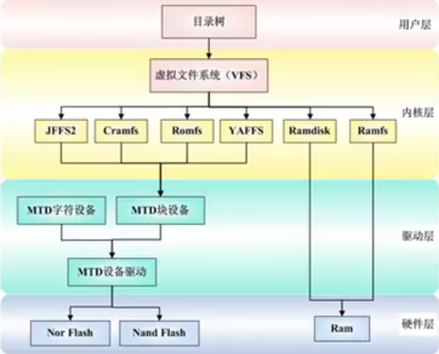

# 嵌入式Linux系统移植学习笔记

## 嵌入式Linux系统移植概述

### 嵌入式Linux系统构成

**典型嵌入式Linux系统的组成部分**

- `bootloder` 引导程序
- `kernel` Linux内核
- `fs` 文件系统
  - 存放用户态的可执行程序和数据
  - `rootfs` 系统级可执行程序
  - `datafs/userfs` 用户数据

**什么是移植？**

- 修改`bootloder`源代码
- 修改`kernel`源代码
- 修改文件系统中用户态`可执行程序`源代码
- **目的：使其能够在目标硬件平台运行**

### Bootloder

**Bootloder的作用**

> 在PC电脑上，操作系统的引导工作通常由 **BIOS引导程序** 和 **`MBR分区表的第一个扇区`或`GPT分区表的EFI分区`** 配合完成；
> 而嵌入式系统通常没有BIOS固件程序，因此整个系统的引导工作由bootloder来完成

- 负责初始化硬件设备
- 建立内存空间映射图
- 准备好合适的软硬件环境
- 以便最终调用操作系统内核程序

**Bootloder的特点**

- Bootloder不是操作系统内核代码
- Bootloder代码是针对特点CPU架构的汇编代码，不可移植。
- Bootloder代码依赖CPU架构 同时依赖嵌入式系统板级配置

**Bootloder程序的基本流程**

- 初始化硬件
- 将操作系统内核从Flash（存储器）拷贝到SDRAM（内存）中；
- 改写系统的内存映射
  - 由Flash起始地址为0 改为SDRAM起始地址为0
- 设置堆栈指针 清零BSS段
  - 执行C程序和调用子函数要用到。
- 提供Linux内核启动参数
- 启动Linux内核
- 改变PC寄存器的值，使得CPU开始执行真正的操作系统内核。

### Kernel

**Linux内核功能**

- 内存管理：
  - 裸板开发操作物理地址
  - linux软件开发可以`malloc()`获取虚拟地址
- 进程管理/进程通信
  - 裸板开发通过RTOS实现多任务
  - linux软件开发通过`fork()`实现多任务
- 文件系统
  - 裸板开发需要手动管理数据，精确到字节，需考虑存储地址、偏移、写入字节数
  - linux软件开发通过文件系统管理数据，精确到文件
- 设备管理
- 网络协议
  - linux是对网络协议支持最全的操作系统
  - TCP/UDP/IP 协议都在linux源代码中有实现

**内核的本质**

- 从C语言角度看内核：c语言函数的集合。
- 从硬件角度看内核：硬件的管理者和维护者。
- 从应用程序角度看内核：服务提供者。

### fs文件系统

**嵌入式文件系统**

- 是一种对存储设备上的数据进行组织管理的控制机制
- 是操作系统的一部分，负责管理和存储文件。

**嵌入式Linux系统中典型的存储子系统层次化架构**

- **用户层 (User Layer)**
  - **目录树**：为用户和应用程序提供统一的文件访问视图。用户通过路径（如 `/home/data/file.txt`）来操作文件，完全无需关心文件实际存储在哪种介质上。
- **内核层 (Kernel Layer)**
  - **虚拟文件系统 (VFS)**：这是整个架构的**核心抽象层**。它定义了一组标准的文件操作接口（如 `open`, `read`, `write`, `close`）。上层应用只需与VFS交互，而VFS负责将这些通用调用“翻译”并路由到下层的具体文件系统。
  - **具体文件系统**：VFS之下是各种针对不同存储介质优化的文件系统实现：
    - **JFFS2, YAFFS**：专为**Nand Flash**设计的日志闪存文件系统，处理了闪存特有的擦除、读写均衡、坏块管理等问题。
    - **Cramfs, Romfs**：只读的压缩文件系统，常用于存放固件、系统程序等不变的数据，节省空间。
    - **Ramdisk**：将一部分内存（RAM）虚拟成块设备，作为临时性的高速文件系统，但掉电数据会丢失。
- **驱动层 (Driver Layer)**
  - **MTD子系统**：这是Linux内核为**内存技术设备**设计的统一驱动框架，专门用于管理各类闪存。
    - **MTD设备驱动**：直接操作具体的Flash硬件（如某型号的Nor或Nand Flash芯片），负责最底层的读写、擦除命令。
    - **MTD字符/块设备**：MTD向上提供的两种视图。
      - **MTD字符设备**：提供对闪存的原始、字节级访问（如用于烧写引导程序）。
      - **MTD块设备**：将闪存模拟成标准的块设备（类似硬盘），这样上层的文件系统（如JFFS2）就可以像操作普通磁盘一样在其上创建文件系统。
- **硬件层 (Hardware Layer)**
  - **Nor Flash**：支持芯片内执行，读写速度快，但价格高、容量小，常用于存储启动代码。
  - **Nand Flash**：容量大、成本低，是主要的存储介质，但需要复杂的坏块管理和磨损均衡。
  - **RAM**：易失性存储器，速度快，用于Ramdisk或作为系统缓存。
- 
- 

---

**关键技术与数据流**

1. **VFS的抽象作用**：VFS是连接用户空间和多样存储后端的桥梁，它使得 `ext4`, `FAT32`, `JFFS2` 等不同文件系统可以在Linux中共存，对用户透明。
2. **MTD的标准化意义**：在MTD出现之前，每种Flash都需要为其文件系统编写专用驱动，耦合度高。MTD定义了标准的Flash操作接口，将**闪存驱动**和**闪存文件系统**解耦。文件系统基于MTD接口开发，驱动则实现MTD接口，二者可以独立开发和替换。
3. **完整数据访问路径示例**
    当用户执行 `cat /mnt/nand/example.txt` 时：
    1. 用户层通过路径发起请求。
    2. VFS解析路径，发现 `/mnt/nand` 挂载的是YAFFS2文件系统。
    3. VFS调用YAFFS2文件系统的 `read` 方法。
    4. YAFFS2文件系统将文件操作转换为对逻辑块地址的请求，并通过MTD块设备接口下发。
    5. MTD子系统将块设备请求转换为对具体Nand Flash芯片的读操作序列。
    6. MTD设备驱动操控硬件，从Nand Flash中读取数据，并按原路返回给用户。

### 总结

**bootloder**

- 硬件上电后固定跳转到该位置执行代码
- 初始化相应硬件设备
- 加载操作系统内核代码到内存
- 跳转到内核代码的起始位置开始执行

**kernel**

- 内核自解压ulmage
- 初始化硬件设备
- 初始化静态编译进内核的驱动模块
- 挂载根文件系统
- 执行第一个用户空间程序

**第一个用户空间程序**

- 配置用户环境
- 执行服务进程
