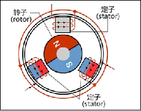
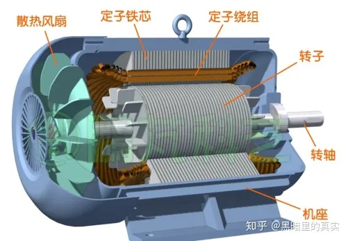
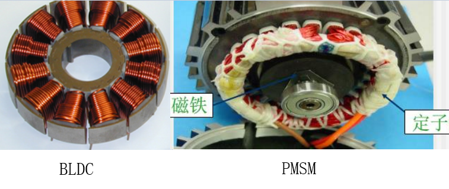
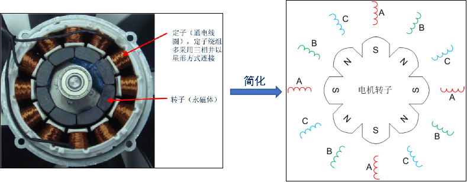
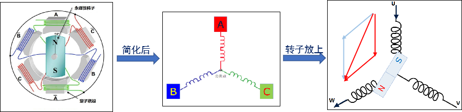
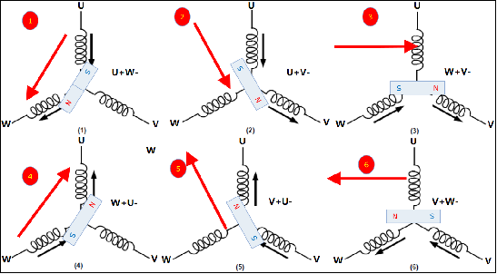
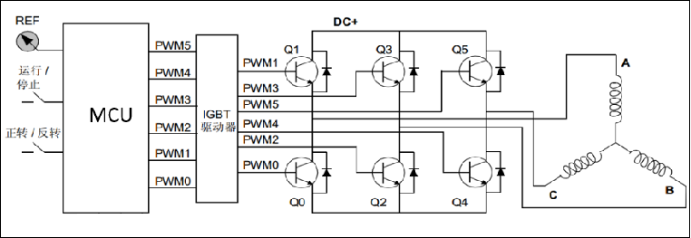
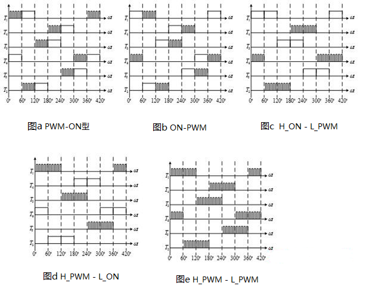
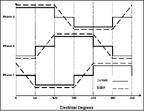

# 电机控制技术学习笔记

> https://www.bilibili.com/video/BV1hv4y1g7s3

## 目录

- [电机控制技术学习笔记](#电机控制技术学习笔记)
  - [目录](#目录)
  - [无刷电机简介](#无刷电机简介)
  - [驱动原理](#驱动原理)
  - [三相极性的切换](#三相极性的切换)
  - [电机的位置检测](#电机的位置检测)
    - [有感位置检测](#有感位置检测)
    - [无感位置检测](#无感位置检测)
  - [相关方案](#相关方案)

## 无刷电机简介

**无刷直流电机**

- 无刷直流电机(Brushless DC Motors)(BLDC)
- 也称无换向器电机
- 无电刷无换向器
- 
- 

**驱动方式**

- 方波驱动BLDC
  - 外转子式
    - 
  - 内转子式
    - 
- 正弦波驱动
  - 永磁同步PMSM
    - 

**BLDC与PMSM**

| 不同点   | BLDC                                                  | PMSM                                                  |
| :------- | :---------------------------------------------------- | :---------------------------------------------------- |
| 反电动势 | 具有**梯形**反电动势                                  | 具有正弦波反电动势                                    |
| 运行电流 | **梯形**波电流                                        | 正弦波电流                                            |
| 绕组方式 | 定子绕组为**集中绕组**， 永磁转子形成**方波磁场** | 定子绕组为**分布绕组**， 永磁转子形成**正弦磁场** |
| 控制方式 | 控制算法相对简单(6步换向)                             | 控制算法复杂(FOC)                                     |
| 运行方式 | 绕组**两两导通**                                      | 绕组**三相全部导通**                                  |

**BLDC集中绕组和PMSM分布绕组**

- 

**BLDC控制方式与PMSM控制方式**

- 
- 

**主要参数**

- **极对数:** 转子磁铁NS级的对数，此参数影响电机旋转速度
  - 无刷电机磁场的转速和磁极对数是成反比关系的。
  - 在功率一样，极数不一样的情况下，
  - 磁极对数越多，转速就相应降低，这样子体积定子体积会相对增大，输出扭矩大；反之，
  - 磁极对数越少，转速越高，体积越小，但输出的扭矩也小。
- **KV值:** 值越大电机转速越大。电机转速 = KV值\*工作电压
- **额定转速:** 额定的电流下的空载转速，通常单位用RPM表示
- **转矩:** 电机中转子产生的可以带动机械负载的驱动力矩。通常单位为：N-M

## 驱动原理

**BLDC内部结构图**

**驱动原理**

**六步换相**

## 三相极性的切换

使用三相逆变电路来实现极性的更换

- 
- 上面的方式是直接把电源加载到线圈上，会使电机很快飙到很高的速度。
- 所以一般都是将高低电平用PWM来代替，这样可以方便的控制线圈电流，从而控制转子扭矩及转速。
- 

**常见的六种PWM控制直流无刷电机方法**

- 主要分为全桥调制和半桥调制
  - 半桥调制
    - 对称型半桥调制
      - 图A:在120度的周期内,上管先用pwm信号控制,后用开关信号控制,下管先用开关信号控制,后用pwm信号控制.
      - 图B:在120度的周期内,上管先用开关信号控制,后用pwm信号控制,下管先用pwm信号控制,后用开关信号控制.
    - 非对称性半桥调制
      - 图C:上管用开关信号,下管用pwm信号
      - 图D:上管用pwm信号,下管用开关信号
  - 全桥调制
    - 图E为全桥调制,即上下管都使用PWM信号控制
- 

## 电机的位置检测

**位置检测**

- 位置传感器(霍尔)
- 无传感器(反向电动势)

### 有感位置检测

**霍尔传感器检测转子位置**

- 电角度 = 机械角度 \* 极对数
- 

**霍尔传感器安装位置对应的波形**

**机械角度\电角度\极对数**

- 机械角：转子物理上旋转的角度，描述的是转子的位置，可以通过传感器测量。
- 电角：描述的是电流或者电压的在一个电周期内的相位角度。
- 公式：电角 = 极对数 ✖ 机械角
- 如果极对数为1,那么机械角度和电角度保持一致,即:电机转动120度,电压相位变化120度.
- 如果极对数为2,那么机械角度只有电角度的一半,即:电机旋转180度,电压相位变化360度.

### 无感位置检测

**无感控制原理**

- 楞次定律（感应电流的磁场总要阻碍引起感应电流的磁通量的变化）
- 动生电动势：一种由于导体在磁场中运动而在导体内部产生的电动势。
- 感生电动势：一种由于磁场变化而静止导体中产生的一种电动势。
- 

**过零点**

- 反电点势从正变化为负或者从负变化为正的点
- 反电动势过零点都发生在不通电的那一相
- 

**检测过零点**

- 电机旋转一个电周期中电流和反电动势的波形，其中实线代表电流，虚线代表反电动势
- 第一个60°内，A相电流为正，B相电流为负，C相电流为零，这说明电机AB相通电，电流从A相流入B相，C相为开路，
  反电动势的过零点正好出现在C相，因此只要在每个60°内检测不通电那一相的电压，即可检测反电动势过零点。
- 
- 注意：
  - 1、过零信号的组合确定转子位置
  - 2、过零点发生在换相提前30°的时刻

**虚拟中性点**

- 电机一般只引出三根线,要检测反向电动势,需要构建一个和中性点电位相等的虚拟中性点
- 

## 相关方案

- 主控MCU为EFM8BB21
- 引脚定义:基于开源电调固件BLHeli_S
- 半桥驱动芯片:QFN20封装的FD6288，
- NMOS管:STL160N3(160A 30V)
- 固件烧录:淘宝购买C2下载器
- 供电:
  - 3S-4S电池
  - 78L08转8V
  - SPX3819转3.3V，
