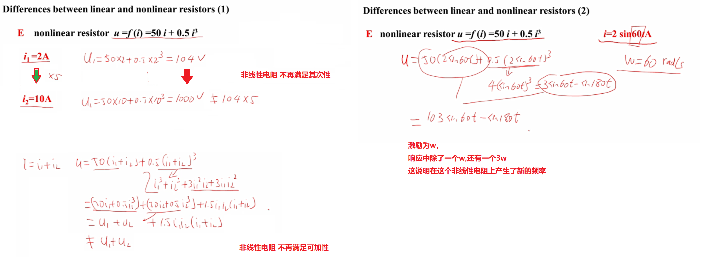
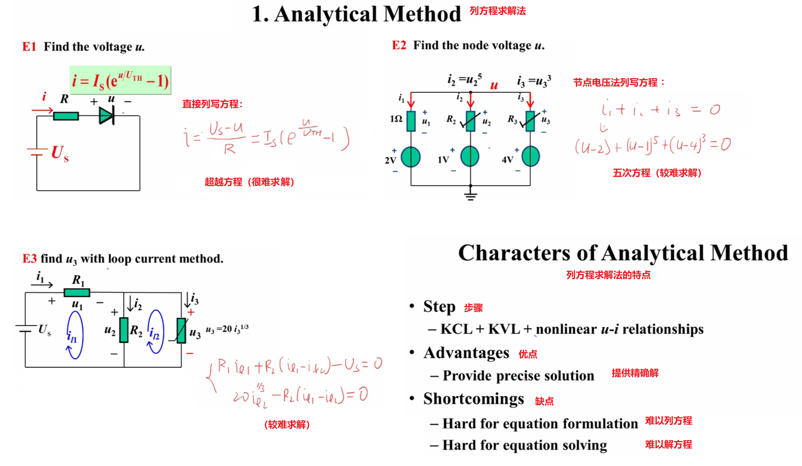
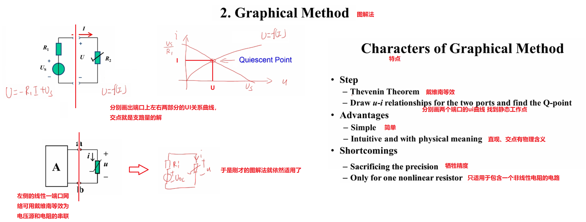
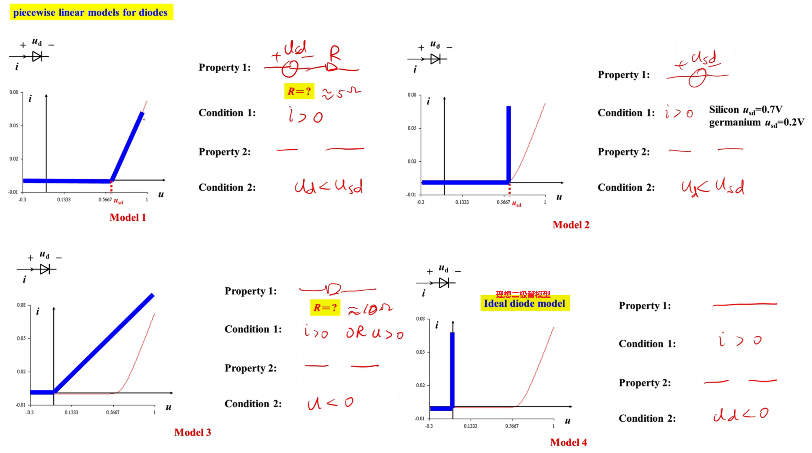
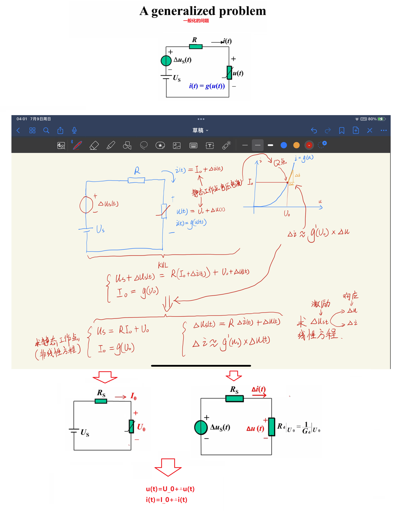
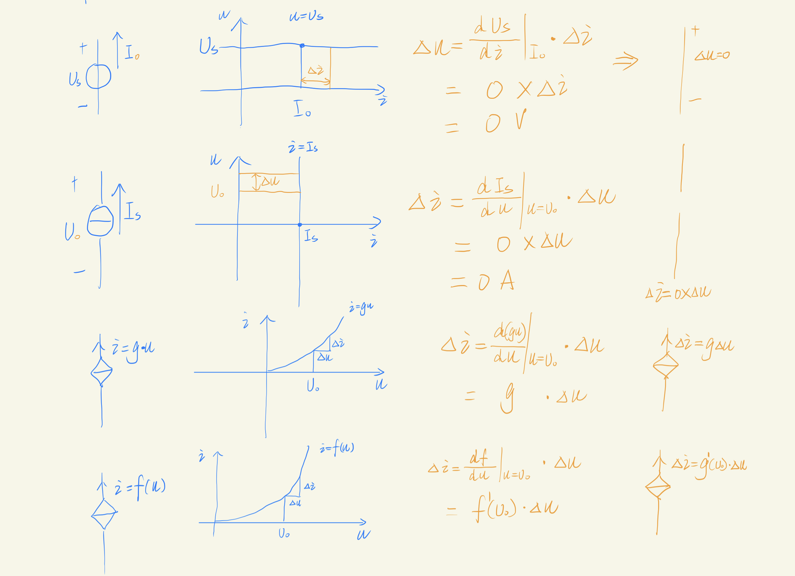

## 非线性电阻

### 例子

### 和线性电阻的区别

> - 不再满足其次性和可加性
> - 可能产生新的频率

### 分析含非线性电阻电路的方法

#### 直接列方程法

#### 图解法

#### 分段线性法（假设检验法）

##### 例题

##### 性质

##### 对二极管的几种建模方法
>
> 具体使用什么模型要看外部电路的电压和信号源的内阻是多少，要考虑选用某个模型时忽略掉的二极管的特性对外电路的影响程度。

##### 计算含理想二极管的负载上的电压

##### 计算含压降的二极管模型上的电压

##### 假设检验法的应用：分析MOSFET的工作状态

###### 用分段线性法对MOSFET建模

###### 分析电路MOSFET的工作状态

##### 假设检验法的应用：分析全桥整流电路

#### 小信号法

##### 为什么需要小信号法

##### 概念放大器

##### 对更一般化的问题的分析方法

> 小信号法是通过列些方程然后化简得到两个方程：求静态工作点的非线性方程，和求电路对小信号的响应的线性方程，然后通过这两个方程画出两个工作状态的电路图。

#### 小信号模型

> 小信号模型不同于小信号法，是对小信号法的求解过程进行总结规律，通过探究小信号作用在独立源、受控源、线性电阻、非线性电阻上的电压电流关系，使得能够直接画出其静态工作电路和小信号源单独作用的电路。

##### 小信号作用在非线性电阻、线性电阻上的等效

##### 小信号作用在独立源、线性受控源、非线性受控源上的等效

##### 小信号模型求解电路的例题

##### 小信号模型分析由MOSFET构成的放大器电路

