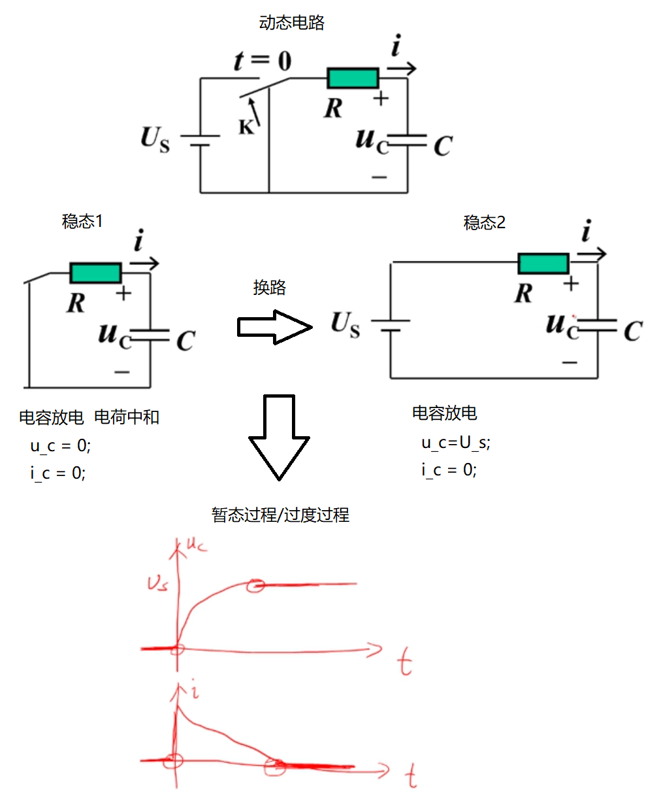
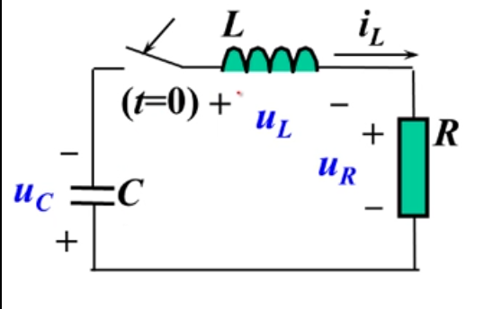

## 一阶电路

### 电容

-  
  > 关于电容定义式的推导需要电磁场的知识，暂时不了解，跳过，以后再说
- **定义式：** $C=\frac{q}{u}=ε\frac{s}{d}$
- **单位：** F法
- 注意：
  - C与q和u无关，C只和介电常数ε、极板面积s、两极板之间距离d有关。
    - 类比于电阻：
    - R=u/i但R与u和i无关，R只和导体的材质、横截面积等因素有关。
- **其上电流公式的推导：**
  - 由于: $C=\frac{q}{u}$
  - 所以：$q=C*u$
  - 由于: $i=\frac{dq}{dt}$
  - 所以电容上电流为$i=\frac{dq}{dt}=\frac{d(C*u)}{dt}=C\frac{du}{dt}=C\dot{u}$
  - 所以可以认为：电容上的电流=C乘上电压的变化率(导数)。
- **其上电压公式的推导：**
  - 由于: $i=C\frac{du}{dt}$
  - 所以：$du=\frac{1}{C}*i*dt$
  - 所以：$u=\frac{1}{C}∫{idt}$
  - 所以：$u(t)=\frac{1}{C}∫_{-∞}^{t}{idτ}$
    - 这里似乎都会把微分的dt写成dτ，原因应该是为了区分其不同的含义
  - 所以：$u(t)=\frac{1}{C}∫_{-∞}^{0}{idτ}+\frac{1}{C}∫_{0}^{t}{idτ}$
  - 所以：$u(t)=u(0)+\frac{1}{C}∫_{0}^{t}{idτ}$
  - 所以可以认为：t时刻电容上的电压=0时刻的其上的电压+ $\frac{1}{C}$ 乘上0到t时刻电流随时间的积分
- **吸收的功率**
  - $P=ui=u*C\frac{du}{dt}$
- **吸收的能量**
  - $W=Pt$
  - $W=∫{P(t)dτ}=∫{u*C\frac{du}{dτ}*dτ}=C∫{u*du}$
  - 所以：$W(t)=C∫_{-∞}^{t}{u*du}$
    - 注意：
      - 这里还可以写成 $W(t)=C∫_{-∞}^{t_0}{u*du}+C∫_{t_0}^{t}{u*du}$
      - 即t时刻吸收的能量=-∞到t0时刻吸收的能量 + t0到t时刻吸收的能量
      - 从而可以推出t0时刻到t时刻的能量变化，就是W(t0) 到 W(t) 能量的变化
  - 所以：$W(t)=C\frac{u^2}{2}|_{-∞}^{t}$
    - u可以是一个常数，也可以是t的函数，
    - 显然，u是常数时，吸收的能量为0
  - 所以：$W(t)=C\frac{u(t)^2}{2}-C\frac{u(-∞)^2}{2}$
  - 可以认为-∞时刻吸收的功率为0
  - 则: $W(t)=C\frac{u(t)^2}{2}$
    - 简写：$W=C\frac{u^2}{2}$
    - `t0->t`时刻的电容的能量变化：$C\frac{u(t_0)^2}{2}-C\frac{u(t)^2}{2}$
  - 另外：
    - 由于: $u=\frac{Q}{C}$
    - 所以带入可得：$W=C\frac{(\frac{Q}{C})^2}{2}=\frac{C}{2}\frac{Q^2}{C^2}=\frac{Q^2}{2C}$
    - 由于Q是>=0的，所以$W=\frac{Q^2}{2C}>=0$
- **并联等效**
  - 并联等效电容：$C_{eq}=C_1+C_2$
  - 
- **串联等效**
  - 串联等效电容：$C_{eq}=\frac{C_1*C_2}{C_1+C_2}$
  - 
- **串联分压**
  - 利用KCL+KVL求解：
    - 
  - 利用电荷守恒求解：
  - > 这种方法是求解含有多个电容电路的常用技巧
  - 
- **并联分流**
  - 

------------------------------------------------------------

### 电感Inductors

-  
- **公式：** $L=\frac{Ψ}{i}=μn^2S$
- **单位：** H
- **其上电压**
  - 根据法拉第电磁感应定律： $u=\frac{dΨ}{dt}$ （电势等于磁通量的变化速度）
  - 又因为： $Ψ=L*i$
  - 所以有：$u=\frac{d(Li)}{dt}=L\frac{di}{dt}$
    - 可知i为常数时，u=0
  - 
- **其上电流**
  - 可以根据其电压公式推导出来
  - $i=\frac{1}{L}∫_{-∞}^{t}{udτ}$
  - 和电容类似，可以得到：
  - $i(t) = i(0)+\frac{1}{L}∫_{0}^{t}{udτ}$
- **吸收的功率**
  - $P=ui=i*L\frac{di}{dt}$
- **吸收的能量**
  - $W=Pt$
  - $W(t)=∫{P(t)dτ}$
  - $W(t)=∫_{-∞}^{t}{i*L\frac{di}{dt}*dτ}$
  - $W(t)=L∫_{-∞}^{t}{idi}$
  - $W(t)=L∫_{-∞}^{0}{idi}+L∫_{0}^{t}{idi}$
  - $W(t)=W(0)+L∫_{0}^{t}{idi}$
  - 假设负无穷到0时刻吸收的能量为0,即W(0)=0,则可得到：
  - $W(t)=L∫_{0}^{t}{idi}=L\frac{1}{2}i^2|_0^t=L\frac{1}{2}i^2$
  - 由于$L=\frac{Ψ}{i}$ 所以$i=\frac{Ψ}{L}$，则可知：
  - $W(t)=L\frac{1}{2}(\frac{Ψ}{L})^2=\frac{1}{2L}Ψ^2>=0$
- **串联等效和并联等效**
  - 
- **串联分压和并联分流**
  - 

### 电容电感总结

### 忆阻器

### 动态电路

- **电阻电路：** 元件上的支路量随着激励的改变而瞬时(理想情况下)改变
- **动态电路：** 电容/电感为储能元件，能量的变化不可能瞬时的(电场/磁场的建立/消散都需要时间)，表征其储能的电容电压和电感电流必须随时间变化。
  - 所谓动态就是储能元件上的能量随时间改变的过程。
  - 过度过程
    - 是什么：稳态1 =经过换路=> 暂态过程/过度过程 ==> 稳态2
    - 产生的两个根本条件
      - 电路包含储能元件
      - 电路发生改变：
        - 拓扑结构发生改变（如开关换路）
        - 元件参数发生改变（如电压源）

#### 列写方程

**阶数**

> 如果一个电路所对应的方程是一阶(/二阶)微分方程，那么这个电路就叫做一阶(/二阶)电路

一阶电路一阶方程

KVL/元件约束:
$$
\begin{align*}
  KVL&: U_s = u_r + u_c \\
  R&: U_r =Ri \\
  C&: i = C \frac{du_c}{dt} \\
\end{align*}
$$

元件约束代入KVL:
$$
\begin{align*}
U_s &= u_r + u_c \\
U_s &= RC\frac{du_c}{dt} + u_c \\
\end{align*}
$$

化微分项系数为1：

$$
\frac{du_c}{dt}  + \frac{1}{RC} u_c =  \frac{1}{RC} U_s
$$

---

二阶电路二阶方程

KVL/元件约束:
$$
\begin{align*}
  KVL&: u_C +  u_L + u_R = 0 \\
  C&: i = C \frac{du_C}{dt} \\
  L&: u = L\frac{di}{dt} \\
  R&: U_r = Ri \\
\end{align*}
$$

元件约束代入KVL:
$$
\begin{align*}
u_C +  u_L + u_R = 0 \\
u_C + L * \frac{d(i=C\frac{du_C}{dt})}{dt}+ R * (i=C\frac{du_C}{dt})=0\\
u_C + LC\frac{d^2(u_C)}{dt}+ RC\frac{du_C}{dt}=0 \\
\end{align*}
$$

化微分项系数为1：

$$
\frac{d^2(u_C)}{dt}+ \frac{R}{L}\frac{du_C}{dt} + \frac{1}{LC}u_C=0 \\
$$

---

#### 一阶常系数线性常微分方程

- 常微分方程：方程中的未知量是一个函数，并且这个函数只有一个自变量 $f(x)$
  - 一阶: 最高次数为一次导
  - 线性：函数和函数的导数是线性关系 $\frac{df(t)}{dt} =- 2f(t)$
    - 常系数：线性关系的系数是常数 $-2$
  - 齐次方程：方程等号右边为0
  - 非齐次方程：方程等号右边为关于自变量的表达式

**齐次方程求解：**

$$
\frac{df(t)}{dt} + 2f(t) = 0
$$

**思考**

- 什么函数可以满足：$\frac{df(t)}{dt} =- 2f(t)$
- 答:
  - 只有自然指数函数的导数还是自然指数函数
  - $f(t) = Ae^{\lambda t}$
  - $f'(t) = A\lambda e^{\lambda t} =\lambda f(t)$
  - 代入原方程：$f'(t) - 2f(t) = 0$
    - $\lambda f(t) - 2f(t) = 0$
    - $\lambda - 2 = 0$ (特征方程)
    - $\lambda = -2$ (特征根)
  - 所以： $f(t) = Ae^{-2 t}$ (微分方程通解)
  - 如果：
    - 有系统初始条件f(0)=1 则可计算得：A=1
    - 那么： $f(t) = e^{-2 t}$ (微分方程特解)

**非齐次方程求解：**

$$
\frac{df(t)}{dt} + 2f(t) = t^2
$$

- 可以把原方程看成是：$\frac{df(t)}{dt} + 2f(t) = 0 + t^2$
- 非齐次方程通解 = 齐次方程通解 + 非齐次方程特解
- 齐次方程通解： $f_a(t) = A e^{-2 t}$ 可使得方程右边为0
- 非齐次方程特解：
  - 因为二次多项式函数的导数是二次多项式
  - 所以，设其为$f_b(t) = Bt^2 + Ct + D$
  - 则导数为$f_b'(t) = 2Bt + C + 0$
  - 代入原方程$\frac{df(t)}{dt} + 2f(t) = t^2$得：
    - $2Bt + C + 2*(Bt^2 + Ct + D) = t^2$
    - $2Bt + C + 2Bt^2 + 2Ct + 2D = t^2$
    - $(2B)t^2 + (2C+2B)t + (2D + C)= t^2$
      - 2B=1 B=0.5
      - 2C+2B=0  C=-0.5
      - 2D+C=0 D=0.25
    - $f_b(t) = 0.5t^2-0.5t+0.25$
  - 特解使得方程右边为$t^2$
- 非齐次方程通解 = 齐次方程通解 + 非齐次方程特解
  - $f(t)=f_a(t)+f_b(t)$
  - $= Ae^{-2 t} + 0.5t^2-0.5t+0.25$
- 如果：
    - 有系统初始条件f(0)=1 则可计算得：A=0.75

> [2 第47讲 动态电路(Dynamic Circuits)(3)]

