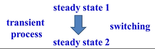

## 动态电路

**什么是动态电路？**

- **电阻电路：** 元件上的支路量随着激励的改变而瞬时(理想情况下)改变
- **动态电路：** 
  - 电容/电感为储能元件，
  - 能量的变化不可能瞬时的(电场/磁场的建立/消散都需要时间)，
  - 表征其储能的电容电压和电感电流必须随时间变化。
  - 所谓动态就是储能元件上的能量随时间改变的过程。

## 动态电路的过度过程

**过度过程（暂态过程）是什么**
- 从`一个稳态`经过`换路`到`另一个稳态`的`过渡过程`
- 
- ```bash
  稳态1==换路==>稳态2
  =======暂态=======
  ```

**产生过度过程的两个根本条件**
- 电路包含储能元件
- 电路发生改变： 
  - 拓扑结构发生改变（如开关换路）
  - 元件参数发生改变（如电压源的幅值、频率）


### 动态电路过度过程的求解


#### 列写方程

> 列写方程的两个基本要素：**元件约束** + **拓扑约束**

**阶数**  

> 如果一个电路所对应的方程是一阶(/二阶)微分方程，那么这个电路就叫做一阶(/二阶)电路

**一阶电路一阶方程**


KVL拓扑约束 + RC元件约束:
$$
\begin{align*}
  KVL&: U_s = u_r + u_c \\
  R&: U_r =Ri \\
  C&: i = C \frac{du_c}{dt} \\
\end{align*}
$$

元件约束代入KVL:
$$
\begin{align*}
U_s &= u_r + u_c \\
U_s &= RC\frac{du_c}{dt} + u_c \\
\end{align*}
$$

化微分项系数为1：

$$
\frac{du_c}{dt}  + \frac{1}{RC} u_c =  \frac{1}{RC} U_s
$$

---

**二阶电路二阶方程**


KVL拓扑约束+RLC元件约束:
$$
\begin{align*}
  KVL&: u_C +  u_L + u_R = 0 \\
  C&: i = C \frac{du_C}{dt} \\
  L&: u = L\frac{di}{dt} \\
  R&: U_r = Ri \\
\end{align*}
$$

元件约束代入KVL:
$$
\begin{align*}
u_C +  u_L + u_R = 0 \\
u_C + L * \frac{d(i=C\frac{du_C}{dt})}{dt}+ R * (i=C\frac{du_C}{dt})=0\\
u_C + LC\frac{d^2(u_C)}{dt}+ RC\frac{du_C}{dt}=0 \\
\end{align*}
$$

化微分项系数为1：

$$
\frac{d^2(u_C)}{dt}+ \frac{R}{L}\frac{du_C}{dt} + \frac{1}{LC}u_C=0 \\
$$

---

#### 求解方程

##### 一阶常系数线性常微分方程

- 常微分方程：方程中的未知量是一个函数，并且这个函数只有一个自变量 $f(x)$
  - 一阶: 最高次数为一次导
  - 线性：函数和函数的导数是线性关系 $\frac{df(t)}{dt} =- 2f(t)$
    - 常系数：线性关系的系数是常数 $-2$
  - 齐次方程：方程等号右边为0
  - 非齐次方程：方程等号右边为关于自变量的表达式

##### 齐次方程求解

$$
\frac{df(t)}{dt} + 2f(t) = 0
$$

**思考**

- 什么函数可以满足：$\frac{df(t)}{dt} =- 2f(t)$
- 答:
  - 只有自然指数函数的导数还是自然指数函数
  - $f(t) = Ae^{\lambda t}$
  - $f'(t) = A\lambda e^{\lambda t} =\lambda f(t)$
  - 代入原方程：$f'(t) - 2f(t) = 0$
    - $\lambda f(t) - 2f(t) = 0$
    - $\lambda - 2 = 0$ (特征方程)
    - $\lambda = -2$ (特征根)
  - 所以： $f(t) = Ae^{-2 t}$ (微分方程通解)
  - 如果：
    - 有系统初始条件f(0)=1 则可计算得：A=1
    - 那么： $f(t) = e^{-2 t}$ (微分方程特解)

##### 非齐次方程求解

$$
\frac{df(t)}{dt} + 2f(t) = t^2
$$

- 可以把原方程看成是：$\frac{df(t)}{dt} + 2f(t) = 0 + t^2$
- 非齐次方程通解 = 齐次方程通解 + 非齐次方程特解
- 齐次方程通解： $f_a(t) = A e^{-2 t}$ 可使得方程右边为0
- 非齐次方程特解：
  - 因为二次多项式函数的导数是二次多项式
  - 所以，设其为$f_b(t) = Bt^2 + Ct + D$
  - 则导数为$f_b'(t) = 2Bt + C + 0$
  - 代入原方程$\frac{df(t)}{dt} + 2f(t) = t^2$得：
    - $2Bt + C + 2*(Bt^2 + Ct + D) = t^2$
    - $2Bt + C + 2Bt^2 + 2Ct + 2D = t^2$
    - $(2B)t^2 + (2C+2B)t + (2D + C)= t^2$
      - $2B=1$
      - $B=0.5$
      - 
      - $2C+2B=0$
      - $C=-0.5$
      - 
      - $2D+C=0$
      - $D=0.25$
    - $f_b(t) = 0.5t^2-0.5t+0.25$
  - 特解使得方程右边为$t^2$
- 非齐次方程通解 = 齐次方程通解 + 非齐次方程特解
  - $f(t)=f_a(t)+f_b(t)$
  - $= Ae^{-2 t} + 0.5t^2-0.5t+0.25$
- 如果：
    - 有系统初始条件f(0)=1 则可计算得：A=0.75

> [2 第47讲 动态电路(Dynamic Circuits)(3)]


### 总结

动态电路的暂态过程如何求解？
1. 根据拓扑约束(KVL、KCL)和元件约束（RLC）列写微分方程
2. 确定初值(t=0)
3. 求特解


