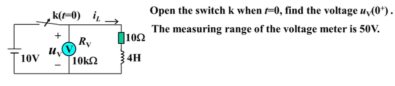
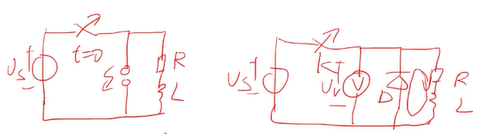

# 初值

## 换路

假设电路在0时刻换路，定义：
- $0^-$ 换路前
- $0^+$ 换路后

## 换路定律

### 换路前后电容电压不能突变且电荷守恒  

电容电压:
$$
u_c(t) = u_c(0) + \frac{1}{C}∫_{0}^{t}idτ
$$

经过换路后电容器两端的电压：
$$
\begin{align*}
u_c(0^+) &= u_c(0^-) + \frac{1}{C}∫_{0^-}^{0^+}idτ \\
&= u_c(0^-) + 0 \\
&= u_c(0^-) 
\end{align*}
$$

> 所以可以用值为 $u=u_c(0^-)$ 的电压源来等效电容,  
> 实现对$t=0^+$时刻支路量的求解

经过换路后电容器两端的电荷：

$$
\begin{align*}
 \frac{u_c(0^+)}{C} &= \frac{u_c(0^-)}{C}  \\
q_c(0^+) &= q_c(0^-) 
\end{align*}
$$

### 换路前后电感电流不能突变且磁链守恒

电感电流:
$$
i_c(t) = i_c(0) + \frac{1}{L}∫_{0}^{t}udτ
$$

经过换路后的电感电流：
$$
\begin{align*}
i_c(0^+) &= i_c(0^-) + \frac{1}{L}∫_{0^-}^{0^+}udτ \\
&= i_c(0^-) + 0 \\
&= i_c(0^-) 
\end{align*}
$$

> 所以可以用值为 $i=i_L(0^-)$ 的电流源来等效电感,  
> 实现对$t=0^+$时刻支路量的求解

经过换路后的电感磁链守恒：

$$
\begin{align*}
 \frac{i_c(0^+)}{L} &= \frac{i_c(0^-)}{L}  \\
Ψ_L(0^+) &= Ψ_L(0^-) 
\end{align*}
$$

### 例题

计算换路后电压表上的电压,是否超过量程50V

换路前，

$i_L(0^-)=\frac{U}{R}=\frac{10}{10}=1A$

换路后：

$i_L(0^+)=i_L(0^-)=1A$

$u_v=-i_L(0^-)*R=-1*10k= -10kV$

### 利用和避免

- 左图，利用电感特性实现的点火器
- 右图，使用二极管给电感续流避免烧坏电压表

## 总结

**求取初值的步骤**
- 求取换路前的电路（电阻电路，稳态电路，电容看作开路，电感看作短路）
  - 找到$u_C(0^-)$ 或 $i_L(0^+)$
- 求取$t=0^+$时刻的电路
  - 拓扑结构为换路后的
  - 将电容替换为电压源 $u=u_C(0^+)=u_C(0^-)$
  - 将电感替换为电流源 $i=i_L(0^+)=i_L(0^-)$
  - 求取在 $t=0^+$ 时刻关心的任意支路量（电阻电路）