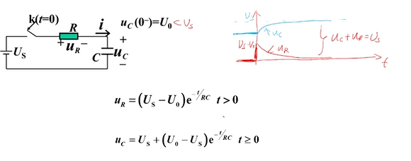
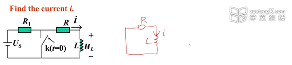

# 一阶电路经典法

## RC一阶电路

### 案例

#### 1.列写方程（拓扑约束+元件约束）

- $u_R + u_c = U_s$
- $u_R = iR$
- $i = C\frac{d(u_c)}{dt}$

$$
RC\frac{d(u_c)}{dt} + u_c = U_s
$$

#### 2.求解方程

**齐次项的解** 

- 假设解的形式为$u_c = Ae^{\lambda t}$
- 带入原方程得到特征方程: $RC\lambda + 1 = 0$
- 特征根: $\lambda = -\frac{1}{RC}$
- 微分方程的齐次通解：

$$u_c' = Ae^{\lambda t} = Ae^{-\frac{t}{RC}}$$

**非齐次项的解** 

- $U_s$是一个常数
- 显然可得微分方程的非齐次特解：

$$u_c''=U_s$$

**通解=齐次通解+非齐次特解**

$$
\begin{align*}
      u_c&=u_c''+u_c' \\
      &=U_s + Ae^{-\frac{t}{RC}}
\end{align*}
$$

#### 3.确定初值

- 换路前：$u_c(0^-)=U_0$
- 换路后：$u_c(0^+)=u_c(0^-)=U_0$

#### 4.确定系数

将 $u_c(0^+)=U_0$ 带入方程确定系数A:  
$u_c = U_s + Ae^{-\frac{t}{RC}}$  

t=0时：  
$U_0 = U_s + Ae^{-\frac{0}{RC}}$  
$U_0 = U_s + A$  

得：
$$A=U_0-U_s$$

#### 5.代入系数

$$u_c = U_s + (U_0-U_s)e^{-\frac{t}{RC}}$$  

### RC一阶电路的时间常数

> - 对RC一阶电路的两个支路量求解可以发现，
> - 他们的指数项时相同的，意味着其变化速率也是相同的。
> - 所以可以定义一个变量$τ=RC$ 称RC一阶电路的时间常数，单位秒。

$$u_c = U_s + (U_0-U_s)e^{-\frac{t}{RC}}$$ 
$$u_c = U_s + (U_0-U_s)e^{-\frac{t}{τ}}$$  

## RL一阶电路

### 案例

#### 1.列写方程（拓扑约束+原件约束）

**KVL**
- $-U_R = u_L$
- $U_R = R*i$

**元件约束**
- $u_L = L\frac{di}{dt}$

**整理**
$$
\begin{align*}
 - Ri &= L\frac{di}{dt} \\
L\frac{di}{dt} - Ri &= 0 \\
\frac{L}{R}\frac{di}{dt} - i &= 0 \\
\end{align*}
$$

#### 2.求解方程

**齐次项的解** 

- 假设解的形式为$i_L = Ae^{\lambda t}$
- 带入原方程得到特征方程: $\frac{L}{R}\lambda + 1 = 0$
- 特征根: $\lambda = -\frac{1}{\frac{L}{R}}=-\frac{R}{L}$
- 齐次通解：$i_L = Ae^{\lambda t} = Ae^{-\frac{R}{L}t}$

#### 3.确定初值

在t=0时刻，

$i(0)=i(0^+)=i(0^-)=\frac{U_s}{R_1+R}$

#### 4.确定系数

$$
\begin{align*}
i_L &= Ae^{-\frac{R}{L}t} \\
A &= \frac{U_s}{R_1+R}
\end{align*}
$$

#### 5.代入系数

$$
i_L  = \frac{U_s}{R_1+R}e^{-\frac{R}{L}t}
$$

### RL一阶电路的时间常数

$$
i_L  = \frac{U_s}{R_1+R}e^{-\frac{R}{L}t}
$$

> 定义$τ=\frac{L}{R}$ 称RL一阶电路的时间常数，单位秒。

$$
i_L  = \frac{U_s}{R_1+R}e^{-\frac{t}{τ}}
$$

## 关于τ的讨论

**工程观点**

- t=3τ，$e^{-\frac{t}{τ}}$ =0.05  
- t=5τ，$e^{-\frac{t}{τ}}$ =0.007  
- > 所以可以认为，经过3~5τ的时间后，电路的过度过程完全结束。  

**规律**

- τ越小，电路的过渡过程越快  
- τ越大，电路的过渡过程越慢  

**区别**

- $τ=RC$ R越大，τ越大，R增大的作用是减缓电容上电荷被中和的速度
- $τ=\frac{L}{R}$ R越小，τ越大，R减小的作用是增大L的续流能力保持电感建立的磁场。

## 总结

**一阶电路经典法求解**
1. 列写所关心支路量$x(t)$的常微分方程（拓扑约束+原件约束）
2. 根据换路定律，求$x(0^+)$时刻的数值
3. 求微分方程
   + 方程是齐次微分方程，求其齐次通解
   + 方程是非齐次微分方程，求其齐次通解+非齐次特解
4. 通过$x(0^+)$来确定齐次通解的待定系数