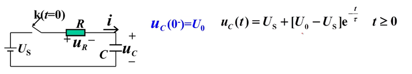
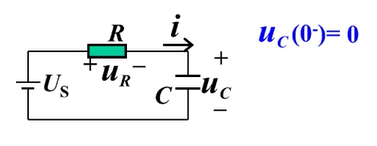
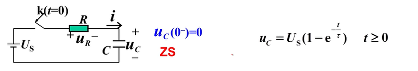
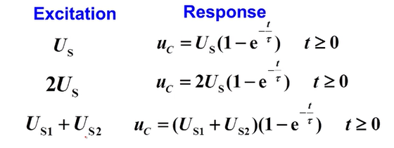

# 零输入响应和零状态响应

## 几种不同的视角

电路的非齐次常系数线性常微分方程

**纯数学角度：**
$$\text{全解}=\text{通解}+\text{特解}$$

**一阶电路经典法角度：**
$$\text{全响应}=\text{自然响应}+\text{强制响应}$$

**一阶电路三要素法角度：**
$$\text{全响应}=\text{自然响应}+\text{稳态}$$

**叠加定理角度：**
$$\text{全响应}=\text{零输入响应}+\text{零状态响应}$$

## 案例

**零状态响应**

> 独立源作用，储能元件不作用（零状态、无初值）（电容无电压，电感无电流）

$$
\begin{align*}
    u_c'&=\text{稳态}+(\text{初值}-\text{稳态})e^{-\frac{t}{τ}} \\
    u_c'&=U_s+(0-U_s)e^{-\frac{t}{τ}}
\end{align*}
$$

**零输入响应**

> 储能元件作用（有初值），独立源不作用

$$
\begin{align*}
    u_c''&=\text{稳态}+(\text{初值}-\text{稳态})e^{-\frac{t}{τ}} \\
    u_c''&=0+(U_0-0)e^{-\frac{t}{τ}} \\
    u_c''&=U_0e^{-\frac{t}{τ}}
\end{align*}
$$

**全响应**
$$
\begin{align*}
    u_c&=u_c'+u_c'' \\
    &=U_s+(0-U_s)e^{-\frac{t}{τ}}+U_0e^{-\frac{t}{τ}} \\
    &=U_s+(U_0-U_s)e^{-\frac{t}{τ}}
\end{align*}
$$

## 本质

- 叠加定理。
- 把一个既有独立源作用，又有带初值储能原件作用的电路，
- 看成是他们分别作用的叠加。

## 优点

- 在零状态下，储能原件的电压电流的微分、积分关系是线性关系。
- 当其电压电流关系为线性关系时，就可以使用叠加定理进行分析和求解

### 电容

电容上的电流和电压是线性微分关系：
$$
i=C\frac{du}{dt}
$$

电容上的电压和电流不是是线性微分关系
$$
u(t)=u(0)+\frac{1}{C}∫_0^t iτ
$$

但在零状态情况下(电容无储能，初值为0),  
则电压和电流的关系是线性积分关系：
$$
\begin{align*}
    u(t)&=u(0)+\frac{1}{C}∫_0^t i(t)τ \\
        &=0+\frac{1}{C}∫_0^t i(t)τ \\
        &=\frac{1}{C}∫_0^t i(t)τ \\
\end{align*}
$$

### 电感

电感上电压和电流是线性微分关系
$$
u=L\frac{di}{dt}
$$

零状态条件下，电感上电流和电压是线性积分关系

$$
\begin{align*}
    i(t)&=i(0)+\frac{1}{L}∫_0^t u(t)τ \\
        &=0+\frac{1}{L}∫_0^t u(t)τ \\
        &=\frac{1}{L}∫_0^t u(t)τ \\
\end{align*}
$$

### 示例

> 零状态条件下，激励和响应是线性关系

## 用处

可以先求解电路的**零状态单位冲激响应**，然后将其与激励进行**卷积积分**，从而求解**任意激励**下的零状态响应。