# 一阶电路应用

## 信号处理

### 门传输延迟

**MOSFET的线性电阻区**

- 将MOSFET应用于门电路时，一般认为其工作在线性电阻区；
- 转移特性曲线的斜率表征的就是$U_{gs}=x$时DS极之间的电阻。
- 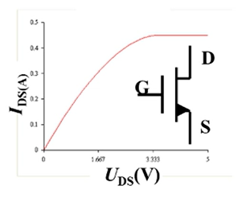

**MOSFET的寄生参数**
- 给MOSFET的栅极和漏极施加电压后,栅极氧化物绝缘层的上下两侧会汇集正负电荷，并形成电场；
- 这就符合电容的定义，$C=\frac{Q}{U}$；
- 即：MOSFET的栅极和漏极之间由于绝缘层的存在，会产生等效电容$C_gs$
- 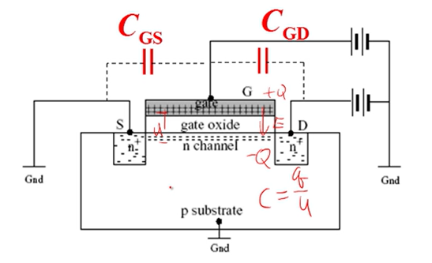

**MOSFET反相器的传输延迟**
- 把反相器的输入部分等效简化，实际上就是信号源、电阻、等效电容$C_{gs}$的串联一阶RC电路。
- 
- MOSFET反相器的传输延迟主要来自等效电容$C_{gs}$的充电。
- 时间常数$\tau=RC$
- $\tau$应当远远小于信号源的频率周期
  - 选用$C_{gs}$较小的MOSFET
  - 降低电阻R

**缓冲器的传输延迟**
- $C_{gs}$充电时间常数$\tau=R_L × C_{gs}$
- $C_{gs}$放电时间常数$\tau=(R_{ON}//R_{L}) × C_{gs}≈R_{ON} × C_{gs}$

### 一阶运放电路

**微分器**

- 拓扑约束
  - KVL $u_i = u_C+u_R+u_o$
  - KCL $i_C=i_R$
- 运放负反馈虚短虚断：
  - $i_C = i_R$
  - $u_+=u_-=0$
    - $u_i=u_C$
    - $u_o=-u_R$
- 元件约束
  - $i_R=\frac{u_R}{R}$
  - $i_C=C\frac{d}{dt}u_C$

输入输出关系推导：
$$
\begin{align*}
    i_R &= i_C \\
     u_R/R &= C\frac{d}{dt}u_C \\
    (-u_o)/R &= C\frac{d}{dt}u_i \\
    -u_o &= RC\frac{d}{dt}u_i \\
    u_o &= -RC\frac{d}{dt}u_i \\
\end{align*}
$$

**积分器**

- 拓扑约束
  - KVL $u_i = u_R+u_C+u_o$
  - KCL $i_R=i_C$
- 运放负反馈虚短虚断：
  - $i_C = i_R$
  - $u_+=u_-=0$
    - $u_i=u_R$
    - $u_o=-u_C$
- 元件约束
  - $i_R=\frac{u_R}{R}$
  - $i_C=C\frac{d}{dt}u_C$

- 输入输出关系推导：

$$
\begin{align*}
    i_C &= i_R \\
    C\frac{d}{dt}u_C &= \frac{u_R}{R} \\
    C\frac{d}{dt}(-u_o) &= \frac{u_i}{R} \\
    \frac{d}{dt}(-u_o) &= \frac{u_i}{RC} \\
    (-u_o) &= \frac{1}{RC}\int u_i(\tau) d \tau \\
    u_o &= -\frac{1}{RC}\int u_i(\tau) d \tau \\
\end{align*}
$$

**比较器**

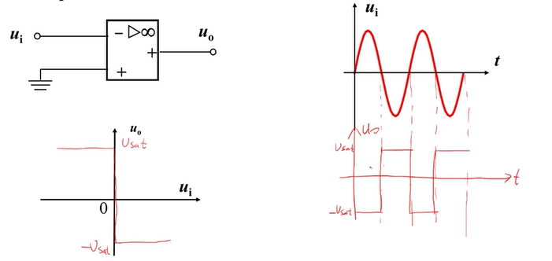

输入输出关系

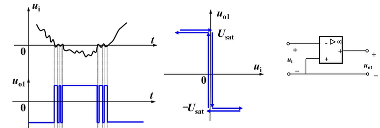

$$
\begin{align*}
u_o&=A × u_d \\
   &=\infty×(0-u_i) \\
   \\
u_o&=-U_{sat} ;u_i>0; \\
u_o&=+U_{sat} ;u_i<0; \\
\end{align*}
$$

**正反馈运放**

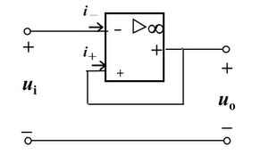

输出是$U_{sat}$或$-U_{sat}$

- 假设输出上有正值微小电压扰动，$u_o+=\Delta$,
- 由于正反馈，$u_+$微增，导致$u_d$微增，
  - $u_d=(u_+ - u_-)$ 
- 由于开环放大倍数，$u_d$微增导致$u_o$急增
  - $u_o=A u_d$
- 由于正反馈，$u_o$急增又导致$u_d$急增，
  - $u_d=(u_+ - u_-)$
  - $u_d\uparrow=(u_o\uparrow - u_-)$
- 从而运放输出电压快速达到正饱和$u_{sat}$
  - $u_o=+U_{sat}$
- 反之亦然，输出上有负值微小正扰动，$u_o-=\Delta$，输出负饱和电压 $u_o=-U_{sat}$
- 总结
  - $u_o=+U_{sat}$
    - $u_d=(u_+ - u_-)>0$
    - $u_+ > u_-$
  - $u_o=-U_{sat}$
    - $u_d=(u_+ - u_-)<0$
    - $u_+ < u_-$

正反馈运放不满足虚短性质
- 负反馈虚短性质的本质是因为运放输出的$u_o$是有限值，不是正饱和也不是负饱和，而放大倍数A是极大值，那么由于$U_o=A(u_+-u_-)$,其中的$u_d=(u_+-u_-)$必然逼近0值。
- 这里的正反馈运放电路，输出只能是正饱和或负饱和，因此不满足虚短性质。

正反馈运放满足虚短性质
- 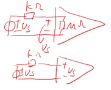
- 由于运放的输入内阻是兆欧级别，所以只要外部电路的电阻为千欧级别，那么分配到运放上的电压就是近似$U_s$，流入的电流也近似看作0值。

**迟滞比较器**

- 滞回比较器​​/​​迟滞比较器​
- ​​Hysteresis Comparator​​ 或 ​​Schmitt Trigger​​（施密特触发器）
- 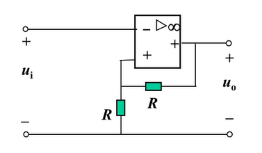
- 双阈值电压​​
  - ​上阈值电压（VTH+）​​：输入电压上升时触发输出跳变的临界值。
  - ​下阈值电压（VTH-）​​：输入电压下降时触发输出跳变的临界值
- 抗干扰能力​​：
  - 通过回差电压（ΔU = VTH+ - VTH-）避免输入信号在阈值附近抖动导致的误触发。
  - 实际上市面上几乎所有比较器内部都包含迟滞比较器。
​​- 典型应用场景​​：
  - 信号整形（如将正弦波转为方波）；
  - 噪声环境下的阈值检测（如温度控制、过压保护）；
  - 振荡器电路（如方波、三角波发生器）

输入输出特性

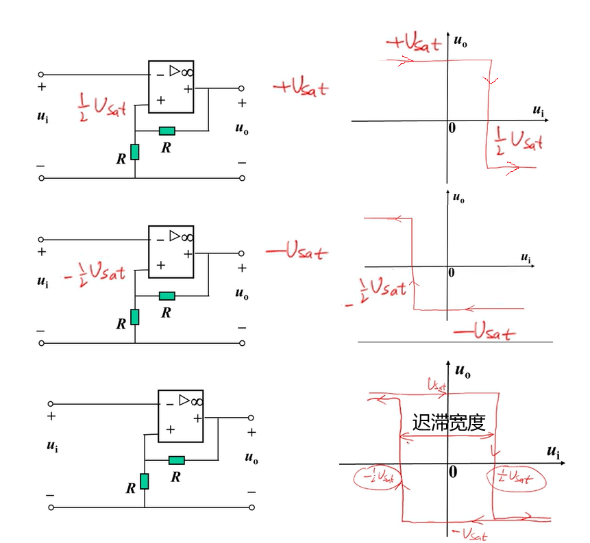

输入输出波形

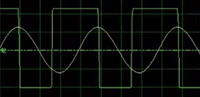

比较的延迟和滤波作用

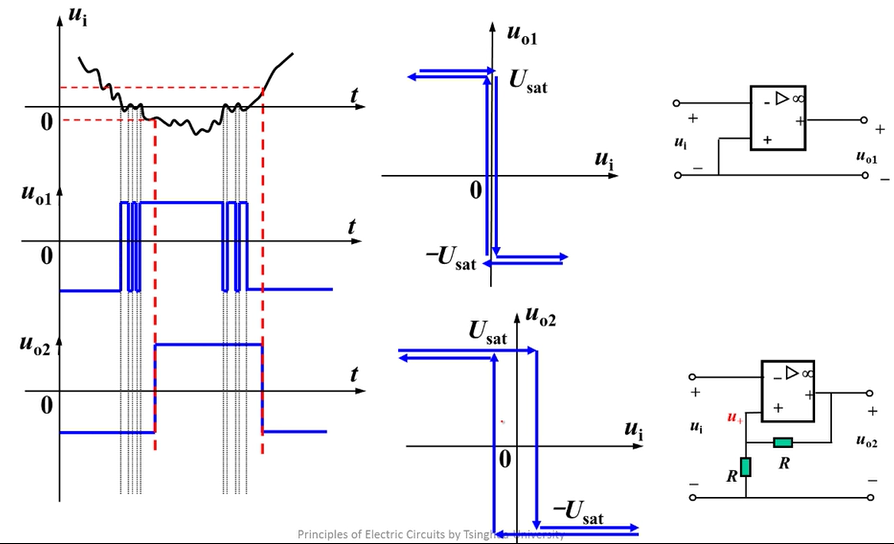

**方波生成器**

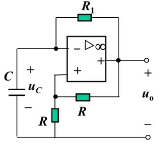

电路分析①

- 假设比较器输出$+U_{sat}$，电容电压初值为0V;
- 那么比较器输出的$+U_{sat}$、负反馈电阻$R_1$、电容$C$构成一阶RC电路。
- 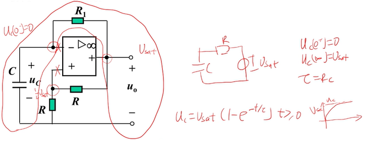
- 三要素法
  - $u_C(0^+)=u_C(0^-)=0$
  - $u_C(+\infty)=+U_{sat}$
  - $\tau=R_1C$
- 解
  - $u_C(t)=u_C(+\infty)+(u_C(0^+)-u_C(+\infty))e^{\frac{-t}{\tau}}$
  - $=U_{sat}+(0-U_{sat})e^{\frac{-t}{\tau}}$
  - $=U_{sat}-U_{sat}e^{\frac{-t}{\tau}}$
  - $=U_{sat}(1-e^{\frac{-t}{\tau}})$
- 当电容电压上升到$\frac{1}{2}U_{sat}$时，比较器输出$-U_{sat}$

电路分析②
- 当电容电压上升到$\frac{1}{2}U_{sat}$时，比较器输出$-U_{sat}$
- 那么比较器输出的$-U_{sat}$、负反馈电阻$R_1$、电容$C$构成一阶RC电路。
- 电容电压初值为$\frac{1}{2}U_{sat}$
- 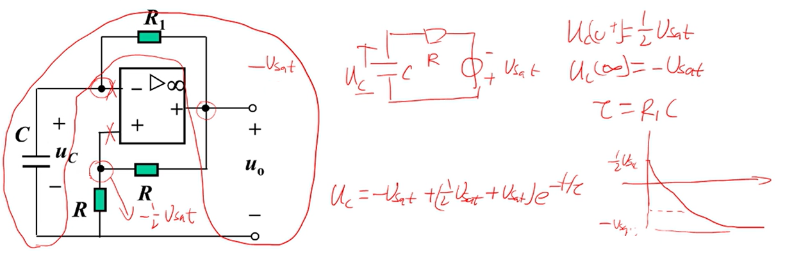
- 三要素法
  - $u_C(0^+)=u_C(0^-)=\frac{1}{2}U_{sat}$
  - $u_C(+\infty)=-U_{sat}$
  - $\tau=R_1C$
- 解
  - $u_C(t)=u_C(+\infty)+(u_C(0^+)-u_C(+\infty))e^{\frac{-t}{\tau}}$
  - $=-U_{sat}+(\frac{1}{2}U_{sat}+U_{sat})e^{\frac{-t}{\tau}}$

电路分析③
- 同理，当电容电压下降到$-\frac{1}{2}U_{sat}$时，比较器输出$+U_{sat}$
- 电容电压初值为$+\frac{1}{2}U_{sat}$
- 三要素法
  - $u_C(0^+)=u_C(0^-)=-\frac{1}{2}U_{sat}$
  - $u_C(+\infty)=+U_{sat}$
  - $\tau=R_1C$
- 解
  - $u_C(t)=u_C(+\infty)+(u_C(0^+)-u_C(+\infty))e^{\frac{-t}{\tau}}$
  - $=U_{sat}+(-\frac{1}{2}U_{sat}-U_{sat})e^{\frac{-t}{\tau}}$

输入输出波形

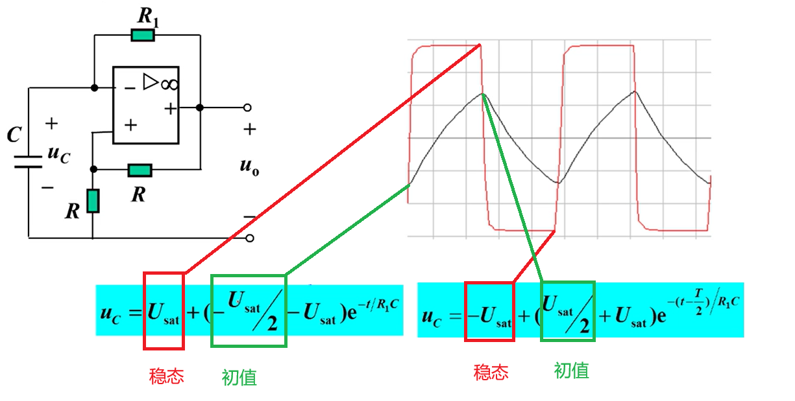

方波的周期

- 根据分析可知 当$t=\frac{1}{2}T$ 时，
- $u_C(t)=U_{sat}+(-\frac{1}{2}U_{sat}-U_{sat})e^{\frac{-t}{\tau}}=\frac{1}{2}U_{sat}$

$$
\begin{align*}
  U_{sat}+(-\frac{1}{2}U_{sat}-U_{sat})e^{\frac{-\frac{1}{2}T}{\tau}}&=\frac{1}{2}U_{sat} \\
  U_{sat}+(-\frac{1}{2}U_{sat}-U_{sat})e^{-\frac{1}{2R_1C}T}&=\frac{1}{2}U_{sat} \\
  (-\frac{1}{2}U_{sat}-U_{sat})e^{-\frac{1}{2R_1C}T}&=\frac{1}{2}U_{sat}-U_{sat} \\
  e^{-\frac{1}{2R_1C}T}&=\frac{\frac{1}{2}U_{sat}-U_{sat}}{-\frac{1}{2}U_{sat}-U_{sat}}=\frac{-\frac{1}{2}U_{sat}}{-\frac{3}{2}U_{sat}}=\frac{1}{3} \\
  ln(\frac{1}{3})&=-\frac{1}{2R_1C}T \\
  -ln3&=-\frac{1}{2R_1C}T \\
  ln3&=\frac{1}{2R_1C}T \\
  T&=2R_1C\ln3
\end{align*}
$$

其中：
- $\ln3≈1.0986$，因此 $T≈2.197R_1C$。

## 能量处理