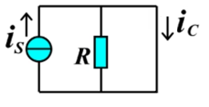
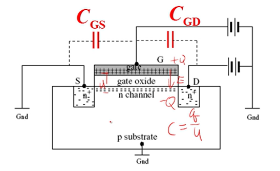
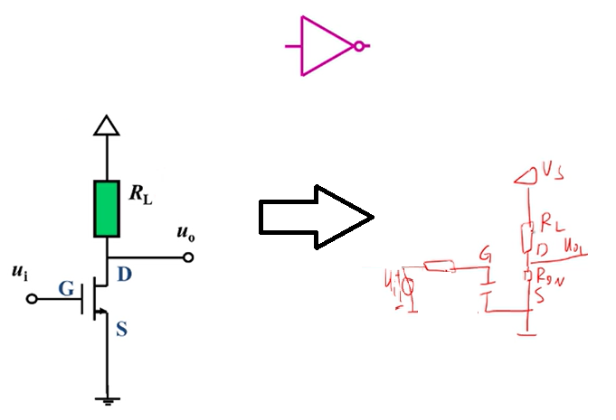
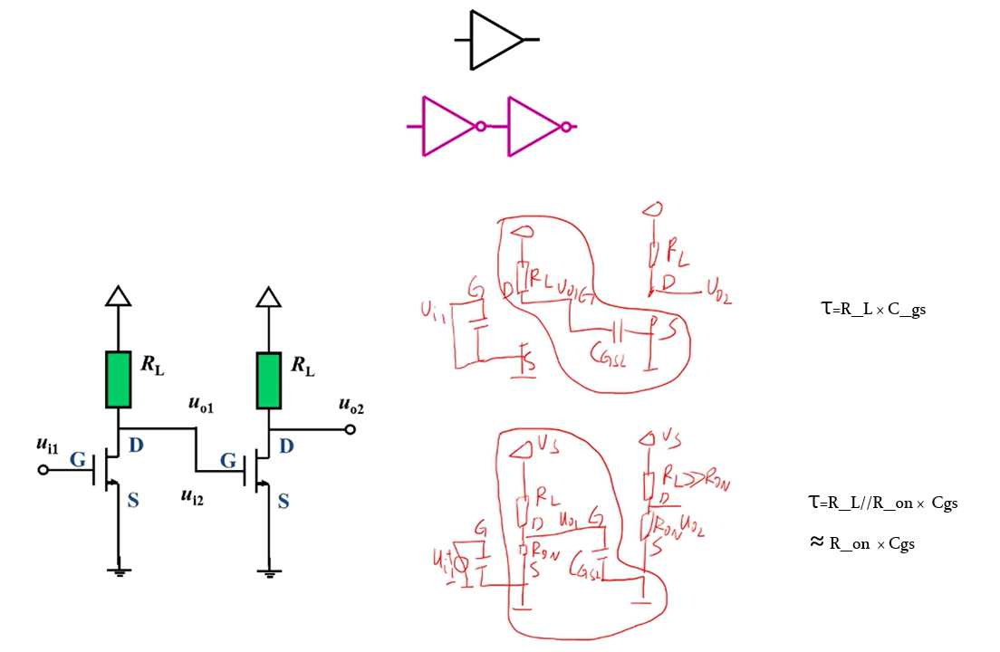
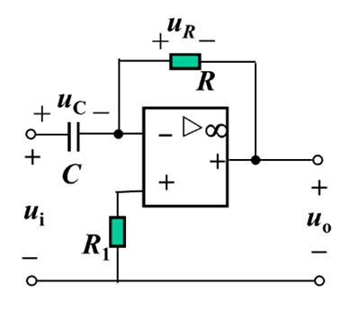
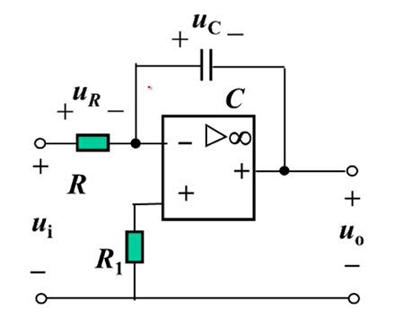

# 一阶电路应用

## 信号处理

### 门传输延迟

**MOSFET的线性电阻区**

- 将MOSFET应用于门电路时，一般认为其工作在线性电阻区；
- 转移特性曲线的斜率表征的就是$U_{gs}=x$时DS极之间的电阻。
- 

**MOSFET的寄生参数**
- 给MOSFET的栅极和漏极施加电压后,栅极氧化物绝缘层的上下两侧会汇集正负电荷，并形成电场；
- 这就符合电容的定义，$C=\frac{Q}{U}$；
- 即：MOSFET的栅极和漏极之间由于绝缘层的存在，会产生等效电容$C_gs$
- 

**MOSFET反相器的传输延迟**
- 把反相器的输入部分等效简化，实际上就是信号源、电阻、等效电容$C_{gs}$的串联一阶RC电路。
- 
- MOSFET反相器的传输延迟主要来自等效电容$C_{gs}$的充电。
- 时间常数$\tau=RC$
- $\tau$应当远远小于信号源的频率周期
  - 选用$C_{gs}$较小的MOSFET
  - 降低电阻R

**缓冲器的传输延迟**
- $C_{gs}$充电时间常数$\tau=R_L × C_{gs}$
- $C_{gs}$放电时间常数$\tau=(R_{ON}//R_{L}) × C_{gs}≈R_{ON} × C_{gs}$

### 一阶运放电路

**微分器**

- 拓扑约束
  - KVL $u_i = u_C+u_R+u_o$
  - KCL $i_C=i_R$
- 运放负反馈虚短虚断：
  - $i_C = i_R$
  - $u_+=u_-=0$
    - $u_i=u_C$
    - $u_o=-u_R$
- 元件约束
  - $i_R=\frac{u_R}{R}$
  - $i_C=C\frac{d}{dt}u_C$

输入输出关系推导：
$$
\begin{align*}
    i_R &= i_C \\
     u_R/R &= C\frac{d}{dt}u_C \\
    (-u_o)/R &= C\frac{d}{dt}u_i \\
    -u_o &= RC\frac{d}{dt}u_i \\
    u_o &= -RC\frac{d}{dt}u_i \\
\end{align*}
$$

**积分器**

- 拓扑约束
  - KVL $u_i = u_R+u_C+u_o$
  - KCL $i_R=i_C$
- 运放负反馈虚短虚断：
  - $i_C = i_R$
  - $u_+=u_-=0$
    - $u_i=u_R$
    - $u_o=-u_C$
- 元件约束
  - $i_R=\frac{u_R}{R}$
  - $i_C=C\frac{d}{dt}u_C$

- 输入输出关系推导：

$$
\begin{align*}
    i_C &= i_R \\
    C\frac{d}{dt}u_C &= \frac{u_R}{R} \\
    C\frac{d}{dt}(-u_o) &= \frac{u_i}{R} \\
    \frac{d}{dt}(-u_o) &= \frac{u_i}{RC} \\
    (-u_o) &= \frac{1}{RC}\int u_i(\tau) d \tau \\
    u_o &= -\frac{1}{RC}\int u_i(\tau) d \tau \\
\end{align*}
$$

**方波生成器**

## 能量处理