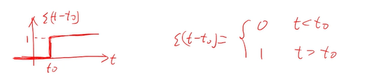
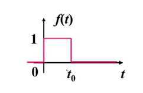
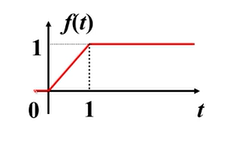
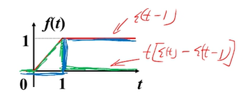
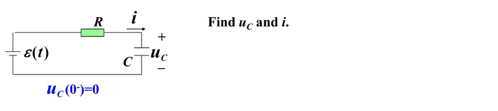

# 任意激励下的时域分析(单位阶跃函数和单位阶跃响应)

## 单位阶跃函数

$$
\epsilon(t) =
\begin{cases}
    0 & t<0 \\
    1 & t>0
\end{cases}
$$ 

<Desmos :expressions="[
    {latex:`\\epsilon(t)=\\left\\{t<0:0,t>0:1\\right\\}`}
]"/>

> - $ϵ(0)=?$ 在不同的教材有不同的定义
> - 只需要知道：$ϵ(0^+)=1$

## 使用单位阶跃函数等效换路后的电路激励

> 利用单位阶跃函数，可以把电路的激励和换路过程在端口上等效为一个关于单位阶跃函数的表达式：

## 单位阶跃函数的延时

$$
f(t)
=\epsilon(t-t_0)
=\begin{cases}
    0 & t<t_0 \\
    1 & t>t_0
\end{cases}
$$ 

<Desmos :expressions="[
        {latex:`\\epsilon(t)=\\left\\{t<0:0,t>0:1\\right\\}`,hidden:true},
        {latex:`\\f(t)=\\epsilon(t-t_{0})`},
        {latex:`t_{0}=1`,playing:true, sliderBounds: {min: '0'}}
    ]"
/>

## 矩形窗函数

> 使用单位阶跃函数和其延时函数组合矩形窗口函数

$$
f(t) = \epsilon(t)+\epsilon(t-t_0)
$$

<Desmos :expressions="[
        {latex:`\\epsilon(t)=\\left\\{t<0:0,t>0:1\\right\\}`,hidden:true},
        {latex:`\\f(t)=\\epsilon(t)-\\epsilon(t-t_{0})`},
        {latex:`t_{0}=1`,playing:true, sliderBounds: {min: '0'}}
    ]"
/>

## 复杂函数

### 观点1

> 函数f由以下绿色和蓝色两个函数复合而成

$$
\begin{align*}
    f_1(t) &= t [\epsilon(t)+\epsilon(t-1)] \\
    f_2(t) &= \epsilon(t-1) \\
    f(t) &= f_1(t) + f_2(t)
\end{align*}
$$

<Desmos :expressions="[
        {latex:`\\epsilon(t)=\\left\\{t<0:0,t>0:1\\right\\}`,hidden:true},
        {latex:`\\f_1(t)=t(\\epsilon(t)-\\epsilon(t-t_{0}))`},
        {latex:`\\f_2(t)=\\epsilon(t-t_{0})`},
        {latex:`\\f(t)=f_1(t)+f_2(t)`},
        {latex:`t_{0}=1`,playing:true, sliderBounds: {min: '0'}}
    ]"
/>

### 观点2

> 函数f由以下绿色和蓝色两个函数复合而成

$$
\begin{align*}
    f_1(t) &= t\epsilon(t) \\
    f_2(t) &= -(t-1)\epsilon(t-1) \\
    f(t) &= f_1(t) + f_2(t)
\end{align*}
$$

<Desmos :expressions="[
        {latex:`\\epsilon(t)=\\left\\{t<0:0,t>0:1\\right\\}`,hidden:true},
        {latex:`\\f_1(t)=t\\epsilon(t)`},
        {latex:`\\f_2(t)=-(t-t_{0})\\epsilon(t-t_{0})`},
        {latex:`\\f(t)=f_1(t)+f_2(t)`},
        {latex:`t_{0}=1`,playing:true,sliderBounds: {min: '0'}}
    ]"
/>

## 单位阶跃响应

**单位阶跃响应** 是指 **单位阶跃函数$\epsilon(t)$激励** 作用下的 **零状态响应(ZSR)**

三要素
- $u_c(0^+)=0$
- $u_c(+\infty)=\epsilon(t)=1$
- $\tau=RC$

列写方程
$$
\begin{align*}
    u_c&=1+(0-1)e^{-\frac{t}{\tau}} \\
       &=1-1e^{-\frac{t}{\tau}} \\
       &=(1-e^{-\frac{t}{\tau}})\epsilon(t) & t>0^+\\
\end{align*}
$$

三要素
- $i_c(0^+)=\frac{\epsilon}{R}=\frac{1}{R}$
- $i_c(+\infty)=0$
- $\tau=RC$

列写方程
$$
\begin{align*}
    i_c&=0+(\frac{1}{R}-0)e^{-\frac{t}{\tau}} \\
       &=\frac{1}{R}e^{-\frac{t}{\tau}} \\
       &=\frac{1}{R}e^{-\frac{t}{\tau}}\epsilon(t) & t>0^+\\
\end{align*}
$$