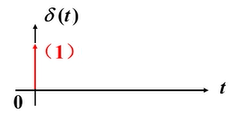
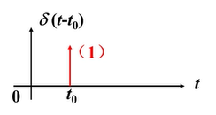
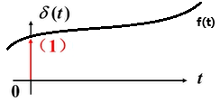
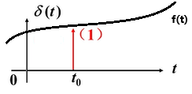

# 任意激励下的时域分析(单位冲击函数和单位冲击响应)

## 单位脉冲函数(Unit Pulse Function)

使用单位阶跃函数定义单位脉冲函数：

$$
\begin{align*}
    p(t) &= \frac{1}{\Delta}\epsilon(t)-\frac{1}{\Delta}\epsilon(t-\Delta) \\
    S &= \frac{1}{\Delta} * \Delta = \int_{-\infty}^{+\infty} p(t)dt = 1 & \text{面积为1}
\end{align*}
$$

<Desmos :expressions="[
        {latex:`\\epsilon(t)=\\left\\{t<0:0,t>0:1\\right\\}`,hidden:true},
        {latex:`p(t)=\\frac{1}{\\Delta}\\epsilon(t)-\\frac{1}{\\Delta}\\epsilon(t-\\Delta)`},
        {latex:`\\Delta=1`,playing:true,sliderBounds: {min: '0',max:'1'}},
        {latex:`S=\\int_{-\\infty}^{+\\infty}p(t)dt`},
        {latex:`0\\le y\\le p(x)`},
    ]"
/>

## 单位冲击函数(Unit Impulse Function)

使用单位脉冲函数定义单位冲击函数：

$$
\begin{align*}
    \delta(t)&=\lim\limits_{\Delta \to 0} p(t) \\
\end{align*}
$$

函数特点：
$$
\begin{align*}
    \delta(t) &= 
        \begin{cases}
            0 &t<0 \\
            +\infty &t \to 0\\
            0 &t>0 \
        \end{cases} \\
    S &= \int_{-\infty}^{+\infty} \delta(t)dt =\int_{0^-}^{0^+} \delta(t)dt = 1 & \text{面积为1}
\end{align*}
$$

<Desmos :expressions="[
        {latex:`\\epsilon(t)=\\left\\{t<0:0,t>0:1\\right\\}`,hidden:true},
        {latex:`p(t)=\\frac{1}{\\Delta}\\epsilon(t)-\\frac{1}{\\Delta}\\epsilon(t-\\Delta)`},
        {latex:`\\Delta=0.1`,sliderBounds: {min: '0',max:'1'}},
        {latex:`\\delta(t)=p(t)`},
        {latex:`S=\\int_{-\\infty}^{+\\infty}p(t)dt`},
        {latex:`0\\le y\\le \\delta(x)`},
    ]"
/>

## 单位冲击函数的延时（平移性质）

$$
\begin{align*}
    f(t)=\delta(t-t_0) \\
\end{align*}
$$

函数特点：

$$
\begin{align*}
    f(t)&=0 & t\neq t_0 \\
    S&=\int_{-\infty}^{+\infty}f(t)dt=\int_{t_0^-}^{t_0^+}f(t)dt=1  & \text{面积为1}\\
\end{align*}
$$

<Desmos :expressions="[
        {latex:`\\epsilon(t)=\\left\\{t<0:0,t>0:1\\right\\}`,hidden:true},
        {latex:`p(t)=\\frac{1}{\\Delta}\\epsilon(t)-\\frac{1}{\\Delta}\\epsilon(t-\\Delta)`,hidden:true},
        {latex:`\\Delta=0.1`,sliderBounds: {min: '0',max:'1'}},
        {latex:`\\delta(t)=p(t)`,hidden:true},
        {latex:`f(t)=\\delta(t-t_{0})`},
        {latex:`t_{0}=1`,playing:true,sliderBounds: {min: '0',max:'1'}},
        {latex:`S=\\int_{-\\infty}^{+\\infty}f(t)dt`},
        {latex:`0\\le y\\le f(x)`},
    ]"
/>

## 单位冲击函数和其他函数的乘积

$$
\begin{align*}
    f(t)\delta(t)=f(0)\delta(t) \\
\end{align*}
$$

$$
\begin{align*}
    S &= \int_{-\infty}^{+\infty}f(t)\delta(t) \\
    &=\int_{-\infty}^{+\infty}f(0)\delta(t) \\
    &=f(0)\int_{-\infty}^{+\infty}\delta(t) \\
    &=f(0) * 1 \\
    &=f(0) 
\end{align*}
$$

## 延时单位冲击函数和其他函数的乘积

$$
\begin{align*}
    &f(t)\delta(t-t_0)  \\
    &=f(t_0)\delta(t-t_0) \\
\end{align*}
$$

$$
\begin{align*}
    &\int_{-\infty}^{+\infty}f(t)\delta(t-t_0) \\
    &=\int_{-\infty}^{+\infty}f(0)\delta(t-t_0) \\
    &=f(t_0)\int_{-\infty}^{+\infty}\delta(t-t_0) \\
    &=f(t_0) * 1 \\
    &=f(t_0) 
\end{align*}
$$

## 单位阶跃函数和单位冲击函数的关系

$$
\begin{align*}
    \int_{-\infty}^{t}\delta(t)dt &=
    \begin{cases}
        \int_{-\infty}^{t}\delta(t)dt = 0  & t < 0^-\\
        \int_{-\infty}^{0^+}\delta(t)dt = 1 & t = 0^+\\
        \int_{-\infty}^{t}\delta(t)dt = 1 & t > 0^+\\
    \end{cases} \\
    &= \epsilon(t) \\
    \frac{d}{dt}\epsilon(t) &= \delta(t) \\
\end{align*}
$$
