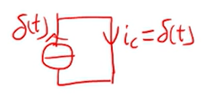

# 任意激励下的时域分析(单位冲激响应)

## 单位冲激响应（unit impulse response）

> 单位冲激响应: 电路在单位冲激函数$\delta(t)$作用下的零状态响应**ZSR**

### 方法1

> 列写微分方程，两边求$[0^+,0^-]$的积分。

- KCL: $i_s=i_C$
- 元件约束：$i_C=C\frac{du}{dt}$

$$
\begin{align*}
    i_s &= C\frac{du}{dt} \\
    \delta(t) &= C\frac{du}{dt} \\
    \int_{0^-}^{0^+} \delta(t) dt &= \int_{0^-}^{0^+} C\frac{du}{dt} dt \\
    1 &= \int_{0^-}^{0^+} C du \\
    1 &= C[u(0^+) -u(0^-)] \\
    1 &= C[u(0^+) -0] \\
    \frac{1}{C} &= u(0^+) \\
    u(0^+) &= \frac{1}{C} \\
\end{align*}
$$

单位冲激函数的作用是将单位正电荷移动到电容上。
$$
\begin{align*}
    q_c(0^-)&=0 \\
    q_c(0^+)&=C*u(0^+)=C*\frac{1}{C}=1 \\
\end{align*}
$$

### 方法2

**观察法**

> 在零状态下，$u_C(0^-)$=0，如果$i_c$不含冲击，U_C(0^+)则等于0,否则不为0.

$$
u_C(0^+)=u_C(0^-)+\frac{1}{C}\int_{0^-}^{0^+} i_c dt
$$

对于更为复杂的电路，不能一眼看出$i_c$中包含$\delta(t)$时,可以使用假设检验法：

假设$i_c$没有冲击，则$u_C(0^+)=0$,相当于0值电压源或者导线：
- 
- 通过观察可以发现$i_c\neq0$，假设不成立。

所以：
$$
u_C(0^+)=u_C(0^-)+\frac{1}{C}\int_{0^-}^{0^+} i_c dt = 0+ \frac{1}{C}*1=\frac{1}{C}
$$