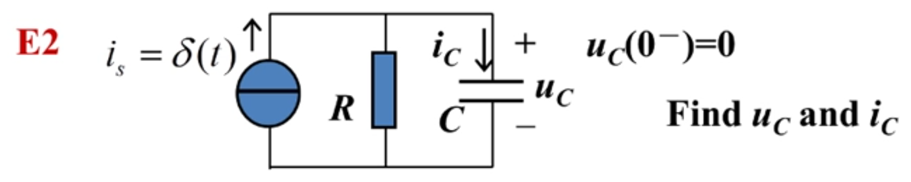

# 任意激励下的时域分析(单位冲激响应)

## 单位冲激响应（unit impulse response）

> 单位冲激响应: 电路在单位冲激函数$\delta(t)$作用下的零状态响应**ZSR**

### 方法1

> 列写微分方程，两边求$[0^+,0^-]$的积分。

- 拓扑约束KCL: $i_s=i_C=\delta(t)$
- 元件约束：$i_C=C\frac{du}{dt}$

$$
\begin{align*}
    i_c = i_s = \delta(t) &= C\frac{du}{dt} \\
    \delta(t) &= C\frac{du}{dt} \\
    \int_{0^-}^{0^+} \delta(t) dt &= \int_{0^-}^{0^+} C\frac{du}{dt} dt \\
    1 &= \int_{0^-}^{0^+} C du \\
    1 &= C[u(0^+) -u(0^-)] \\
    1 &= C[u(0^+) -0] \\
    \frac{1}{C} &= u(0^+) \\
    u(0^+) &= \frac{1}{C} \\
\end{align*}
$$

**对于$t>0^+$**
$$
\begin{align*}
    u(t)
    &=u(0^+)+\int_{0^+}^{t}i_c(t)dt\\
    &=\frac{1}{C}+\frac{1}{C}\int_{0^+}^{t}\delta(t)dt\\
    &=\frac{1}{C}+0\\
    &=\frac{1}{C}\\
\end{align*}
$$

所以有：
- $i_c(0^-) = \delta(t)$
- $u_c(t)$
  - $u(0^-) = 0$
  - $u(0^+) = \frac{1}{C}$
  - $u(t>0) = \frac{1}{C}$

> 注：单位冲激函数的作用是将单位正电荷移动到电容上。
$$
\begin{align*}
    q_c(0^-)&=0 \\
    q_c(0^+)&=C*u(0^+)=C*\frac{1}{C}=1 \\
\end{align*}
$$

### 方法2

**观察法**

> 在零状态下，$u_c(0^-)$=0，如果$i_c$不含冲击，$u_c(0^+)$则等于0,否则不为0.

$$
u_c(0^+)=u_c(0^-)+\frac{1}{C}\int_{0^-}^{0^+} i_c dt
$$

对于更为复杂的电路，不能一眼看出$i_c$中包含单位冲击函数$\delta(t)$的作用时,可以使用假设检验法：

假设$i_c$没有冲击，则$u_c(0^+)=0$,相当于0值电压源或者导线：
- 
- 通过观察可以发现$i_c=\delta(t)\neq0$，假设不成立。

所以：
$$
u_c(0^+)=u_c(0^-)+\frac{1}{C}\int_{0^-}^{0^+} i_c dt = 0+ \frac{1}{C}*1=\frac{1}{C}
$$

### 方法3

#### 理论基础

> 将单位阶跃响应求导，得到单位冲击响应。

**推导：**

#### 案例求解/方法步骤

**1. 求零状态单位阶跃响应**

- 
- 激励为单位阶跃函数
  - 即：$i_s(t) = \epsilon(t)$
- 零状态则储能元件初值为0
  - 即：$u_c(0^-)=0$

于是有：

$$
\begin{align*}
    i_{cs}(t) &= i_s(t) =\epsilon(t) \\
    u_{cs}(t) &= u_c(0^-) + \frac{1}{C}\int_{0^-}^{t} i_c(t) dt \\
            &= 0 + \frac{1}{C}\int_{0^-}^{t} \epsilon(t) dt \\
            &= \frac{1}{C}(t\epsilon(t)-t\epsilon(0^-)) \\
            &= \frac{t}{C}\epsilon(t) \\
\end{align*}
$$

> 注：
> - $u_{cs}$ c表示电容，s表示单位阶跃激励作用下的响应
> - $\frac{d}{dt}[t\epsilon(t)]=\epsilon(t)$
> - $\int\epsilon(t)dt=t\epsilon(t)$

**2. 用单位阶跃响应求单位冲击响应**

$$
\begin{align*}
    i_{ch}(t)
    &= \frac{d}{dt}[i_{cs}(t)] \\
    &= \frac{d}{dt}[\epsilon(t)] \\
    &= \delta(t)  \\
    u_{ch}(t)
    &= \frac{d}{dt}[u_{cs}(t)] \\
    &= \frac{d}{dt}[\frac{t}{C}\epsilon(t)] \\
    &= \frac{d}{dt}[\frac{t}{C}]\epsilon(t)+\frac{t}{C}\frac{d}{dt}[\epsilon(t)] \\
    &= \frac{1}{C}\epsilon(t)+\frac{t}{C}\delta(t) \\
    &= \frac{1}{C}\epsilon(t)+\frac{0}{C}\delta(t) \\
    &= \frac{1}{C}\epsilon(t)+0 \\
    &= \frac{1}{C}\epsilon(t)
\end{align*}
$$

> 注：
> - $f(t)\delta(t)=f(0)\delta(t)$
> - $u_{cs}$ c表示电容，s表示单位阶跃激励作用下的响应
> - $u_{ch}$ c表示电容，h表示单位冲击激励作用下的响应

### 总结：三种方法求例题2

#### 方法一: 对[0^~0^+]积分

> 对于 t=0

- 拓扑约束 
  - KCL: $i_S = i_R + i_C$
  - KVL: $u_R = u_C$
- 元件约束
  - $i_S = \delta(t)$
  - $i_R = {u_R}/{R}$
  - $i_C = C\frac{d}{dt}u_c$

$$
\begin{align*}
    i_S &= i_R + i_C \\
    \delta(t) &= {u_R}/{R} + C\frac{d}{dt}u_c \\
    \delta(t) &= {u_C}/{R} + C\frac{d}{dt}u_c \\
    \int_{0^-}^{0^+}\delta(t)dt &= \frac{1}{R}\int_{0^-}^{0^+}{u_C} dt + C\int_{0^-}^{0^+}\frac{d}{dt}u_c dt \\
    \int_{0^-}^{0^+}\delta(t)dt &= \frac{1}{R}\int_{0^-}^{0^+}{u_C} dt + C\int_{0^-}^{0^+}du_c \\
    1 &= 0 + C[u_c(0^+)-u_c(0^-)] \\
    1 &= C[u_c(0^+)-0] \\
    1 &= Cu_c(0^+) \\
    u_c(0^+) &= \frac{1}{C} \\
    u_c(0^-) &= 0 \\
    u_c(t) &= \frac{1}{C}\epsilon(t) \\
\end{align*}
$$

$$
\begin{align*}
    i_C(t) &= C\frac{d}{dt}u_c(t) \\
        &= C\frac{d}{dt}[\frac{1}{C}\epsilon(t)] \\
        &= \frac{C}{C}\frac{d}{dt}[\epsilon(t)] \\
        &= 1*\delta(t) \\
        &= \delta(t) \\
\end{align*}
$$

注：$\frac{1}{R}\int_{0^-}^{0^+}{u_C} dt=0$可以理解为$u_C$有界，而积分区间dt是无穷小，有界*无穷小=无穷小$，  

另外，可以看出电流完全从电容流过，经过电阻的电流为0，因为电容电压不能突变,而电容初值为0，等效为0值电压源，即短路的导线。  

> 对于 t>0

电流源看成开路

- 拓扑约束 
  - KCL: $i_R = i_C$
- 元件约束
  - $i_R = {u_R}/{R}$
  - $i_C = C\frac{d}{dt}u_c$
- 电容电压解三要素
  - 时间常数： $\tau=RC$
  - 初值： $u_c(0^+) = \frac{1}{C}$
  - 稳态： $u_c(+\infty) = 0$
- 电容电流解三要素
  - 时间常数： $\tau=RC$
  - 初值： $i_c(0^+) = \frac{u_C(0^+)}{R} = \frac{1}{RC}$
  - 稳态： $i_c(+\infty) = 0$

$$
\begin{align*}
    u_c(t) &= u_c(+\infty) - [u_c(0^+) - u_c(+\infty)]e^{-\frac{1}{\tau}} \\
           &= 0 - [\frac{1}{C} -0]e^{-\frac{1}{RC}} \\
           &= \frac{1}{C}e^{-\frac{1}{RC}} \\
\end{align*}
$$

$$
\begin{align*}
    i_c(t) &= i_c(+\infty) - [i_c(0^+) - i_c(+\infty)]e^{-\frac{1}{\tau}} \\
           &= 0 - [\frac{1}{RC} -0]e^{-\frac{1}{RC}} \\
           &= -\frac{1}{RC}e^{-\frac{1}{RC}} \\
\end{align*}
$$

#### 方法二: 观察法

> 对于 t=0

假设$u_c(0^+)=0$即在$[0^-,0^+]$电容电压保持不变，  
那么电容始终等效为0值电压源，即导线。则：

- 假设：$u_c(0^+)=0$ 则 $i_c(t)=\delta(t)$
- 检验：$u_c(0^+)=u_c(0^-)+\frac{1}{C}\int_{0^-}^{0^+}i_c dt$
  - $=0+\frac{1}{C}$
  - $=\frac{1}{C}$
  - $\neq0$ 说明假设错误。

> 对于 t>0

按三要素法分析....

#### 方法三：求单位阶跃响应的导数

> 先求单位阶跃响应

- 拓扑约束 
  - KCL: $i_S = i_R + i_C$
  - KVL: $u_R = U_C$
- 元件约束
  - $i_S = \epsilon(t)$
  - $i_R = {u_R}/{R}$
  - $i_C = C\frac{d}{dt}u_c$
- 电容电流解三要素
  - 时间常数： $\tau=RC$
  - 初值： $i_c(0^+) = \epsilon(0^+)=1$
  - 稳态： $i_c(+\infty) = 0$
- 电容电压解三要素
  - 时间常数： $\tau=RC$
  - 初值： $u_c(0^+) = u_c(0^-)=0$
  - 稳态： $u_c(+\infty) = \epsilon(t)R= R$

 

$$
\begin{align*}
    i_c(t=0^-) &= 0\\
    i_c(t\gt0+) &= i_c(+\infty) + [i_c(0^+)-i_c(+\infty)]e^{-\frac{t}{\tau}}\\
           &= 0+[1-0]e^{-\frac{t}{RC}}\\
           &= e^{-\frac{t}{RC}}\\
           &= e^{-\frac{t}{RC}}\\
    i_{cs}(t) &= e^{-\frac{t}{RC}} \epsilon(t)
\end{align*}
$$

$$
\begin{align*}
    u_c(t=0^-) &= 0\\
    u_c(t\gt0+) &= u_c(+\infty) + [u_c(0^+)-u_c(+\infty)]e^{-\frac{t}{\tau}}\\
           &= R+[0-R]e^{-\frac{t}{RC}}\\
           &= R-Re^{-\frac{t}{RC}}\\
           &= R[1-e^{-\frac{t}{RC}}]\\
    u_{cs}(t) &= R[1-e^{-\frac{t}{RC}}] \epsilon(t)
\end{align*}
$$

> 对单位阶跃响应s(t)求导得到单位冲击响应h(t)  
> - $h(t)=\frac{d}{dt}s(t)$
> - 求导过程中需要带着$\epsilon(t)$ 因为是对全时域求导
> - 求导经常要用到公式$f(t)\delta(t)=f(0)\delta(t)$

$$
\begin{align*}
    i_{ch}(t) &= \frac{d}{dt} i_{cs}(t) \\
              &= \frac{d}{dt}[ e^{-\frac{t}{RC}} \epsilon(t) ]\\
              &= \frac{d}{dt}[ e^{-\frac{t}{RC}}]  \epsilon(t) + e^{-\frac{t}{RC}}  \frac{d}{dt}[ \epsilon(t) ]\\
              &= -\frac{1}{RC} e^{-\frac{t}{RC}}  \epsilon(t) + e^{-\frac{t}{RC}}\delta(t)\\
              &= -\frac{1}{RC} e^{-\frac{t}{RC}}  \epsilon(t) + e^{-\frac{0}{RC}}\delta(t)\\
              &= -\frac{1}{RC} e^{-\frac{t}{RC}}  \epsilon(t) + 1\delta(t)\\
              &= \delta(t) - \frac{1}{RC} e^{-\frac{t}{RC}}  \epsilon(t)\\
          \end{align*}
$$

$$
\begin{align*}
    u_{ch}(t) &=  \frac{d}{dt} u_{cs}(t) \\
              &= \frac{d}{dt}[ R[1-e^{-\frac{t}{RC}}] \epsilon(t)] \\
              &= \frac{d}{dt}[ R[1-e^{-\frac{t}{RC}}]] \epsilon(t)  +  R[1-e^{-\frac{t}{RC}}] \frac{d}{dt}[\epsilon(t)]\\
              &= -R*-\frac{1}{RC}e^{-\frac{t}{RC}} \epsilon(t)  +  R[1-e^{-\frac{t}{RC}}] \delta(t)\\
              &= \frac{1}{C}e^{-\frac{t}{RC}} \epsilon(t)  +  R[1-e^{-\frac{0}{RC}}] \delta(t)\\
              &= \frac{1}{C}e^{-\frac{t}{RC}} \epsilon(t)  +  R[1-1] \delta(t)\\
              &= \frac{1}{C}e^{-\frac{t}{RC}} \epsilon(t)  +  0\\
              &= \frac{1}{C}e^{-\frac{t}{RC}} \epsilon(t)\\
\end{align*}
$$

将方法三的计算结果和函数图像和方法一的对比，可以发现是完全一致的。

