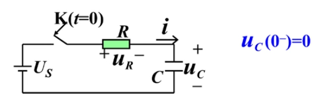
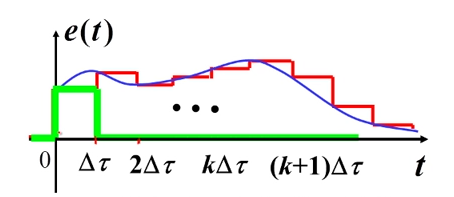
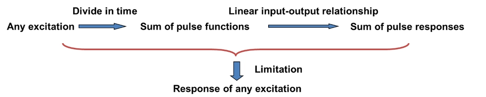
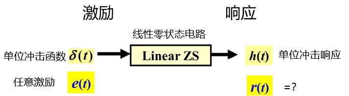
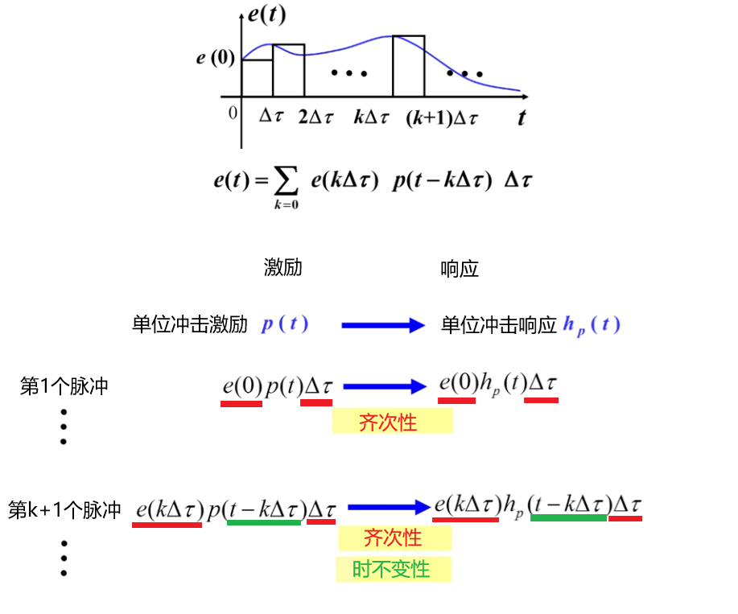
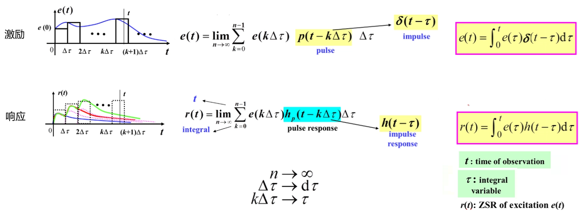
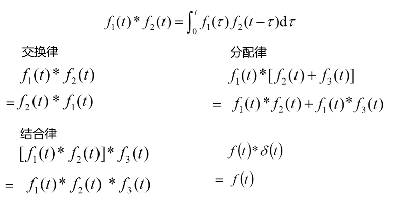

# 任意激励下的时域分析(卷积积分)

## 零状态(ZSR)条件的重要性质

> 零状态条件的意义在于使得电路的激励和响应之间满足线性关系，从而满足齐次性和可加性。

## 卷积积分的概念

对于这个任意激励作用下的零状态电路，  
由于是零状态，于是激励和响应必然满足线性关系，那么激励和响应必然满足齐次性和可加性。

由于可加性，可以将任意激励在时间轴做划分，把激励看成是多个脉冲函数的和，于是响应就是这些脉冲函数单独作用的和。

划分的时间单位越小，计算精度越高，取极限，就是卷积积分。

## 卷积积分的推导

对于线性零状态电路，已知激励为单位冲击函数$\delta(t)$，响应为单位冲击响应$h(t)$，  
那么只要能把任意激励函数$e(t)$写成包含单位冲击函数的形式，  
根据齐次性和可加性，响应$r(t)$也可以写成相同的形式。

第一步，先把任意激励函数写成单位脉冲函数的形式。

第二步，利用齐次性，分析每个单位脉冲激励的响应。

第三步，利用可加性，分析t时刻的响应

第四步，对激励和响应求极限，得到卷积积分

## 卷积积分的四个结论

## 例题

