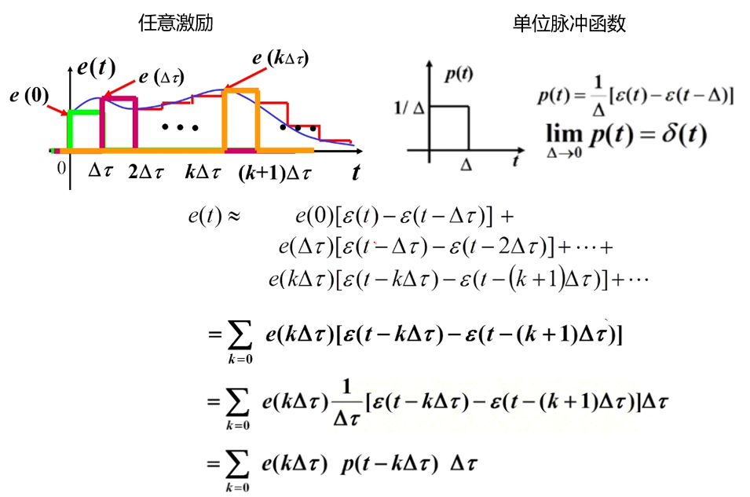

# 任意激励下的时域分析(卷积积分)

## 零状态(ZSR)条件的重要性质

> 零状态条件的意义在于使得电路的激励和响应之间满足线性关系，从而满足齐次性和可加性。

## 卷积积分的概念

对于这个任意激励作用下的零状态电路，  
由于是零状态，于是激励和响应必然满足线性关系，那么激励和响应必然满足齐次性和可加性。

由于可加性，可以将任意激励在时间轴做划分，把激励看成是多个脉冲函数的和，于是响应就是这些脉冲函数单独作用的和。

划分的时间单位越小，计算精度越高，取极限，就是卷积积分。

## 卷积积分的推导

对于线性零状态电路，已知激励为单位冲击函数$\delta(t)$，响应为单位冲击响应$h(t)$，  
那么只要能把任意激励函数$e(t)$写成包含单位冲击函数的形式，  
根据齐次性和可加性，响应$r(t)$也可以写成相同的形式。

第一步，先把任意激励函数写成单位脉冲函数的形式。

第二步，利用齐次性，分析每个单位脉冲激励的响应。

第三步，利用可加性，分析t时刻的响应

第四步，对激励和响应求极限，得到卷积积分

## 卷积积分的四个结论

## 例题

- 把电路的响应拆分为零输入响应+零状态响应
- 求解四部曲：
  - ①求 ZIR，零输入响应
  - 求零状态响应
    - ②求 $h(t)$ 单位冲击响应  
    - ③求 ZSR=$e(t) \ast h(t)$，计算激励和单位冲击响应的卷积积分得到零状态响应
  - ④求 FS全响应，FS=ZIR+ZSR

**① 求ZIR**

- 零输入，独立源不作用，储能元件作用；电流源看成开路，整个电路变成RC一阶电路。
- $u_c(+\infty)=0$
- $u_c(0^+)=3 v$
- $\tau=RC=1000k * 1u=1 s$
$$
\begin{align*}
    u_c(t) &= \text{稳态}+(\text{初值}-\text{稳态})e^{-\frac{t}{\tau}} \\
            &= u_c(+\infty)+[u_c(0^+)-u_c(+\infty)]e^{-\frac{t}{\tau}} \\
            &= 0+(\text{3}-0)e^{-t} \\
            &= 3e^{-t}
\end{align*}
$$

**②求 $h(t)$**

零状态，独立源作用，储能元件不作用，储能元件初值为0。

> t=0

- 零状态电容看成0值电压源即导线
- 
- $i_C(t)=i_S=\delta(t)$
- $u_C(t)=u_C(0^-)+\frac{1}{C}\int_{0^-}^{0^+}\delta(t)dt=\frac{1}{1\mu}=1M$

> $t>0^+$

- 换路后电容有初值，看成RC电路
- 
- $u_c(+\infty)=0$
- $u_C(0^+)=1M$
- $\tau=RC=1s$

$$
\begin{align*}
    u_c(t) &= \text{稳态}+(\text{初值}-\text{稳态})e^{-\frac{t}{\tau}} \\
            &= u_c(+\infty)+[u_c(0^+)-u_c(+\infty)]e^{-\frac{t}{\tau}} \\
            &= 0+(1M-0)e^{-t} \\
            &= e^{-t} M
\end{align*}
$$

> $h(t)$

$$
\begin{align*}
    h(t)=u_c(t)=e^{-t} M
\end{align*}
$$

**③求 ZSR=$e(t) \ast h(t)$**

$$
\begin{align*}
    u_C(t)  &= e(t) \ast h(t) \\
            &= \int_0^t{e(\tau) \times h(t-\tau)} d\tau \\
            &= \int_0^t{i_S(\tau) \times h_{u_c}(t-\tau)} d\tau \\
            &= \int_0^t{e^{-2\tau} \mu \times e^{-(t-\tau)}} M d\tau \\
            &= \int_0^t{e^{-2\tau} \mu \times e^{-t+\tau}} M d\tau \\
            &=  e^{-t}\int_0^t{e^{-2\tau} \times  e^{\tau}} d\tau \\
            &=  e^{-t}\int_0^t{e^{-\tau}} d\tau \\
            &=  e^{-t}({e^{-t}}|_t^0) \\
            &=  e^{-t}({e^{-0}}-{e^{-t}}) \\
            &=  e^{-t}(1-{e^{-t}}) \\
            &=  e^{-t}-e^{-2t}

\end{align*}
$$

**④求 FS全响应，FS=ZIR+ZSR**

$$
\begin{align*}
    u_C(t)  &=  3e^{-t} + e^{-t}-e^{-2t} \\
            &=  4e^{-t} + -e^{-2t}
\end{align*}
$$