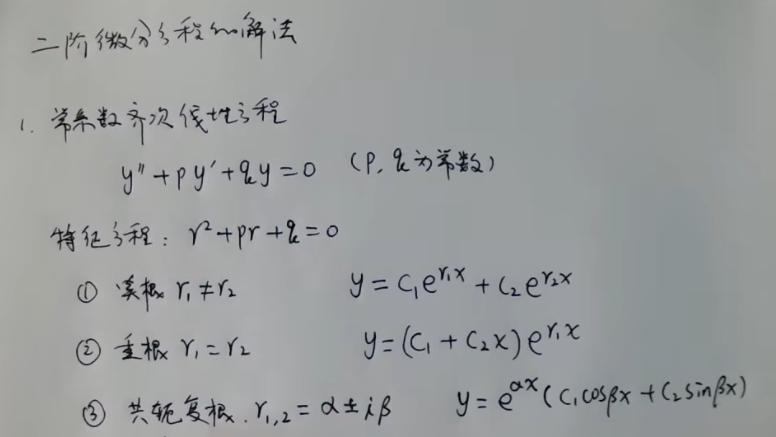
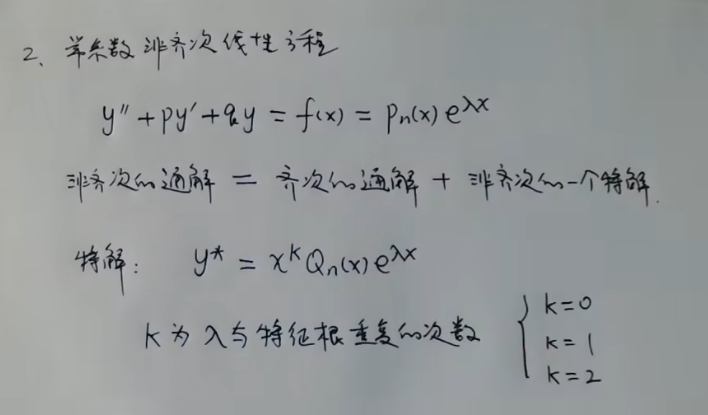

# 二阶电路数学基础

### 二阶常系数齐次微分方程求解步骤总结

考虑二阶常系数齐次微分方程：
$$
\frac{d^2}{dt^2} f(t) + b \frac{d}{dt} f(t) + c f(t) = 0
$$
其中 $b$ 和 $c$ 是常数。求解步骤如下：

#### **步骤1：假设解的形式**
- 假设解为指数形式： $f(t) = A e^{\lambda t}$ （其中 $A$ 是常数）。
- **为什么？** 因为指数函数的导数与自身成比例： $\frac{d}{dt} e^{\lambda t} = \lambda e^{\lambda t}$ ，高阶导数也类似，这方便代入微分方程后简化为代数方程。

#### **步骤2：代入方程，得到特征方程**
- 将 $f(t) = e^{\lambda t}$ （不妨忽略常数 $A$ ，因为方程是齐次的）代入原方程：
  $$
  \frac{d^2}{dt^2} (e^{\lambda t}) + b \frac{d}{dt} (e^{\lambda t}) + c e^{\lambda t} = 0
  $$
- 计算导数：
  $$
  \frac{d}{dt} (e^{\lambda t}) = \lambda e^{\lambda t}, \quad \frac{d^2}{dt^2} (e^{\lambda t}) = \lambda^2 e^{\lambda t}
  $$
- 代入并整理：
  $$
  \lambda^2 e^{\lambda t} + b \lambda e^{\lambda t} + c e^{\lambda t} = 0
  $$
- 除以非零因子 $e^{\lambda t}$ （因为 $e^{\lambda t} \neq 0$ ），得到**特征方程**：
  $$
  \lambda^2 + b\lambda + c = 0
  $$

#### **步骤3：求解特征根**
- 特征方程为二次方程：
  $$
  \lambda = \frac{-b \pm \sqrt{b^2 - 4ac}}{2}
  $$
- 根据判别式 $D = b^2 - 4ac= b^2 - 4c$ 的值，特征根分为三种情况：
  1. **两个不同的实根**：当 $D > 0$ ，根为 $\lambda_1$ 和 $\lambda_2$ （实数和不等）。
  2. **重根**：当 $D = 0$ ，根为 $\lambda_1 = \lambda_2 = \lambda$ （实数和相等）。
  3. **一对共轭复根**：当 $D < 0$ ，根为 $\alpha \pm \beta i$ ，其中实部 $\alpha = -\frac{b}{2}$ ，虚部 $\beta = \frac{\sqrt{|D|}}{2} = \frac{ \sqrt{|b^2 - 4ac|} }{2}$ 。

#### **步骤4：根据特征根类型写出通解**
通解的形式取决于特征根的类型：

**情况1：两个不同的实根**（ $\lambda_1 \neq \lambda_2$ ）  
- 通解： $f(t) = A e^{\lambda_1 t} + B e^{\lambda_2 t}$  
- **为什么？**   
  因为微分方程是线性齐次的，叠加原理适用：两个独立的特解（$e^{\lambda_1 t}$ 和 $e^{\lambda_2 t}$） 的线性组合构成通解。常数 $A$ 和 $B$ 由初始条件确定。
  
**情况2：重根**（ $\lambda_1 = \lambda_2 = \lambda$ ）  
- 通解： $f(t) = (A + B t) e^{\lambda t}$  
- **为什么？**   
  当根重时，只有一个独立的特解 $e^{\lambda t}$ 。第二个独立的特解通过引入线性因子 $t$ 获得：  
- **如何找到第二个解 $t e^{\lambda t}$ ？**  
  使用**降阶法**（Reduction of Order）：  
  - 设第二个解为 $f_2(t) = v(t) e^{\lambda t}$ （其中 $v(t)$ 是待定函数）。  
  - 代入原方程，并利用重根条件（ $\lambda = -\frac{b}{2}$ 和 $b^2 - 4ac = 0$ ），简化得 $v''(t) = 0$(完整推导在后面)。  
  - 解出 $v(t) = B t$ （或更一般地 $v(t) = A + B t$ ，但 $A e^{\lambda t}$ 已包含在第一个解中），所以第二个解为 $t e^{\lambda t}$ 。  
  - 因此通解为线性组合： $f(t) = (A + B t) e^{\lambda t}$ 。  
    
**情况3：一对共轭复根**（ $\lambda = \alpha \pm i\beta$ ）  
- 通解：   
  $$
  \begin{align*}
  f(t) &= Pe^{(\alpha + i\beta)t}+Qe^{(\alpha - i\beta)t} \\
       &= Pe^{\alpha t} (\cos(\beta t) + i \sin(\beta t))+Qe^{\alpha t} (\cos(\beta t) - i \sin(\beta t)) \\
       &= (P+Q)e^{\alpha t} \cos(\beta t) +(P-Q)e^{\alpha t}i \sin(\beta t) \\
       &= Ae^{\alpha t} \cos(\beta t) +Be^{\alpha t} \sin(\beta t) \\
       &= e^{\alpha t} \left( A \cos(\beta t) + B\sin(\beta t) \right) \\
  \end{align*}
  $$  
- **为什么？**   
  $f(t)$必须在实数域有意义，所以必须是实值函数，所以P、Q必须为共轭复数才能抵消指数项的虚数。  
  $$
  f(t) = Pe^{(\alpha + i\beta)t}+Qe^{(\alpha - i\beta)t}
  $$
    - $Q = \overline{P}$ ; P、Q为共轭复数,所以：
      - $P+Q=\text{实数}$
      - $P-Q=\text{纯虚数}$
    - 所以：
      - $A=P+Q=\text{实数}$
      - $B=(P-Q)i=\text{实数}$

  利用欧拉公式,将复指数转换为三角函数，确保解为实函数： 
  $$
  \begin{align*}
  e^{it} &= \cos(t) + i\sin(t) \\
  e^{(\alpha \pm i\beta)t} &= e^{\alpha t} (\cos(\beta t) \pm i \sin(\beta t)) \\
  \end{align*}
  $$
  线性组合后虚部抵消，得到纯实解。常数 $A$ 和 $B$ 由初始条件确定。  
  **等价形式：** 
  - $f(t) = R e^{\alpha t} \sin(\beta t + \phi)$ ，其中 $R = \sqrt{A^2 + B^2}$  相位 $\phi=\tan^{-1}\frac{A}{B}$。
  - $f(t) = R e^{\alpha t} \cos(\beta t + \phi)$ ，其中 $R = \sqrt{A^2 + B^2}$  相位 $\phi=\tan^{-1}\frac{B}{A}$。

**情况3特殊子情况：零阻尼（无阻尼振动）**  
- 当 $b = 0$ 时（即无阻尼），特征根为纯虚数： $\lambda = \alpha \pm i\beta=\pm i\beta$ （其中 $\alpha=\frac{-b}{2}=0$ ）。  
- 通解： 
  $$
  \begin{align*}
    f(t) &= e^{\alpha t} \left( A \cos(\beta t) + B\sin(\beta t) \right) \\
         &= e^{0 t} \left( A \cos(\beta t) + B\sin(\beta t) \right) \\
         &= 1 \left( A \cos(\beta t) + B\sin(\beta t) \right) \\
         &= A \cos(\beta t) + B \sin(\beta t)
  \end{align*}
  $$
- 或者
  $f(t) = R \cos(\beta t + \phi)$
- 表示无衰减的简谐振荡。

#### **解的物理意义解释（以机械振动或电路系统为例）**
二阶常系数齐次微分方程常见于物理系统，如弹簧-质量-阻尼系统或RLC电路（电压或电流的方程）。方程的项分别对应：
- $\frac{d^2}{dt^2} f(t)$ ： 惯性或电感效应（加速度相关）。
- $b \frac{d}{dt} f(t)$ ： 阻尼或电阻效应（速度相关）。
- $c f(t)$ ： 弹性或电容效应（位置相关）。

根的类型对应系统的不同阻尼状态：

- **两个不同的实根（过阻尼，例如 RLC 过阻尼或高阻尼机械系统）**：
  - **通解形式**： $f(t) = A e^{\lambda_1 t} + B e^{\lambda_2 t}$ ，其中 $\lambda_1$ 和 $\lambda_2$ 均为负实数（衰减）。
  - **为什么是线性组合？** 物理上，系统有两个独立的指数衰减模式（例如，电容和电感的能量以不同速率释放）。通解是这两个模式的叠加，因为系统的行为可分解为两个一阶衰减（如 "RC 衰减" 和 "RL 衰减" 的耦合）。每个指数项对应一个衰减通道。
  - **物理意义**： 系统平滑地返回平衡点，无振荡。例如：
    - RLC 过阻尼响应：电流或电压缓慢衰减（无振荡）。
    - 机械系统：重物缓慢返回静止位置（如门闭门器过阻尼时）。
  - **数学原因**： 特征根不同，解空间维数为 2，两个特解 $e^{\lambda_1 t}$ 和 $e^{\lambda_2 t}$ 线性无关，构成基。

- **重根（临界阻尼，例如 RLC 临界阻尼或理想阻尼机械系统）**：
  - **通解形式**： $f(t) = (A + B t) e^{\lambda t}$ 。
  - **为什么有线性因子 $t$ ？** 在临界阻尼时，两个根重合，衰减速率相同，系统无法分离为两个独立模式。线性因子 $t$ 引入"记忆"效应，表示系统在平衡点附近有轻微"过冲"但无振荡。
  - **物理意义**： 系统以最快速度返回平衡点而不振荡。例如：
    - RLC 临界阻尼响应：电流或电压快速衰减到零（无振荡）。
    - 机械系统：质量以最小时间返回静止位置（如汽车悬架临界调校）。
  - **数学原因**： 降阶法显示，当特征根重时，方程简化为 $v'' = 0$ ，给出线性 $v(t)$ 。

- **共轭复根（欠阻尼，例如 RLC 欠阻尼或低阻尼机械系统）**：
  - **通解形式**： $f(t) = e^{\alpha t} \left( A \cos(\beta t) + B \sin(\beta t) \right)$ ，其中 $\alpha = -\frac{b}{2}$ （通常负，表示衰减）。
  - **物理意义**： 系统振荡衰减（阻尼振荡）。实部 $\alpha$ 控制振幅衰减率，虚部 $\beta$ 控制振荡频率。例如：
    - RLC 欠阻尼响应：电流或电压振荡衰减（如无线电调谐电路）。
    - 机械系统：质量围绕平衡点振动并逐渐停止（如弹簧振子带小阻尼）。
  - **零阻尼特殊情况**：若 $b = 0$ ，则 $\alpha = 0$ ，解为 $A \cos(\beta t) + B \sin(\beta t)$ ，表示持续简谐振荡（如理想LC电路或无阻尼摆）。

#### **为什么通解是特解的线性组合？**
- **核心数学原因**： 线性齐次微分方程的解空间是向量空间（齐次原理）。特征方程提供独立特解：
  - 实根不同：两个指数特解线性无关。
  - 重根：一个指数特解加一个衍生解（通过降阶法）。
  - 复根：通过三角函数形式确保实值解。
- 解的线性组合覆盖所有可能初始条件（如 $f(0)$ 和 $f'(0)$ )。

此方法通用，适用于任何二阶常系数齐次线性微分方程。初始条件用于确定常数 $A$ 和 $B$ ，从而得到特解。

#### 降阶法（Reduction of Order）推导过程详解

降阶法是求解重根情况下第二个线性无关特解的核心方法。以下是完整推导（针对二阶常系数齐次微分方程的重根情形）：

问题设定

考虑方程：
$$
\frac{d^2 f(t)}{dt^2} + b \frac{d f(t)}{dt} + c f(t) = 0
$$
特征方程 $\lambda^2 + b\lambda + c = 0$ 有重根 $\lambda_1 = \lambda_2 = \lambda$，其中：
$$
\lambda = -\frac{b}{2}, \quad \text{且} \quad b^2 - 4ab = 0.
$$
已知一个特解 $f_1(t) = e^{\lambda t}$，目标是找到第二个线性无关的特解 $f_2(t)$.

降阶法步骤推导

1. 假设第二个解的形式  
   设 $f_2(t) = v(t) \cdot f_1(t) = v(t) e^{\lambda t}$，其中 $v(t)$ 是待定函数（非常数）。

2. 计算导数  
   • 一阶导数：

     $$
     \frac{d f_2}{dt} = v' e^{\lambda t} + v \cdot \lambda e^{\lambda t} = e^{\lambda t} (v' + \lambda v)
     $$
   • 二阶导数：

     $$
     \frac{d^2 f_2}{dt^2} = e^{\lambda t} (v' + \lambda v)' + \lambda e^{\lambda t} (v' + \lambda v) = e^{\lambda t} \left( v'' + \lambda v' + \lambda (v' + \lambda v) \right)
     $$
     简化得：
     $$
     \frac{d^2 f_2}{dt^2} = e^{\lambda t} \left( v'' + 2\lambda v' + \lambda^2 v \right)
     $$

3. 代入原方程  
   将 $f_2$、$\frac{d f_2}{dt}$、$\frac{d^2 f_2}{dt^2}$ 代入原方程：
   $$
   \left[ e^{\lambda t} (v'' + 2\lambda v' + \lambda^2 v) \right] + b \left[ e^{\lambda t} (v' + \lambda v) \right] + c \left[ v e^{\lambda t} \right] = 0
   $$
   因 $e^{\lambda t} \neq 0$，两边除以 $e^{\lambda t}$：
   $$
   v'' + 2\lambda v' + \lambda^2 v + b v' + b\lambda v + c v = 0
   $$
   合并同类项：
   $$
   v'' + (2\lambda + b) v' + (\lambda^2 + b\lambda + c) v = 0 \quad (*)
   $$

4. 利用重根条件简化  
   • 关键1：因 $\lambda$ 是特征根，满足 $\lambda^2 + b\lambda + c = 0$，故：

     $$
     \lambda^2 + b\lambda + c = 0 \quad \Rightarrow \quad \text{系数项消失}
     $$
   • 关键2：由重根性质 $\lambda = -\frac{b}{2}$，代入系数：

     $$
     2\lambda + b = 2\left(-\frac{b}{2}\right) + b = -b + b = 0
     $$
   • 方程 $(*)$ 简化为：

     $$
     v'' + 0 \cdot v' + 0 \cdot v = 0 \quad \Rightarrow \quad \boxed{v''(t) = 0}
     $$

5. 求解 $v(t)$  
   • 对 $v''(t) = 0$ 积分两次：

     $$
     v'(t) = C_1, \quad v(t) = C_1 t + C_2
     $$
     其中 $C_1$, $C_2$ 为常数。
   • 第二个特解为：

     $$
     f_2(t) = v(t) e^{\lambda t} = (C_1 t + C_2) e^{\lambda t}
     $$
   • 线性无关性验证：  

     ◦ 当 $C_1 = 0$, $C_2 = 1$ 时，得 $f_1(t) = e^{\lambda t}$（第一个解）。  

     ◦ 当 $C_1 = 1$, $C_2 = 0$ 时，得 $f_2(t) = t e^{\lambda t}$（第二个解）。  

     两者线性无关（因 $\frac{t e^{\lambda t}}{e^{\lambda t}} = t$ 非常数）。

6. 通解  
   $$
   f(t) = A \cdot f_1(t) + B \cdot f_2(t) = \boxed{(A + B t) e^{\lambda t}}
   $$
   其中 $A = C_2$, $B = C_1$ 为任意常数。

为何降阶法有效？

• 数学本质：通过引入函数 $v(t)$，将问题从求解二阶微分方程降阶为求解 $v''(t) = 0$（一阶可解问题）。

• 物理对应：在重根情况下（如临界阻尼），系统响应需要额外项 $t e^{\lambda t}$ 描述"临界过冲"行为（如最短时间返回平衡点但无振荡）。

对比其他方法

• 参数变易法（Variation of Parameters）：用于非齐次方程，通过变易齐次解的常数求特解，不适用于此处的齐次方程求通解。

• 特征方程法推广：直接由特征根形式导出解的结构（复根时需欧拉公式转换），但无法解释重根下 $t e^{\lambda t}$ 的来源。

总结：降阶法是求解重根情形下线性无关特解的标准方法，依赖于特征根的性质和微分方程的线性结构。

### 二阶常系数非齐次微分方程求解步骤总结

### 二阶常系数非齐次线性微分方程求解范式  
**方程形式**：  
$$
\frac{d^2 f(t)}{dt^2} + b \frac{df(t)}{dt} + c f(t) = g(t)
$$  
其中 $b, c$ 是常数，$g(t) \neq 0$ 是非齐次项（输入激励）。  

---

### **求解步骤**  
#### **步骤1：求对应齐次方程的通解 $f_h(t)$**  
齐次方程：  
$$
\frac{d^2 f(t)}{dt^2} + b \frac{df(t)}{dt} + c f(t) = 0
$$  
**特征方程**：  
$$
\lambda^2 + b\lambda + c = 0
$$  
**判别式**：  
$$
\Delta = b^2 - 4c
$$  
根据 $\Delta$ 分类求齐次通解$f_h(t)$：  
1. **$\Delta > 0$（两不同实根）**：  
   $$
   \lambda_{1,2} = \frac{-b \pm \sqrt{\Delta}}{2}, \quad f_h(t) = A e^{\lambda_1 t} + B e^{\lambda_2 t}
   $$  
2. **$\Delta = 0$（两重根）**：  
   $$
   \lambda = -\frac{b}{2}, \quad f_h(t) = (A + B t) e^{\lambda t}
   $$  
3. **$\Delta < 0$（共轭复根）**：  
   $$
   \lambda_{1,2} = \alpha \pm i\beta, \quad \alpha = -\frac{b}{2},\ \beta = \frac{\sqrt{|\Delta|}}{2}, \quad f_h(t) = e^{\alpha t} \left[ C_1 \cos(\beta t) + C_2 \sin(\beta t) \right]
   $$  

---

#### **步骤2：求非齐次方程的特解 $f_p(t)$**  
特解形式需根据 $g(t)$ 的类型设定（原则：特解需独立于齐次解）：  
##### **类型1：$g(t) = P_n(t) e^{kt}$（多项式×指数）**  
- **设定规则**：  
  $$
  f_p(t) = t^s Q_n(t) e^{kt}, \quad \begin{cases} 
    s = 0 & \text{（若 } k \text{ 不是特征根）} \\
    s = 1 & \text{（若 } k \text{ 是单特征根）} \\
    s = 2 & \text{（若 } k \text{ 是重特征根）}
  \end{cases}
  $$  
  其中 $Q_n(t)$ 是与 $P_n(t)$ 同次的待定多项式。  
**s 的含义与取值规则**

| **s 的值** | **数学条件**                | **特解形式示例**                     | **物理意义**                     |
|------------|-----------------------------|--------------------------------------|----------------------------------|
| **s=0**    | 非齐次项的指数 *k* 不是特征根 | 如 g(t)=eᵏᵗ·Pₘ(t) 时，设 yₚ(t)=Qₘ(t)eᵏᵗ | 激励频率与系统固有频率不同，无共振 |
| **s=1**    | *k* 是特征方程的单根         | 如 g(t)=eᵏᵗ 时，设 yₚ(t)=A·t·eᵏᵗ      | 激励频率等于固有频率，发生共振（振幅线性增长） |
| **s=2**    | *k* 是特征方程的重根         | 如 g(t)=eᵏᵗ 时，设 yₚ(t)=A·t²·eᵏᵗ     | 强共振（振幅二次增长，系统响应剧烈） |

- **示例**：  
  - $g(t) = 3t^2 e^{2t}$（$k=2$ 非特征根）→ 设 $f_p(t) = (D_0 + D_1 t + D_2 t^2) e^{2t}$  
  - $g(t) = t e^{-t}$（$k=-1$ 是单特征根）→ 设 $f_p(t) = t (D_0 + D_1 t) e^{-t}$  

##### **类型2：$g(t) = e^{kt} \left[ M \cos(\omega t) + N \sin(\omega t) \right]$**  
- **设定规则**：  
  $$
  f_p(t) = t^s e^{kt} \left[ U \cos(\omega t) + V \sin(\omega t) \right], \quad s = \begin{cases} 
    0 & \text{（若 } k + i\omega \text{ 不是特征根）} \\
    1 & \text{（若 } k + i\omega \text{ 是特征根）}
  \end{cases}
  $$  

- **示例**：  
  - $g(t) = \sin(3t)$（即 $k=0, \omega=3$）→ 若 $i3$ 非特征根，设 $f_p(t) = U \cos(3t) + V \sin(3t)$  
  - $g(t) = e^{2t} \cos t$ → 若 $2+i$ 是特征根，设 $f_p(t) = t e^{2t} (U \cos t + V \sin t)$  

##### **计算系数**：  
将设定好的 $f_p(t)$ 代入非齐次方程，对比系数解出待定常数（如 $D_i, U, V$)。  

---

#### **步骤3：写出非齐次方程的通解**  
$$
\boxed{f(t) = f_h(t) + f_p(t)}
$$  
其中：  
- $f_h(t)$ 含任意常数 $A, B$（由初始条件确定），  
- $f_p(t)$ 为不含任意常数的特解。  

---

### **解的物理意义（以振动或电路为例）**  
- **齐次解 $f_h(t)$**: 系统的 **自由响应**（固有行为），  
  - *过阻尼（实根）*：能量单调衰减（如门缓慢关闭），  
  - *临界阻尼（重根）*：最快无振荡返回平衡（如汽车悬架临界调校），  
  - *欠阻尼（复根）*：振荡衰减（如弹簧振子带摩擦）。  

- **特解 $f_p(t)$**: 系统的 **强迫响应**（由输入 $g(t)$ 驱动），  
  - 体现系统对外部激励的稳态输出（如电路对交流电源的响应），  
  - 形式取决于 $g(t)$（如常数输入→常数稳态；正弦输入→同频正弦振荡）。  

- **通解 $f(t)$**:  
  $$
  \text{总响应} = \text{自由响应（瞬态）} + \text{强迫响应（稳态）}
  $$  
  例如 RLC 电路：  
  - 齐次解：电容/电感的固有放电（瞬态），  
  - 特解：电源 $g(t)$ 驱动的稳态电流/电压。  
