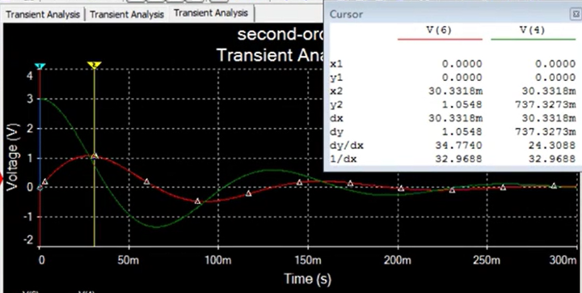

# 串联RLC二阶电路

## 零状态RLC串联电路的自然响应

- 拓扑约束
  - KVL: $u_C=u_L+u_R$
  - KCL: $-i_C=i_L=i_R=i$
- 元件约束
  - $i_C=-C\frac{du_C}{dt}$
  - $u_L=L\frac{di_L}{dt}$
  - $R=\frac{u_R}{i_R}$

列写方程：

$$
\begin{align*}
  u_L+u_R&=u_C \\
  L\frac{d}{dt}i_L+R i_R&=u_C \\
  L\frac{d}{dt}(i_C)+R (i_C)&=u_C \\
  L\frac{d}{dt}(-C\frac{du_C}{dt})+R(-C\frac{du_C}{dt})&=u_C \\
  -LC\frac{d^2u_C}{d^2t}-RC\frac{du_C}{dt}&=u_C \\
  -LC\frac{d^2u_C}{d^2t}-RC\frac{du_C}{dt}-u_C&=0 \\
  \frac{d^2u_C}{d^2t}+\frac{R}{L}\frac{du_C}{dt}+\frac{1}{LC}u_C&=0 \\
\end{align*}
$$

定义：$2\alpha=\frac{R}{L}$，$\omega_0^2=\frac{1}{LC}$，得：

$$
  \frac{d^2u_C}{d^2t}+2\alpha\frac{du_C}{dt}+\omega_0^2u_C=0 \\
$$

特征方程为

$$
\lambda^2+2\alpha\lambda+\omega_0^2=0
$$

判别式为

$$
\begin{align*}
  \Delta&=b^2-4ac\\
        &=(2\alpha)^2-4 \times 1 \times (\omega_0^2)\\
        &=4\alpha^2-4\omega_0^2 \\
        &=4(\alpha^2-\omega_0^2) \\
\end{align*}
$$

特征根为

$$
\begin{align*}
  \lambda &= \frac{-b\pm\sqrt{\Delta}}{2a} \\
          &= \frac{-(2\alpha) \pm \sqrt{4(\alpha^2-\omega_0^2)}}{2\times 1} \\
          &= \frac{-2\alpha \pm 2\sqrt{\alpha^2-\omega_0^2}}{2\times 1} \\
          &= -\alpha \pm \sqrt{\alpha^2-\omega_0^2} \\
\end{align*}
$$

根据判别式的情况，微分方程的解为：

**过阻尼情况：** $当 \alpha^2>\omega_0^2$  ( 即 $\Delta=4(\alpha^2-\omega_0^2)>0$ )  时

$$
\begin{align*}
  \lambda_1,\lambda_2 &= -\alpha \pm \sqrt{\alpha^2-\omega_0^2} \\
  u_C&=Ae^{\lambda_1t}+Be^{\lambda_2t}
\end{align*}
$$

**临界阻尼情况：** 当$\alpha^2=\omega_0^2$ ( 即 $\Delta=4(\alpha^2-\omega_0^2)=0$ ) 时 

$$
\begin{align*}
  \lambda &= -\alpha \pm \sqrt{\alpha^2-\omega_0^2} \\
    &= -\alpha \pm 0 \\
    &= -\alpha \\
  u_C&=Ae^{\lambda t}+Bte^{\lambda t}
\end{align*}
$$

**欠阻尼情况：** $当 \alpha^2<\omega_0^2$ ( 即 $\Delta=4(\alpha^2-\omega_0^2)<0$ ) 时 

$$
\begin{align*}
  \lambda_1,\lambda_2 &= -\alpha \pm \sqrt{\alpha^2-\omega_0^2} \\
     &= -\alpha \pm \sqrt{(-1) \times  (\omega_0^2-\alpha^2)} \\
     &= -\alpha \pm \sqrt{-1} \times \sqrt{(\omega_0^2-\alpha^2)} \\
     &= -\alpha \pm i \times \sqrt{(\omega_0^2-\alpha^2)} \\
       \\
 \omega_d&=\sqrt{(\omega_0^2-\alpha^2)} \\
  u_C&=e^{-\alpha t} ( A \cos(\omega_d t) + B\sin(\omega_d t) ) \\
       \\
   R &= \sqrt{A^2 + B^2} \\
  \phi &= \tan^{-1}\frac{A}{B} \\
  u_C &= R e^{-\alpha t} \sin(\omega_d t + \phi) \\
\end{align*}
$$

**零阻尼情况：** $当 \alpha=0$ ( 即 $\Delta=4(\alpha^2-\omega_0^2)=-4\omega_0^2<0$ ) 时

$$
\begin{align*}
  \lambda_1,\lambda_2 &= -\alpha \pm \sqrt{\alpha^2-\omega_0^2} \\
     &= -0 \pm \sqrt{0^2-\omega_0^2} \\
     &= \pm \sqrt{-1 \times \omega_0^2} \\
     &= \pm \sqrt{-1} \times \sqrt{\omega_0^2} \\
     &= \pm i\sqrt{\omega_0^2} \\
     &(\text{特征根为纯虚数}) \\
     \\
 \omega_d&=\sqrt{\omega_0^2}=\omega_0 \\
  u_C&=e^{-\alpha t} ( A \cos(\omega_d t) + B\sin(\omega_d t) ) \\
     &=e^{-0 t} ( A \cos(\omega_d t) + B\sin(\omega_d t) ) \\
     &=A \cos(\omega_d t) + B\sin(\omega_d t) \\
     &=A \cos(\omega_0 t) + B\sin(\omega_0 t) \\
     \\
     R &= \sqrt{A^2 + B^2} \\
    \theta &= \tan^{-1}\frac{A}{B} \\
    u_C &= R e^{-\alpha t} \sin(\omega_d t + \theta) \\
        &= R e^{-0 t} \sin(\omega_d t + \theta) \\
        &= R \sin(\omega_d t + \theta) \\
        &= R \sin(\omega_0 t + \theta) \\
\end{align*}
$$

## 案例

根据拓扑约束和元件约束写出微分方程；根据特征方程的解写出微分方程的通解形式。

分析计算电路支路量的初值和一阶导，据此求解通解的待定系数。

绿色为电容电压、红色为电感电流

绿色为电容电压、红色为电感电流

绿色为电容电压、红色为电感电流

绿色为电容电压、红色为电感电流

红、绿、蓝、紫分别为过阻尼、临界阻尼、欠阻尼、零阻尼情况下的电感电流。

