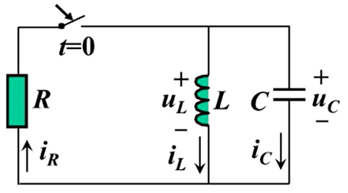
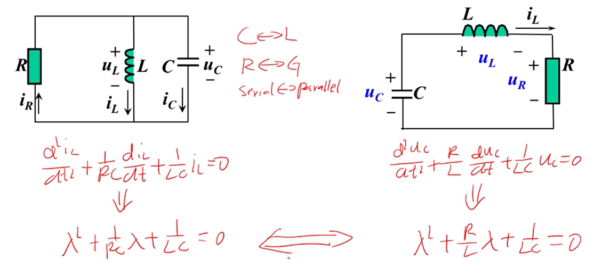

# 并联RLC二阶电路

## 零状态RLC并联电路的自然响应

- 拓扑约束
  - KVL: $u_C=u_L=-u_R$
  - KCL: $i_C+i_L=i_R$
- 元件约束
  - $i_C=C\frac{du_C}{dt}$
  - $u_L=L\frac{di_L}{dt}$
  - $R=\frac{u_R}{i_R}$

列写方程：

$$
\begin{align*}
  i_C+i_L=i_R \\
  C\frac{du_C}{dt}+i_L&=\frac{u_R}{R} \\
  C\frac{d(u_L)}{dt}+i_L&=\frac{(-u_L)}{R} \\
  C\frac{d(L\frac{di_L}{dt})}{dt}+i_L&=\frac{-(L\frac{di_L}{dt})}{R} \\
  LC\frac{d^2i_L}{d^2t}+i_L&=-\frac{L}{R}\frac{di_L}{dt} \\
  LC\frac{d^2i_L}{d^2t}+\frac{L}{R}\frac{di_L}{dt}+i_L&=0 \\
  \frac{d^2i_L}{d^2t}+\frac{1}{RC}\frac{di_L}{dt}+\frac{1}{LC}i_L&=0 \\
\end{align*}
$$

定义：$2\alpha=\frac{1}{RC}$，$\omega_0^2=\frac{1}{LC}$，得：

$$
  \frac{d^2u_C}{d^2t}+2\alpha\frac{du_C}{dt}-\omega_0^2u_C=0 \\
$$

特征方程为

$$
\lambda^2+2\alpha\lambda-\omega_0^2=0
$$

......剩余推导过程和结论和之前的串联RLC完全相同。

## 串联RLC和并联RLC的区别

**相同**
- 串联RLC和并联RLC的震荡项都是 $\omega_0^2=\frac{1}{LC}$

**不同**
- 串联RLC的阻尼项为 $2\alpha=\frac{R}{L}$ 
- 并联RLC的阻尼项为 $2\alpha=\frac{1}{RC}$

