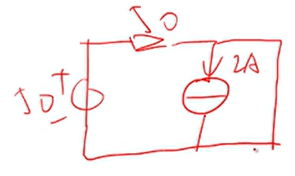

# 并联RLC二阶电路

## RLC并联电路的直觉解法

> 直接列写关于 $i_R$ 的微分方程将会非常复杂，所以这里先求出 $i_L$ 。

**第一步：求零状态响应**

> 独立源不作用、储能元件有初值

画出零状态电路

由于该电路是并联RLC二阶电路，所以根据之前并联RLC二阶电路的知识可以直接写出关于$u_C$微分方程：

$$
\frac{d^2u_C}{d^2t}+\frac{1}{RC}\frac{du_C}{dt}+\frac{1}{LC}u_C=0 \\
$$

和特征方程:

$$
\begin{align*}
  \lambda^2+\frac{1}{RC}\lambda-\frac{1}{LC}&=0 \\
  \lambda^2+\frac{1}{50 \times 100\mu}\lambda+\frac{1}{0.5 \times 100\mu}&=0 \\
  \lambda^2+200\lambda+20000&=0 \\
\end{align*}
$$

解法1：

$$
\begin{align*}
  \lambda^2+200\lambda+20000&=0 \\
  \lambda^2+\frac{1}{50 \times 100\mu}\lambda+\frac{1}{0.5 \times 100\mu}&=0 \\
  \lambda^2+200\lambda+20000&=0 \\
  \lambda^2+2*\lambda*100+100^2+10000&=0 \\
  (\lambda+100)^2+100^2&=0 \\
  (\lambda+100)^2-(-100^2)&=0 \\
  (\lambda+100)^2-((-1)*100^2)&=0 \\
  (\lambda+100)^2-(i^2*100^2)&=0 \\
  (\lambda+100)^2-(100i)^2&=0 \\
  (\lambda+100+100i)(\lambda+100-100i)&=0 \\
  \lambda_1,\lambda_2 &= -100 \pm 100i \\
\end{align*}
$$

解法2：

$$
\begin{align*}
  &\lambda^2+200\lambda+20000=0 \\
  \alpha &= \frac{b}{2} = 100 \\
  \omega^2 &= c = 20000 \\
  \Delta &= 4(\alpha^2-\omega^2)=4(100^2-20000)=-10000<0 \\
  \lambda_1,\lambda_2&=-\alpha \pm i \sqrt{(\omega^2-\alpha^2)}\\
                     &=-100 \pm i \sqrt{-10000} \\
                     &=-100 \pm 100i \\
\end{align*}
$$

有两共轭复根，说明电路工作在欠阻尼状态。

于是得到微分方程的通解形式为：

$$
u_C=Ae^{-100t}\sin(100t+\theta)
$$

二阶电路的支路量形式相同，所以可得：

$$
i_R=Ce^{-100t}\sin(100t+\theta)
$$

**第二步：求零输入响应**

> 独立源作用、储能元件无初值

画出稳态等效电路

欠阻尼，稳态，电感最终等效为短路，电容等效成开路。

$$
i_R(+\infty)=\frac{50v}{50Ω}=1
$$

画出$0^+$时刻等效电路

换路，电感电流不能突变，有初值电感等效为电流源，电容电压不能突变，零值电容等效为短路。

$$
\begin{align*}
  i_L(0^+) &= i_L(0^-)=2A \\
  u_C(0^+) &= u_C(0^-)=0V \\
  i_R(0^+) &= \frac{50V}{50Ω}=1A \\
  i_C(0^+) &= i_R(0^+)-i_L(0^+)=1-2=-1A \\
\end{align*}
$$

画出$t>0$时刻的等效电路

求$\frac{d}{dt}u_C|_{t=0^+}$:

$$
\begin{align*}
  u_C&=\frac{1}{C}\int i_C dt \\
  \frac{d}{dt}u_C&=\frac{1}{C}i_C \\
  \frac{d}{dt}u_C|_{t=0^+}&=\frac{1}{C}i_C|_{t=0^+}=-\frac{1}{C} \\
  \end{align*}
$$

求$\frac{d}{dt}i_R|_{t=0^+}$:

$$
\begin{align*}
  i_R&=\frac{u_R}{R}=\frac{u_S-u_C}{R}=\frac{50-u_C}{50}=1-\frac{1}{50}u_C\\
  \frac{d}{dt}i_R&=0-\frac{1}{50}\frac{d}{dt}u_C \\
  \frac{d}{dt}i_R|_{t=0^+}&=-\frac{1}{50}\frac{d}{dt}u_C|_{t=0^+}=-\frac{1}{50} \times (-\frac{1}{C}) =200A/s\\
\end{align*}
$$

**第三步：求全响应**

