# 电路原理学习笔记

## 目录

- [电路原理学习笔记](#电路原理学习笔记)
  - [目录](#目录)
  - [支路量](#支路量)
    - [电流](#电流)
    - [电压](#电压)
    - [电位](#电位)
    - [电动势](#电动势)
    - [变量的大小写问题](#变量的大小写问题)
  - [参考方向](#参考方向)
    - [电流参考方向](#电流参考方向)
    - [电动势参考方向](#电动势参考方向)
    - [关联参考方向](#关联参考方向)
    - [非关联参考方向](#非关联参考方向)
  - [功率](#功率)
  - [端口](#端口)
  - [受控源](#受控源)
    - [流控电压源](#流控电压源)
    - [压控电压源](#压控电压源)
    - [流控电流源](#流控电流源)
    - [压控电流源](#压控电流源)
    - [简略的画法](#简略的画法)
    - [受控元件和受控源](#受控元件和受控源)
  - [KCL KVL 基尔霍夫电压/电流定律](#kcl-kvl-基尔霍夫电压电流定律)
  - [2B 法](#2b-法)
  - [等效](#等效)
    - [电阻等效](#电阻等效)
      - [电阻串联等效](#电阻串联等效)
      - [电阻并联的等效](#电阻并联的等效)
      - [电阻的串并联等效](#电阻的串并联等效)
      - [平衡电桥](#平衡电桥)
      - [Y-△ 星三角等效变换](#y--星三角等效变换)
      - [带受控源的二端网络的电阻等效](#带受控源的二端网络的电阻等效)
      - [电阻等效求解顺序](#电阻等效求解顺序)
    - [电源等效](#电源等效)
      - [独立源的等效变换](#独立源的等效变换)
      - [带受控源的等效](#带受控源的等效)
  - [最大功率、效率、电压传输](#最大功率效率电压传输)
  - [系统化方程解法](#系统化方程解法)
    - [支路电流法（列写B个方程）](#支路电流法列写b个方程)
    - [节点电压法（列写(N-1)个KCL方程）](#节点电压法列写n-1个kcl方程)
    - [回路电流法（列写B-(n-1)个KVL方程）](#回路电流法列写b-n-1个kvl方程)
      - [特殊情况1：含有独立电流源的支路](#特殊情况1含有独立电流源的支路)
      - [特殊情况2：含有受控源的情况](#特殊情况2含有受控源的情况)
    - [总结](#总结)
  - [运算放大器Op Amps](#运算放大器op-amps)
    - [传输特性](#传输特性)
    - [工作在线性区间的运放模型](#工作在线性区间的运放模型)
      - [运算放大器工作在开环电路](#运算放大器工作在开环电路)
      - [运算放大器工作在闭环负反馈电路](#运算放大器工作在闭环负反馈电路)
    - [理想运放](#理想运放)
      - [理想运放工作在线性区的传输特性](#理想运放工作在线性区的传输特性)
    - [运放的应用](#运放的应用)
      - [电压跟随器](#电压跟随器)
      - [反相比例放大器](#反相比例放大器)
      - [非反相(同相)比例放大器](#非反相同相比例放大器)
      - [加法器](#加法器)
      - [减法器](#减法器)
      - [电流源](#电流源)
      - [负电阻](#负电阻)
  - [数字系统](#数字系统)
    - [数模转换](#数模转换)
    - [逻辑的两种表达方式](#逻辑的两种表达方式)
      - [逻辑表达式、真值表](#逻辑表达式真值表)
      - [如何根据表达式写真值表](#如何根据表达式写真值表)
      - [如何根据真值表写表达式](#如何根据真值表写表达式)
    - [常见逻辑门](#常见逻辑门)
    - [用逻辑门电路实现逻辑表达式](#用逻辑门电路实现逻辑表达式)
    - [使用真值表或逻辑表达式实现数字运算](#使用真值表或逻辑表达式实现数字运算)
  - [场效应管](#场效应管)
    - [结型场效应管(JFET)](#结型场效应管jfet)
      - [分类、结构、电路符号](#分类结构电路符号)
      - [结型场效应管工作原理](#结型场效应管工作原理)
    - [金属-氧化层半导体场效晶体管(MOSFET)](#金属-氧化层半导体场效晶体管mosfet)
      - [分类](#分类)
      - [结构和电路符号](#结构和电路符号)
      - [关于体二极管](#关于体二极管)
      - [MOSFET工作原理（N沟道耗尽型）](#mosfet工作原理n沟道耗尽型)
      - [MOSFET工作原理（N沟道增强型）](#mosfet工作原理n沟道增强型)
      - [场效应管的应用](#场效应管的应用)
      - [外特性](#外特性)
        - [$U\_{gs}-I\_{ds}$的关系（转移特性曲线）](#u_gs-i_ds的关系转移特性曲线)
        - [$U\_{ds}-I\_{ds}$的关系（输出特性曲线）](#u_ds-i_ds的关系输出特性曲线)
        - [工作在电阻区和恒流区的条件](#工作在电阻区和恒流区的条件)
        - [工作在不同的区间建立不同的电路模型](#工作在不同的区间建立不同的电路模型)
        - [开关/电流源模型](#开关电流源模型)
        - [开关/电阻模型](#开关电阻模型)
    - [几种场效应管的比较](#几种场效应管的比较)
  - [MOSFET在数字电路中的应用](#mosfet在数字电路中的应用)
    - [反相器](#反相器)
    - [与非门](#与非门)
    - [或非门](#或非门)
  - [CMOS互补金属氧化物半导体](#cmos互补金属氧化物半导体)
    - [普通门电路的功耗](#普通门电路的功耗)
    - [CMOS的原理和结构及优点](#cmos的原理和结构及优点)
  - [MOSFET在模拟电路中的应用](#mosfet在模拟电路中的应用)
  - [叠加定理](#叠加定理)
    - [线性系统](#线性系统)
    - [叠加定理](#叠加定理-1)
      - [例题](#例题)
    - [注意事项](#注意事项)
  - [戴维南定理和诺顿定理](#戴维南定理和诺顿定理)
    - [戴维南](#戴维南)
    - [证明](#证明)
    - [戴维南和诺顿定理总结](#戴维南和诺顿定理总结)
    - [例题及做题过程](#例题及做题过程)
  - [戴维南等效的应用](#戴维南等效的应用)
    - [二端口电阻的输入电阻和输出电阻的计算](#二端口电阻的输入电阻和输出电阻的计算)
    - [关于电桥的戴维南等效](#关于电桥的戴维南等效)
  - [替代定理](#替代定理)
    - [替代定理的证明](#替代定理的证明)
    - [本质:静态工作点不变](#本质静态工作点不变)
    - [替换必须保证解唯一](#替换必须保证解唯一)
  - [非线性电阻](#非线性电阻)
    - [例子](#例子)
    - [和线性电阻的区别](#和线性电阻的区别)
    - [分析含非线性电阻电路的方法](#分析含非线性电阻电路的方法)
      - [直接列方程法](#直接列方程法)
      - [图解法](#图解法)
      - [分段线性法（假设检验法）](#分段线性法假设检验法)
        - [例题](#例题-1)
        - [性质](#性质)
        - [对二极管的几种建模方法](#对二极管的几种建模方法)
        - [计算含理想二极管的负载上的电压](#计算含理想二极管的负载上的电压)
        - [计算含压降的二极管模型上的电压](#计算含压降的二极管模型上的电压)
        - [假设检验法的应用：分析MOSFET的工作状态](#假设检验法的应用分析mosfet的工作状态)
          - [用分段线性法对MOSFET建模](#用分段线性法对mosfet建模)
          - [分析电路MOSFET的工作状态](#分析电路mosfet的工作状态)
        - [假设检验法的应用：分析全桥整流电路](#假设检验法的应用分析全桥整流电路)
      - [小信号法](#小信号法)
        - [为什么需要小信号法](#为什么需要小信号法)
        - [概念放大器](#概念放大器)
        - [对更一般化的问题的分析方法](#对更一般化的问题的分析方法)
      - [小信号模型](#小信号模型)
        - [小信号作用在非线性电阻、线性电阻上的等效](#小信号作用在非线性电阻线性电阻上的等效)
        - [小信号作用在独立源、线性受控源、非线性受控源上的等效](#小信号作用在独立源线性受控源非线性受控源上的等效)
        - [小信号模型求解电路的例题](#小信号模型求解电路的例题)
        - [小信号模型分析由MOSFET构成的放大器电路](#小信号模型分析由mosfet构成的放大器电路)
  - [一阶电路](#一阶电路)
    - [电容](#电容)
    - [电感Inductors](#电感inductors)
    - [电容电感总结](#电容电感总结)
    - [忆阻器](#忆阻器)
    - [动态电路](#动态电路)

## 支路量

### 电流

- 定义：**电荷**随**时间**的**变化率**
- 表达式：
- 计算的电流：正电荷在单位时间内流过导体的数量
- 单位：$A$安培

### 电压

- 定义： **电场力**将**单位的正电荷**移动所做的**功**
- 表达式：
- 单位：$V$伏特

### 电位

- 定义： 从**某一点**到**参考点**的**电压**
- **参考点**：
  - 参考点的电位值人为定义为 0
  - 符号$φ$或$U$
  - 单位 V 伏特
  - **一个电路只能有一个参考点**(0 电位点)
- 两点之间的电压等于两点之间电位差$U_{ab}=φ_a-φ_b$
- 两点之间电位差可以称为**电位降**，电位降的本质就是电压，所以也称电压为**电压降**
- 两点之间的电压和参考点是谁无关

### 电动势

- 定义： **非电场力**将单位正电荷移动所做的功
- 表达式： 
- 对比电场力和非电场力
  - $e_{BA}$ 表征的是**非电场力**使得单位正电荷从 B 点到 A 点移动，使得**电位升高**，意味着**能量的增加** $e_{BA}=φ_a-φ_b$
  - $u_{AB}$ 表征的是**电场力**使得单位正电荷从 A 点到 B 点移动，使得**电位降低**，意味着**能量的消耗** $u_{BA}=φ_a-φ_b$

### 变量的大小写问题

- 常量用大写 $U$ $I$
- 可能发生改变的量用小写$u(t)$ $i(t)$

## 参考方向

### 电流参考方向

**两种表示方式**

- **箭头**：箭头指向电流的流向方向
- **下标**：$i_{AB}$表示电流方向从 A 流向 B，
  - 如果$i_{AB}>0$ 则电流的实际方向和参考方向一致

**电压参考方向的三种表示方式**

- 箭头
- 正负号
- 双下标：$U_{AB}$ 表示电压从 A 到 B 的电位降 

### 电动势参考方向

**三种表示方式**

- 箭头
- 正负号
- 双下标：$e_{AB}$ 表示电动势从 B 到 A 的电位升

### 关联参考方向

- 电流从电压的正端流入 负端流出 

### 非关联参考方向

- 电流从电压的负端流入 正端流出 

## 功率

- 定义：电场力在单位时间内所做的功
- 定义式：
  - 
  - 
- 功率的单位是**瓦**
- 能量的单位是**焦耳**
- 功率守恒：一个电路所发出的总功率等于这个电路所吸收的总功率

**功率的发出和吸收的理解**

- **在关联参考方向下，计算的是元件吸收的功率$P_a=ui$，功率为正，实际为吸收**
- **在关联参考方向下，计算的是元件吸收的功率$P_a=ui$，功率为负，实际为发出**

## 端口

- **定义**：**有两个接线端**的且满足**端口条件**的称为**一个端口**
- **端口条件**：流入一个接线端的电流等于流出另一个的电流

**一端口网络和二端口网络**

- 一端口网络：有**一个端口**的网络
- 二端口网络：有**两个端口**的网络
  - （也就是说这两个端口都分别满足**端口条件**）

**无源**/**有源**一端口网络：

- **简单来说：**
  - **吸收功率的是无源一端口，发出功率的是有源一端口**
- **定义:**
  - 对于**任何时刻 t**，**关联参考方向下**端口**吸收功率**的瞬时积分都 **大于等于`0`** 的网络是无源一端口
  - 

**例子**

- 电阻是无源一端口网络
- 电压源是有源一端口网络

**推广**

- 关联参考方向，也称**无源符号约定**
- 非关联参考方向，也称**有源符号约定**

## 受控源

**四种线性受控电源**

### 流控电压源

### 压控电压源

### 流控电流源

### 压控电流源

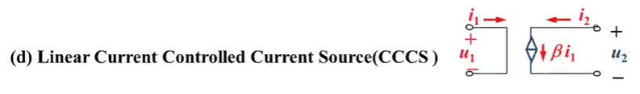

### 简略的画法

- 需要注意的是，受控源不是只有两个接线端的元件
- 

### 受控元件和受控源

受控源是受控元件的一种

- 受控电阻:
  - 开关：0/无穷大的电阻
  - 场效应管： **控制极电压(G-S)** 能决定 **源极(D)和漏极(S)** 间导通的**电阻** ，DS 间 UI 关系表现为线性电阻
- **受控源：**
  - 场效应管：**源极(D)和漏极(S)** 间导通，当电压大到一定程度，通过的电流便不再增加，表现为电流源特性
  - 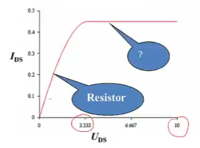

## KCL KVL 基尔霍夫电压/电流定律

**KCL 定义:**

- 流入**节点**的**电流**的代数和为 0
  - 
- **流入节点的电流和**等于**流出节点的电流和**
  - 
- 推广：流入网络的电流的代数和为 0
  - 

**KVL 定义:**

- 任何**回路**的**电压降**的代数和为 0
  - 
- 任何回路的**电压升的和**等于该回路的**电压降的和**
  - 
- 推广：两**节点**之间的任意两条**路径**(不论该路径包含多少支路)的**电压降的代数和**为 0
  - 

**前置概念：五个名词**

- **支路**：支路 是 由**元件** **端到端连接**组成的,并且是**没有分支**的
- **节点**：节点 是 连接至少 3 个或更多**支路**的点
- **路径**：路径 是 两个**节点**之间的**通路**，由至少一条或多条**支路**组成
- **回路**：回路 是 闭合的**路径**，由**支路**组成
- **网格**：网格 是 和**支路**没有**相交(intersection)**的**回路**；仅在**平面电路**中存在

**补充知识：什么是元件约束和拓扑约束**

- **元件约束**是由元件本身的属性决定的
  - 如电阻、受控源上的电压关系
  - 如独立源所输出的电压、电流
- **拓扑约束**就是 `KCL` 和 `KVL`
- 有了元件约束和拓扑约束才能求解方程

## 2B 法

**概念：** 对于 b 个支路，能列写出 2b 可方程，从而求解出 b 个支路的电压和电流

**案例分析：如何列写求解电路所需的方程**

**分析**

- 支路数 b=6
- 节点数 n=4
- 网孔数 m=3

**列写方程**

- 根据元件约束，
  - 能够列写出 b 个支路的电压电流关系方程【显然】
- 根据拓扑约束，
  - KCL
    - 能列写出**n 个** KCL 的方程，
    - **但只有 n-1 个是独立的**，【证明起来不难】
    - 因为其中任意 n-1 个方程就能推导出最后一个方程
    - **所以对于有 n 个节点的电路，任意选 n-1 个节点来列写 KCL 方程即可**
  - KVL
  - 能列写出**很多个** KVL 方程，
  - **但只有 b-n+1 个是独立的**，【证明起来比较困难】
  - **使用网孔回路列写的 KVL 方程一定是独立的**
- 所以总共能列写出 `b+(n-1)+(b-n+1) = 2b` 个方程
- 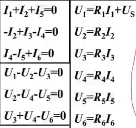

## 等效

### 电阻等效

**前置概念：**

- 二端网络：包含电阻、独立源、受控源的网络
- 不含独立源的二端网络：仅包含电阻、受控源的网络

**等效概念：**

- 对于**不含独立源的二端网络**，其**总能等效成一个电阻**
- **等效**的两个子电路，各自在端口上的电压和电流的关系有相同的**形式**和**参数**
  - 举例来说：
    - **相同的形式**：左边的电路: `U=[?]I` ; 右边的电路: `U=[Req]I` ;
    - **相同的参数**：`[?] = [Req]` ;
    - 

#### 电阻串联等效

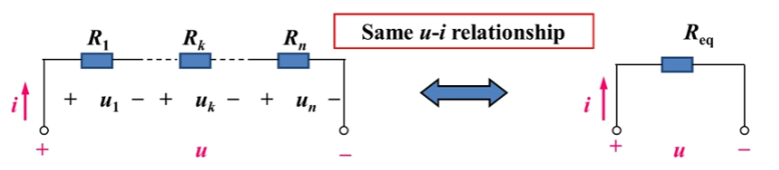

**推导过程：**

- **列方程**
  - 元件约束:
    - $u_1 = i_1*r_1$
    - $u_2 = i_2*r_2$
    - $u_k = i_k*r_k$
    - $u_n = i_n*r_n$
  - KVL: $U=u_1+u_2+u_k+u_n$
  - KCL: $I=i_1=i_2=i_k=i_n$
- **解之得**：
  - $$U=i_1*r_1+i_2*r_2+i_k*r_k+i_n*r_n$$
  - $$U=I*r_1+I*r_2+I*r_k+I*r_n$$
  - $$U=(r_1+r_2+r_k+r_n)*I$$
  - $$R_{eq} = r_1+r_2+r_k+r_n\tag{最终结论}$$

**推广：分压器**

- 串联电路，$\frac{电压}{总电压}/=\frac{电阻}{总电阻}$
- 
- $$ \frac{u_1}{u} = \frac{r_1*i_1}{r*i} = \frac{r_i}{r} $$
- $$u_1=\frac{r_1}{r}u$$

**推广：电压信号源最大电压传输**

- 
- $$u\uparrow=\frac{R_L\uparrow}{R_L\uparrow+R_S\downarrow}U_S$$
- **要想使负载获得的电压信号尽可能的大**，**负载的电阻要尽可能大**，**信号源内阻要尽可能小**。

#### 电阻并联的等效

**推导过程：**

- **列方程：**
  - 元件约束:
    - $i_1 = g_1*u_1$
    - $i_2 = g_2*u_2$
    - $i_k = g_k*u_k$
    - $i_n = g_n*u_n$
  - KVL: $U=u_1=u_2=u_k=u_n$
  - KCL: $I+i_1+i_2+i_k+i_n$
- **解之得**：
  - $$I=g_1*u_1+g_2*u_2+g_k*u_k+g_n*u_n$$
  - $$I=g_1*U+g_2*U+g_k*U+g_n*U$$
  - $$I=(g_1+g_2+g_k+g_n)*U$$
  - $$G_{eq}=g_1+g_2+g_k+g_n\tag{结论}$$

**推广:分流器**

- 并联电导，$\frac{电流}{总电流}/=\frac{电导}{总电导}$
- 
- $$ \frac{i_1}{i} = \frac{g_1*u_1}{g*u} = \frac{g_i}{g} $$
- $$i_1=\frac{g_1}{g}i$$

**两电阻分流的特殊结论**

- 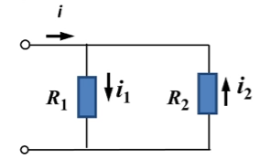
- $$i_1=\frac{g_1}{g_1+g_2}i$$
- $$i_1=\frac{1/r_1}{1/r_1+1/r_2}i$$
- $$i_1=\frac{1/r_1}{1/r_1+1/r_2}i\tag{上下同乘$r_1$}$$
- $$i_1=\frac{1}{1+r_1/r_2}i\tag{上下同乘$r_2$}$$
- $$i_1=\frac{r_2}{r_2+r_1}i$$
- 即：**两电阻**分流，
  - $r_1$的分到的电流为: $r_2/(r_1+r_2)*i$
  - $r_2$的分到的电流为: $r_1/(r_1+r_2)*i$

**推广：电流信号源最大电流传输**

- 
- $$i\uparrow=\frac{G_L\uparrow}{G_L\uparrow+G_S\downarrow}I_S$$
- **要想使负载获得的电流信号尽可能的大**，**负载的电导要尽可能大**，**电流信号源内阻的电导要尽可能小**。
- **要想使负载获得的电流信号尽可能的大**，**负载的电阻要尽可能小**，**电流信号源内阻的阻值要尽可能大**。

#### 电阻的串并联等效

**两种解法：**

- 方法 1： 并联或串联等效内部电阻
- `( 6 // 3 + 2 ) // 4 = 2Ω`
- 
- 方法 2： 并联或串联等效直接连接在接线端上的电阻
- `4 // ( 2 + 6 // 3 ) = 2Ω`
- 

#### 平衡电桥

**前置知识**

- 等电位点：电位相同的点
- 等电位点之间的开路电压为 0
- 等电位点之间连接任意阻值的电阻对其他支路的支路量没有任何影响，
- 因为等电位点之间没有电压降，所以没有电流

**平衡电桥概念**：

- 当电桥两侧电阻值**交叉相乘**`相等`时，电桥两端的**电位相等**，其上连接的电阻可以忽略
- 即$R_1R_4=R_2R3$时，$AB$两点为等点位点
- 换种说法其实就是$\frac{R1}{R2}=\frac{R3}{R4}$
- 
- 

**推广：平衡点桥测电阻**

- 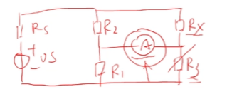
- $R_x$为待测电阻，$R_3$为可调电阻器。
- 调整可调电阻器，使得电流表示数为 0，
- 即电桥平衡,于是可知此时
- $$R_2R_3=R_1R_x$$
- 即
- $$R_x=\frac{R_2R_3}{R_1}$$

**推广：平衡电桥测重量**

- 
- 应变片：受到压力后电阻会变小,释放压力后电阻会增大（也可能相反）。
- 设初始状态 R1=R2=R3=R4=R,则 Uab=0v;
- 当在应变片上施加压力时：
  - $R_1=>R_1-△_R$
  - $R_3=>R_3+△_R$
  - $U_{AB}≈\frac{△_R}{2R}U_S$
- 即：压力增加导致增量 R:$△_R$，然后引起$U_{AB}$变化，而$U_{AB}$就反映了重量

#### Y-△ 星三角等效变换

**结论**

- $△=3Y$
- 

**[Y 接/T 形 ] (三端)网络**

- 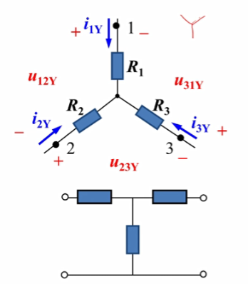

**[角接/π 形] (三端)网络**

- 

**推导**

- 
- 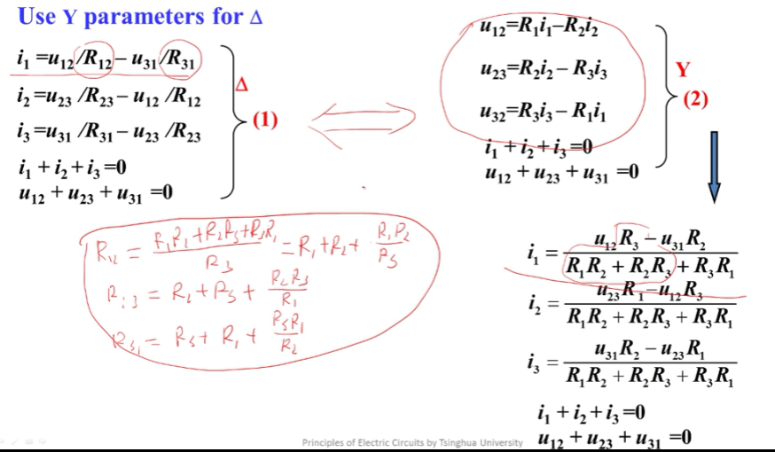

**例题**

- 图中是一个电桥，但是不平衡，无法简单通过串并联来等效，需要先用星三角变换
- 

#### 带受控源的二端网络的电阻等效

**方法：**

- **加压求流法**：**假设端口上有一个电压，求电流**(用电压表示电流)，然后找到这个 Req
- **加流求压法**：**假设端口上有一个电流，求电压**(用电流表示电流)，然后找到这个 Req

**例题**

- 步骤：
- 

#### 电阻等效求解顺序

- 1.电阻串并联
- 2.平衡电桥
- 3.星三角变换
- 4.加压求流或加流求压(对于含受控源的网络)
  

### 电源等效

#### 独立源的等效变换

**理想源**

- 电压源串联等效为各电压源的和
  - 
- 电压源和电流源串联，等效为电流源，此时电压源的作用在于决定电流源发出的功率
  - 
- 电流源串联等效为各电流源的和
  - 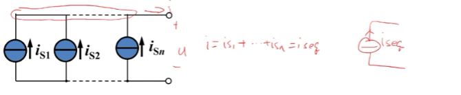
- 电压源和电流源并联，等效为电压源，此时电流源的作用在于决定电压源发出的功率
  - 

**实际源**

- 要使实际电压源和实际电流源等效，就是要使其 UI 特性曲线相同，
- 也就是要使得：$I_s=U_s/R_s$，并且要使得$U_s=I_s/G_s$
- 
- 例题
- 
- 

#### 带受控源的等效

> 这里说的是类似于独立源的等效，把受控电压源和电阻串联等效为受控电流源和电阻的并联

**例题**

- 
- 一种方式是使用 KCL 求解
- 另一种方式是通过等效变换将受控电流源变为受控电压源，然后列写 KVL 求解
- 

**例题 2**

- 
- 

## 最大功率、效率、电压传输

**最大功率传输**

- **结论：**
  - 当电源内阻等于负载等效电阻时$R_s=R_L$，称为阻抗匹配，可实现最大功率传输
  - 最大传输功率为$P_{max}=\frac{U_s^2}{4R_L}$
  - 效率为 50%
- **推导过程**
  - 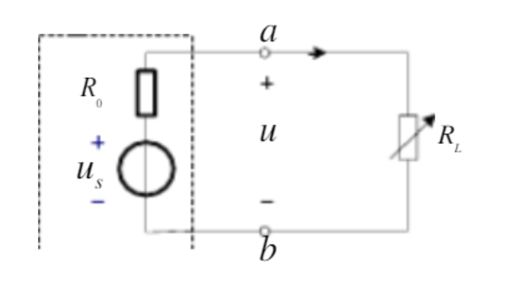
  - 

**最大功率、效率、电压传输总结**
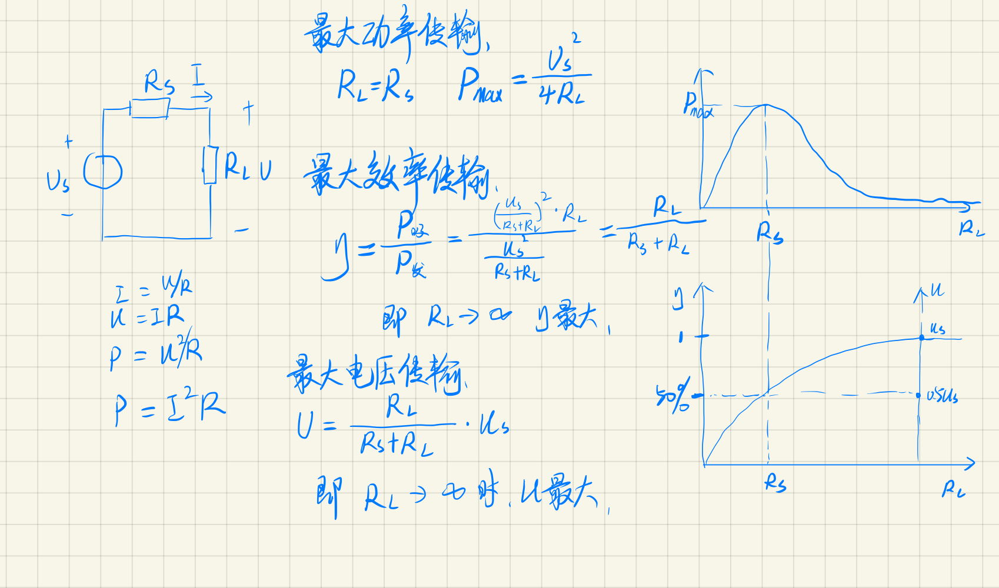

## 系统化方程解法

### 支路电流法（列写B个方程）

**理解**

只需要根据拓扑约束列写 B 个方程，本质上，就是不用列写元件约束的 2B 法

**步骤**

- b=支路数 n=节点数
- 对每个支路电流确定参考方向
- 选择 n-1 个节点列写 KCL 方程
- 选择 b-n+1 个回路列写 KVL 方程
- 解方程，求出各个支路的电流
- 通过元件约束和支路电路求出支路电压
- 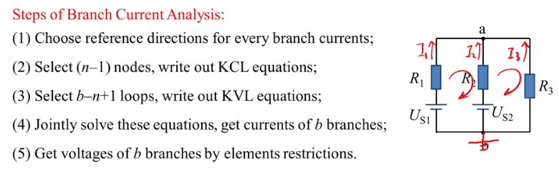

**独立方程的选取**

- **节点**：任选 n-1 个节点列写的 KCL 方程都是独立的
- **网孔**：
  - 对于平面电路，通过网孔列写的 KVL 方程都是独立的
  - 对于所有电路，要求每个新回路，至少包含一条新支路

**案例**

### 节点电压法（列写(N-1)个KCL方程）

**步骤**

- 选择一个节点作为参考点
- 对剩余的 n-1 个独立节点标记节点电压
- 对剩余的 n-1 个独立节点列写 KCL 方程
  - 流出节点电流之和=流入节点电流之和
  - 特别规定：
    - 列写时，
    - 电阻电流写在等号左侧，流出节点为正
    - 电源电流写在等号右侧，流入节点为正

**案例**

**节点电压法方程的标准形式**

**标准形式方程中各物理量的实际含义**

- $G_{11}$ 表示的是节点 1 和 参考点之间 的**自电导**
- $G_{12}$ 表示的是节点 1 和 节点 2 之间的**互电导**
- $i_{sn1}$ 表示的是流入节点 1 的电流源的和
- $G_{21}$ 表示的是节点 2 和 节点 1 之间的**互电导**
- $G_{22}$ 表示的是节点 2 和 参考点之间 的**自电导**
- $i_{sn2}$ 表示的是流入节点 2 的电流源的和

**对一般形式电路的推广：`根据物理含义直接写出方程`**

对于 n 个独立的节点

- $G_{ii}$
  - 是**自电导**
  - 是所有连接在节点 i 上的电阻(包括电压源和电阻串联支路中的电阻)的和，
  - 始终为正
- $G_{ij}$ 、 $G_{ji}$
  - 互电导
  - 其绝对值是所有连接在节点 i 和节点 j 之间的电阻的和
  - 始终为负
  - 如果电路中不含有受控源，则方程的系数矩阵是对称的，即：$G_{ij}==G_{ji}$
- $i_{Sni}$
  - 是流入节点 ni 的电流源(包括等效自电压源和电阻的电流源)的算数和

**特殊情况 1：支路上含有电压源和电阻串联的情况**

电路图  

列方程  

写成标准形式  
可以发现，这就是一个等效的电流源  
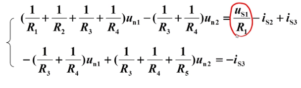

结论，直接将其等效为一个电流源和电阻的并联，这将不会影响电路中任何支路量的求解

**特殊情况 2：支路上仅含有电压源的情况**

> 解法 1:

图  
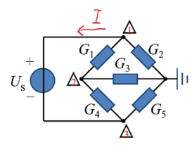

假设电压源所在支路上存在一个电流 I,然后列写方程  

由于出现了四个未知量，所以需要四个方程，  
所以补充一个电压源和节点电压的关系的方程来求解

> 解法 2:（仅针对于这种电压源只有单个的电路）

选取一个合适的参考点  

这样可以直接解出一个节点的电压  

此时，还剩两个节点电压，就只需要再列两个方程  

**特殊情况 3：支路上含有受控源的情况**

处理方法：把受控源当做独立源对待列写方程，并在最后用节点电压来表示这个受控源的控制量。

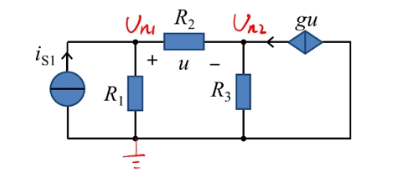

把受控源当做独立源对待列写方程  

由于出现了三个未知数，所以需要三个方程,  
所以需要用节点电压来表示这个控制量  

### 回路电流法（列写B-(n-1)个KVL方程）

> B-(N-1)就是独立回路的数量

注意

- 回路电流是假想的电流
- 电路的实际电流可以用回路电流表示
- 不在需要KCL方程的原因是回路电流本质是实际支路电流的一个分量，当要求实际电流是，还是要用KCL

步骤

- 选取电路中的B-(N-1)个回路标记回路电流方向
- 列写KVL方程
  - 回路电压降=0 $\sum{U}=0$
  - 回路电压降=回路电压升 $\sum{U_R}=\sum{U_S}$
- 求出回路电流后，实际电流就可以用回路电流表示
- 

例题

化简

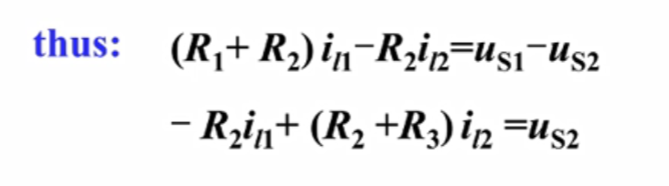

标准形式的回路电流方程

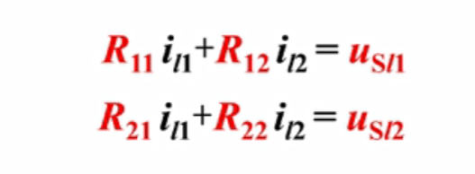

标准方程的物理含义

- R_11 = R_1+R_2 = 回路1的电阻总和，称回路1的自电阻
- R_22 = R_2+R_3 = 回路2的电阻总和，称回路2的自电阻
- R_12 = -R_2 = 回路1和回路2的互电阻，由于回路电流1和回路电流2方向相反所以为负
- R_21 = -R_2 = 回路2和回路1的互电阻，同理，为负
- Usl1 = Us1-Us2 = 沿着回路1的电压升
- Usl2 = Us2 = 沿着回路2的电压升

推广到一般形式

- R_kk 是回路自电阻
- R_jk 是回路j和k的互电阻
  - 两回路电流方向相同，R_jk>0
  - 两回路电流方向相反，R_jk<0
  - 两回路没有互电阻，R_jk = 0

网孔电流分析法（特殊的回路电流分析方法）

> 对于平面电路，选择网孔列些回路电流方程，回路电流就成了网孔电流，方程就是网孔电流方程。

#### 特殊情况1：含有独立电流源的支路

问题

> 独立电流源上的电压由外电路决定，无法表示

解决方法1

> 假设其上电压为U，  
> 然后由于多了一个未知量，所以要再找一个方程。

解决方法2

> 在选择回路时，尽量让回路电流直接等于电流源电流  
> 这样还可以少列写一个方程

#### 特殊情况2：含有受控源的情况

解决方法1

> 把受控电压源当成独立电压源列些方程，但要找到其上电压和支路电流的关系方程

### 总结

> 支路电流法、节点电压法、回路电流法所需列写方程个数总结

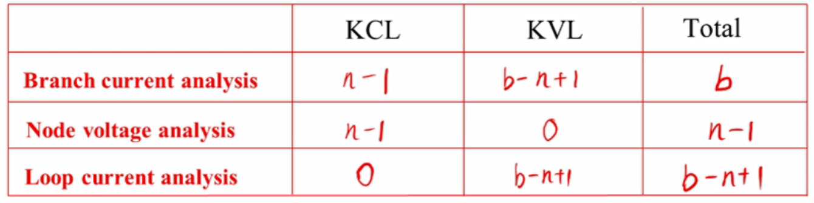

> 对于非平面电路来说，选择独立回路比较困难，选择独立节点比较简单，所以列写方程时应该采用节点电压法

## 运算放大器Op Amps

运算放大器：

- 功能
  - 运算 Operation + - x / 开方 log对数  e指数 D微分 I积分
  - 放大
- 是一种有源、集成、多端元件
- 是早期模拟计算机的重要组成部分

封装  
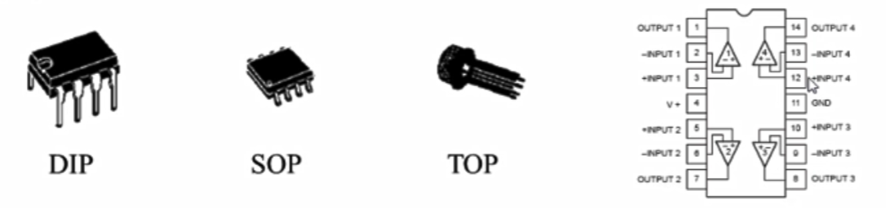

内部电路  
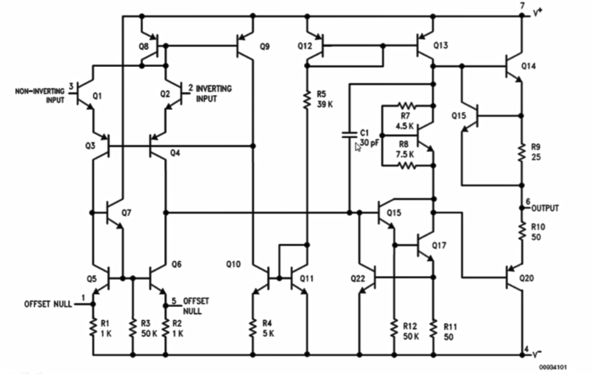

电路符号  

### 传输特性

> $U_d = U_{sat}/A$

- $|u_d| < U_d$ 时，输出$U_o=AU_d$-------->(线性区间)
- $|u_d| > U_d$ 时，-------------------------->(饱和区间)
  - $u_d > U_d$ 输出$U_o=+U_{sat}$-------->(正饱和区间)
  - $u_d < U_d$ 输出$U_o=-U_{sat}$-------->(负饱和区间)
- 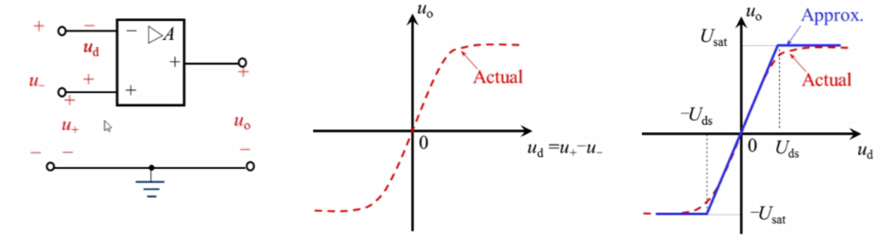

### 工作在线性区间的运放模型

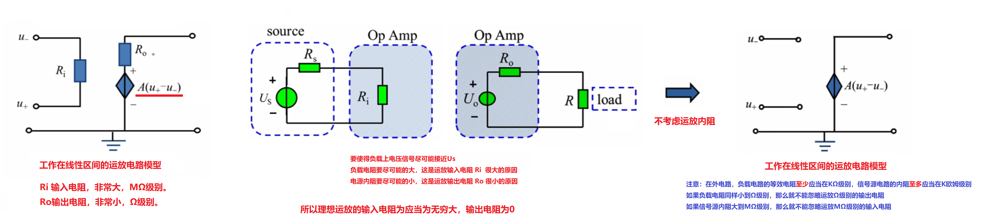

#### 运算放大器工作在开环电路

存在的问题：

- 1、A非常大，输入信号中非常小的扰动将会造成输出电压的极大变化
- 2、不同型号的运放会有不同的参数A,这使得设计的电路只能和特定参数的运放一起工作
- 3、相同型号的运放的参数A会随工作环境温度的改变而改变

#### 运算放大器工作在闭环负反馈电路

**手算过程**

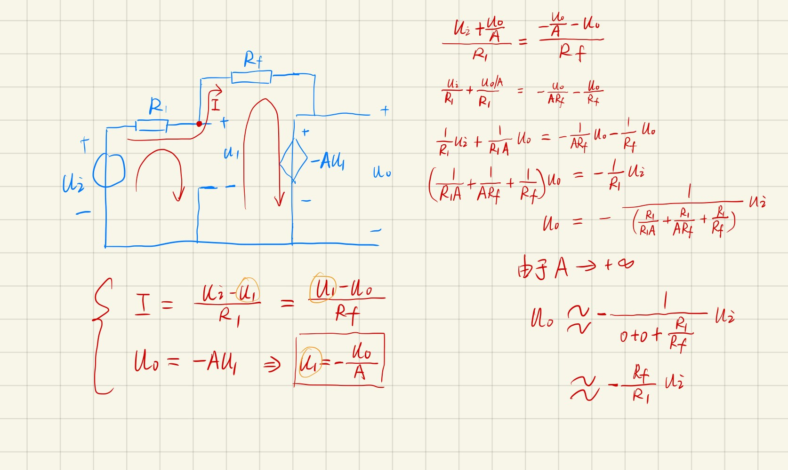

### 理想运放

#### 理想运放工作在线性区的传输特性

> 注意虚短虚断的特性的适用条件：A足够大、R_i足够大、必须是负反馈电路

负反馈电路的虚短虚断特性

- $A->∞$ 且 $u_0$ 是有限的 因为 $u_0=A(u_d)$，那么 $u_d=\frac{u_0}{A}->0$ ,即 $u_+≈u_-$ 称为 **虚短**
- $R_i->∞$ 那么$i_+≈0 i_-≈0$ 称为**虚断**

### 运放的应用

> 理想运放工作在负反馈电路的分析（工作在线性区）

#### 电压跟随器

> 输出等于输人：$u_o=u_-≈u_+=u_i$

**作用：**

- 因为理想运放输入电阻为无穷大，所以对于信号源来说，负载电阻为无穷大
- 因为理想运放输出电阻为0，把理想运放看成电源的话，这个电源的内阻就是0

**案例**

#### 反相比例放大器

> 反相是指输出电压是负的，
>
> 比例系数的绝对值可以大于1可以小于1

#### 非反相(同相)比例放大器

> 非反相是指输出电压是正的，
>
> 比例系数只能大于1

#### 加法器

> 反相加法器

#### 减法器

#### 电流源

#### 负电阻

## 数字系统

为什么需要数字系统？

- 模拟电路放大信号时会把噪声也放大
- 数字系统在某种程度上可以抑制的影响
  - （小于0.3V为假 大于4.5V为真）

数字系统中讨论的一些问题

- 组合逻辑电路  
  - 从输入立马知道输出（投票系统）
- 时序逻辑
  - 输入+当前的状态=输出（计数器）
- Analog digital converter(ADC)模数转换 数模转换
- 时钟信号（发送方和接收方在相同的时间发送和读取数据）

### 数模转换

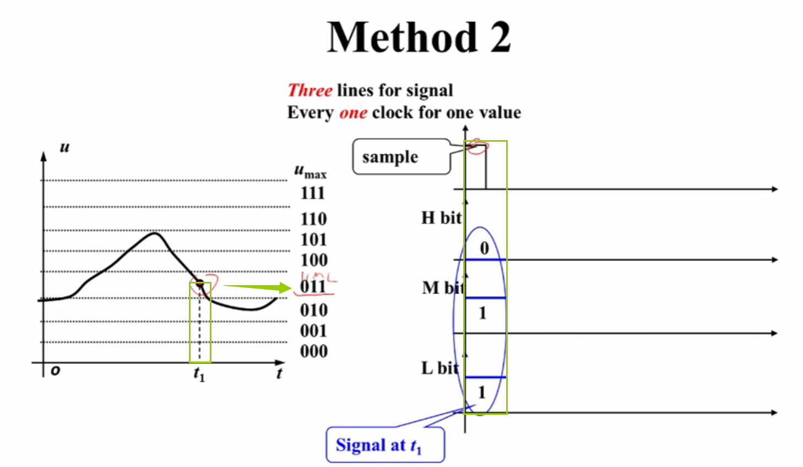

### 逻辑的两种表达方式

#### 逻辑表达式、真值表

#### 如何根据表达式写真值表

#### 如何根据真值表写表达式

### 常见逻辑门

> 三种基本逻辑表达式： 与门 或门 非门  
> 工艺中最方便制造的：反相器、与非门、或非门

缓冲器、反相器、与门、与非门、或门、或非门

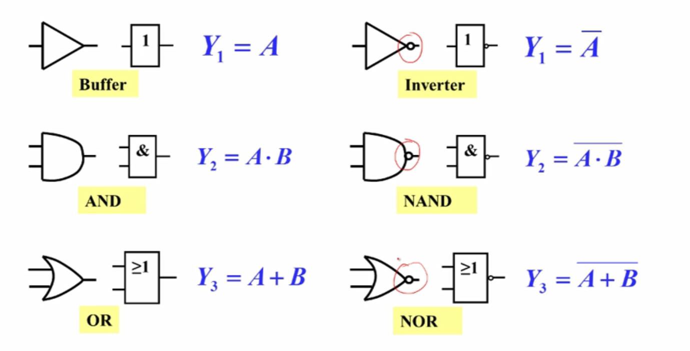

### 用逻辑门电路实现逻辑表达式

### 使用真值表或逻辑表达式实现数字运算

半加器
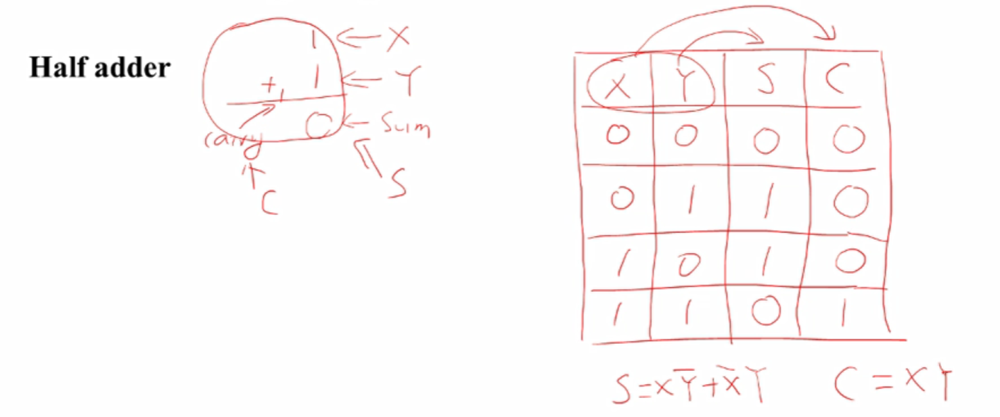

全加器？

4bit加法器？

## 场效应管

> 不知道为什么这个视频连三极管都没讲就开始讲运放和场效应管，还讲的不清楚，  
> 害的我得到处搜资料来拼凑出完整的相关知识

### 结型场效应管(JFET)

#### 分类、结构、电路符号

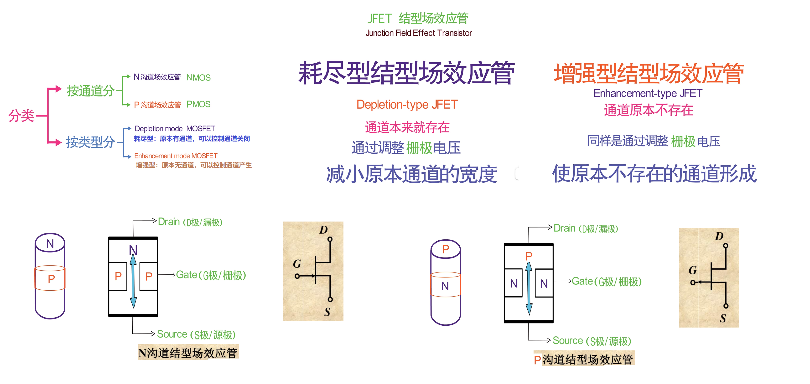

#### 结型场效应管工作原理

### 金属-氧化层半导体场效晶体管(MOSFET)

#### 分类

#### 结构和电路符号

#### 关于体二极管

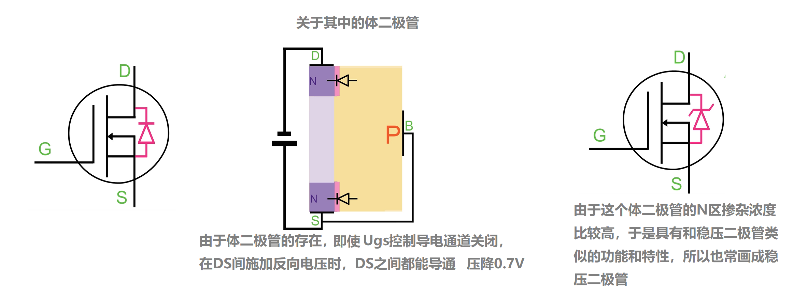

#### MOSFET工作原理（N沟道耗尽型）

#### MOSFET工作原理（N沟道增强型）

#### 场效应管的应用

场效应管应用在小功率场合时其导电沟道是水平的  

场管应用在电气系统的场合时，其导电沟道是垂直的(目的：提高允许的电压等级)

#### 外特性

> (显然这里及以下讨论的是增强型N沟道MOS管)

> 根据电路模型，存在两个电压，两个电流，也就存在四个关系  
> 但实际上，由于GS之间绝缘不导电，所以不用考虑前两者之间的关系

##### $U_{gs}-I_{ds}$的关系（转移特性曲线）

##### $U_{ds}-I_{ds}$的关系（输出特性曲线）

> 根据$U_{gs}-I_{ds}$的关系曲线可知，Ugs < Ut时，Ids=0,  
> 所以当讨论U_ds-I_ds关系时，Ugs是次要考虑的维度

##### 工作在电阻区和恒流区的条件

> 由于图中所给公式是化简后的，思维太超前了，第一眼看到的时候完全不明所以，所以下面解释一下

**关于Ut**

- 现在看到两种说法
  - 一种是说Ut是在Ugs=0时，就是Uds使得ds导通并且使得Ids到达饱和时也就是沟道因耗尽区扩大而开始夹断时的最小电压Uds,显然这是对于耗尽型场效应管而言的。
  - 另一种是说Ut是在Ugs大到一定程度，使得栅极上的电荷产生的电场足够建立起导电沟道且能够使得DS间导通的最小电压Ugs,显然这是对于增强型场效应管而言的。
- 所以实际上这个Ut是和Ugs与Uds都相关的一个量
- 在耗尽型场效应管中，Ugs上的电压(反向电压)将使得栅极和基座间的电场建立，导电沟道中的电荷被排斥，于是导电沟道变窄，Uds的电压将使得导电沟道因为体二极管反向偏置而变窄，这两个电压将因电场的均匀分布而共同作用于其内的导电沟道，Ut描述了这种平衡关系
- 在增强型场效应管中，Ugs将使沟道变宽，Uds将使沟道变窄，同样，这两个电压将因电场的均匀分布而共同作用于其内的导电沟道，Ut描述了这种平衡关系。

**工作在截止区**

- > Ugs < Ut
- 注意：截止和Uds的电压无关，只有Ugs能控制整个导电沟道的产生与消失

**工作在电阻区的条件**  

- > `0 < Uds < Ugs-Ut`
- 其本质就是：
  - 1
    - `0 < Uds < Ugs-Ut`
    - Ut < Ugs
  - 2
    - `0 < Uds < Ugs-Ut`
    - `Uds-Ugs < -Ut`
    - `Ugs-Uds <  Ut`
    - `Ugs+Usd <  Ut`
    - `Ugd < Ut`
    - 也可以说`Ugs > Uds + Ut`
      - 可以这样理解，（不知道对不对，反正我感觉逻辑自洽了）
      - 注意这里是把Uds和Ut都看成常量，然后关注Ugs一步步升高时，其对导电沟道形状的影响
      - 假设 Uds>0 Ut>0
      - Ugs=0v时，Uds不导通
      - Uds会作用在基座和栅极之间，导致此时栅极和基座间等效电容的上的电压为-Uds
      - Ugs=Uds时GS间的电压作用在栅极和基座间，这个压降刚好抵消掉Uds在基座和栅极间施加的电压。此时栅极和基座上的等效电容的电压为0V
      - 然后Ugs的电压继续升高，Ugs>Uds时，栅极和基座间的等效电容电压>0
      - 当达到Ugs>=Uds+Ut时，栅极和基座间的等效电容电压>=Ut，DS间的导电沟道因电场效应而导致宽度>=0
      - 需要说明的是，Ugs继续升高，将导致等效电容的电压继续升高，从而将导致沟道的宽度的增加，
      - 并且这种宽度的增加是整体的增加，可以理解为在控制一块半导体的粗细，
      - 横截面小了，单位时间内允许通过的电荷也就小了，电流也就小了，
      - 且由于这里的Uds没有改变，所以电阻R=u/i也就小了，实际上也就是在通过Ugs控制DS间的电阻。

工作在横流区的条件

- > `0 < Ugs-Ut < Uds`
- 其本质有两点：
  - 1
    - `0 < Ugs-Ut`
    - `Ut < Ugs`
  - 2
    - `0 < Ugs-Ut < Uds`
    - `-Ut < Uds-Ugs`
    - `Ut < Ugs - Uds`
    - `Ut < Ugs + Usd`
    - `Ut < Ugd`
    - 也可以说 `Ugs < Uds + Ut`
    - 也可以说 `Uds > Ugs - Ut`
      - 如何理解呢？
      - 和上面理解工作在电阻区一样
      - 把Ugs和Ut看做是常量，然后关注Uds升高对导电沟道的影响
      - 先假设其已经工作在受控电阻区了，也就是满足`Ugs > Uds + Ut`，变换一下就是，`Uds < Ugs-Ut`
      - Uds=0时
      - 此时由于假设其工作在电阻区，也就是说栅极和基座间的等效电容上存在着均匀分布的电场和电荷，这个均匀分布的电场的大小为Ugs，且电场强度已经足够产生导电沟道了，而且导电沟道应该是平行的
      - Uds增加
      - 此时，Uds的压降均匀的分布在从D到S导电沟道内，这个电压等级递减的电场作用在原本有着均匀分布电荷的等效电容上，使得原本有着均匀分布电场的不再均匀，也就同样使得导电沟道的宽度不再均匀。导电沟道变的上窄下宽了。
      - Uds增加到Ugs-Ut
      - 此时，Uds的压降依然均匀分布在从D到S导电沟道内，电压等级最高处为Ugs,这就正好把等效电容上方向相反的电场抵消了一部分，使得只剩下Ut，此时导电沟道宽度进一步变窄，称为“夹断”。(因为导电沟道的宽度就是在Ggs-Ut>0时开始从0变宽的)
      - Uds>Ugs-Ut
      - 此时，导电沟道只剩下一条缝了，这条缝小到导致单位时间内只能通过一定数量的电荷。也就是说Uds继续增加，这条缝也还是只能通过那么多的电子，根据电流的定义i=dq/dt,就是说Uds增加，Ids不再增加，就是说此时表现为一个电流源了。
      - 需要说明的是，Uds继续的增加只是在导致导电沟道进一步变得上窄下宽，这种宽度的减少是局部的，
      - 类比于把水管的出水口捏紧，尽管出水口的大小变了，但整个水管的粗细没有改变，水的压力依然非常大，
      - 所以水还是能从缝隙中流出来，但是即便是继续增加水的压力，但是缝隙就那么小，
      - 单位时间内允许通过的水分子个数达到了极限值，水压的增加就不会继续导致水流流速的增加了。
  
工作在横流区的特性

- $I_{ds}=K(U_{gs}-U_t)^2$

##### 工作在不同的区间建立不同的电路模型

##### 开关/电流源模型

##### 开关/电阻模型

### 几种场效应管的比较

## MOSFET在数字电路中的应用

### 反相器

> **注意：** 要使得$U_{ds}$在导通后接近0V,根据串联分压的原理，这里的$R_L$需要远远大于$R_{on}$

> 如何实现缓冲器? 两个反相器串联即可

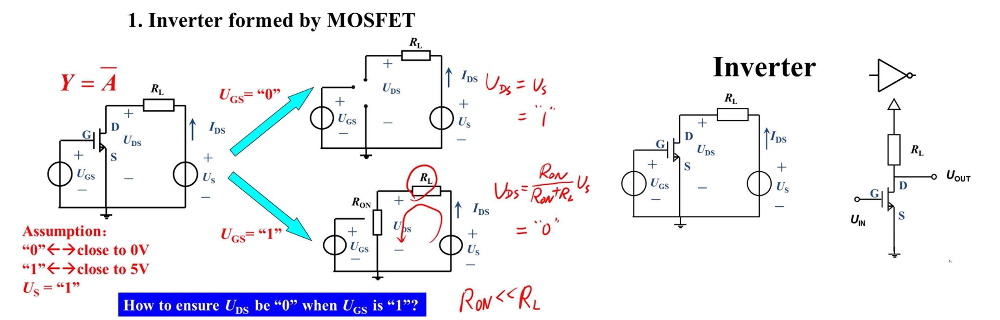

**存在的问题（最高工作频率）**
> Ugs上电压变化频率不高的话可以正常工作
> 
> 但到输入电压频率很高时，输出信号将产生畸变（原因和GS间等效电容有关，后续会讨论）
> 

### 与非门
>
> 注意：同样的，需要使得$R_l$远远大于$R_{on}$

> 如何实现与门？ 与非门+非门即可

### 或非门

> 注意：同样的，需要使得$R_l$远远大于$R_{on}$

> 如何实现或门？ 或非门+非门

## CMOS互补金属氧化物半导体

### 普通门电路的功耗

### CMOS的原理和结构及优点

## MOSFET在模拟电路中的应用

## 叠加定理

> 线性电阻电路的非常重要的定理：叠加定理、戴维南定理
>
> - 求解电路的工具
> - 理解电路的本质

### 线性系统

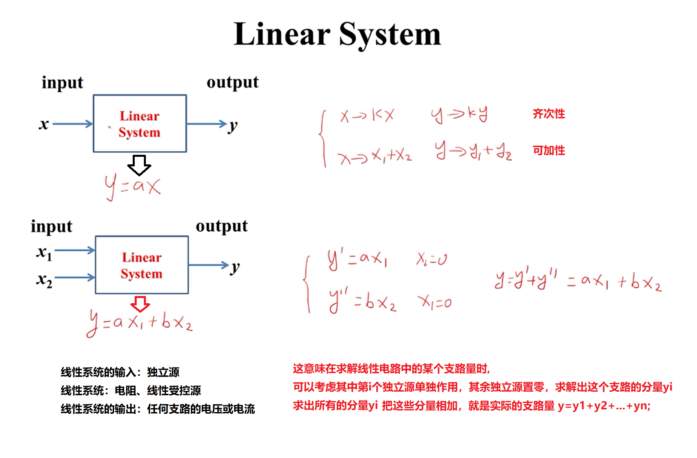

### 叠加定理

#### 例题

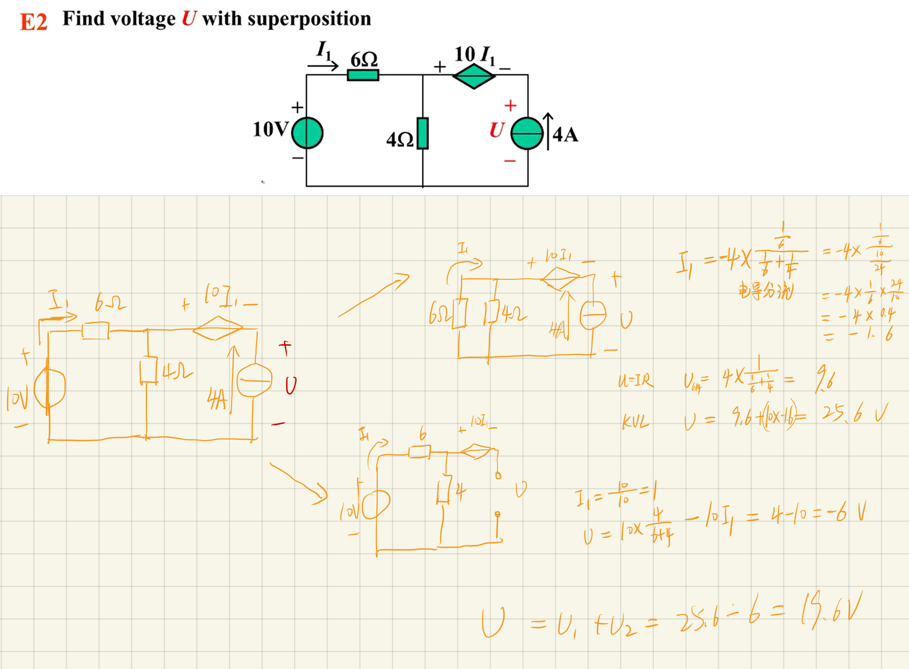

### 注意事项

> 功率和激励的关系不是线性的，不能被叠加

> 受控源不能当做激励来参与叠加

## 戴维南定理和诺顿定理

### 戴维南

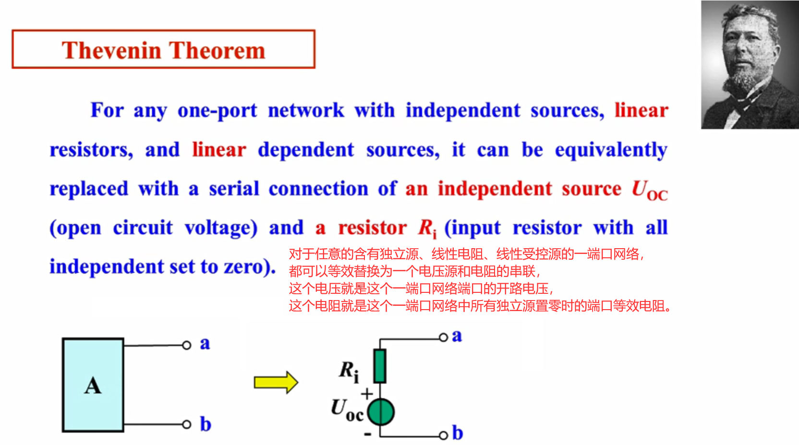

### 证明

### 戴维南和诺顿定理总结

### 例题及做题过程

## 戴维南等效的应用

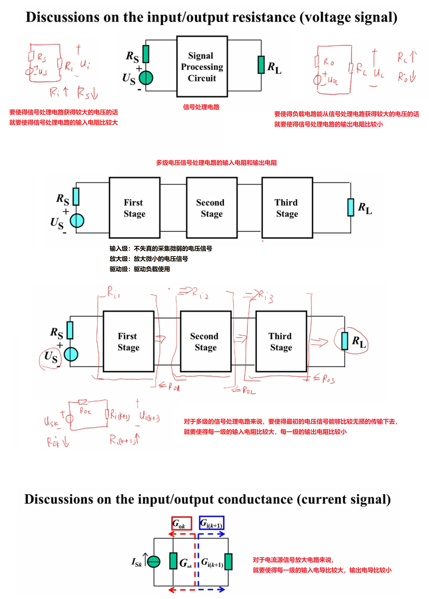

### 二端口电阻的输入电阻和输出电阻的计算

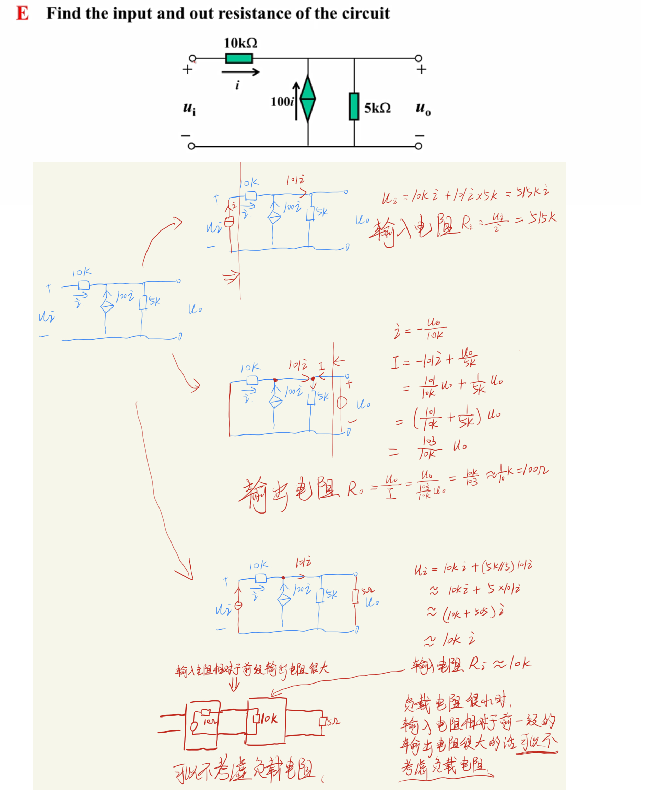

### 关于电桥的戴维南等效

## 替代定理

### 替代定理的证明

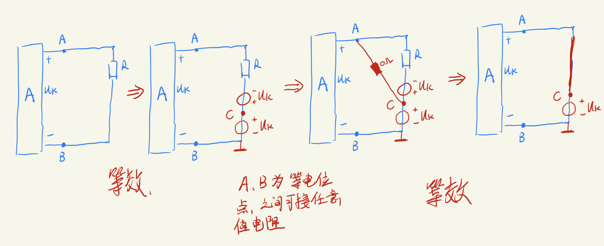

### 本质:静态工作点不变

### 替换必须保证解唯一

## 非线性电阻

### 例子

### 和线性电阻的区别

> - 不再满足其次性和可加性
> - 可能产生新的频率

### 分析含非线性电阻电路的方法

#### 直接列方程法

#### 图解法

#### 分段线性法（假设检验法）

##### 例题

##### 性质

##### 对二极管的几种建模方法
>
> 具体使用什么模型要看外部电路的电压和信号源的内阻是多少，要考虑选用某个模型时忽略掉的二极管的特性对外电路的影响程度。

##### 计算含理想二极管的负载上的电压

##### 计算含压降的二极管模型上的电压

##### 假设检验法的应用：分析MOSFET的工作状态

###### 用分段线性法对MOSFET建模

###### 分析电路MOSFET的工作状态

##### 假设检验法的应用：分析全桥整流电路

#### 小信号法

##### 为什么需要小信号法

##### 概念放大器

##### 对更一般化的问题的分析方法

> 小信号法是通过列些方程然后化简得到两个方程：求静态工作点的非线性方程，和求电路对小信号的响应的线性方程，然后通过这两个方程画出两个工作状态的电路图。

#### 小信号模型

> 小信号模型不同于小信号法，是对小信号法的求解过程进行总结规律，通过探究小信号作用在独立源、受控源、线性电阻、非线性电阻上的电压电流关系，使得能够直接画出其静态工作电路和小信号源单独作用的电路。

##### 小信号作用在非线性电阻、线性电阻上的等效

##### 小信号作用在独立源、线性受控源、非线性受控源上的等效

##### 小信号模型求解电路的例题

##### 小信号模型分析由MOSFET构成的放大器电路

## 一阶电路

### 电容

-  
  > 关于电容定义式的推导需要电磁场的知识，暂时不了解，跳过，以后再说
- **定义式：** $C=\frac{q}{u}=ε\frac{s}{d}$
- **单位：** F法
- 注意：
  - C与q和u无关，C只和介电常数ε、极板面积s、两极板之间距离d有关。
    - 类比于电阻：
    - R=u/i但R与u和i无关，R只和导体的材质、横截面积等因素有关。
- **其上电流公式的推导：**
  - 由于: $C=\frac{q}{u}$ 所以：$q=C*u$
  - 由于: $i=\frac{dq}{dt}$
  - 所以电容上电流为$i=\frac{dq}{dt}=\frac{d(C*u)}{dt}=C\frac{du}{dt}$
  - 所以可以认为：电容上的电流=C乘上电压的变化率。
- **其上电压公式的推导：**
  - 由于: $i=C\frac{du}{dt}$
  - 所以：$du=\frac{1}{C}*i*dt$
  - 所以：$u=\frac{1}{C}∫{idt}$
  - 所以：$u(t)=\frac{1}{C}∫_{-∞}^{t}{idτ}$
    - 这里似乎都会把微分的dt写成dτ，原因应该是为了区分其不同的含义
  - 所以：$u(t)=\frac{1}{C}∫_{-∞}^{0}{idτ}+\frac{1}{C}∫_{0}^{t}{idτ}$
  - 所以：$u(t)=u(0)+\frac{1}{C}∫_{0}^{t}{idτ}$
  - 所以可以认为：t时刻电容上的电压=0时刻的其上的电压+ $\frac{1}{C}$ 乘上0到t时刻电流随时间的积分
- **吸收的功率**
  - $P=ui=u*C\frac{du}{dt}$
- **吸收的能量**
  - $W=Pt$
  - $W=∫{P(t)dτ}=∫{u*C\frac{du}{dτ}*dτ}=C∫{u*du}$
  - 所以：$W(t)=C∫_{-∞}^{t}{u*du}$
    - 注意：
      - 这里还可以写成 $W(t)=C∫_{-∞}^{t_0}{u*du}+C∫_{t_0}^{t}{u*du}$
      - 即t时刻吸收的能量=-∞到t0时刻吸收的能量 + t0到t时刻吸收的能量
      - 从而可以推出t0时刻到t时刻的能量变化，就是W(t0) 到 W(t) 能量的变化
  - 所以：$W(t)=C\frac{u^2}{2}|_{-∞}^{t}$
    - u可以是一个常数，也可以是t的函数，
    - 显然，u是常数时，吸收的能量为0
  - 所以：$W(t)=C\frac{u(t)^2}{2}-C\frac{u(-∞)^2}{2}$
  - 可以认为-∞时刻吸收的功率为0
  - 则: $W(t)=C\frac{u(t)^2}{2}$
  - 简写：$W=C\frac{u^2}{2}$
  - 另外：
    - 由于: $u=\frac{Q}{C}$
    - 所以带入可得：$W=C\frac{(\frac{Q}{C})^2}{2}=\frac{C}{2}\frac{Q^2}{C^2}=\frac{Q^2}{2C}$
    - 由于Q是>=0的，所以$W=\frac{Q^2}{2C}>=0$
- **并联等效**
  - 并联等效电容：$C_{eq}=C_1+C_2$
  - 
- **串联等效**
  - 串联等效电容：$C_{eq}=\frac{C_1*C_2}{C_1+C_2}$
  - 
- **串联分压**
  - 利用KCL+KVL求解：
    - 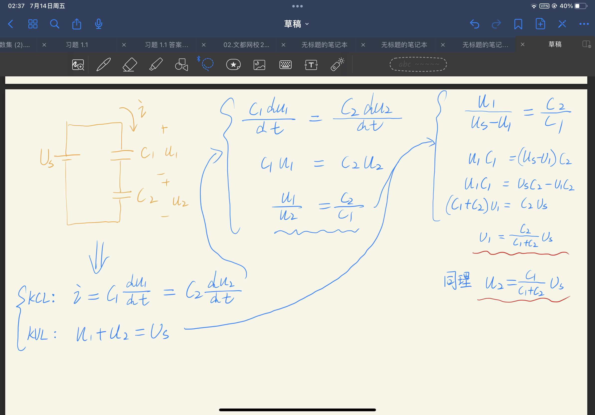
  - 利用电荷守恒求解：
  - > 这种方法是求解含有多个电容电路的常用技巧
  - 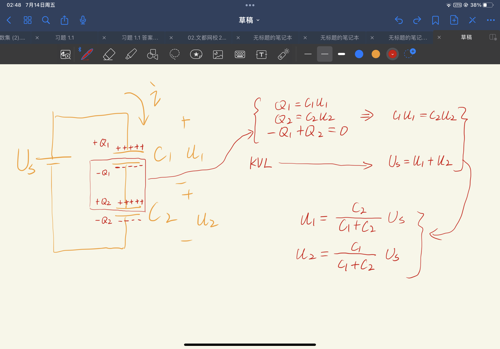
- **并联分流**
  - 

------------------------------------------------------------

### 电感Inductors

-  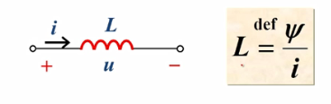
- **公式：** $L=\frac{Ψ}{i}=μn^2S$
- **单位：** H
- **其上电压**
  - 根据法拉第电磁感应定律： $u=\frac{dΨ}{dt}$ （电势等于磁通量的变化速度）
  - 又因为： $Ψ=L*i$
  - 所以有：$u=\frac{d(Li)}{dt}=L\frac{di}{dt}$
    - 可知i为常数时，u=0
  - 
- **其上电流**
  - 可以根据其电压公式推导出来
  - $i=\frac{1}{L}∫_{-∞}^{t}{udτ}$
  - 和电容类似，可以得到：
  - $i(t) = i(0)+\frac{1}{L}∫_{0}^{t}{udτ}$
- **吸收的功率**
  - $P=ui=i*L\frac{di}{dt}$
- **吸收的能量**
  - $W=Pt$
  - $W(t)=∫{P(t)dτ}$
  - $W(t)=∫_{-∞}^{t}{i*L\frac{di}{dt}*dτ}$
  - $W(t)=L∫_{-∞}^{t}{idi}$
  - $W(t)=L∫_{-∞}^{0}{idi}+L∫_{0}^{t}{idi}$
  - $W(t)=W(0)+L∫_{0}^{t}{idi}$
  - 假设负无穷到0时刻吸收的能量为0,即W(0)=0,则可得到：
  - $W(t)=L∫_{0}^{t}{idi}=L\frac{1}{2}i^2|_0^t=L\frac{1}{2}i^2$
  - 由于$L=\frac{Ψ}{i}$ 所以$i=\frac{Ψ}{L}$，则可知：
  - $W(t)=L\frac{1}{2}(\frac{Ψ}{L})^2=\frac{1}{2L}Ψ^2>=0$
- **串联等效和并联等效**
  - 
- **串联分压和并联分流**
  - 

### 电容电感总结

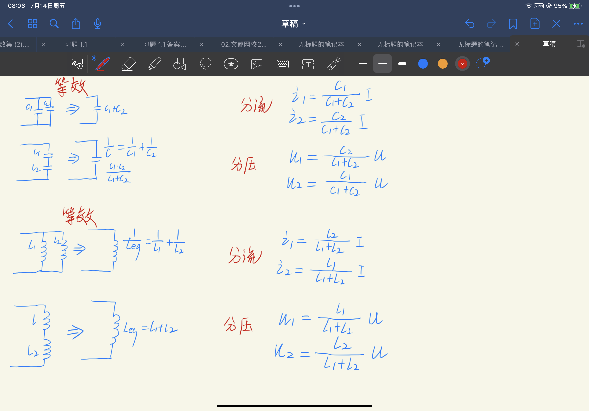

### 忆阻器

### 动态电路

