# AC_SABER刷题提交记录

<!--  -->

## 目录

- [AC\_SABER刷题提交记录](#ac_saber刷题提交记录)
  - [目录](#目录)
  - [对数器的实现](#对数器的实现)
  - [\_01\_基础知识](#_01_基础知识)
    - [\_01\_快速排序](#_01_快速排序)
      - [\_01\_快速排序](#_01_快速排序-1)
      - [\_02\_第k个数](#_02_第k个数)
      - [\_03\_七夕祭【未做】](#_03_七夕祭未做)
    - [\_02\_归并排序](#_02_归并排序)
      - [\_01\_归并排序](#_01_归并排序)
      - [\_02\_逆序对数量](#_02_逆序对数量)
      - [\_03\_超快速排序](#_03_超快速排序)
    - [\_03\_二分查找](#_03_二分查找)
      - [\_01\_数的范围](#_01_数的范围)
      - [\_02\_数的三次方根](#_02_数的三次方根)
      - [\_03\_最佳牛围栏\_暴力解\_超时](#_03_最佳牛围栏_暴力解_超时)
      - [\_03\_最佳牛围栏\_二分\_AC](#_03_最佳牛围栏_二分_ac)
    - [\_06\_前缀和与差分](#_06_前缀和与差分)
      - [\_01\_前缀和](#_01_前缀和)
      - [\_02\_差分](#_02_差分)
      - [\_03\_二维前缀和](#_03_二维前缀和)
      - [\_04\_二维差分](#_04_二维差分)
    - [\_07\_双指针](#_07_双指针)
      - [\_01\_最长不重复连续子序列](#_01_最长不重复连续子序列)
      - [\_02\_数组元素目标和](#_02_数组元素目标和)
    - [\_08\_位运算](#_08_位运算)
      - [\_01\_二进制中一的个数](#_01_二进制中一的个数)
      - [\_02\_64位整数乘法](#_02_64位整数乘法)
    - [\_09\_离散化](#_09_离散化)
      - [\_01\_离散化](#_01_离散化)
    - [\_10\_区间合并](#_10_区间合并)
      - [\_1\_区间合并](#_1_区间合并)
  - [\_03\_数据结构](#_03_数据结构)
    - [\_01\_单链表](#_01_单链表)
    - [\_02\_双链表](#_02_双链表)
    - [\_03\_栈](#_03_栈)
    - [\_04\_队列](#_04_队列)
    - [\_05\_单调栈](#_05_单调栈)
    - [\_06\_单调队列](#_06_单调队列)
    - [\_07\_KMP](#_07_kmp)
    - [\_08\_Trie](#_08_trie)
    - [\_09\_并查集](#_09_并查集)
      - [\_01\_并查集](#_01_并查集)
    - [\_10\_堆排序](#_10_堆排序)
      - [\_01\_堆排序](#_01_堆排序)
    - [\_11\_hash表](#_11_hash表)
      - [\_01\_模拟散列表](#_01_模拟散列表)
      - [\_02\_字符串hash](#_02_字符串hash)
  - [\_04\_图论](#_04_图论)
    - [\_01\_单源最短路](#_01_单源最短路)
      - [\_01\_Dijkstra\_朴素版](#_01_dijkstra_朴素版)
        - [\_01\_Dijkstra\_朴素版\_邻接表法](#_01_dijkstra_朴素版_邻接表法)
        - [\_01\_Dijkstra\_朴素版\_邻接矩阵实现](#_01_dijkstra_朴素版_邻接矩阵实现)
      - [\_02\_Dijkstra\_堆优化版](#_02_dijkstra_堆优化版)
        - [\_02\_Dijkstra\_堆优化版\_邻接表法](#_02_dijkstra_堆优化版_邻接表法)
        - [\_02\_Dijkstra\_堆优化版\_邻接矩阵实现](#_02_dijkstra_堆优化版_邻接矩阵实现)
      - [\_03\_Bellman\_Ford算法\_有边数限制的最短路](#_03_bellman_ford算法_有边数限制的最短路)
      - [\_04\_SPFA算法](#_04_spfa算法)
      - [\_05\_热浪](#_05_热浪)
      - [\_06\_最小花费](#_06_最小花费)
      - [\_07\_香甜的黄油](#_07_香甜的黄油)
      - [\_08\_信使](#_08_信使)
      - [\_09\_最优乘车](#_09_最优乘车)
    - [\_06\_Floyd算法](#_06_floyd算法)
      - [\_01\_Floyd算法\_邻接矩阵实现](#_01_floyd算法_邻接矩阵实现)
      - [\_02\_AcWing\_343\_排序](#_02_acwing_343_排序)
      - [\_03\_AcWing\_344\_观光之旅\_无向图](#_03_acwing_344_观光之旅_无向图)
    - [\_07\_最小生成树初级](#_07_最小生成树初级)
      - [\_01\_Prim算法求最小生成树](#_01_prim算法求最小生成树)
      - [\_02\_Kurskal算法求最小生成树](#_02_kurskal算法求最小生成树)
    - [\_10\_拓扑排序](#_10_拓扑排序)
      - [\_01\_top排序](#_01_top排序)
    - [\_14\_染色法判断二分](#_14_染色法判断二分)
      - [\_01\_染色法判断二分图](#_01_染色法判断二分图)
    - [\_15\_匈牙利算法](#_15_匈牙利算法)
      - [\_01\_二分图最大匹配](#_01_二分图最大匹配)
  - [\_05\_数学知识](#_05_数学知识)
    - [\_01\_质数](#_01_质数)
      - [\_01\_试除法判断质数](#_01_试除法判断质数)
      - [\_02\_分解质因数](#_02_分解质因数)
      - [\_03\_质数筛](#_03_质数筛)
    - [\_02\_约数](#_02_约数)
      - [\_01\_试除法求约数](#_01_试除法求约数)
      - [\_02\_求约数个数](#_02_求约数个数)
      - [\_03\_约数之和](#_03_约数之和)
      - [\_04\_欧几里得算法求最大公约数](#_04_欧几里得算法求最大公约数)
    - [\_03\_快速幂](#_03_快速幂)
      - [\_01\_快速幂](#_01_快速幂)
      - [\_02\_快速幂求逆元](#_02_快速幂求逆元)
    - [\_04\_欧拉函数](#_04_欧拉函数)
      - [\_01\_朴素求欧拉函数](#_01_朴素求欧拉函数)
      - [\_02\_筛法求1\[1,n\]中每个数的欧拉函数](#_02_筛法求11n中每个数的欧拉函数)
    - [\_05\_同余](#_05_同余)
      - [\_01\_扩展欧几里得算法](#_01_扩展欧几里得算法)
      - [\_02\_扩展欧几里得算法解线性同余方程](#_02_扩展欧几里得算法解线性同余方程)
    - [\_06\_中国剩余定理](#_06_中国剩余定理)
      - [\_01\_曹冲养猪：中国剩余定理模板题](#_01_曹冲养猪中国剩余定理模板题)
    - [\_08\_高斯消元](#_08_高斯消元)
      - [\_01\_高斯消元法求线性方程组](#_01_高斯消元法求线性方程组)

## 对数器的实现

<details>

```java
package _01_基础知识._01_快速排序;

import java.util.Arrays;

public class _00_对数器 {
    // 生成随机数组
    static int[] getRandomArray(int maxLength, long minVal, long maxVal) {
        int Len = (int) (Math.random() * maxLength);
        int[] res = new int[Len];
        for (int i = 0; i < Len; i++) {
            res[i] = (int) (minVal + Math.random() * (maxVal - minVal));
        }
        return res;
    }
    // 复制出新数组
    static int[] copy(int[] arr) {
        int[] res = new int[arr.length];
        System.arraycopy(arr, 0, res, 0, res.length);// 使用c++代码实现的copy
        return res;
    }
    // 比较两数组是否完全一致
    static boolean arrayComp(int[] arr1, int[] arr2) {
        if (arr1.length != arr2.length) return false;
        for (int i = 0, j = 0; i < arr1.length; i++, j++) {
            if (arr1[i] != arr2[j])
                return false;
        }
        return true;
    }
    public static void main(String[] args) {
        int T = 100;// 测试次数
        for (int i = 0; i < T; i++) {
         System.out.println("生成随机数组");
            // 生成随机长度，值随机的数值
            int[] arr1 = getRandomArray(10000000, Integer.MIN_VALUE, Integer.MAX_VALUE);
            int[] arr2 = copy(arr1);
            int[] arr3 = copy(arr1);
      long t1 = System.currentTimeMillis();
            quick_sort1(arr1);// 左程云算法课教的快速排序算法
      long t2 = System.currentTimeMillis();
            quick_sort2(arr2);// acwing算法基础课教的快速排序算法
      long t3 = System.currentTimeMillis();
            Arrays.sort(arr3);// java内置排序算法
            long t4 = System.currentTimeMillis();

            if (!arrayComp(arr1, arr3)||!arrayComp(arr2, arr3)) {
                System.out.println("三算法处理结果不一致");
                break;
            }

            long s1 = t2-t1;
            long s2 = t3-t2;
            long s3 = t4-t3;
            System.out.println("第1个算法耗时"+s1+"ms");
            System.out.println("第2个算法耗时"+s2+"ms");
            System.out.println("第3个算法耗时"+s3+"ms");
            System.out.println();
            
        }
        System.out.println("比较完毕");
    }

    static void quick_sort1(int[] arr) {
        quick_sort1(arr, 0, arr.length - 1);
    }
    static void quick_sort2(int q[]) {
        quick_sort2(q, 0, q.length-1);
    }

    private static void quick_sort1(int[] arr, int left, int right) {
        if(left>=right) return;
        int x=arr[left],idx=left,L=left-1,R=right+1;
        while (idx<R){
            if(arr[idx]<x) swap(arr,idx++,++L);
            else if(arr[idx]>x) swap(arr,idx,--R);
            else idx++;
        }
        quick_sort1(arr,left,L); quick_sort1(arr,R,right);
    }
    static void swap(int[] arr, int i, int j) {
        if (i != j) {
            arr[i] = arr[i] ^ arr[j];
            arr[j] = arr[i] ^ arr[j];
            arr[i] = arr[i] ^ arr[j];
        }
    }
    static void quick_sort2(int arr[], int l, int r) {
        if(l>=r)return;
        int x=arr[(l+r)>>1],L=l-1,R=r+1;
        while(L<R){
            do L++; while(arr[L]<x);
            do R--; while(arr[R]>x);
            if(L<R) swap(arr, L, R);
        }
        quick_sort2(arr, l, R);quick_sort2(arr, R+1, r);
    }
}
```

</details>

## _01_基础知识

<!-- 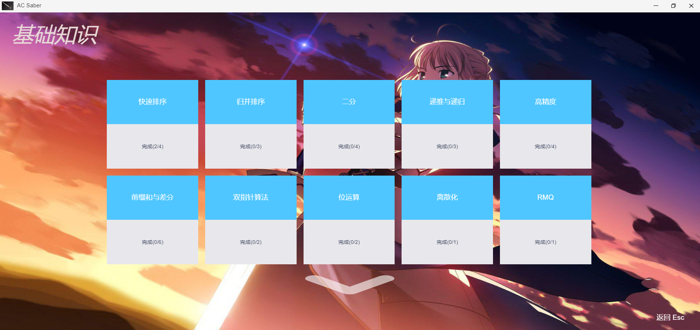 -->

### _01_快速排序

<!-- 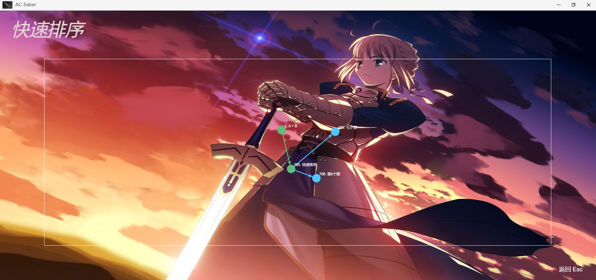 -->

#### _01_快速排序


**AC代码**

```java
package _01_基础知识._01_快速排序;
/*
提交状态: AC
输入
5
3 1 2 4 5
输出
1 2 3 4 5
 * */
import java.io.BufferedReader;
import java.io.BufferedWriter;
import java.io.IOException;
import java.io.InputStreamReader;
import java.io.OutputStreamWriter;
import java.io.PrintWriter;
import java.io.StreamTokenizer;


public class _01_快速排序 {
 static BufferedReader br = new BufferedReader(new InputStreamReader(System.in));
 static  BufferedWriter bw = new BufferedWriter(new OutputStreamWriter(System.out));
 static StreamTokenizer st = new StreamTokenizer(br);
 static PrintWriter pw = new PrintWriter(bw);
 static int nextInt() throws IOException {
  st.nextToken();
  return (int)st.nval;
 }
 static String nexString() throws IOException {
  st.nextToken();
  return st.sval;
 }
    public static void main(String[] args)throws IOException {
  int N = nextInt();
  int[] arr = new int[N];
  for(int i=0;i<N;i++) arr[i]=nextInt();
        // 算法1和算法2，实际测试，两者都是正确的，耗时，前者约是后者的1.5倍
  // quick_sort1(arr); // 左成云算法课上讲解的算法
  quick_sort2(arr);// acWing算法基础课上讲解的算法
  for(int i=0;i<N;i++) pw.printf("%d ", arr[i]);
  pw.flush();
 }
    static void quick_sort1(int[] arr) {
        quick_sort1(arr, 0, arr.length - 1);
    }
 static void quick_sort2(int[] arr) {
        quick_sort2(arr, 0, arr.length - 1);
    }

    private static void quick_sort1(int[] arr, int left, int right) {
        if(left>=right) return;
        int x=arr[left],idx=left,L=left-1,R=right+1;
        while (idx<R) 
            if(arr[idx]<x) swap(arr,idx++,++L);
            else if(arr[idx]>x) swap(arr,idx,--R);
            else idx++;
        quick_sort1(arr,left,L);
        quick_sort1(arr,R,right);
    }
 static void quick_sort2(int q[], int l, int r) {
        if (l >= r) return;
        int x = q[l],L = l - 1, R = r + 1;
        while (L < R) {
            do L++; while (q[L] < x);
            do R--; while (q[R] > x);
            if (L < R) swap(q, L, R);
        }
        quick_sort2(q, l, R);quick_sort2(q, R + 1, r);
    }
    static void swap(int[] arr, int i, int j) {
        if (i != j) {
            arr[i] = arr[i] ^ arr[j];
            arr[j] = arr[i] ^ arr[j];
            arr[i] = arr[i] ^ arr[j];
        }
    }
}
```

**AC代码**

```cpp
/*
提交状态: AC
输入
5
3 1 2 4 5
输出
1 2 3 4 5
 * */
#include <iostream>
using namespace std;
void exchange(int arr[],int i,int j){
    if(i!=j){
        arr[i]=arr[i]^arr[j];
        arr[j]=arr[i]^arr[j];
        arr[i]=arr[i]^arr[j];
    }
}
void quick_sort1(int arr[],int left,int right){
    if(left>=right) return;
    int x=arr[left],i=left,L=left-1,R=right+1;
    while (i<R) {
        if(arr[i]<x) exchange(arr,i++,++L);
        else if(arr[i]>x) exchange(arr,i,--R);
        else i++;
    }
    quick_sort1(arr,left,L);
    quick_sort1(arr,R,right);
}

void quick_sort2(int q[], int l, int r)
{
    if (l >= r) return;
    int i = l - 1, j = r + 1, x = q[l + r >> 1];
    while (i < j) {
        do i ++ ; while (q[i] < x);
        do j -- ; while (q[j] > x);
        if (i < j) exchange(q,i, j);
    }
    quick_sort2(q, l, j), quick_sort2(q, j + 1, r);
}

const int N=100000;
static int a[N];
int n;
int main()
{
    cin>>n;
    for (int i = 0; i < n; i++) scanf("%d",&a[i]);
    // quick_sort1(a,0,n-1); // 无法通过
    quick_sort2(a,0,n-1); // 可以通过
    for (int i = 0; i < n; i++) printf("%d ",a[i]);
}
```

> 这题当时做的时候用的其他写法，一直提示超时，通不过，最后写了对数器，发现那种写法确实更慢一些。
> 

```java
 // 写法1，相比于写法2速度较慢，但时间复杂度是相同的
    static void quick_sort1(int[] arr, int left, int right) {
        if(left>=right) return;
        int x=arr[left],idx=left,L=left-1,R=right+1;
        while (idx<R) 
            if(arr[idx]<x) swap(arr,idx++,++L);
            else if(arr[idx]>x) swap(arr,idx,--R);
            else idx++;
        quick_sort1(arr,left,L);
        quick_sort1(arr,R,right);
    }
```

```java
 // 写法2.1
 // mid=(l+r)>>1时表现似乎最优秀
    static void quick_sort2(int arr[], int l, int r) {
        if(l>=r)return;
        int x=arr[(l+r)>>1],L=l-1,R=r+1;
        while(L<R){
            do L++; while(arr[L]<x);
            do R--; while(arr[R]>x);
            if(L<R) swap(arr, L, R);
        }
        quick_sort2(arr, l, R);quick_sort2(arr, R+1, r);
    }
 // 写法2.2
    static void quick_sort2(int arr[], int l, int r) {
        if(l>=r)return;
        int x=arr[r],L=l-1,R=r+1;
        while(L<R){
            do L++; while(arr[L]<x);
            do R--; while(arr[R]>x);
            if(L<R) swap(arr, L, R);
        }
        quick_sort2(arr, l, L-1);quick_sort2(arr, L, r);
    }
 // 写法2.3
    static void quick_sort2(int arr[], int l, int r) {
        if(l>=r)return;
        int x=arr[l],L=l-1,R=r+1;
        while(L<R){
            do L++; while(arr[L]<x);
            do R--; while(arr[R]>x);
            if(L<R) swap(arr, L, R);
        }
        quick_sort2(arr, l, R);quick_sort2(arr, R+1, r);
    }
```

#### _02_第k个数

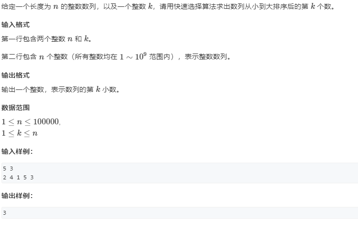

**AC代码**

```java
package _01_基础知识._01_快速排序;

import java.io.BufferedReader;
import java.io.BufferedWriter;
import java.io.IOException;
import java.io.InputStreamReader;
import java.io.OutputStreamWriter;
import java.io.PrintWriter;
import java.io.StreamTokenizer;
/*
提交状态: AC
输入
5 3
2 4 1 5 3
输出
3
 * */
public class _02_第k个数 {
 static BufferedReader br = new BufferedReader(new InputStreamReader(System.in));
 static BufferedWriter bw = new BufferedWriter(new OutputStreamWriter(System.out));
 static StreamTokenizer st = new StreamTokenizer(br);
 static PrintWriter pw = new PrintWriter(bw);
 static double nextVal() {
  try {
   st.nextToken();
  } catch (IOException e) {
   e.printStackTrace();
  }
  return st.nval;
 }
 static String nextStr() {
  try {
   st.nextToken();
  } catch (IOException e) {
   e.printStackTrace();
  }
  return st.sval;
 }
    public static void main(String[] args) {
     int n = (int)nextVal();
     int k = (int)nextVal();
     int[] arr = new int[n];
     for(int i =0;i<n;i++) arr[i]=(int)nextVal();
     pw.println(quickSort(arr, 0, n-1, k-1));
     pw.flush();
    }
    static int quickSort(int[]arr,int l,int r,int k) {
     if(l>=r) return arr[l];
     int x=arr[(l+r)>>1],L=l-1,R=r+1;
     while(L<R) {
      do L++ ;while(arr[L]<x);
      do R-- ;while(arr[R]>x);
      if(L<R) {int t=arr[L];arr[L]=arr[R];arr[R]=t;}
     }
     if(k<=R) return quickSort(arr, l, R, k);//类似于二分查找，只对k所在的的区间排序
     else return quickSort(arr, R+1, r, k);
    }
}

```

#### _03_七夕祭【未做】


```java

```

### _02_归并排序

#### _01_归并排序


```java
package _01_基础知识._02_归并排序;

import java.io.BufferedReader;
import java.io.BufferedWriter;
import java.io.IOException;
import java.io.InputStreamReader;
import java.io.OutputStreamWriter;
import java.io.PrintWriter;
import java.io.StreamTokenizer;
/*
提交状态: AC
输入
5
3 1 2 4 5
输出
1 2 3 4 5
 * */
public class _01_归并排序 {
 static BufferedReader br = new BufferedReader(new InputStreamReader(System.in));
 static BufferedWriter bw = new BufferedWriter(new OutputStreamWriter(System.out));
 static StreamTokenizer st = new StreamTokenizer(br);
 static PrintWriter pw = new PrintWriter(bw);
 public static void main(String[] args) {
  int N = nextInt();
  int arr[] = new int[N],i;
  for (i = 0; i < arr.length; i++) {
   arr[i]=nextInt();
  }
  mergeSort(arr, 0, N-1);
  for (i = 0; i < arr.length-1; i++) pw.printf("%d ",arr[i]);
  pw.printf("%d\n",arr[i]);
  pw.flush();
 }
 static void mergeSort(int[] arr,int L,int R) {
  if(L>=R) return;
  int mid = L+(R-L)/2;
  mergeSort(arr, L, mid);mergeSort(arr, mid+1, R);
  int temp[]=new int[R-L+1], i=0, l=L,r=mid+1;
  while (l<=mid&&r<=R) {
   if(arr[l]<=arr[r]) temp[i++]=arr[l++];
   else temp[i++]=arr[r++];
  }
  while (l<=mid) temp[i++]=arr[l++];
  while (r<=R) temp[i++]=arr[r++];
  for(i=0;i<temp.length;i++) arr[L+i]=temp[i];
 }
 static int nextInt() {
  try {
   st.nextToken();
  } catch (IOException e) {
   // TODO 自动生成的 catch 块
   e.printStackTrace();
  }
  return (int) st.nval;
 }
 static String nextStr() {
  try {
   st.nextToken();
  } catch (IOException e) {
   // TODO 自动生成的 catch 块
   e.printStackTrace();
  }
  return st.sval;
 }
 
}

```

#### _02_逆序对数量


```java
package _01_基础知识._02_归并排序;

import java.io.BufferedReader;
import java.io.BufferedWriter;
import java.io.IOException;
import java.io.InputStreamReader;
import java.io.OutputStreamWriter;
import java.io.PrintWriter;
import java.io.StreamTokenizer;
/*
提交状态: AC
输入
6
2 3 4 5 6 1
输出
5
 * */
public class _02_逆序对的数量 {
 static BufferedReader br = new BufferedReader(new InputStreamReader(System.in));
 static BufferedWriter bw = new BufferedWriter(new OutputStreamWriter(System.out));
 static StreamTokenizer st = new StreamTokenizer(br);
 static PrintWriter pw = new PrintWriter(bw);
 public static void main(String[] args) {
  int N = nextInt();
  int arr[] = new int[N],i;
  for (i = 0; i < arr.length; i++) {
   arr[i]=nextInt();
  }
  mergeSort(arr);
  pw.print(cnt);
  pw.flush();
 }
 static long cnt = 0;
 static int temp[];
 static void mergeSort(int[] arr) {
  temp=new int[arr.length];
  mergeSort(arr,0,arr.length-1);
 }
 static void mergeSort(int[] arr,int L,int R) {
  if(L>=R)return;
  int mid = L+(R-L)/2;
  mergeSort(arr,L,mid);mergeSort(arr,mid+1,R);
  int i=0,l=L,r=mid+1;
  while (l<=mid&&r<=R) {
   if(arr[l]<=arr[r]) {temp[i++]=arr[l++];}
   else {temp[i++]=arr[r++];cnt+=mid-l+1;}
  }
  while (l<=mid) temp[i++]=arr[l++];
  while (r<=R)  temp[i++]=arr[r++];
  for(i=0,l=L;l<=R;l++,i++) arr[l]=temp[i]; 
 }
 static int nextInt() {
  try {
   st.nextToken();
  } catch (IOException e) {
   // TODO 自动生成的 catch 块
   e.printStackTrace();
  }
  return (int) st.nval;
 }
 static String nextStr() {
  try {
   st.nextToken();
  } catch (IOException e) {
   // TODO 自动生成的 catch 块
   e.printStackTrace();
  }
  return st.sval;
 }
 
}

```

#### _03_超快速排序


```java
package _01_基础知识._02_归并排序;

import java.io.BufferedReader;
import java.io.BufferedWriter;
import java.io.IOException;
import java.io.InputStreamReader;
import java.io.OutputStreamWriter;
import java.io.PrintWriter;
import java.io.StreamTokenizer;
/*
提交状态: AC
输入
5
9
1
0
5
4
3
1
2
3
0
输出
6
0
 * */
public class _03_超快速排序 {
 static BufferedReader br = new BufferedReader(new InputStreamReader(System.in));
 static BufferedWriter bw = new BufferedWriter(new OutputStreamWriter(System.out));
 static StreamTokenizer st = new StreamTokenizer(br);
 static PrintWriter pw = new PrintWriter(bw);
 public static void main(String[] args) {
  int len ;
  while ((len= nextInt())!=0) {
   int arr[] = new int[len],i;
   for (i = 0; i < arr.length; i++) {
    arr[i]=nextInt();
   }
   mergeSort(arr);
   pw.println(cnt);
  }
  pw.flush();
 }
 static long cnt = 0;
 static int temp[];
 static void mergeSort(int[] arr) {
  temp=new int[arr.length];
  cnt=0;
  mergeSort(arr,0,arr.length-1);
 }
 static void mergeSort(int[] arr,int L,int R) {
  if(L>=R)return;
  int mid = L+(R-L)/2;
  mergeSort(arr,L,mid);mergeSort(arr,mid+1,R);
  int i=0,l=L,r=mid+1;
  while (l<=mid&&r<=R) {
   if(arr[l]<=arr[r]) {temp[i++]=arr[l++];}
   else {temp[i++]=arr[r++];cnt+=mid-l+1;}
  }
  while (l<=mid) temp[i++]=arr[l++];
  while (r<=R)  temp[i++]=arr[r++];
  for(i=0,l=L;l<=R;l++,i++) arr[l]=temp[i]; 
 }
 static int nextInt() {
  try {
   st.nextToken();
  } catch (IOException e) {
   // TODO 自动生成的 catch 块
   e.printStackTrace();
  }
  return (int) st.nval;
 }
 static String nextStr() {
  try {
   st.nextToken();
  } catch (IOException e) {
   // TODO 自动生成的 catch 块
   e.printStackTrace();
  }
  return st.sval;
 }
 
}

```

### _03_二分查找

#### _01_数的范围


```java
package _01_基础知识._03_二分查找;

import java.io.BufferedReader;
import java.io.BufferedWriter;
import java.io.IOException;
import java.io.InputStreamReader;
import java.io.OutputStreamWriter;
import java.io.PrintWriter;
import java.io.StreamTokenizer;
/*
提交状态: AC
输入
6 3
1 2 2 3 3 4
3
4
5
输出
3 4
5 5
-1 -1
 * */
public class _01_数的范围 {
 static BufferedReader br = new BufferedReader(new InputStreamReader(System.in));
 static BufferedWriter bw = new BufferedWriter(new OutputStreamWriter(System.out));
 static StreamTokenizer st = new StreamTokenizer(br);
 static PrintWriter pw = new PrintWriter(bw);
 public static void main(String[] args) {
  int N = nextInt(),Q=nextInt();
  int arr[] = new int[N],i;
  for (i = 0; i < arr.length; i++) {
   arr[i]=nextInt();
  }
  while (Q--!=0) {
   int x = nextInt();
   int res1 = binerySearch_FindMin(arr, x);
   int res2 = binerySearch_findMax(arr, x);
   pw.println(res1+" "+res2);
  }
  pw.flush();
 }
 static int binerySearch_findMax(int[]arr,int x) {
  int l=0,r=arr.length-1,mid;
  while (l<r) {
   mid=l+(r-l)/2+1;
   if(arr[mid]<=x) l=mid;
   else r=mid-1;
  }
  if(arr[l]!=x)return -1;
  else return l;
 }
 static int binerySearch_FindMin(int[] arr,int x) {
  int l=0,r=arr.length-1,mid;
  while (l<r) {
   mid=l+(r-l)/2;
   if(x<=arr[mid]) r=mid;
   else l=mid+1;
  }
  if(arr[l]!=x)return -1;
  else return l;
 }
 static int nextInt() {
  try {
   st.nextToken();
  } catch (IOException e) {
   // TODO 自动生成的 catch 块
   e.printStackTrace();
  }
  return (int) st.nval;
 }
 static String nextStr() {
  try {
   st.nextToken();
  } catch (IOException e) {
   // TODO 自动生成的 catch 块
   e.printStackTrace();
  }
  return st.sval;
 }
 
}

```

#### _02_数的三次方根

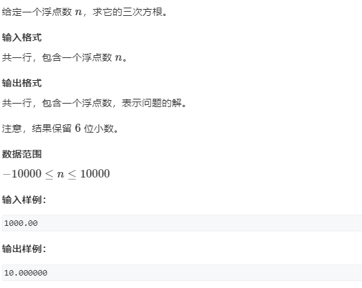

```java
package _01_基础知识._03_二分查找;

import java.io.BufferedReader;
import java.io.BufferedWriter;
import java.io.IOException;
import java.io.InputStreamReader;
import java.io.OutputStreamWriter;
import java.io.PrintWriter;
import java.io.StreamTokenizer;

/*
提交状态: AC
输入
-1000.00
输出
-10.000000
 * */
public class _02_数的三次方根 {
 static BufferedReader br = new BufferedReader(new InputStreamReader(System.in));
 static BufferedWriter bw = new BufferedWriter(new OutputStreamWriter(System.out));
 static StreamTokenizer st = new StreamTokenizer(br);
 static PrintWriter pw = new PrintWriter(bw);

 public static void main(String[] args) {
  pw.printf("%.6f\n", binerySearch_find3Root(nextDouble()));
  pw.flush();
 }

 static double binerySearch_find3Root(double x) {
//  一开始写的是l=-x,但是当x是负数时，l就成正数了，但l是左边界，l应该=-math.abs(x),保证其始终为负
  double l = -Math.abs(x), r = Math.abs(x);// x>1时的x立方根的上域在[-x,x]内，开方越来越大
  if (Math.abs(x) < 1) {l = -1;r = 1;} // 小数的立方根会更大，但不会超过1，因为只有小数才会开方越来越大，立方越来越小
  while (r - l > 1e-8) {
   double mid = l + (r - l) / 2;
   if (mid * mid * mid <= x) l = mid;
   else r = mid;
  }
  return r;
 }

 static double nextDouble() {
  try {
   st.nextToken();
  } catch (IOException e) {
   // TODO 自动生成的 catch 块
   e.printStackTrace();
  }
  return st.nval;
 }

 static int nextInt() {
  try {
   st.nextToken();
  } catch (IOException e) {
   // TODO 自动生成的 catch 块
   e.printStackTrace();
  }
  return (int) st.nval;
 }

 static String nextStr() {
  try {
   st.nextToken();
  } catch (IOException e) {
   // TODO 自动生成的 catch 块
   e.printStackTrace();
  }
  return st.sval;
 }

}

```

#### _03_最佳牛围栏_暴力解_超时

```java
package _01_基础知识._03_二分查找;

import java.io.BufferedReader;
import java.io.BufferedWriter;
import java.io.IOException;
import java.io.InputStreamReader;
import java.io.OutputStreamWriter;
import java.io.PrintWriter;
import java.io.StreamTokenizer;

/*
提交状态: 超时
输入
10 6
6 
4
2
10
3
8
5
9
4
1

输出
6500
 * */
public class _03_最佳牛围栏_暴力 {
 static BufferedReader br = new BufferedReader(new InputStreamReader(System.in));
 static BufferedWriter bw = new BufferedWriter(new OutputStreamWriter(System.out));
 static StreamTokenizer st = new StreamTokenizer(br);
 static PrintWriter pw = new PrintWriter(bw);

 public static void main(String[] args) {
  int N = nextInt(),F=nextInt();
  int[] arr = new int[N+1];
  for(int i=1;i<arr.length;i++) arr[i]=nextInt();
  long max =Long.MIN_VALUE;
  PreFixSum preFixSum = new PreFixSum(arr);
  for (int i = 1; i < arr.length-F; i++) {
   for(int j=i+F-1; j < arr.length; j++) {
    int sum = preFixSum.getSum(i, j);
    int len = j-i+1;
    double k = (int)((sum/(double)len)*1000);
    if(max<k) max=(int) k;
   }
  }
  pw.println(max);
  pw.flush();
 }
 static class PreFixSum{
  int[] prefix;
  public PreFixSum(int origin[]) {
   prefix = new int[origin.length];
   for (int i = 1; i < origin.length; i++) {
    prefix[i]=prefix[i-1]+origin[i];
   }
  }
  public int getSum(int l,int r) {
   return prefix[r]-prefix[l-1];
  }
 }


 static double nextDouble() {
  try {
   st.nextToken();
  } catch (IOException e) {
   // TODO 自动生成的 catch 块
   e.printStackTrace();
  }
  return st.nval;
 }

 static int nextInt() {
  try {
   st.nextToken();
  } catch (IOException e) {
   // TODO 自动生成的 catch 块
   e.printStackTrace();
  }
  return (int) st.nval;
 }

 static String nextStr() {
  try {
   st.nextToken();
  } catch (IOException e) {
   // TODO 自动生成的 catch 块
   e.printStackTrace();
  }
  return st.sval;
 }

}

```

#### _03_最佳牛围栏_二分_AC


```java
package _01_基础知识._03_二分查找;

import java.io.BufferedReader;
import java.io.BufferedWriter;
import java.io.IOException;
import java.io.InputStreamReader;
import java.io.OutputStreamWriter;
import java.io.PrintWriter;
import java.io.StreamTokenizer;

/*
提交状态: 超时
输入
10 6
6 
4
2
10
3
8
5
9
4
1

输出
6500
 * */
public class _03_最佳牛围栏_二分 {
 static BufferedReader br = new BufferedReader(new InputStreamReader(System.in));
 static BufferedWriter bw = new BufferedWriter(new OutputStreamWriter(System.out));
 static StreamTokenizer st = new StreamTokenizer(br);
 static PrintWriter pw = new PrintWriter(bw);

 public static void main(String[] args) {
  int N = nextInt(),F=nextInt();
  int[] arr = new int[N+1];
  for(int i=1;i<arr.length;i++) arr[i]=nextInt();
  
  double l=0,r=2000,mid;
  while (r-l>0.000001) {
   mid=l+(r-l)/2;
   if(check(arr,F,mid)) l=mid;
   else r=mid;
  }
  pw.printf("%d\n",(int)(r*1000));
  pw.flush();
 }


 private static boolean check(int[] arr,int minWindowLen, double mid) {
  double[] prefix = new double[arr.length];
  for (int i = 1; i < arr.length; i++) {
   prefix[i]=prefix[i-1]+arr[i]-mid;
  }
  double min = 0;
  for(int i=1,j=minWindowLen;j<prefix.length;i++,j++) {
   min=Math.min(min, prefix[i-1]);
   if(prefix[j]-min>=0) return true;
  }
  return false;
 }


 static double nextDouble() {
  try {
   st.nextToken();
  } catch (IOException e) {
   // TODO 自动生成的 catch 块
   e.printStackTrace();
  }
  return st.nval;
 }

 static int nextInt() {
  try {
   st.nextToken();
  } catch (IOException e) {
   // TODO 自动生成的 catch 块
   e.printStackTrace();
  }
  return (int) st.nval;
 }

 static String nextStr() {
  try {
   st.nextToken();
  } catch (IOException e) {
   // TODO 自动生成的 catch 块
   e.printStackTrace();
  }
  return st.sval;
 }

}

```

### _06_前缀和与差分

#### _01_前缀和


```java
package _01_基础知识._06_前缀和与差分;


import java.io.BufferedReader;
import java.io.BufferedWriter;
import java.io.IOException;
import java.io.InputStreamReader;
import java.io.OutputStreamWriter;
import java.io.PrintWriter;
import java.io.StreamTokenizer;
/*
提交状态: AC
输入
5 3
2 1 3 6 4
1 2
1 3
2 4
输出
3
6
10
 * */

public class _01_前缀和 {
 static BufferedReader br = new BufferedReader(new InputStreamReader(System.in));
 static BufferedWriter bw = new BufferedWriter(new OutputStreamWriter(System.out));
 static StreamTokenizer st = new StreamTokenizer(br);
 static PrintWriter pw = new PrintWriter(bw);
 public static void main(String[] args) {
  int N = nextInt(),M=nextInt(),l,r,i;
  int arr[] = new int[N+1];
  for (i = 1; i < arr.length; i++) arr[i]=nextInt();
  PreFixSum preFixSum = new PreFixSum();
  preFixSum.load(arr);
  while (M--!=0) {
   l=nextInt();r=nextInt();
   pw.println(preFixSum.getSum(l, r));
  }
  pw.flush();
 }
 static class PreFixSum{
  int[] preFix;
  void load(int[]origin) {
   preFix=new int[origin.length];
   for (int i = 1; i < origin.length; i++) {
    preFix[i]=preFix[i-1]+origin[i];
   }
  }
  int getSum(int left,int right) {
   return preFix[right]-preFix[left-1];
  }
 }
 
 static int nextInt() {
  try {
   st.nextToken();
  } catch (IOException e) {
   // TODO 自动生成的 catch 块
   e.printStackTrace();
  }
  return (int) st.nval;
 }
 static String nextStr() {
  try {
   st.nextToken();
  } catch (IOException e) {
   // TODO 自动生成的 catch 块
   e.printStackTrace();
  }
  return st.sval;
 }
 
}


```

#### _02_差分


```java
package _01_基础知识._06_前缀和与差分;


import java.io.BufferedReader;
import java.io.BufferedWriter;
import java.io.IOException;
import java.io.InputStreamReader;
import java.io.OutputStreamWriter;
import java.io.PrintWriter;
import java.io.StreamTokenizer;
/*
提交状态: AC
输入
6 3
1 2 2 1 2 1
1 3 1
3 5 1
1 6 1
输出
3 4 5 3 4 2
 * */

public class _02_差分 {
 static BufferedReader br = new BufferedReader(new InputStreamReader(System.in));
 static BufferedWriter bw = new BufferedWriter(new OutputStreamWriter(System.out));
 static StreamTokenizer st = new StreamTokenizer(br);
 static PrintWriter pw = new PrintWriter(bw);
 static class DifferArray{
  int[] differ;
  public DifferArray(int[] origin) {
   differ = new int[origin.length+1];
   for (int i = 1; i < origin.length; i++) {
    add(i, i, origin[i]);
   }
  }
  void add(int l,int r,int x) {
   differ[l]+=x;
   differ[r+1]-=x;
  }
  int[] getPreFixSum() {
   int[] prefix = new int[differ.length-1];
   for (int i = 1; i < differ.length-1; i++) {
    prefix[i]=prefix[i-1]+differ[i];
   }
   return prefix;
  }
 }
 public static void main(String[] args) {
  int N = nextInt(),M=nextInt(),l,r,i,w;
  int arr[] = new int[N+1];
  for (i = 1; i < arr.length; i++) arr[i]=nextInt();
  DifferArray differArray = new DifferArray(arr);
  while (M--!=0) {
   l=nextInt();r=nextInt();w=nextInt();
   differArray.add(l, r, w);
  }
  int[] res = differArray.getPreFixSum();
  for (i = 1; i < res.length-1; i++) pw.print(res[i]+" ");
  pw.println(res[i]);
  pw.flush();
 }
 
 static int nextInt() {
  try {
   st.nextToken();
  } catch (IOException e) {
   // TODO 自动生成的 catch 块
   e.printStackTrace();
  }
  return (int) st.nval;
 }
 static String nextStr() {
  try {
   st.nextToken();
  } catch (IOException e) {
   // TODO 自动生成的 catch 块
   e.printStackTrace();
  }
  return st.sval;
 }
 
}


```

#### _03_二维前缀和

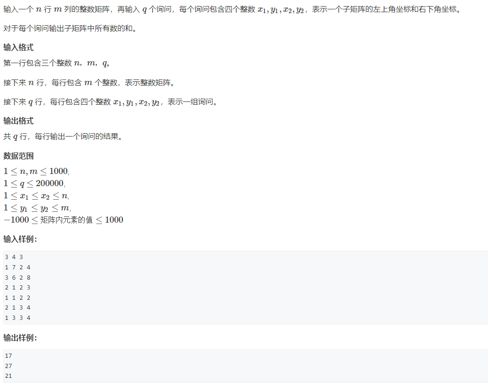

```java
package _01_基础知识._06_前缀和与差分;


import java.io.BufferedReader;
import java.io.BufferedWriter;
import java.io.IOException;
import java.io.InputStreamReader;
import java.io.OutputStreamWriter;
import java.io.PrintWriter;
import java.io.StreamTokenizer;
/*
提交状态: AC
输入
3 4 3
1 7 2 4
3 6 2 8
2 1 2 3
1 1 2 2
2 1 3 4
1 3 3 4
输出
17
27
21
 * */

public class _03_子矩阵的和_二维前缀和 {
 static BufferedReader br = new BufferedReader(new InputStreamReader(System.in));
 static BufferedWriter bw = new BufferedWriter(new OutputStreamWriter(System.out));
 static StreamTokenizer st = new StreamTokenizer(br);
 static PrintWriter pw = new PrintWriter(bw);
 static class PrefixMatrix{
  int[][]prefix;
  public PrefixMatrix() {};
  public PrefixMatrix(int[][] origin) {
   load(origin);
  }
  void load(int[][] origin) {
   prefix = new int[origin.length][origin[0].length];
   for (int i = 1; i < origin.length; i++) {
    for (int j = 1; j < origin[i].length; j++) {
     prefix[i][j]=prefix[i][j-1]+prefix[i-1][j]-prefix[i-1][j-1]+origin[i][j];
    }
   }
  }
  int getSum(int i1,int j1,int i2,int j2) {
   return prefix[i2][j2]-prefix[i2][j1-1]-prefix[i1-1][j2]+prefix[i1-1][j1-1];
  }
 }
 public static void main(String[] args) {
  int N = nextInt(),M=nextInt(),Q=nextInt(),i1,i2,j1,j2;
  int matrix[][] = new int[N+1][M+1];
  PrefixMatrix prefixArray = new PrefixMatrix();
  for (int i = 1; i < matrix.length; i++) {
   for (int j = 1; j < matrix[i].length; j++) {
    matrix[i][j]=nextInt();
   }
  }
  prefixArray.load(matrix);
  while (Q--!=0) {
   i1=nextInt();j1=nextInt();i2=nextInt();j2=nextInt();
   pw.println(prefixArray.getSum(i1, j1, i2, j2));
   
  }
  pw.flush();
 }
 
 static int nextInt() {
  try {
   st.nextToken();
  } catch (IOException e) {
   // TODO 自动生成的 catch 块
   e.printStackTrace();
  }
  return (int) st.nval;
 }
 static String nextStr() {
  try {
   st.nextToken();
  } catch (IOException e) {
   // TODO 自动生成的 catch 块
   e.printStackTrace();
  }
  return st.sval;
 }
 
}
```

#### _04_二维差分


```java
package _01_基础知识._06_前缀和与差分;


import java.io.BufferedReader;
import java.io.BufferedWriter;
import java.io.IOException;
import java.io.InputStreamReader;
import java.io.OutputStreamWriter;
import java.io.PrintWriter;
import java.io.StreamTokenizer;
/*
提交状态: AC
输入
3 4 3
1 7 2 4
3 6 2 8
2 1 2 3
1 1 2 2
2 1 3 4
1 3 3 4
输出
2 3 4 1 
4 3 4 1 
2 2 2 2 
 * */

public class _04_子矩阵的和_二维差分 {
 static BufferedReader br = new BufferedReader(new InputStreamReader(System.in));
 static BufferedWriter bw = new BufferedWriter(new OutputStreamWriter(System.out));
 static StreamTokenizer st = new StreamTokenizer(br);
 static PrintWriter pw = new PrintWriter(bw);
 static class PrefixMatrix{
  int[][]prefix;
  public PrefixMatrix() {};
  public PrefixMatrix(int[][] origin) {
   load(origin);
  }
  void load(int[][] origin) {
   prefix = new int[origin.length][origin[0].length];
   for (int i = 1; i < origin.length; i++) {
    for (int j = 1; j < origin[i].length; j++) {
     prefix[i][j]=prefix[i][j-1]+prefix[i-1][j]-prefix[i-1][j-1]+origin[i][j];
    }
   }
  }
  int getSum(int i1,int j1,int i2,int j2) {
   return prefix[i2][j2]-prefix[i2][j1-1]-prefix[i1-1][j2]+prefix[i1-1][j1-1];
  }
 }
 static class DifferMatrix{
  int[][] differ;
  void load(int[][] origin) {
   differ=new int[origin.length+1][origin[0].length+1];
   for (int i = 1; i < origin.length; i++) {
    for (int j = 1; j < origin[i].length; j++) {
     add(i, j, i, j, origin[i][j]);
    }
   }
  }
  void add(int i1,int j1,int i2,int j2,int x) {
   differ[i1][j1]+=x;
   differ[i1][j2+1]-=x;
   differ[i2+1][j1]-=x;
   differ[i2+1][j2+1]+=x;
  }
  int[][]  toPreFixSum() {
   int[][]prefix = new int[differ.length-1][differ[0].length-1];
   for (int i = 1; i < prefix.length; i++) {
    for (int j = 1; j < prefix[0].length; j++) {
     prefix[i][j]=prefix[i-1][j]+prefix[i][j-1]-prefix[i-1][j-1]+differ[i][j];
    }
   }
   return prefix;
  }
  }
 public static void main(String[] args) {
  int N = nextInt(),M=nextInt(),Q=nextInt(),i1,i2,j1,j2,w;
  int matrix[][] = new int[N+1][M+1];
  DifferMatrix differ= new DifferMatrix();
  for (int i = 1; i < matrix.length; i++) {
   for (int j = 1; j < matrix[i].length; j++) {
    matrix[i][j]=nextInt();
   }
  }
  differ.load(matrix);
  while (Q--!=0) {
   i1=nextInt();j1=nextInt();i2=nextInt();j2=nextInt();w=nextInt();
   differ.add(i1, j1, i2, j2,w);
   
  }
  int[][] res = differ.toPreFixSum();
  for (int i = 1; i < res.length; i++) {
   
   int j;
   for (j = 1; j < res[i].length-1; j++) {
    pw.print(res[i][j]+" ");
   }
   pw.print(res[i][j]);
   if(i<res.length-1) pw.print("\n");
  }
  pw.flush();
 }
 
 static int nextInt() {
  try {
   st.nextToken();
  } catch (IOException e) {
   // TODO 自动生成的 catch 块
   e.printStackTrace();
  }
  return (int) st.nval;
 }
 static String nextStr() {
  try {
   st.nextToken();
  } catch (IOException e) {
   // TODO 自动生成的 catch 块
   e.printStackTrace();
  }
  return st.sval;
 }
 
}


```

### _07_双指针

#### _01_最长不重复连续子序列


```java
package _01_基础知识._07_双指针算法;

import java.io.BufferedReader;
import java.io.BufferedWriter;
import java.io.IOException;
import java.io.InputStreamReader;
import java.io.OutputStreamWriter;
import java.io.PrintWriter;
import java.io.StreamTokenizer;
import java.util.HashSet;
import java.util.LinkedList;
import java.util.Queue;
import java.util.Set;
import java.util.TreeMap;
/*
提交状态: AC
输入
10
9 3 6 9 5 10 1 2 3 9
输出
7
 * */

public class _01_最长连续不重复子序列_集合与队列 {
 public static void main(String[] args) {
  int N =nextInt();
  int arr[]=new int[N];
  int len = 0;
  for (int i = 0; i < arr.length; i++) arr[i]=nextInt();
  Set<Integer> set = new HashSet<>();
  Queue<Integer> queue = new LinkedList<>();
  for (int head = 0,tail=0; tail < arr.length;tail++) {
   if(!set.contains(arr[tail])) {
    set.add(arr[tail]);
    queue.add(tail);
   }
   else {
    while(set.contains(arr[tail])) {
     head = queue.poll();
     set.remove(arr[head]);
    }
    head+=1;
    set.add(arr[tail]);
    queue.add(tail);
   }
   len=Math.max(len, tail-head+1);
  }
  pw.print(len);
  pw.flush();
 }
 
 
 
 
 
 
 
 
 static BufferedReader br = new BufferedReader(new InputStreamReader(System.in));
 static BufferedWriter bw = new BufferedWriter(new OutputStreamWriter(System.out));
 static StreamTokenizer st = new StreamTokenizer(br);
 static PrintWriter pw = new PrintWriter(bw);
 static int nextInt() {
  try {
   st.nextToken();
  } catch (IOException e) {
   // TODO 自动生成的 catch 块
   e.printStackTrace();
  }
  return (int) st.nval;
 }
 static String nextStr() {
  try {
   st.nextToken();
  } catch (IOException e) {
   // TODO 自动生成的 catch 块
   e.printStackTrace();
  }
  return st.sval;
 }
}
```

#### _02_数组元素目标和

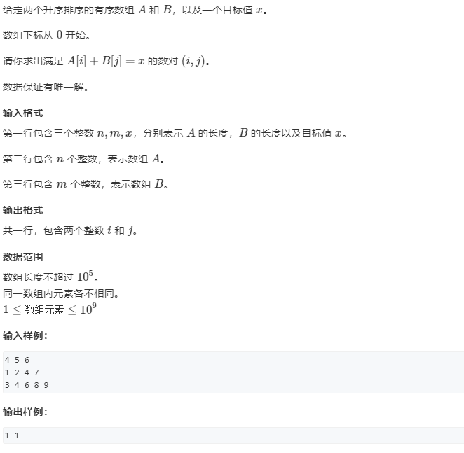

```java
package _01_基础知识._07_双指针算法;
/*
提交状态: AC
输入
4 5 6
1 2 4 7
3 4 6 8 9
输出
1 1
 * */
import java.io.BufferedReader;
import java.io.BufferedWriter;
import java.io.IOException;
import java.io.InputStreamReader;
import java.io.OutputStreamWriter;
import java.io.PrintWriter;
import java.io.StreamTokenizer;

public class _02_数组元素的目标和 {
 static BufferedReader br = new BufferedReader(new InputStreamReader(System.in));
 static BufferedWriter bw = new BufferedWriter(new OutputStreamWriter(System.out));
 static StreamTokenizer st = new StreamTokenizer(br);
 static PrintWriter pw = new PrintWriter(bw);
 public static void main(String[] args) {
  int n1 =nextInt(),n2=nextInt(),target=nextInt();
  int[] arr1=new int[n1];
  int[] arr2=new int[n2];
  for(int i=0;i<n1;i++) arr1[i]=nextInt();
  for(int i=0;i<n2;i++) arr2[i]=nextInt();
  int i=0,j=n2-1;
  while(arr1[i]+arr2[j]!=target) {
   while(arr1[i]+arr2[j]>target && j>=1) j--;
   while(arr1[i]+arr2[j]<target && i<=arr1.length-2) i++;
  }
  pw.print(i+" "+j);
  pw.flush();
 }
 static int nextInt() {
  try {
   st.nextToken();
  } catch (IOException e) {
   // TODO 自动生成的 catch 块
   e.printStackTrace();
  }
  return (int) st.nval;
 }
 static String nextStr() {
  try {
   st.nextToken();
  } catch (IOException e) {
   // TODO 自动生成的 catch 块
   e.printStackTrace();
  }
  return st.sval;
 }
}
```

### _08_位运算

#### _01_二进制中一的个数

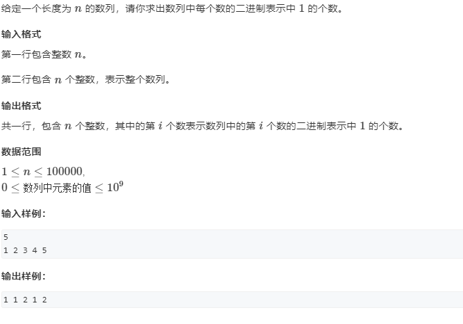

```java
package _01_基础知识._08_位运算;
/*
提交状态: AC
输入
5
1 2 3 4 5
输出
1 1 2 1 2
 * */
import java.io.BufferedReader;
import java.io.BufferedWriter;
import java.io.IOException;
import java.io.InputStreamReader;
import java.io.OutputStreamWriter;
import java.io.PrintWriter;
import java.io.StreamTokenizer;

public class _01_二进制中一的个数 {
 static boolean lowBit(long x,int k) {
  return ((x>>k)&1)==1;
 }
 static int bineryCnt(long x) {
  int res=0;
  for(int i=0;i<64;i++) 
   if(lowBit(x, i)) res++;
  return res;
 }
 public static void main(String[] args) {
  long n = nextInt();
  for(int i=0;i<n;i++) {
   if(i!=0) pw.print(" ");
   pw.print(bineryCnt(nextInt()));
  }
  pw.flush();
 }
 static BufferedReader br = new BufferedReader(new InputStreamReader(System.in));
 static BufferedWriter bw = new BufferedWriter(new OutputStreamWriter(System.out));
 static StreamTokenizer st = new StreamTokenizer(br);
 static PrintWriter pw = new PrintWriter(bw);
 static int nextInt() {
  try {
   st.nextToken();
  } catch (IOException e) {
   // TODO 自动生成的 catch 块
   e.printStackTrace();
  }
  return (int) st.nval;
 }
 static String nextStr() {
  try {
   st.nextToken();
  } catch (IOException e) {
   // TODO 自动生成的 catch 块
   e.printStackTrace();
  }
  return st.sval;
 }
}

```

#### _02_64位整数乘法


```java
package _01_基础知识._08_位运算;
/*
提交状态: AC
输入
250182048980811753
413715569939057660
133223633696258584
输出
19308689043391716

 * */
import java.io.BufferedReader;
import java.io.BufferedWriter;
import java.io.IOException;
import java.io.InputStreamReader;
import java.io.OutputStreamWriter;
import java.io.PrintWriter;
import java.io.StreamTokenizer;

public class _02_64位整数乘法 {
 public static void main(String[] args) {
  long a = nextLong();// 注意输入long似乎无法用streamTrokenizer
  long b = nextLong();
  long MOD = nextLong();
  long res=0;
  long t = a;
  long k = b;
  while(0<k) {
   if((k&1)==1) res=(res+t)%MOD;
   t=(2*t)%MOD;
   k>>=1;
  }
  pw.print(res);
  pw.flush();
 }
 static BufferedReader br = new BufferedReader(new InputStreamReader(System.in));
 static BufferedWriter bw = new BufferedWriter(new OutputStreamWriter(System.out));
 static StreamTokenizer st = new StreamTokenizer(br);
 static PrintWriter pw = new PrintWriter(bw);
 static long nextLong() {
   try {
    return Long.parseLong(br.readLine());
   } catch (NumberFormatException e) {
    // TODO 自动生成的 catch 块
    e.printStackTrace();
   } catch (IOException e) {
    // TODO 自动生成的 catch 块
    e.printStackTrace();
   }
   return 0;
 }
 static String nextStr() {
  try {
   st.nextToken();
  } catch (IOException e) {
   // TODO 自动生成的 catch 块
   e.printStackTrace();
  }
  return st.sval;
 }
}

```

### _09_离散化

#### _01_离散化


```java
package _01_基础知识._09_离散化;
/*
提交状态: AC
输入
3 3
1 2
3 6
7 5
1 3
4 6
7 8
输出
8
0
5
输入
10 5
-50 9524
-19 -5705
33 1729
-8 -9723
-33 -5185
-29 7088
19 -4988
-37 985
-29 8888
-46 -5976
19 29
38 42
-17 24
25 49
9 24
输出
-4988
0
-14711
1729
-4988
 * */
import java.io.BufferedReader;
import java.io.BufferedWriter;
import java.io.IOException;
import java.io.InputStreamReader;
import java.io.OutputStreamWriter;
import java.io.PrintWriter;
import java.io.StreamTokenizer;
import java.util.Arrays;
import java.util.LinkedList;
import java.util.Queue;

public class _01_离散化 {
// 求离散化后的实际位置
 static int bsearch(Integer[] arr,int x) {
  int l=0,r=arr.length-1,mid;
  while(l<r) {
   mid=l+(r-l)/2;
   if(x<=arr[mid])r=mid;
   else l=mid+1;
  }
  return l+1;// 因为要计算前缀和，映射到[1,n]的范围
 }
 public static void main(String[] args) throws IOException {
  int N = nextInt(),M=nextInt();
  LinkedList<Integer> all = new LinkedList<>();// 收集所有要用的坐标，包括插入坐标和询问坐标
  LinkedList<Integer> pos = new LinkedList<>();// 收集插入的位置
  LinkedList<Integer> add = new LinkedList<>();// 收集插入的值
  Queue<Integer> que = new LinkedList<>();// 收集询问的位置，注意收集的顺序和要求结果的顺序
  for(int i=0;i<N;i++){
   int p = nextInt(),num=nextInt();
   all.add(p);
   pos.push(p);
   add.push(num);
  }
  
  for (int i = 0; i < M; i++) {
   int l = nextInt(),r = nextInt();
   all.add(l);
   all.add(r);
   que.offer(l);
   que.offer(r);
  }
  
  // 离散化，需要排序和去重
  Integer[] idxMap = new Integer[all.size()]; 
  idxMap = all.toArray(idxMap);
  Arrays.sort(idxMap);// 排序
  LinkedList<Integer> temp= new LinkedList<>();
  for(int i=0;i<idxMap.length;i++)
  {
   if(i==0||idxMap[i]!=idxMap[i-1]) {// 去重
    temp.add(idxMap[i]);
   }
  }
  idxMap=new Integer[temp.size()];
  idxMap=temp.toArray(idxMap);
  
  int[] data = new int[idxMap.length+1];
  while (!pos.isEmpty()) {
   int idx =pos.pop();
   int val = add.pop();
   int realidx = bsearch(idxMap, idx);
   data[realidx]+=val;
  }
  int[] prefix = new int[data.length];
  for (int i = 1; i < data.length; i++) 
   prefix[i]=prefix[i-1]+data[i];
  while (!que.isEmpty()) {
   int l = bsearch(idxMap, que.poll());
   int r = bsearch(idxMap, que.poll());
   pw.println(prefix[r]-prefix[l-1]);
  }
  
  pw.flush();
 }
 static BufferedReader br = new BufferedReader(new InputStreamReader(System.in));
 static BufferedWriter bw = new BufferedWriter(new OutputStreamWriter(System.out));
 static StreamTokenizer st = new StreamTokenizer(br);
 static PrintWriter pw = new PrintWriter(bw);
 static int nextInt() {
  try {
   st.nextToken();
  } catch (IOException e) {
   // TODO 自动生成的 catch 块
   e.printStackTrace();
  }
  return (int) st.nval;
 }
 static String nextStr() {
  try {
   st.nextToken();
  } catch (IOException e) {
   // TODO 自动生成的 catch 块
   e.printStackTrace();
  }
  return st.sval;
 }
}

```

### _10_区间合并

#### _1_区间合并


```java
package _01_基础知识._10_区间合并;

import java.io.BufferedReader;
import java.io.BufferedWriter;
import java.io.IOException;
import java.io.InputStreamReader;
import java.io.OutputStreamWriter;
import java.io.PrintWriter;
import java.io.StreamTokenizer;
import java.util.LinkedList;
/*
提交状态: AC
输入
5
1 2
2 4
5 6
7 8
7 9
输出
3
 * */
public class _01_区间合并 {
 public static void main(String[] args) {
  int N =nextInt();
  LinkedList<Range> ranges =new LinkedList<>();
  LinkedList<Range> res=new LinkedList<>();
  for (int i = 0; i < N; i++) 
   ranges.add(new Range(nextInt(), nextInt()));
  ranges.sort((a1,a2)->a1.left-a2.left);
  while (!ranges.isEmpty()) {
   Range cur = ranges.poll();
   while (!ranges.isEmpty()&&  ranges.getFirst().left<=cur.right) {
    Range after = ranges.poll();
    if(cur.right< after.right) cur.right=after.right;
   }
   res.add(cur);
  }
  pw.println(res.size());
  pw.flush();
 }
 static class Range{
  int left,right;
  public Range(int left, int right) {
   this.left = left;
   this.right = right;
  }
 }
 static BufferedReader br =new BufferedReader(new InputStreamReader(System.in));
 static BufferedWriter bw =new BufferedWriter(new OutputStreamWriter(System.out));
 static StreamTokenizer st = new StreamTokenizer(br);
 static PrintWriter pw =new PrintWriter(bw);
 static int nextInt() {
  try {
   st.nextToken();
  } catch (IOException e) {
   // TODO 自动生成的 catch 块
   e.printStackTrace();
  }
  return (int) st.nval;
 }
 static String nextStr() {
  try {
   st.nextToken();
  } catch (IOException e) {
   // TODO 自动生成的 catch 块
   e.printStackTrace();
  }
  return st.sval;
 }
}
```

## _03_数据结构

### _01_单链表


```java
package _03_数据结构;

import java.io.BufferedReader;
import java.io.BufferedWriter;
import java.io.IOException;
import java.io.InputStreamReader;
import java.io.OutputStreamWriter;
import java.io.PrintWriter;
import java.io.StreamTokenizer;
/*
提交状态: AC
输入
10
H 9
I 1 1
D 1
D 0
H 6
I 3 6
I 4 5
I 4 5
I 3 4
D 6
输出
6 4 6 5
 * */
public class _01_单链表 {
 private static int N,NULL=0;
 private static int datas[];
 private static int nexts[];
 private static int idx;
 static void init(int n) {
  N=n;
  datas = new int[N];
  nexts = new int[N];
  nexts[0]=NULL;// 0号节点作为头节点
  idx=1;// 地址从1开始，0号地址作为空指针，否则需要使用-1作为头指针
 }
 // 插入到头部一个数x
 static void insertToHead(int x) {
  datas[idx]=x;
  nexts[idx]=nexts[0];
  nexts[0]=idx++;
 }
 // 在第k个插入的数后插入一个数。
 static void insertAfterK(int k,int x) {
  datas[idx]=x;
  nexts[idx]=nexts[k];
  nexts[k]=idx++;
 }
// 删除第k个插入的数后面的数(由于头指针放在0号节点，所以删除第0个插入的数就是删除节点)
 static void removeAfterK(int k) {
  nexts[k]=nexts[nexts[k]];
//  nexts[0]=nexts[nexts[0]]; k==0时，支持删除头节点
 }
 public static void main(String[] args) throws IOException {
  init(1000000);
  int M =Integer.parseInt(br.readLine());
  while (M--!=0) {
   String[] in= br.readLine().split(" ");
   if("H".equals(in[0])) {
//    插入到头部一个数x
    int x = Integer.parseInt(in[1]);
    insertToHead(x);
   }else if ("I".equals(in[0])) {
//    在第k个插入的数后插入一个数。
    int k = Integer.parseInt(in[1]);
    int x = Integer.parseInt(in[2]);
    insertAfterK(k, x);
   }else if("D".equals(in[0])) {
//    删除第k个插入的数后面的数
    int k = Integer.parseInt(in[1]);
    removeAfterK(k);
   }
  }
  for(int p=nexts[0];p!=NULL;p=nexts[p]) {
   pw.print(datas[p]+" ");
  }
  pw.flush();
 }

 static BufferedReader br =new BufferedReader(new InputStreamReader(System.in));
 static BufferedWriter bw =new BufferedWriter(new OutputStreamWriter(System.out));
 static StreamTokenizer st = new StreamTokenizer(br);
 static PrintWriter pw =new PrintWriter(bw);

 static int nextInt() {
  try {
   st.nextToken();
  } catch (IOException e) {
   // TODO 自动生成的 catch 块
   e.printStackTrace();
  }
  return (int) st.nval;
 }
 static String nextStr() {
  try {
   st.nextToken();
  } catch (IOException e) {
   // TODO 自动生成的 catch 块
   e.printStackTrace();
  }
  return st.sval;
 }
}

```

### _02_双链表


```java
package _03_数据结构;

import java.io.BufferedReader;
import java.io.BufferedWriter;
import java.io.IOException;
import java.io.InputStreamReader;
import java.io.OutputStreamWriter;
import java.io.PrintWriter;
import java.io.StreamTokenizer;
/*
提交状态: AC
输入
10
R 7
D 1
L 3
IL 2 10
D 3
IL 2 7
L 8
R 9
IL 4 7
IR 2 2
输出
8 7 7 3 2 9
 * */
public class _02_双链表 {
 private static int N,NULL=0,HEAD=0,TAIL=1;
 private static int datas[];
 private static int after[],before[];
 private static int idx;
 static void init(int n) {
  N=n;
  datas = new int[N];
  after = new int[N];
  before= new int[N];
  after[HEAD]=TAIL;// 0号节点作为头节点，其后驱指向尾节点
  before[TAIL]=HEAD;// 1号节点作为尾节点，其前驱指向头节点
  idx=2;// 地址从2开始，0号地址作为空地址，0号节点作为头节点，1号节点作为尾节点
 }
 // 在第k个节点之后插入一个数。
 static void insertAfterK(int k,int x) {
  datas[idx]=x;
  after[idx]=after[k];// 当前节点的后继为k的后继
  before[idx]=k;// 当前节点的前驱为k
  
  before[after[k]]=idx;// k号节点的后继的前驱修改为当前节点
  after[k]=idx++;// k号节点的后继修改为当前节点。
 }
 // 在第k个节点之前插入一个数。
 static void insertBeforeK(int k,int x) {
  insertAfterK(before[k], x);
 }
 // 插入一个数x到头部
 static void insertToHead(int x) {
  insertAfterK(0, x);
 }
 // 插入一个数x到尾部部
 static void insertToTail(int x) {
  insertBeforeK(1, x);
 }
// 删除第k个节点,k是从2开始编号的
 static void removeK(int k) {
  after[before[k]]=after[k];
  before[after[k]]=before[k];
 }
 public static void main(String[] args) throws IOException {
  init(1000000);
  int M =Integer.parseInt(br.readLine());
  while (M--!=0) {
   String[] in= br.readLine().split(" ");
   if("L".equals(in[0])) {
//    插入到头部一个数x
    int x = Integer.parseInt(in[1]);
    insertToHead(x);
   }else if ("R".equals(in[0])) {
//    插入到尾部一个数x
    int x = Integer.parseInt(in[1]);
    insertToTail(x);
   }else if("D".equals(in[0])) {
//    删除第k个插入的数后面的数
    int k = Integer.parseInt(in[1]);
//     由于地址0、1以被头节点和尾节点占用,地址从2开始编址，所以第k个插入的节点一定是第k+1号节点
    removeK(k+1);
   }else if("IL".equals(in[0])) {
//    在第k个插入的数左侧插入一个数。
    int k = Integer.parseInt(in[1]);
    int x = Integer.parseInt(in[2]);
    insertBeforeK(k+1, x);
   }else if("IR".equals(in[0])) {
//    在第k个插入的数右侧插入一个数。
    int k = Integer.parseInt(in[1]);
    int x = Integer.parseInt(in[2]);
    insertAfterK(k+1, x);
   }
  }
  for(int p=after[HEAD];p!=TAIL;p=after[p]) {
   pw.print(datas[p]+" ");
  }
  pw.flush();
 }

 static BufferedReader br =new BufferedReader(new InputStreamReader(System.in));
 static BufferedWriter bw =new BufferedWriter(new OutputStreamWriter(System.out));
 static StreamTokenizer st = new StreamTokenizer(br);
 static PrintWriter pw =new PrintWriter(bw);

 static int nextInt() {
  try {
   st.nextToken();
  } catch (IOException e) {
   // TODO 自动生成的 catch 块
   e.printStackTrace();
  }
  return (int) st.nval;
 }
 static String nextStr() {
  try {
   st.nextToken();
  } catch (IOException e) {
   // TODO 自动生成的 catch 块
   e.printStackTrace();
  }
  return st.sval;
 }
}

```

### _03_栈


```java
package _03_数据结构;

import java.io.BufferedReader;
import java.io.BufferedWriter;
import java.io.IOException;
import java.io.InputStreamReader;
import java.io.OutputStreamWriter;
import java.io.PrintWriter;
import java.io.StreamTokenizer;
/*
提交状态: AC
输入
10
push 5
query
push 6
pop
query
pop
empty
push 4
query
empty
输出
5
5
YES
4
NO
 * */
public class _03_栈 {
 private static int stack[],top,MAX_SIXE;
 static void init(int size) {
  MAX_SIXE=size;
  stack = new int[MAX_SIXE];
  top=-1;
 }
 static void push(int x) {
  stack[++top]=x;
 }
 static int getTop() {
  return stack[top];
 }
 static int pop() {
  return stack[top--];
 }
 static boolean isEmpty() {
  return top==-1;
 }
 static boolean isFull() {
  return top==MAX_SIXE-1;
 }

 public static void main(String[] args) throws IOException {
  init(1000000);
  int M =Integer.parseInt(br.readLine());
  while (M--!=0) {
   String[] in= br.readLine().split(" ");
   if("push".equals(in[0])) {
    int x = Integer.parseInt(in[1]);
    push(x);
   }else if ("pop".equals(in[0])) {
    pop();
   }else if("empty".equals(in[0])) {
    pw.println(isEmpty()?"YES":"NO");
   }else if("query".equals(in[0])) {
    pw.println(getTop());
   }
  }
  pw.flush();
 }

 static BufferedReader br =new BufferedReader(new InputStreamReader(System.in));
 static BufferedWriter bw =new BufferedWriter(new OutputStreamWriter(System.out));
 static StreamTokenizer st = new StreamTokenizer(br);
 static PrintWriter pw =new PrintWriter(bw);

 static int nextInt() {
  try {
   st.nextToken();
  } catch (IOException e) {
   // TODO 自动生成的 catch 块
   e.printStackTrace();
  }
  return (int) st.nval;
 }
 static String nextStr() {
  try {
   st.nextToken();
  } catch (IOException e) {
   // TODO 自动生成的 catch 块
   e.printStackTrace();
  }
  return st.sval;
 }
}

```

### _04_队列

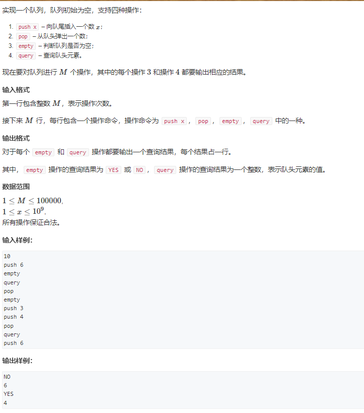

```java
package _03_数据结构;

import java.io.BufferedReader;
import java.io.BufferedWriter;
import java.io.IOException;
import java.io.InputStreamReader;
import java.io.OutputStreamWriter;
import java.io.PrintWriter;
import java.io.StreamTokenizer;
/*
提交状态: AC
输入
10
push 6
empty
query
pop
empty
push 3
push 4
pop
query
push 6
输出
NO
6
YES
4
 * */
public class _04_队列 {
 private static int queue[],head,tail,size,MAX_SIXE;
 static void init(int capacity) {
  MAX_SIXE=capacity;
  queue = new int[MAX_SIXE];
  head=0;tail=0;size=0;
 }
 static void Enqueue(int x) {
  queue[tail]=x;
  tail=++tail%MAX_SIXE;
  size++;
 }
 static int Dequeue() {
  int t = queue[head];
  head=++head%MAX_SIXE;
  size--;
  return t;
 }
 static int getFront() {
  return queue[head];
 }
 static boolean isEmpty() {
  return size==0;
 }
 static boolean isFull() {
  return size==MAX_SIXE;
 }

 public static void main(String[] args) throws IOException {
  init(1000000);
  int M =Integer.parseInt(br.readLine());
  while (M--!=0) {
   String[] in= br.readLine().split(" ");
   if("push".equals(in[0])) {
    int x = Integer.parseInt(in[1]);
    Enqueue(x);
   }else if ("pop".equals(in[0])) {
    Dequeue();
   }else if("empty".equals(in[0])) {
    pw.println(isEmpty()?"YES":"NO");
   }else if("query".equals(in[0])) {
    pw.println(getFront());
   }
  }
  pw.flush();
 }

 static BufferedReader br =new BufferedReader(new InputStreamReader(System.in));
 static BufferedWriter bw =new BufferedWriter(new OutputStreamWriter(System.out));
 static StreamTokenizer st = new StreamTokenizer(br);
 static PrintWriter pw =new PrintWriter(bw);

 static int nextInt() {
  try {
   st.nextToken();
  } catch (IOException e) {
   // TODO 自动生成的 catch 块
   e.printStackTrace();
  }
  return (int) st.nval;
 }
 static String nextStr() {
  try {
   st.nextToken();
  } catch (IOException e) {
   // TODO 自动生成的 catch 块
   e.printStackTrace();
  }
  return st.sval;
 }
}

```

### _05_单调栈

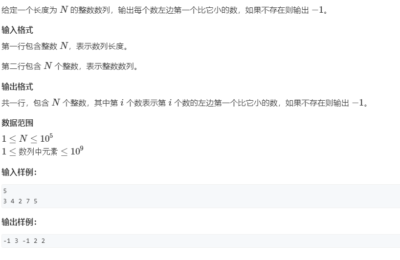

```java
package _03_数据结构;

import java.io.BufferedReader;
import java.io.BufferedWriter;
import java.io.IOException;
import java.io.InputStreamReader;
import java.io.OutputStreamWriter;
import java.io.PrintWriter;
import java.io.StreamTokenizer;
/*
提交状态: AC
输入
5
3 4 2 7 5
输出
-1 3 -1 2 2
 * */
public class _05_单调栈 {
 private static int stack[],top,MAX_SIZE;
 static void init(int capacity) {
  MAX_SIZE=capacity;
  stack=new int[MAX_SIZE];
  top=-1;
 }
 static void clear() {
  top=-1;
 }
 static void push(int x) {
  stack[++top]=x;
 }
 static int pop() {
  return stack[top--];
 }
 static int getTop() {
  return stack[top];
 }
 static boolean isEmpty() {
  return top==-1;
 }
 static boolean isFull() {
  return top==MAX_SIZE-1;
 }
 static int[] getLeftMax(int[] arr) {
  clear();
  int[] res = new int[arr.length];
  for(int i=0;i<arr.length;i++) {
   while(!isEmpty() && arr[getTop()]<=arr[i]) pop();// 拿出所有比当前数小的数
   if(!isEmpty()) res[i]=pop();// 栈顶元素就是当前数的左边离自己最近的比自己大的数
   else res[i]=-1;// 存的是坐标，不存在则用-1表示
   push(i);// 存入当前坐标
  }
  return res;
 }
 static int[] getLeftMin(int[] arr) {
  clear();
  int[] res = new int[arr.length];
  for (int i = 0; i < arr.length; i++) {
   while(!isEmpty()&&arr[getTop()]>=arr[i]) pop();
   if(!isEmpty()) res[i]=getTop();
   else res[i]=-1;
   push(i);
  }
  return res;
 }
 public static void main(String[] args) throws IOException {
  int N =nextInt();
  init(N);
  int[] arr = new int[N];
  for (int i = 0; i < arr.length; i++) arr[i]=nextInt();
  int[] res = getLeftMin(arr);
  for (int i = 0; i < res.length; i++) {
   if(i!=0) pw.print(" ");
   if(res[i]!=-1) pw.print(arr[res[i]]);
   else pw.print(-1);
  }
  pw.flush();
 }

 static BufferedReader br =new BufferedReader(new InputStreamReader(System.in));
 static BufferedWriter bw =new BufferedWriter(new OutputStreamWriter(System.out));
 static StreamTokenizer st = new StreamTokenizer(br);
 static PrintWriter pw =new PrintWriter(bw);

 static int nextInt() {
  try {
   st.nextToken();
  } catch (IOException e) {
   // TODO 自动生成的 catch 块
   e.printStackTrace();
  }
  return (int) st.nval;
 }
 static String nextStr() {
  try {
   st.nextToken();
  } catch (IOException e) {
   // TODO 自动生成的 catch 块
   e.printStackTrace();
  }
  return st.sval;
 }
}

```

### _06_单调队列


```java
package _03_数据结构;

import java.io.BufferedReader;
import java.io.BufferedWriter;
import java.io.IOException;
import java.io.InputStreamReader;
import java.io.OutputStreamWriter;
import java.io.PrintWriter;
import java.io.StreamTokenizer;
/*
提交状态: AC
输入
8 3
1 3 -1 -3 5 3 6 7
输出
-1 -3 -3 -3 3 3
3 3 5 5 6 7
 * */
public class _06_单调队列 {
 private static int queue[],head,tail,size,MAX_SIZE;
 static void init(int capacity) {
  MAX_SIZE=capacity;
  queue=new int[MAX_SIZE];
  head=0;tail=0;size=0;
 }
 static void clear() {
  head=0;tail=0;size=0;
 }
 static void EnQueue(int x) {
  queue[tail]=x;
  tail=++tail%MAX_SIZE;
  size++;
 }
 static int DeQueue() {
  int t = queue[head];
  head=++head%MAX_SIZE;
  size--;
  return t;
 }
 static int Dequeue_tail() {
  tail=(tail-1+MAX_SIZE)%MAX_SIZE;
  int t = queue[tail];
  size--;
  return t;
 }
 static int getHead() {
  return queue[head];
 }
 static int getTail() { // 注意获取tail的写法，不要写成queue[tail]
  return queue[(tail-1+MAX_SIZE)%MAX_SIZE];
 }
 static boolean isEmpty() {
  return size==0;
 }
 static boolean isFull() {
  return size==MAX_SIZE;
 }
 static int[] getWindowMin(int[] arr,int winSize) {
  clear();
  int[] res = new int[arr.length];
  for(int i=0;i<arr.length;i++) {
   while(!isEmpty() && arr[getTail()]>=arr[i]) Dequeue_tail();// 保持单调性
   while(!isEmpty() && getHead()<=i-winSize) DeQueue();// 维持窗口大小
   EnQueue(i);
   res[i]=arr[getHead()];
  }
  return res;
 }
 static int[] getWindowMax(int[] arr,int winSize) {
  clear();
  int[] res = new int[arr.length];
  for (int i = 0; i < res.length; i++) {
   while(!isEmpty()&&arr[getTail()]<=arr[i]) Dequeue_tail();
   while(!isEmpty()&&getHead()<=i-winSize) DeQueue();
   EnQueue(i);
   res[i]=arr[getHead()];
  }
  return res;
 }
 public static void main(String[] args) throws IOException {
  int N =nextInt(),K=nextInt();
  init(N);
  int[] arr = new int[N];
  for (int i = 0; i < arr.length; i++) arr[i]=nextInt();
  int[] resMin = getWindowMin(arr,K);
  for (int i = K-1; i < resMin.length; i++) {
   if(i!=K-1) pw.print(" ");
   pw.print(resMin[i]);
  }
  pw.println("");
  int[] resMax= getWindowMax(arr, K);
  for (int i = K-1; i < resMax.length; i++) {
   if(i!=K-1) pw.print(" ");
   pw.print(resMax[i]);
  }
  pw.flush();
 }

 static BufferedReader br =new BufferedReader(new InputStreamReader(System.in));
 static BufferedWriter bw =new BufferedWriter(new OutputStreamWriter(System.out));
 static StreamTokenizer st = new StreamTokenizer(br);
 static PrintWriter pw =new PrintWriter(bw);

 static int nextInt() {
  try {
   st.nextToken();
  } catch (IOException e) {
   // TODO 自动生成的 catch 块
   e.printStackTrace();
  }
  return (int) st.nval;
 }
 static String nextStr() {
  try {
   st.nextToken();
  } catch (IOException e) {
   // TODO 自动生成的 catch 块
   e.printStackTrace();
  }
  return st.sval;
 }
}

```

### _07_KMP


```java
package _03_数据结构;

import java.io.BufferedReader;
import java.io.BufferedWriter;
import java.io.IOException;
import java.io.InputStreamReader;
import java.io.OutputStreamWriter;
import java.io.PrintWriter;
import java.io.StreamTokenizer;
import java.util.ArrayList;
/*
提交状态: AC
输入
3
aba
5
ababa
输出
0 2
 * */
public class _07_KMP {
 static ArrayList<Integer> res = new ArrayList<>();
 static int KMP(char[] str1,char[] str2) {
  int[] next = getNextArray(str2);
  int p1=0,p2=0;
  while(p1<str1.length&&p2<str2.length) {
   if(str1[p1]==str2[p2]) {
    p1++;
    p2++;
   }else if(next[p2]!=-1) {
    p2=next[p2];
   }else {
    p1++;
   }
   if(p2==str2.length) {
    res.add(p1-p2);
    pw.print((p1-p2)+" ");
    p1-=1;
    p2=next[p2-1];
   }
  }
  return p2==str2.length?p1-p2:-1;
 }
 static int[] getNextArray(char[] str) {
  if(str.length<=2) return new int[] {-1,0};
  int[] next =new int[str.length];
  next[0]=-1;next[1]=0;
  for(int i=2;i<next.length;i++) {
   for (int len = next[i-1]; len >=0 ; len=next[len]) {
    if(str[len]==str[i-1]) {
     next[i]=len+1;
     break;
    }
   }
  }
  return next;
 }
 public static void main(String[] args) throws IOException {
  int n1=Integer.parseInt(br.readLine());
  char[] ch1= new char[n1];
  br.read(ch1);br.readLine();
  int n2=Integer.parseInt(br.readLine());
  char[] ch2= new char[n2];
  br.read(ch2);br.readLine();
  KMP(ch2, ch1);
//  for (int i = 0; i < res.size(); i++) {
//   if(i!=0) pw.print(" ");
//   pw.print(res.get(i));
//  }
  pw.flush();
 }
 static BufferedReader br =new BufferedReader(new InputStreamReader(System.in));
 static BufferedWriter bw =new BufferedWriter(new OutputStreamWriter(System.out));
 static StreamTokenizer st = new StreamTokenizer(br);
 static PrintWriter pw =new PrintWriter(bw);

 static int nextInt() {
  try {
   st.nextToken();
  } catch (IOException e) {
   // TODO 自动生成的 catch 块
   e.printStackTrace();
  }
  return (int) st.nval;
 }
 static String nextStr() {
  try {
   st.nextToken();
  } catch (IOException e) {
   // TODO 自动生成的 catch 块
   e.printStackTrace();
  }
  return st.sval;
 }
}
```

### _08_Trie

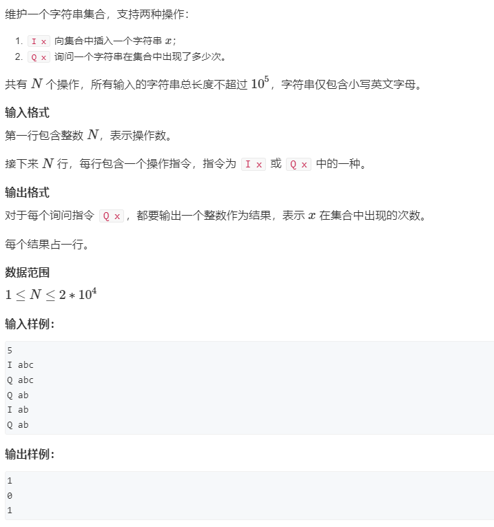

```java
package _03_数据结构;

import java.io.BufferedReader;
import java.io.BufferedWriter;
import java.io.IOException;
import java.io.InputStreamReader;
import java.io.OutputStreamWriter;
import java.io.PrintWriter;
import java.io.StreamTokenizer;
/*
提交状态: AC
输入
5
I abc
Q abc
Q ab
I ab
Q ab
输出
1
0
1
 * */
public class _08_Trie {
 static class Trie{
  int pass,end;
  Trie nexts[]=new Trie[26];
   void insert(char[] str){
    Trie cur=this;
    cur.pass++;
    for(int i=0;i<str.length;i++) {
     int direction = str[i]-'a';
     if(cur.nexts[direction]==null) cur.nexts[direction]=new Trie();
     cur=cur.nexts[direction];
     cur.pass++;
    }
    cur.end++;
  }
   int query(char[] str) {
    Trie cur = this;
    if(cur.pass<=0) return 0;
    for (int i = 0; i < str.length; i++) {
     int dir = str[i]-'a';
    if(cur.nexts[dir]==null || cur.nexts[dir].pass<=0)return 0;
    cur=cur.nexts[dir];
   }
   return cur.end;
   }
   void remove(char[] str) {
    Trie cur = this;
    cur.pass--;
    for (int i = 0; i < str.length; i++) {
     int dir = str[i]-'a';
    cur=cur.nexts[dir];
    cur.pass--;
   }
    cur.end--;
   }
 }
 public static void main(String[] args) throws NumberFormatException, IOException  {
  Trie trie = new Trie();
  int N = Integer.parseInt(br.readLine());
  
  while(N--!=0) {
   String[] ops = br.readLine().split(" ");
   if("I".equals(ops[0])) {
    String x= ops[1];
    trie.insert(x.toCharArray());
    
   }else if("Q".equals(ops[0])) {
    String x= ops[1];
    pw.println(trie.query(x.toCharArray()));
   }
  }
  pw.flush();
 }
 static BufferedReader br =new BufferedReader(new InputStreamReader(System.in));
 static BufferedWriter bw =new BufferedWriter(new OutputStreamWriter(System.out));
 static StreamTokenizer st = new StreamTokenizer(br);
 static PrintWriter pw =new PrintWriter(bw);

 static int nextInt() {
  try {
   st.nextToken();
  } catch (IOException e) {
   // TODO 自动生成的 catch 块
   e.printStackTrace();
  }
  return (int) st.nval;
 }
 static String nextStr() {
  try {
   st.nextToken();
  } catch (IOException e) {
   // TODO 自动生成的 catch 块
   e.printStackTrace();
  }
  return st.sval;
 }
}

```

### _09_并查集

#### _01_并查集

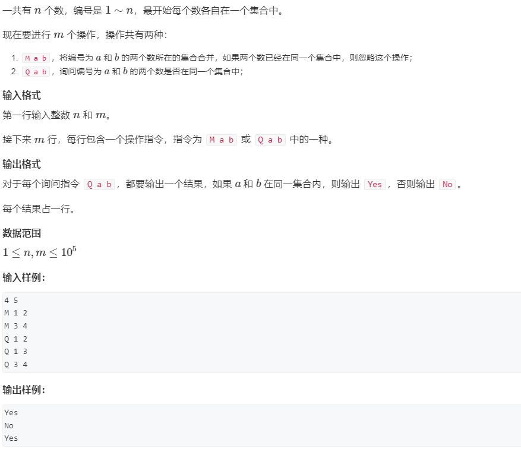

```java
package _03_数据结构._09_并查集;

import java.io.BufferedReader;
import java.io.BufferedWriter;
import java.io.IOException;
import java.io.InputStreamReader;
import java.io.OutputStreamWriter;
import java.io.PrintWriter;
import java.io.StreamTokenizer;
import java.util.HashMap;
/*
提交状态: AC
输入
5 10
M 2 3
Q 2 3
M 1 5
Q 3 2
M 1 4
Q 4 5
Q 1 2
Q 2 4
M 4 1
Q 5 3
输出
Yes
Yes
Yes
No
No
No

 * */
public class _01_并查集 {
 static class UnionSet{
  HashMap<Integer, Integer> parentMap= new HashMap<>();
  void add(int x) {
   parentMap.put(x, x);
  }
  int findParent(int cur) {
   int curParent = parentMap.get(cur);
   if(curParent!=cur)parentMap.put(cur, findParent(curParent));
   return parentMap.get(cur);
  }
  boolean isSameSet(int x1,int x2) {
   return findParent(x1)==findParent(x2);
  }
  void union(int x1,int x2) {
   parentMap.put(findParent(x1), findParent(x2));
  }
 }
 public static void main(String[] args) throws IOException  {
  UnionSet unionSet = new UnionSet();
  String[] ops = br.readLine().split(" ");
  int n =Integer.parseInt(ops[0]),m=Integer.parseInt(ops[1]);
  for (int i = 1; i <= n; i++) {
   unionSet.add(i);
  }
  while(m--!=0) {
   ops = br.readLine().split(" ");
   if("M".equals(ops[0])) {
    int a = Integer.parseInt(ops[1]);
    int b = Integer.parseInt(ops[2]);
    unionSet.union(a, b);
   }else if("Q".equals(ops[0])) {
    int a = Integer.parseInt(ops[1]);
    int b = Integer.parseInt(ops[2]);
    pw.println(unionSet.isSameSet(a, b)?"Yes":"No");
   }
  }
  pw.flush();
 }
 static BufferedReader br =new BufferedReader(new InputStreamReader(System.in));
 static BufferedWriter bw =new BufferedWriter(new OutputStreamWriter(System.out));
 static StreamTokenizer st = new StreamTokenizer(br);
 static PrintWriter pw =new PrintWriter(bw);

 static int nextInt() {
  try {
   st.nextToken();
  } catch (IOException e) {
   // TODO 自动生成的 catch 块
   e.printStackTrace();
  }
  return (int) st.nval;
 }
 static String nextStr() {
  try {
   st.nextToken();
  } catch (IOException e) {
   // TODO 自动生成的 catch 块
   e.printStackTrace();
  }
  return st.sval;
 }
}

```

### _10_堆排序

#### _01_堆排序


```java
package _03_数据结构._10_堆排序;

import java.io.BufferedReader;
import java.io.BufferedWriter;
import java.io.IOException;
import java.io.InputStreamReader;
import java.io.OutputStreamWriter;
import java.io.PrintWriter;
import java.io.StreamTokenizer;
/*
提交状态: AC
输入
5 3
4 5 1 3 2
输出
1 2 3
 * */
public class _01_堆排序 {
 static class Heap{
  int val[],tail,MAX_SIXE;
  public Heap(int capacity) {
   init(capacity);
  }
  void init(int capacity){
   MAX_SIXE=capacity;
   val=new int[MAX_SIXE];
   tail=0;
  }
  void up(int k) {
   int tarIdx=k;
   int fatherIdx = k/2;
   if(fatherIdx>=1&&val[fatherIdx]>val[tarIdx])tarIdx=fatherIdx;
   if(tarIdx==k)return;
   swap(k, tarIdx);
   up(tarIdx);
  }
  void down(int k) {
   int tarIdx = k;
   int left = 2*k;
   int right = 2*k+1;
   if(left<=tail && val[left]<val[tarIdx]) tarIdx=left;
   if(right<=tail && val[right]<val[tarIdx]) tarIdx=right;
   if(tarIdx==k) return;
   swap(k, tarIdx);
   down(tarIdx);
  }
  void add(int x) {
   tail++;
   val[tail]=x;
   up(tail);
  }
  int removeTop() {
   int t=val[1];
   swap(1, tail);
   tail--;
   down(1);
   return t;
  }
  void swap(int i,int j) {
   if(i!=j) {
    val[i]=val[i]^val[j];
    val[j]=val[i]^val[j];
    val[i]=val[i]^val[j];
   }
  }
 }
 public static void main(String[] args) throws IOException  {
  int n =nextInt(),m=nextInt();
  Heap unionSet =new Heap(n+1);
  for (int i = 0; i < n; i++) {
   unionSet.add(nextInt());
  }
  for (int i = 0; i < m; i++) {
   if(i!=0)pw.print(" ");
   pw.print(unionSet.removeTop());
  }
  pw.flush();
 }
 static BufferedReader br =new BufferedReader(new InputStreamReader(System.in));
 static BufferedWriter bw =new BufferedWriter(new OutputStreamWriter(System.out));
 static StreamTokenizer st = new StreamTokenizer(br);
 static PrintWriter pw =new PrintWriter(bw);

 static int nextInt() {
  try {
   st.nextToken();
  } catch (IOException e) {
   // TODO 自动生成的 catch 块
   e.printStackTrace();
  }
  return (int) st.nval;
 }
 static String nextStr() {
  try {
   st.nextToken();
  } catch (IOException e) {
   // TODO 自动生成的 catch 块
   e.printStackTrace();
  }
  return st.sval;
 }
}

```

### _11_hash表

#### _01_模拟散列表


```java
package _03_数据结构._11_hash表;
/*
提交状态: AC
输入
5
I 1
I 2
I 3
Q 2
Q 5
输出
Yes
No
 * */
import java.io.BufferedReader;
import java.io.BufferedWriter;
import java.io.IOException;
import java.io.InputStreamReader;
import java.io.OutputStreamWriter;
import java.io.PrintWriter;
import java.io.StreamTokenizer;

public class _01_模拟散列表 {
 static int hashTab[],vals[],next[],idx,MAX_SIZE,NULL=0;
 static void init(int capacity) {
  MAX_SIZE=findNextSu(capacity);
  vals=new int[MAX_SIZE];
  next=new int[MAX_SIZE];
  hashTab=new int[MAX_SIZE];
  idx=1;// 0为空指针，1为第一个可用指针
 }
 static void insert(int x) {
  int pos = hash(x);
  vals[idx]=x;
  next[idx]=hashTab[pos];
  hashTab[pos]=idx++;
 }
 static boolean find(int x) {
  for (int pos = hashTab[hash(x)]; pos != NULL; pos=next[pos]) {
   if(vals[pos]==x)return true;
  }
  return false;
 }
 static int hash(int x) {
  return (x%MAX_SIZE+MAX_SIZE)%MAX_SIZE;// 防止大负数造成hash表越界
 }
 static int findNextSu(int from) {// 找最近的素数
  for (int num = from;true; num++) {
   boolean isFind = true;
   for (int i = 2; i * i <= num; i++) {
    if(num%i==0) {isFind=false;break;};
   }
   if(isFind) return num;
  }
 }
 public static void main(String[] args) throws NumberFormatException, IOException {
  int N = Integer.parseInt(re.readLine());
  init(1000000);
  while (N--!=0) {
   String[] ops = re.readLine().split(" ");
   switch(ops[0]) {
    case"I":
     insert(Integer.parseInt(ops[1]));
     break;
    case "Q":
     pw.println(find(Integer.parseInt(ops[1]))?"Yes":"No");
     break;
   }
  }
  pw.flush();
 }
 static BufferedReader re = new BufferedReader(new InputStreamReader(System.in));
 static BufferedWriter wr = new BufferedWriter(new OutputStreamWriter(System.out));
 static StreamTokenizer tokenizer = new StreamTokenizer(re);
 static PrintWriter pw = new PrintWriter(wr);
 static int nextInt() {
  try {
   tokenizer.nextToken();
  } catch (IOException e) {
   // TODO 自动生成的 catch 块
   e.printStackTrace();
  }
  return (int) tokenizer.nval;
 }
 static String nextStr() {
  try {
   tokenizer.nextToken();
  } catch (IOException e) {
   // TODO 自动生成的 catch 块
   e.printStackTrace();
  }
  return tokenizer.sval;
 }
}

```

#### _02_字符串hash


```java
package _03_数据结构._11_hash表;
/*
提交状态: AC
输入
8 3
aabbaabb
1 3 5 7
1 3 6 8
1 2 1 2
输出
Yes
No
Yes
*/
import java.io.BufferedReader;
import java.io.BufferedWriter;
import java.io.IOException;
import java.io.InputStreamReader;
import java.io.OutputStreamWriter;
import java.io.PrintWriter;
import java.io.StreamTokenizer;

public class _02_字符串hash {
 static long[] hashs,pows;
 // '0'=》 48 | '1'=》 49  | 'A'=》 65  | 'a'=》 97  | 'z'=》 122
 //  [1-9] 九个数，基数为9：'9'-'1' + 1 = 9个数字
 // [0-1-9] 十个数，十进制，基数为10
 // [0-9-A-Z-a-Z],很多个数，基数为 Base='z'-'0'+1
 static long Base='z'-'0'+1;
// 计算字符串的hash，str是从1开始的。
 static void initStrHash(char[] str) {// 字符串只包含大小写字母和数字
  hashs=new long[str.length];
  pows=new long[str.length];pows[0]=1;//初始化。 
  for (int i = 1; i < str.length; i++) {
   hashs[i]=hashs[i-1]*Base + str[i]-'0'+1;// 应该避免出现0;否则hash(A)=0 hash(AA)=0
   pows[i]=pows[i-1]*Base;// 计算指数; pows[0]=1;pows[1]=Factor;pows[2]=Factor*Factor;
  }
 }
// 获得子串的hash
 static long getSubStrHash(int l,int r) {
  return hashs[l-1]*pows[r-l+1]-hashs[r];
 }
 public static void main(String[] args) throws NumberFormatException, IOException {
  String[] ops = re.readLine().split(" ");
  int N = Integer.parseInt(ops[0]),M=Integer.parseInt(ops[1]);
  char[] str = new char[N+1];
  for(int i=1;i<=N;i++) {
   str[i]=(char) re.read();
  }re.readLine();
  initStrHash(str);
  while (M--!=0) {
   ops = re.readLine().split(" ");
   int l1=Integer.parseInt(ops[0]);
   int r1=Integer.parseInt(ops[1]);
   int l2=Integer.parseInt(ops[2]);
   int r2=Integer.parseInt(ops[3]);
   if(getSubStrHash(l1, r1)==getSubStrHash(l2, r2)) {
    pw.println("Yes");
   }else {
    pw.println("No");
   }
  }
  pw.flush();
 }
 static BufferedReader re = new BufferedReader(new InputStreamReader(System.in));
 static BufferedWriter wr = new BufferedWriter(new OutputStreamWriter(System.out));
 static StreamTokenizer tokenizer = new StreamTokenizer(re);
 static PrintWriter pw = new PrintWriter(wr);
 static int nextInt() {
  try {
   tokenizer.nextToken();
  } catch (IOException e) {
   // TODO 自动生成的 catch 块
   e.printStackTrace();
  }
  return (int) tokenizer.nval;
 }
 static String nextStr() {
  try {
   tokenizer.nextToken();
  } catch (IOException e) {
   // TODO 自动生成的 catch 块
   e.printStackTrace();
  }
  return tokenizer.sval;
 }
}

```

## _04_图论

### _01_单源最短路

#### _01_Dijkstra_朴素版


##### _01_Dijkstra_朴素版_邻接表法

```java
package _04_图论._01_单源最短路;
/*
提交状态: AC
输入
5 10
1 2 2
5 3 3
4 1 8
2 4 3
4 5 7
5 2 3
3 4 1
1 2 9
3 2 3
1 2 8
输出
12
*/
import java.io.BufferedReader;
import java.io.BufferedWriter;
import java.io.InputStreamReader;
import java.io.OutputStreamWriter;
import java.io.PrintWriter;
import java.io.StreamTokenizer;
import java.util.Arrays;

public class _01_Dijkstra_朴素版_邻接表法 {
 static int node[],dist[],wigh[],next[],idx,MAX_NODE_SIZE,MAX_EDGE_SIZE,INF=0x3f3f3f3f,NULL=0;
 static void init(int nodeNum,int edgeNum) {
  MAX_NODE_SIZE = nodeNum;
  MAX_EDGE_SIZE = edgeNum;
  node=new int[MAX_NODE_SIZE+1];
  dist=new int[MAX_EDGE_SIZE+1];
  wigh=new int[MAX_EDGE_SIZE+1];
  next=new int[MAX_EDGE_SIZE+1];
  idx=1;
 }
 static void addEdge(int A,int B,int w) {
  dist[idx]=B;
  wigh[idx]=w;
  next[idx]=node[A];
  node[A]=idx++;
 }
// 单源非负最短路：从一个点出发到其他所有点的最短距离
 static int[] Dijkstra(int from) {
  boolean visited[]=new boolean[MAX_NODE_SIZE+1];
  int distance[]=new int[MAX_NODE_SIZE+1];
  Arrays.fill(distance, INF);
  distance[from]=0;// 自己到自己的距离为0
  for (int i = 1; i<=MAX_NODE_SIZE; i++) {
   int minNode = getMinDisNextNodeExcludeVisited(distance, visited);
   if(minNode==-1) break;// -1说明到其他节点的距离都是无穷远，说明到达剩余的其他节点的路径是不存在的。
   visited[minNode]=true;
   for (int pos = node[minNode]; pos!=NULL; pos=next[pos]) {
    int toNextN =dist[pos];
    int toNextW = wigh[pos];
    distance[toNextN]=Math.min(distance[toNextN],distance[minNode]+toNextW);
   }
  }
  return distance;
 }
 static int getMinDisNextNodeExcludeVisited(int distance[],boolean exclude[]) {
  int targetIdx = -1;
  int targetDis = INF;
  for (int i = 1; i <= MAX_NODE_SIZE; i++) {
   if(!exclude[i] && distance[i]<targetDis) {
    targetIdx=i;
    targetDis=distance[i];
   }
  }
  return targetIdx;
 }
 public static void main(String[] args) throws Throwable {
  String[] ops = re.readLine().split(" ");
  int N=Integer.parseInt(ops[0]),M=Integer.parseInt(ops[1]);
  init(N,M);
  while (M--!=0) {
   ops = re.readLine().split(" ");
   int a=Integer.parseInt(ops[0]);
   int b=Integer.parseInt(ops[1]);
   int w=Integer.parseInt(ops[2]);
   if(a==b) continue;
   addEdge(a, b, w);
  }
  int[] res = Dijkstra(1);
  if(res[N]!=INF) pw.print(res[N]);
  else pw.print(-1);
  pw.flush();
 }
 static BufferedReader re = new BufferedReader(new InputStreamReader(System.in));
 static BufferedWriter wr = new BufferedWriter(new OutputStreamWriter(System.out));
 static StreamTokenizer tokenizer = new StreamTokenizer(re);
 static PrintWriter pw = new PrintWriter(wr);
 static int nextInt() throws Throwable {
  tokenizer.nextToken();
  return (int) tokenizer.nval;
 }
 static String nextStr() throws Throwable {
  tokenizer.nextToken();
  return tokenizer.sval;
 }
}

```

```cpp
// 复习
// 提交状态：AC
#include<iostream>
#include<algorithm>
#include<string.h>
using namespace std;

const int N = 10e5+10;
int MAX_NODE,INF=0x3f3f3f3f;
int h[N],nod[N],nxt[N],wig[N],idx=1;
void addEdge(int a,int b,int w){
    nod[idx]=b;
    wig[idx]=w;
    nxt[idx]=h[a];
    h[a]=idx++;
}
int getMinDistExcludeVisited(int dist[],bool visited[]){
    int idx=-1,minDist=INF;
    for(int i=1;i<MAX_NODE;i++){
        if(!visited[i] && minDist>dist[i]){
            minDist=dist[i];
            idx=i;
        }
    }
    return idx;
}
int* djkstra(int from){
    int *dist = new int[MAX_NODE];
    bool visited[MAX_NODE];
    memset(dist,INF,MAX_NODE * sizeof(int));
    memset(visited,false,sizeof visited);
    dist[from]=0;
    int i=1;
    for(;i<MAX_NODE;i++){
        int cur = getMinDistExcludeVisited(dist,visited);
        if(cur==-1) break;
        visited[cur]=true;
        for(int p=h[cur];p!=0;p=nxt[p]){
            int ne = nod[p];
            int wi = wig[p];
            dist[ne]=min(dist[ne],dist[cur]+wi);
        }
    }
    return dist;
}
int main(){
    int n,m;
    cin>>n>>m;
    MAX_NODE=n+1;
    while(m--){
        int a,b,w;
        cin>>a>>b>>w;
        if(a!=b) addEdge(a,b,w);
    }
    int *dist = djkstra(1);
    if(dist[n]!=INF) cout<<dist[n];
    else cout<<"-1"<<endl;
}
```

##### _01_Dijkstra_朴素版_邻接矩阵实现

```java
package _04_图论._01_单源最短路;
/*
提交状态: AC
输入
5 10
1 2 2
5 3 3
4 1 8
2 4 3
4 5 7
5 2 3
3 4 1
1 2 9
3 2 3
1 2 8
输出
12
*/
import java.io.BufferedReader;
import java.io.BufferedWriter;
import java.io.IOException;
import java.io.InputStreamReader;
import java.io.OutputStreamWriter;
import java.io.PrintWriter;
import java.io.StreamTokenizer;
import java.util.Arrays;

public class _01_Dijkstra_朴素版_邻接矩阵实现 {
 static int matrix[][],MAX_NODE_SIZE,INF=0x3f3f3f3f;
 static void init(int nodeNum) {
  MAX_NODE_SIZE = nodeNum;
  matrix=new int[MAX_NODE_SIZE+1][MAX_NODE_SIZE+1];
  for (int i = 0; i < matrix.length; i++) {
   Arrays.fill(matrix[i], INF);
  }
 }
 static void addEdge(int A,int toB,int w) {
  matrix[A][toB]=Math.min(matrix[A][toB], w);
 }
// 单源非负最短路：从一个点出发到其他所有点的最短距离
 static int[] Dijkstra(int from) {
  boolean visited[]=new boolean[MAX_NODE_SIZE+1];
  int distance[]=new int[MAX_NODE_SIZE+1];
  Arrays.fill(distance, INF);
  distance[from]=0;// 自己到自己的距离为0
  for (int i = 1; i<=MAX_NODE_SIZE; i++) {
   int minNode = getMinDisNextNodeExcludeVisited(distance, visited);
   if(minNode==-1) break;// -1说明到其他节点的距离都是无穷远，说明到达剩余的其他节点的路径是不存在的。
   visited[minNode]=true;
   for (int next = 1; next<=MAX_NODE_SIZE; next++) {
    int toNextN =next;
    int toNextW = matrix[minNode][toNextN];
    distance[toNextN]=Math.min(distance[toNextN],distance[minNode]+toNextW);
   }
  }
  return distance;
 }
 static int getMinDisNextNodeExcludeVisited(int distance[],boolean exclude[]) {
  int targetIdx = -1;
  int targetDis = INF;
  for (int i = 1; i <= MAX_NODE_SIZE; i++) {
   if(!exclude[i] && (distance[i]<targetDis)) {
    targetIdx=i;
    targetDis=distance[i];
   }
  }
  return targetIdx;
 }
 public static void main(String[] args) throws Exception {
  String[] ops = re.readLine().split(" ");
  int N=Integer.parseInt(ops[0]),M=Integer.parseInt(ops[1]);
  init(N);
  while (M--!=0) {
   ops = re.readLine().split(" ");
   int a=Integer.parseInt(ops[0]);
   int b=Integer.parseInt(ops[1]);
   int w=Integer.parseInt(ops[2]);
   if(a==b)continue;
   addEdge(a, b, w);
//   addEdge(b, a, w);
  }
  int[] res = Dijkstra(1);
  if(res[N]!=INF) {
   pw.print(res[N]);
  }else {
   pw.print(-1);
  }
  pw.flush();
 }
 static BufferedReader re = new BufferedReader(new InputStreamReader(System.in));
 static BufferedWriter wr = new BufferedWriter(new OutputStreamWriter(System.out));
 static StreamTokenizer tokenizer = new StreamTokenizer(re);
 static PrintWriter pw = new PrintWriter(wr);
 static int nextInt() {
  try {
   tokenizer.nextToken();
  } catch (IOException e) {
   // TODO 自动生成的 catch 块
   e.printStackTrace();
  }
  return (int) tokenizer.nval;
 }
 static String nextStr() {
  try {
   tokenizer.nextToken();
  } catch (IOException e) {
   // TODO 自动生成的 catch 块
   e.printStackTrace();
  }
  return tokenizer.sval;
 }
}

```

#### _02_Dijkstra_堆优化版


##### _02_Dijkstra_堆优化版_邻接表法


```java
package _04_图论._01_单源最短路;
/*
提交状态: AC
输入
5 10
1 2 2
5 3 3
4 1 8
2 4 3
4 5 7
5 2 3
3 4 1
1 2 9
3 2 3
1 2 8
输出
12
*/
import java.io.BufferedReader;
import java.io.BufferedWriter;
import java.io.InputStreamReader;
import java.io.OutputStreamWriter;
import java.io.PrintWriter;
import java.io.StreamTokenizer;
import java.util.Arrays;
import java.util.PriorityQueue;

public class _02_Dijkstra_堆优化版_邻接表法 {
 static int node[],dist[],wigh[],next[],idx,MAX_NODE_SIZE,MAX_EDGE_SIZE,INF=0x3f3f3f3f,NULL=0;
 static void init(int nodeNum,int edgeNum) {
  MAX_NODE_SIZE = nodeNum;
  MAX_EDGE_SIZE = edgeNum;
  node=new int[MAX_NODE_SIZE+1];
  dist=new int[MAX_EDGE_SIZE+1];
  wigh=new int[MAX_EDGE_SIZE+1];
  next=new int[MAX_EDGE_SIZE+1];
  idx=1;
 }
 static void addEdge(int A,int B,int w) {
  dist[idx]=B;
  wigh[idx]=w;
  next[idx]=node[A];
  node[A]=idx++;
 }
 static class Info implements Comparable<Info>{
  int node,distance;
  public Info(int to, int wigh) {
   this.node = to;
   this.distance = wigh;
  }
  @Override
  public int compareTo(Info other) {
   return this.distance-other.distance;
  }
 }
// 单源非负最短路：从一个点出发到其他所有点的最短距离
 static int[] Dijkstra(int from) {
  boolean visited[]=new boolean[MAX_NODE_SIZE+1];
  int distance[]=new int[MAX_NODE_SIZE+1];
  Arrays.fill(distance, INF);
  distance[from]=0;// 自己到自己的距离为0
  PriorityQueue<Info> heap = new PriorityQueue<>();
  heap.add(new Info(from, 0));
  while (!heap.isEmpty()) {
   Info info = heap.poll();
   int minNode = info.node;
   int curDist = info.distance;
   if(visited[minNode]) continue;// 由于堆是没有删除操作的，这里遇到处理过的节点直接丢弃。
   visited[minNode]=true;
   for (int pos = node[minNode]; pos!=NULL; pos=next[pos]) {
    int toNextN =dist[pos];
    int toNextW = wigh[pos];
    int newDist = curDist+toNextW;
    if(newDist < distance[toNextN]) {
     distance[toNextN]=newDist;
     heap.add(new Info(toNextN, distance[toNextN])); // 只把有更新的位置放入堆
    }
   }
  }
  return distance;
 }
 public static void main(String[] args) throws Throwable {
  String[] ops = re.readLine().split(" ");
  int N=Integer.parseInt(ops[0]),M=Integer.parseInt(ops[1]);
  init(N,M);
  while (M--!=0) {
   ops = re.readLine().split(" ");
   int a=Integer.parseInt(ops[0]);
   int b=Integer.parseInt(ops[1]);
   int w=Integer.parseInt(ops[2]);
   if(a==b) continue;
   addEdge(a, b, w);
  }
  int[] res = Dijkstra(1);
  if(res[N]!=INF) pw.print(res[N]);
  else pw.print(-1);
  pw.flush();
 }
 static BufferedReader re = new BufferedReader(new InputStreamReader(System.in));
 static BufferedWriter wr = new BufferedWriter(new OutputStreamWriter(System.out));
 static StreamTokenizer tokenizer = new StreamTokenizer(re);
 static PrintWriter pw = new PrintWriter(wr);
 static int nextInt() throws Throwable {
  tokenizer.nextToken();
  return (int) tokenizer.nval;
 }
 static String nextStr() throws Throwable {
  tokenizer.nextToken();
  return tokenizer.sval;
 }
}

```

##### _02_Dijkstra_堆优化版_邻接矩阵实现

```java
package _04_图论._01_单源最短路;
/*
提交状态: Memory Limit Exceeded
输入
5 10
1 2 2
5 3 3
4 1 8
2 4 3
4 5 7
5 2 3
3 4 1
1 2 9
3 2 3
1 2 8
输出
12
*/
import java.io.BufferedReader;
import java.io.BufferedWriter;
import java.io.IOException;
import java.io.InputStreamReader;
import java.io.OutputStreamWriter;
import java.io.PrintWriter;
import java.io.StreamTokenizer;
import java.util.Arrays;
import java.util.PriorityQueue;

public class _02_Dijkstra_堆优化版_邻接矩阵实现 {
 static int matrix[][],MAX_NODE_SIZE,INF=0x3f3f3f3f;
 static void init(int nodeNum) {
  MAX_NODE_SIZE = nodeNum;
  matrix=new int[MAX_NODE_SIZE+1][MAX_NODE_SIZE+1];
  for (int i = 0; i < matrix.length; i++) {
   Arrays.fill(matrix[i], INF);
  }
 }
 static void addEdge(int A,int toB,int w) {
  matrix[A][toB]=Math.min(matrix[A][toB], w);
 }
 static class Info implements Comparable<Info>{
  int node,distance;
  public Info(int node, int distance) {
   this.node = node;
   this.distance = distance;
  }
  @Override
  public int compareTo(Info other) {
   return this.distance-other.distance;
  }
  
 }
// 单源非负最短路：从一个点出发到其他所有点的最短距离
 static int[] Dijkstra(int from) {
  boolean visited[]=new boolean[MAX_NODE_SIZE+1];
  int distance[]=new int[MAX_NODE_SIZE+1];
  Arrays.fill(distance, INF);
  distance[from]=0;// 自己到自己的距离为0
  PriorityQueue<Info> heap = new PriorityQueue<>();
  heap.add(new Info(from, 0));
  while (!heap.isEmpty()) {
   Info info = heap.poll();
   int minNode = info.node;
   int minDist = info.distance;
   if(visited[minNode])continue;
   visited[minNode]=true;
   for (int next = 1; next<=MAX_NODE_SIZE; next++) {
    int toNextN =next;
    int toNextW = matrix[minNode][toNextN];
    int newDist = minDist+toNextW;
    if(newDist<distance[toNextN]) {
     distance[toNextN]=newDist;
     heap.add(new Info(toNextN, distance[toNextN]));
    }
   }
  }
  return distance;
 }
 public static void main(String[] args) throws Exception {
  String[] ops = re.readLine().split(" ");
  int N=Integer.parseInt(ops[0]),M=Integer.parseInt(ops[1]);
  init(N);
  while (M--!=0) {
   ops = re.readLine().split(" ");
   int a=Integer.parseInt(ops[0]);
   int b=Integer.parseInt(ops[1]);
   int w=Integer.parseInt(ops[2]);
   if(a==b)continue;
   addEdge(a, b, w);
//   addEdge(b, a, w);
  }
  int[] res = Dijkstra(1);
  if(res[N]!=INF) {
   pw.print(res[N]);
  }else {
   pw.print(-1);
  }
  pw.flush();
 }
 static BufferedReader re = new BufferedReader(new InputStreamReader(System.in));
 static BufferedWriter wr = new BufferedWriter(new OutputStreamWriter(System.out));
 static StreamTokenizer tokenizer = new StreamTokenizer(re);
 static PrintWriter pw = new PrintWriter(wr);
 static int nextInt() {
  try {
   tokenizer.nextToken();
  } catch (IOException e) {
   // TODO 自动生成的 catch 块
   e.printStackTrace();
  }
  return (int) tokenizer.nval;
 }
 static String nextStr() {
  try {
   tokenizer.nextToken();
  } catch (IOException e) {
   // TODO 自动生成的 catch 块
   e.printStackTrace();
  }
  return tokenizer.sval;
 }
}

```

#### _03_Bellman_Ford算法_有边数限制的最短路


```java
package _04_图论._01_单源最短路;
/*
提交状态: AC
输入
3 3 1
1 2 1
2 3 1
1 3 3
输出
3
*/
import java.io.BufferedReader;
import java.io.BufferedWriter;
import java.io.IOException;
import java.io.InputStreamReader;
import java.io.OutputStreamWriter;
import java.io.PrintWriter;
import java.io.StreamTokenizer;
import java.util.Arrays;
import java.util.HashSet;

public class _03_Bellman_Ford算法 {
 static class Edge{
  int from,to,weight;
  public Edge(int from, int to, int weight) {
   this.from = from;
   this.to = to;
   this.weight = weight;
  }
 }
 static int MAX_NODE,INF=0x3f3f3f3f;
 static HashSet<Edge> edges=new HashSet<>();
 static void init(int nodeSize) {
  MAX_NODE = nodeSize;
 }
 static void addEdge(int a,int b,int w) {
  edges.add(new Edge(a, b, w));
 }
 static int[] bellman_ford(int from,int k) {
  int[] distance = new int[MAX_NODE+1];
  int[] distance_bak = new int[MAX_NODE+1];
  Arrays.fill(distance, INF);
  distance[from]=0;
  System.arraycopy(distance, 0, distance_bak, 0, distance_bak.length);
  for(int i=1;i<=k;i++) {
   for(Edge edge:edges) {
    distance[edge.to]=Math.min(distance[edge.to], distance_bak[edge.from]+edge.weight);
   }
   System.arraycopy(distance, 0, distance_bak, 0, distance_bak.length);
  }
  return distance;
 }
 public static void main(String[] args) throws Throwable {
  String[] ops = re.readLine().split(" ");
  int n=Integer.parseInt(ops[0]),
   m=Integer.parseInt(ops[1]),
   k=Integer.parseInt(ops[2]);
  init(n);
  while(m--!=0) {
   ops = re.readLine().split(" ");
   int a = Integer.parseInt(ops[0]),
    b = Integer.parseInt(ops[1]),
    w = Integer.parseInt(ops[2]);
   if(a!=b) addEdge(a, b, w);
  }
  int[] res= bellman_ford(1, k);
  if(res[n]<=INF/2)
   pw.print(res[n]);
  else
   pw.print("impossible");
  pw.flush();
 }
 static BufferedReader re = new BufferedReader(new InputStreamReader(System.in));
 static BufferedWriter wr = new BufferedWriter(new OutputStreamWriter(System.out));
 static StreamTokenizer tokenizer = new StreamTokenizer(re);
 static PrintWriter pw = new PrintWriter(wr);
 static int nextInt() {
  try {
   tokenizer.nextToken();
  } catch (IOException e) {
   // TODO 自动生成的 catch 块
   e.printStackTrace();
  }
  return (int) tokenizer.nval;
 }
 static String nextStr() {
  try {
   tokenizer.nextToken();
  } catch (IOException e) {
   // TODO 自动生成的 catch 块
   e.printStackTrace();
  }
  return tokenizer.sval;
 }
}
```

#### _04_SPFA算法


```java
package _04_图论._01_单源最短路;
/*
提交状态: AC
输入
3 3
1 2 5
2 3 -3
1 3 4
输出
2
*/
import java.io.BufferedReader;
import java.io.BufferedWriter;
import java.io.IOException;
import java.io.InputStreamReader;
import java.io.OutputStreamWriter;
import java.io.PrintWriter;
import java.io.StreamTokenizer;
import java.util.Arrays;
import java.util.HashSet;
import java.util.LinkedList;
import java.util.Queue;

public class _04_SPFA算法 {

 static int node[],to[],wigh[],next[],idx,MAX_NODE,MAX_EDGE,INF=0x3f3f3f3f,NULL=0;
 static void init(int nodeSize,int edgeSize) {
  MAX_NODE = nodeSize;
  MAX_EDGE = edgeSize;
  node = new int[MAX_NODE+1];
  to = new int[MAX_EDGE+1];
  wigh = new int[MAX_EDGE+1];
  next = new int[MAX_EDGE+1];
  idx=1;
 }
 static void addEdge(int a,int b,int w) {
  to[idx]=b;
  wigh[idx]=w;
  next[idx]=node[a];
  node[a]=idx++;
 }
 static int[] SPFA(int from) {
  boolean[] existInQueue = new boolean[MAX_NODE+1];
  int[] distance = new int[MAX_NODE+1];
  Arrays.fill(distance, INF);
  distance[from]=0;
  Queue<Integer> processQueue = new LinkedList<>();
  processQueue.add(from);
  existInQueue[from]=true;
  while(!processQueue.isEmpty()) {
   int curNode = processQueue.poll();
   existInQueue[curNode]=false;
   int curDis = distance[curNode];
   for(int p=node[curNode];p!=NULL;p=next[p]) {
    int no = to[p];
    int wight = wigh[p];
    int newDis = curDis+wight;
    if(newDis<distance[no]) {
     distance[no]=newDis;
     if(!existInQueue[no]) {
      processQueue.add(no);
      existInQueue[no]=true;
     }
    }
   }
  }
  return distance;
 }
 public static void main(String[] args) throws Throwable {
  String[] ops = re.readLine().split(" ");
  int n=Integer.parseInt(ops[0]),
   m=Integer.parseInt(ops[1]);
  init(n,m);
  while(m--!=0) {
   ops = re.readLine().split(" ");
   int a = Integer.parseInt(ops[0]),
    b = Integer.parseInt(ops[1]),
    w = Integer.parseInt(ops[2]);
   if(a!=b) addEdge(a, b, w);
  }
  int[] res= SPFA(1);
  if(res[n]<=INF/2)
   pw.print(res[n]);
  else
   pw.print("impossible");
  pw.flush();
 }
 static BufferedReader re = new BufferedReader(new InputStreamReader(System.in));
 static BufferedWriter wr = new BufferedWriter(new OutputStreamWriter(System.out));
 static StreamTokenizer tokenizer = new StreamTokenizer(re);
 static PrintWriter pw = new PrintWriter(wr);
 static int nextInt() {
  try {
   tokenizer.nextToken();
  } catch (IOException e) {
   // TODO 自动生成的 catch 块
   e.printStackTrace();
  }
  return (int) tokenizer.nval;
 }
 static String nextStr() {
  try {
   tokenizer.nextToken();
  } catch (IOException e) {
   // TODO 自动生成的 catch 块
   e.printStackTrace();
  }
  return tokenizer.sval;
 }
}

```

#### _05_热浪


```java
package _04_图论._01_单源最短路;
/*
提交状态: AC
输入
7 11 5 4
2 4 2
1 4 3
7 2 2
3 4 3
5 7 5
7 3 3
6 1 1
6 3 4
2 4 3
5 6 3
7 2 1
输出
7
*/
import java.io.BufferedReader;
import java.io.BufferedWriter;
import java.io.IOException;
import java.io.InputStreamReader;
import java.io.OutputStreamWriter;
import java.io.PrintWriter;
import java.io.StreamTokenizer;
import java.util.Arrays;
import java.util.LinkedList;
import java.util.PriorityQueue;
import java.util.Queue;


public class _05_热浪 {
 static int MAX_NODE,MAX_EDGE,INF=0x3f3f3f3f;
 static int head[],node[],wigh[],next[],p=1;
 static void init(int n,int m) {
  MAX_NODE=n;
  MAX_EDGE=2*m;
  head=new int[MAX_NODE+1];
  node=new int[MAX_EDGE+1];
  wigh=new int[MAX_EDGE+1];
  next=new int[MAX_EDGE+1];
  p=1;
 }
 static void addEdge(int a,int b,int w) {
  node[p]=b;
  wigh[p]=w;
  next[p]=head[a];
  head[a]=p++;
 }
// O（M）~O（MN）
 static int SPFA(int from,int end) {
  int dist[] = new int[MAX_NODE+1];
  Queue<Integer> processQueue = new LinkedList<>();
  boolean inQueue[] = new boolean[MAX_NODE+1];
  Arrays.fill(dist, INF);
  dist[from]=0;
  processQueue.add(from);
  while(!processQueue.isEmpty()) {
   int cur = processQueue.poll();
   inQueue[cur]=false;
   for(int p=head[cur];p!=0;p=next[p]) {
    int n=node[p];
    int w=wigh[p];
    if(dist[cur]+w<dist[n]) {
     dist[n]=dist[cur]+w;
     if(!inQueue[n]) {
      processQueue.add(n);
      inQueue[n]=true;
     }
    }
   }
  }
  return dist[end];
 }
 static class Info implements Comparable<Info>{
  int node,dist;
  public Info(int node, int dist) {
   this.node = node;
   this.dist = dist;
  }
  @Override
  public int compareTo(Info other) {
   // TODO 自动生成的方法存根
   return this.dist-other.dist;
  }
 }
// 堆优化版djikstra O(mlogN)
 static int Djiktra(int from,int to) {
  int dist[] = new int[MAX_NODE+1];
  boolean visited[] = new boolean[MAX_NODE+1];
  Arrays.fill(dist, INF);
  dist[from]=0;
  PriorityQueue<Info> heap= new PriorityQueue<>();
  heap.add(new Info(from, dist[0]));
  while(!heap.isEmpty()) {
   Info info = heap.poll();
   int cur = info.node;
   if(visited[cur]) continue;
   else visited[cur] = true;
   for(int p=head[cur];p!=0;p=next[p]) {
    int n = node[p];
    int w = wigh[p];
    if(dist[cur]+w<dist[n]) {
     dist[n]=dist[cur]+w;
     heap.add(new Info(n, dist[n]));
    }
   }
  }
  return dist[to];
 }
 public static void main(String[] args) throws Throwable {
  int T=nextInt(),C=nextInt(),T_s=nextInt(),T_e=nextInt();
  init(T, C);
  while(C--!=0) {
   int a=nextInt(),b=nextInt(),w=nextInt();
   addEdge(a, b, w);
   addEdge(b, a, w);
  }
//  int res = SPFA(T_s, T_e); // SPFA可以通过
  int res = Djiktra(T_s, T_e); // Dijkstra也可以通过
  pw.println(res);
  pw.flush();
 }
 static BufferedReader re = new BufferedReader(new InputStreamReader(System.in));
 static BufferedWriter wr = new BufferedWriter(new OutputStreamWriter(System.out));
 static StreamTokenizer tokenizer = new StreamTokenizer(re);
 static PrintWriter pw = new PrintWriter(wr);
 static String[] tokens;
 static int idx=0;
 static void nextToken() {
  idx++;
  if(tokens==null ||idx==tokens.length) {
   try {
    tokens=re.readLine().split(" ");
   } catch (IOException e) {
    // TODO 自动生成的 catch 块
    e.printStackTrace();
   }
   idx=0;
  }
 }
 static int nextInt() {
  nextToken();
  return Integer.parseInt(tokens[idx]);
 } 
} 
```

#### _06_最小花费

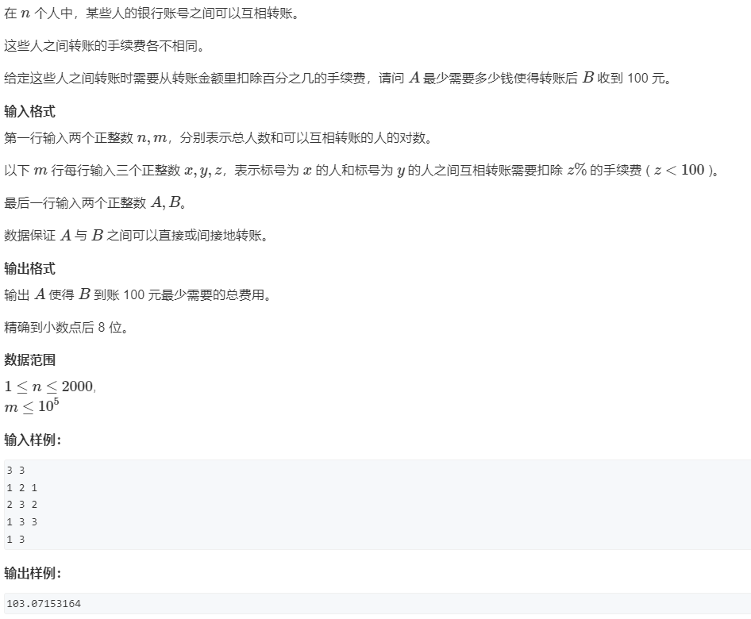

```java
package _04_图论._01_单源最短路;
/*
提交状态: AC
输入
3 3
1 2 1
2 3 2
1 3 3
1 3
输出
103.07153164
*/
import java.io.BufferedReader;
import java.io.BufferedWriter;
import java.io.IOException;
import java.io.InputStreamReader;
import java.io.OutputStreamWriter;
import java.io.PrintWriter;
import java.io.StreamTokenizer;
import java.util.Arrays;
import java.util.LinkedList;
import java.util.PriorityQueue;
import java.util.Queue;


public class _06_最小花费 {
// dist[i] = dist[parent] + z_i;算的是路径上的交易费率的累加，但要的不是这个，
// 因为并不是说手续费的费率加起来最小就是最划算转账的路径
//
//  假设从A到B需要经过的银行的转账手续费率分别是 z_1/100、z_2/100、......、z_i/100
// 就是要算拿着x的本金，经过一系列的银行的转账交易和支付手续费后，本金还剩100，可得计算公式：
// x*(1-z_1/100)*(1-z_2/100)*.....*(1-z_i/100) = 100
// 本金就为：
// x = 100/((1-z_1/100)*(1-z_2/100)*.....(1-z_i/100))
// x = 100/cost[i]
// cost[i] = (1-z_1/100)*(1-z_2/100)*....*(1-z_i/100)
// cost[i] = cost[parent] * (1-z_i/100)
// cost[i] 越大，则x越小，即需要带的钱越少，因交易手续费而发生的对本金的磨损越少
 static int MAX_NODE,MAX_EDGE,INF=0x3f3f3f3f;
 static int head[],node[],wigh[],next[],idx;
 static void init(int n,int m) {
  MAX_NODE=n;
  MAX_EDGE=2*m;
  head=new int[MAX_NODE+1];
  node=new int[MAX_EDGE+1];
  wigh=new int[MAX_EDGE+1];
  next=new int[MAX_EDGE+1];
  idx=1;
 }
 static void addEdge(int a,int b,int w) {
  node[idx]=b;
  wigh[idx]=w;
  next[idx]=head[a];
  head[a]=idx++;
 }
 static class Record implements Comparable<Record>{
  int node;double cost;
  public Record(int node, double cost) {
   this.node = node;
   this.cost = cost;
  }
  @Override
  public int compareTo(Record other) {
   return -Double.compare(this.cost, other.cost);// 越大越好，越大说明花费的手续费越少
  }
 }
 static double djikstra(int from,int end) {
  double[] cost = new double[MAX_NODE+1];
  boolean[] visited = new boolean[MAX_NODE+1];
  PriorityQueue<Record> heap = new PriorityQueue<>();
  cost[from]=1;
  heap.add(new Record(from, cost[from]));
  while (!heap.isEmpty()) {
   Record record = heap.poll();
   int cur = record.node;
   if(visited[cur]) continue;
   else visited[cur]=true;
   for(int p=head[cur];p!=0;p=next[p]) {
    int n = node[p];
    int w = wigh[p];
    double newCost = cost[cur]*(1-w/100.0);// cost[i] = cost[from] * (1-z_i/100)
    if(cost[n]<newCost) {
     cost[n]=newCost;
     heap.add(new Record(n, cost[n]));
    }
   }
  }
  return cost[end];
 }
 public static void main(String[] args)  {
  int n=nextInt(),m=nextInt();
  init(n, m);
  while (m--!=0) {
   int x=nextInt(),y=nextInt(),z=nextInt();
   addEdge(x, y, z);
   addEdge(y, x, z);
  }
  int a=nextInt(),b=nextInt();
  double p = djikstra(a, b);
  pw.printf("%.8f",100.0/p);
  pw.flush();
 }
 static BufferedReader re = new BufferedReader(new InputStreamReader(System.in));
 static BufferedWriter wr = new BufferedWriter(new OutputStreamWriter(System.out));
 static StreamTokenizer tokenizer = new StreamTokenizer(re);
 static PrintWriter pw = new PrintWriter(wr);
 static String[] tokens;
 static int pos=0;
 static void nextToken() {
  pos++;
  if(tokens==null ||pos==tokens.length) {
   try {
    tokens=re.readLine().split(" ");
   } catch (IOException e) {
    // TODO 自动生成的 catch 块
    e.printStackTrace();
   }
   pos=0;
  }
 }
 static int nextInt() {
  nextToken();
  return Integer.parseInt(tokens[pos]);
 } 
}
```

#### _07_香甜的黄油


```java
package _04_图论._01_单源最短路;
/*
提交状态: AC
输入
3 3
1 2 1
2 3 2
1 3 3
1 3
输出
103.07153164
*/
import java.io.BufferedReader;
import java.io.BufferedWriter;
import java.io.IOException;
import java.io.InputStreamReader;
import java.io.OutputStreamWriter;
import java.io.PrintWriter;
import java.io.StreamTokenizer;
import java.util.Arrays;
import java.util.LinkedList;
import java.util.PriorityQueue;
import java.util.Queue;
/*
提交状态: AC
输入样例：
3 4 5
2
3
4
1 2 1
1 3 5
2 3 7
2 4 3
3 4 5
输出样例：
8
*/

public class _07_香甜的黄油 {
 static int MAX_NODE,MAX_EDGE,INF=0x3f3f3f3f,NULL=0;
 static int head[],node[],wigh[],next[],idx;
 static void init(int n,int m) {
  MAX_NODE = n;
  MAX_EDGE = 2*m;
  head=new int[MAX_NODE+1];
  node=new int[MAX_EDGE+1];
  wigh=new int[MAX_EDGE+1];
  next=new int[MAX_EDGE+1];
  idx=1;
 }
 static void addEdge(int a,int b,int w) {
  node[idx]=b;
  wigh[idx]=w;
  next[idx]=head[a];
  head[a]=idx++;
 }
 static class Record implements Comparable<Record>{
  int node,dist;
  public Record(int node, int dist) {
   this.node = node;
   this.dist = dist;
  }
  public int compareTo(Record other) {
   return this.dist-other.dist;
  };
 }
// O(mlogN)
 static int[] djkstra(int from) {
  int dist[] = new int[MAX_NODE+1];
  Arrays.fill(dist, INF);
  dist[from]=0;
  boolean visited[] = new boolean[MAX_NODE+1];
  PriorityQueue<Record> heap = new PriorityQueue<>();
  heap.add(new Record(from, dist[from]));
  while (!heap.isEmpty()) {
   Record record = heap.poll();
   int cur = record.node;
   if(visited[cur]) continue;
   else visited[cur] =true;
   for(int p=head[cur];p!=NULL;p=next[p]) {
    int n = node[p];
    int w = wigh[p];
    int newDist = dist[cur]+w;
    if(dist[n]>newDist) {
     dist[n]=newDist;
     heap.add(new Record(n, newDist));
    }
   }
  }
  return dist;
 }
// 平均O(M) 最差O(MN)
 static int[] SPFA(int from) {
  int dist[] = new int[MAX_NODE+1];
  Arrays.fill(dist, INF);
  dist[from]=0;
  Queue<Integer> processQueue = new LinkedList<>();
  boolean inQueue[] = new boolean[MAX_NODE+1];
  processQueue.add(from);
  inQueue[from]=true;
  while (!processQueue.isEmpty()) {
   int cur = processQueue.poll();
   inQueue[cur]=false;
   for(int p=head[cur];p!=NULL;p=next[p]) {
    int n = node[p];
    int w = wigh[p];
    int newDist = dist[cur]+w;
    if(newDist<dist[n]) {
     dist[n]=newDist;
     if(!inQueue[n]) {
      processQueue.add(n);
      inQueue[n]=true;
     }
    }
   }
  }
  return dist;
 }
 public static void main(String[] args)  {
  int N =nextInt(),P=nextInt(),C=nextInt();
  int from[] = new int[N];
  for (int i = 0; i < from.length; i++) {
   from[i]=nextInt();
  }
  init(P, C);
  while (C--!=0) {
   int a=nextInt(),b=nextInt(),d=nextInt();
   addEdge(a, b, d);
   addEdge(b, a, d);
  }
  int min=INF;
  for(int n=1;n<=MAX_NODE;n++) {
   int sum=0;
   int dist[] = djkstra(n); // 可以通过
//   int dist[] = SPFA(n);// // 可以通过
   boolean impossible=false;
   for(int p:from) {
    if(dist[p]==INF) {
     impossible=true; break;
    }
    sum+=dist[p];
   }
   if(!impossible) min = Math.min(min, sum);
  }
  pw.println(min);
  pw.flush();
 }
 static BufferedReader re = new BufferedReader(new InputStreamReader(System.in));
 static BufferedWriter wr = new BufferedWriter(new OutputStreamWriter(System.out));
 static StreamTokenizer tokenizer = new StreamTokenizer(re);
 static PrintWriter pw = new PrintWriter(wr);
 static String[] tokens;
 static int pos=0;
 static void nextToken() {
  pos++;
  if(tokens==null ||pos==tokens.length) {
   try {
    tokens=re.readLine().split(" ");
   } catch (IOException e) {
    // TODO 自动生成的 catch 块
    e.printStackTrace();
   }
   pos=0;
  }
 }
 static int nextInt() {
  nextToken();
  return Integer.parseInt(tokens[pos]);
 } 
}
```

#### _08_信使


```java
package _04_图论._01_单源最短路;
/*
提交状态: AC
输入样例：
4 4
1 2 4
2 3 7
2 4 1
3 4 6
输出样例：
11
*/
import java.io.BufferedReader;
import java.io.BufferedWriter;
import java.io.IOException;
import java.io.InputStreamReader;
import java.io.OutputStreamWriter;
import java.io.PrintWriter;
import java.io.StreamTokenizer;
import java.util.Arrays;
import java.util.PriorityQueue;

public class _08_信使 {
 static int MAX_NODE,MAX_EDGE,INF=0x3f3f3f3f,NULL=0;
 static int head[],node[],wigh[],next[],idx=1;
 static void init(int n,int m) {
  MAX_NODE=n;
  MAX_EDGE=m;
  head = new int[MAX_NODE+1];
  node = new int[MAX_EDGE+1];
  wigh = new int[MAX_EDGE+1];
  next = new int[MAX_EDGE+1];
  idx=1;
 }
 static void addEdge(int a,int b,int w) {
  node[idx]=b;
  wigh[idx]=w;
  next[idx]=head[a];
  head[a]=idx++;
 }
 static class Record implements Comparable<Record>{
  int node,dist;
  public Record(int node, int dist) {
   this.node = node;
   this.dist = dist;
  }
  @Override
  public int compareTo(Record other) {
   return this.dist-other.dist;
  }
 }
 static int[] djikstra(int from) {
  int[] dist = new int[MAX_NODE+1];
  Arrays.fill(dist, INF);
  dist[from]=0;
  boolean visited[] = new boolean[MAX_NODE+1];
  PriorityQueue<Record> heap = new PriorityQueue<>();
  heap.add(new Record(from, dist[from]));
  while (!heap.isEmpty()) {
   Record record = heap.poll();
   int cur = record.node;
   if(visited[cur]) continue;
   else visited[cur] = true;
   for(int p =head[cur];p!=NULL;p=next[p]) {
    int n = node[p];
    int w = wigh[p];
    int newDist = dist[cur]+w;
    if(newDist<dist[n]) {
     dist[n]=newDist;
     heap.add(new Record(n, dist[n]));
    }
   }
  }
   return dist;
 }
 public static void main(String[] args)  {
  int n=nextInt(),m=nextInt();
  init(n, 2*m);
  while (m--!=0) {
   int i=nextInt(),j=nextInt(),k=nextInt();
   addEdge(i, j, k);
   addEdge(j, i, k);
  }
  int dist[] = djikstra(1);
  int total = 0;
  boolean impossible=false;
  for(int i=1;i<=MAX_NODE;i++) {
   int d=dist[i];
   if(d==INF) {impossible=true;break;}// 说明某个节点不可达
   total = Math.max(total, d);// 全部可达，则花费时间最多的节点就是信最后送到的节点
  }
  if(!impossible)pw.println(total);
  else pw.println(-1);
  pw.flush();
 }
 static BufferedReader re = new BufferedReader(new InputStreamReader(System.in));
 static BufferedWriter wr = new BufferedWriter(new OutputStreamWriter(System.out));
 static StreamTokenizer tokenizer = new StreamTokenizer(re);
 static PrintWriter pw = new PrintWriter(wr);
 static String[] tokens;
 static int pos=0;
 static void nextToken() {
  pos++;
  if(tokens==null ||pos==tokens.length) {
   try {
    tokens=re.readLine().split(" ");
   } catch (IOException e) {
    // TODO 自动生成的 catch 块
    e.printStackTrace();
   }
   pos=0;
  }
 }
 static int nextInt() {
  nextToken();
  return Integer.parseInt(tokens[pos]);
 } 
}
```

#### _09_最优乘车

```java
package _04_图论._01_单源最短路;
/*
提交状态: AC
输入样例：
4 50
9 42 47
48 3 7 14 17 20 42
1 48
6 7 11 12 13 14 15 17 22 23 33 34 37 40 41 47 50
输出样例：
2

*/
import java.io.BufferedReader;
import java.io.BufferedWriter;
import java.io.IOException;
import java.io.InputStreamReader;
import java.io.OutputStreamWriter;
import java.io.PrintWriter;
import java.io.StreamTokenizer;
import java.util.Arrays;
import java.util.PriorityQueue;

public class _09_最优乘车 {
 static int MAX_NODE,MAX_EDGE,INF=0x3f3f3f3f,NULL=0;
 static int head[],node[],wigh[],next[],idx=1;
 static void init(int n,int m) {
  MAX_NODE=n;
  MAX_EDGE=m;
  head = new int[MAX_NODE+1];
  node = new int[MAX_EDGE+1];
  wigh = new int[MAX_EDGE+1];
  next = new int[MAX_EDGE+1];
  idx=1;
 }
 static void addEdge(int a,int b,int w) {
  node[idx]=b;
  wigh[idx]=w;
  next[idx]=head[a];
  head[a]=idx++;
 }
 static class Record implements Comparable<Record>{
  int node,dist;
  public Record(int node, int dist) {
   this.node = node;
   this.dist = dist;
  }
  @Override
  public int compareTo(Record other) {
   return this.dist-other.dist;
  }
 }
 static int[] djikstra(int from) {
  int[] dist = new int[MAX_NODE+1];
  Arrays.fill(dist, INF);
  dist[from]=0;
  boolean visited[] = new boolean[MAX_NODE+1];
  PriorityQueue<Record> heap = new PriorityQueue<>();
  heap.add(new Record(from, dist[from]));
  while (!heap.isEmpty()) {
   Record record = heap.poll();
   int cur = record.node;
   if(visited[cur]) continue;
   else visited[cur] = true;
   for(int p =head[cur];p!=NULL;p=next[p]) {
    int n = node[p];
    int w = wigh[p];
    int newDist = dist[cur]+w;
    if(newDist<dist[n]) {
     dist[n]=newDist;
     heap.add(new Record(n, dist[n]));
    }
   }
  }
   return dist;
 }
 public static void main(String[] args)  {
  int m=nextInt(),n=nextInt();
  init(n, n*n);
  for(int p=1;p<=m;p++) {
   nextLineToken();
   int[] nums = new int[tokens.length];
   for (int i = 0; i < tokens.length; i++) {
    nums[i] = Integer.parseInt(tokens[i]);
   }
   for(int i=0;i<nums.length;i++) {
    for(int j=i+1;j<nums.length;j++) {
     addEdge(nums[i], nums[j], 1);
    }
   }
  }
  int dist[] = djikstra(1);
  if(dist[n]!=INF) pw.println(dist[n]-1);
  else pw.println("NO");
  pw.flush();
 }
 static BufferedReader re = new BufferedReader(new InputStreamReader(System.in));
 static BufferedWriter wr = new BufferedWriter(new OutputStreamWriter(System.out));
 static StreamTokenizer tokenizer = new StreamTokenizer(re);
 static PrintWriter pw = new PrintWriter(wr);
 static String[] tokens;
 static int pos=0;
 static void nextLineToken() {
  try {
   tokens=re.readLine().split(" ");
  } catch (IOException e) {
   // TODO 自动生成的 catch 块
   e.printStackTrace();
  }
 }
 static void nextToken() {
  pos++;
  if(tokens==null ||pos==tokens.length) {
   nextLineToken();
   pos=0;
  }
 }
 static int nextInt() {
  nextToken();
  return Integer.parseInt(tokens[pos]);
 } 
}

```

### _06_Floyd算法

#### _01_Floyd算法_邻接矩阵实现


```java
package _04_图论._06_Floyd算法;
/*
提交状态: AC
输入
3 3 2
1 2 1
2 3 2
1 3 1
2 1
1 3
输出
impossible
1
*/
import java.io.BufferedReader;
import java.io.BufferedWriter;
import java.io.IOException;
import java.io.InputStreamReader;
import java.io.OutputStreamWriter;
import java.io.PrintWriter;
import java.io.StreamTokenizer;

public class _01_Floyd算法_邻接矩阵实现 {
 static int matrix[][],MAX_NODE,INF=0x3f3f3f3f;
 static void init(int nodeNum) {
  MAX_NODE = nodeNum;
  matrix=new int[MAX_NODE+1][MAX_NODE+1];
  for (int i = 0; i < matrix.length; i++) {
   for (int j = 0; j < matrix[i].length; j++) {
    if(i==j)
     matrix[i][j]=0;
    else
     matrix[i][j]=INF;
   }
  }
 }
 static void addEdge(int A,int toB,int w) {
  matrix[A][toB]=Math.min(matrix[A][toB], w);
 }
 static int[][] floyd() {
  int distance[][] = matrixCopy(matrix);
  for (int k = 1; k <= MAX_NODE; k++) {
   for (int a = 1; a <= MAX_NODE; a++) {
    for (int b = 1; b <= MAX_NODE; b++) {
     distance[a][b]=Math.min(distance[a][b], distance[a][k]+distance[k][b]);
    }
   }
  }
  return distance;
 }
 static int[][] matrixCopy(int[][] src){
  int distance[][] = new int[src.length][src[0].length];
  for (int i = 0; i < distance.length; i++) 
   System.arraycopy(matrix[i], 0, distance[i], 0, distance[i].length);
  return distance;
 }
 public static void main(String[] args) throws Exception {
  String[] ops = re.readLine().split(" ");
  int N=Integer.parseInt(ops[0]),M=Integer.parseInt(ops[1]),K=Integer.parseInt(ops[2]);
  init(N);
  while (M--!=0) {
   ops = re.readLine().split(" ");
   int a=Integer.parseInt(ops[0]);
   int b=Integer.parseInt(ops[1]);
   int w=Integer.parseInt(ops[2]);
   if(a==b) continue;
   addEdge(a, b, w);
  }
  int[][] res = floyd();
  while(K--!=0) {
   ops = re.readLine().split(" ");
   int a=Integer.parseInt(ops[0]);
   int b=Integer.parseInt(ops[1]);
   if(res[a][b]<INF/2)
    pw.println(res[a][b]);
   else
    pw.println("impossible");
  }
  pw.flush();
 }
 static BufferedReader re = new BufferedReader(new InputStreamReader(System.in));
 static BufferedWriter wr = new BufferedWriter(new OutputStreamWriter(System.out));
 static StreamTokenizer tokenizer = new StreamTokenizer(re);
 static PrintWriter pw = new PrintWriter(wr);
 static int nextInt() {
  try {
   tokenizer.nextToken();
  } catch (IOException e) {
   // TODO 自动生成的 catch 块
   e.printStackTrace();
  }
  return (int) tokenizer.nval;
 }
 static String nextStr() {
  try {
   tokenizer.nextToken();
  } catch (IOException e) {
   // TODO 自动生成的 catch 块
   e.printStackTrace();
  }
  return tokenizer.sval;
 }
}

```

#### _02_AcWing_343_排序

```java
package _04_图论._06_Floyd算法;
/*
提交状态: AC
输入
4 6
A<B
A<C
B<C
C<D
B<D
A<B
3 2
A<B
B<A
26 1
A<Z
0 0
输出
Sorted sequence determined after 4 relations: ABCD.
Inconsistency found after 2 relations.
Sorted sequence cannot be determined.
*/
import java.io.BufferedReader;
import java.io.BufferedWriter;
import java.io.IOException;
import java.io.InputStreamReader;
import java.io.OutputStreamWriter;
import java.io.PrintWriter;
import java.io.StreamTokenizer;
import java.util.Arrays;
import java.util.Collections;

public class _02_AcWing_343_排序 {
 static int MAX_NODE,MAX_EDGE,INF=0x3f3f3f3f,NULL=0;
 static int g[][],out[],in[];
 static boolean exist[];
 static void init(int n,int m) {
  MAX_NODE=n;
  MAX_EDGE=m;
  g=new int[MAX_NODE+1][MAX_NODE+1];
  out=new int[MAX_NODE+1];//统计某节点的出度
  in=new int[MAX_NODE+1];// 统计某节点的入度
  for (int i = 0; i < g.length; i++) {
   for (int j = 0; j < g[i].length; j++) {
    g[i][j]=INF;
   }
   g[i][i]=0;
  }
 }
 static void addEdge(int a,int b,int w) {
  if(w<g[a][b]) {// 仅当添加的边的权重更小时才添加
   if(g[a][b]==INF) {// 仅在创建新边的时候更新入度和出度
    out[a]++; // a的出边+1
    in[b]++; // b的入度+1
   }
   g[a][b]=w;
  }
 }
 static void floydUpdate(int mid) {
  for (int from = 1; from <=MAX_NODE; from++) {
   for (int to = 1; to <=MAX_NODE; to++) {
    addEdge(from, to, g[from][mid]+g[mid][to]);
//    上一行代码完全可以替换下面8行代码
//    int newDistance = g[from][mid]+g[mid][to];
//    if(newDistance<g[from][to]) {
//     if(g[from][to]==INF) { //仅当from->to之间原本是没有边的情况下来统计，否则会重复统计
//      out[from]++; // 更新出度
//      in[to]++; // 更新入度
//     }
//     g[from][to]=newDistance; // 实际就是在 from->to 之间加一条权重更短的边
//    }
   }
  }
 }
 static class Record implements Comparable<Record>{
  int node,nextCnt;
  public Record(int node, int nextCnt) {
   this.node = node;
   this.nextCnt = nextCnt;
  }
  public int compareTo(Record o) {
   return this.nextCnt-o.nextCnt;
  };
 }
 static Record[] sort() {
  Record records[] = new Record[MAX_NODE];
  for(int n=1;n<=MAX_NODE;n++) {
//   到达n的节点数 + n能到达的节点数 + 1 应当等于 总节点数
   if(in[n]+out[n]+1!=MAX_NODE) return null;
   records[n-1]=new Record(n, out[n]);
  }
  Arrays.sort(records);
  return records;
 }
 public static void main(String[] args) throws Exception {
  int n,m;
  while((n=nextInt())!=0&&(m=nextInt())!=0) {
   init(n,m);
   boolean done = false; // 处理完毕
   int i=1;
   for(;i<=m;i++) {
    String info = nextStr();
    int a= info.charAt(0)-'A'+1;
    int b= info.charAt(2)-'A'+1;
    if(done) continue;
    if(g[a][b]!=INF) {
     pw.printf("Inconsistency found after %d relations.\n",i);
     done=true;
     continue;
    }
    addEdge(b, a, 1);
//    分别以a b为中间点来使用 floyd 算法更新,
//    实际是检查其余节点中任意两点是否能够通过新增加的节点联通起来，如果可以。则加一条边（floyd算法的本质就是这样的）
    floydUpdate(a);floydUpdate(b);
    Record[] res;
    if(!done && (res = sort())!=null) {
     StringBuffer sb =new StringBuffer();
     for(Record r:res) {sb.append((char)('A'+r.node-1));}
     pw.printf("Sorted sequence determined after %d relations: %s.\n",i,sb.toString());
     done=true;
    }
   }
   
   if(!done) pw.println("Sorted sequence cannot be determined.");
  }
  
  pw.flush();
 }
 static BufferedReader re = new BufferedReader(new InputStreamReader(System.in));
 static BufferedWriter wr = new BufferedWriter(new OutputStreamWriter(System.out));
 static PrintWriter pw = new PrintWriter(wr);
 static String[] tokens=null;static int pos=0;
 static void nextToken() {
  pos++;
  if(tokens==null || pos==tokens.length) {
   try {
    tokens = re.readLine().split(" ");
   } catch (IOException e) {
    // TODO 自动生成的 catch 块
    e.printStackTrace();
   }
   pos=0;
  }
 }
 static int nextInt() {
  nextToken();
  return Integer.parseInt(tokens[pos]);
 }
 static long nextLon() {
  nextToken();
  return Long.parseLong(tokens[pos]);
 }
 static String nextStr() {
  nextToken();
  return tokens[pos];
 }
}

```

#### _03_AcWing_344_观光之旅_无向图


```java
package _04_图论._06_Floyd算法;
/*
提交状态: AC
输入
5 7
1 4 1
1 3 300
3 1 10
1 2 16
2 3 100
2 5 15
5 3 20
输出
2 5 3 1 
*/
import java.io.BufferedReader;
import java.io.BufferedWriter;
import java.io.IOException;
import java.io.InputStreamReader;
import java.io.OutputStreamWriter;
import java.io.PrintWriter;
import java.util.LinkedList;
import java.util.Queue;
import java.util.Stack;

public class _03_AcWing_344_观光之旅_无向图 {
 static int MAX_NODE,MAX_EDGE,INF=0x3f3f3f3f,NULL=0;
 static int g[][];
 static void init(int n, int m) {
  MAX_NODE = n;
  MAX_EDGE = m;
  g=new int[MAX_NODE+1][MAX_NODE+1];
  for (int i = 0; i < g.length; i++) {
   for (int j = 0; j < g[i].length; j++) {
    g[i][j]=INF;
   }
   g[i][i]=INF;
  }
 }
 static void addEdge(int[][] g,int a,int b,int w) {
  g[a][b]=Math.min(g[a][b], w);
 }
 static void dfsAddPathNode(Queue<Integer> path,int[][] mids,int from ,int to) {
  int mid = mids[from][to];//mids[from][to]中记录的是form<->??<->to的最短路径中必然经过mid
  if(mid==0) return;
  dfsAddPathNode(path, mids, from, mid);
  path.add(mid);
  dfsAddPathNode(path, mids, mid, to);
 }
 public static void main(String[] args) throws Exception {
  int n=nextInt(),m=nextInt();
  init(n, m);
  while (m--!=0) {
   int a=nextInt(),b=nextInt(),w=nextInt();
   addEdge(g, a, b, w);
   addEdge(g, b, a, w);
  }
  int[][] tempG = copy(g);
  int[][] mids = new int[g.length][g[0].length];
  int total = INF;
  Queue<Integer> path = new LinkedList<>();
  for (int mid = 1; mid <= MAX_NODE; mid++) {// 假设mid是最大的节点，如果真的存在环，那么这个环中也必然存在最大的点，这么假设是没问题的
    for (int from = 1; from < mid; from++) {// 其他两个点必然比mid小
     for (int to = from+1; to < mid; to++) {//对于无向图来说from到to和to到from是一样的，所以这里进行剪枝
     if(g[from][mid]==INF||g[mid][to]==INF||tempG[to][from]==INF) continue;
     int d = g[from][mid] + g[mid][to] + tempG[to][from];
     if(d<total) {
      total=d;
      path.clear();
      path.add(from);
      path.add(mid);
      path.add(to);
//      from<->mid<->to
//      to<->?<->?<->?<->?<->?<->from
//      由于mid是环中最大的节点，所以from和to应该是[1,mid-1]的节点，实际也是这么枚举的
//      由于mid是环中最大的节点，所以这些？也应该是[1,mid-1]的节点，实际上floyd算法会枚举任意两节点，把能经过[1,mid-1]的节点记录。
//      所以这条路径不可能是from<->mid<->to,只会是环的另一半的路径
      dfsAddPathNode(path, mids, to, from);
     }
    }
   }
//    floyd算法，使用当前的mid联通其他可联通的点
    for (int from = 1; from <=MAX_NODE; from++) {
    for (int to = from + 1; to <=MAX_NODE; to++) {// 剪枝
     int d = tempG[from][mid]+tempG[mid][to];
     if(d<tempG[from][to]) {
      tempG[from][to]=tempG[to][from]=d;// 同时更新
      mids[from][to]=mids[to][from]=mid;// 同时更新，表示的是form<->??<->to的最短路径中必然经过mid
     }
    }
   }
  }
  if(total==INF) pw.println("No solution.");
  else {
   while(!path.isEmpty()) {
    pw.print(path.poll()+" ");
   }
  }
  pw.flush();
 }
 static int[][] copy(int[][] origin){
  int[][] dist = new int[origin.length][origin[0].length];
  for (int row = 0; row < origin.length; row++) {
   System.arraycopy(origin[row], 0, dist[row], 0, dist[row].length);
  }
  return dist;
 }
 static BufferedReader re = new BufferedReader(new InputStreamReader(System.in));
 static BufferedWriter wr = new BufferedWriter(new OutputStreamWriter(System.out));
 static PrintWriter pw = new PrintWriter(wr);
 static String[] tokens=null;static int pos=0;
 static void nextToken() {
  pos++;
  if(tokens==null || pos==tokens.length) {
   try {
    tokens = re.readLine().split(" ");
   } catch (IOException e) {
    // TODO 自动生成的 catch 块
    e.printStackTrace();
   }
   pos=0;
  }
 }
 static int nextInt() {
  nextToken();
  return Integer.parseInt(tokens[pos]);
 }
 static long nextLon() {
  nextToken();
  return Long.parseLong(tokens[pos]);
 }
 static String nextStr() {
  nextToken();
  return tokens[pos];
 }
}
```

### _07_最小生成树初级

#### _01_Prim算法求最小生成树


```java
package _04_图论._07_最小生成树初级;
/*
提交状态: AC
输入
4 5
1 2 1
1 3 2
1 4 3
2 3 2
3 4 4
输出
6
*/
import java.io.BufferedReader;
import java.io.BufferedWriter;
import java.io.InputStreamReader;
import java.io.OutputStreamWriter;
import java.io.PrintWriter;
import java.io.StreamTokenizer;
import java.util.Arrays;
import java.util.HashSet;
import java.util.PriorityQueue;

public class _01_Prim算法求最小生成树 {
 static int matrix[][],NULL=0,INF=0x3f3f3f3f,MAX_NODE,MAX_EDGE;
 static void init(int nodes,int edges) {
  MAX_NODE=nodes;
  matrix = new int[MAX_NODE+1][MAX_NODE+1];
  for (int i = 0; i < matrix.length; i++) {
   Arrays.fill(matrix[i],INF);
   matrix[i][i]=0;// 自己到自己的距离为0；
  }
 }
 static void addEdge(int a,int b,int w) {
  matrix[a][b]=Math.min(matrix[a][b], w);// 邻接矩阵存储的好处就是可以方便的过滤重边
 }
 static class Edge implements Comparable<Edge>{
  int from,to,wigh;
  public Edge(int a,int b,int w) {
   from=a;to=b;wigh=w;
  }
  @Override
  public int compareTo(Edge other) {
   return this.wigh-other.wigh;
  }
 }
 static int totalDis =0,totalNode=0;
 static HashSet<Edge> prim(int root/*随便选一个点作为根节点即可*/){
  HashSet<Edge> result = new HashSet<>();// 结果应当是边的集合
  PriorityQueue<Edge> heap = new PriorityQueue<>();
  boolean[] connected=new boolean[MAX_NODE+1];
  connected[root]=true;// 用来判断某个节点是否已经在联通图中，也可以用集合实现。
  totalDis=0;totalNode=1;// 初始化用来统计连接整个图的总路程和连通块节点数的两个全局变量
  for (int from=root,to = 1; to<=MAX_NODE; to++) {// 遍历根节点所有边，加入到堆中。
   int w = matrix[from][to];
   if(w!=INF) heap.add(new Edge(from, to, w));
  }
  while(!heap.isEmpty()) {
   Edge edge = heap.poll();
   int nextN = edge.to;
   int pathW = edge.wigh;
   if (!connected[nextN]) {// 要求下一个节点没有被连接
    connected[nextN]=true;
    for (int from=nextN,to = 1; to<=MAX_NODE; to++) {// 该节点的所有边添加到堆
     int w = matrix[from][to];
     if(w!=INF) heap.add(new Edge(from, to, w));
    }
    result.add(edge);
    totalDis+=pathW;// 统计总路程
    totalNode+=1;// 统计总节点数
   }
  }
  return result;
 }
 public static void main(String[] args) throws Throwable{
  int n=nextInt(),m=nextInt();
  init(n, 2*m);
  while(m--!=0) {
   int from=nextInt(),to=nextInt(),wigh=nextInt();
   if(from==to) continue;
   addEdge(from, to, wigh);
   addEdge(to, from, wigh);
  }
  HashSet<Edge> res = prim(1);
  if(totalNode!=MAX_NODE) printer.println("impossible");
  else printer.print(totalDis);
  printer.flush();
 }
 static BufferedReader reader=new BufferedReader(new InputStreamReader(System.in));
 static BufferedWriter writer=new BufferedWriter(new OutputStreamWriter(System.out));
 static StreamTokenizer tokens = new StreamTokenizer(reader);
 static PrintWriter printer = new PrintWriter(writer);
 static int nextInt() throws Throwable {
  tokens.nextToken();
  return (int) tokens.nval;
 }
 static String nextStr() throws Throwable{
  tokens.nextToken();
  return tokens.sval;
 }
}

```

#### _02_Kurskal算法求最小生成树


```java
package _04_图论._07_最小生成树初级;

import java.io.BufferedReader;
import java.io.BufferedWriter;
import java.io.InputStreamReader;
import java.io.OutputStreamWriter;
import java.io.PrintWriter;
import java.io.StreamTokenizer;
import java.util.HashSet;
import java.util.PriorityQueue;

public class _02_Kurskal算法求最小生成树 {
 static int nodes[],from[],to[],wigh[],next[],idx,MAX_NODE,MAX_EDGE,NULL=0,INF=0x3f3f3f3f;
 static void init(int n,int e) {
  MAX_NODE=n;
  MAX_EDGE=e;
  nodes= new int[MAX_NODE+1];
  from=new int[MAX_EDGE+1];
  to = new int[MAX_EDGE+1];
  wigh=new int[MAX_EDGE+1];
  next=new int[MAX_EDGE+1];
  idx=1;
 }
 static void addEdge(int a,int b,int w) {
  from[idx]=a;
  to[idx]=b;
  wigh[idx]=w;
  next[idx]=nodes[a];
  nodes[a]=idx++;
 }
 static class Edge implements Comparable<Edge>{
  int from,to,wigh;
  public Edge(int a,int b,int w) {
   from =a;to=b;wigh=w;
  }
  @Override
  public int compareTo(Edge other) {
   return this.wigh-other.wigh;
  }
 }
 static int nodeCnt=0,wighCnt=0;// 统计最小生成树的连通节点个数，路径总长
 static HashSet<Edge> Kruskal(int root/*最小生成树的根节点*/) {
  nodeCnt=1;wighCnt=0;// 初始化
  initUnionSet(MAX_NODE);// 初始化并查集
  HashSet<Edge> result = new HashSet<>();// 结果应当是边的集合
  PriorityQueue<Edge> heap = new PriorityQueue<>();
  for (int n1 = 1; n1 <=MAX_NODE; n1++) {// 把所有边添加到堆中
   for(int p=nodes[n1];p!=NULL;p=next[p]) {
    int n2=to[p];
    int w=wigh[p];
    heap.add(new Edge(n1, n2, w));
   }
  }
  while(!heap.isEmpty()) {
   Edge edge = heap.poll();
   int fromN = edge.from;
   int nextN = edge.to;
   int pathW = edge.wigh;
   if(!isInUnionSet(fromN)) addToUnionSet(fromN);
   if(!isInUnionSet(nextN)) addToUnionSet(nextN);
   if(!isSameSet(fromN, nextN)) {
    Union(fromN, nextN);
    result.add(edge);
    nodeCnt+=1;
    wighCnt+=pathW;
   }
  }
  return result;
 }
 public static void main(String[] args) throws Throwable{
  int N=nextInt(),M=nextInt();
  init(N,2*M);
  while(M--!=0) {
   int a=nextInt(),b=nextInt(),w=nextInt();
   if(a==b) continue;// 过滤自环
   addEdge(a, b, w);
   addEdge(b, a, w);
  }
  HashSet<Edge> res = Kruskal(1);
  if(nodeCnt==MAX_NODE) printer.println(wighCnt);
  else printer.println("impossible");
  printer.flush();
 }
 static int parent[],MAX_SIZE;
 static void initUnionSet(int n) {
  MAX_SIZE=n;
  parent = new int[MAX_SIZE+1];
 }
 static void addToUnionSet(int a) {
  parent[a]=a;
 }
 static int findParent(int a) {
  if(parent[a]!=a) parent[a]=findParent(parent[a]);
  return parent[a];
 }
 static boolean isInUnionSet(int a) {// 判断a是否已经在集合中
  return parent[a]!=NULL;
 }
 static boolean isSameSet(int a,int b) {// a、b必须已经在集合中
  return findParent(a)==findParent(b);
 }
 static void Union(int a,int b) {// a、b必须已经在集合中
  parent[findParent(a)]=findParent(b);
 }
 static BufferedReader reader= new BufferedReader(new InputStreamReader(System.in));
 static BufferedWriter writer =new BufferedWriter(new OutputStreamWriter(System.out));
 static StreamTokenizer tokenizer = new StreamTokenizer(reader);
 static PrintWriter printer = new PrintWriter(writer);
 static int nextInt() throws Throwable {
  tokenizer.nextToken();
  return (int) tokenizer.nval;
 }
 static String nextStr()throws Throwable{
  tokenizer.nextToken();
  return tokenizer.sval;
 }
}

```

### _10_拓扑排序

#### _01_top排序


```java
package _04_图论._10_拓扑排序;
/*
提交状态: AC
输入
5
0
4 5 1 0
1 0
5 3 0
3 0
输出
2 4 5 3 1
*/
import java.io.BufferedReader;
import java.io.BufferedWriter;
import java.io.InputStreamReader;
import java.io.OutputStreamWriter;
import java.io.PrintWriter;
import java.io.StreamTokenizer;


public class _01_top排序 {
 static int nodes[],in[],out[],from[],to[],wigh[],next[],idx,MAX_NODE,MAX_EDGE,NULL=0,INF=0x3f3f3f3f;
 static void init(int n,int e) {
  MAX_NODE=n;
  MAX_EDGE=e;
  nodes= new int[MAX_NODE+1];
  in = new int[MAX_NODE+1];
  out = new int[MAX_NODE+1];
  from=new int[MAX_EDGE+1];
  to = new int[MAX_EDGE+1];
  wigh=new int[MAX_EDGE+1];
  next=new int[MAX_EDGE+1];
  idx=1;
 }
 static void addEdge(int a,int b,int w) {
  out[a]++;
  in[b]++;
  from[idx]=a;
  to[idx]=b;
  wigh[idx]=w;
  next[idx]=nodes[a];
  nodes[a]=idx++;
 }
 static class Edge implements Comparable<Edge>{
  int from,to,wigh;
  public Edge(int a,int b,int w) {
   from =a;to=b;wigh=w;
  }
  @Override
  public int compareTo(Edge other) {
   return this.wigh-other.wigh;
  }
 }
 static int nodeCnt=0,wighCnt=0;// 统计最小生成树的连通节点个数，路径总长
 static int[] topOrder() {
  int processQueue[]=new int[MAX_NODE],head=0,tail=0;
  boolean visited[] = new boolean[MAX_NODE+1];
  for (int n = 1; n <=MAX_NODE; n++) {
   if(!visited[n] && in[n]==0) {// 找到所有入度为0的点，入队
    processQueue[tail++]=n;
    visited[n]=true;
   }
  }
  while(head<tail) {
   int curN = processQueue[head++];
   for(int p=nodes[curN];p!=NULL;p=next[p]) {
    int nextN = to[p];
    if(!visited[nextN] && --in[nextN]==0) {// 入度减减后如果为0，则入队。
     processQueue[tail++]=nextN;
     visited[nextN]=true;
    }
   }
  }
  if(tail==MAX_NODE) return processQueue;
  else return null;
 }
 public static void main(String[] args) throws Throwable{
  int N=nextInt();
  init(N,10*N);
  for (int from = 1; from <= N; from++) {
   while(true) {
    int next = nextInt();
    if(next==0) break;
    addEdge(from, next, 0);
   }
  }
  int[] res= topOrder();
  if(res==null) printer.println("impossible");
  else {
   for (int i = 0; i < res.length; i++) {
    if(i!=0) printer.print(" ");
    printer.print(res[i]);
   }
  }
  printer.flush();
 }
 static BufferedReader reader= new BufferedReader(new InputStreamReader(System.in));
 static BufferedWriter writer =new BufferedWriter(new OutputStreamWriter(System.out));
 static StreamTokenizer tokenizer = new StreamTokenizer(reader);
 static PrintWriter printer = new PrintWriter(writer);
 static int nextInt() throws Throwable {
  tokenizer.nextToken();
  return (int) tokenizer.nval;
 }
 static String nextStr()throws Throwable{
  tokenizer.nextToken();
  return tokenizer.sval;
 }
}

```

### _14_染色法判断二分

#### _01_染色法判断二分图


```java
package _04_图论._14_染色法判断二分;
/*
提交状态: AC
输入
4 4
1 3
1 4
2 3
2 4
输出
Yes
*/
import java.io.BufferedReader;
import java.io.BufferedWriter;
import java.io.InputStreamReader;
import java.io.OutputStreamWriter;
import java.io.PrintWriter;
import java.io.StreamTokenizer;

public class _01_染色法判断二分图 {
 static int nodes[],to[],next[],idx,MAX_NODE,MAX_EDGE,NULL=0,INF=0x3f3f3f3f;
 static void init(int node,int edge) {
  MAX_NODE=node;
  MAX_EDGE=edge;
  nodes = new int[MAX_NODE+1];
  to = new int[MAX_EDGE+1];
  next = new int[MAX_EDGE+1];
  idx=1;
 }
 static void addEdge(int a,int b) {
  to[idx]=b;
  next[idx]=nodes[a];
  nodes[a]=idx++;
 }
 static int fill[],BLACK=1,WHITE=2,UNDEFINE=0;
 static boolean fillColor(int curNode,int color) {
  if(curNode==0/*特殊处理*/) {
   fill=new int[MAX_NODE+1];
   for (int n=1;n<=MAX_NODE;n++) {// 遍历所有节点
    if(fill[n]==UNDEFINE && !fillColor(n, color)) return false;// 仅对未染色的节点染色,出现冲突则说明不是二分图
   }
   return true;// 说明是二分图
  }else {
   if(fill[curNode]==BLACK&&color==WHITE) return false;//冲突
   if(fill[curNode]==WHITE&&color==BLACK) return false;//冲突
   if(fill[curNode]!=UNDEFINE) return true;// 已经染色且不冲突
   // 未染色
   fill[curNode]=color;
   int nextColor = color==WHITE? BLACK:WHITE;// 计算其子节点的颜色
   for (int p = nodes[curNode]; p!=NULL; p=next[p]) {
    if(!fillColor(to[p], nextColor)) return false;// 为所有子节点染色，如果染色过程出现冲突，则不是二分图
   }
   return true;// 说明对当前节点及其子节点的染色操作是成功的
  }
 }
 public static void main(String[] args) throws Throwable {
  int n=nextInt(),m=nextInt();
  init(n, 2*m);
  while(m--!=0) {
   int a=nextInt(),b=nextInt();
//   if(a==b) continue;// 存在自环一定不是二分图
   addEdge(a, b);
   addEdge(b, a);
  }
  if(fillColor(0, WHITE))
   printer.println("Yes");
  else
   printer.println("No");
  printer.flush();
 }
 
 
 
 static BufferedReader reader = new BufferedReader(new InputStreamReader(System.in));
 static BufferedWriter writer = new BufferedWriter(new OutputStreamWriter(System.out));
 static StreamTokenizer tokenizer = new StreamTokenizer(reader);
 static PrintWriter printer = new PrintWriter(writer);
 static int nextInt() throws Throwable{
  tokenizer.nextToken();
  return (int) tokenizer.nval;
 }
 static String nextStr() throws Throwable {
  tokenizer.nextToken();
  return tokenizer.sval;
 }
}

```

### _15_匈牙利算法

#### _01_二分图最大匹配


```java
package _04_图论._15_匈牙利算法;
/*
提交状态: AC
输入
2 2 4
1 1
1 2
2 1
2 2
输出
2
*/
import java.io.BufferedReader;
import java.io.BufferedWriter;
import java.io.InputStreamReader;
import java.io.OutputStreamWriter;
import java.io.PrintWriter;
import java.io.StreamTokenizer;
import java.util.Arrays;

public class _01_二分图最大匹配 {
 static int nodes[],to[],next[],idx,MAX_NODE,MAX_EDGE,NULL=0,INF=0x3f3f3f3f;
 static void init(int node,int edge) {
  MAX_NODE=node;
  MAX_EDGE=edge;
  nodes = new int[MAX_NODE+1];
  to = new int[MAX_EDGE+1];
  next = new int[MAX_EDGE+1];
  idx=1;
 }
 static void addEdge(int a,int b) {
  to[idx]=b;
  next[idx]=nodes[a];
  nodes[a]=idx++;
 }
 static int fill[],BLACK=1,WHITE=2,UNDEFINE=0;
 static boolean fillColor(int curNode,int color) {
  if(curNode==0/*特殊处理*/) {
   fill=new int[MAX_NODE+1];
   for (int n=1;n<=MAX_NODE;n++) {// 遍历所有节点
    if(fill[n]==UNDEFINE && !fillColor(n, color)) return false;// 仅对未染色的节点染色,出现冲突则说明不是二分图
   }
   return true;// 说明是二分图
  }else {
   if(fill[curNode]==BLACK&&color==WHITE) return false;//冲突
   if(fill[curNode]==WHITE&&color==BLACK) return false;//冲突
   if(fill[curNode]!=UNDEFINE) return true;// 已经染色且不冲突
   // 未染色
   fill[curNode]=color;
   int nextColor = color==WHITE? BLACK:WHITE;// 计算其子节点的颜色
   for (int p = nodes[curNode]; p!=NULL; p=next[p]) {
    if(!fillColor(to[p], nextColor)) return false;// 为所有子节点染色，如果染色过程出现冲突，则不是二分图
   }
   return true;// 说明对当前节点及其子节点的染色操作是成功的
  }
 }
 static int match[],matchCnt;
 static boolean matched[];
 static int match(int x) {
  if(x==0) {
   matchCnt=0;
   match=new int[MAX_NODE+1];
   matched=new boolean[MAX_NODE+1];
   for (int n = 1; n <= MAX_NODE ; n++) {
    Arrays.fill(matched, false);
    if(fill[n]==WHITE && match(n)!=NULL) {
     matchCnt++;
    }
   }
   return NULL;
  }else {
   for (int p = nodes[x]; p !=NULL; p=next[p]) {
    int y=to[p];
    if(!matched[y]) {
     matched[y]=true;
     if(match[y]==NULL||match(match[y])!=NULL) {
      match[y]=x;
      return y;
     }
    }
   }
   return NULL;
  }
 }
 public static void main(String[] args) throws Throwable {
  int n1=nextInt(),n2=nextInt(),m=nextInt();
  init(n1+n2, 2*m);
  while(m--!=0) {
   int a=nextInt(),b=nextInt()+n1;
//   if(a==b) continue;// 存在自环一定不是二分图
   addEdge(a, b);
   addEdge(b, a);
  }
  if(fillColor(0, WHITE)) {// 题目是保证所给图一定是二分图，但这里把题一般化了，会先染色然后判断是否是二分图
   match(0);
   printer.println(matchCnt);
  }else
   printer.println(0);
  printer.flush();
 }

 static BufferedReader reader = new BufferedReader(new InputStreamReader(System.in));
 static BufferedWriter writer = new BufferedWriter(new OutputStreamWriter(System.out));
 static StreamTokenizer tokenizer = new StreamTokenizer(reader);
 static PrintWriter printer = new PrintWriter(writer);
 static int nextInt() throws Throwable{
  tokenizer.nextToken();
  return (int) tokenizer.nval;
 }
 static String nextStr() throws Throwable {
  tokenizer.nextToken();
  return tokenizer.sval;
 }
}

```

## _05_数学知识

### _01_质数

#### _01_试除法判断质数


```java
package _05_数学._01_质数;
/*
提交状态: AC
输入
2
2
6
输出
Yes
No
*/
import java.io.BufferedReader;
import java.io.BufferedWriter;
import java.io.InputStreamReader;
import java.io.OutputStreamWriter;
import java.io.PrintWriter;

public class _01_试除法判断质数 {
 static boolean isSu(int n) {
  if(n<=1) return false;
  for (int i = 2; i*i <= n; i++) {
   if(n%i==0)return false;
  }
  return true;
 }
 public static void main(String[] args) throws Throwable {
  int n = nextInt();
  while (n--!=0) 
   printer.println(isSu(nextInt())?"Yes":"No");
  printer.flush();
 }
 static BufferedReader reader = new BufferedReader(new InputStreamReader(System.in));
 static BufferedWriter writer = new BufferedWriter(new OutputStreamWriter(System.out));
 static PrintWriter printer = new PrintWriter(writer);
 static String tokens[];static int idx;
 static void nextToken() throws Throwable {
  idx++;
  if(tokens==null || idx==tokens.length){
   tokens=reader.readLine().split(" ");
   idx=0;
  }
 }
 static int nextInt() throws Throwable {
  nextToken();
  return Integer.parseInt(tokens[idx]);
 }
 static long nextLon() throws Throwable{
  nextToken();
  return Long.parseLong(tokens[idx]);
 }
 static String nextStr() throws Throwable{
  nextToken();
  return tokens[idx];
 }
}

```

#### _02_分解质因数


```java
package _05_数学._01_质数;

/*
提交状态: AC
输入
2
6
8
输出
2 1
3 1

2 3

*/
import java.io.BufferedReader;
import java.io.BufferedWriter;
import java.io.InputStreamReader;
import java.io.OutputStreamWriter;
import java.io.PrintWriter;
import java.io.StreamTokenizer;
import java.util.ArrayList;

public class _02_分解质因数 {
 static void divide_simple(int n) {
  for (int i = 2; i <= n / i; i++) {// 只需要除到sqrt(n) ,n中大于sqrt的质因数最多只有一个。因为，如果有两个，这两个质因数的乘积必然大于n
   if (n % i == 0) {
    int base = i;// 找到一个质因数
    int pow = 0;// 记录次数
    while (n % base == 0) {
     n /= base;// 一直除，直到除完n中的所有质因数
     pow += 1;// 记录含有的质因数个数
    }
    printer.println(base + " " + pow);
   }
  }
  if (n > 1) printer.println(n + " " + 1); // n不为1说明还含有一个大于sqrt(n)的质因数
  printer.println();
 }
 static class PrimeFactors{
  int base,pow;
  public PrimeFactors(int base, int pow) {
   this.base = base;
   this.pow = pow;
  }
 }
 static ArrayList<PrimeFactors> divide(int n) {
  ArrayList<PrimeFactors> res = new ArrayList<>();
  for (int i = 2; i <= n/i; i++) {
   if(n%i==0) {
    int base = i;
    int pow = 0;
    while(n%base==0) {
     pow++;
     n/=base;
    }
    res.add(new PrimeFactors(base, pow));
   }
  }
  if(n>1) res.add(new PrimeFactors(n, 1));
  return res;
 }
 public static void main(String[] args) throws Throwable {
  int n = nextInt();
  while (n-- != 0) {
   int m = nextInt();
//   divide_simple(m);
   ArrayList<PrimeFactors> res =  divide(m);
   for(PrimeFactors factor:res) {
    printer.println(factor.base+" "+factor.pow);
   }
   printer.println();
  }
  printer.flush();
 }

 static BufferedReader reader = new BufferedReader(new InputStreamReader(System.in));
 static BufferedWriter writer = new BufferedWriter(new OutputStreamWriter(System.out));
 static StreamTokenizer tokenizer = new StreamTokenizer(reader);
 static PrintWriter printer = new PrintWriter(writer);
 static String[] tokens;
 static int idx;

 static void nextToken() throws Throwable {
  idx++;
  if (tokens == null || idx == tokens.length) {
   tokens = reader.readLine().split(" ");
   idx = 0;
  }
 }

 static int nextInt() throws Throwable {
  nextToken();
  return Integer.parseInt(tokens[idx]);
 }

 static long nextLon() throws Throwable {
  nextToken();
  return Long.parseLong(tokens[idx]);
 }

 static String nextStr() throws Throwable {
  nextToken();
  return tokens[idx];
 }
}

```

#### _03_质数筛

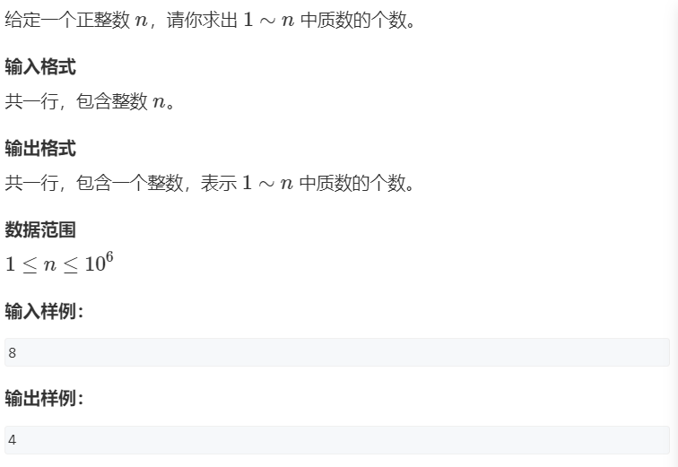

```java
package _05_数学._01_质数;
// 提交状态：AC
/*
输入
8
输出
4
 */
import java.io.BufferedReader;
import java.io.BufferedWriter;
import java.io.IOException;
import java.io.InputStreamReader;
import java.io.OutputStreamWriter;
import java.io.PrintWriter;

public class _03_质数筛{
 static Result getPrimes(int n) {
  int primes[] = new int[n+1],cnt=0;
  boolean remove[] = new boolean[n+1];
  for(int i=2;i<=n;i++) {
   if(!remove[i]) primes[cnt++]=i;
   for(int j=0,p=primes[j];p<=n/i;j++,p=primes[j]) {
    remove[p*i]=true;
    if(i%p==0) break;
   }
  }
  return new Result(primes, cnt);
 }
 public static void main(String[] args) {
  int n = nextInt();
  Result res = getPrimes(n);
//  for(int i=0;i<res.len;i++) {
//   if(i!=0)printer.print(" ");
//   printer.print(res.data[i]);
//  }
  printer.print(res.len);
  printer.flush();
 }
 static class Result{
  int[] data;
  int len;
  public Result(int[] data, int len) {
   this.data = data;
   this.len = len;
  }
 }
 static BufferedReader reader = new BufferedReader(new InputStreamReader(System.in));
 static BufferedWriter writer = new BufferedWriter(new OutputStreamWriter(System.out));
 static PrintWriter printer = new PrintWriter(writer);
 static String[] tokens=null;
 static int idx=0;
 static void nextToken() {
  idx++;
  if(tokens==null||idx==tokens.length) {
   try {
    tokens = reader.readLine().split(" ");
   } catch (IOException e) {
    // TODO 自动生成的 catch 块
    e.printStackTrace();
   }
   idx=0;
  }
 }
 static int nextInt() {
  nextToken();
  return Integer.parseInt(tokens[idx]);
 }
 static String nextStr() {
  nextToken();
  return tokens[idx];
 }
 
}
```

### _02_约数

#### _01_试除法求约数


```java
package _05_数学._02_约数;

import java.io.BufferedReader;
import java.io.BufferedWriter;
import java.io.IOException;
import java.io.InputStreamReader;
import java.io.OutputStreamWriter;
import java.io.PrintWriter;
import java.util.ArrayList;
import java.util.Collections;

public class _01_试除法求约数 {
 static ArrayList<Integer> getDivisors(int n) {
  ArrayList<Integer> divisors = new ArrayList<>();
  for(int i=1;i<=n/i;i++) {
   if(n%i==0){
        divisors.add(i);
       if(n/i!=i) divisors.add(n/i);
   }
  }
  Collections.sort(divisors);
  return divisors;
 }
 public static void main(String[] args) {
  int n = nextInt();
  while(n--!=0) {
   int m = nextInt();
   ArrayList<Integer> res =  getDivisors(m);
   for(Integer d:res) {
    printer.print(d+" ");
   }
   printer.println();
  }
  printer.flush();
 }
 
 static BufferedReader reader = new BufferedReader(new InputStreamReader(System.in));
 static BufferedWriter writer = new BufferedWriter(new OutputStreamWriter(System.out));
 static PrintWriter printer = new PrintWriter(writer);
 static String[] tokens = null;
 static int idx=0;
 static int nextInt() {
  nextToken();
  return Integer.parseInt(tokens[idx]);
 }
 static String nextStr() {
  nextToken();
  return tokens[idx];
 }
 static long nextLon() {
  nextToken();
  return Long.parseLong(tokens[idx]);
 }
 static void nextToken() {
  idx++;
  if(tokens==null || idx==tokens.length) {
   try {
    tokens = reader.readLine().split(" ");
   } catch (IOException e) {
    // TODO 自动生成的 catch 块
    e.printStackTrace();
   }
   idx = 0;
  }
 } 
}
```

#### _02_求约数个数


```java
package _05_数学._02_约数;

import java.io.BufferedReader;
import java.io.BufferedWriter;
import java.io.IOException;
import java.io.InputStreamReader;
import java.io.OutputStreamWriter;
import java.io.PrintWriter;
import java.security.KeyStore.Entry;
import java.util.ArrayList;
import java.util.Collections;
import java.util.HashMap;

public class _02_求约数个数 {
 static long MOD = 1000000007;
 public static void main(String[] args) {
  int n = nextInt();
  HashMap<Integer, Integer> powmap = new HashMap<>();
  while(n--!=0) {
   int m = nextInt();
   for (int i = 2; i <=m/i; i++) {
    if(m%i==0) {
     int base=i;
     int pow=0;
     while(m%base==0) {
      m/=base;
      pow++;
     }
     if(!powmap.containsKey(base)) powmap.put(base, pow);
     else powmap.put(base, powmap.get(base)+pow);
    }
   }
   if(m>1) {
    if(!powmap.containsKey(m)) powmap.put(m, 1);
    else powmap.put(m, powmap.get(m)+1);
   }
  }
  long res=1;
  for(long pow:powmap.values()) {
   res=res*(pow+1)%MOD;
  }
  printer.println(res);
  printer.flush();
 }
 
 static BufferedReader reader = new BufferedReader(new InputStreamReader(System.in));
 static BufferedWriter writer = new BufferedWriter(new OutputStreamWriter(System.out));
 static PrintWriter printer = new PrintWriter(writer);
 static String[] tokens = null;
 static int idx=0;
 static int nextInt() {
  nextToken();
  return Integer.parseInt(tokens[idx]);
 }
 static String nextStr() {
  nextToken();
  return tokens[idx];
 }
 static long nextLon() {
  nextToken();
  return Long.parseLong(tokens[idx]);
 }
 static void nextToken() {
  idx++;
  if(tokens==null || idx==tokens.length) {
   try {
    tokens = reader.readLine().split(" ");
   } catch (IOException e) {
    // TODO 自动生成的 catch 块
    e.printStackTrace();
   }
   idx = 0;
  }
 } 
}
```

#### _03_约数之和


```java
package _05_数学._02_约数;
// 提交状态：AC
/*
 * 输入：
3
2
6
8
 * 输出：
252
 */
import java.io.BufferedReader;
import java.io.BufferedWriter;
import java.io.IOException;
import java.io.InputStreamReader;
import java.io.OutputStreamWriter;
import java.io.PrintWriter;
import java.util.HashMap;
import java.util.Map.Entry;

public class _03_求约数之和 {
 static int MOD = 1000000007;
 public static void main(String[] args) {
  int n = nextInt();
  HashMap<Integer, Integer> powMap = new HashMap<>();// 因为a的范围只在1~100之间，那么其质因数也必然在这个范围内
  while(n--!=0) {
   int a = nextInt();
   for(int i=2;i<=a/i;i++) {
    if(a%i==0) {
     int base = i;
     int pow = 0;
     while(a%i==0) {
      a/=i;
      pow++;
     }
     if(!powMap.containsKey(base)) powMap.put(base, pow);
     else powMap.put(base, powMap.get(base)+pow);
    }
   }
   if(a>1) {
    if(!powMap.containsKey(a)) powMap.put(a, 1);
    else powMap.put(a, powMap.get(a)+1);
   }
  }
  long res = 1;
  for(Entry<Integer, Integer> entry:powMap.entrySet()) {
   int base = entry.getKey();
   int pow = entry.getValue();
   long k = 1;
   while(pow--!=0) k = (k*base+1)%MOD;
   res=res*k%MOD;
  }
  printer.println(res);
  printer.flush();
 }
 
 static BufferedReader reader = new BufferedReader(new InputStreamReader(System.in));
 static BufferedWriter writer = new BufferedWriter(new OutputStreamWriter(System.out));
 static PrintWriter printer = new PrintWriter(writer);
 static String[] tokens = null;
 static int idx=0;
 static int nextInt() {
  nextToken();
  return Integer.parseInt(tokens[idx]);
 }
 static String nextStr() {
  nextToken();
  return tokens[idx];
 }
 static long nextLon() {
  nextToken();
  return Long.parseLong(tokens[idx]);
 }
 static void nextToken() {
  idx++;
  if(tokens==null || idx==tokens.length) {
   try {
    tokens = reader.readLine().split(" ");
   } catch (IOException e) {
    // TODO 自动生成的 catch 块
    e.printStackTrace();
   }
   idx = 0;
  }
 } 
}
```

#### _04_欧几里得算法求最大公约数


```java
package _05_数学._02_约数;
// 提交状态：AC
/*
 * 输入：
2
3 6
4 6
 * 输出：
3
2
 */
import java.io.BufferedReader;
import java.io.BufferedWriter;
import java.io.IOException;
import java.io.InputStreamReader;
import java.io.OutputStreamWriter;
import java.io.PrintWriter;
import java.util.HashMap;
import java.util.Map.Entry;

public class _04_求最大公约数 {
 static int gcd(int a,int b) {
  return b==0? a:gcd(b, a%b);
 }
 public static void main(String[] args) {
  int n=nextInt();
  while(n--!=0) {
   int a=nextInt(),b=nextInt();
   printer.println(gcd(a, b));
  }
  printer.flush();
 }
 static BufferedReader reader = new BufferedReader(new InputStreamReader(System.in));
 static BufferedWriter writer = new BufferedWriter(new OutputStreamWriter(System.out));
 static PrintWriter printer = new PrintWriter(writer);
 static String[] tokens = null;
 static int idx=0;
 static int nextInt() {
  nextToken();
  return Integer.parseInt(tokens[idx]);
 }
 static String nextStr() {
  nextToken();
  return tokens[idx];
 }
 static long nextLon() {
  nextToken();
  return Long.parseLong(tokens[idx]);
 }
 static void nextToken() {
  idx++;
  if(tokens==null || idx==tokens.length) {
   try {
    tokens = reader.readLine().split(" ");
   } catch (IOException e) {
    // TODO 自动生成的 catch 块
    e.printStackTrace();
   }
   idx = 0;
  }
 } 
}
```

### _03_快速幂

#### _01_快速幂


```java
package _05_数学._03_快速幂;
//提交状态：AC
/*
* 输入：
2
3 2 5
4 3 9
* 输出：
4
1
*/
import java.io.BufferedReader;
import java.io.BufferedWriter;
import java.io.IOException;
import java.io.InputStreamReader;
import java.io.OutputStreamWriter;
import java.io.PrintWriter;

public class _01_快速幂 {
 static long quickPow(int base,int pow,long MOD) {
  long t;
  if(pow==0) return 1;
  else if(pow%2==1) return base*quickPow(base, pow-1, MOD)%MOD;
  else return (t=quickPow(base, pow/2, MOD))*t%MOD;
 }
 public static void main(String[] args) {
  int n=nextInt();
  while(n--!=0) {
   int base=nextInt(),pow=nextInt(),mod=nextInt();
   printer.println(quickPow(base, pow, mod));
  }
  printer.flush();
 }
 static BufferedReader reader = new BufferedReader(new InputStreamReader(System.in));
 static BufferedWriter writer = new BufferedWriter(new OutputStreamWriter(System.out));
 static PrintWriter printer = new PrintWriter(writer);
 static String[] tokens = null;
 static int idx=0;
 static int nextInt() {
  nextToken();
  return Integer.parseInt(tokens[idx]);
 }
 static String nextStr() {
  nextToken();
  return tokens[idx];
 }
 static long nextLon() {
  nextToken();
  return Long.parseLong(tokens[idx]);
 }
 static void nextToken() {
  idx++;
  if(tokens==null || idx==tokens.length) {
   try {
    tokens = reader.readLine().split(" ");
   } catch (IOException e) {
    // TODO 自动生成的 catch 块
    e.printStackTrace();
   }
   idx = 0;
  }
 } 
}

```

#### _02_快速幂求逆元


```java
package _05_数学._03_快速幂;
//提交状态：AC
/*
* 输入：
3
4 3
8 5
6 3
* 输出：
1
2
impossible
*/
import java.io.BufferedReader;
import java.io.BufferedWriter;
import java.io.IOException;
import java.io.InputStreamReader;
import java.io.OutputStreamWriter;
import java.io.PrintWriter;

public class _02_快速幂求逆元 {
 static long quickPow(int base,int pow,long MOD) {
  long t;
  if(pow==0) return 1;
  else if(pow%2==1) return base*quickPow(base, pow-1, MOD)%MOD;
  else return (t=quickPow(base, pow/2, MOD))*t%MOD;
 }
 public static void main(String[] args) {
  int n=nextInt();
  while(n--!=0) {
   int a=nextInt(),p=nextInt();// 题目保证p是质数，但没保证a、p互质
//   求a的乘法逆元k=a^(-1)
//   a*a^(-1)≡1(mod p)
//   欧拉定理：a^φ(m)≡1(mod m)
//   费马定理：a^(p-1)≡1(mod p)    当（a、p互质,且p是质数）
//   所以：a * a^(p-2) ≡ 1 (mod p)
//   所以：k=a(p-2);
   if(a%p!=0) {// a、p互质
    printer.println(quickPow(a, p-2, p)); // 要求返回0~p-1之间的逆元就是说要对p取模
   }else {
    printer.println("impossible");
   }
  }
  printer.flush();
 }
 static BufferedReader reader = new BufferedReader(new InputStreamReader(System.in));
 static BufferedWriter writer = new BufferedWriter(new OutputStreamWriter(System.out));
 static PrintWriter printer = new PrintWriter(writer);
 static String[] tokens = null;
 static int idx=0;
 static int nextInt() {
  nextToken();
  return Integer.parseInt(tokens[idx]);
 }
 static String nextStr() {
  nextToken();
  return tokens[idx];
 }
 static long nextLon() {
  nextToken();
  return Long.parseLong(tokens[idx]);
 }
 static void nextToken() {
  idx++;
  if(tokens==null || idx==tokens.length) {
   try {
    tokens = reader.readLine().split(" ");
   } catch (IOException e) {
    // TODO 自动生成的 catch 块
    e.printStackTrace();
   }
   idx = 0;
  }
 } 
}

```

### _04_欧拉函数

#### _01_朴素求欧拉函数


```java
package _05_数学._04_欧拉函数;
//提交状态：AC
/*
* 输入：
3
3
6
8
* 输出：
2
2
4
*/
import java.io.BufferedReader;
import java.io.BufferedWriter;
import java.io.IOException;
import java.io.InputStreamReader;
import java.io.OutputStreamWriter;
import java.io.PrintWriter;

public class _01_欧拉函数 {
 //按欧拉函数的最原始定义：只统计1~n中和n互质的数的个数即可 φ(N)=N*(1-1/p_1)*(1-1/p_2)*...
 static int φ(int n) {
  int res=n;
  for(int i=2;i<=n/i;i++) {
   if(n%i==0) {
    while(n%i==0) n/=i;
//    res=res*(1-1/i);
//    res=res-res/i;
    res-=res/i;
   }
  }
  if(n>1) res-=res/n;
  return res;
 }
 public static void main(String[] args) {
  int n=nextInt();
  while(n--!=0) {
   int m = nextInt();
   printer.println(φ(m));
  }
  printer.flush();
 }
 static BufferedReader reader = new BufferedReader(new InputStreamReader(System.in));
 static BufferedWriter writer = new BufferedWriter(new OutputStreamWriter(System.out));
 static PrintWriter printer = new PrintWriter(writer);
 static String[] tokens = null;
 static int idx=0;
 static int nextInt() {
  nextToken();
  return Integer.parseInt(tokens[idx]);
 }
 static String nextStr() {
  nextToken();
  return tokens[idx];
 }
 static long nextLon() {
  nextToken();
  return Long.parseLong(tokens[idx]);
 }
 static void nextToken() {
  idx++;
  if(tokens==null || idx==tokens.length) {
   try {
    tokens = reader.readLine().split(" ");
   } catch (IOException e) {
    // TODO 自动生成的 catch 块
    e.printStackTrace();
   }
   idx = 0;
  }
 } 
}
```

#### _02_筛法求1[1,n]中每个数的欧拉函数


```java
package _05_数学._04_欧拉函数;
//提交状态：AC
/*
* 输入：
6
* 输出：
12
*/
import java.io.BufferedReader;
import java.io.BufferedWriter;
import java.io.IOException;
import java.io.InputStreamReader;
import java.io.OutputStreamWriter;
import java.io.PrintWriter;
import java.util.Arrays;

public class _02_筛法求欧拉函数 {
// 筛法求1~n中每个数的欧拉函数
 static int[] fai(int n) {
  int φ[] = new int[n+1];
  φ[1]=1;
  int primes[] = new int[n+1],cnt=0;
  boolean remove[] = new boolean[n+1];
  for(int i=2;i<=n;i++) {
   if(!remove[i]) {
    primes[cnt++]=i;
    φ[i]=i-1;// i是质数，则根据欧拉函数的计算公式1到i中和i互质的数是i*(1-1/i)=i-1个
   }
   for(int j=0,p=primes[j];p<=n/i;p=primes[++j]) {
    remove[p*i]=true;
    if(i%p==0) {
//     p*i是合数，且p是i的质因子，则i的质因数分解和i*p的质因数分解的底数应当是相同的，次数将会在p项上多1。
//     根据欧拉函数φ(p*i) = (p*i) * (1-1/p_1) * (1-1/p_2) * (1-1/p_3) * ... * (1-1/p_k);
//     即：φ(p*i) = p * φ(i);
     φ[p*i]=p * φ[i];
     break;
    }else {
//     p*i是合数，且p不是i的质因子，则p*i的质因数分解 和 i的质因数分解 相比，必然多一个p.
//     根据欧拉函数φ(p*i) = (p*i) * (1-1/p_1) * (1-1/p_2) * (1-1/p_3) * ... * (1-1/p_k) * (1-1/p);
//     即：φ(p*i) = p * φ(i) * (1-1/p);
//     即：φ(p*i) = (p-1) * φ(i);
     φ[p*i]= (p-1) * φ[i];
    }
   }
  }
  return φ;
 }
 public static void main(String[] args) {
  int m = nextInt();
  int φ[] = fai(m);
  long res = 0;
  for(int p:φ) {
   res+=p;
  }
  printer.println(res);
  printer.flush();
 }
 static BufferedReader reader = new BufferedReader(new InputStreamReader(System.in));
 static BufferedWriter writer = new BufferedWriter(new OutputStreamWriter(System.out));
 static PrintWriter printer = new PrintWriter(writer);
 static String[] tokens = null;
 static int idx=0;
 static int nextInt() {
  nextToken();
  return Integer.parseInt(tokens[idx]);
 }
 static String nextStr() {
  nextToken();
  return tokens[idx];
 }
 static long nextLon() {
  nextToken();
  return Long.parseLong(tokens[idx]);
 }
 static void nextToken() {
  idx++;
  if(tokens==null || idx==tokens.length) {
   try {
    tokens = reader.readLine().split(" ");
   } catch (IOException e) {
    // TODO 自动生成的 catch 块
    e.printStackTrace();
   }
   idx = 0;
  }
 } 
}
```

### _05_同余

#### _01_扩展欧几里得算法


```java
package _05_数学._05_同余;
// 提交状态：AC
/*
输入：
2
4 6
8 18
输出：
-1 1
-2 1
 */
import java.io.BufferedReader;
import java.io.BufferedWriter;
import java.io.IOException;
import java.io.InputStreamReader;
import java.io.OutputStreamWriter;
import java.io.PrintWriter;

public class _01_扩展欧几里得算法 {
 static class R{
  int x,y,gcd;
  public R(int x, int y, int gcd) {
   this.x = x;
   this.y = y;
   this.gcd = gcd;
  }
 }
 static R extGcd(int a,int b) {
  if(b==0) return new R(1,0,a);//  1*a + 0*b = gcd = a
  else {
   R r = extGcd(b, a%b);
   int x = r.x,y=r.y,gcd=r.gcd;
//   x * b + y * a%b = gcd
//   x * b + y * (a-[a/b]*b) = gcd
//   x * b + (y * a - y * [a/b]*b) = gcd
//   y * a + (x - y * [a/b]) * b  = gcd
   return new R(y,x-y*(a/b),gcd);// 注意（a/b）要加括号，因为要下取整
  }
 }
 public static void main(String[] args) {
  int n = nextInt();
  while(n--!=0) {
   int a =nextInt(),b=nextInt();
   R r = extGcd(a, b);
   print.println(r.x+" "+r.y);
  }
  print.flush();
 }
 
 
 
 
 
 static BufferedReader reader = new BufferedReader(new InputStreamReader(System.in));
 static BufferedWriter writer = new BufferedWriter(new OutputStreamWriter(System.out));
 static PrintWriter print = new PrintWriter(writer);
 static String[] tokens;
 static int idx=0;
 static void nextToken() {
  idx++;
  if(tokens==null||idx==tokens.length) {
   try {
    tokens=reader.readLine().split(" ");
   } catch (IOException e) {
    e.printStackTrace();
   }
   idx=0;
  }
 }
 static int nextInt() {
  nextToken();
  return Integer.parseInt(tokens[idx]);
 }
 static long nextLon() {
  nextToken();
  return Long.parseLong(tokens[idx]);
 }
 static String nextStr() {
  nextToken();
  return tokens[idx];
 }
}
```

#### _02_扩展欧几里得算法解线性同余方程


```java
package _05_数学._05_同余;
// 提交状态：AC
/*
输入样例：
2
2 3 6
4 3 5
输出样例：
impossible
-3
 */
import java.io.BufferedReader;
import java.io.BufferedWriter;
import java.io.IOException;
import java.io.InputStreamReader;
import java.io.OutputStreamWriter;
import java.io.PrintWriter;

public class _02_扩展欧几里得算法解线性同余方程 {
 static class R{
  int x,y,gcd;
  public R(int x, int y, int gcd) {
   this.x = x;
   this.y = y;
   this.gcd = gcd;
  }
 }
 static R extGcd(int a,int b) {
  if(b==0) return new R(1,0,a);//  1*a + 0*b = gcd = a
  else {
   R r = extGcd(b, a%b);
   int x = r.x,y=r.y,gcd=r.gcd;
//   x * b + y * a%b = gcd
//   x * b + y * (a-[a/b]*b) = gcd
//   x * b + (y * a - y * [a/b]*b) = gcd
//   y * a + (x - y * [a/b]) * b  = gcd
   return new R(y,x-y*(a/b),gcd);// 注意（a/b）要加括号，因为要下取整
  }
 }
 public static void main(String[] args) {
  int n = nextInt();
  while(n--!=0) {
   int a =nextInt(),b=nextInt(),m=nextInt();
//   a * x ≡ b (mod m)
//   a*x mod m = b mod m
//   a*x - j * m = b - k * m
//   a*x + (k - j) * m = b
//   x*a + y*m = b
   R r = extGcd(a, m);
   if(b%r.gcd==0) print.println(((long)r.x)*(b/r.gcd)%m); // 记得乘以(b/gcd) 记得取余
   else print.println("impossible");
  }
  print.flush();
 }
 
 
 
 
 
 static BufferedReader reader = new BufferedReader(new InputStreamReader(System.in));
 static BufferedWriter writer = new BufferedWriter(new OutputStreamWriter(System.out));
 static PrintWriter print = new PrintWriter(writer);
 static String[] tokens;
 static int idx=0;
 static void nextToken() {
  idx++;
  if(tokens==null||idx==tokens.length) {
   try {
    tokens=reader.readLine().split(" ");
   } catch (IOException e) {
    e.printStackTrace();
   }
   idx=0;
  }
 }
 static int nextInt() {
  nextToken();
  return Integer.parseInt(tokens[idx]);
 }
 static long nextLon() {
  nextToken();
  return Long.parseLong(tokens[idx]);
 }
 static String nextStr() {
  nextToken();
  return tokens[idx];
 }
}

```

### _06_中国剩余定理

#### _01_曹冲养猪：中国剩余定理模板题


```java
package _05_数学._06_中国剩余定理;
// 提交状态：AC
/*
输入样例：
3
3 1
5 1
7 2
输出样例：
16

解释:
// x≡a_i (mod m_i)
// a_i: 1 1 2
// m_i: 3 5 7
//
// M = ∏ m_i
//   = 3 * 5 * 7 = 105
//
// M_i = M/m_i
// M_1 = M/m_i = 105/3 = 35         
// M_2 = M/m_i = 105/5 = 21         
// M_3 = M/m_i = 105/7 = 15 
//         
// M_i * M_i^(-1) ≡ 1 (MOD m_i) 要用扩展欧几里得算法求，因为题目不保证m_i是质数
//
// 以下使用费马定理求，是因为这里的m_i正好是质数
// M_i^(-1) = M_i^(m_i-2) (MOD m_i) 
// M_1^(-1) = M_1^(3-2) (MOD 3) = 35^1 MOD 3 = 35 MOD 3 = 2
// M_2^(-1) = M_2^(5-2) (MOD 5) = 21^3 MOD 5 = 9261 MOD 5 = 1
// M_3^(-1) = M_3^(7-2) (MOD 7) = 15^5 MOD 7 = 759375 MOD 7 = 1
//
// x的计算
// x= ∑ a_i * M_i * M_i(-1) MOD M
//  = 1*35*2+1*21*1+2*15*1 MOD M
//  = 121 MOD 105
//  = 16
 */
import java.io.BufferedReader;
import java.io.BufferedWriter;
import java.io.IOException;
import java.io.InputStreamReader;
import java.io.OutputStreamWriter;
import java.io.PrintWriter;

public class _01_曹冲养猪_中国剩余定理 {
 static long qickPow(long base,long pow) {
  long t;
  if(pow==0) return 1;
  else if(pow%2==1) return base * qickPow(base, pow-1);
  else return (t=qickPow(base, pow/2))*t;
 }
 static long qickPowMOD(long base,long pow,long MOD) {
  long t;
  if(pow==0) return 1%MOD;
  else if(pow%2==1) return base * qickPowMOD(base, pow-1, MOD)%MOD;
  else return (t=qickPowMOD(base, pow/2, MOD))*t%MOD;
 }
 static class R{
  long x,y,gcd;
  public R(long x, long y, long gcd) {
   this.x = x;
   this.y = y;
   this.gcd = gcd;
  }
 }
 static R exGcd(long a,long b) {
  if(b==0) return new R(1,0,a);
  else {
   R r = exGcd(b, a%b);
   long x=r.x,y=r.y,gcd=r.gcd;
//   推导过程：
//   x * b + y * (a%b) = gcd
//   x * b + y * (a-[a/b]*b) = gcd
//   x * b + y * a - y*[a/b]*b = gcd
//   y * a + x * b - y*[a/b]*b = gcd
//   y * a + (x - y*[a/b])*b = gcd
   return new R(y,x-y*(a/b),gcd);
  }
 }
 public static void main(String[] args) {
  int n = nextInt();
  long M = 1;
  long M_[] = new long[n];
  long M_ni[] = new long[n];
  long m_[] = new long[n];
  long a_[] = new long[n];
  for(int i=0;i<n;i++) {
   m_[i]=nextLon();
   a_[i]=nextLon();
//   x ≡ a_i*(mod m_i) 
   M*=m_[i];// M = ∏ m_i 
//   x = ∑ a_i*M_i*M_i^(-1)
  }

  long x=0;
  for(int i=0;i<n;i++) {
   M_[i]=M/m_[i];
   
//   费马定理快速幂求逆元：
//   使用该定理要保证m[i]是质数，且M_[i]和m[i]互质，这里用这种方法无法通过，因为题目没有保证m[i]是质数，实际的测试数据中的m[i]存在不是质数的情况
//   M_ni[i]=qickPowMOD(M_[i], m_[i]-2,m_[i]);
   
//   扩展欧几里得算法求逆元：
//   M_i * M_i^(-1) ≡ 1 (MOD m_i)
//   M_i * M_i^(-1) MOD m_i = 1
//   M_i * M_i^(-1) - k *  m_i = 1
   R r = exGcd(M_[i], m_[i]); // 使用扩展
   M_ni[i]= (((r.x * r.gcd)%m_[i])+m_[i])%m_[i]; // 求逆元，因为要防止出现负数
   
   x+=a_[i]*M_[i]*M_ni[i];
   x%=M;
  }
   print.println(x);
  print.flush();
 }

 
 
 
 
 
 
 
 
 
 
 
 
 static BufferedReader reader = new BufferedReader(new InputStreamReader(System.in));
 static BufferedWriter writer = new BufferedWriter(new OutputStreamWriter(System.out));
 static PrintWriter print = new PrintWriter(writer);
 static String[] tokens;
 static int idx=0;
 static void nextToken() {
  idx++;
  if(tokens==null||idx==tokens.length) {
   try {
    tokens=reader.readLine().split(" ");
   } catch (IOException e) {
    e.printStackTrace();
   }
   idx=0;
  }
 }
 static int nextInt() {
  nextToken();
  return Integer.parseInt(tokens[idx]);
 }
 static long nextLon() {
  nextToken();
  return Long.parseLong(tokens[idx]);
 }
 static String nextStr() {
  nextToken();
  return tokens[idx];
 }
}

```

### _08_高斯消元

#### _01_高斯消元法求线性方程组


```java
package _05_数学._08_高斯消元;
// 提交状态：AC
/*
输入样例：
3
1.00 2.00 -1.00 -6.00
2.00 1.00 -3.00 -9.00
-1.00 -1.00 2.00 7.00
输出样例：
1.0
-2.0
3.0

解释:

 */
import java.io.BufferedReader;
import java.io.BufferedWriter;
import java.io.IOException;
import java.io.InputStreamReader;
import java.io.OutputStreamWriter;
import java.io.PrintWriter;

public class _01_高斯消元解线性方程组 {
 static double eps = 1e-6;
 static int gauss(double [][] m) {
//  debug(m);
  int col=0,row=0;
  for(;row<m.length&&col<m[row].length;col++) {
   int t=row;
   for(int i=row;i<m.length;i++) if(m[t][col]<m[i][col]) t=i;
   if(t!=row) for(int i=0;i<m[row].length;i++) {double temp=m[t][i];m[t][i]=m[row][i];m[row][i]=temp;}
//   debug(m);
   if(Math.abs(m[row][col])<=eps) continue;
   for(int i=m[row].length-1;0<=i;i--) m[row][i]/=m[row][col];
//   debug(m);
   for(int i=row+1;i<m.length;i++){
    if(Math.abs(m[i][col])<=eps) continue;
    for(int j=m[i].length-1;0<=j;j--)
     m[i][j]-=m[row][j]*m[i][col];
   }
//   debug(m);
   row++;
  }
  if(row==m.length) {
   for(int r=m.length-2;0<=r;r--) {
    for(int c=r+1;c<m.length;c++) {
     m[r][m.length]-=m[r][c]*m[c][m.length];
     m[r][c]=0;
    }
   }
   return 0;
  }else {
   for (int i = row; i < m.length; i++) {
    if(Math.abs(m[i][m.length])<eps) return 1; // 0x == 0 
   }
   return 2;
  }
 }
 static void debug(double[][] m) {
  for(int i=0;i<m.length;i++) {
   for (int j = 0; j < m[i].length; j++) {
    print.print(m[i][j]+" ");
   }
   print.println();
  }
  print.println();
 }
 public static void main(String[] args) {
  int n=nextInt();
  double[][] m = new double[n][n+1];
  for(int i=0;i<m.length;i++) {
   for (int j = 0; j < m[i].length; j++) {
    m[i][j]=nextDub();
   }
  }
  int res =gauss(m);
  if(res==0) {
   for(int i=0;i<m.length;i++) print.printf("%.2f\n",m[i][m.length]);
  }else if(res==1) {
   print.println("Infinite group solutions");
  }else {
   print.println("No solution");
  }
  print.flush();
 }

 
 
 
 
 
 
 
 
 
 
 
 
 static BufferedReader reader = new BufferedReader(new InputStreamReader(System.in));
 static BufferedWriter writer = new BufferedWriter(new OutputStreamWriter(System.out));
 static PrintWriter print = new PrintWriter(writer);
 static String[] tokens;
 static int idx=0;
 static void nextToken() {
  idx++;
  if(tokens==null||idx==tokens.length) {
   try {
    tokens=reader.readLine().split(" ");
   } catch (IOException e) {
    e.printStackTrace();
   }
   idx=0;
  }
 }
 static int nextInt() {
  nextToken();
  return Integer.parseInt(tokens[idx]);
 }
 static long nextLon() {
  nextToken();
  return Long.parseLong(tokens[idx]);
 }
 static double nextDub() {
  nextToken();
  return Double.parseDouble(tokens[idx]);
 }
 static String nextStr() {
  nextToken();
  return tokens[idx];
 }
}
```
