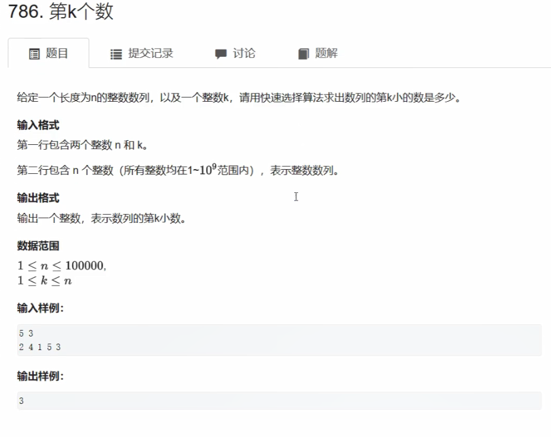

# ACwing算法基础课学习_习题课

## 目录

- [ACwing算法基础课学习\_习题课](#acwing算法基础课学习_习题课)
  - [目录](#目录)
  - [第一次习题课](#第一次习题课)
    - [快速排序扩展\_快速选择算法\_第k小数](#快速排序扩展_快速选择算法_第k小数)
    - [归并排序扩展\_求逆序对数量](#归并排序扩展_求逆序对数量)
    - [数的三次方根](#数的三次方根)

## 第一次习题课

### 快速排序扩展_快速选择算法_第k小数



```java
package _FF_习题课;

import java.io.BufferedInputStream;
import java.util.Scanner;
/*
5 3
2 4 1 5 3
*/
public class _01_第k小数 {
 public static void main(String[] args) {
  Scanner sc = new Scanner(new BufferedInputStream(System.in));
  int N = sc.nextInt();
  int K = sc.nextInt();
  int[] arr = new int[N];
  for (int i = 0; i < arr.length; i++) {
   arr[i]=sc.nextInt();
  }
  System.out.println(quickSort(arr, K-1));
 }
 static int quickSort(int[]arr,int k){
  return quickSort(arr, 0, arr.length-1, k);
 }
// 快速排序找到第k小数
 static int quickSort(int[] arr,int left,int right,int k) {
  if(left>=right)return arr[left];//本质就是二分查找
  int x=arr[left],i=left,L=left-1,R=right+1;
  while(i<R) {
   if(arr[i]<x) swap(arr,i++,++L);
   else if(arr[i]>x)swap(arr, i, --R);
   else i++;
  }
  if(k<=L) return quickSort(arr, left, L, k);
  else if(k>=R) return quickSort(arr, R, right, k);
  else return arr[k];// [L,R]之间的数是等于x的数，所以只写arr[k],也可以直接返回x，或者写arr[L+1] arr[R-1];
 }
 private static void swap(int[] arr, int i, int j) {
  if(i!=j) {
   arr[i]=arr[i]^arr[j];
   arr[j]=arr[i]^arr[j];
   arr[i]=arr[i]^arr[j];
  }
 }
}
```

### 归并排序扩展_求逆序对数量


```java
package _FF_习题课;

import java.io.BufferedInputStream;
import java.util.Scanner;
/*
6
2 3 4 5 6 1
5
 */
public class _02_逆序对 {
 public static void main(String[] args) {
  Scanner sc = new Scanner(new BufferedInputStream(System.in));
  int N = sc.nextInt();
  int[] arr = new int[N];
  for (int i = 0; i < arr.length; i++) {
   arr[i]=sc.nextInt();
  }
  System.out.println(mergeSort(arr, 0, arr.length-1));
 }
 static long mergeSort(int[] arr,int left,int right) {
  if(left>=right) return 0;
  int mid = left+(right-left)/2;
  long cnt = mergeSort(arr, left, mid) + mergeSort(arr, mid+1, right);
  int[] temp = new int[right-left+1];
  int i=left,j=mid+1,t=0;
  while(i<=mid&&j<=right)
   if(arr[i]<=arr[j]) {  temp[t++]=arr[i++];}
   else {cnt += mid-i+1; temp[t++]=arr[j++];}
  while(i<=mid) temp[t++]=arr[i++];
  while(j<=right) temp[t++]=arr[j++];
  for(t=0;t+left<=right;t++) arr[t+left]=temp[t];
  return cnt;
 }
}
```

### 数的三次方根

```java
package _FF_习题课;

import java.io.BufferedInputStream;
import java.util.Scanner;

public class _03_数的三次方根 {
 public static void main(String[] args) {
  Scanner sc = new Scanner(new BufferedInputStream(System.in));
  double n = sc.nextDouble();
  System.out.printf("%.6f",root(n));
  
 }
 static double root(double x) {
  double l=-1e4,r=1e4,mid;
  while(r-l>1e-8) {
   mid = l+(r-l)/2;
   if(mid*mid*mid<=x) l=mid;
   else r=mid;
  }
  return r;
 }
}
```
