# ACwing算法基础课学习_笔记

课程任务：

- 理解算法主要思想
- 理解模板代码，能默写，并调试通过
- 完成课后题目，删除重写，3~5遍

## 目录

- [ACwing算法基础课学习\_笔记](#acwing算法基础课学习_笔记)
  - [目录](#目录)
  - [基础算法](#基础算法)
    - [排序](#排序)
      - [快速排序](#快速排序)
      - [归并排序](#归并排序)
    - [二分](#二分)
      - [整数二分](#整数二分)
      - [浮点数二分](#浮点数二分)
    - [高精度](#高精度)
    - [前缀和与差分](#前缀和与差分)
      - [数组的前缀和](#数组的前缀和)
      - [矩阵的前缀和](#矩阵的前缀和)
      - [数组的差分](#数组的差分)
      - [矩阵的差分](#矩阵的差分)
    - [双指针算法](#双指针算法)
    - [位运算](#位运算)
      - [n的第 k bit](#n的第-k-bit)
      - [lowbit(x)操作](#lowbitx操作)
    - [离散化](#离散化)
    - [区间合并](#区间合并)
  - [数据结构](#数据结构)
    - [链表](#链表)
      - [静态单链表](#静态单链表)
      - [静态双链表](#静态双链表)
    - [栈](#栈)
    - [队列](#队列)
    - [单调栈](#单调栈)
    - [单调队列](#单调队列)
    - [KMP算法](#kmp算法)
    - [Trie树](#trie树)
    - [并查集](#并查集)
    - [堆](#堆)
    - [hash表](#hash表)
    - [字符串前缀hash法](#字符串前缀hash法)
    - [C++STL](#cstl)
      - [vector](#vector)
      - [pair](#pair)
      - [string](#string)
  - [搜索与图论](#搜索与图论)
    - [普通深度优先搜索](#普通深度优先搜索)
    - [宽度优先搜索](#宽度优先搜索)
    - [树与图的存储](#树与图的存储)
    - [树和图的统一存储实现方式](#树和图的统一存储实现方式)
    - [树与图的深度优先遍历](#树与图的深度优先遍历)
    - [树与图的宽度优先遍历](#树与图的宽度优先遍历)
    - [拓扑排序](#拓扑排序)
    - [最短路](#最短路)
      - [朴素Dijkstra算法](#朴素dijkstra算法)
        - [题目：Dijkstra求最短路](#题目dijkstra求最短路)
          - [邻接矩阵写法](#邻接矩阵写法)
          - [邻接表写法](#邻接表写法)
          - [图的模板写法](#图的模板写法)
      - [堆优化版的Dijkstra算法](#堆优化版的dijkstra算法)
        - [邻接表Dijkstra算法堆优化版写法](#邻接表dijkstra算法堆优化版写法)
        - [图的通用模板写法](#图的通用模板写法)
      - [Bellman-Ford算法](#bellman-ford算法)
      - [SPFA算法](#spfa算法)
      - [SPFA判断负环](#spfa判断负环)
      - [Floyd算法](#floyd算法)
    - [最小生成树](#最小生成树)
      - [Prim普利姆算法](#prim普利姆算法)
      - [Kruskal克鲁斯卡尔算法](#kruskal克鲁斯卡尔算法)
    - [二分图](#二分图)
      - [染色法](#染色法)
      - [匈牙利算法求最大匹配](#匈牙利算法求最大匹配)
  - [数学知识](#数学知识)
    - [质数](#质数)
      - [判断质数](#判断质数)
      - [分解质因数](#分解质因数)
      - [朴素筛法](#朴素筛法)
      - [埃氏筛法](#埃氏筛法)
      - [线性筛法](#线性筛法)
    - [约数](#约数)
      - [试除法求约数](#试除法求约数)
      - [约数个数](#约数个数)
      - [约数之和](#约数之和)
      - [欧几里得算法\_辗转相除法\_求最大公约数](#欧几里得算法_辗转相除法_求最大公约数)
    - [欧拉函数](#欧拉函数)
    - [求1~N中每个数的欧拉函数](#求1n中每个数的欧拉函数)
    - [欧拉定理](#欧拉定理)
    - [费马定理](#费马定理)
    - [快速幂](#快速幂)
    - [快速幂求逆元](#快速幂求逆元)
    - [扩展欧几里得算法](#扩展欧几里得算法)
    - [扩展欧几里得算法的应用：线性同余方程](#扩展欧几里得算法的应用线性同余方程)
    - [中国剩余定理](#中国剩余定理)
    - [高斯消元法](#高斯消元法)
    - [求组合数](#求组合数)
      - [方式1](#方式1)
    - [简单博弈论](#简单博弈论)

## 基础算法

- 排序
- 二分
- 高精度
- 前缀和与差分
- 双指针算法
- 位运算
- 离散化
- 区间合并

### 排序

- 快速排序
- 归并排序

#### 快速排序

> 快速排序主要思想是分治

**步骤**

- 取一个数作为分界点
  - 方法1：取左边数q[l]
  - 方法2：取右边数q[r]
  - 方法3：取中间数q[(l+r)/2]
  - 方法4：取随机数q[l+random()*(r-l)]
- 划分区间
  - 方法1：使得小于等于x的数在第一个区间，使得大于等于x的数在第二个区间
  - 方法2：使得小于x的在第一个区间，等于x的在第二个区间，大于x的在第三个区间
- 递归处理所划分出的区间

> 算法难点在于划分区间

**一种简单的划分区间的做法**  
开辟两个数组空间，扫描原数组，大于等于x的放第一个数组，小于x的放第二个数组，扫描完毕后，在依次把两数组中的数放回原数组

> c++中scanf比cin快  
> java中不要用scanner 要用BufferReader,速度相差20倍(真的吗？？？？)

**模板代码**

> 这个模板比赛不可能用到，面试可能用到。

```java
    static void quickSort(int[] arr, int l, int r) {
        if (l >= r) return;
        int x = arr[l], i = l - 1, j = r + 1;
        while(i<j){
            do i++; while(arr[i]<x);
            do j--; while(arr[j]>x);
            if(i<j) swap(arr, i, j);
        }
        quickSort(arr, l, j); quickSort(arr, j+1, r);
    }
```

**我的版本**

```java
    static void myQuickSort(int[] arr, int l, int r) {
        if (l >= r) return;
        int x = arr[l], i = l, L = l - 1, R = r + 1;
        while (i < R) {
            if(arr[i]<x) swap(arr, i++, ++L);
            else if(arr[i]>x) swap(arr, i, --R);
            else i++;
        }
        quickSort(arr, l, L); quickSort(arr, R, r);
    }
```

**算法时间复杂度: O(nLog(n))**

- 概率上，每次分界点取的位置是在一半的位置，能划分O(logN)次
- 每次划分操作花费O(N)


**算法稳定性：**

- 快速排序不具有稳定性，
- 要使其具有稳定性，需要让每个元素都不同，可以让每个元素变成双关键字`｛value:??,index:??｝`,
- 然后写`comparer()`函数，先根据value比较，当value相同时，再比较index即可。

```java
  int comparer(o1,o2){
      int k = o1.value-o2.value;
      if(k!=0) return k;
      else return o1.index-o2.index;
  }
```

#### 归并排序

> 归并排序主要思想是分治

**步骤**

- 确定分界点：直接以整个数组中间为界，一分为二，得left和right，
- 排序：递归排序left和right。
- 合并：合并两个有序表为一个有序表

**模板代码**

```java
    public static void mergeSort(int[] arr) {
        temp = new int[arr.length];
        mergeSort(arr, 0, arr.length - 1);
    }
    private static int[] temp;
    private static void mergeSort(int[] arr, int L, int R) {
        if (L >= R) return;
        int M = L + (R - L) / 2;
        mergeSort(arr, L, M); mergeSort(arr, M + 1, R);
        int k = 0, i = L, j = M + 1;
        while (i <= M && j <= R) {
            if(arr[i]<=arr[j]) temp[k++]=arr[i++];//  用`<=`小于等于是为了保证算法稳定性 
            else temp[k++] = arr[j++];
        }
        while(i<=M) temp[k++] = arr[i++];
        while(j<=R) temp[k++] = arr[j++];
        for(k=0;k+L<=R;k++) arr[k+L]=temp[k];
    }
```

**算法时间复杂度: O(nLog(n))**

- 每次划分一半，能划分O(logN)次
- 每次划分后合并操作的时间复杂度为O(N)


**稳定性**

- 归并排序具有稳定性

### 二分

- 整数二分
- 浮点数二分

**二分的本质并不是单调性**

- 有单调性的题目一定可以二分  
- 可以二分的题目不一定必须需要具有单调性

#### 整数二分

**整数二分的本质**

- 给定一个区间，整个区间可以被一分为二
- 可以找到一个性质，使得左边区间满足该性质，右边区间不满足该性质
    
- 二分就可以找到这个边界点
  - 可以找到边界的两个点，找这两个点用不同的代码模板
  - 这两个点，分别是满足条件的最大值，满足条件的最小值
  - 

**找满足条件的最大值的步骤**

- 找中间点 mid = (l+r+1)/2
  - 算式中有一个`+1`的原因是防止这种情况：
    - 若L和R相差1，比如说，L=0,R=1,那么mid=(L+R)/2=0==L
    - 这样的话若check(mid)==true,就会执行l=mid的更新操作，但是l和mid的值此时本就相等，也就是没有做任何更新就进入了下一次循环，这就会导致死循环。
    - 这这种情况产生的原因就是因为mid的计算是下取整的。
- 判断是否满足性质 if(check(mid))
  - true: 更新搜索范围：`[l,r] => [mid,r]` 即：l=mid   (包含mid)
  - false: 更新搜索范围: `[l,r] => [l,mid-1]` 即：r=mid-1 (不包含mid)
  - 

**找满足条件的最小值的步骤**

- 找中间点 mid = (l+r)/2
- 判断是否满足性质 if(check(mid))
  - true: 更新搜索范围：`[l,r] => [l,mid]` 即：r=mid   (包含mid)
  - false: 更新搜索范围: `[l,r] => [mid+1,r]` 即：l=mid+1 (不包含mid)
  - 

**模板代码**

```java
    static int bSearch_findMax(int l,int r){
        int mid;
        while(l<r){
            mid = l+(r-l)/2 + 1;
            if(check1(mid)) l=mid;
            else r=mid-1;
        }
        return l;
    }
    static int bSearch_findMin(int l,int r){
        int mid;
        while(l<r){
            mid = l+(r-l)/2;
            if(check2(mid)) r=mid;
            else l=mid+1;
        }
        return l;
    }
    static boolean check1(int x){ return true; } // 检查x是否满足某种性质
    static boolean check2(int x){ return true; } // 检查x是否满足某种性质
```

**做题步骤**

- 先写check()函数
- 思考check()返回true或false时，答案在哪一个区间，如何更新搜索范围

**案例题目**
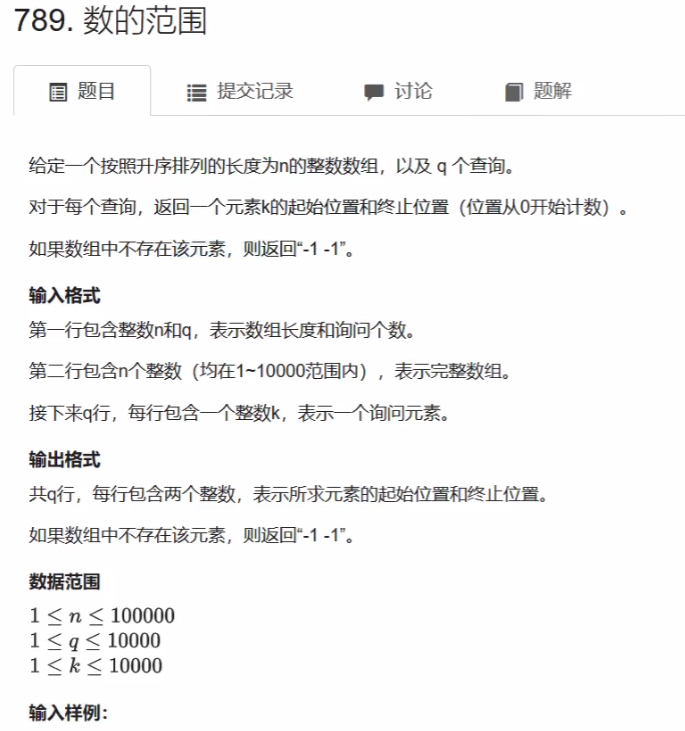


#### 浮点数二分

**模板**

```java
    static double bSearch(double r,double l){
        double mid;
        while(r-l>0.001){ // 精度控制，甚至可以直接for循环控制迭代次数。
            mid = l+(r-l)/2;
            if(check(mid))  r=mid; // 浮点数二分不需要考虑边界
            else l=mid;
        }
        return r;
    }

    static boolean check(double x) {return true;}// 检查x是否满足某种性质
```

**案例题目**

```java
    public static void main(String[] args) {
        System.out.println(bSearch_findSqRoot(100));// sqrt(10)=10.000000149011612
        System.out.println(bSearch_findSqRoot(2)); // sqrt(2)=1.4142141342163086
    }
    static double bSearch_findSqRoot(double x){
        double l = 0,r = Math.max(1,x),mid;
        while(r-l>0.000001){
            mid = l+(r-l)/2;
            if(mid*mid<=x) l=mid; // 浮点数二分不需要考虑边界
            else r=mid;  
        }
        return r;
    }
```

> **经验值**  
> 如果题目要求输出保留两位小数，精度控制写`while(r-l>0.0001)` 或 `while(r-l>1e-6)` 即比要求多两位，也可以更多，但不要太多

### 高精度
>
> 其实只要c++的要学，java自带这种API，python默认数位无限大。

> 面试考的不多，笔试偶尔会出现。

**常用情况**

- A+B 两大整数相加
- A-B 两大整数相减
- A*b 大整数乘小整数
- A/b 大整数除小整数
- A*B 两大整数-很难，不讲
- A/B 两大整数-更难，不讲
- 浮点数的情况基本用不上。

**加法模板**

```java
    private Vector<Integer> addAbs(Vector<Integer> a, Vector<Integer> b) {
        Vector<Integer> res = new Vector<>();
        int temp = 0;// 进位
        for (int i = 0; i < a.size() || i < b.size(); i++) {
            if (i < a.size()) temp += a.get(i);
            if (i < b.size()) temp += b.get(i);
            res.add(temp % 10);
            temp /= 10; 
        }
        if (temp == 1) res.add(1); // 考虑9+9+来自之前的进位1=19，也就是说进位最多是1
        return res;
    }
```

**减法模板**

```java
    private Vector<Integer> subAbs(Vector<Integer> a, Vector<Integer> b) {// a>b
        Vector<Integer> res = new Vector<>();
        int temp = 0;// 借位
        for (int i = 0; i < a.size(); i++) {
            temp = a.get(i) - temp;
            if (i < b.size())  temp -= b.get(i);// 减出来的就是结果，可能为负
            res.add((temp + 10) % 10);// temp可能是负数，因为当前位的被减数可能不够减，所以直接给他加10,表示提前借位，然后取余
            if (temp < 0) temp = 1;// 是负数就说明下一次要借位
            else temp = 0;
        }
        while (res.size() != 1 && res.lastElement() == 0)
            res.remove(res.size() - 1); // 移除最高位的0
        return res;
    }
```

**大整数乘小整数模板**

```c++
// C = A * b, A >= 0, b >= 0
vector<int> mul(vector<int> &A, int b){
    vector<int> C;
    int t = 0;
    for (int i = 0; i < A.size() || t; i ++ ){
        if (i < A.size()) t += A[i] * b;
        C.push_back(t % 10);
        t /= 10;
    }
    while (C.size() > 1 && C.back() == 0) C.pop_back();
    return C;
}
作者：yxc
链接：https://www.acwing.com/blog/content/277/
来源：AcWing
著作权归作者所有。商业转载请联系作者获得授权，非商业转载请注明出处。
```

高精度除以低精度 —— 模板题 AcWing 794. 高精度除法

```c++
// A / b = C ... r, A >= 0, b > 0
vector<int> div(vector<int> &A, int b, int &r)
{
    vector<int> C;
    r = 0;// 余数
    for (int i = A.size() - 1; i >= 0; i -- ){// 完全模拟手算过程
        r = r * 10 + A[i];// 求新余数
        C.push_back(r / b);// 求商
        r %= b;// 求余
    }
    reverse(C.begin(), C.end());//翻转
    while (C.size() > 1 && C.back() == 0) C.pop_back();// 去除0
    return C;
}
作者：yxc
链接：https://www.acwing.com/blog/content/277/
来源：AcWing
著作权归作者所有。商业转载请联系作者获得授权，非商业转载请注明出处。
```

**高精度大整数带正负号加减法的实现**

```java
import java.io.BufferedInputStream;
import java.util.Scanner;
import java.util.Stack;
import java.util.Vector;

public class _05_高精度整数 {
    public static void main(String[] args) {
        Scanner sc = new Scanner(new BufferedInputStream(System.in));
        String a1 = sc.next();
        String a2 = sc.next();
        MyBigInteger n1 = new MyBigInteger(a1);
        MyBigInteger n2 = new MyBigInteger(a2);
        System.out.println("加法测试:"+n1.add(n2));
        System.out.println("减法测试:"+n1.sub(n2));
        System.out.println("乘法测试:"+new MyBigInteger(MyBigInteger.multAbs(n1.data, Integer.parseInt(a2))));
        System.out.println("除法测试:"+new MyBigInteger(MyBigInteger.divAbs(n1.data, Integer.parseInt(a2),null)));
    }
}

class MyBigInteger {
    boolean sign;
    Vector<Integer> data;

    MyBigInteger(String num) {
        data = new Vector<>();
        int start = num.length() - 1;
        int end = 0;
        if (num.charAt(0) == '-' || num.charAt(0) == '+') {
            this.sign = num.charAt(0) == '-';
            end++;
        }
        for (; end <= start; start--) {
            data.add(num.charAt(start) - '0');
        }
    }

    MyBigInteger(Vector<Integer> data) {
        this.data = data;
    }

    MyBigInteger(Vector<Integer> data, boolean sign) {
        this.sign = sign;
        this.data = data;
    }

    public int comp(MyBigInteger a, MyBigInteger b) {
        if (a.sign != b.sign)
            return b.sign ? 1 : -1; // 异号
        else
            return !a.sign ? compAbs(a.data, b.data) : -compAbs(a.data, b.data);// 符号相同,同正则绝对值越大值越大，同负则值越大值越小
    }

    public MyBigInteger add(MyBigInteger other) {
        if (this.sign == other.sign) {// 同号相加，绝对值相加，符号保持不变
            return new MyBigInteger(addAbs(this.data, other.data), this.sign);
        } else {// 异号相加，绝对值大的减绝对值小的，符号保持和绝对值大的一致
            if (compAbs(this.data, other.data) >= 0)
                return new MyBigInteger(subAbs(this.data, other.data), this.sign);
            else
                return new MyBigInteger(subAbs(other.data, this.data), other.sign);
        }
    }

    public MyBigInteger sub(MyBigInteger other) {
        return this.add(other.opposite());// 减一个数等于加这个数的相反数。
    }

    public MyBigInteger opposite() {// 相反数
        return new MyBigInteger(this.data, !this.sign);
    }

    // a>b 1
    // a==b 0
    // a<b -1
    private int compAbs(Vector<Integer> a, Vector<Integer> b) {
        if (a.size() != b.size())
            return a.size() > b.size() ? 1 : -1; // a>b
        for (int i = 0; i < a.size(); i++)
            if (a.get(i) != b.get(i))
                return a.get(i) > b.get(i) ? 1 : -1;// a>b
        return 0; // a==b
    }

    private static Vector<Integer> addAbs(Vector<Integer> A, Vector<Integer> B) {
        Vector<Integer> res = new Vector<>();
        int temp = 0;// 进位
        for (int i = 0; i < A.size() || i < B.size(); i++) {
            if (i < A.size())
                temp += A.get(i);
            if (i < B.size())
                temp += B.get(i);
            res.add(temp % 10);
            temp /= 10;
        }
        if (temp == 1)
            res.add(1); // 考虑9+9+来自之前的进位1=19，也就是说进位最多是1
        return res;
    }

    private static Vector<Integer> subAbs(Vector<Integer> A, Vector<Integer> B) {// a>b
        Vector<Integer> res = new Vector<>();
        int temp = 0;// 借位
        for (int i = 0; i < A.size(); i++) {
            temp = A.get(i) - temp;
            if (i < B.size())
                temp -= B.get(i);// 减出来的就是结果，可能为负
            res.add((temp + 10) % 10);// temp可能是负数，因为当前位的被减数可能不够减，所以直接给他加10,表示提前借位，然后取余
            if (temp < 0)
                temp = 1;// 是负数就说明下一次要借位
            else
                temp = 0;
        }
        while (res.size() != 1 && res.lastElement() == 0)
            res.remove(res.size() - 1); // 移除最高位的0
        return res;
    }

     static Vector<Integer> multAbs(Vector<Integer> A, int b) {// a>b
        Vector<Integer> res = new Vector<>();
        int temp = 0;// 进位
        for (int i = 0; i < A.size() || temp > 0; i++) {
            if (i < A.size()) temp += A.get(i) * b;
            res.add(temp % 10);
            temp /= 10;
        }
        while (res.size() != 1 && res.lastElement() == 0)
            res.remove(res.size() - 1); // 移除最高位的0
        return res;
    }
    static class myObject<T>{
        T val;// 封装一个引用对象
        myObject(T val){ this.val=val; }
    }
    static Vector<Integer> divAbs(Vector<Integer> A, int b, myObject<Integer> R) {// a>b
        Vector<Integer> res = new Vector<>();
        Stack<Integer> temp = new Stack<>();
        int r = 0;// 余数
        for (int i = A.size() - 1; 0 <= i; i--) {// 从最高位开始，模拟手算
            r = r * 10 + A.get(i);
            temp.push(r / b);// 为了实现反转
            r %= b;
        }
        while(!temp.isEmpty()){res.add(temp.pop());}// 反转，因为上一步是从最高位开始算的，结果也是从最高位开始，
        while (res.size() != 1 && res.lastElement() == 0)
            res.remove(res.size() - 1); // 移除最高位的0
        if(R!=null) R.val = r;
        return res;
    }

    @Override
    public String toString() {
        StringBuffer sb = new StringBuffer();
        if (sign)
            sb.append('-');
        for (int i = this.data.size() - 1; 0 <= i; i--)
            sb.append((char) ('0' + this.data.get(i)));
        return sb.toString();
    }
}
```

### 前缀和与差分

#### 数组的前缀和

> 前缀和与差分是一对逆运算

**什么是前缀和**

- 原数组: [a_1,a_2,a_3,a_4,...,a_n]
- 前缀和：[s_1,s_2,s_3,s_4,...,s_n]
  - 第i位的值：
    - s[i] = a[1]+a[2]+a[3]+...a[n]
    - s[0]=0 （定义这个零是为了处理边界）

**如何求前缀和**

- 如何求

    ```java
        s[0]=a[0];
        for(int i=1;i<n;i++){
            s[i]=s[i-1]+a[i];
        }
    ```

- 作用:
  - 快速求出原数组中一段数的和
  - `原数组区间[l,r]的和 == s[r] - s[l-1]`
    - `s[r] === a[1]+a[2]+...+a[l-1]+a[l]+...+a[r]`
    - `s[l-1] = a[1]+a[2]+...+a[l-1]`
    - `s[r] - s[l-1] 就是  a[l]+...+a[r]`
  - 如：
    - 求[1,2]的和，
    - 就是求:a1+a2
    - s_2 = a1+a2
    - s_0 = 0

<summary>

**题目：前缀和**
<details>

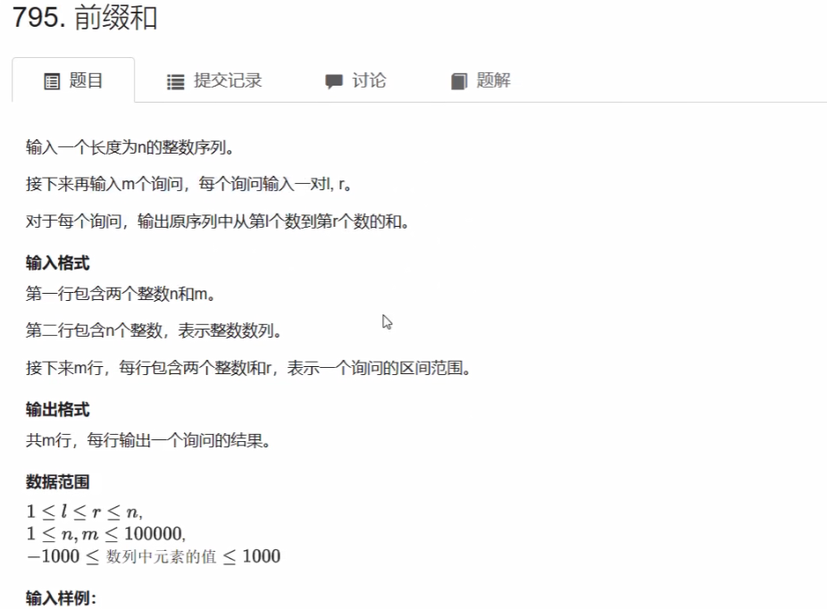

</details>
</summary>

**我的代码**

```java
package _01_基础算法;
import java.io.BufferedInputStream;
import java.util.Scanner;

public class _06_前缀和 {
    public static void main(String[] args) {
        Scanner sc = new Scanner(new BufferedInputStream(System.in));
        int N = sc.nextInt();// 数组长度
        int T = sc.nextInt();// 询问次数
        int[] arr = new int[N + 1];
        Prefix preFixSum = new Prefix();
        for (int i = 1; i < arr.length; i++) { // 以Index==1为起点读取数据
            arr[i] = sc.nextInt();
        }
        preFixSum.load(arr);

        while(T--!=0){
            int l=sc.nextInt();
            int r=sc.nextInt();
            System.out.println(preFixSum.getSum(l, r));
        }
    }
}

class Prefix{
    int[] preFixSum;
    Prefix(){};
    Prefix(int[] arr){
        this.load(arr);
    }
    void load(int[] arr){/* 传入num必须以1为起始坐标 */
        preFixSum = new int[arr.length];
        for (int i = 1; i < arr.length; i++) { // 以Index==1为起点
            preFixSum[i] = preFixSum[i - 1] + arr[i];
        }
    }
    int getSum(int l,int r){
        return preFixSum[r] - preFixSum[l-1];
    }
}
```

```
输入样例
5 3
2 1 3 6 4
1 2
1 3
2 4
输出样例
3
6
10
```

#### 矩阵的前缀和

矩阵面积前缀和的计算
> 矩阵面积的前缀和计算： $S_\text{粉} = S_蓝+S_绿-S_红 + 当前位置数字$  
> 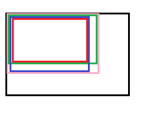

> 任意位置正方形面积的计算：$S_黄 = S_粉 - S_红 - S_绿 + S_蓝$  
> 

<sumary>  

**题目：子矩阵的和**

<details>


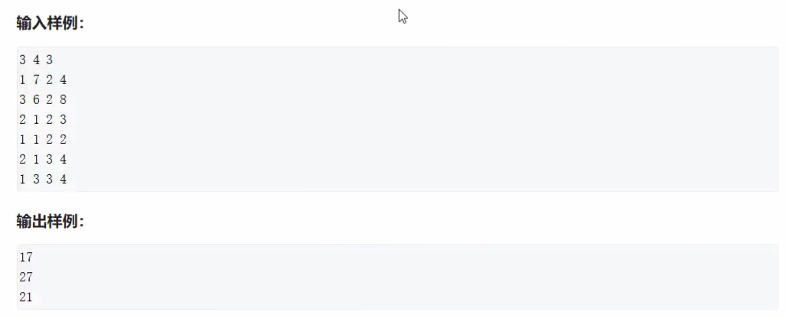

```
输入
3 4 3
1 7 2 4
3 6 2 8
2 1 2 3
1 1 2 2
2 1 3 4
1 3 3 4
输出
17
27
21
```

</details>
</sumary>

**我的代码**

```java
package _01_基础算法;

import java.io.BufferedInputStream;
import java.util.Scanner;

public class _07_前缀和_矩阵面积 {
    public static void main(String[] args) {
        Scanner sc = new Scanner(new BufferedInputStream(System.in));
        int N = sc.nextInt();// 矩阵行数
        int M = sc.nextInt();// 矩阵列数
        int T = sc.nextInt();// 询问次数
        int[][] matrix = new int[N + 1][M + 1];
        PrefixMatrix PrefixMatrixSum = new PrefixMatrix();
        for (int row = 1; row < matrix.length; row++) { // 以Index==1为起点读取数据
            for (int col = 1; col < matrix[row].length; col++) { // 以Index==1为起点读取数据
                matrix[row][col] = sc.nextInt();
            }
        }
        PrefixMatrixSum.load(matrix);

        while (T-- != 0) {
            int x1 = sc.nextInt();
            int y1 = sc.nextInt();
            int x2 = sc.nextInt();
            int y2 = sc.nextInt();
            System.out.println(PrefixMatrixSum.getSum(x1,y1,x2,y2));
        }
    }
}

class PrefixMatrix {
    int[][] preFixSum;
    PrefixMatrix() {};
    PrefixMatrix(int[][] matrix) {
        this.load(matrix);
    }
    void load(int[][] matrix) {// 求前缀和
        preFixSum = new int[matrix.length][matrix[0].length];
        for (int row = 1; row < matrix.length; row++) { // 以Index==1为起点
            for (int col = 1; col < matrix[0].length; col++) { // 以Index==1为起点
                preFixSum[row][col] = preFixSum[row - 1][col] + preFixSum[row][col - 1] - preFixSum[row - 1][col - 1] + matrix[row][col];
            }
        }
    }
    int getSum(int row1, int col1, int row2, int col2) {// 算子矩阵的和
        return preFixSum[row2][col2] - preFixSum[row2][col1-1] - preFixSum[row1-1][col2] + preFixSum[row1-1][col1-1];
    }
}
```

#### 数组的差分

> 差分是前缀和的逆运算。关系就像微分和积分

**构造差分数组**

- 如有原数组`[a_1,a_2,a_3,...,a_n]`
- 构造差分数组`[d_1,d_2,d_3,...,d_n]`,使得`a[i] = d[1]+d[2]+d[3]+...+d[i]`
- 构造步骤，
  - 方法1
    - d[1] = a[1]-a[0]
    - d[2] = a[2]-a[1]
    - d[3] = a[3]-a[2]
    - d[4] = a[4]-a[3]
    - ...
  - 方法2
    - 可以利用下面的性质3
    - 遍历原数组，执行以下操作
    - `d[i]=a[i];d[i+1]=-a[i];`
- 关系：
  - 数组A称为B的前缀和，B称为A的差分
  - **通过前缀和可以求出其差分，根据差分可以求出其前缀和**
  - 对差分数组求前缀和【O(N)】，就能得到原数组
- 一些性质（我认为的）
  - 1
    - 对差分数组中p位置的数`加上x`,d[p]+=x,
    - 那么由此计算出的原数组，`[a[1],a[2],...,a[p]+=x,a[p+1]+=x,...,a[p+m]+=x]`,
    - p位置及其之后的位置都将`加上x`。
  - 2
    - 对差分数组中p位置的数`减去x`,d[p]+=x,
    - 那么由此计算出的原数组，`[a[1],a[2],...,a[p]-=x,a[p+1]-=x,...,a[p+m]-=x]`,
    - p位置及其之后的位置都将`减去x`。
  - 3
    - 要在原数组的i位置`加上x`,只需要对差分数组的`d[i]+=x;d[i+1]-=x;`
    - 如图：
      - 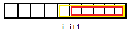
      - 对差分数组执行`d[i]+=x`
      - 将导致原数组（也就是其前缀和数组）的黄色区域的的数全部加上x
      - 对差分数组执行`d[i+1]-=x`
      - 将导致原数组（也就是其前缀和数组）的红色区域的的数全部减去x
      - 执行这两个操作后,相交部分的加法操作和减法操作抵消，
      - 原数组中将只有a[i]被加上x
  - 4
    - 要在原数组的[l,r]区间加上x,只需要对差分数组的`d[l]+=x;d[r+1]-=x;`
- **用处**
  - 如要在原数组中的区间`[l,r]`的元素全部`加上x`
  - 只需要在差分数组中的，`d[l]+=x;d[r+1]-=x`
  - 然后再对差分数组求前缀和，即可得到结果。

**题目：差分**
<summary>
<details>


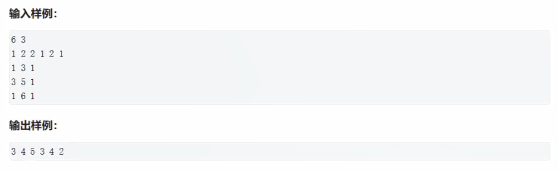

```
输入
6 3
1 2 2 1 2 1
1 3 1
3 5 1
1 6 1
输出
3 4 5 3 4 2
```

</details>
</summary>

**我的代码**

```java
package _01_基础算法;

import java.io.BufferedInputStream;
import java.util.Scanner;

/**
 * _08_差分
 */
public class _08_差分 {

    public static void main(String[] args) {
        Scanner sc = new Scanner(new BufferedInputStream(System.in));
        int N = sc.nextInt();
        int T = sc.nextInt();
        int[] arr = new int[N + 1];
        for (int i = 1; i <= N; i++) {
            arr[i] = sc.nextInt();
        }
        Differ differ = new Differ(arr);
        while (T-- != 0) {
            int l = sc.nextInt();
            int r = sc.nextInt();
            int x = sc.nextInt();
            differ.insert(l, r, x);// 在某区间插入x
        }
        int[] preFixSum = differ.toPreFix().preFixSum;// 获取原数组,获取到的会比原长度多1
        for (int i = 1; i <= N; i++) {// 不要是用preFixSum.length获取到的会比原长度多1
            System.out.printf("%d ",preFixSum[i]);
        }
    }
    static class Differ {
        int[] differ;
    
        Differ() {
        };
    
        Differ(int[] preFix) {
            load(preFix);
        }
    
        void load(int[] preFix) {
            differ = new int[preFix.length + 1];// 差分数组的长度要比原数组多1
            for (int i = 1; i < preFix.length; i++) {
                insert(i, i, preFix[i]); // 使用原数组构建差分数组。
            }
        }
    
        void insert(int l, int r, int num) {
            differ[l] += num;
            differ[r + 1] -= num;
        }
    
        Prefix toPreFix() {
            return new Prefix(this.differ);
        }
    }
    
    static class Prefix {
        int[] preFixSum;
    
        Prefix() {
        };
    
        Prefix(int[] arr) {
            this.load(arr);
        }
    
        void load(int[] arr) {/* 传入num必须以1为起始坐标 */
            preFixSum = new int[arr.length];
            for (int i = 1; i < arr.length; i++) { // 以Index==1为起点
                preFixSum[i] = preFixSum[i - 1] + arr[i];
            }
        }
    
        int getSum(int l, int r) {
            return preFixSum[r] - preFixSum[l - 1];
        }
    }
}
```

#### 矩阵的差分

> 矩阵的差分和数组的差分类似，原矩阵是差分矩阵的前缀和矩阵。

**差分矩阵的构造**

构造差分矩阵的过程，可以看做是在原矩阵中依次插入数的过程。

**差分矩阵的插入操作**

- 执行：`differ[i][j]+=x`操作后
- 对差分矩阵计算前缀和，
- 得到的矩阵就是在原矩阵的`preFix[i][j]`位置及其右下角的区域全部`加上x`

**差分矩阵的作用**

- 利用差分矩阵可以很快速的在原矩阵中的某一片区域同时加上一个数。
- 如要在原矩阵中的 **粉色区域**的数全部`加上x`
  - `{左上角：[row1,col1],右上角：[row2,col2]}`  **粉色区域**
- 则执行
  - `differ[row1][col1]+=x` **黄色区域**的数全部加x
  - `differ[row2+1][col1]-=x` **红色区域**的数全部减x
  - `differ[row1][col2+1]-=x` **绿色区域**的数全部减x
  - `differ[row2+1][col2+1]+=x` **蓝色区域**的数全部减x
  - 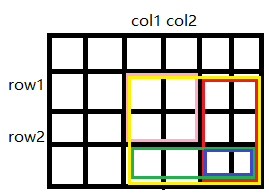

**题目：差分矩阵**

<summary>
<details>

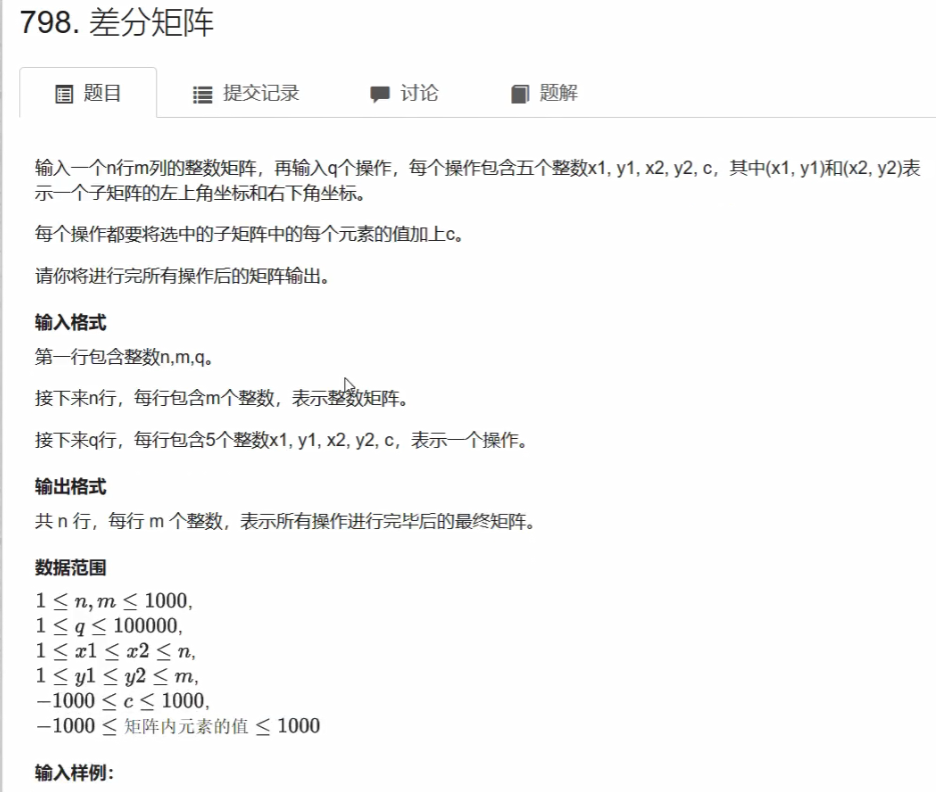
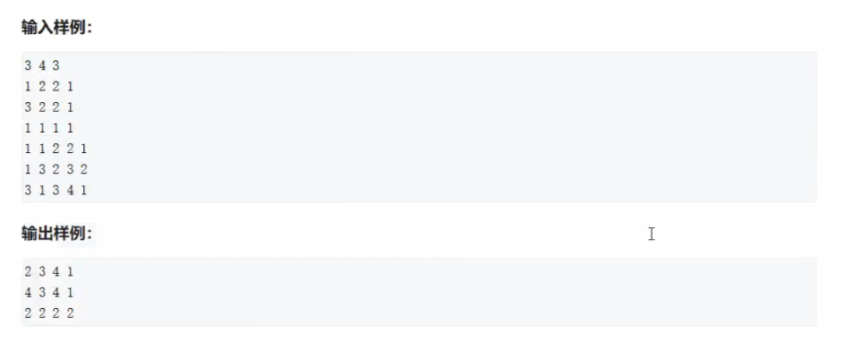

```
输入
3 4 3
1 2 2 1
3 2 2 1
1 1 1 1
1 1 2 2 1
1 3 2 3 2
3 1 3 4 1
输出
2 3 4 1
4 3 4 1
2 2 2 2
```

</details>
</summary>

**我的代码**

```java
package _01_基础算法;

import java.io.BufferedInputStream;
import java.util.Scanner;

public class _09_差分_矩阵的差分 {

    public static void main(String[] args) {
        Scanner sc = new Scanner(new BufferedInputStream(System.in));
        int N = sc.nextInt();
        int M = sc.nextInt();
        int T = sc.nextInt();
        int[][] matrix = new int[N + 1][M + 1];
        for (int row = 1; row <= N; row++) {
            for (int col = 1; col <= M; col++)
                matrix[row][col] = sc.nextInt();
        }
        DifferMatrix differ = new DifferMatrix(matrix);
        while (T-- != 0) {
            int y1 = sc.nextInt();
            int x1 = sc.nextInt();
            int y2 = sc.nextInt();
            int x2 = sc.nextInt();
            int num = sc.nextInt();
            differ.insert(y1, x1, y2, x2, num); // 在某区域插入x
        }
        int[][] preFixSum = differ.PrefixMatrix().preFixSum;// 获取原数组,获取到的会比原长度多1
        for (int row = 1; row <= N; row++) {
            for (int col = 1; col <= M; col++)
                System.out.printf("%d ",preFixSum[row][col]);
            System.out.println("");
        }
    }

    static class DifferMatrix {
        int[][] differMatrix;

        DifferMatrix() {
        };

        DifferMatrix(int[][] prefixMatrix) {
            load(prefixMatrix);
        }

        void load(int[][] prefixMatrix) {
            differMatrix = new int[prefixMatrix.length + 1][prefixMatrix[0].length + 1];// 差分数组的长度要比原数组多1
            for (int row = 1; row < prefixMatrix.length; row++) {
                for (int col = 1; col < prefixMatrix[row].length; col++) {
                    insert(row, col, row, col, prefixMatrix[row][col]); // 使用原数组构建差分数组。
                }
            }
        }

        void insert(int row1, int col1, int row2, int col2, int num) {
            differMatrix[row1][col1] += num;// 需要画图才能明白
            differMatrix[row2 + 1][col1] -= num;
            differMatrix[row1][col2 + 1] -= num;
            differMatrix[row2 + 1][col2 + 1] += num;// 被减了两次，所有要加上。
        }

        PrefixMatrix PrefixMatrix() {
            return new PrefixMatrix(this.differMatrix);
        }
    }

    static class PrefixMatrix {
        int[][] preFixSum;

        PrefixMatrix() {
        };

        PrefixMatrix(int[][] matrix) {
            this.load(matrix);
        }

        void load(int[][] matrix) {// 求前缀和
            preFixSum = new int[matrix.length][matrix[0].length];
            for (int row = 1; row < matrix.length; row++) { // 以Index==1为起点
                for (int col = 1; col < matrix[0].length; col++) { // 以Index==1为起点
                    preFixSum[row][col] = (preFixSum[row - 1][col]
                            + preFixSum[row][col - 1]
                            - preFixSum[row - 1][col - 1]
                            + matrix[row][col]);
                }
            }
        }

        int getSum(int row1, int col1, int row2, int col2) {// 算子矩阵的和
            return (preFixSum[row2][col2]
                    - preFixSum[row2][col1 - 1]
                    - preFixSum[row1 - 1][col2]
                    + preFixSum[row1 - 1][col1 - 1]);
        }
    }
}
```

### 双指针算法
>
> 归并排序中的合并两有序数组的算法就是双指针算法。

**分类**

- 第一类
  - 就是两个指针分别指向两个不同的数组。
  - 
  - 比如归并排序中的合并两有序数组的算法
- 第二类
  - 两个指针指向的是同一个数组
  - 比如快速排序中使得整个数组被划分成两个区间,第一个区间的数全部小于等于第二个区间数的过程。
  - 

**核心思想**：将O(N^2)级别的算法优化成O(N)

- O(N^2)级别算法

    ```java
        for(i=0;i<n;i++)
          for(j=0;j<n;j++)
            doSomeThing();
    ```

- 算法模板：O(N)级别算法

    ```java
        for(i=0,j=0;i<n;i++){
            while(j<n && check(i,j)) j++;
            doSomeThing();
        }
    ```

**做题步骤**

- 先写一个O(n^2)时间复杂度的算法（暴力解）。
- 然后再看i和j之间是否有某种单调关系
- 利用这种单调关系把枚举次数从O(n^2)优化为O(n)

**最简单的双指针算法的应用：单词按行输出、单词个数统计.**

将以空格分割的单词按行输出。

```java
package _01_基础算法;

import java.util.Arrays;
import java.util.Scanner;

public class _10_双指针_单词输出 {
    public static void main(String[] args) {
        Scanner sc = new Scanner(System.in);
        String words = sc.nextLine();
        for (int start = 0, end = 0; start < words.length(); start++) {
            end=start;
            while(end<words.length() && words.charAt(end)!=' ')end++;
            for (int idx = start; idx < end; idx++) 
                System.out.print(words.charAt(idx));
            System.out.println("");
            start=end;
        }
    }
}
```

**典型题:最长不重复子数组**

<summary>
<details>


**暴力做法**

```java
package _01_基础算法;

import java.io.BufferedInputStream;
import java.util.HashSet;
import java.util.Scanner;

public class _11_双指针_最长不重复连续子序列_暴力解 {
    public static void main(String[] args) {
        Scanner sc = new Scanner(new BufferedInputStream(System.in));
        int N = sc.nextInt();
        int ans = 0;
        int[] arr = new int[N];
        for (int i = 0; i < arr.length; i++)
            arr[i] = sc.nextInt();

        // 暴力遍历所有区间
        for (int start = 0; start < N; start++) {
            for (int end = start; end < N; end++) {
                if (check(arr, start, end)) {
                    ans = Math.max(ans, end - start + 1);
                }
            }
        }
        System.out.println(ans);
    }

    // 判断是否有重复数
    private static boolean check(int[] arr, int start, int end) {
        HashSet<Integer> set = new HashSet<>();
        for (int i = start; i <= end; i++) {
            if (set.contains(arr[i]))
                return false;
            else
                set.add(arr[i]);
        }
        return true;
    }
}
```

</details>
</summary>

**双指针做法**
> **这里的写法有问题**

```java
package _01_基础算法;

import java.io.BufferedInputStream;
import java.util.HashMap;
import java.util.HashSet;
import java.util.Hashtable;
import java.util.Scanner;
import java.util.TreeMap;

public class _12_双指针_最长不重复连续子序列_非暴力解 {
    public static void main(String[] args) {
        Scanner sc = new Scanner(new BufferedInputStream(System.in));
        int N = sc.nextInt();
        int ans = 0;
        int[] arr = new int[N];
        for (int i = 0; i < arr.length; i++)
            arr[i] = sc.nextInt();
        TreeMap<Integer, Integer> idxMap = new TreeMap<>(); // 有序hashMap

        for (int idxEnd = 0, idxStart = 0; idxEnd < N; idxEnd++) {
            if (!idxMap.containsKey(arr[idxEnd])) {
                // [ 1 2 3 4 5 4 6 7 8 ]
                // i-^
                // j---------^
                // 用hashMap记录数字5及其位置
                idxMap.put(arr[idxEnd], idxEnd);
            } else {
                // [ 1 2 3 4 5 4 6 7 8 ]
                // i-^
                // j-----------^
                // i指向1,j指向4时,
                // 会发现之前已经有一条4的记录
                // 记录第一个4的位置为k，
                // 吐出之前1~4的记录，
                // 然后i指向4的下一个位置,i=k+1，
                // 记录当前位置数4的位置
                int preIdx = idxMap.get(arr[idxEnd]); // 记录当前字符第一次出现的位置。
                while (idxMap.containsKey(arr[idxEnd]))
                    idxMap.pollFirstEntry();// 吐出arr[end]及其之前的所有记录
                idxMap.put(arr[idxEnd], idxEnd);// 将当前位置字符添加到记录中
                idxStart = preIdx + 1;// 下一个扫描起始位置就是第一个4的下一个位置。
            }
            ans = Math.max(ans, idxEnd - idxStart + 1);
        }
        System.out.println(ans);
    }
}
```

**AC写法**

```java
package _01_基础知识._07_双指针算法;

import java.io.BufferedReader;
import java.io.BufferedWriter;
import java.io.IOException;
import java.io.InputStreamReader;
import java.io.OutputStreamWriter;
import java.io.PrintWriter;
import java.io.StreamTokenizer;
import java.util.HashSet;
import java.util.LinkedList;
import java.util.Queue;
import java.util.Set;
import java.util.TreeMap;
/*
提交状态: AC
输入
10
9 3 6 9 5 10 1 2 3 9
输出
7
 * */

public class _01_最长连续不重复子序列_集合与队列 {
 public static void main(String[] args) {
  int N =nextInt();
  int arr[]=new int[N];
  int len = 0;
  for (int i = 0; i < arr.length; i++) arr[i]=nextInt();
  Set<Integer> set = new HashSet<>();
  Queue<Integer> queue = new LinkedList<>();
  for (int head = 0,tail=0; tail < arr.length;tail++) {
   if(!set.contains(arr[tail])) {
    set.add(arr[tail]);
    queue.add(tail);
   }
   else {
    while(set.contains(arr[tail])) {
     head = queue.poll();
     set.remove(arr[head]);
    }
    head+=1;
    set.add(arr[tail]);
    queue.add(tail);
   }
   len=Math.max(len, tail-head+1);
  }
  pw.print(len);
  pw.flush();
 } 
 static BufferedReader br = new BufferedReader(new InputStreamReader(System.in));
 static BufferedWriter bw = new BufferedWriter(new OutputStreamWriter(System.out));
 static StreamTokenizer st = new StreamTokenizer(br);
 static PrintWriter pw = new PrintWriter(bw);
 static int nextInt() {
  try {
   st.nextToken();
  } catch (IOException e) {
   // TODO 自动生成的 catch 块
   e.printStackTrace();
  }
  return (int) st.nval;
 }
 static String nextStr() {
  try {
   st.nextToken();
  } catch (IOException e) {
   // TODO 自动生成的 catch 块
   e.printStackTrace();
  }
  return st.sval;
 }
}

```

### 位运算

> 常用位运算操作

#### n的第 k bit

**步骤**

- 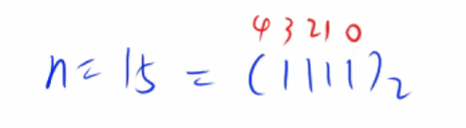
- 先把第k位移到最后一位：`n>>=k;`
- 然后看最高位是几`n&=1;`
- 总结就是 `(n>>k)&1`

**应用题：求某数的二进制表示**

<summary>

**输入输出**

<details>

```
输入
8
4
2
1
1024
255
256
```

```
输出
1000
100
10
1
10000000000
11111111
100000000
```

</details>
</summary>

```java
package _01_基础算法;

import java.io.BufferedInputStream;
import java.util.Scanner;
import java.lang.StringBuilder;

public class _13_位运算_求第k位的数 {
    public static void main(String[] args) {
        Scanner sc = new Scanner(new BufferedInputStream(System.in));
        while (true) {
            int num = sc.nextInt();
            System.out.println(getBits(num));
        }
    }

    static long getBit(long num, int k) {
        return (num >> k) & 1L;// 右移k位，然后与1
    }

    static String getBits(long num) {
        StringBuilder sb = new StringBuilder();
        for (int i = 0; num >= (1L << i); i++) // 注意这里的结束条件
            sb.append(getBit(num, i));
        sb.reverse();
        return sb.toString();
    }
}

```

#### lowbit(x)操作

> lowBit(x) 返回的是x的最后一位1是多少
> 如
>
> - $x==40==(101000)_2$
> - $lowBit(x) == (1000)_2 == 8$

**公式**

- `lowBit(x) = x&(~x+1)`
- `lowBit(x) = x(-x)` 负数就是补码表示，就是取反加1

**示例**

- `x ========= 1010...1000000000000...000000000`
- `~x ======== 0101...0111111111111...111111111`
- `~x+1 ====== 0101...1111111111111...111111111`
- `x&(~x+1) == 0000...1000000000000...000000000`
- 

**典型应用：统计x二进制表示中1的个数**

- x每次减去lowBit(x)
- 能减多少次就有多少位

**题目**

<summary>

<details>


```
输入
5
1 2 3 4 5
输出
1 1 2 1 2 
```

</details>
</summary>

```java
package _01_基础算法;

import java.io.BufferedInputStream;
import java.util.Scanner;

public class _14_位运算_lowBit操作_求某数的二进制表示中有多少位1 {
    public static void main(String[] args) {
        Scanner sc = new Scanner(new BufferedInputStream(System.in));
        int N = sc.nextInt();
        while(N--!=0){
            int num = sc.nextInt();
            int ans = 0;
            while(num!=0) {
                num-=lowBit(num);
                ans++;
            };
            System.out.printf("%d ",ans);
        }
    }
    static int lowBit(int x) {
        return x & (~x + 1);
    }
}
```

### 离散化

> 此处特指整数有序离散化

**什么是离散化**

- 有一数组，其元素值域特别大[-10^9,10^9]，但是元素个数却很稀疏不多[1,10^5]
  - 如：arr[] = [-10^9,200,3000,5000,8000,10^9]
- 但是有些题目又要以数组中的值来作为下标、位置。
  - 如：问将`[-10^9~10^9]`范围的随机数作为位置，在该位置加上一些随机数，然后问随机的某个区间的数的和是多少？
- 这就需要让原下标重映射到`[0,n-1]`的自然数(可以以映射到从1开始的位置)。
- 这个重映射的过程就是离散化
  - 
  - 如
    - arr[] = [-10^9,200,3000,5000,8000,10^9]
    - idx[-10^9] => 0
    - idx[1] =====> 1
    - idx[200] ===> 2
    - idx[3000] ==> 3
    - idx[5000] ==> 4
    - idx[8000] ==> 5
    - idx[10^9] ==> 6

**离散化的步骤**

- **排序去重：** a[]中的值代表位置，但是可能重复，所以要去重，保证其中的值是唯一的。
- **二分查找：** 找出a[i]所代表位置的离散化值，其实也就是其下标，由于数组是有序的，可以使用二分查找，时间复杂度为O(logN),也可以直接从头到尾搜索，但是时间复杂度将为O(N)。

**离散化典型题目**

<summary>
<details>

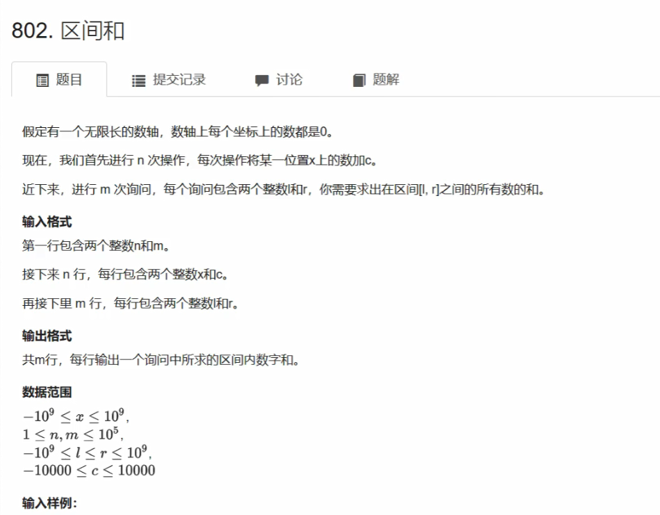

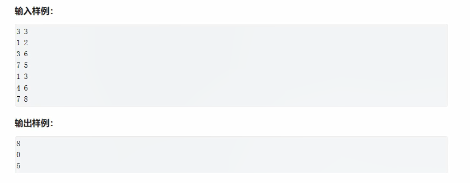

```
输入
3 3
1 2
3 6
7 5
1 3
4 6
7 8
输出
8
0
5
```

</details>
</summary>

> 做这种题关键是要对所有要用到的坐标都要做离散化。

```java
package _01_基础算法;

import java.io.BufferedInputStream;
import java.util.Arrays;
import java.util.LinkedList;
import java.util.List;
import java.util.Scanner;

public class _15_离散化_ {
    static class Info {
        int idx, val;
        public Info(int idx, int val) {
            this.idx = idx;
            this.val = val;
        }
    }

    static class Range {
        int left, right;
        public Range(int left, int right) {
            this.left = left;
            this.right = right;
        }
    }

    public static void main(String[] args) {
        Scanner sc = new Scanner(new BufferedInputStream(System.in));
        int N = sc.nextInt();// 数组元素个数
        int M = sc.nextInt();// 询问次数

        Info[] insertInfo = new Info[N];// 要插入的位置和值
        Range[] queryRange = new Range[M];// 要查询的区间
        
        // 记录所有坐标,包括执行插入操作和查询操作的坐标，后续要对所有这些要用到的坐标进行离散化处理
        Integer[] idxMap = new Integer[N + 2 * M];

        for (int i = 0; i < N; i++) {
            insertInfo[i] = new Info(sc.nextInt(), sc.nextInt());//记录插入位置和值
            idxMap[i] = insertInfo[i].idx;// 记录插入坐标
        }

        for (int i = 0, j = 0; i < M; i++, j += 2) {
            queryRange[i] = new Range(sc.nextInt(), sc.nextInt());// 记录查询范围
            idxMap[N + j] = queryRange[i].left;// 记录查询坐标
            idxMap[N + j + 1] = queryRange[i].right;// 记录查询坐标
        }

        Arrays.sort(idxMap);// 排序
        idxMap = getUniqueArray(idxMap);// 去重

        // 插入操作
        int[] data = new int[idxMap.length + 1];// 执行插入操作。
        for (int i = 0; i < insertInfo.length; i++) {
            // 找到离散化后的下标
            int realIdx = getIdx(idxMap, insertInfo[i].idx);
            data[realIdx] += insertInfo[i].val;
        }
        // 计算前缀和
        for (int i = 1; i < data.length; i++) {
            data[i] += data[i - 1];
        }

        // 处理查询操作
        for (int i = 0; i < M; i++) {
            int l = queryRange[i].left;
            int r = queryRange[i].right;
            int realL = getIdx(idxMap, l);// 找到离散化后的下标
            int realR = getIdx(idxMap, r);// 找到离散化后的下标
            int ans = data[realR] - data[realL - 1];
            System.out.println(ans);
        }
    }

    // 对排序后的数组去重
    static Integer[] getUniqueArray(Integer[] arr) {// arr必须排过序。
        List<Integer> list = new LinkedList<>();
        for (int i = 0; i < arr.length; i++) {
            // 1 1 2 2 2 3 3 4 4 5 5；不重复数的特征：第一个数，当前数和前一个数不同。
            if (i == 0 || arr[i] != arr[i - 1]) {
                list.add(arr[i]);
                // arr[j++]=arr[i];// 双指针，原地替换，但是要想办法记住其最终长度
            }
            // 1 3 7
            // 2 6 5
        }
        return list.toArray(new Integer[list.size()]);
    }

    // 离散化的核心代码,获取某个数的下标(重新映射)
    static int getIdx(Integer[] arr, int num) {// arr必须排序和去重。
        int l = 0, r = arr.length - 1, mid;
        while (l < r) {
            mid = l + (r - l) / 2;
            if (arr[mid] >= num)
                r = mid;
            else
                l = mid + 1;
        }
        return r + 1;// 也可以加上1，映射到[1,n]
    }
}
```

### 区间合并

**什么是区间合并**

- 将重叠和相交的区间合并为一个区间。
- 

**步骤**

- **排序:** 先按区间的起始位置排序。
- **合并:** 扫描所有区间，扫描过程中，把有交集的区间合并
  - 合并时只需要考虑三种情况，
  - 第一种情况就是后序区间在当前区间内部
    - 这种情况就继续搜索后序区间
  - 第二种情况就是后续区间和当前区间有相交或接壤
    - 这种情况就让当前维护的区间的右端点更新为后序区间的右端点
  - 第三种情况就是后续区间与当前没有任何交集。
    - 遇到这种情况，说明后续不可能会有能合并的区间了，
    - 就把当前维护的区间放入结果数组中，然后去维护下一个区间。
  - 

**题目:区间合并**

<summary>
<details>


```
输入
5
1 2
2 4
5 6
7 8
7 9
输出
3
```

</details>
</summary>

**第一种写法**

```java
package _01_基础算法;

import java.io.BufferedInputStream;
import java.lang.reflect.Array;
import java.util.Arrays;
import java.util.Collection;
import java.util.Collections;
import java.util.LinkedList;
import java.util.List;
import java.util.Scanner;

public class _16_区间合并_题解写法 {
    public static void main(String[] args) {
        Scanner sc = new Scanner(new BufferedInputStream(System.in));
        int N = sc.nextInt();
        LinkedList<Range> ranges = new LinkedList<Range>();
        for (int i = 0; i < N; i++) {
            int l = sc.nextInt(), r = sc.nextInt();
            ranges.push(new Range(l, r));
        }
        LinkedList<Range> merged = merge_(ranges);
        System.out.println(merged.size());
    }

    static LinkedList<Range> merge_(LinkedList<Range> ranges) {
        Collections.sort(ranges, (o1, o2) -> Integer.compare(o1.left, o2.right));// 排序
        LinkedList<Range> result = new LinkedList<>();
        Integer curL = null, curR = null;
        for (Range next : ranges) {
            if (curL == null) {
                curL = next.left;
                curR = next.right;
            } else if (next.left <= curR) { // 下一个区间的左端点在当前所维护区间右端点之内
                curR = Math.max(curR, next.right);// 合并为一个最大区间
            } else {// 下一个数的最左边在当前所维护区间之外。
                result.push(new Range(curL, curR));// 前一个区间维护完毕，
                curL = next.left;
                curR = next.right;
            }
        }
        if (curL != null)
            result.push(new Range(curL, curR));// 最后一个区域维护完毕
        return result;
    }
    static class Range {
        public int left, right;
        public Range() {        };
        public Range(int left, int right) {
            this.left = left;
            this.right = right;
        }
    }
}
```

**第二种写法：看到题目的最初思路**

```java
package _01_基础算法;

import java.io.BufferedInputStream;
import java.lang.reflect.Array;
import java.util.Arrays;
import java.util.Collection;
import java.util.Collections;
import java.util.LinkedList;
import java.util.List;
import java.util.Scanner;

public class _16_区间合并_题解写法 {
    public static void main(String[] args) {
        Scanner sc = new Scanner(new BufferedInputStream(System.in));
        int N = sc.nextInt();
        LinkedList<Range> ranges = new LinkedList<Range>();
        for (int i = 0; i < N; i++) {
            int l = sc.nextInt(), r = sc.nextInt();
            ranges.push(new Range(l, r));
        }
        LinkedList<Range> merged = merge_(ranges);
        System.out.println(merged.size());
    }
    static LinkedList<Range> merge(LinkedList<Range> ranges) {
        LinkedList<Range> result = new LinkedList<>();
        // 按左端点排序
        Collections.sort(ranges, (o1, o2) -> Integer.compare(o1.left, o2.right));
        while (!ranges.isEmpty()) {// 遍历，直到为空
            Range curRange = ranges.pop();// 拿出一个区间
            while (!ranges.isEmpty() && // 看后序是否还有区间
                    ranges.getFirst().left <= curRange.right// 如果后续的区间的左端点在当前区间的右端点上或在其之内，说明区间有交集。
            ) {
                Range next = ranges.pop();// 有可能后续区间在当前区间的内部，这种情况也需要弹出。
                if (curRange.right < next.right)// 后续区间的右端点位置比当前区间右端点位置还要靠右，说明区间需要扩展。
                    curRange.right = next.right;// 扩展当前区间的右端点为后续第一个区间的右端点所在位置
            }
            result.push(curRange);// 合并区间完毕一个结果。
        }
        return result;
    }

    static class Range {
        public int left, right;

        public Range() {
        };

        public Range(int left, int right) {
            this.left = left;
            this.right = right;
        }

    }
}
```

## 数据结构

- 链表与邻接表：树与图的存储
- 栈与队列：单调队列、单调栈
- kmp
- Trie
- 并查集
- 堆
- Hash表

> **内容概要**  
> 主要讲用数组模拟链表，栈、队列，因为真实的链表数据结构写法，申请内存开辟空间非常耗时，仅此过程就有可能导致超过时间限制。  
> 

### 链表

**内容**

- 静态单链表:数组模拟单链表
  - 邻接表：
    - 树
    - 图
- 静态双链表:数组模拟双链表
  - 用于优化某些题

#### 静态单链表

**注意事项和一些特性**
> 注意头指针和头节点的区别。  
>
> 注意k位置元素和第k个元素的区别。
>
> 由于单链表的特性，要删除一个节点k最好知道其该节点的前驱k-1，调整前驱的next指针，即可很方便的删除k节点，所以总是会说删除k位置之后的元素，所以执行`remove(k)`实际上是删除k位置元素的**后继节点**，也就是`next[k]`位置的元素，这里的k并不是第k个元素，而是实际开辟数组中第k个位置的元素,
>
> 要想删除0号位置的元素，需要调整头节点指针的指向。
>
> 这里的算法不需要考虑删除元素后内存位置留给下一个插入元素的问题。

**几个基本操作**

- 插入到0位置
- 删除并拿出0位置元素
- 插入到k位置之后
- 删除k位置元素的后继元素

**题目：单链表**

<details>


```
输入
10
H 9
I 1 1
D 1
D 0
H 6
I 3 6
I 4 5
I 4 5
I 3 4
D 6
输出
6 4 6 5
```

</details>

```java
package _02_数据结构;

import java.io.BufferedInputStream;
import java.util.Scanner;

public class _01_静态单链表 {
    public static void main(String[] args) {
        Scanner sc = new Scanner(new BufferedInputStream(System.in));
        int Q = sc.nextInt();sc.nextLine();
        StaticLinkedList list = new StaticLinkedList(100010);
        while(Q--!=0){
            char op;
            int k,x;
            String[] in= sc.nextLine().split(" ");
            op=in[0].charAt(0);
            switch(op){
                case 'H':
                    x=Integer.valueOf(in[1]);
                    list.insertToHead(x);
                    break;
                case 'I':
                    k=Integer.valueOf(in[1]);
                    x=Integer.valueOf(in[2]);
                    list.add(k-1, x);
                    break;
                case 'D':
                    k=Integer.valueOf(in[1]);
                    //删除第k个插入的元素
                    if(k==0) list.removeFirst();
                    else list.remove(k-1);
                    break;
            }
            
        }
        for (int p = list.head; p!=-1; p=list.next[p]) {
            System.out.printf("%d ",list.vale[p]);
        }
        
    }

    static class StaticLinkedList {
        int[] next;
        int[] vale;
        int head, idx;

        StaticLinkedList(int size) {
            init(size);
        }

        void init(int size) {
            next = new int[size];
            vale = new int[size];
            head = -1;
            idx = 0; // 0位置节点为第一个可用节点
        }

        void insertToHead(int val) {
            vale[idx] = val; // 存入当前值
            next[idx] = head; // 当前节点指向头节点所指向的节点
            head = idx;// 头结点指向当前节点
            idx++;// 指针后移
        }
        void add(int k,int val){
            vale[idx]=val;// 存入当前值
            next[idx]=next[k];// 当前节点指向k节点的下一个节点
            next[k]=idx;// 使k节点的下一个节点成为当前节点
            idx++;// 指针后移
        }
        // 移除头节点。
        int removeFirst(){
            int res = vale[head];// 获得
            head=next[head];// 头指针直接执行头结点的下一个节点。
            return res;
        }
        // 移除k地址元素的后继节点，next[k]位置的节点。
        void remove(int k){
            if(next[k]==-1) return;
            next[k] = next[next[k]];
        }
    }
}
```

#### 静态双链表

> 注意这里的实现是将0位置作为头节点，1位置作为尾节点，2位置开始及其之后的数才是插入的数

**题目：双链表**

<details>


```
10
R 7
D 1
L 3
IL 2 10
D 3
IL 2 7
L 8
R 9
IL 4 7
IR 2 2
输出
8 7 7 3 2 9
```

</details>

```java
package _02_数据结构;

import java.io.BufferedInputStream;
import java.util.Scanner;

public class _02_静态双链表 {
    public static void main(String[] args) {
        Scanner sc = new Scanner(new BufferedInputStream(System.in));
        int N = sc.nextInt();
        sc.nextLine();
        StaticLinkedList stack = new StaticLinkedList(10000);
        while (N-- != 0) {
            String[] in = sc.nextLine().split(" ");
            int k, x;
            switch (in[0]) {
                case "L":
                    x = Integer.parseInt(in[1]);
                    stack.addToHead(x);
                    break;
                case "R":
                    x = Integer.parseInt(in[1]);
                    stack.addToTail(x);
                    break;
                case "D":
                    k = Integer.parseInt(in[1]);
                    stack.remove(k + 1);// remove(2) 删除的是所插入的第一个数。
                    break;
                case "IL":
                    k = Integer.parseInt(in[1]);
                    x = Integer.parseInt(in[2]);
                    stack.insertLeft(k + 1, x); // 因为第二个位置才是第一个数，所以要加1
                    break;
                case "IR":
                    k = Integer.parseInt(in[1]);
                    x = Integer.parseInt(in[2]);
                    stack.inertRight(k + 1, x);
                    break;
            }
        }
        for (int i = stack.right[0]; i != 1; i = stack.right[i]) {
            System.out.printf("%d ", stack.data[i]);
        }
    }

    static class StaticLinkedList {
        int[] left, right, data;
        int pos;

        StaticLinkedList(int size) {
            init(size);
        }

        // 初始化
        void init(int size) {
            left = new int[size];
            right = new int[size];
            data = new int[size];
            right[0] = 1;// 前两个节点占用作为头节点和尾节点
            left[1] = 0;// 执行add(0,?)时，可以将其插入到头节点和尾节点之间
            pos = 2;// 第2个节点是可用节点
        }

        // 在k位置之后插入一个节点
        void add(int k, int val) {
            data[pos] = val;// 存数据
            left[pos] = k;// 当前节点的左边是k
            right[pos] = right[k];// 右边是k的右边
            left[right[k]] = pos;// k原本的后继的前驱，重定向为当前节点
            right[k] = pos;// k的右边重定向为当前节点
            pos++;// 指向下一个可用节点。
        }

        void inertRight(int k, int val) {
            add(k, val);
        }

        void insertLeft(int k, int val) {
            add(left[k], val);
        }

        void addToHead(int val) {// 添加到头节点的下一个节点
            inertRight(0, val);// 0是头节点
        }

        void addToTail(int val) {// 添加到尾节点的前一个节点
            insertLeft(1, val);// 1是尾节点 插入到尾节点的前一个节点之后的位置。
        }

        // 移除k节点本身
        void remove(int k) {// remove 0 删除的是第一个数
            right[left[k]] = right[k];// k节点的前驱的后继指向k节点的后继
            left[right[k]] = left[k];// k节点的后继的前驱指向k节点的前驱
        }

    }
}

```

### 栈

**题目：模拟栈**

<details>

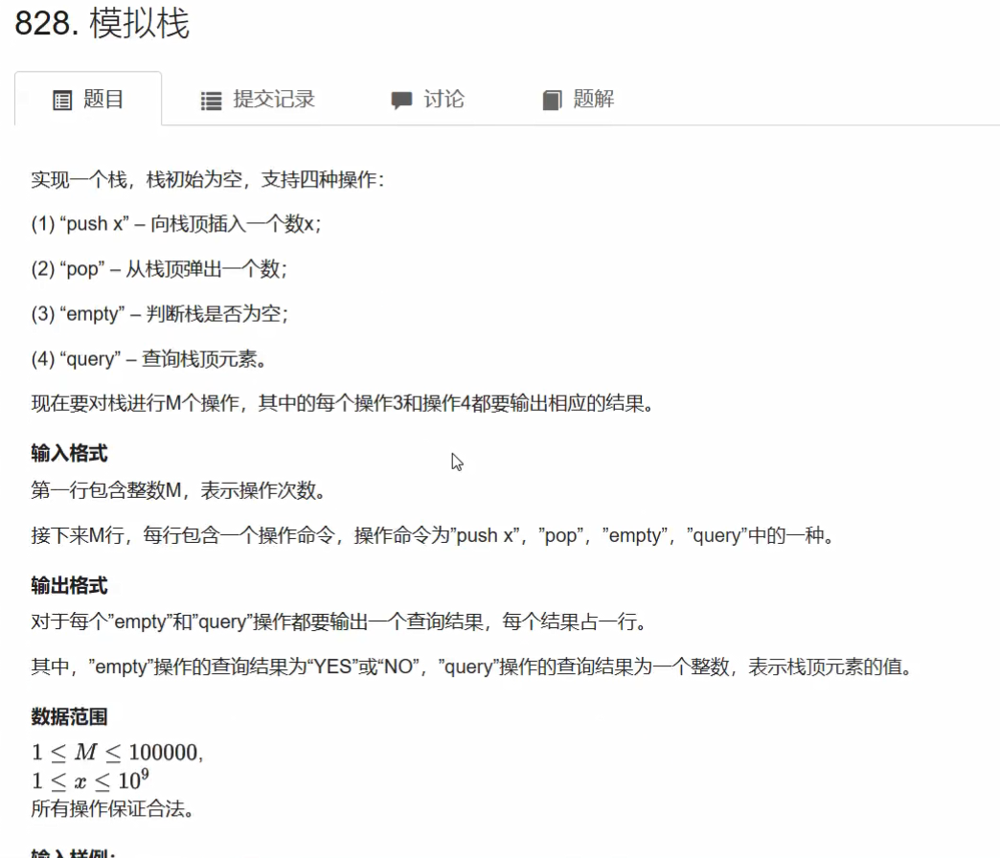


```
输入
10
push 5
query
push 6
pop
query
pop
empty
push 4
query
empty
输出
5
5
YES
4
NO
```

</details>

```java
package _02_数据结构;

import java.io.BufferedInputStream;
import java.util.Scanner;

public class _03_静态栈 {
    public static void main(String[] args) {
        Scanner sc = new Scanner(new BufferedInputStream(System.in));
        int M = sc.nextInt();sc.nextLine();
        StaticStack stack = new StaticStack(100000);
        while(M--!=0){
            String[] in = sc.nextLine().split(" ");
            String op = in[0];;
            int x;
            switch(op){
                case "push":
                    x = Integer.parseInt(in[1]);
                    stack.push(x);
                    break;
                case "pop":
                    stack.pop();
                    break;
                case "empty":
                    System.out.printf("%s\n",stack.isEmpty()? "YES":"NO");
                    break;
                case "query":
                    System.out.printf("%d\n",stack.getTop());
                    break;
            }
        }
    }
    static class StaticStack{
        int[] data;
        int pos,size;
        StaticStack(int size){
            init(size);
        }
        void init(int size){
            this.size = size;
            data = new int[size];
            pos = -1;// 用-1和0都可以，但取值不同含义不同后序的计算方式也不同
        }
        void push(int val){
            data[++pos]=val;
        }
        int pop(){
            return data[pos--];
        }
        int getTop(){
            return data[pos];
        }
        boolean isEmpty(){
            return pos==-1;
        }
        boolean isFull(){
            return pos==size-1;
        }
    }
}
```

### 队列

```java
    static class StaticQueue {
        int[] data;
        int head, tail, size, counter;

        StaticQueue(int size) {
            init(size);
        }

        void init(int size) {
            this.size = size;
            data = new int[size];
            head = 0;// 都为0，可以统一计算公式。
            tail = 0;// 都为0，可以统一计算公式。
            counter = 0;// 元素个数计数，使用这种方式判断空和满会很简单。
        }

        void EnQueue(int x) {
            data[tail] = x;
            tail = ++tail % size;
            counter++;
        }

        int DeQueue() {
            int t = data[head];
            head = ++head % size;
            counter--;
            return t;
        }

        boolean isEmpty() {
            return counter == 0;
        }

        boolean isFull() {
            return counter == size;// counter记录的是元素个数，所以直接判断是否和size相等即可
        }
    }
```

### 单调栈

做题方式和双指针类似

- 先写出暴力解
- 再看是否存在单调性，是否可以优化。

<details>

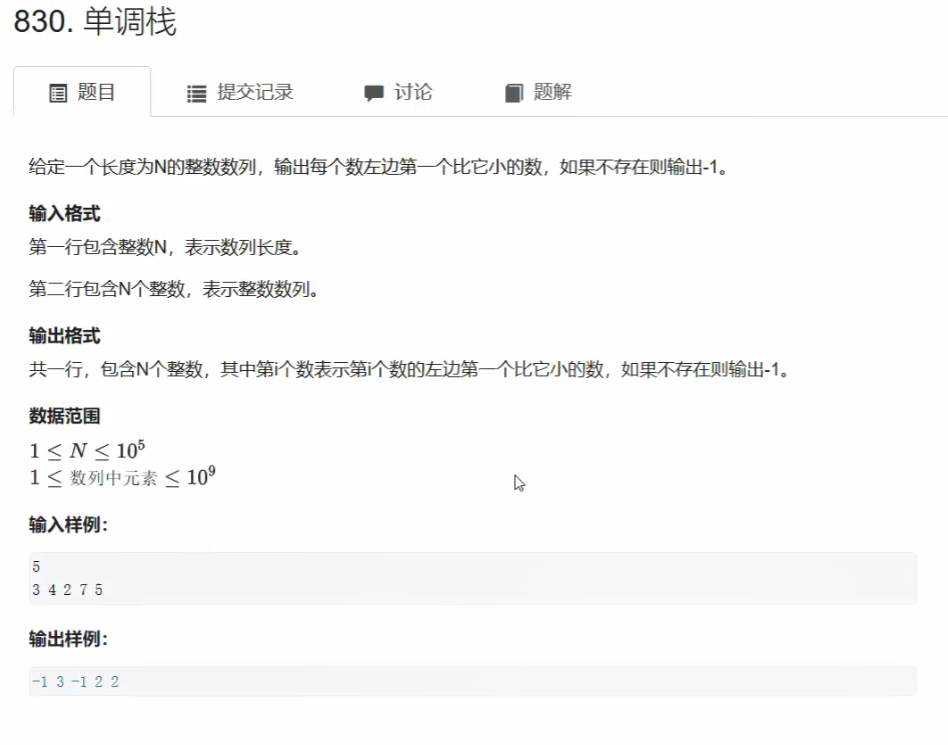

```
输入
5
3 4 2 7 5
输出
-1 3 -1 2 2 
```

</details>

**写法2**

```java
package _02_数据结构;

import java.io.BufferedInputStream;
import java.util.Scanner;

public class _05_单调栈 {
    public static void main(String[] args) {
        Scanner sc = new Scanner(new BufferedInputStream(System.in));
        int N = sc.nextInt();
        Stack stk = new Stack(N);
        int[] data = new int[N];
        int[] res = new int[N];
        for (int i = 0; i < N; i++) {
            data[i]=sc.nextInt();
        }
        stk.getLeftMinArray(data, res);
        for (int i = 0; i < N; i++){
            System.out.printf("%d ", res[i]!=-1? data[res[i]]:res[i]);
        }
    }

    static class Stack {
        int[] data;
        int pos, size;

        Stack(int size) {
            init(size);
        }

        void init(int size) {
            this.size = size;
            data = new int[size];
            clear();
        }

        void clear() {
            pos = -1;
        }

        void push(int x) {
            data[++pos] = x;
        }

        int pop() {
            return data[pos--];
        }

        int getTop() {
            return data[pos];
        }

        boolean isEmpty() {
            return pos == -1;
        }

        boolean isFull() {
            return pos == size - 1;
        }

        void getLeftMaxArray(int[] arr, int[] res) {
            for (int i = 0; i < arr.length; i++) {
                while (!isEmpty() && arr[getTop()] <= arr[i]) pop();// 拿出所有比当前数小的数
                if (isEmpty()) res[i] = -1;// 栈空，左边没有数比当前数大
                else res[i] = getTop();// 栈不空，栈顶元素就是比当前数大的数
                push(i);// 压入当前位置
            }
        }

        void getLeftMinArray(int[] arr, int[] res) {
            for (int i = 0; i < arr.length; i++) {
                while (!isEmpty() && arr[getTop()] >= arr[i]) pop();// 拿出所有比当前数大的数
                if (isEmpty()) res[i] = -1;// 栈空，左边没有数比当前数小
                else res[i] = getTop();// 栈不空，栈顶元素就是比当前数小的数
                push(i);// 压入当前位置
            }
        }
    }
}

```

**写法1**

```java
package _02_数据结构;

import java.io.BufferedInputStream;
import java.util.Scanner;

public class _05_单调栈 {
    public static void main(String[] args) {
        Scanner sc = new Scanner(new BufferedInputStream(System.in));
        int N = sc.nextInt();
        Stack stk = new Stack(N);
        int[] data = new int[N];
        int[] res = new int[N];
        for (int i = 0; i < N; i++) {
            int t = sc.nextInt();
            data[i] = t;
            while (!stk.isEmpty() && stk.getTop() >= t)
                stk.pop();// 大于等于t的全部拿出
            if (stk.isEmpty()) res[i] = -1;// 没有数比当前数更小
            else res[i] = stk.getTop();// 栈顶元素就是比当前数小且最近的数
            stk.push(t); // 入栈当前数
            // stk中的数是单调递增的,所以称之为单调栈。
        }
        for (int i = 0; i < N; i++)
            System.out.printf("%d ", res[i]);
    }

    static class Stack {
        int[] data;
        int pos, size;

        Stack(int size) {
            init(size);
        }

        void init(int size) {
            this.size = size;
            data = new int[size];
            pos = -1;
        }

        void push(int x) {
            data[++pos] = x;
        }

        int pop() {
            return data[pos--];
        }

        int getTop() {
            return data[pos];
        }

        boolean isEmpty() {
            return pos == -1;
        }

        boolean isFull() {
            return pos == size - 1;
        }
    }
}
```

### 单调队列

> 典型应用：求滑动窗口中的最大和最小值。

<details>


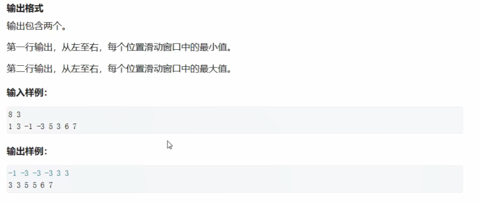

```
输入
8 3
1 3 -1 -3 5 3 6 7
输出
-1 -3 -3 -3 3 3
3 3 5 5 6 7
```

</details>

**写法1**

```java
package _02_数据结构;

import java.io.BufferedInputStream;
import java.util.Scanner;

public class _06_单调队列_写法2 {
    public static void main(String[] args) {
        Scanner sc = new Scanner(new BufferedInputStream(System.in));
        int N = sc.nextInt();
        int K = sc.nextInt();
        int[] data = new int[N];
        int[] max = new int[N];
        int[] min = new int[N];
        
        StaticQueue queue = new StaticQueue(K+1);

        for (int i = 0; i < data.length; i++)  data[i]=sc.nextInt();
        
        queue.getMinArray(data, min, K);
        queue.getMaxArray(data, max, K);
        
        for (int i = K-1; i < min.length; i++) {
   System.out.printf("%d ",min[i]);
  }
        System.out.println("");
        for (int i = K-1; i < max.length; i++) {
   System.out.printf("%d ",max[i]);
  }
    }

    static class StaticQueue {
        int[] data;
        int front, tail, size, MAX_SIZE;

        void init(int len) {
            data = new int[len];
            MAX_SIZE = len;
            clear();
        }

        void clear(){
            front = 0;
            tail = 0;
            size = 0;
        }

        StaticQueue(int len) {
            init(len);
        }

        void EnQueue(int val) {
            data[tail] = val;
            tail = ++tail % MAX_SIZE;
            size++;
        }

        int DeQueue() {
            int temp = data[front];
            front = ++front % MAX_SIZE;
            size--;
            return temp;
        }

        int getFirst(){
            return data[front];
        }

        int getLast(){
            return data[(tail+MAX_SIZE-1)%MAX_SIZE];
        }

        int DeQueueLast(){
            tail = (tail+MAX_SIZE-1)%MAX_SIZE;// tail--;
            int temp = data[tail];
            size--;
            return temp;
        }

        int getSize(){
            return size;
        }

        boolean isEmpty() {
            return size == 0;
        }

        boolean isFull() {
            return size == MAX_SIZE;
        }
        void getMaxArray(int[] data,int[] res,int winSize) {
         clear();
         for (int idx = 0; idx < data.length; idx++) {
    while(!isEmpty()&&data[getLast()]<=data[idx]) DeQueueLast();// 从队尾开始拿,拿出所有小于等于当前数的数
    while(!isEmpty()&&getFirst()<=idx-winSize) DeQueue();// 从队头开始拿，维持窗口大小
    EnQueue(idx);//入队当前位置
    res[idx]=data[getFirst()];//得到当前窗口中最大值。 
   }
        }
        void getMinArray(int[] data,int[] res,int winSize) {
         clear();
         for (int idx = 0; idx < data.length; idx++) {
    while(!isEmpty()&&data[getLast()]>=data[idx]) DeQueueLast();
    while(!isEmpty()&&getFirst()<=idx-winSize) DeQueue();
    EnQueue(idx);
    res[idx]=data[getFirst()];
   }
        }
    }
}
```

**写法2**

```java
package _02_数据结构;

import java.io.BufferedInputStream;
import java.util.Scanner;

public class 单调队列 {
    public static void main(String[] args) {
        Scanner sc = new Scanner(new BufferedInputStream(System.in));
        int N = sc.nextInt();
        int K = sc.nextInt();
        int[] data = new int[N];
        StaticQueue queue = new StaticQueue(K+1);

        for (int i = 0; i < data.length; i++) 
            data[i]=sc.nextInt();
        
        for (int idx = 0; idx < data.length; idx++) {
            // 保证队列中的数单调递增，这一步实际上和单调栈一模一样
            while(!queue.isEmpty()&data[queue.getLast()]>=data[idx]) queue.DeQueueLast();
            // 保证队列中的元素个数不超过K
            while(!queue.isEmpty()&&queue.getFirst()<=idx-K) queue.DeQueue();
            // 入队
            queue.EnQueue(idx);
            // 由于单调性，队列中第一个数就是最小值
            if(idx+1-K>=0) System.out.printf("%d ",data[queue.getFirst()]);
        }
        System.out.println("");
        queue.clear();
        for (int idx = 0; idx < data.length; idx++) {
            // 保证队列中的数单调递减，这一步实际上和单调栈一模一样
            while(!queue.isEmpty()&data[queue.getLast()]<=data[idx]) queue.DeQueueLast();
            // 保证队列中的元素个数不超过K
            while(!queue.isEmpty()&&queue.getFirst()<=idx-K) queue.DeQueue();
            // 入队
            queue.EnQueue(idx);
            // 由于单调性，队列中第一个数就是最大值
            if(idx+1-K>=0) System.out.printf("%d ",data[queue.getFirst()]);
        }
    }

    static class StaticQueue {
        int[] data;
        int front, tail, size, MAX_SIZE;

        void init(int len) {
            data = new int[len];
            MAX_SIZE = len;
            clear();
        }

        void clear(){
            front = 0;
            tail = 0;
            size = 0;
        }

        StaticQueue(int len) {
            init(len);
        }

        void EnQueue(int val) {
            data[tail] = val;
            tail = ++tail % MAX_SIZE;
            size++;
        }

        int DeQueue() {
            int temp = data[front];
            front = ++front % MAX_SIZE;
            size--;
            return temp;
        }

        int getFirst(){
            return data[front];
        }

        int getLast(){
            return data[(tail+MAX_SIZE-1)%MAX_SIZE];
        }

        int DeQueueLast(){
            tail = (tail+MAX_SIZE-1)%MAX_SIZE;// tail--;
            int temp = data[tail];
            size--;
            return temp;
        }

        int getSize(){
            return size;
        }

        boolean isEmpty() {
            return size == 0;
        }

        boolean isFull() {
            return size == MAX_SIZE;
        }
    }
}
```

### KMP算法
>
> 暂时已经理解，直接背，以此加深理解。

```java
package _02_数据结构;

import java.io.BufferedInputStream;
import java.util.Scanner;

public class _07_KMP {
 public static void main(String[] args) {
  Scanner scanner = new Scanner(new BufferedInputStream(System.in));
  String s1 = scanner.next();
  String s2 = scanner.next();
  System.out.println(kmp(s1, s2));
 }
 static int kmp(String str1,String str2) {
  char[] s1 = str1.toCharArray();
  char[] s2 = str2.toCharArray();
  int[] next = new int[s2.length];
  getNextArray(s2, next);
  int p1=0,p2=0;
  while(p1<s1.length&&p2<s2.length) {
   if(s1[p1]==s2[p2]) {
    p1++;p2++;
   }else if(next[p2]!=-1) {
    p2=next[p2];
   }else {
    p1++;
   }
  }
  return p2==s2.length? p1-p2:-1;
 }
 static void getNextArray(char[] str,int[] next) {
  next[0]=-1;next[1]=0;
  for (int i = 2; i < next.length; i++) {
   for (int preIdx = next[i-1]; 0<=preIdx; preIdx=next[preIdx]) {
    if(str[preIdx]==str[i-1]) {
     next[i]=preIdx+1;
     break;
    }
   }
  }
 }
}
```

### Trie树

> 用于快速存储和查找字符串集合的数据结构

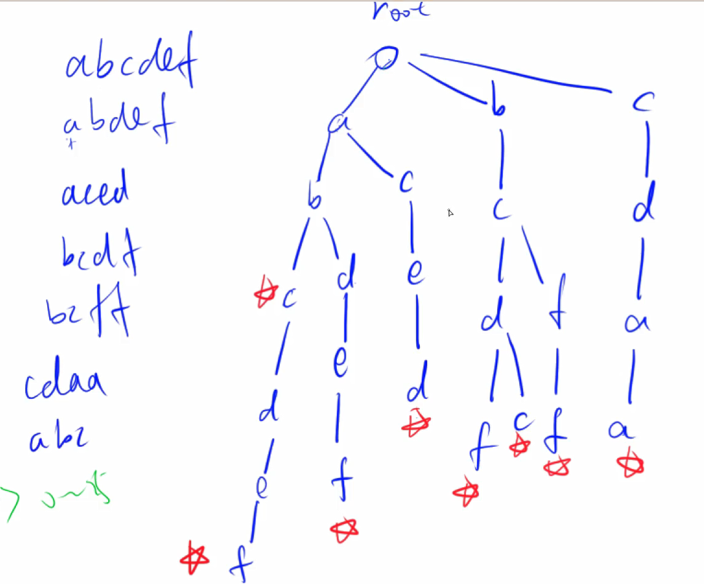

**模板题**

<details>


</details>

```java
package _02_数据结构;

import java.io.BufferedInputStream;
import java.util.Scanner;
/*
输入
11
I abc
I abc
I abcd
Q abc
R abc
Q abc
R abc
Q abc
Q abcd
R abcd
Q abcd
输出
2
1
0
1
0
 */
public class _08_Trie树 {
 public static void main(String[] args) {
  Scanner scanner = new Scanner(new BufferedInputStream(System.in));
  int N = scanner.nextInt(); scanner.nextLine();
  Trie trie = new Trie();
  while (N--!=0) {
   String[] in = scanner.nextLine().split(" ");
   String op = in[0];
   String str = in[1];
   switch(op) {
    case "I":
     trie.insert(str);
     break;
    case "Q":
     System.out.println(trie.query(str));
     break;
    case "R":
     trie.remove(str);
     break;
   }
  }
 }
 static class Trie{
  int pass,end;
  Trie[] next=new Trie[26];
  void insert(String str){
   Trie current= this;
   current.pass++;// 如果插入的是空串，根节点也会成功记录,根节点的end代表空串数
   for(int i=0;i<str.length();i++) {
    int direction = str.charAt(i)-'a';
    if(current.next[direction]==null) 
     current.next[direction]=new Trie();
    current = current.next[direction];
    current.pass++;
   }
   current.end++;
  }
  int query(String str) {
   Trie current= this;
   for(int i=0;i<str.length();i++) {
    int direction = str.charAt(i)-'a';
    if(current.next[direction]==null) 
     return 0;
    current = current.next[direction];
   }
   return current.end;
  }
  void remove(String str) {
   if(query(str)==0) return;
   Trie current= this;
   current.pass--;
   for(int i=0;i<str.length();i++) {
    int direction = str.charAt(i)-'a';
    current.next[direction].pass--;
    if(current.next[direction].pass==0) {
     // 说明这条路径上没有记录了，直接删除后序所有节点。
     current.next[direction]=null;
     return;
    }
    current = current.next[direction];
   }
   current.end--;
  }
 }
}
```

**变形题**

<details>


</details>

### 并查集

**作用**

- 快速将两个集合合并
- 询问两个元素是否在同一个集合中

**原理**

- 每个集合用树来表示，树根的地址唯一标识这个集合
- 每个节点要保存其父节点，根节点的父节点是自身
- 合并两集合，只需要把其中一个集合的根节点作为另一个集合任意节点的子节点即可。
  - 
- 优化：路径压缩：查询根节点时，将路经所有的节点的父节点指针全部指向根节点。

```java
package _02_数据结构;

import java.util.HashMap;
import java.util.Scanner;
import java.util.Stack;
/*
add 123
add 321
isSame 123 321
union 123 321
isSame 123 321
add 111
isSame 123 111
isSame 321 111
union 123 111
isSame 123 111
isSame 321 111

false
true
false
false
true
true
 */
public class _09_并查集 {
 public static void main(String[] args) {
  UnionSet<String> unionSet = new UnionSet<>();
  Scanner  scanner = new Scanner(System.in);
  while(scanner.hasNextLine()) {
   String[] in = scanner.nextLine().split(" ");
   String op = in[0];
   String s1,s2;
   switch(op) {
   case "add":
    s1 = in[1];
    unionSet.add(s1);
    break;
   case "union":
    s1 = in[1];
    s2 = in[2];
    unionSet.union(s1, s2);
    break;
   case "isSame":
    s1 = in[1];
    s2 = in[2];
    System.out.println(unionSet.isSameSet(s1, s2));
   }
  }
 }
 static class UnionSet<T> {
  HashMap<T, Wrapper<T>> valToItemMap = new HashMap<>();
  HashMap<Wrapper<T>, Wrapper<T>> fatherMap = new HashMap<>();

  public UnionSet() {
  }

  UnionSet(T[] arr) {
   load(arr);
  }

  void load(T[] arr) {
   for (int i = 0; i < arr.length; i++) {
    add(arr[i]);
   }
  }

  void add(T val) {
   if (valToItemMap.containsKey(val))  return;
   Wrapper<T> item = new Wrapper<>(val);
   valToItemMap.put(val, item);
   fatherMap.put(item, item);
  }

  Wrapper<T> findRoot(Wrapper<T> element) {
   Wrapper<T> current = element;
   Stack<Wrapper<T>> path = new Stack<>();
   while (fatherMap.get(current) != current) {
    path.push(current);
    current = fatherMap.get(current);
   }
//   路径压缩优化
   while (!path.isEmpty()) {
    fatherMap.put(path.pop(), current);
   }
   return current;
  }
  boolean contain(T val) {
   return valToItemMap.containsKey(val);
  }
  boolean isSameSet(T val1, T val2) {
   if(!contain(val1)||!contain(val2)) return false;
   return findRoot(valToItemMap.get(val1)) == findRoot(valToItemMap.get(val2));
  }
  
  void union(T val1, T val2) {
   if(!contain(val1)||!contain(val2)) return;
   fatherMap.put(findRoot(valToItemMap.get(val1)), findRoot(valToItemMap.get(val2)));
  }
  static class Wrapper<T> {
   T val;
   Wrapper(T v) {
    val = v;
   }
  }
 }
}
```

**变形题**
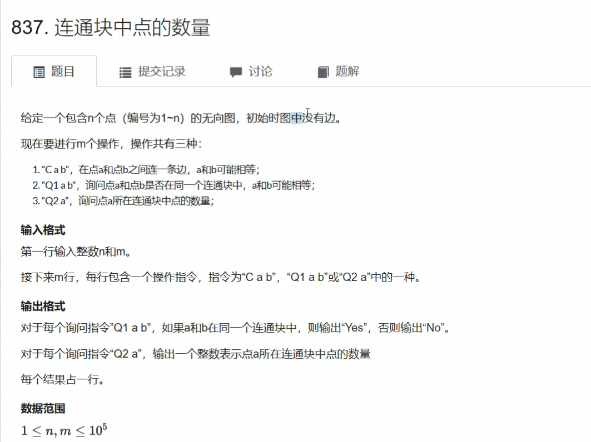


```java
package _02_数据结构;

import java.util.HashMap;
import java.util.Scanner;
import java.util.Stack;
/*
add 123
size 123
add 321
size 321
isSame 123 321
union 123 321
size 123
size 321
isSame 123 321
add 111
size 111
isSame 123 111
isSame 321 111
union 123 111
size 123
size 321
size 111
isSame 123 111
isSame 321 111

1
1
false
2
2
true
1
false
false
3
3
3
true
true
 */
public class _10_并查集_带size属性 {
 public static void main(String[] args) {
  UnionSet<String> unionSet = new UnionSet<>();
  Scanner  scanner = new Scanner(System.in);
  while(scanner.hasNextLine()) {
   String[] in = scanner.nextLine().split(" ");
   String op = in[0];
   String s1,s2;
   switch(op) {
   case "add":
    s1 = in[1];
    unionSet.add(s1);
    break;
   case "union":
    s1 = in[1];
    s2 = in[2];
    unionSet.union(s1, s2);
    break;
   case "isSame":
    s1 = in[1];
    s2 = in[2];
    System.out.println(unionSet.isSameSet(s1, s2));
    break;
   case "size":
    s1 = in[1];
    System.out.println(unionSet.getSize(s1));
    break;
   }
  }
 }
 static class UnionSet<T> {
  HashMap<T, Wrapper<T>> valToItemMap = new HashMap<>();
  HashMap<Wrapper<T>, Wrapper<T>> fatherMap = new HashMap<>();

  public UnionSet() {
  }

  UnionSet(T[] arr) {
   load(arr);
  }

  void load(T[] arr) {
   for (int i = 0; i < arr.length; i++) {
    add(arr[i]);
   }
  }

  void add(T val) {
   if (valToItemMap.containsKey(val))  return;
   Wrapper<T> item = new Wrapper<>(val);
   valToItemMap.put(val, item);
   fatherMap.put(item, item);
  }

  Wrapper<T> findRoot(Wrapper<T> element) {
   Wrapper<T> current = element;
   Stack<Wrapper<T>> path = new Stack<>();
   while (fatherMap.get(current) != current) {
    path.push(current);
    current = fatherMap.get(current);
   }
//   路径压缩优化
   while (!path.isEmpty()) {
    fatherMap.put(path.pop(), current);
   }
   return current;
  }
  boolean contain(T val) {
   return valToItemMap.containsKey(val);
  }
  boolean isSameSet(T val1, T val2) {
   if(!contain(val1)||!contain(val2)) return false;
   return findRoot(valToItemMap.get(val1)) == findRoot(valToItemMap.get(val2));
  }
  
  void union(T val1, T val2) {
   if(!contain(val1)||!contain(val2)) return;
   Wrapper<T> r1 = findRoot(valToItemMap.get(val1));
   Wrapper<T> r2 = findRoot(valToItemMap.get(val2));
   if(r1==r2) return;
   r2.size+=r1.size;
   fatherMap.put(r1, r2);
  }
  int getSize(T val) {
   if(!contain(val)) return 0;
   return findRoot(valToItemMap.get(val)).size;
  }
  static class Wrapper<T> {
   T val;
   int size = 1;
   Wrapper(T v) {
    val = v;
   }
  }
 }
}
```

**变形题**

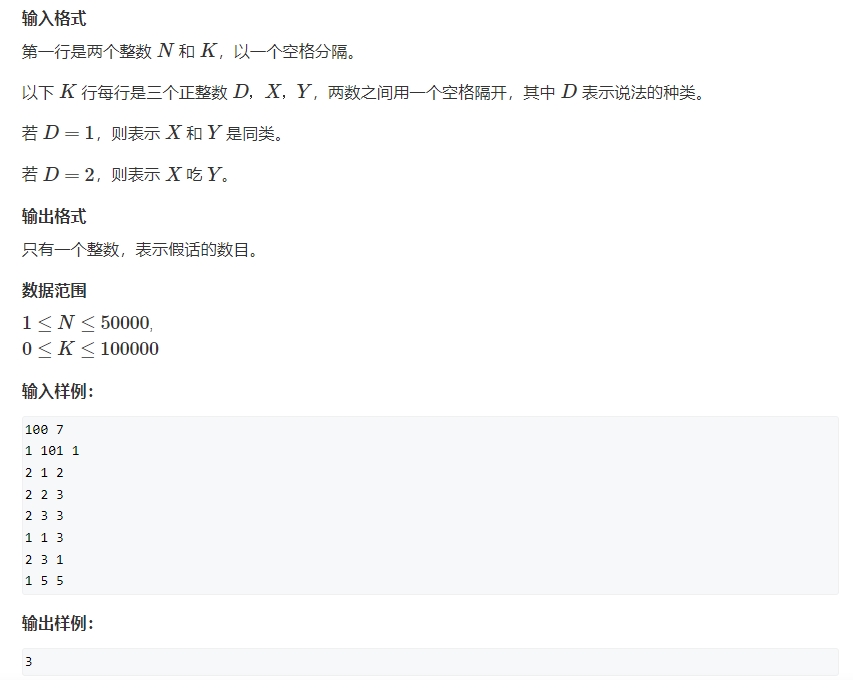

```java
```

### 堆

```java
package _02_数据结构;

public class _11_heap堆 {
 public static void main(String[] args) {
  int[] arr =  {8,7,6,5,4,3,2,1};
  Heap heap = new Heap(100);
  heap.load_NlogN(arr);
  while(!heap.isEmpty()) {
   System.out.println(heap.removeFirst());
  }
 }
 static class Heap{
  int[] data;
  int size,MAX_SIZE;
  public Heap(int capacity) {
   init(capacity);
  }
  void init(int capacity) {
   MAX_SIZE=capacity+1;
   data=new int[MAX_SIZE];
   clear();
  }
  void clear() {
   size=0;
  }
  void down(int idx){
   int minIdx = idx;
   if(2*idx<=size&&data[2*idx]<data[minIdx]) minIdx=2*idx;// 判断左子树值是否更小，记录下标
   if(2*idx+1<=size&&data[2*idx+1]<data[minIdx]) minIdx=2*idx+1;// 判断右子树值是否更小，记录下标
   if(minIdx==idx)return;// 相等说明自己已经是最小值了
   swap(idx, minIdx);
   down(minIdx);
  }
  void up(int idx) {
   int maxIdx =idx;
   if(idx/2>=1&&data[idx/2]>data[maxIdx]) maxIdx=idx/2;
   if(maxIdx==idx)return;// 选出最小值的下标
   swap(idx, maxIdx);
   up(maxIdx);
  }
//  O(N*logN)的建堆方式
  void load_NlogN(int[] arr) {
   for (int i = 0; i < arr.length; i++) {
    add(arr[i]);
   }
  }
//  O(N)的建堆方式
  void load_N(int[] arr) {
   for (int i = 0; i < arr.length; i++) {
    data[i+1]=arr[i];// 注意映射关系
   }
   size=arr.length;
   for (int i = size/2; 0<i; i--) {
    down(i);// 从最底部的一颗树的根节点往上执行down操作
   }
  }
  void add(int x) {
   size++;
   data[size]=x;// 放到末尾
   up(size);// 向上调整
  }
  int removeFirst() {
   int temp = data[1];
   swap(1, size);
   size--;
   down(1);
   return temp;
  }
  boolean isEmpty() {
   return size==0;
  }
  boolean isFull() {
   return size==MAX_SIZE;
  }
  void swap(int i,int j) {
   if(i!=j) {
    data[i]=data[i]^data[j];
    data[j]=data[i]^data[j];
    data[i]=data[i]^data[j];
   }
  }
 }
}
```

堆：支持删除第k个插入的元素

```java
package _02_数据结构;

public class _12_heap堆_删除第k个插入的元素 {
 public static void main(String[] args) {
  int[] arr =  {8,7,6,5,4,3,2,1};
  Heap heap = new Heap(100);
  heap.load_NlogN(arr);
  while(!heap.isEmpty()) {
   System.out.println(heap.removeFirst());
  }
 }
 static class Heap{
  int[] data,h2k,k2h;
  int size,k,MAX_SIZE;
  public Heap(int capacity) {
   init(capacity);
  }
  void init(int capacity) {
   MAX_SIZE=capacity+1;
   data=new int[MAX_SIZE];
   h2k=new int[MAX_SIZE];
   k2h=new int[MAX_SIZE];
   clear();
  }
  void clear() {
   size=0;
   k=0;
  }
//  ---------------------------------------------------基本操作---------------------------------------------------
  void down(int idx){
   int minIdx = idx;
   if(2*idx<=size&&data[2*idx]<data[minIdx]) minIdx=2*idx;// 判断左子树值是否更小，记录下标
   if(2*idx+1<=size&&data[2*idx+1]<data[minIdx]) minIdx=2*idx+1;// 判断右子树值是否更小，记录下标
   if(minIdx==idx)return;// 相等说明自己已经是最小值了
   heap_swap(idx, minIdx);
   down(minIdx);
  }
  void up(int idx) {
   int maxIdx =idx;
   if(idx/2>=1&&data[idx/2]>data[maxIdx]) maxIdx=idx/2;
   if(maxIdx==idx)return;// 选出最小值的下标
   heap_swap(idx, maxIdx);
   up(maxIdx);
  }
//  O(N*logN)的建堆方式
  void load_NlogN(int[] arr) {
   for (int i = 0; i < arr.length; i++) {
    add(arr[i]);
   }
  }
  // 增
  void add(int x) {
   size++;
   k++;
   data[size]=x;// 放到末尾
   up(size);// 向上调整
   h2k[k]=size;// 记录第k个插入的数在堆中的所在位置
   k2h[size]=k;// 反向映射，记录某元素是第几个插入的
  }
  // 改：需改某节点上的数
  void modify(int idx,int val) {
   data[idx]=val;
   up(idx);down(idx);
  }
  // 删除
  int remove(int idx) {
   int temp = data[idx];
   heap_swap(idx, size--);
   down(idx);up(idx);
   return temp;
  }
//  ---------------------------------------------------基本操作---------------------------------------------------
  int removeFirst() {
   return remove(1);
  }
  // 修改第k个插入的数
  void modifyK(int k,int val) {
   modify(k2h[k], val);
  }
  int removeK(int k) {
   return remove(k2h[k]);
  }
  boolean isEmpty() {
   return size==0;
  }
  boolean isFull() {
   return size==MAX_SIZE;
  }
//  交换值和映射关系
  void heap_swap(int i,int j) {
   swap(data, i, j);
   swap(h2k, i, j);// 交换映射关系
   swap(k2h, h2k[j], h2k[i]);
  }
  void swap(int[] arr,int i,int j) {
   if(i!=j) {
    arr[i]=arr[i]^arr[j];
    arr[j]=arr[i]^arr[j];
    arr[i]=arr[i]^arr[j];
   }
  }
 }
}
```

### hash表

**存储结构**

- 开放寻址法
  - 空间可能要开2~3倍
  - 冲突处理：hash(x)+1
- 拉链法
  - 冲突处理：就是邻接表的插入操作

**hash函数**

- N尽可能取质数（素数），有证明这种取法可使冲突概率最小。
- x可能负数，定义域很宽：hash(x)=(x%N+N)%N

**基本操作**

- add
- find
- remove 用的比较少，可以用标志位标记删除的方式来实现。


```
输入
5
I 1
I 2
I 3
Q 2
Q 5

输出
Yes
No
```

**开放寻址法**

```java
package _02_数据结构;

import java.io.BufferedReader;
import java.io.BufferedWriter;
import java.io.IOException;
import java.io.InputStreamReader;
import java.io.OutputStreamWriter;
import java.io.PrintWriter;
import java.io.StreamTokenizer;
import java.util.Arrays;

/*
5
I 1
I 2
I 3
Q 2
Q 5

输出
Yes
No
 */

public class _13_hash表_开放寻址法 {
 static BufferedReader bReader = new BufferedReader(new InputStreamReader(System.in));
 static BufferedWriter bWriter = new BufferedWriter(new OutputStreamWriter(System.out));
 static StreamTokenizer tokenizer =new StreamTokenizer(bReader);
 static PrintWriter out = new PrintWriter(bWriter);
 static int nextInt() throws IOException{
  tokenizer.nextToken();
  return (int)tokenizer.nval;
 }
 static String nextString() throws IOException{
  tokenizer.nextToken();
  return tokenizer.sval;
 }
 public static void main(String[] args) throws IOException {
  HashSet set = new HashSet(10000);
  int N = nextInt();
  while (N--!=0) {
   String op =nextString();
   int x;
   switch(op) {
   case"I":
    x = nextInt();
    set.add(x);
    break;
   case "Q":
    x = nextInt();
    out.println(set.contain(x)?"Yes":"No");
    break;
   }
  }
  out.flush();
 }
 
 static class HashSet{
  int[] data;
  int idx,MAX_SIZE,NULL=0x3f3f3f3f;
  public HashSet(int capacity) {
   MAX_SIZE=nextSu(capacity);// 用质数来作为N
   data=new int[MAX_SIZE];
   Arrays.fill(data, NULL);
  }
//  找质数
  int nextSu(int from) {
   for (int num = from;; num++) {
    boolean flag = true;
    for(int n = 2;n*n<=num;n++) {
     if(num%n==0) {
      flag=false;
      break;
     }
    }
    if(flag) return num;
   }
  }
  int hash(int x) {
   return (x%MAX_SIZE+MAX_SIZE)%MAX_SIZE;
  }
  int find(int x) {
   int pos = hash(x);
   while( data[pos]!=NULL&&data[pos]!=x) {
    pos=(pos+1)%MAX_SIZE;
   }
   return pos;
  }
  void add(int val) {
   data[find(val)]=val;
  }
  boolean contain(int val) {
   return data[find(val)]==val;
  }
 }
}

```

**拉链法**

```java
package _02_数据结构;

import java.io.BufferedReader;
import java.io.BufferedWriter;
import java.io.IOException;
import java.io.InputStreamReader;
import java.io.OutputStreamWriter;
import java.io.PrintWriter;
import java.io.StreamTokenizer;
import java.util.Arrays;

/*
5
I 1
I 2
I 3
Q 2
Q 5

输出
Yes
No
 */

public class _14_hash表_拉链法 {
 static BufferedReader bReader = new BufferedReader(new InputStreamReader(System.in));
 static BufferedWriter bWriter = new BufferedWriter(new OutputStreamWriter(System.out));
 static StreamTokenizer tokenizer =new StreamTokenizer(bReader);
 static PrintWriter out = new PrintWriter(bWriter);
 static int nextInt() throws IOException{
  tokenizer.nextToken();
  return (int)tokenizer.nval;
 }
 static String nextString() throws IOException{
  tokenizer.nextToken();
  return tokenizer.sval;
 }
 public static void main(String[] args) throws IOException {
  HashSet set = new HashSet(10000);
  int N = nextInt();
  while (N--!=0) {
   String op =nextString();
   int x;
   switch(op) {
   case"I":
    x = nextInt();
    set.add(x);
    break;
   case "Q":
    x = nextInt();
    out.println(set.contain(x)?"Yes":"No");
    break;
   }
  }
  out.flush();
 }
 static class HashSet{
  int[] table;
  int[] data,next;
  int idx,MAX_SIZE,NULL=0x3f3f3f3f;
  public HashSet(int capacity) {
   MAX_SIZE=nextSu(capacity);// 用质数来作为N
   table=new int[MAX_SIZE];
   data=new int[MAX_SIZE];
   next=new int[MAX_SIZE];
   Arrays.fill(next, NULL);// next和table都是存指针
   Arrays.fill(table, NULL);
  }
//  找质数
  int nextSu(int from) {
   for (int num = from;; num++) {
    boolean flag = true;
    for(int n = 2;n*n<=num;n++) {
     if(num%n==0) {
      flag=false;
      break;
     }
    }
    if(flag) return num;
   }
  }
  int hash(int x) {
   return (x%MAX_SIZE+MAX_SIZE)%MAX_SIZE;
  }
  int find(int x) {
   for(int p = table[hash(x)];p!=NULL;p=next[p]) {
    if(data[p]==x) return p;
   }
   return NULL;
  }
  void add(int val) {
   int pos = hash(val);
   data[idx]=val;
   next[idx]=table[pos];
   table[pos]=idx++;
  }
  boolean contain(int val) {
   return find(val)!=NULL;
  }
 }
}
```

### 字符串前缀hash法

**前缀hash**

- str="ABCABCDEGF"
- hash[0]=0
- hash[1]=str前1个字符的hash即："A"的hash值
- hash[2]=str前2个字符的hash即："AB"的hash值
- hash[3]=str前3个字符的hash即："ABC"的hash值
- hash[4]=str前4个字符的hash即："ABCA"的hash值
- hash[5]=str前5个字符的hash即："ABCAB"的hash值
- ...

**hash值的计算**

- 把字符串看成是P进制数
  - `hash[i]=hash[i-1]*P+str[i]`
  - 如把ABC映射成123
- 不能映射到0，应当从1开始映射
  - 否则hash(A)=0 hash(AA)=0,这将造成大量的hash冲突
- 用unsigned long long存hash值，也就是模Q=2^64
- 冲突处理：假定不存在冲突
  - 经验值：
    - P=131或P=13331时，Q=2^64。
    - 99.99%的情况下不存在冲突

**子串hash值的计算**

- `hash(str[L:R])=hash(str[0:R])-hash(str[0:L-1])*P^(R-L+1)`
- 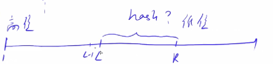


```java
package _02_数据结构;

import java.io.BufferedOutputStream;
import java.io.BufferedReader;
import java.io.IOException;
import java.io.InputStreamReader;
import java.io.PrintWriter;
import java.io.StreamTokenizer;
/*
输入
8 3
aabbaabb
1 3 5 7
1 3 6 8
1 2 1 2
输出
true
false
true

 */
public class 子串hash的快速计算 {
 static BufferedReader br = new BufferedReader(new InputStreamReader(System.in));
 static StreamTokenizer tokenizer = new StreamTokenizer(br);
 static PrintWriter out = new PrintWriter(new BufferedOutputStream(System.out));
 static String nextStr() throws IOException {
  tokenizer.nextToken();
  return tokenizer.sval;
 }
 static int nextInt() throws IOException {
  tokenizer.nextToken();
  return (int)tokenizer.nval;
 }
 
 public static void main(String[] args) throws IOException {
  int n = nextInt();
  int m = nextInt();
  String str = nextStr();
  Hash strHash = new Hash(str);
  while(m--!=0) {
   int l1,r1,l2,r2;
   l1 = nextInt();
   r1 = nextInt();
   l2 = nextInt();
   r2 = nextInt();
   out.println(strHash.getHash(l1, r1)==strHash.getHash(l2, r2));
  }
  out.flush();
 }
 static class Hash{
  int P = 131;
  long[] hash;
  long[] pow;
  
  Hash(String str){
   hash = new long[str.length()+1];
   pow = new long[str.length()+1];
   pow[0]=1;// 存p^0=1
   for (int i = 1; i < hash.length; i++) {
    pow[i]=pow[i-1]*P;// 为了快速求P^(n),所以预处理
    hash[i]=hash[i-1]*P+str.charAt(i-1);
   }
  }
  long getHash(int l,int r) {
   return hash[r]-hash[l-1]*pow[r-l+1];
  }
 }
}
```

### C++STL

```
vector
    变长数组
    倍增思想
    size()
    empty()
    clear()
    front()/back() 获取
    push_back()/pop_back() 最后位置入栈和出栈。
    begin() 迭代器，第0个数
    end() 迭代器，最后一个数的后一个数
    [] 支持随机访问
    支持比较运算，默认按字典序比较

pair<int,int>
    二元组
    p.first 第一个元素
    p.second 第二个元素
    支持比较运算，以first为第一关键字，second为第二关键字
    三元组：`pair<int, pair<int, int>> t3 = {1, {2, 3}};`

string
    字符串
    size()/length() 字符串长度
    substr(start,end) 子串[start,end)
    c_str() 首元素的地址

queue
    size()
    empty()
    push() 插到队尾
    pop() 弹出队头
    front() 获取队头
    back(); 获取队尾
    没有clear清除函数

priority_queue
    堆,优先队列，默认大根堆
    push() 插入元素
    top() 堆顶元素
    pop() 弹出堆顶元素
    小根堆：priority_queue<int,vector<int>,greater<int>> heap;

stack
    栈
    push()
    pop()
    top()
    empty()
    size()

deque
    双端队列
    size()
    empty()
    clear();
    front()/back()
    push_back()/pop_back()
    push_front()/pop_front()
    [] 随机寻址
    begin()/end() 迭代器
    优点是功能强大，缺点是速度慢


set/multiset map/multimap，
    基于平衡二叉树实现（红黑树）动态维护有序序列
    size() 
    empty()
    clear()
    begin()/end() ++ -- 自增自减，O(logN)
    set/multiset
        insert() 插入一个数 时间复杂度：O(log(N)) 因为是树
        find() 查找一个数，不存在则返回end迭代器
        count() 返回某元素的个数
        erase(x)
            输入数x,则删除所有的k个x  O(k+logN)
            输入是迭代器，删除这个迭代器。
        lower_bound()/upper_bound()
          lower_bound(x) 返回大于等于x的最小的数的迭代器 >=
          upper_bound(x) 返回大于x的最小的数的迭代器 >
    map/multimap
        insert(x) x是一个pair<,>
        erase(x) x是一个pair或迭代器
        find()
        [] 可以向用数组一样用map 但是时间复杂度为logN
            a["name"] = "dyg";
            k = a["name"]


unordered_set unordered_map unordered_map unordered_multimap
    基于哈希表实现
    绝大部分操作和上面类似，但时间复杂度为O(1)
    不支持lower_bound()/upper_bound() 因为是无序的
    不支持迭代器的++ -- 
    
bitset
    压位
    c++ boolean[] 每个元素占8bit，8bit只表示两个状态
    bitset可以将一个字节中的每一位都使用到。用1bit表示2个状态
    bitset<10000> b;
    ~b
    &,|,^
    >>,<<
    ==,!=
    [] 取出某一bit
    count() 返回有多少个1
    any()是否至少有一个1
    none() 是否全为0
    set() 所有位设置为1
    set(k,v) 第k位设置为v
    reset() 所有位，置0
    flip() 等价于~
    flip(k) 第k位取反
    
```

**一些特性**

- 系统为程序分配空间的所需时间，与空间大小无关，与申请次数有关

#### vector

```c++
#include <iostream>
#include <vector>
using namespace std;
int main()
{
    // ------------------创建容器------------------
    // 创建一个容器
    vector<int> a;
    // 容器数组
    vector<int> hashTable[10];
    // 创建一个有初始大小有初始值的容器，
    vector<int> b(10, -1);

    // ------------------一些方法------------------
    a.size();  // 元素个数
    a.empty(); // 是否空

    // ------------------遍历容器------------------
    vector<int> t(10, 1);
    // for遍历
    for (auto x : b) cout << x << endl;
    // 通过迭代器遍历
    // for (vector<int>::iterator i = t.begin(); i != t.end(); i++)
    for (auto i = t.begin(); i != t.end(); i++)
    {
        // i 是迭代器
        cout << *i << endl;
    }
    // 通过下标遍历
    for (int i = 0; i < t.size(); i++)
    {
        cout << t[i] << endl;
    }
}
```

#### pair

```c++
#include <iostream>
using namespace std;
int main()
{
    // ------------创建二元组------------
    pair<int, string> t1 = make_pair(1, "hahahha");
    pair<int, string> t2 = {1, "666"};
    // ------------创建三元组------------
    pair<int, pair<int, int>> t3 = {1, {2, 3}};
    cout << t1.second << endl;
    cout << t2.second << endl;
    cout << t3.second.second << endl;
}
```

#### string

```c++
#include <iostream>
#include <string>
using namespace std;
int main()
{
    string s1 = "dyg";
    s1 += " is my name.";// 拼接
    cout << s1 << endl;
    cout << s1.substr(0, 3) << endl;// 子串
    printf("%s\n",s1.c_str());//c_str是第一个字符的地址
}
```

## 搜索与图论

**题目**
<details>


</details>

### 普通深度优先搜索

- 深搜是递归序
- 使用栈存储
- 空间开销是O(树根到最深处路径上的节点数：高度h)
- 

```
模板代码，略
```

**两个重要概念**

- 回溯
- 剪枝

```
dfs模板代码，略，记住是用栈实现即可
```

### 宽度优先搜索

- 宽搜是层序遍历
- 使用队列存储
- 空间开销是O(数某层的节点数:2^h)
- 搜索到的第一个节点是最近节点
- 

```
bfs模板代码，略，记住是用队列实现即可
```

### 树与图的存储

- 树是一种特殊的图，无环连通图
- 无向图是一种特殊的有向图
- 所以只需要关注有向图的实现即可。

**有向图的存储结构**

- 邻接矩阵：
  - 二维数组，
  - 用的少，
  - 空间浪费严重，O(N^2)适合存储稠密图
  - g[a][b]=true 表示a->b有一条表，无法表示重复的边
- 邻接表
  - 就是单链表数组，
  - tab[a] 中存储的是一个链表指针，链表中存储的是当前a节点的后继节点编号。
  - 
  - 

**重边与自环**


### 树和图的统一存储实现方式

### 树与图的深度优先遍历

### 树与图的宽度优先遍历

**代码**

```java
package _03_搜素与图论;

import java.util.Arrays;

public class _01_邻接表的实现 {
 public static void main(String[] args) {
  Graph g = new Graph(100);
  
  g.add(1, 2);
  g.add(1, 3);
  
  g.add(2, 3);
  g.add(2, 4);
  
  g.add(3, 5);
  g.add(3, 5);
  
  // 递归序
  g.dfs_(1);
  System.out.println("");
  g.dfs(1);
  
  // 层序
  System.out.println("");
  g.wfs(1);
  
  /* output
5
3
4
2
1

5
3
4
2
1

1
3
2
5
4

   */
  
  
 }
 static class Graph{
  int head[],vale[],next[],idx,MAX_SIZE;
  public Graph(int capacity) {
   MAX_SIZE=capacity;
   head=new int[MAX_SIZE];// head 表示点
   vale=new int[2*MAX_SIZE];// vale 表示边，假设边的数量是节点数量的两倍
   next=new int[2*MAX_SIZE];// next 表示指针
   visited=new boolean[MAX_SIZE];// 标记是否访问
   Arrays.fill(head, -1);// 表示空指针
   idx=0;
  }
  // 插入a->b的边,如果是无向图，就执行两次，插入两条边，a->b b->a
  void add(int a,int b){
   // 头插法
   vale[idx]=b;
   next[idx]=head[a];
   head[a]=idx;
   idx++;
  }
  boolean visited[];
//  利用系统栈来递归实现深度优先遍历
  void dfs(int start) {
   visited[start]=true;
   for(int p=head[start];p!=-1;p=next[p]) {
    if(!visited[vale[p]]) {
     dfs(vale[p]);
    }
   }
   System.out.println(start);// 处理当前节点
  }
//  利用手动维护栈的方式实现深度优先遍历
  void dfs_(int start) {
   int stack[]=new int[MAX_SIZE],top=-1;
   boolean visit[]=new boolean[MAX_SIZE];
   stack[++top]=start;// 压入根节点
   visit[start]=true;
   
   outer: while(top!=-1) {// 栈不为空
    // 找当前节点的子节点
    for(int p=head[stack[top]];p!=-1;p=next[p]) {
     if(!visit[vale[p]]) {
      visit[vale[p]]=true;
      stack[++top]=vale[p];// 找到一个未访问过的节点就入栈
      continue outer;// 然后直接去下一次while循环，去考虑刚压入的节点
     }
    }
    // 程序能走到这里，说明没有执行continue；
    // 要么是因为当前节点是叶节点，因为没有子节点可访问，所有才没有执行continue，
    // 要么是因为，当前节点的子节点全部访问过了，所以没有执行continue；
    int cur = stack[top--];
    System.out.println(cur);// 处理当前节点
   }
  }
//  利用队列的方式实现宽度优先遍历,层序遍历
  void wfs(int start) {
   int queen[]=new int[MAX_SIZE],front=0,tail=0,size=0;
   boolean visit[]=new boolean[MAX_SIZE];
   queen[tail++]=start;size++;
   visit[start]=true;
   while(size!=0) {
    int cur = queen[front++];size--;// 取出队头
    
    System.out.println(cur);// 处理当前节点
    
    for(int p=head[cur];p!=-1;p=next[p]) {
     if(!visit[vale[p]]) {// 把没访问的所有子节点入队
      visit[vale[p]]=true;
      queen[tail++]=vale[p];size++;// 入队
     }
    }
   }
  }
 }
}
```

**题目：树的重心**


```java
package _03_搜素与图论;

import java.io.BufferedReader;
import java.io.BufferedWriter;
import java.io.IOException;
import java.io.InputStreamReader;
import java.io.OutputStreamWriter;
import java.io.PrintWriter;
import java.io.StreamTokenizer;
import java.util.Arrays;
/*
9
1 2
1 7
1 4
2 8
2 5
4 3
3 9
4 6

输出4
 */
public class _02_树的重心 {
 static BufferedReader br = new BufferedReader(new InputStreamReader(System.in));
 static BufferedWriter bw = new BufferedWriter(new OutputStreamWriter(System.out));
 static StreamTokenizer st = new StreamTokenizer(br);
 static PrintWriter pw = new PrintWriter(bw);
 static int nextInt() {
  try {
   st.nextToken();
  } catch (IOException e) {
   // TODO 自动生成的 catch 块
   e.printStackTrace();
  }
  return (int)st.nval;
 }
 static String nextStr() {
  try {
   st.nextToken();
  } catch (IOException e) {
   // TODO 自动生成的 catch 块
   e.printStackTrace();
  }
  return st.sval;
 }
 public static void main(String[] args) {
  int N = nextInt();
  int E = N-1;
  Graph g = new Graph(N+1);
  while(E--!=0) {
   g.add(nextInt(), nextInt());
  }
  g.dfs(1);
  pw.println(g.res);
  pw.flush();
  
 }
 static class Graph{
  int head[],vale[],next[],idx,MAX_SIZE;
  int nodeCnt=0;
  public Graph(int capacity) {
   MAX_SIZE=capacity;
   head=new int[MAX_SIZE];// head 表示点
   vale=new int[2*MAX_SIZE];// vale 表示边，假设边的数量是节点数量的两倍
   next=new int[2*MAX_SIZE];// next 表示指针
   visited=new boolean[MAX_SIZE];// 标记是否访问
   Arrays.fill(head, -1);// 表示空指针
   idx=0;
  }
  // 插入 a<->b 的两条边
  void add(int a,int b){
   // 头插法
   if(head[a]==-1) nodeCnt++;// 统计节点数
   if(head[b]==-1) nodeCnt++;// 
//   直接建两条边，保证无向图。
   vale[idx]=b; next[idx]=head[a]; head[a]=idx; idx++;
   vale[idx]=a; next[idx]=head[b]; head[b]=idx; idx++;
  }
  int min = Integer.MAX_VALUE;
  int res = -1;
  
  boolean visited[];
//  利用系统栈来递归实现深度优先遍历
//  返回当前节点子树大小
  int dfs(int start) {
   visited[start]=true;
   int max = 0;
   int size = 1;// 记录以当前节点为树根的树的节点数
   for(int p=head[start];p!=-1;p=next[p]) {
    if(!visited[vale[p]]) {
     int t = dfs(vale[p]); //子节点大小
     size+=t; // 统计所有子树的大小
     max=Math.max(max, t);// 找出最大的子树大小
    }
   }
   int k = Math.max(max, nodeCnt-size);
   if(k<min) {
    min=k;
    res=max;
   }
   return size;
  }
 }
}
```

**题目：图中点的层次**


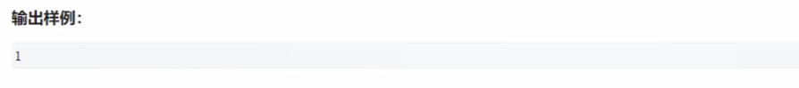

```java
package _03_搜素与图论;

import java.io.BufferedReader;
import java.io.BufferedWriter;
import java.io.IOException;
import java.io.InputStreamReader;
import java.io.OutputStreamWriter;
import java.io.PrintWriter;
import java.io.StreamTokenizer;
import java.util.Arrays;
/*
输入
4 5
1 2
2 3
3 4
1 3
1 4

输出1
 */
public class _03_图中点的层次 {
 static BufferedReader br = new BufferedReader(new InputStreamReader(System.in));
 static BufferedWriter bw = new BufferedWriter(new OutputStreamWriter(System.out));
 static StreamTokenizer st = new StreamTokenizer(br);
 static PrintWriter pw = new PrintWriter(bw);
 static int nextInt() {
  try {
   st.nextToken();
  } catch (IOException e) {
   // TODO 自动生成的 catch 块
   e.printStackTrace();
  }
  return (int)st.nval;
 }
 static String nextStr() {
  try {
   st.nextToken();
  } catch (IOException e) {
   // TODO 自动生成的 catch 块
   e.printStackTrace();
  }
  return st.sval;
 }
 public static void main(String[] args) {
  int N = nextInt();
  int E = nextInt();
  Graph g = new Graph(N+1,E+1);
  while(E--!=0) {
   g.add(nextInt(), nextInt());
  }
  pw.println(g.wfs(1, N));// 输出1->N节点的最短距离
  pw.flush();
 }
 static class Graph{
  int head[],vale[],next[],idx,NODE_MAX_SIZE,EDGE_MAX_SIZE;
  public Graph(int nodeMaxSize,int edgeMaxSize) {
   NODE_MAX_SIZE=nodeMaxSize;
   EDGE_MAX_SIZE = 2*edgeMaxSize;
   head=new int[NODE_MAX_SIZE];// head 表示点
   vale=new int[EDGE_MAX_SIZE];// vale 表示边，假设边的数量是节点数量的两倍
   next=new int[EDGE_MAX_SIZE];// next 表示指针
   Arrays.fill(head, -1);// 表示空指针
   idx=0;
  }
  // 插入 a<->b 的两条边
  void add(int a,int b){
//   直接建两条边，保证无向图。
   // 头插法
   vale[idx]=b; next[idx]=head[a]; head[a]=idx; idx++;
   vale[idx]=a; next[idx]=head[b]; head[b]=idx; idx++;
  }
//  返回从front到to的最短距离
  int wfs(int from,int to) {
   int queue[]=new int[NODE_MAX_SIZE],front=0,tail=0;// 队列
   boolean visited[] = new boolean[NODE_MAX_SIZE];// 访问标记，防止死循环
   int[] distance =new int[NODE_MAX_SIZE]; Arrays.fill(distance, -1);// 计算距离，初始化-1
   visited[from]=true;// 访问这个节点
   queue[tail++]=from;// 加入队列，从起始节点开始宽度遍历
   distance[from]=0;// 自己到自己的距离是0
   while(front<tail && distance[to]!=-1 /*队不为空，且还未计算出目标位置*/) {
     int v = queue[front++];// 从队头拿出一个节点
     for(int p= head[v];p!=-1;p=next[p]) {//p是指针
      if(!visited[vale[p]]) {
       visited[vale[p]]=true;// 标记访问
       queue[tail++]=vale[p];// 加入队列
       if(distance[vale[p]]==-1) distance[vale[p]]=0;//初始化，其实也可以换种写法
        // 计算距离，到达当前节点的距离=到达当前节点父节点的距离+当前节点到父节点边的距离或权重（此处为1）
        distance[vale[p]]=distance[v]+1;
      }
     }
   }
   return distance[to];
  }
 }
}

```

### 拓扑排序

**拓扑序列**

- 有向无环图一定存在拓扑序列，
  - 所以有向无环图也称拓扑图
- 
- 存在环一定不存在拓扑序列

**拓扑排序步骤**

- 入队所有入度为0的点
  - 处理这些节点时，
  - 将以以该节点为前驱的点的入度-1.
  - 将入度-1后==0的节点加入队列
- while(队列不为空)

**题目：有向图的拓扑序列**


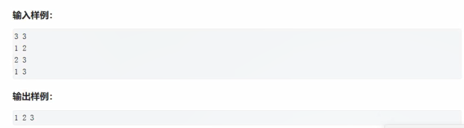

```java
package _03_搜素与图论;

import java.io.BufferedReader;
import java.io.BufferedWriter;
import java.io.IOException;
import java.io.InputStreamReader;
import java.io.OutputStreamWriter;
import java.io.PrintWriter;
import java.io.StreamTokenizer;
import java.util.Arrays;

/*
3 3
1 2
2 3
1 3
输出
1 2 3
 * */

public class _04_有向图的拓扑排序 {
 static BufferedReader br = new BufferedReader(new InputStreamReader(System.in));
 static BufferedWriter bw = new BufferedWriter(new OutputStreamWriter(System.out));
 static StreamTokenizer st = new StreamTokenizer(br);
 static PrintWriter pw = new PrintWriter(bw);
 public static void main(String[] args) {
  int N = nextInt();
  int M = nextInt();
  Graph graph = new Graph(N+1, M+1);
  while(M--!=0) {
   graph.add(nextInt(), nextInt());
  }
  int[] res = graph.topOrder();
  if(res!=null) {
   int i=1;
   for(;i<res.length-1;i++) pw.printf("%d ",res[i]);
   pw.println(res[i]);
  }else pw.println(-1);
  pw.flush();
 }
 static class Graph{
  int NODE_MAX_SIZE,EDGE_MAX_SIZE,NULL=0x3f3f3f3f;// 常量定义
  int node[],vale[],next[],idx;
  int in[];// 入度
  int nodeCounter;// 存在的节点数统计
  public Graph(int nodeMaxSize,int edgeMaxSize) {
   NODE_MAX_SIZE=nodeMaxSize;
   EDGE_MAX_SIZE=edgeMaxSize;
   in=new int[NODE_MAX_SIZE];
   node=new int[NODE_MAX_SIZE];
   vale=new int[EDGE_MAX_SIZE];
   next=new int[EDGE_MAX_SIZE];
   Arrays.fill(node, NULL);
   Arrays.fill(in, NULL);
   idx=0;
   nodeCounter=0;
  }
//  添加a->b的边
  void add(int a,int b) {
   vale[idx]=b;next[idx]=node[a];node[a]=idx++;
   
   if(in[a]==NULL) {in[a]=0; nodeCounter++;}// 第一次单独初始化，保证不存在的节点入度为NULL
   if(in[b]==NULL) {in[b]=0; nodeCounter++;}
   
   in[b]++;// 入度自增
  }
  int[] topOrder() {
   int queue[]=new int[NODE_MAX_SIZE],front=1,tail=1,qsize=0;// 建队列，从1开始存，因为这里所有的下标都是从1开始，这里为了统一
   boolean visited[]=new boolean[NODE_MAX_SIZE];// 防止有环导致死循环
   for(int node=0;node<NODE_MAX_SIZE;node++) {
    if(in[node]==0) {
     queue[tail++]=node;// 找到所有入度为0的节点，入队
     visited[node]=true;// 标记访问，防止死循环
     qsize++;
    }
   }
   while (front<tail) {
    int v = queue[front++];
    for(int p = node[v];p!=NULL;p=next[p]) {
     if(!visited[vale[p]]) {
      if(--in[vale[p]]==0) {
       queue[tail++]=vale[p];// 入度自减后为0，说明该节点不依赖其他节点了，可以被后续处理，入队
       visited[vale[p]]=true;// 标记访问，防止死循环
       qsize++;
      }
     }
    }
   }
   if(qsize==nodeCounter) return queue;// qsize==nodeCounter说明填满了，说明该图是一个无环拓扑图
   else return null;
  }
 }
 
 
 
 
 
 static int nextInt() {
  try {
   st.nextToken();
  } catch (IOException e) {
   // TODO 自动生成的 catch 块
   e.printStackTrace();
  }
  return (int) st.nval;
 }
 static String nextStr() {
  try {
   st.nextToken();
  } catch (IOException e) {
   // TODO 自动生成的 catch 块
   e.printStackTrace();
  }
  return st.sval;
 }
 
}

```

### 最短路

**模板题**


**最短路**

- 最短路问题不区分是否是有向图，无向图是特殊的有向图，是有向图的一种，所以只需要考虑有项图即可
- define
  - 边多的图叫稠密图
  - n 节点数
  - m 边数
- 单源最短路
  - 边权重为正
    - 朴素Dijkstra算法O(N^2)，适合边数多的稠密图
      - Dijkstra基于贪心
    - 堆优化Dijkstra算法O(mLogN)
  - 边权重含负
    - Bellman-Ford算法O(MN)
      - 基于离散数学
    - SPFA:
      - 是Bellman-Ford算法的优化，但是无法限制最短路经过的路径数
      - 平均：O（M）
      - 最坏：O(MN)
- 多源汇聚最短路
  - Floyd算法 O(N^3)
    - 基于动态规划
    - 可以处理负权边


#### 朴素Dijkstra算法

**思路**

- 初始化dis[起始点]=0,dis[other]=正无穷
- s=已经确定最短路径的点的集合
- for i:n
  - t=不在s中的，距离最近的点
  - s.add(t)
  - 用t更新其他点的距离
- 朴素版算法由于边数很多是稠密图，所以用邻接矩阵存储。

##### 题目：Dijkstra求最短路


###### 邻接矩阵写法

```java
package _03_搜素与图论;

import java.io.BufferedReader;
import java.io.BufferedWriter;
import java.io.IOException;
import java.io.InputStreamReader;
import java.io.OutputStreamWriter;
import java.io.PrintWriter;
import java.io.StreamTokenizer;
import java.util.Arrays;
/*
3 3
1 2 2
2 3 1
1 3 4
 * */
public class _06_dijkstra算法_邻接矩阵法 {
 static BufferedReader br =new BufferedReader(new InputStreamReader(System.in));
 static BufferedWriter bw = new BufferedWriter(new OutputStreamWriter(System.out));
 static StreamTokenizer st =new StreamTokenizer(br);
 static PrintWriter pw = new PrintWriter(bw);
 static int[][] matrix;
 static int MAX_VAL = 0x3f3f3f3f;
 static void init() {
  for (int i = 1; i < matrix.length; i++) {
   Arrays.fill(matrix[i], MAX_VAL);
  }
 }
 static void addEdge(int a,int b,int weight) {
  matrix[a][b] = Math.min(matrix[a][b], weight);
 }
 static int[] dijkstra(int from) {
  int[] distanceMap = new int[matrix.length];
  boolean[] arrived = new boolean[matrix.length];
  Arrays.fill(distanceMap, MAX_VAL);
  distanceMap[from]=0;// 自己到自己为0
  for (int i = 1; i < matrix.length; i++) {// 迭代N次
   int minNode = getMinDistanceNodeExcludeArrived(distanceMap, arrived);
   arrived[minNode]=true;
   for (int next = 1; next < matrix.length; next++) {
    int w =  matrix[minNode][next];
    int curDis = distanceMap[minNode];
    distanceMap[next] = Math.min(distanceMap[next], curDis + w);
   }
  }
  return distanceMap;
 }
 static int getMinDistanceNodeExcludeArrived(int[] distanceMap,boolean[] arrived) {
  int minNode=-1,minDis=Integer.MAX_VALUE;
  for (int i = 1; i < distanceMap.length; i++) {
   if( !arrived[i] && distanceMap[i]<minDis) {
    minDis=distanceMap[i];
    minNode=i;
   }
  }
  return minNode;
 }
 public static void main(String[] args) {
  int N = nextInt();
  int M = nextInt();
  matrix = new int[N+1][N+1];
  init();
  while (M--!=0) {
   addEdge(nextInt(), nextInt(), nextInt());
  }

  int[] res = dijkstra(1);
//  int i=1;
//  for(;i<res.length-1;i++) pw.printf("%d ", res[i]); pw.println(res[i]); // 输出1-》所有节点的最短距离
  if(res[N]==MAX_VAL) pw.println(-1);
  else pw.println(res[N]);// 输出1->N的最短距离
  pw.flush();
 }
 static int nextInt() {
  try {
   st.nextToken();
  } catch (IOException e) {
   // TODO 自动生成的 catch 块
   e.printStackTrace();
  }
  return (int) st.nval;
 }
 static String nextStr() {
  try {
   st.nextToken();
  } catch (IOException e) {
   // TODO 自动生成的 catch 块
   e.printStackTrace();
  }
  return st.sval;
 }
}
```

###### 邻接表写法

```java
package _03_搜素与图论;

import java.io.BufferedReader;
import java.io.BufferedWriter;
import java.io.IOException;
import java.io.InputStreamReader;
import java.io.OutputStreamWriter;
import java.io.PrintWriter;
import java.io.StreamTokenizer;
import java.util.Arrays;
/*
3 3
1 2 2
2 3 1
1 3 4
输出
3
 * */
public class _07_dijkstra算法_邻接表法 {
 static BufferedReader br =new BufferedReader(new InputStreamReader(System.in));
 static BufferedWriter bw = new BufferedWriter(new OutputStreamWriter(System.out));
 static StreamTokenizer st =new StreamTokenizer(br);
 static PrintWriter pw = new PrintWriter(bw);
 static int node[],edge[],weight[],next[],idx;
 static int MAX_NODE,MAX_EDGE;
 static int MAX_VAL = 0x3f3f3f3f,NULL=-1;
 static void init(int n,int m) {
  MAX_NODE=n;
  MAX_EDGE=m;
  node=new int[MAX_NODE+1];
  edge=new int[MAX_EDGE+1];
  weight=new int[MAX_EDGE+1];
  next=new int[MAX_EDGE+1];
  idx=0;
  Arrays.fill(node, NULL);
 }
 static void addEdge(int a,int b,int w) {
  edge[idx]=b;weight[idx]=w;// 存储
  next[idx]=node[a];node[a]=idx++;// 头插法
 }
 static int[] dijkstra(int from) {
  int[] distanceMap = new int[node.length];
  boolean[] arrived = new boolean[node.length];
  Arrays.fill(distanceMap, MAX_VAL);
  distanceMap[from]=0;// 自己到自己为0
  for (int i = 1; i <= MAX_NODE; i++) {// 迭代N次
   int minNode = getMinDistanceNodeExcludeArrived(distanceMap, arrived);
   arrived[minNode]=true;
   int toMinDis = distanceMap[minNode];
   for (int p = node[minNode]; p !=NULL ; p=next[p]) {
    int curNode = edge[p];
    int curWigt = weight[p];
    distanceMap[curNode] = Math.min(distanceMap[curNode], toMinDis + curWigt);
   }
  }
  return distanceMap;
 }
 static int getMinDistanceNodeExcludeArrived(int[] distanceMap,boolean[] arrived) {
  int minNode=-1,minDis=MAX_VAL;
  for (int i = 1; i < distanceMap.length; i++) {
   if( !arrived[i] && distanceMap[i]<minDis) {
    minDis=distanceMap[i];
    minNode=i;
   }
  }
  return minNode;
 }
 public static void main(String[] args) {
  int N = nextInt();
  int M = nextInt();
  init(N, M);
  while (M--!=0) {
   addEdge(nextInt(), nextInt(), nextInt());
  }
  int[] res = dijkstra(1);
  if(res[N]==MAX_VAL) pw.println(-1);
  else pw.println(res[N]);// 输出1->N的最短距离
  pw.flush();
 }
 static int nextInt() {
  try {
   st.nextToken();
  } catch (IOException e) {
   // TODO 自动生成的 catch 块
   e.printStackTrace();
  }
  return (int) st.nval;
 }
 static String nextStr() {
  try {
   st.nextToken();
  } catch (IOException e) {
   // TODO 自动生成的 catch 块
   e.printStackTrace();
  }
  return st.sval;
 }
}
```

###### 图的模板写法

```java
package _03_搜素与图论;

import java.io.BufferedReader;
import java.io.BufferedWriter;
import java.io.IOException;
import java.io.InputStreamReader;
import java.io.OutputStreamWriter;
import java.io.PrintWriter;
import java.io.StreamTokenizer;
import java.util.ArrayList;
import java.util.HashMap;
import java.util.HashSet;
import java.util.PriorityQueue;
import java.util.Map.Entry;
import java.util.Set;

import javafx.util.Pair;

/*
3 3
1 2 2
2 3 1
1 3 4
输出
3
 * */
public class _08_dijkstra算法_堆优化版_图的通用模板写法 {
 static BufferedReader br =new BufferedReader(new InputStreamReader(System.in));
 static BufferedWriter bw = new BufferedWriter(new OutputStreamWriter(System.out));
 static StreamTokenizer st =new StreamTokenizer(br);
 static PrintWriter pw = new PrintWriter(bw);
 public static void main(String[] args) {
  Graph graph = createGraph();
  HashMap<Node, Integer>  distanceMap = Dijkstra(graph, 1);
  Integer disToN = distanceMap.get(graph.nodes.get(graph.nodes.size()));// 求1->N的最短距离
  if(disToN!=null) pw.println(disToN);
  else pw.println(-1);
  pw.flush();
 }
 static int MAX_VAL = 0x3f3f3f3f;
 static HashMap<Node, Integer> Dijkstra(Graph g,int from) {
  HashSet<Node> arrived = new HashSet<>();
  HashMap<Node, Integer> distanceMap = new HashMap<>();
  distanceMap.put(g.nodes.get(from), 0);// 自己到自己的距离是0
  PriorityQueue<Info> heap = new PriorityQueue<>(
    (o1,o2)->o1.distance-o2.distance// 小根堆
  );
  heap.add(new Info(g.nodes.get(from), 0));// 自己到自己的距离是0
  while (!heap.isEmpty()) {
   Info minInfo  = heap.poll();// 距离最近的点就在堆顶
   Node minNode = minInfo.node;
   if(arrived.contains(minNode)) continue;// 由于没有更新和删除操作，堆顶可能存在到达过节点删除即可
   arrived.add(minNode);
   for(Edge edge:minNode.edges) {
    Node to = edge.to;
    int curDis = distanceMap.get(minNode);
    if(!distanceMap.containsKey(to)) distanceMap.put(to, MAX_VAL);
    distanceMap.put(to, Math.min(distanceMap.get(to),curDis+edge.weight));
    heap.add(new Info(to, distanceMap.get(to)));
   }
  }
  return distanceMap;
 }
 static class Info{
  public Node node;
  public int distance;
  public Info(Node node, int distance) {
   this.node = node;
   this.distance = distance;
  }
  
 }
 static Graph createGraph() {
  Graph graph = new Graph();
  
  int N = nextInt();
  int M = nextInt();
  
  while(M--!=0) {
   int n1 = nextInt();
   int n2 = nextInt();
   int wi = nextInt();
   
   Node node1=null;
   Node node2=null;
   
   if(!graph.nodes.containsKey(n1)) graph.nodes.put(n1, new Node(n1));
   if(!graph.nodes.containsKey(n2)) graph.nodes.put(n2, new Node(n2));
   
   node1 = graph.nodes.get(n1);
   node2 = graph.nodes.get(n2);
   
   Edge edge=new Edge(node1, node2, wi);
   node1.edges.add(edge);
   graph.edges.add(edge);
  }
  return graph;
 }
 
 static class Graph{
  HashMap<Integer, Node> nodes = new HashMap<>();
  Set<Edge> edges = new HashSet<>();

 }
 static class Node{
  int in,out;
  int val;
  ArrayList<Node> nexts = new ArrayList<>();
  ArrayList<Edge> edges = new ArrayList<>();
  public Node(int val) {
   this.val = val;
  }
 }
 static class Edge{
  int weight;
  Node from,to;
  public Edge(Node from, Node to,int weight) {
   this.weight = weight;
   this.from = from;
   this.to = to;
  }
 }
 static int nextInt() {
  try {
   st.nextToken();
  } catch (IOException e) {
   // TODO 自动生成的 catch 块
   e.printStackTrace();
  }
  return (int) st.nval;
 }
 static String nextStr() {
  try {
   st.nextToken();
  } catch (IOException e) {
   // TODO 自动生成的 catch 块
   e.printStackTrace();
  }
  return st.sval;
 }
}


```

#### 堆优化版的Dijkstra算法

##### 邻接表Dijkstra算法堆优化版写法

```java
package _03_搜素与图论;

import java.io.BufferedReader;
import java.io.BufferedWriter;
import java.io.IOException;
import java.io.InputStreamReader;
import java.io.OutputStreamWriter;
import java.io.PrintWriter;
import java.io.StreamTokenizer;
import java.util.Arrays;
import java.util.PriorityQueue;

import _03_搜素与图论._08_dijkstra算法_堆优化版.Node;
/*
3 3
1 2 2
2 3 1
1 3 4
输出
3
 * */
public class _09_dijkstra算法_堆优化版_邻接表法 {
 static BufferedReader br =new BufferedReader(new InputStreamReader(System.in));
 static BufferedWriter bw = new BufferedWriter(new OutputStreamWriter(System.out));
 static StreamTokenizer st =new StreamTokenizer(br);
 static PrintWriter pw = new PrintWriter(bw);
 static int node[],edge[],weight[],next[],idx;
 static int MAX_NODE,MAX_EDGE;
 static int MAX_VAL = 0x3f3f3f3f,NULL=-1;
 static void init(int n,int m) {
  MAX_NODE=n;
  MAX_EDGE=m;
  node=new int[MAX_NODE+1];
  edge=new int[MAX_EDGE+1];
  weight=new int[MAX_EDGE+1];
  next=new int[MAX_EDGE+1];
  idx=0;
  Arrays.fill(node, NULL);
 }
 static void addEdge(int a,int b,int w) {
  edge[idx]=b;weight[idx]=w;// 存储
  next[idx]=node[a];node[a]=idx++;// 头插法
 }
 static int[] dijkstra(int from) {
  int[] distanceMap = new int[node.length];
  boolean[] arrived = new boolean[node.length];
  PriorityQueue<Info> heap = new PriorityQueue<>();
  Arrays.fill(distanceMap, MAX_VAL);
  distanceMap[from]=0;// 自己到自己为0
  heap.add(new Info(from, 0));
  while (heap.size()>0) {// 迭代N次
   Info minInfo = heap.poll();
   int minNode = minInfo.node;
   if(arrived[minNode]) continue;
   arrived[minNode]=true;
   int toMinDis = distanceMap[minNode];
   for (int p = node[minNode]; p !=NULL ; p=next[p]) {
    int curNode = edge[p];
    int curWigt = weight[p];
    distanceMap[curNode] = Math.min(distanceMap[curNode], toMinDis + curWigt);
    heap.add(new Info(curNode, distanceMap[curNode]));
   }
  }
  return distanceMap;
 }
 static class Info implements Comparable<Info>{
  public int node,distance;
  public Info(int from, int distance) {
   this.node = from;
   this.distance = distance;
  }
  @Override
  public int compareTo(Info o) {
   return distance-o.distance;
  }
 }
 static int getMinDistanceNodeExcludeArrived(int[] distanceMap,boolean[] arrived) {
  int minNode=-1,minDis=MAX_VAL;
  for (int i = 1; i < distanceMap.length; i++) {
   if( !arrived[i] && distanceMap[i]<minDis) {
    minDis=distanceMap[i];
    minNode=i;
   }
  }
  return minNode;
 }
 public static void main(String[] args) {
  int N = nextInt();
  int M = nextInt();
  init(N, M);
  while (M--!=0) {
   addEdge(nextInt(), nextInt(), nextInt());
  }
  int[] res = dijkstra(1);
  if(res[N]==MAX_VAL) pw.println(-1);
  else pw.println(res[N]);// 输出1->N的最短距离
  pw.flush();
 }
 static int nextInt() {
  try {
   st.nextToken();
  } catch (IOException e) {
   // TODO 自动生成的 catch 块
   e.printStackTrace();
  }
  return (int) st.nval;
 }
 static String nextStr() {
  try {
   st.nextToken();
  } catch (IOException e) {
   // TODO 自动生成的 catch 块
   e.printStackTrace();
  }
  return st.sval;
 }
}

```

##### 图的通用模板写法

```java
package _03_搜素与图论;

import java.io.BufferedReader;
import java.io.BufferedWriter;
import java.io.IOException;
import java.io.InputStreamReader;
import java.io.OutputStreamWriter;
import java.io.PrintWriter;
import java.io.StreamTokenizer;
import java.util.ArrayList;
import java.util.HashMap;
import java.util.HashSet;
import java.util.PriorityQueue;
import java.util.Map.Entry;
import java.util.Set;

import javafx.util.Pair;

/*
3 3
1 2 2
2 3 1
1 3 4
输出
3
 * */
public class _08_dijkstra算法_堆优化版_图的通用模板写法 {
 static BufferedReader br =new BufferedReader(new InputStreamReader(System.in));
 static BufferedWriter bw = new BufferedWriter(new OutputStreamWriter(System.out));
 static StreamTokenizer st =new StreamTokenizer(br);
 static PrintWriter pw = new PrintWriter(bw);
 public static void main(String[] args) {
  Graph graph = createGraph();
  HashMap<Node, Integer>  distanceMap = Dijkstra(graph, 1);
  Integer disToN = distanceMap.get(graph.nodes.get(graph.nodes.size()));// 求1->N的最短距离
  if(disToN!=null) pw.println(disToN);
  else pw.println(-1);
  pw.flush();
 }
 static int MAX_VAL = 0x3f3f3f3f;
 static HashMap<Node, Integer> Dijkstra(Graph g,int from) {
  HashSet<Node> arrived = new HashSet<>();
  HashMap<Node, Integer> distanceMap = new HashMap<>();
  distanceMap.put(g.nodes.get(from), 0);// 自己到自己的距离是0
  PriorityQueue<Info> heap = new PriorityQueue<>(
    (o1,o2)->o1.distance-o2.distance// 小根堆
  );
  heap.add(new Info(g.nodes.get(from), 0));// 自己到自己的距离是0
  while (!heap.isEmpty()) {
   Info minInfo  = heap.poll();// 距离最近的点就在堆顶
   Node minNode = minInfo.node;
   if(arrived.contains(minNode)) continue;// 由于没有更新和删除操作，堆顶可能存在到达过节点删除即可
   arrived.add(minNode);
   for(Edge edge:minNode.edges) {
    Node to = edge.to;
    int curDis = distanceMap.get(minNode);
    if(!distanceMap.containsKey(to)) distanceMap.put(to, MAX_VAL);
    distanceMap.put(to, Math.min(distanceMap.get(to),curDis+edge.weight));
    heap.add(new Info(to, distanceMap.get(to)));
   }
  }
  return distanceMap;
 }
 static class Info{
  public Node node;
  public int distance;
  public Info(Node node, int distance) {
   this.node = node;
   this.distance = distance;
  }
  
 }
 static Graph createGraph() {
  Graph graph = new Graph();
  
  int N = nextInt();
  int M = nextInt();
  
  while(M--!=0) {
   int n1 = nextInt();
   int n2 = nextInt();
   int wi = nextInt();
   
   Node node1=null;
   Node node2=null;
   
   if(!graph.nodes.containsKey(n1)) graph.nodes.put(n1, new Node(n1));
   if(!graph.nodes.containsKey(n2)) graph.nodes.put(n2, new Node(n2));
   
   node1 = graph.nodes.get(n1);
   node2 = graph.nodes.get(n2);
   
   Edge edge=new Edge(node1, node2, wi);
   node1.edges.add(edge);
   graph.edges.add(edge);
  }
  return graph;
 }
 
 static class Graph{
  HashMap<Integer, Node> nodes = new HashMap<>();
  Set<Edge> edges = new HashSet<>();

 }
 static class Node{
  int in,out;
  int val;
  ArrayList<Node> nexts = new ArrayList<>();
  ArrayList<Edge> edges = new ArrayList<>();
  public Node(int val) {
   this.val = val;
  }
 }
 static class Edge{
  int weight;
  Node from,to;
  public Edge(Node from, Node to,int weight) {
   this.weight = weight;
   this.from = from;
   this.to = to;
  }
 }
 static int nextInt() {
  try {
   st.nextToken();
  } catch (IOException e) {
   // TODO 自动生成的 catch 块
   e.printStackTrace();
  }
  return (int) st.nval;
 }
 static String nextStr() {
  try {
   st.nextToken();
  } catch (IOException e) {
   // TODO 自动生成的 catch 块
   e.printStackTrace();
  }
  return st.sval;
 }
}

```

#### Bellman-Ford算法

**步骤**

- 迭代N次
  - backup() // 备份backup数组，防止修改的数据互相影响
  - for遍历所有M条边 ｛from,to,weight｝<= edges
    - `dist[to]=min(dist[to],dist[from]+weight);` // 松弛操作
- 更新完毕后对于所有的边都满足：`dist[to]<=dist[from]+weight` // 三角不等式
- **实际含义：** 迭代k次后的dist数组，从某点经过不超过k条边，到其他每个节点的最短距离。
- **寻找负环：** 迭代n次后，dist数组仍然有更新，说明可以找到一条路径，该路径经过n条边后可以更短，n个点的路径上至少有n-1条边，现在能找到n条边，说明有环。
  - 找负环一般用SPFA算法，因为当前算法时间复杂度较高O(NM)
- 如果起点与目标位置的路径上存在含负权边的回路，最短路将不存在，因为可以通过不断经过环使距离变为负无穷。
  - 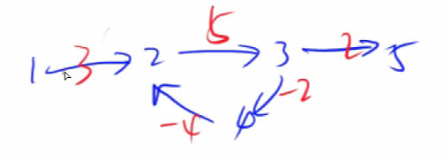
- 起点与目标位置的路径之外上的负环，不会影响最短距离的计算
  - 

**题目：有边数限制的最短路**


```java
package _03_搜素与图论;

import java.io.BufferedReader;
import java.io.BufferedWriter;
import java.io.IOException;
import java.io.InputStreamReader;
import java.io.OutputStreamWriter;
import java.io.PrintWriter;
import java.io.StreamTokenizer;
import java.util.ArrayList;
import java.util.Arrays;
/*
输入
3 3 1
1 2 1
2 3 1
1 3 3
输出
3
 * */
public class _10_bellman_ford算法 {
 static BufferedReader br = new BufferedReader(new InputStreamReader(System.in));
 static BufferedWriter bw = new BufferedWriter(new OutputStreamWriter(System.out));
 static StreamTokenizer st = new StreamTokenizer(br);
 static PrintWriter pw = new PrintWriter(bw);
 
 static int Max_Val = 0x3f3f3f3f,MAX_NODE,MAX_EDGE;
 static class Edge{
  int from,to,weight;
  public Edge(int from, int to, int weight) {
   this.from = from;
   this.to = to;
   this.weight = weight;
  }
 }
 static ArrayList<Edge> edges = new ArrayList<>();
 static int[] bellman_ford(int from,int k) {
  int[] dist = new int[edges.size()+1];
  int[] backup = new int[edges.size()+1];
  Arrays.fill(dist, Max_Val);
  dist[from]=0;// 自己到自己的距离为0
  for(int i=1;i<=k;i++) {// k次k条边
   System.arraycopy(dist, 0, backup, 0, backup.length);// 拷贝到backup
   for(Edge edge:edges) {
    dist[edge.to]=Math.min(dist[edge.to], backup[edge.from]+edge.weight);
   }
  }
  return dist;
 }
 public static void main(String[] args) {
  int N = nextInt();
  int M = nextInt();
  int K = nextInt();
  MAX_NODE=N;
  MAX_EDGE=M;
  while(M--!=0) {
   edges.add(new Edge(nextInt(), nextInt(), nextInt()));
  }
//  这里求的是1号节点到N号节点的距离
  int[] res = bellman_ford(1,K);
  if(res[N]>Max_Val/2) pw.println("impossible");
  else pw.println(res[N]);
  pw.flush();
 }
 static int nextInt() {
  try {
   st.nextToken();
  } catch (IOException e) {
   // TODO 自动生成的 catch 块
   e.printStackTrace();
  }
  return (int) st.nval;
 }
 static String nextStr() {
  try {
   st.nextToken();
  } catch (IOException e) {
   // TODO 自动生成的 catch 块
   e.printStackTrace();
  }
  return st.sval;
 }
}
```

#### SPFA算法

**步骤**

- SPFA算法是bellman_ford算法的优化
- bellman_ford算法中最关键的一句就是松弛操作：
  - `dist[to]=min(dist[to],dist[from]+weight);`
  - 这一句中是在更新到达dist[to]的距离，实际上，只有当dist[from]被更新时，dist[to]才有可能被更新，
  - 所以优化的方法就是，当某个节点被更新时，便将其相邻的节点全部加入待更新的队列中。

```java
package _03_搜素与图论;

import java.io.BufferedReader;
import java.io.BufferedWriter;
import java.io.IOException;
import java.io.InputStreamReader;
import java.io.OutputStreamWriter;
import java.io.PrintWriter;
import java.io.StreamTokenizer;
import java.util.Arrays;
import java.util.LinkedList;
import java.util.Queue;
/*
3 3
1 2 2
2 3 1
1 3 4
输出
3
 * */
public class _11_SPFA算法 {
 static BufferedReader br =new BufferedReader(new InputStreamReader(System.in));
 static BufferedWriter bw = new BufferedWriter(new OutputStreamWriter(System.out));
 static StreamTokenizer st =new StreamTokenizer(br);
 static PrintWriter pw = new PrintWriter(bw);
 static int node[],edge[],weight[],next[],idx;
 static int MAX_NODE,MAX_EDGE;
 static int MAX_VAL = 0x3f3f3f3f,NULL=-1;
 static void init(int n,int m) {
  MAX_NODE=n;
  MAX_EDGE=m;
  node=new int[MAX_NODE+1];
  edge=new int[MAX_EDGE+1];
  weight=new int[MAX_EDGE+1];
  next=new int[MAX_EDGE+1];
  idx=0;
  Arrays.fill(node, NULL);
 }
 static void addEdge(int a,int b,int w) {
  edge[idx]=b;weight[idx]=w;// 存储
  next[idx]=node[a];node[a]=idx++;// 头插法
 }
 static int[] SPFA(int from) {
  int[] distanceMap = new int[node.length];
  boolean[] inQueue = new boolean[node.length];
  Arrays.fill(distanceMap, MAX_VAL);
  Queue<Integer> queue = new LinkedList<>();
  distanceMap[from]=0;// 自己到自己为0
  queue.add(from);
  inQueue[from]=true;
  while (!queue.isEmpty()) {
   int updatedNode = queue.poll();
   inQueue[updatedNode]=false;
   int updatedNodeDis = distanceMap[updatedNode];
   for (int p = node[updatedNode]; p !=NULL ; p=next[p]) {
    int curNode = edge[p];
    int curWigt = weight[p];
    if(updatedNodeDis+curWigt<distanceMap[curNode]) {
     distanceMap[curNode] = updatedNodeDis + curWigt;
     if(!inQueue[curNode]) {
      queue.add(curNode);
      inQueue[curNode]=true;
     }
    }
   }
  }
  return distanceMap;
 }
 public static void main(String[] args) {
  int N = nextInt();
  int M = nextInt();
  init(N, M);
  while (M--!=0) {
   addEdge(nextInt(), nextInt(), nextInt());
  }
  int[] res = SPFA(1);
  if(res[N]==MAX_VAL) pw.println(-1);
  else pw.println(res[N]);// 输出1->N的最短距离
  pw.flush();
 }
 static int nextInt() {
  try {
   st.nextToken();
  } catch (IOException e) {
   // TODO 自动生成的 catch 块
   e.printStackTrace();
  }
  return (int) st.nval;
 }
 static String nextStr() {
  try {
   st.nextToken();
  } catch (IOException e) {
   // TODO 自动生成的 catch 块
   e.printStackTrace();
  }
  return st.sval;
 }
}

```

#### SPFA判断负环

**步骤**

- 在SPFA的基础上，引入cnt[x]数组，用来统计到x的最短路径上的边的数量
- 更新最短路径距离时执行:
  - `dist[to]=dist[from]+weight`
  - `cnt[to]=cnt[from]+1`
- 当`cnt[x]>=总节点数时`，说明存在负环。


```java
package _03_搜素与图论;

import java.io.BufferedReader;
import java.io.BufferedWriter;
import java.io.IOException;
import java.io.InputStreamReader;
import java.io.OutputStreamWriter;
import java.io.PrintWriter;
import java.io.StreamTokenizer;
import java.util.Arrays;
import java.util.Iterator;
import java.util.LinkedList;
import java.util.Queue;
/*
3 3
1 2 -1
2 3 4
3 1 -4
输出
3
 * */
public class _12_SPFA算法_求负环 {
 static BufferedReader br =new BufferedReader(new InputStreamReader(System.in));
 static BufferedWriter bw = new BufferedWriter(new OutputStreamWriter(System.out));
 static StreamTokenizer st =new StreamTokenizer(br);
 static PrintWriter pw = new PrintWriter(bw);
 static int node[],edge[],weight[],next[],idx;
 static int MAX_NODE,MAX_EDGE;
 static int MAX_VAL = 0x3f3f3f3f,NULL=-1;
 static void init(int n,int m) {
  MAX_NODE=n;
  MAX_EDGE=m;
  node=new int[MAX_NODE+1];
  edge=new int[MAX_EDGE+1];
  weight=new int[MAX_EDGE+1];
  next=new int[MAX_EDGE+1];
  idx=0;
  Arrays.fill(node, NULL);
 }
 static void addEdge(int a,int b,int w) {
  edge[idx]=b;weight[idx]=w;// 存储
  next[idx]=node[a];node[a]=idx++;// 头插法
 }
 static boolean SPFA_haveNegativeLoop() {
  int[] distanceMap = new int[node.length]; 
  int[] cnt = new int[node.length]; // 记录经过的边数
//  Arrays.fill(distanceMap, MAX_VAL); // 不需要初始化dist数组
  boolean[] inQueue = new boolean[node.length];
  Queue<Integer> queue = new LinkedList<>();
  for (int i = 1; i <= MAX_NODE; i++) {
   queue.add(i);// 所有节点入队
   inQueue[i]=true;
  }
  while (!queue.isEmpty()) {
   int updatedNode = queue.poll();
   inQueue[updatedNode]=false;
   int updatedNodeDis = distanceMap[updatedNode];
   for (int p = node[updatedNode]; p !=NULL ; p=next[p]) {
    int curNode = edge[p];
    int curWigt = weight[p];
    if(updatedNodeDis+curWigt<distanceMap[curNode]) {
     distanceMap[curNode] = updatedNodeDis + curWigt;
     if(!inQueue[curNode]) {
      queue.add(curNode);
      inQueue[curNode]=true;
      cnt[curNode]=cnt[updatedNode]+1;// 更新距离
      if(cnt[curNode]>=MAX_NODE) {
       return true;
      }
     }
    }
   }
  }
  return false;
 }
 public static void main(String[] args) {
  int N = nextInt();
  int M = nextInt();
  init(N, M);
  while (M--!=0) {
   addEdge(nextInt(), nextInt(), nextInt());
  }

  if(SPFA_haveNegativeLoop()) pw.println("Yes");
  else pw.println("No");// 输出1->N的最短距离
  pw.flush();
 }
 static int nextInt() {
  try {
   st.nextToken();
  } catch (IOException e) {
   // TODO 自动生成的 catch 块
   e.printStackTrace();
  }
  return (int) st.nval;
 }
 static String nextStr() {
  try {
   st.nextToken();
  } catch (IOException e) {
   // TODO 自动生成的 catch 块
   e.printStackTrace();
  }
  return st.sval;
 }
}
```

#### Floyd算法

Floyd算法用来求解赋权图中每对顶点间的最短距离。在求距离的过程中也可以得到最短距离的路径。


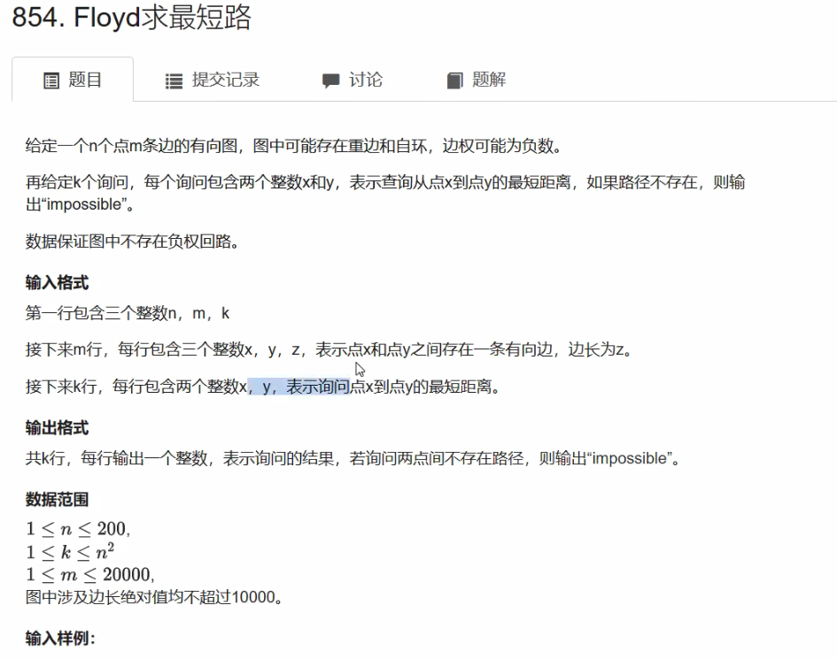


```java
package _03_搜素与图论;

import java.io.BufferedReader;
import java.io.BufferedWriter;
import java.io.IOException;
import java.io.InputStreamReader;
import java.io.OutputStreamWriter;
import java.io.PrintWriter;
import java.io.StreamTokenizer;
import java.util.Arrays;
/*
3 3 2
1 2 1
2 3 2
1 3 1
2 1
1 3
输出
impossible
1
 * */
public class _13_Floyd算法 {
 static BufferedReader br =new BufferedReader(new InputStreamReader(System.in));
 static BufferedWriter bw = new BufferedWriter(new OutputStreamWriter(System.out));
 static StreamTokenizer st =new StreamTokenizer(br);
 static PrintWriter pw = new PrintWriter(bw);
 static int matrix[][];
 static int MAX_NODE,MAX_EDGE;
 static int INF=0x3f3f3f3f;
 static void init(int n,int m) {
  MAX_NODE=n;
  MAX_EDGE=m;
  matrix = new int[MAX_NODE+1][MAX_NODE+1];
  for (int i = 0; i < matrix.length; i++) {
   Arrays.fill(matrix[i], INF);
  }
 }
 static void addEdge(int a,int b,int w) {
  matrix[a][b]=w;
//  matrix[b][a]=w;
 }
 static int[][] floyd() {
  for (int k = 1; k <= MAX_NODE; k++) {
   for (int a = 1; a <= MAX_NODE; a++) {
    for (int b = 1; b <= MAX_NODE; b++) {
     matrix[a][b]=Math.min(matrix[a][b], matrix[a][k]+matrix[k][b]);
    }
   }
  }
//  matrix[a][b] 中存的就是a->b的最短距离
  return matrix;
 }
 public static void main(String[] args) {
  int N = nextInt();
  int M = nextInt();
  int Q = nextInt();
  init(N, M);
  while (M--!=0) {
   addEdge(nextInt(), nextInt(), nextInt());
  }
  int[][] res = floyd();
  while (Q--!=0) {
   int a =nextInt();
   int b=nextInt();
   if(res[a][b]>=INF/2) pw.println("impossible");
   else pw.println(res[a][b]);
  }
  pw.flush();
 }
 static int nextInt() {
  try {
   st.nextToken();
  } catch (IOException e) {
   // TODO 自动生成的 catch 块
   e.printStackTrace();
  }
  return (int) st.nval;
 }
 static String nextStr() {
  try {
   st.nextToken();
  } catch (IOException e) {
   // TODO 自动生成的 catch 块
   e.printStackTrace();
  }
  return st.sval;
 }
}
```

### 最小生成树

一般讨论的是**无向图**问题，有向图很少用

- Prim普利姆算法
  - **朴素版Prim**
    - O(n^2)
    - 稠密图
    - 常用
  - **堆优化版Prim**
    - O(mlogn)
    - 稀疏图
    - 不常用
- Kruskal克鲁斯卡尔算法
  - O(mlogm)
  - 稀疏图
  - 常用

#### Prim普利姆算法

> 这个算法还是感觉左程云讲的比较好理解

**步骤**

- 这里似乎是针对邻接矩阵的算法
- dist[1:N]=INF // 初始化所有节点到连通图的距离是无穷
- cont[1:N]=false // 初始化所有节点没有连通到图
- for(i:N) // 遍历所有节点
  - curNode =  从dist中找出距离连通块最近的节点，且不能是已经连接到联通块的节点
    - 堆优化版就是针对这一步进行优化，
  - if(i>1&&dist[curNode]==INF) return INF // 编写代码时需要考虑的边界情况，第一个点的距离不需要考虑
  - if(i>1) res+=dist[curNode] // 编写代码时需要考虑的边界情况,从第二个节点开始，把距离最近的点的路径加入统计
  - cont[curNode] = true;//标记加入到联通块中
  - 用该节点到其他点的距离来更新连通块到其他点的距离


```java
package _03_搜素与图论;

import java.io.BufferedReader;
import java.io.BufferedWriter;
import java.io.IOException;
import java.io.InputStreamReader;
import java.io.OutputStreamWriter;
import java.io.PrintWriter;
import java.io.StreamTokenizer;
import java.util.Arrays;

/**
4 5
1 2 1
1 3 2
1 4 3
2 3 2
3 4 4

 */

public class _14_Prim算法 {
 static BufferedReader br = new BufferedReader(new InputStreamReader(System.in));
 static BufferedWriter bw = new BufferedWriter(new OutputStreamWriter(System.out));
 static StreamTokenizer st = new StreamTokenizer(br);
 static PrintWriter pw = new PrintWriter(bw);
 
 
 static int g[][];
 static int MAX_NODE,INF=0x3f3f3f3f;
  static void init(int n) {
   MAX_NODE = n;
   g=new int[MAX_NODE+1][MAX_NODE+1];
   for (int i = 1; i <= MAX_NODE; i++) {
   Arrays.fill(g[i], INF);
  }
  }
  static void addEdge(int a,int b,int w) {
   g[a][b]=g[b][a]=w;
  }
  static int prim() {
   int res=0;// 存储联通整个图需要经过的最短距离
   boolean connected[]=new boolean[MAX_NODE+1];//每个元素表示的是是否已经加入的到了连通块中
   int dist[]=new int[MAX_NODE+1];// 每个元素表示的是距离连通图最近的距离
   Arrays.fill(dist, INF);// 每个点距离联通块最初都是无穷
   dist[1]=0;// 任意加入一个点，设置其离联通块最近的距离为0，这样就能在循环中选中
   for (int t = 1; t <= MAX_NODE; t++) {// 迭代次数和节点数一致
   int curNode = findMinDistNodeExcludeConnected(dist, connected);// 找出离联通块最近的点，且不能是已经联通的点
   if(dist[curNode]==INF) return INF;
   connected[curNode]=true;// 联通
   res+=dist[curNode];// 记录距离
   for(int next=1;next<=MAX_NODE;next++) 
    if(!connected[next])
     dist[next]=Math.min(dist[next], g[curNode][next]/*和dijikstra的区别就在于此，取的距离表示的是到联通块的最近距离*/);
   }
   return res;
  }
  static int findMinDistNodeExcludeConnected(int[] dist,boolean connected[]) {
   int res = -1;
   int min = INF;
   for (int i = 1; i < dist.length; i++) {
   if(!connected[i] && (res==-1 || dist[i]<min)) {
    res=i;
    min=dist[i];
   }
  }
   return res;
  }
 public static void main(String[] args) {
  int n =nextInt();
  int m =nextInt();
  init(n);
  while (m--!=0) {
   addEdge(nextInt(), nextInt(), nextInt());
  }
  int res = prim();
  if(res==INF) pw.println("impossible");
  else pw.println(res);
  pw.flush();
 }
  
  
  static int nextInt() {
   try {
   st.nextToken();
  } catch (IOException e) {
   // TODO 自动生成的 catch 块
   e.printStackTrace();
  }
   return (int)st.nval;
  }
  static String nextStr() {
   try {
   st.nextToken();
  } catch (IOException e) {
   // TODO 自动生成的 catch 块
   e.printStackTrace();
  }
   return st.sval;
  }
}

```

#### Kruskal克鲁斯卡尔算法

**步骤**

- 将所有边按权重从小到大排序O(MlogN)
- 枚举所有边 a,b,w
  - if(a,b不连通) // 并查集检查是否连通
    - 将这条边加入集合中 // 并查集的合并操作
- 总的来说，比Prim算法思路简单

```java
package _03_搜素与图论;

import java.io.BufferedReader;
import java.io.BufferedWriter;
import java.io.IOException;
import java.io.InputStreamReader;
import java.io.OutputStreamWriter;
import java.io.PrintWriter;
import java.io.StreamTokenizer;
import java.util.ArrayList;
import java.util.HashMap;
import java.util.HashSet;
import java.util.PriorityQueue;
import java.util.Set;
/**
4 5
1 2 1
1 3 2
1 4 3
2 3 2
3 4 4
输出
6
 */

public class _15_Kruskal算法 {
 static BufferedReader br = new BufferedReader(new InputStreamReader(System.in));
 static BufferedWriter bw = new BufferedWriter(new OutputStreamWriter(System.out));
 static StreamTokenizer st = new StreamTokenizer(br);
 static PrintWriter pw = new PrintWriter(bw);

 public static void main(String[] args) {
  int n = nextInt();
  int m = nextInt();
  init(n, m);
  while (m-- != 0) {
   addEdge(nextInt(), nextInt(), nextInt());
  }
  Set<Edge> res = Kruskal();
  if(res==null) pw.println("impossible");
  else {
   int total = 0;
   for(Edge e:res) { total+=e.w; }
   pw.println(total);
  }
  pw.flush();
 }

// ------------------------------------graph------------------------------------
 static HashMap<Integer, Node> nodes = new HashMap<>();
 static ArrayList<Edge> edges = new ArrayList<>();
 static int MAX_NODE, MAX_EDGE;

 static void init(int n, int m) {
  MAX_NODE = n; MAX_EDGE = m;
 }

 static void addEdge(int a, int b, int w) {
  if(!nodes.containsKey(a)) nodes.put(a, new Node(a));
  if(!nodes.containsKey(b)) nodes.put(b, new Node(b));
  edges.add(new Edge(a, b, w));
 }
 static Set<Edge> Kruskal() {
  Set<Edge> res = new HashSet<>();
  PriorityQueue<Edge> heap = new PriorityQueue<>(edges);
  UnionSet<Node> unionSet = new UnionSet<>(nodes.values());
  int connectTimes = 0;
  while (connectTimes<MAX_NODE && !heap.isEmpty()) {
   Edge edge = heap.poll();
   if(!unionSet.isSameSet(nodes.get(edge.a), nodes.get(edge.b))) {
    unionSet.union(nodes.get(edge.a), nodes.get(edge.b));
    res.add(edge);
    connectTimes++;
   }
  }
  if(connectTimes<MAX_NODE-1) return null;// 边数少于n-1
  else return res;
 }
 static class Node{
  int val;
  public Node(int val) {
   this.val = val;
  }
 }
 static class Edge implements Comparable<Edge> {
  int a, b, w;
  public Edge(int a, int b, int w) {
   this.a = a;
   this.b = b;
   this.w = w;
  }
  @Override
  public int compareTo(Edge other) {
   return this.w - other.w;
  }
 }

// ------------------------------------graph------------------------------------
// ------------------------------------UnionSet------------------------------------
 static class UnionSet<T> {
  HashMap<Wrapper<T>, Wrapper<T>> parentMap = new HashMap<>();
  HashMap<T, Wrapper<T>> valMap = new HashMap<>();
  public UnionSet(Iterable<T> arr) {
   for(T v:arr) {
    add(v);
   }
  }
  void add(T v) {
   Wrapper<T> item = new Wrapper<>(v);
   parentMap.put(item, item);
   valMap.put(v, item);
  }
  Wrapper<T> findRoot(Wrapper<T> elem) {
   if(parentMap.get(elem)!=elem) 
    parentMap.put(elem, findRoot(parentMap.get(elem)));// 优化，扁平化
   return parentMap.get(elem);
  }
  void union(T valA,T valB) {
   parentMap.put(findRoot(valMap.get(valA)), findRoot(valMap.get(valB)));
  }
  boolean isSameSet(T valA,T valB) {
   return findRoot(valMap.get(valA))==findRoot(valMap.get(valB));
  }
  static class Wrapper<T> {
   T val;
   public Wrapper(T val) {
    this.val = val;
   }
  }
 }
// ------------------------------------UnionSet------------------------------------
 static int nextInt() {
  try {
   st.nextToken();
  } catch (IOException e) {
   // TODO 自动生成的 catch 块
   e.printStackTrace();
  }
  return (int) st.nval;
 }

 static String nextStr() {
  try {
   st.nextToken();
  } catch (IOException e) {
   // TODO 自动生成的 catch 块
   e.printStackTrace();
  }
  return st.sval;
 }
}

```

### 二分图

二分图:

- 定义：
  - 可以把图的所有的点划分成两个集合，集合中的点之间不存在边，集合之间存在边。
  - 
- 充要条件：
  - **当且仅当**图中不含奇数环。
- 染色法（DFS）
  - 判断是否是二分图
  - O(n+m)
- 匈牙利算法
  - 求二分图的最大匹配
  - O(nm) 实际上远远小于这个数

#### 染色法

**原理**

- 如果一个点在集合1中，那么其子节点一定在集合2中
- 如果一个点在集合2中，那么其子节点一定在集合1中
- 如果一个点在集合1中，其子节点应当在2中却在1中，说明不是二分图
- 如果一个点在集合2中，其子节点应当在1中却在2中，说明不是二分图
- 

**步骤**

- function dfs(node,颜色A)
  - for(n:node.nexts)// 遍历所有节点
    - if(n不是颜色A)
      - dfs(n,颜色B);

```java
package _03_搜素与图论;

import java.io.BufferedReader;
import java.io.BufferedWriter;
import java.io.IOException;
import java.io.InputStreamReader;
import java.io.OutputStreamWriter;
import java.io.PrintWriter;
import java.io.StreamTokenizer;
import java.util.ArrayList;
import java.util.HashMap;
import java.util.HashSet;
import java.util.PriorityQueue;
import java.util.Set;

/**
4 4
1 3
1 4
2 3
2 4
输出 Yes
 * 
 */

public class _16_二分图染色法 {
 static BufferedReader br = new BufferedReader(new InputStreamReader(System.in));
 static BufferedWriter bw = new BufferedWriter(new OutputStreamWriter(System.out));
 static StreamTokenizer st = new StreamTokenizer(br);
 static PrintWriter pw = new PrintWriter(bw);

 static int h[], next[], v[], weight[], idx;
 static int MaxNode, MaxEdge, NULL = 0;

 static void init(int n, int m) {
  MaxNode = n;
  MaxEdge = m;
  h = new int[MaxNode + 1];
  v = new int[2 * MaxEdge + 2];
  next = new int[2 * MaxEdge + 2];
  idx = 1;
 }
 static void add(int a, int b) {
  v[idx] = b;
  next[idx] = h[a];
  h[a] = idx++;
 }
 public static void main(String[] args) {
  int n = nextInt(), m = nextInt();
  init(n, m);
  while (m-- != 0) {
   int a = nextInt();
   int b = nextInt();
   add(a, b);
   add(b, a);
  }
  if (fillColor()) pw.println("Yes");
  else pw.println("No");
  pw.flush();
 }

 static int colors[];

 static boolean fillColor() {
  colors = new int[MaxNode + 1];
  for (int n = 1; n <= MaxNode; n++) 
   if (colors[n] == 0 && !dfs(n, 1)) return false;
  return true;
 }

 static boolean dfs(int root, int rootColor) {
  colors[root] = rootColor;
  for (int p = h[root]; p != NULL; p = next[p]) {
   if (colors[v[p]] == rootColor) return false;
   if (colors[v[p]]==0 && dfs(v[p], 3 - rootColor) == false)  return false;
  }
  return true;
 }
 static int nextInt() {
  try {
   st.nextToken();
  } catch (IOException e) {
   // TODO 自动生成的 catch 块
   e.printStackTrace();
  }
  return (int) st.nval;
 }

 static String nextStr() {
  try {
   st.nextToken();
  } catch (IOException e) {
   // TODO 自动生成的 catch 块
   e.printStackTrace();
  }
  return st.sval;
 }
}
```

#### 匈牙利算法求最大匹配

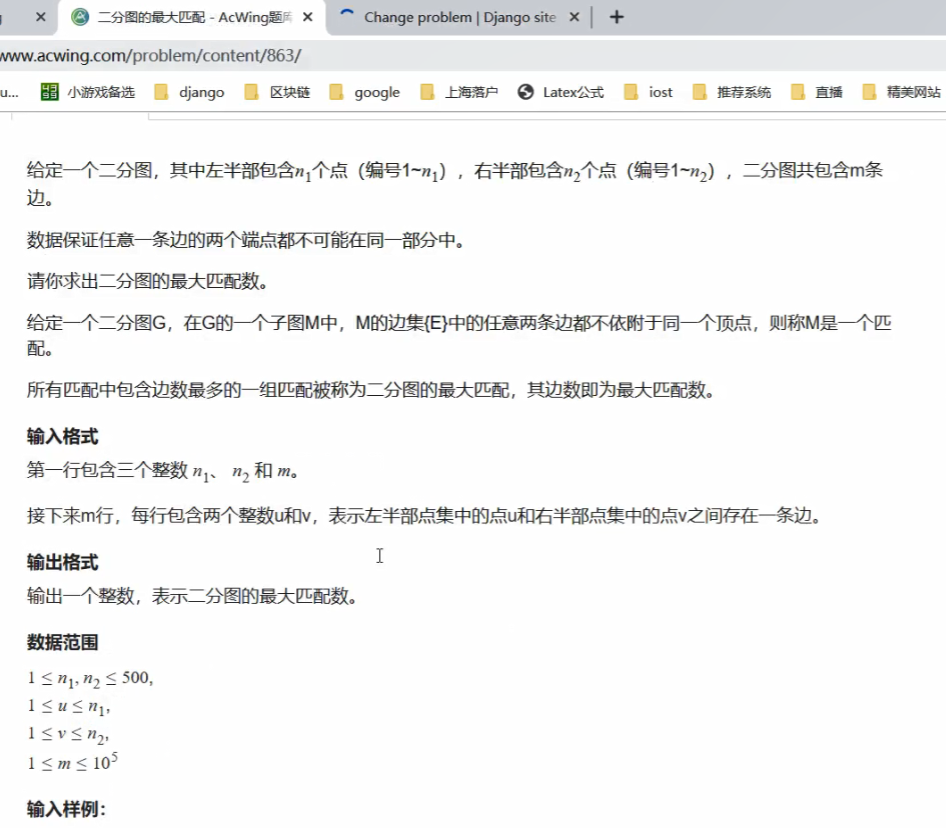


```java
package _03_搜素与图论;

import java.io.BufferedReader;
import java.io.BufferedWriter;
import java.io.IOException;
import java.io.InputStreamReader;
import java.io.OutputStreamWriter;
import java.io.PrintWriter;
import java.io.StreamTokenizer;
import java.util.ArrayList;
import java.util.HashMap;
import java.util.HashSet;
import java.util.PriorityQueue;
import java.util.Set;

/**
4 4
1 3
1 4
2 3
2 4
输出
2
 * 
 */

public class _18_二分图_匈牙利算法 {
 static BufferedReader br = new BufferedReader(new InputStreamReader(System.in));
 static BufferedWriter bw = new BufferedWriter(new OutputStreamWriter(System.out));
 static StreamTokenizer st = new StreamTokenizer(br);
 static PrintWriter pw = new PrintWriter(bw);

 public static void main(String[] args) {
  int n1 = nextInt(),n2 = nextInt(), m = nextInt();
  Graph graph = new Graph(n1+n2, m);
  while (m-- != 0) {
   int a = nextInt(),b=n1+nextInt(),w=0;
   graph.addEdge(a, b, w);
   graph.addEdge(b, a, w);
  }
  graph.dfs(0,1);
  graph.match(0);
  pw.println(graph.matchCnt);
  pw.flush();
 }

 
 static class Graph{
  Set<Node> left = new HashSet<>();
  Set<Node> right = new HashSet<>();
  Node[] nodes;
  int MaxNode,MaxEdge;
  public Graph(int n,int m) {
   MaxNode=n;
   MaxEdge=m;
   nodes=new Node[MaxNode+1];
  }
  void addEdge(int a,int b,int w){
   if(nodes[a]==null) nodes[a]=new Node(a);
   if(nodes[b]==null) nodes[b]=new Node(b);
   nodes[a].nexts.add(new Edge(a,b,w));
  }
  boolean dfs(int from,int color) {
   if(from==0) {
    left.clear();right.clear();// 清空左右两集合
    for (int n = 1; n <= MaxNode; n++) {
     if( !left.contains(nodes[n]) && !right.contains(nodes[n]) && !dfs(n,color) ) return false;
    }
    return true;
   }else {
    if(color==1&&right.contains(nodes[from])) return false;// 应该在1中但实际在2中，冲突
    if(color==2&&left.contains(nodes[from])) return false;// 应该在2中但实际在1中，冲突
    if(color==1&&left.contains(nodes[from])) return true;// 应该在1中但实际在1中，重复考虑
    if(color==2&&right.contains(nodes[from])) return true;// 应该在2中但实际在2中，重复考虑
    if(color==1) left.add(nodes[from]);
    if(color==2) right.add(nodes[from]);
    for(Edge e:nodes[from].nexts) {
     if(!dfs(e.to, 3-color)) return false;
    }
    return true;
   }
  }
  int mach[],matchCnt=0;
  Set<Integer> mached=new HashSet<>();
  boolean match(int x) {
   if(x==0) {
    matchCnt=0;
    mach=new int[MaxNode+1];
    for(Node n:left) {
     mached.clear();
     if(match(n.val)) matchCnt++;
    }
    return false;
   }else {
    for(Edge e:nodes[x].nexts) {
     int y=e.to;
     if(!mached.contains(y)) {// 如果y没有被任何匹配
      mached.add(y);// 标记y已经被当前x匹配
      if(mach[y]==0 /*如果y之前没有匹配任何x*/
       || match(mach[y]) /*否则说明y已经匹配了另一个x了，尝试为另一个x去匹配另一个y(因为当前y已经被标记为匹配了)*/
      ) {
       mach[y]=x;// 当前的y匹配当前的x
       return true;
      }
     }
    }
    return false;
   }
  }
 }
 static class Node{
  int val;
  ArrayList<Edge> nexts = new ArrayList<>();
  public Node(int val) {
   this.val = val;
  }
 }
 static class Edge{
  int from,to,weight;
  public Edge(int from, int to, int weight) {
   super();
   this.from = from;
   this.to = to;
   this.weight = weight;
  }
 }

 static int nextInt() {
  try {
   st.nextToken();
  } catch (IOException e) {
   // TODO 自动生成的 catch 块
   e.printStackTrace();
  }
  return (int) st.nval;
 }

 static String nextStr() {
  try {
   st.nextToken();
  } catch (IOException e) {
   // TODO 自动生成的 catch 块
   e.printStackTrace();
  }
  return st.sval;
 }
}
```

## 数学知识


### 质数

**定义：**

在所有大于1的整数中（因为所有小于等于1的整数不是质数也不是合数），如果其约数只有1和其本身，就是质数，旧称素数。

#### 判断质数

**质数判断**

- 试除法暴力版，从2到n-1枚举因数，`O(n)`
- 试除法优化版, 从2到sqrt(n)枚举因数，`O(sqrt(n))`

**试除法判断质数暴力版**

```c++
bool isSu(int x){
 for(int i=2;i<=n-1;i++){
  if(x%i==0)return true;
 }
 return false;
}
```

**试除法判断质数优化版**

```c++
bool isSu(int x){
 // 如果写成 i*i<=n 可能导致溢出
 // 如果写成 i<=sqrt(n) 将导致耗时的函数调用
 for(int i=2;i<=n/i;i++){
  if(x%i==0)return true;
 }
 return false;
}
```

#### 分解质因数

**分解质因数**

- 试除法暴力版，从1到n枚举n的因数
- 试除法优化版，从1到sqrt(n)枚举,最后再特殊处理可能存在的大于sqrt(n)的唯一一个因数 `O(logN)~O(sqrt(n))`
  - 因为n中最多只包含一个大于sqrt(n)的因数
  - 证明：如果有两个，则乘积必然大于n.

**试除法分解质因数暴力版**

```c++
bool divide(int n) {
if(n<=1) return false;
    int res=1;
    for (int i = 2; i <= n; i++) {
     if(n%i==0) {
      int pow=0;
      while(n%i==0) {
       res*=i;
       pow++;
       n/=i;
      }
      cout<< i<<" "<<pow<<endl;
     }
    }
    return res==n;
}
```

**试除法分解质因数优化版**

```c++
#include<iostream>
using namespace std;
void divide(int n) {
 int res=1;
 for (int i = 2; i <= n/i; i++) {
  if(n%i==0) {
   int pow=0;
   while(n%i==0) {
    res*=i;
    pow++;
    n/=i;
   }
   cout<< i<<" "<<pow<<endl;
  }
 }
 if(n>1) cout<<n<<" "<<1<<endl;// 处理那个可能存在的唯一一个大于根号n的因数
}
```

#### 朴素筛法

**原理步骤**

- 把所有自然数的倍数(2倍及以上)的数全部删除，剩余的数就是质数。
- `for(i=2;i<=n;i++)` 遍历[2,n]之间的所有数
  - `for(t=2*i;t<=n;t+=i) remove[t]=true;` 删除所有i的倍数
  - `if(!remove[i]) primes.add(i);`
    - k是没有被删除的数，没有被删除，说明[2,k-1]之间的任意数的倍数都不是k，也就是说[2,k-1]中不存在k的约数，所以k一定是质素

**时间复杂度**

- 约为：O(nlogN)

```java
 static ArrayList<Integer> getPrimes_1(int n) {
  ArrayList<Integer> primes = new ArrayList<>();
  boolean remove[] = new boolean[n+1];
  for (int i = 2; i<=n; i++) {
   for(int t=2*i;t<=n;t+=i) remove[t]=true;// 标记i的所有倍数为非质素
   if(!remove[i]) primes.add(i);// 未被筛除,说明当前数i不是[2,i-1]的数的倍数，也就是说[2,i-1]中不存在i的约数，所以一定是质素
  }
  return primes;
 }
```

#### 埃氏筛法

**原理步骤**

- 只要保证[2,n-1]中的所有质数的倍数不是n，就能保证n一定是质数。
  - 因为合数一定能写成质数分解的形式，但质数的质因数分解只能是自身的一次方。
  - 对所有质数的倍数执行删除操作，一定能删掉所有合数。
  - （比如说，2的倍数可以把1024筛掉，4的倍数也能把1024筛掉，8的倍数也能把1024筛掉，
  - 但用4和8来做删除操作是耗时的重复操作，
  - 因为实际上，用质数2来做删除操作时，2的一切倍数，包括1024就已经被删除了。）
- 所以只要修改朴素筛法，不必对所有自然数的倍数执行删除操作，只需要对所有质素的倍数执行删除操作，剩余的数一定是质数

**伪代码**

- `for(i=2;i<=n;i++)` 遍历[2,n]之间的所有数
  - `if(!remove[i])` k是没有被删除的数，没有被删除，说明[2,k-1]之间的所有质素的倍数不是k，也就是说[2,k-1]中不存在k的约数，所以k一定是质素
    - `primes.add(i);` i一定是质素
    - `for(t=2*i;t<=n;t+=i) remove[t]=true;` 删除所有质素的倍数

**时间复杂度**

- O(Nlog(logN))
  - N=2^32，O(Nlog(logN))=(2^32*log(log(2^32)))=1024*(log(32))=2^32*5
  - 可以看做是O(N)

```java
 static ArrayList<Integer> getPrimes_2(int n){
  ArrayList<Integer> primes = new ArrayList<>();
  boolean remove[] = new boolean[n+1];
  for (int i = 2; i <= n; i++) {
   if(!remove[i]) {
    primes.add(i);
    for(int t=2*i;t<=n;t+=i) remove[t]=true;// 只需要对所有质素的倍数执行删除操作
   }
  }
  return primes;
 }
```

#### 线性筛法

**原理步骤**

- 保证[2,n]中的合数只会被其最小质因子筛掉,使得每个合数都只被筛掉一次，如此便能使得筛法是线性的。
- 枚举已有的质数，删除所有以该质数为最小质因子的合数。

```java
// 线性筛法 arrayList实现
 static ArrayList<Integer> getPrimes_3(int n){
  ArrayList<Integer> primes = new ArrayList<>();
  boolean remove[] = new boolean[n+1];
  for (int i = 2; i <= n ; i++) {
   if(!remove[i]) primes.add(i);
   for(int p:primes) {// 遍历AarrayList比较耗时,应该用数组实现
    if(p>n/i) break;// 意思就是p*i<remove.length，防止越界
    remove[p*i]=true;// p*i一定是合数，p一定是其最小质因数，所有合数一定会被筛掉，而且只会被筛掉一次，因为合数一定存在最小质因子，最小质因子一定会枚举到。
    // i%p!=0时，p一定不是i的最小质因子,因为是在从小到大枚举质数，但此时p一定是p*i的最小质因子
    // i%p==0时，p一定是i的最小质因子,因为是在从小到大枚举质数，此时p也一定是p*i的最小质因子，
    // 然后就要停止筛了，因为后续的p就不是i的最小质因子了，同时就更不能保证p是p*i的最小质因子了。
    // 因为只有保证每个合数都被他的最小质因子筛掉，才能使得每个合数都只被筛掉一次，才能保证筛法是线性的
    if(i%p==0) break;
   }
  }
  return primes;
 }
 // 线性筛法，数组实现
 static int primes[],tail;
 static void getPrimes_3_1(int n){
  primes =new int[n+1];tail=0;// 用于保存从[1,n]中找到的所有质数
  boolean remove[] = new boolean[n+1];// 用于标记被筛除的合数
  for (int i = 2; i <=n; i++) {// 从2开始枚举所有自然数
   if(!remove[i]) primes[tail++]=i;// 如果当前数不是合数，则一定是质数，放入收集数组

   // 下面的t<tail可以不用写
   // 因为当枚举到数组中最后一个质数时，如果i是质数，则i一定会在上一行代码中被添加到数组中，则枚举到的最后一个质数p就是i，i%p==0，将会break。
   // 如果i不是质数，则一定是合数，那么一定会在从小到大枚举质数的过程中因为能够为其找到一个最小质因数而导致i%p==0而导致break执行
   
   // for枚举已经得到的素数， `(p=primes_3[t])<=n/i` 等效于 `(p=primes_3[t])*i<=n` 是为了防止访问remove[p*i]时越界
   for(int t=0,p;t<tail && (p=primes[t])<=n/i;t++) {
    remove[p*i]=true;// p*i一定是合数，p一定是其最小质因数，所有合数一定会被筛掉，而且只会被筛掉一次，因为合数一定存在最小质因子，最小质因子一定会枚举到。
    if(i%p==0){
     // i%p!=0时，p一定不是i的最小质因子,因为是在从小到大枚举质数，但此时p一定是p*i的最小质因子
     // i%p==0时，p一定是i的最小质因子,因为是在从小到大枚举质数，此时p也一定是p*i的最小质因子，
     // i%p==0时就要停止筛了，因为后续的p就不是i的最小质因子了，同时就更不能保证p是p*i的最小质因子了。
     // 因为只有保证每个合数都被他的最小质因子筛掉，才能使得每个合数都只被筛掉一次，才能保证筛法是线性的
     break;
    }
   }
  }
 }
 
```

```c++
/*
提交状态AC
输入8
输出4
*/
#include<iostream>
#include<cstring>
using namespace std;
int primes[1000010],tail=0;
void getPrimes(int n){
    bool remove[n+1];
    memset(remove,false,sizeof remove);
    for(int i=2;i<=n;i++){
        if(!remove[i]) primes[tail++]=i;
        for(int t=0,p;(p=primes[t])<=n/i;t++){
            remove[p*i]=true;
            if(i%p==0) break;
        }
    }
}
int main(){
    int n;
    cin>>n;
    getPrimes(n);
    cout<<tail;
    return 0;
}
```

### 约数

- 约数就是整除被除数的除数，a÷b可以整除，b就是a的一个约数。
- a%b==0,b是a的约数

#### 试除法求约数

- int范围内的数约数个数最多的数的约数个数大概是1500个

```java
// 试除法求所有约数 O(sqrt(N))
 static ArrayList<Integer> getDivisor(int n){
  ArrayList<Integer> divisor = new ArrayList<>();
  for (int i = 1; i <= n/i; i++) {
   if(n%i==0) {
    divisor.add(i);
    if(i!=n/i) divisor.add(n/i);
   }
  }
  Collections.sort(divisor);
  return divisor;
 }
```


```c++
/*
提交状态AC
输入8
输出4
*/
#include<iostream>
#include<vector>
#include<algorithm>
using namespace std;
vector<int> getDivisiers(int n){
    vector<int> divisier;
    for(int i=1;i<=n/i;i++){
        if(n%i==0){
            divisier.push_back(i);
            if(i!=n/i) divisier.push_back(n/i);
        }
    }
    sort(divisier.begin(),divisier.end());
    return divisier;
}
int main(){
    int n;
    cin>>n;
    while(n--){
        int a;
        cin>>a;
        vector<int> res= getDivisiers(a);
        for(auto x:res){
            cout<<x<<" ";
        }
        cout<<endl;
    }
}
```

#### 约数个数

- 如果 $N = p_1^{c1} *p_2^{c2}* ... *p_k^{c_k}$
  - （质因数分解）
- 约数个数：$(c_1 + 1) *(c_2 + 1)* ... * (c_k + 1)$
  - 因为质数无法再拆分成除1和自身以外的数的乘积，
  - 通过$p_1^{c1}$可知N的约数必然有={$p_1^{0},p_1^{1},p_1^{2},...p_1^{c_1}$}
  - 所以$p_1^{c1}$中拆分出$(1+c_1)$个N约数
  - 质数N的任何一个约数都可以写成 $d=p_1^{β_1}*p_2^{β_2}*...*p_k^{β_k}  (β_k∈[0,c_k])$
  - $β_k有(c_k+1)种取法$ 所以约数个数成了求组合个数，
  - 即分别考虑$p_1,p_2,...,p_k$的指数有多少种取法然后相乘。
 
 


```c++
/**
提交状态：AC
 */
#include<iostream>
#include<unordered_map>
using namespace std;
int main(){
    int n,a;long mod=1e9+7;
    unordered_map<int,int> map;
    cin>>n;
    while(n--){
        cin>>a;
        for(int i=2;i<=a/i;i++){
            if(a%i==0){
                while(a%i==0){
                    a/=i;
                    map[i]++;
                }
            }
        }
        if(a>1) map[a]++;
    }
    long res=1;
    for(auto x:map){
        long a=x.first,pow=x.second;
        res=(res*(pow+1))%mod;
    }
    cout<<res;
}
```

#### 约数之和

- 如果 $N = p_1^{c1} *p_2^{c2}* ... *p_k^{c_k}$
  - （质因数分解）
- 约数之和： $(p_1^0 + p_1^1 + ... + p_1^{c_1}) *(p_2^0 + p_2^1 + ... + p_2^{c_2})*...* (p_k^0 + p_k^1 + ... + p_k^{c_k})$
  - 这个公式展开，就是把所有约数求和的原始式子
  - $(...)+(...)+(...)+...+(...)$
  - $(p_1^{0}*p_2^{0}*p_3^{0}*...*p_k^{0})+(...)+...+(括号中的乘积实际就是一个约数d)$
    - 质数N的任何一个约数都可以写成 $d=p_1^{β_1}*p_2^{β_2}*...*p_k^{β_k}  (β_k∈[0,c_k])$
  - 


```c++
/**
提交状态：AC
 */
#include<iostream>
#include<unordered_map>
using namespace std;
const int mod = 1e9+7;
int main(){
    int n;
    cin>>n;
    unordered_map<int,int> map;
    while(n--){
        int a;
        cin>>a;
        for(int i=2;i<=a/i;i++){
            while(a%i==0){
                a/=i;
                map[i]++;
            }
        }
        if(a>1) map[a]++;
    }
    long long res=1;
    for(auto x:map){
        long p=x.first,pow=x.second;
        long long t=1;
        while(pow--) t=(t*p+1)%mod;
        res=res*t%mod;
    }
    cout<<res;
}
```

#### 欧几里得算法_辗转相除法_求最大公约数

**数论常识**:

- $a|b$ 表示a能整除b，或者说a是b的约数,即$b \bmod a==0$
- 如果 $c|a$ 且 $c|b$ ,
- 那么
  - $c|(a±b)$
  - $c|(x*a±y*b)$
- 0和任何数的约数就是这个数的所有约数
- 0和任何数的最大公约数就是这个数本身

**辗转相除法**

- a,b最大公约数$k=gcd(a,b)=gcd(b,  a \bmod b )$
- 为什么？
  - 第一种解释：
  - $a \bmod b = a - {\lfloor \frac{a}{b} \rfloor} *b$
  - $a \bmod b = a - s *b$
  - (a,b)的公约数K满足
    - $K|a$
    - $K|b$
  - (b,a-s*b)的公约数P满足
    - ① $P|b$
    - ② $P|(a-s*b)$
    - 因为①，所以也一定满足③ $P|(s*b)$
    - 因为②③，所以一定满足$P|(a-s*b+s*b)$ 即：$P|a$
  - 所以公约数K和P是同一个集合
- 为什么？
  - 第二种解释：
  - $a \bmod b = a - {\lfloor \frac{a}{b} \rfloor} *b$
  - $a \bmod b = a - s *b$
  - 因为 $k|a$ 且 $k|b$
  - 所以 $k|(a-s*b)$
  - 所以
    - (a,b)的所有公约数
    - =(b, a mod b )的所有公约数
    - =(b,a - s * b)的所有公约数
  - 最后，根据定义，
    - 0和任何数的约数就是这个数的所有约数
    - 0和任何数的最大公约数应当是这个数本身
    - $k=gcd(a,b)=gcd(b,  a \bmod b )=gcd(b,a - s * b)$

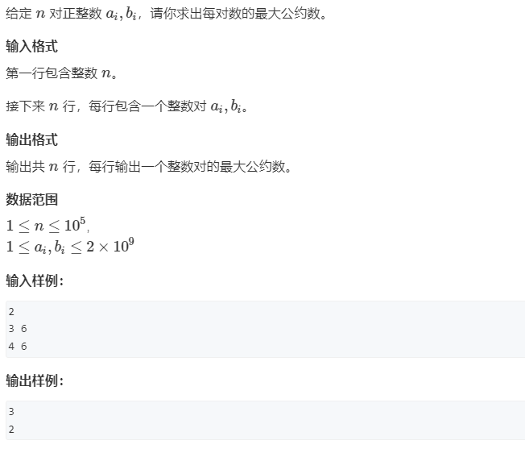

```c++
/**
 * 提交状态：AC
 */
#include<iostream>
using namespace std;
int gcd(int a,int b){
    if(b==0)return a;
    else return gcd(b,a%b);
}
int main(){
    int n,a,b;
    cin>>n;
    while(n--){
        cin>>a>>b;
        cout<<gcd(a,b)<<endl;
    }
}
```

### 欧拉函数

**互质**

互质是公约数只有1的两个整数，叫做互质整数。公约数只有1的两个自然数，叫做互质自然数，后者是前者的特殊情形。

**欧拉函数**

- 定义：φ(N)=>[1,N]中和N互质的数的个数
  - 如：[`1`,2,3,4,`5`,6] 因为：1、5和6互质，所以：φ(6)=2
- 计算公式：
  - $N=p_1^{α_1}p_2^{α_2}p_3^{α_3}...p_k^{α_k}$ (分解质因数)
  - $φ(N)=N(1-\frac{1}{p_1})(1-\frac{1}{p_2})...(1-\frac{1}{p_k})$
  - 如：
    - $6=2^1*3^1$
    - $φ(6)=6*(1-\frac{1}{2})*(1-\frac{1}{3})=6*\frac{1}{2}*\frac{2}{3}=2$
  - 公式推导(容斥原理)：
    - $φ(N)=N-\frac{1}{p_1}-\frac{1}{p_2}-....-\frac{1}{p_k}+$
      - （从N个数中先去掉所有是N的质因数分解后质数的倍数的数）
    - $+\frac{1}{p_1p_2}+\frac{1}{p_1p_3}+...+\frac{1}{p_ip_j}+$
      - （可能存在某个数，由于其是pi的倍数所以在第一轮减法中被减去了，但是其也是pj的倍数，所有其在第一轮中被减去了两遍，在第二轮中，把即是pi的倍数也是pj的倍数的数又加上了，使得在第一轮被多减去的那一次被抵消）
      - 
  - $-\frac{1}{p_1p_2p_3}-\frac{1}{p_1p_2p_4}-....-\frac{1}{p_ip_jp_m}+$
    - (可能存在某个数，由于其即是p_i的倍数，也是p_j的倍数,同时也是p_m的倍数,那么其在第一轮中会被减去三次，在第二轮中又会被加上三次，相当于没有被减去，所以在第三轮时应当把这部分减去。)
    - 
  - $+.......+\frac{1}{p_1p_2p_3p_5}+$
    - 以此类推
  - $....+$
  - $...\frac{1}{p_1p_2p_3p_5...pk}$
  - 就等于：$N(1-\frac{1}{p_1})(1-\frac{1}{p_2})...(1-\frac{1}{p_k})的展开式$

**模板算法**

- 算法瓶颈在于质因数分解的过程，为sqrt(N)

<details>


</details>

```c++
/**
 * 提交状态：AC
 */
#include<iostream>
using namespace std;
int main(){
    int n;
    cin>>n;
    while(n--){
        int a;
        cin>>a;
        long long res=a;
        for(int i=2;i<=a/i;i++){// 主过程是求质因数
            if(a%i==0){// i 就是一个质因数
    // 写法1
    // res=res*(1-1/i); // 无法通过，不能整除，存在小数
    // 写法2
                // res = res*(1-1/i) = res*(1-1/i)*i/i = res*(i-1)/i // 化简
                // res=res*(i-1)/i; // 可以通过
    // 写法3
    // res = res*(1-1/i) = res*(1-1/i)*i/i = res*(i-1)/i = (res*i-res)/i = res-res/i // 进一步化简
    res-=res/i; // 可以通过，公式极其优美
                while(a%i==0) a/=i;
            }
        }
        if(a>1) 
   // 写法1
   //res=res*(1-1/a);
   // 写法2
            // res=res*(a-1)/a; // 可以通过
   // 写法3
   res-=res/a;// 可以通过
        cout<<res<<endl;
    }
}
```

### 求1~N中每个数的欧拉函数

如果用上述方法来求，时间复杂度将为O(N*sqrt(N))

应当使用线性质数筛的算法来计算。可以使得时间复杂度为O(N)

<details>

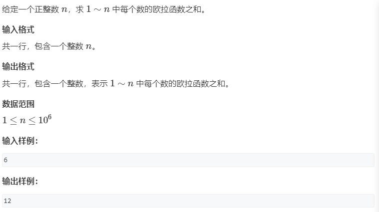
</details>

```c++
/**
 * 提交状态：AC
*/
#include<iostream>
using namespace std;

const int N = 10000000;
int primes[N],cnt=0;
bool isnotPrimes[N];
int ola[N];
void getOla(int n){// 主过程是线性质数筛
 ola[1]=1;// 从欧拉函数的定义出发，1的欧拉数就是1，因为在[1,1]中，和1互质（公约数只有1的数）的数的个数只有1个也就是1自己
    for(int i =2;i<=n;i++){
        if(!isnotPrimes[i]){
            primes[cnt++]=i;
            // 质数的质因数分解一定是本身
            // 根据欧拉函数公式：ola[i]=i*(1-1/i)=i-1;
            // 所以:
            ola[i]=i-1;
        }
        for(int j=0;primes[j]<=n/i;j++){
            isnotPrimes[primes[j]*i]=true;
            if(i%primes[j]==0){
                // i%primes[j]==0说明p_j 是 i 的其中一个质因数，也说明 [i*p_j]的质因数分解和i的质因数分解，底数是一样的，只有指数部分不一样
                // 此外，p_j 就是p_j*i的最小质因数，也就是p_1;
                // 根据欧拉函数公式 ola[i] = i * (1-1/p_1) * (1-1/p_2) * ... * (1-1/p_k);
                // 根据欧拉函数公式 ola[i* p_j]=(i* p_j) * (1-1/p_1) * (1-1/p_2) * ... * (1-1/p_k);
                // 那么，显然：
     // ola[i* p_j] = (i* p_j) * (1-1/p_1) * (1-1/p_2) * ... * (1-1/p_k) 
     //    = p_j * [ i * (1-1/p_1) * (1-1/p_2) * ... * (1-1/p_k)] 
     //    = p_j *  ola[i];
                // 所以：
                ola[i*primes[j]]=   ola[i] * primes[j];
                break;
            }else{
                // i%primes[j]!=0说明 p_j不是i的其中一个质因数，那么显然 i * p_j 的质因数分解，就是在i的质因数分解上再乘上一个p_j
                // 根据欧拉函数公式：  ola[i]=i*(1-1/p_1)*(1-1/p_2)*...*(1-1/p_k);
                // 根据欧拉函数公式：  ola[i* p_j]=(i* p_j)*(1-1/p_1)*(1-1/p_2)*...*(1-1/p_k)*(1-p_j);
                // 那么显然：  
     // ola[i* p_j] = (i* p_j)*(1-1/p_1)*(1-1/p_2)*...*(1-1/p_k)*(1-p_j)
     //    = p_j * [ i * (1-1/p_1) * (1-1/p_2) * ... * (1-1/p_k) ] * (1-p_j) 
     //    = p_j*ola[i]*(1-1/p_j)
     //    = ola[i]*(p_j-1)
                // 所以:
                ola[i * primes[j]] = ola[i]*(primes[j]-1);
            }
        }
    }
}

int main(){
    int n;
    cin>>n;
    getOla(n);
 long long res=0;
    for(int i=0;i<=n;i++) res+=ola[i];
    cout<<res;
}
```

### 欧拉定理

**同余**

数论中的重要概念。给定一个正整数m，如果两个整数a和b满足a-b能够被m整除，即(a-b)/m得到一个整数，那么就称整数a与b对模m同余，记作a≡b(mod m)。对模m同余是整数的一个等价关系。

简单来说，两个整数除以同一个整数，若得相同余数，则二整数同余。

**欧拉定理**

若a、m互质,即$gcd(a,m)==1$，则有 $a^{φ(m)}≡1( \mod m)$,读做：a的φ(m)次方模b与1对模m同余

证明：


### 费马定理

a、p互质，且p是质数，$a^{φ(p)}≡1( \mod p)$

又因为：$φ(p)=p-1$

所以：$a^{p-1}≡1( \mod p)$

### 快速幂

**三种写法**

```c++
#include<iostream>
typedef long long ll;
using namespace std;
// 提交状态：AC
ll quickPow(int a,int k,ll mod){
    if(k==0){
        return 1;
    } else if(k&1){
        return a * quickPow(a,k-1,mod) % mod;
    }else{
        ll temp = quickPow(a,k/2,mod);
        return temp * temp % mod;
    }
}
// 提交状态：AC
ll quickPow1(int a,int k,ll mod){
    ll temp;
    if(k==0) return 1;
    else if(k&1) return a * quickPow1(a,k-1,mod) % mod;
    else return (temp=quickPow1(a,k/2,mod)) * temp % mod;
}
// 提交状态：AC
ll quickPow2(int a,int k,ll mod){
    ll res=1,temp=a;
    while(k){
        if(k&1) res=res*temp%mod;
        temp=temp*temp%mod;
        k>>=1;
    }
    return res;
}
int main(){
    ll n,a,k,mod;
    scanf("%d",&n);
    while(n--){
        scanf("%d%d%d",&a,&k,&mod);
        printf("%d\n",quickPow2(a,k,mod));
    }
    return 0;
}
```

### 快速幂求逆元

逆元


简单来说，就是b、m互质，且$b|a$,即b能整除a，希望找到一个数x，使得 $\frac{a}{b} \mod m=a*x \mod m$,即$\frac{a}{b}≡a*x (\mod m)$

**化简定义式**

- $\frac{a}{b}≡a*x (\mod m)$
- 两遍同乘b得：$\frac{a}{b}*b≡a*x*b (\mod m)$
- $a≡a*x*b (\mod m)$
- 两边同除a得：$1≡x*b (\mod m)$
- 即：$x*b≡1 (\mod m)$
- 可以把x记作$b^{-1}$
- 同时可以发现a的值是多少不重要。

所以找到这个x，就是找使得$x*b≡1 (\mod m)$成立的x

**当m为质数时，如何求x?**

- 通过费马定理，可知：
- 如果b、m互质，**且m是质数的话**，即:$gcd(b,m)=1$ 且 $m=质数p$
- 则有：$b^{p-1}≡1 (\mod p)$
- 则可进一步写成: $b*b^{p-2}≡1 (\mod p)$
- 显然$x=b^{p-2}$
- 由于质数p>=2，所以x必然是大于等于1的。

**所以求逆元就可以变成求$b^{p-2} \mod p$**

**举例**
如：b=3 p=5  
$b * x = 1 (\mod p)$  
$x = 2$  
$b^{p-2} \mod 5 = 3^3\mod 5 = 27\mod 5 = 2$

**无解、有解的情况**

- 当b是p的倍数时，一定无解，因为b*x也一定是p的倍数，那么模p一定为0
- 当b不是p的倍数时，由于p是质数，那么b和p一定互质，那么根据费马定理，一定存在$b^{p-1}≡1 (\mod p)=b* b^{p-2}≡1 (\mod p)$,一定存在逆元。

```c++
// 条件结果：AC
#include<iostream>
using namespace std;
typedef long long ll;

bool isPrime(int x){
    for(int i=2;i<=x/i;i++){
        if(x%i==0)return false;
    }
    return true;
}

ll quickPow(int a,int pow,ll MOD){
    if(pow==0) return 1;
    else if(pow&1) return a *quickPow(a,pow-1,MOD) % MOD;
    ll temp=quickPow(a,pow/2,MOD);
    return temp *temp % MOD;
}
int main(){
    ll n,b,p,mod;
    cin>>n;
    while(n--){
        cin>>b>>p;
        if(b%p==0) 
            cout<<"impossible"<<endl;
        else{
            ll x = quickPow(b,p-2,p);
            cout<<x<<endl;
        }
    }
    return 0;
}
```

### 扩展欧几里得算法

**裴蜀定理**

任意正整数a b一定存在非零整数x y使得xa+yb=p*gcd(a,b),系数x、y一定能取到某个值时，使得p=1

因为a、b的公约数`c=gcd(a,b)`一定能分别整除a和b，那么也必然能整除ax+by,

即`c|a`,`c|b`,必有`c|(ax+by)`，所以说ax+by必然是c的倍数，也一定能找到一组x和y，使得ax+by正好是等于c

x、y不唯一。

<details>


</details>

```c++
#include<iostream>
using namespace std;
int exgcd(int a,int b,int &x,int &y){
   int res;
   if(b==0){
       res=a;
     //    a*x+b*y=res=a;
       x=1;y=0; // 为啥y只能等于0？？？，因为b只在递归调用的最后为0，通常来说b都是不为0的，y=[res-(a*x)]/b=[0/b]=0
       return res;
   }else{
        res = exgcd(b,a%b,y,x);// 保证y是b的系数
        //  b*y+(a%b)*x=res             // x是(a%b)的系数 y是b的系数
        //  b*y+(a-floor(a/b)*b)*x=res
        //  b*y+a*x-floor(a/b)*b*x=res
        //  a*x+b(y-floor(a/b)*x)=res   // x是a的系数，(y-floor(a/b)*x)是b的系数
        x=x;
        y-=a/b*x;
        return res;
   }
}
int main(){
    int n;
    cin>>n;
    while(n--){
        int a,b,x,y;
        cin>>a>>b;
        exgcd(a,b,x,y);
        cout<<x<<" "<<y<<endl;
    }
    return 0;
}
```

### 扩展欧几里得算法的应用：线性同余方程

给定$a,b,m$找出一个x使得 $a*x≡b(mod m)$

举例

- 2*x=3(mod 6) x不存在
- 4*x=3(mod 5) x=2

**如何使用扩展欧几里得算法对其求解？**

- 原式：$a * x ≡ b(\mod m)$
- $a * x \mod m = b \mod m$
- $a *x - j* m = b - k * m$ (j、k必然是整数)
- $a * x + (- j + k) m = b$
- 由于不需要关心j和k的值，所以直接写成：
- $a *x + m* y = b$ (y必然是整数)
- 这样 原问题就被转化成了，是否能找到一个x,使得等式成立
- 由扩展欧几里得定理可知，必然存在：$a *x + m* y = d * gcd(a,m)$
- 那么如果$b = d * gcd(a,m)$,或者说b是gcd(a,m)的倍数。
- 则必然能找到一对x、y使得等式$a *x + m* y = d * gcd(a,m)=b$成立
- 通过扩展欧几里得算法可求出：$a *x' + m* y' = gcd(a,m)$
- 那么
- $x=x' * d$
- $y=y' * d$

<details>


</details>

```c++
#include <iostream>
using namespace std;
typedef long long ll;
int extgcd(int a,int b,int &x,int &y){
    if(b==0){
        x=1;y=0;
        return a;
    }else{
        int t = extgcd(b,a%b,y,x);
        //b*y + a%b*x = t;
        //b*y + (a-floor(a/b)*b)*x = t;
        //b*y + ax-floor(a/b)*b*x = t;
        //ax +  b*[y-floor(a/b)*x] = t;
        x=x; y=y-a/b*x;
        return t;
    }
}
int main(){
    int n;
    cin>>n;
    while(n--){
        int a,b,m,x,y;
        cin>>a>>b>>m;
        // ax=b(mod m)
        // ax-jm=b-km
        // ax+(k-j)m=b
        // ax+ym=b
        // ax+my=b=p*gcd
        ll gcd = extgcd(a,m,x,y); // ax'+my'=gcd
        // x=x'*p=x'*(b/gcd) 另外，x只要求同余的结果一致，所以取模后输出即可
        if(b%gcd==0) cout<< (ll)x*(b/gcd)%m<<endl;
        else         cout<<"impossible"<<endl;
    }
}
```

### 中国剩余定理

给定一堆两两互质的数，这些数两两互质，（任意两数都互质）

$m_1,m_2,m_3,...,m_k$

求一个x，使得任意整数$a_1,a_2,a_3,...,a_k$,都满足：

- $x≡a_1(\mod m_1)$
- $x≡a_2(\mod m_2)$
- ......
- $x≡a_k(\mod m_k)$

这样的x可以通过构造得出

- 设$M=m_1*m_2*...*m_k$
- 设$M_i=\frac{M}{m_i}$
- 设$M_i^{-1}为M_i模m_i的逆，即M_i*M_i^{-1}≡1(\mod m_i)$
  - $M_i*M_i^{-1}≡1(\mod m_i)$
  - 由于$M_i和m_i$必然互质，且$m_i$是质数，所以由费马定理可知，
  - $M_i^{m_1-1}≡1(\mod m_i)$
  - $M_i*M_i^{m_i-2}≡1(\mod m_i)$
  - 所以：$M_i^{-1}=M_i^{m_i-2}$
- $x =  \sum_{i=1}^{k}{a_i*M_i*M_i^{-1}}$
  - 这样，对$x$模$m_p$就得$a_p$
  - 因为对于x的第p项，即$a_p*M_p*M_p^{-1}$，$M_p$中是不包含$m_p$的,模上$m_p$不得0, $M_p*M_p^{-1}$=1,只被定义为在模m_p的时候成立，也就是当前成立，所以第p项必然得$a_p$
  - 对x的其他所有项，即$a_q*M_q*M_q^{-1}$,其中的$M_q$中都包含一个$m_p$,所以这些项必是$m_p$的倍数，模上$m_p$必然得0


### 高斯消元法

高斯消元法可以在$O(n^3)$时间复杂度内求解由m个方程组成的含n个未知数的多元一次线性方程组。


把系数a和b写成矩阵形式,得m*n的矩阵

**核心**

1. 两方程互换，解不变；
2. 一方程乘以非零数k，解不变；
3. 一方程乘以数k加上另一方程，解不变 [2] 。

**解的个数**

- 可能无解
- 可能有无穷多组解
- 有唯一解

**变换后得到**

- 完美阶梯型：有唯一解
- 得到0等于非0的方程：无解
- 得到0=0的方程：有无穷多组解

**高斯消元步骤**

- 枚举每一列
  - 找到当前列中绝对值最大的列
  - 把这行换到最上面
  - 将该行第一个数消成1（该行所有数同除第一个数）
  - 将该行之下所有行的当前列全部消成0
- 从最后一行开始倒着把答案消出来

```java
// 提交状态：AC
#include<iostream>
#include<algorithm>
#include<math.h>
using namespace std;
int n;
double eps = 1e-6;
const int N = 100+10;
double matrix[N][N];
void debug(){
    for(int row=0;row<n;row++){
        for(int col=0;col<n+1;col++)
            cout<<matrix[row][col]<<" ";
        cout<<endl;
    }
    cout<<endl;
}
int gauss(){
    // debug();
    int row=0,col=0;
    for(;col<n;col++){
  // 找到当前列当前行及以下行中,绝对值最大的列，把那一列和当前列做交换
        int max=row;
        for(int r=row;r<n;r++) if(fabs(matrix[max][col])<fabs(matrix[r][col])) max=r;// 找到当前列的当前行及其后续行中绝对值最大的行。
        if(row!=max) for(int c=0;c<=n;c++) swap(matrix[max][c],matrix[row][c]); // 交换两行
        if(fabs(matrix[row][col])<eps) continue;//小于0就跳过，换下一列，因为后续要除以这个数，如果这个数太小，结果可能会无穷大。，同时小于0说明当前位置的x的系数是0
        for(int c=n;0<=c;c--) matrix[row][c]/=matrix[row][col];// 使得当前行的方程全部除以当前位置的系数，使得当前位置的系数为1,且保持方程依然成立
        // 将当前位置之下的所有系数变成0
  for(int r=row+1;r<n;r++){
            if(fabs(matrix[r][col])<eps) continue;// 只对不是0的系数处理
            for(int c=n;0<=c;c--) matrix[r][c]+=-matrix[r][col]*matrix[row][c];// 因为当前行当前列的系数已经是1了，把当前行的方程乘上后续行的系数，就必然等于后续行的系数，拿这两个方程相减，就能消区后续行的当前列
        }
        // debug();
        row++;
    }
    if(row!=n){// 说明存在某个x的系数为0
        for(int i=row;i<n;i++)// i从row开始，因为处理到最后，0x=？一定会被挪到最后几行
            if(fabs(matrix[i][n])>eps)
                return 2;// 存在0x=非0 说明无解
        return 1;//存在0x=0 说明有无穷多组解
    }
    for(int r=n-2;0<=r;r--){// 从最后第二行往前遍历
        for(int c=n-1;r<c;c--){// 列的遍历顺序无所谓
            matrix[r][n]-=matrix[r][c]*matrix[c][n];// 就是把这些项移到等式右边去
            matrix[r][c] = 0;
        }
    }
    // debug();
    return 0;// 有唯一解
}
int main(){
    cin>>n;
    for(int row=0;row<n;row++)
        for(int col=0;col<n+1;col++)
            cin>>matrix[row][col];
    int r = gauss();
    if(r==0)
        for(int i=0;i<n;i++)
            printf("%.2f\n",matrix[i][n]);
    else if(r==1)
        cout<<"Infinite group solutions";
    else
        cout<<"No solution";
    
    return 0;
}
```

```c++
// 提交状态：AC
#include<iostream>
#include<algorithm>
#include<math.h>
using namespace std;

int n;
const int N=100+10;
const double eps = 1e-6;
double m[N][N];


void debug(){
    for(int i=0;i<n;i++){
        for(int j=0;j<=n;j++)
            cout<< m[i][j]<<" ";
        cout<<endl;
    }
    cout<<endl;
}

int gauss(){
    // debug();
    int row,col;
    for(row=0,col=0;col<n;col++){
        int selectR=row;
        for(int r=row;r<n;r++) if(fabs(m[selectR][col])<fabs(m[r][col])) selectR = r;
        if(selectR!=row) for(int i=0;i<=n;i++) swap(m[selectR][i],m[row][i]);
        if(fabs(m[row][col])<eps) continue;
        for(int i=n;0<=i;i--) m[row][i]/=m[row][col];
        for(int r=row+1;r<n;r++) {
            if(fabs(m[r][col])<=eps) continue;
            for(int i=n;0<=i;i--) m[r][i]-=m[row][i]*m[r][col];
        }
        row++;
    }
    if(row!=n){
        for(int i=row;i<n;i++) 
            if(fabs(m[i][n])>eps) return 1;// 存在 0x==非0; 无解
        return 2;// 存在 0x==0 有无穷多的解
    }
    for(int i=n-2;0<=i;i--)
        for(int j=i+1;j<n;j++){
            m[i][n]-=m[i][j]*m[j][n];
            m[i][j]=0;
        }
    // debug();
    return 0;
}
int main(){
    cin>>n;
    for(int r=0;r<n;r++)
        for(int c=0;c<=n;c++)
            cin>>m[r][c];
    int res = gauss();
    if(res==0){
        for(int i=0;i<n;i++) printf("%.2f\n",m[i][n]);
    }else if(res==1){
        cout<<"No solution";
    }else{
        cout<<"Infinite group solutions";
    }
    return 0;
}
```

### 求组合数

#### 方式1

### 简单博弈论
