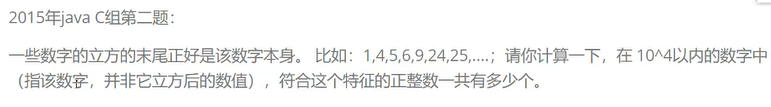

## 千峰蓝桥杯第14届个人赛公开课学习笔记


## 目录

- [千峰蓝桥杯第14届个人赛公开课学习笔记](#千峰蓝桥杯第14届个人赛公开课学习笔记)
- [目录](#目录)
- [for 循环：已知循环次数](#for-循环已知循环次数)
  - [2019 java c 组第一题](#2019-java-c-组第一题)
    - [**java:耗时 1ms 的解**](#java耗时-1ms-的解)
    - [**java:耗时 5ms 的解**](#java耗时-5ms-的解)
    - [**js:耗时 7ms 的解**](#js耗时-7ms-的解)
    - [**js:耗时 6ms 的解**](#js耗时-6ms-的解)
- [while 循环:已知结束条件](#while-循环已知结束条件)
  - [2019 java c 组第二题](#2019-java-c-组第二题)
  - [2019 java c 组第三题](#2019-java-c-组第三题)
    - [暴力递归方式](#暴力递归方式)
    - [非暴力递归法](#非暴力递归法)
  - [2018 java c 组第一题](#2018-java-c-组第一题)
  - [2018 java c 组第二题](#2018-java-c-组第二题)
- [字符串循环和集合:set list](#字符串循环和集合set-list)
  - [2019 年 java c 组第三题](#2019-年-java-c-组第三题)
  - [2015 年 java C 组第六题](#2015-年-java-c-组第六题)
- [循环求质数](#循环求质数)
  - [2019 java c 组第四题](#2019-java-c-组第四题)
- [排序](#排序)
  - [冒泡](#冒泡)
  - [选择](#选择)
  - [插入排序](#插入排序)
- [递归算法](#递归算法)
  - [斐波那契数列](#斐波那契数列)
    - [优化后:效率提高 3.5 万倍](#优化后效率提高-35-万倍)
    - [优化前](#优化前)
    - [2020 年 java c 组 第三题](#2020-年-java-c-组-第三题)
    - [辗转相除法](#辗转相除法)
- [排列、组合、子集；回溯、邻里交换、暴力](#排列组合子集回溯邻里交换暴力)
  - [2017 年 java c 组 第三题](#2017-年-java-c-组-第三题)
    - [回溯法](#回溯法)
    - [邻里交换法](#邻里交换法)
    - [暴力解法](#暴力解法)
- [动态规划（DP）](#动态规划dp)
  - [青蛙跳台阶问题](#青蛙跳台阶问题)
    - [暴力递归](#暴力递归)
    - [map 字典优化](#map-字典优化)
    - [数组优化法:自低而上](#数组优化法自低而上)
- [BFS](#bfs)

## for 循环：已知循环次数

### 2019 java c 组第一题


#### **java:耗时 1ms 的解**

```java
package 千峰蓝桥杯第14届个人赛公开课学习笔记;

import java.util.Date;
import java.util.HashSet;
import java.util.Set;

public class main {
 public static void main(String[] args) {
  long before = new Date().getTime();
  process();
  long now = new Date().getTime();
  System.out.println("耗时：" + (now - before) + "ms");

  // 1905111
  // 耗时：1ms
 }

 static void process() {
  int count = 0;
  int num;
  int n;
  for (int i = 1; i <= 2019; i++) {
   num = i;
   while (num != 0) {
    n = num % 10;
    if (n == 0 || n == 1 || n == 2 || n == 9) {
     count += i;
     break;
    }
    num /= 10;
   }
  }
  System.out.println(count);
 }
}

```

#### **java:耗时 5ms 的解**

```java
package 千峰蓝桥杯第14届个人赛公开课学习笔记;

import java.util.Date;
import java.util.HashSet;
import java.util.Set;

public class main {
 public static void main(String[] args) {
  long before = new Date().getTime();
  process();
  long now = new Date().getTime();
  System.out.println("耗时：" + (now - before) + "ms");
  // 1905111
  // 耗时：5ms
 }

 static void process() {
  int count = 0;
  for (int i = 1; i <= 2019; i++) {
   Set<Character> set = new HashSet<Character>();
   for (char c : (i + "").toCharArray()) {
    set.add(c);
   }
   if (set.contains('0') || set.contains('1') || set.contains('2') || set.contains('9'))
    count += i;
  }
  System.out.println(count);
 }
}

```

#### **js:耗时 7ms 的解**

```js
function process() {
  let count = 0;
  for (var i = 1; i <= 2019; i++) {
    let set = new Set(new String(i).split(""));
    if (set.has("0") || set.has("1") || set.has("2") || set.has("9"))
      count += i;
  }
  console.log(count);
}
function main() {
  let last = 0;
  let now = 0;

  last = Date.now();
  process();
  now = Date.now();

  console.log("耗时：", now - last, "ms");
  // 1905111
  // 耗时： 7 ms
}
main();
```

#### **js:耗时 6ms 的解**

```js
function process() {
  let count = 0;
  let num;
  let k;
  for (var i = 1; i <= 2019; i++) {
    num = i;
    while (num != 0) {
      k = num % 10;
      if (k == 0 || k == 1 || k == 2 || k == 9) {
        count += i;
        break;
      }
      num = Math.floor(num / 10);
    }
  }
  console.log(count);
}
function main() {
  let last = 0;
  let now = 0;

  last = Date.now();
  process();
  now = Date.now();

  console.log("耗时：", now - last, "ms");
  //   1905111
  //   耗时： 6 ms
}
main();
```

## while 循环:已知结束条件

### 2019 java c 组第二题



```java
package 千峰蓝桥杯第14届个人赛公开课学习笔记;

import java.util.Date;
import java.util.HashSet;
import java.util.Set;

public class main {
 public static void main(String[] args) {
  long before = new Date().getTime();
  process();
  long now = new Date().getTime();
  System.out.println("耗时：" + (now - before) + "ms");
  // 1667
        // 耗时：1ms
 }

 static void process() {
  int count = 0;
  int NumALast;
  int NumBLast;
  for (int i = 1; i <= 10000; i++) {
   NumALast = (i * i * i) % 10;
   NumBLast = i % 10;
   if (NumALast == NumBLast) {
    count++;
   }
  }
  System.out.println(count);
 }
}
```

### 2019 java c 组第三题


#### 暴力递归方式

```java
package 千峰蓝桥杯第14届个人赛公开课学习笔记;

import java.util.Date;

public class main {
 public static void main(String[] args) {
  long before = new Date().getTime();

  System.out.println(
    process(2019, 324) // 21
    // 21
    // 耗时：0ms
  );

  long now = new Date().getTime();
  System.out.println("耗时：" + (now - before) + "ms");
 }

 // 暴力递归
 static int process(int width_max, int width_min) {
  if (width_max == width_min) {
   // System.out.println("正方形边长为："+width_min);
   return 1;
  }
  if (width_max < width_min) {// 保证max是长边min是短边
   width_max = width_max ^ width_min;
   width_min = width_max ^ width_min;
   width_max = width_max ^ width_min;
  }
  // 将矩形切成正方形和矩形，
  return process(width_min, width_min) // 正方形的边长为原矩形较小的边
    + process(width_max - width_min, width_min)// 矩形的长为原矩形的长-正方形的宽，矩形的宽为正方形的宽
  ;
 }
}
```

#### 非暴力递归法

```java
package 千峰蓝桥杯第14届个人赛公开课学习笔记;

import java.util.Date;

public class main {
 public static void main(String[] args) {
  long before = new Date().getTime();

  System.out.println(
    process(2019, 324) // 21
    // 21
    // 耗时：0ms
  );

  long now = new Date().getTime();
  System.out.println("耗时：" + (now - before) + "ms");
 }

 static int process(
   int width_max,
   int width_min) {
  int count = 0;
  while (true) {
   if (width_max < width_min) {// 保证max是长边min是短边
    width_max = width_max ^ width_min;
    width_min = width_max ^ width_min;
    width_max = width_max ^ width_min;
   }
   if (width_max != width_min) {
    // 若没有切到最后，就从长边上切一刀，切出一个正方形
    width_max -= width_min;
    count++;
   } else {
    // 说明一刀切出了两个正方形，所以再++
    count++;
    break;
   }
  }
  return count;
 }
}
```

### 2018 java c 组第一题


```java
package 千峰蓝桥杯第14届个人赛公开课学习笔记;

import java.util.Date;

public class main {
 public static void main(String[] args) {
  long before = new Date().getTime();

  System.out.println(
    process(108)
    // 11
    // 耗时：0ms
  );

  long now = new Date().getTime();
  System.out.println("耗时：" + (now - before) + "ms");
 }

 static int process(
  int target
   ) {
  int dayCount = 0;
  int sum = 0;
  int salary = 1;
  while (sum<target) {
   sum+=salary;
   dayCount++;
   salary+=2;
  }
  return dayCount;
 }
}
```

### 2018 java c 组第二题


```java
package 千峰蓝桥杯第14届个人赛公开课学习笔记;

import java.util.Date;

public class main {
 public static void main(String[] args) {
  long before = new Date().getTime();

  System.out.println(
    process()
  // 3141
  // 耗时：1ms
  );

  long now = new Date().getTime();
  System.out.println("耗时：" + (now - before) + "ms");
 }

 static int process() {
  int init = 0;
  int temp = 0;
  while (true) {
   if (//
     ( init % 5 == 1 && (temp=init/5*4)>0 ) && // 平均分成5份后剩1个,然后拿出1/5
     ( temp % 5 == 2 && (temp=temp/5*4)>0 ) && // 平均分成5份后剩2个,然后拿出1/5
     ( temp % 5 == 3 && (temp=temp/5*4)>0 ) && // 平均分成5份后剩3个,然后拿出1/5
     ( temp % 5 == 4 && (temp=temp/5*4)>0 ) && // 平均分成5份后剩4个,然后拿出1/5
     ( temp % 5 == 0 && (temp/5)>=1 ) // 最后数量能平均分成5份，且应当至少能分到1个
   ) {
    return init;
   } else {
    init++;
   }
  }
 }
}
```

```java
package 千峰蓝桥杯第14届个人赛公开课学习笔记;

import java.util.Date;

public class main {
 public static void main(String[] args) {
  long before = new Date().getTime();

  System.out.println(
    process()
    // 3141
    // 耗时：1ms
  );

  long now = new Date().getTime();
  System.out.println("耗时：" + (now - before) + "ms");
 }

 static int process() {
  int init = 0;
  int total = 0;
  while (true) {
   if (//
     ((total = (init - 1)) % 5 == 0 && (total -= total / 5) > 0) && // 拿掉1个后能平均分成5份,然后拿出1/5
     ((total = (total - 2)) % 5 == 0 && (total -= total / 5) > 0) && // 拿掉2个后能平均分成5份,然后拿出1/5
     ((total = (total - 3)) % 5 == 0 && (total -= total / 5) > 0) && // 拿掉3个后能平均分成5份,然后拿出1/5
     ((total = (total - 4)) % 5 == 0 && (total -= total / 5) > 0) && // 拿掉4个后能平均分成5份,然后拿出1/5
     (total % 5 == 0)// 最后数量能平均分成5份
   ) {
    return init;
   } else {
    init++;
   }
  }
 }
}
```

## 字符串循环和集合:set list

### 2019 年 java c 组第三题


```java
package 千峰蓝桥杯第14届个人赛公开课学习笔记;

import java.util.Date;
import java.util.HashSet;
import java.util.Set;

public class main {
 public static void main(String[] args) {
  long before = new Date().getTime();

  System.out.println(
    process("aaab")
  // [aa, aaa, a, ab, b, aab, aaab]
  // 耗时：0ms
  );
  System.out.println(
    process("0100110001010001")
  // [00, 01, 0010, 001100010100, 010011, 110, 100110001010, 01010, 0001, 10011,
  // 10, 11, 001010001, 010011000, 1001100, 00110001010, 100110, 01001100010,
  // 01001, 0100110, 11000101, 0, 000, 1010001, 1, 001, 010001, 01000, 0011, 1100,
  // 01010001, 00101000, 1100010, 110001, 0011000101000, 1000, 00101, 10011000,
  // 010, 011, 011000, 0001010001, 00010100, 001100010, 01100010, 100010100,
  // 1100010100, 00110001010001, 000101, 0001010, 11000101000, 1010, 011000101000,
  // 010011000101000, 1001, 10001, 1000101000, 001100, 1000101, 0100110001,
  // 0011000101, 01001100, 01100010100, 110001010, 1001100010100, 0110001010,
  // 1001100010, 101000, 00110, 0101000, 0010100, 100110001, 011000101, 10001010,
  // 10100, 110001010001, 000101000, 0110001, 10011000101000, 0011000, 0101,
  // 100110001010001, 0100, 0100110001010, 11000, 001010, 010011000101, 100010,
  // 00110001, 01100, 10001010001, 100, 101, 010100, 01001100010100, 00010, 0110,
  // 0100110001010001, 10011000101, 0110001010001]
  // 耗时：2ms
  );

  long now = new Date().getTime();
  System.out.println("耗时：" + (now - before) + "ms");
 }

 static Set<String> process(String str) {
  Set<String> set = new HashSet<String>();
  for (int start = 0; start < str.length(); start++) {
   for (int end = start + 1; // 至少长度为1
     end <= str.length(); // 可以等于,因为substring包前不包后
     end++) {
    set.add(new String(str.substring(start, end)));
   }
  }
  return set;
 }
}
```

### 2015 年 java C 组第六题

小明发现了一个奇妙的数字。它的平方和立方正好把 0 ~ 9 的 10 个数字每个用且只用了一次。你能猜出这个数字是多少吗？

```java
package 千峰蓝桥杯第14届个人赛公开课学习笔记;

import java.util.Date;
import java.util.HashSet;
import java.util.Set;

public class main {
 public static void main(String[] args) {
  long before = new Date().getTime();

  System.out.println(
    process()
  // 69
  // 69^2= 4761
  // 69^3= 328509
  // 耗时：1ms
  );

  long now = new Date().getTime();
  System.out.println("耗时：" + (now - before) + "ms");
 }

 static int process() {
  int num = 0;
  while (true) {
   int j = num * num;
   int k = num * num * num;
   String str = (j + "") + (k + "");
   char[] chars = str.toCharArray();
   if (chars.length == 10) {
    Set<Character> set = new HashSet<Character>();
    Boolean findFlag = true;
    for (char c : chars) {
     if (set.contains(c)) {
      findFlag = false;
      break;
     } else {
      set.add(c);
     }
    }
    if (findFlag)
     break;
   }
   num++;
  }

  return num;
 }
}

```

## 循环求质数

### 2019 java c 组第四题


```java
package 千峰蓝桥杯第14届个人赛公开课学习笔记;

import java.util.Date;
import java.util.HashSet;
import java.util.Set;

public class main {
 public static void main(String[] args) {
  long before = new Date().getTime();

  System.out.println(
    process(2023)
    // 17597
    // 耗时：4ms
  );

  long now = new Date().getTime();
  System.out.println("耗时：" + (now - before) + "ms");
 }

 static int process(int n) {
  // 第一个质数是2
  int counter = 1;
  int num = 2;
  while (counter != n) {
   if (isPrime(++num)) {
    counter++;
   }
  }
  return num;
 }

 static boolean isPrime(int num) {
  for (int i = 2; i <= Math.sqrt(num); i++) {
   if (num % i == 0)
    return false;
  }
  return true;
 }
}
```

## 排序

### 冒泡

```java
package 千峰蓝桥杯第14届个人赛公开课学习笔记;

import java.util.Arrays;
import java.util.Date;

public class main {
 public static void main(String[] args) {
  long before = new Date().getTime();

  int[] array = { 9, 8, 7, 6, 5, 4, 3, 2, 1, 0 };
  bubbleSort(array);
  System.out.println(
    Arrays.toString(array)
    // [0, 1, 2, 3, 4, 5, 6, 7, 8, 9]
    // 耗时：1ms
  );

  long now = new Date().getTime();
  System.out.println("耗时：" + (now - before) + "ms");
 }

 static void bubbleSort(int[] arr) {
  for (int i = 0; i < arr.length; i++) {
   for (int j = arr.length - 2; j >= i; j--) {
    if (arr[j] > arr[j + 1]) {
     arr[j + 1] = arr[j] ^ arr[j + 1];
     arr[j - 0] = arr[j] ^ arr[j + 1];
     arr[j + 1] = arr[j] ^ arr[j + 1];
    }
   }
  }
 }
}
```

### 选择

```java
package 千峰蓝桥杯第14届个人赛公开课学习笔记;

import java.util.Arrays;
import java.util.Date;

public class main {
 public static void main(String[] args) {
  long before = new Date().getTime();

  int[] array = { 9, 8, 7, 6, 5, 4, 3, 2, 1, 0 };
  selectSort(array);
  System.out.println(
    Arrays.toString(array)
  // [0, 1, 2, 3, 4, 5, 6, 7, 8, 9]
  // 耗时：0ms
  );

  long now = new Date().getTime();
  System.out.println("耗时：" + (now - before) + "ms");
 }

 static void selectSort(int[] arr) {
  for (int idx = 0; idx < arr.length; idx++) {
   int min = idx;
   for (int j = idx; j < arr.length; j++) {
    if (arr[j] < arr[min]) {
     min = j;
    }
   }
   if (min != idx) {
    arr[min] = arr[min] ^ arr[idx];
    arr[idx] = arr[min] ^ arr[idx];
    arr[min] = arr[min] ^ arr[idx];
   }
  }
 }
}
```

### 插入排序

```java
package 千峰蓝桥杯第14届个人赛公开课学习笔记;

import java.util.Arrays;
import java.util.Date;

public class main {
 public static void main(String[] args) {
  long before = new Date().getTime();

  int[] array = { 9, 8, 7, 6, 5, 4, 3, 2, 1, 0 };
  insertSort(array);
  System.out.println(
    Arrays.toString(array)
  // [0, 1, 2, 3, 4, 5, 6, 7, 8, 9]
  // 耗时：0ms
  );

  long now = new Date().getTime();
  System.out.println("耗时：" + (now - before) + "ms");
 }

 static void insertSort(int[] arr) {
  for (int idx = 0; idx < arr.length; idx++) {
   for (int j = idx; j >= 1 && arr[j - 1] > arr[j]; j--) {
    exchange(arr, j-1, j);
   }
  }
 }

 static void exchange(int[] arr, int i, int j) {
  if (i != j) {
   arr[i] = arr[i] ^ arr[j];
   arr[j] = arr[i] ^ arr[j];
   arr[i] = arr[i] ^ arr[j];
  }
 }
}
```

## 递归算法

**递归**

```js
function process(n = 2) {
  if (n == 1) return 1;
  else return process(n - 1) + process(n - 1);
}
process(1); // == 1
process(2); // == process(1) + process(1) == 1+1 == 2
process(3); // == process(2) + process(2) == 2+2 == 4
process(4); // == process(3) + process(3) == 4+4 == 8
```

### 斐波那契数列

#### 优化后:效率提高 3.5 万倍

```java
package 千峰蓝桥杯第14届个人赛公开课学习笔记;

import java.util.Arrays;
import java.util.Date;
import java.util.HashMap;
import java.util.Map;

public class main {
 public static void main(String[] args) {
  long before = new Date().getTime();

  System.out.println(
    process(50)
  // 12586269025
  // 耗时：0ms
  );

  long now = new Date().getTime();
  System.out.println("耗时：" + (now - before) + "ms");
 }

 static Map<Integer, Long> map = new HashMap<Integer, Long>();

 static long process(int n) {
  if (n <= 2) {
   return 1;
  }
  else if (map.containsKey(n)) {
   return map.get(n);
  }
  else {
   Long res = process(n - 1) + process(n - 2);
   map.put(n, res);
   return res;
  }
 }
}
```

#### 优化前

```java
package 千峰蓝桥杯第14届个人赛公开课学习笔记;

import java.util.Arrays;
import java.util.Date;
import java.util.HashMap;
import java.util.Map;

public class main {
 public static void main(String[] args) {
  long before = new Date().getTime();

  System.out.println(
    process(50)
  // 12586269025
  // 耗时：35103ms
  );

  long now = new Date().getTime();
  System.out.println("耗时：" + (now - before) + "ms");
 }
 static long process(int n) {
  if (n <= 2) {
   return 1;
  } else {
   return process(n - 1) + process(n - 2);
  }
 }
}
```

#### 2020 年 java c 组 第三题

这种题要找规律


```java
package 千峰蓝桥杯第14届个人赛公开课学习笔记;

import java.util.Date;

public class main {
 public static void main(String[] args) {
  long before = new Date().getTime();

  System.out.println(
    process(20)
    // 761
    // 耗时：1ms
  );

  long now = new Date().getTime();
  System.out.println("耗时：" + (now - before) + "ms");
 }

 static long process(int n) {
  if (n == 1) {
   return 1;
  } else {
   return process(n - 1) + 4 * (n - 1);
  }
 }
}
```

#### 辗转相除法

```java
package 千峰蓝桥杯第14届个人赛公开课学习笔记;

import java.util.Date;

public class main {
 public static void main(String[] args) {
  long before = new Date().getTime();

  System.out.println(
    process(10, 7)
  // 1
  // 耗时：1ms
  );

  long now = new Date().getTime();
  System.out.println("耗时：" + (now - before) + "ms");
 }

 /*
  * 欧几里得算法：辗转求余
  * 原理： gcd(a,b)=gcd(b,a mod b)
  * 当b为0时，两数的最大公约数即为a
  */
 static long process(int a, int b) {
  if (b == 0) {
   return b;
  } else {
   return process(b, a % b);
  }
 }
}
```

## 排列、组合、子集；回溯、邻里交换、暴力

> - 排列： [1、2、3] 和 [3、2、1] 是**不同**的排序
> - 组合： [1、2、3] 和 [3、2、1] 是**相同**的组合
> - 全排序：n 个元素中取 n 个（全部取）的所有排列情况
>   - 回溯算法
>   - 邻里交换算法
> - 组合：n 个中取 m 个元素的所有组合情况
> - 子集：n 个元素中的所有子集（所有组合）

> 回溯：递归，试探性填充数据，在搜索过程中寻找问题的解，如果发现不满足要求，就回溯返回
> 邻里交换：递归，通过交换填充数据

### 2017 年 java c 组 第三题


#### 回溯法

```java
package 千峰蓝桥杯第14届个人赛公开课学习笔记;

import java.util.Arrays;
import java.util.Date;

public class main {
 public static void main(String[] args) {
  long before = new Date().getTime();

  System.out.println(
    process(0)
  // 144
  // 耗时：28ms
  );

  long now = new Date().getTime();
  System.out.println("耗时：" + (now - before) + "ms");
 }

 static char[] nums = { 1, 2, 3, 4, 5, 6, 7, 8, 9 };
 static boolean[] selected = new boolean[9];// 用来标记第i位是否在被选中
 static char[] res = new char[9];
 static int counter = 0;


 static int process(int current) {
  if (current == nums.length) {
   if (
   // 三条边的和相等
    res[0] + res[1] + res[2] + res[3] == res[3] + res[4] + res[5] + res[6] &&
    res[3] + res[4] + res[5] + res[6] == res[6] + res[7] + res[8] + res[0]
   ) {
    counter++;
   }
  } else {
   for (int i = 0; i < nums.length; i++) {
    if (!selected[i]) {// 找出没有被拿出的数
     selected[i] = true;// 标记为拿出
     res[current]=nums[i];// 将这个数拿出放到结果数组中
     process(current + 1);// 递归调用：在剩余的没有被拿出的数中挑选一个数放到i+1位上
     selected[i] = false;// 标记为放回
    }
   }
  }
  return counter / (3 * 2);// 3是因为最终结果中，会有3种旋转120度后重复的情况，2是因为会有2种镜像情况
 }
}
```

#### 邻里交换法

```java
package 千峰蓝桥杯第14届个人赛公开课学习笔记;

import java.util.Arrays;
import java.util.Date;

public class main {
 public static void main(String[] args) {
  long before = new Date().getTime();

  System.out.println(
    process(0)
                // 144
                // 耗时：21ms
  );

  long now = new Date().getTime();
  System.out.println("耗时：" + (now - before) + "ms");
 }

 static int[] nums = { 1, 2, 3, 4, 5, 6, 7, 8, 9 };
 static int counter = 0;

 static int process(int current) {
  if (current == nums.length) {
   if (
    // 三条边的和相等
    nums[0] + nums[1] + nums[2] + nums[3] == nums[3] + nums[4] + nums[5] + nums[6] &&
    nums[3] + nums[4] + nums[5] + nums[6] == nums[6] + nums[7] + nums[8] + nums[0]
   ) {
    counter++;
   }
  } else {
   // 假设index:[0,current-1]的值已经确定，
   // 那么nums[current]的值，就是从index:[current,length-1]中依次挑选
   for (int i = current; i < nums.length; i++) {
    exchange(nums, current, i);
    process(current+1);// 递归调用
    exchange(nums, current, i);// 恢复原样
   }
  }
  return counter / (3 * 2);// 3是因为最终结果中，会有3种旋转120度后重复的情况，2是因为会有2种镜像情况
 }

 static void exchange(int arr[], int i, int j) {
  if (i != j) {
   arr[i] = arr[i] ^ arr[j];
   arr[j] = arr[i] ^ arr[j];
   arr[i] = arr[i] ^ arr[j];
  }
 }
}
```

#### 暴力解法

```java
package 千峰蓝桥杯第14届个人赛公开课学习笔记;

import java.util.Arrays;
import java.util.Date;
import java.util.HashSet;
import java.util.Set;

public class main {
 public static void main(String[] args) {
  long before = new Date().getTime();

  System.out.println(
    process()
  // 144
        // 耗时：29463ms
  );

  long now = new Date().getTime();
  System.out.println("耗时：" + (now - before) + "ms");
 }

 static int process() {
  int count = 0;
  for (int n1 = 1; n1 <= 9; n1++)
   for (int n2 = 1; n2 <= 9; n2++)
    for (int n3 = 1; n3 <= 9; n3++)
     for (int n4 = 1; n4 <= 9; n4++)
      for (int n5 = 1; n5 <= 9; n5++)
       for (int n6 = 1; n6 <= 9; n6++)
        for (int n7 = 1; n7 <= 9; n7++)
         for (int n8 = 1; n8 <= 9; n8++)
          for (int n9 = 1; n9 <= 9; n9++)
           if (
            isIndividual(new int[] { n1, n2, n3, n4, n5, n6, n7, n8, n9 }) &&
            n1 + n2 + n3 + n4 == n4 + n5 + n6 + n7 &&
            n4 + n5 + n6 + n7 == n7 + n8 + n9 + n1
           )
            count++;
  return count / (3 * 2);
 }

 static boolean isIndividual(int[] arr) {
  Set<Integer> set = new HashSet<Integer>();
  for (int num : arr) {
   set.add(num);
  }
  return set.size() == arr.length;
 }
}
```

## 动态规划（DP）

> - 动态规划：数学、管理科学、计算机科学、经济和生物信息学
> - 问题可以被拆分为子问题
> - 核心思想：记住子问题的运算结果、减少计算量
> - 例子：
>   - 6 个 π 相加的结果=x
>   - 7 个 π 相加的结果=x+π

**什么样的问题适用动态规划?**

- 如果一个问题，可以把所有的答案穷举出来，而且存在重叠子问题，就可以考虑使用动态规划。

**动态规划的解题思路**

- 核心思想：拆分子问题，记住过程，减少重叠子运算
- 穷举分析
- 确定边界
- 找出规律，确定最优子结构
- 写出状态转移方程

**动态规划的经典应用场景:**

- 最长递增子序列 2020 年蓝肽子 w 问题
- 最小/大距离 数字三角形
- 背包问题
- 凑零钱问题

### 青蛙跳台阶问题


$跳到 n 级的跳法数：f(n)=f(n-1)+f(n-2)$

#### 暴力递归

```java
package 千峰蓝桥杯第14届个人赛公开课学习笔记;

import java.util.Date;

public class main {
 public static void main(String[] args) {
  long before = new Date().getTime();

  System.out.println(
    process(10)
  // 89
  // 耗时：1ms
  );

  long now = new Date().getTime();
  System.out.println("耗时：" + (now - before) + "ms");
 }

 static int process(int distance) {
  if (distance == 1 || distance == 2) {
   return distance;
  }
  return process(distance - 1) + process(distance - 2);
 }
}
```

#### map 字典优化

```java
package 千峰蓝桥杯第14届个人赛公开课学习笔记;

import java.util.Date;
import java.util.HashMap;
import java.util.Map;

public class main {
 public static void main(String[] args) {
  long before = new Date().getTime();

  System.out.println(
    process(1000)
          // 9079565065540428013
                // 耗时：2ms
  );

  long now = new Date().getTime();
  System.out.println("耗时：" + (now - before) + "ms");
 }

 static Map<Integer, Long> dictionary = new HashMap<Integer, Long>();

 static long process(int distance) {
  if (distance == 1 || distance == 2) {
   return distance;
  } else if (dictionary.containsKey(distance)) {
   return dictionary.get(distance);
  } else {
   Long ways = process(distance - 1) + process(distance - 2);
   dictionary.put(distance, ways);
   return ways;
  }
 }
}
```

#### 数组优化法:自低而上


```java
package 千峰蓝桥杯第14届个人赛公开课学习笔记;

public class main {
 public static void main(String[] args) {
  long before = System.currentTimeMillis();
  System.out.println(
    process(1000)
  // 89
  // 耗时：1ms
  );

  long now = System.currentTimeMillis();
  System.out.println("耗时：" + (now - before) + "ms");
 }

 static long process(int distance) {
  int[] f = new int[11];
  f[1] = 1;
  f[2] = 2;
  for (int i = 3; i <= 10; i++) {
   f[i] = f[i - 1] + f[i - 2];
  }
  return f[10];
 }
}

```

## BFS


假设只考虑最大和的问题，不考虑左右次数次数差的问题

```java
Scanner scanner = new Scanner(System.in);
System.out.println("请输入行数");
int n = scanner.nextInt();
int [][] array = new int[n][n];
for (int i =0 ;i<n;i++){  //将数字三角形放入二维数组
for (int j =0; j <=i ; j++){//控制第几行有几个数字
    array[i][j] = scanner.nextInt();
}
}
//从下到上
for(int i = n-1; i > 0 ; i--){
for (int j = 0 ; j <i ; j++){
    //某个数字（i,j)的左下是（i+1,j),右下是（i+1,j+1)
    array[i-1][j] += array[i][j] > array[i][j+1] ? array[i][j] : array[i][j+1];
}
}
System.out.println(array[0][0]);

// 从上到下，和从下到上思路类似。
```

**考虑条件**


```java
 Scanner scan = new Scanner(System.in);
int N = scan.nextInt();
int[][] arr = new int[N + 1][N + 1];
for (int i = 1; i < N + 1; i++) {     //最左行，最上列为0
   for (int j = 1; j < i + 1; j++) {
       arr[i][j] = scan.nextInt();
    // 这里没看懂，对于右图的最后的7,应该只有1->7的路径，但这里似乎会算出8->7的路径
       arr[i][j] += Math.max(arr[i - 1][j], arr[i - 1][j - 1]);
   }
}
scan.close();
//关键点：若左右移动差值为1，那么一定在中间位置
int res = (N % 2 == 0) ? Math.max(arr[N][N/2], arr[N][N/2+1]) : arr[N][N/2+1];
System.out.println(res);
```
