# 左程云算法课【初级班】学习笔记

## 目录

- [左程云算法课【初级班】学习笔记](#左程云算法课初级班学习笔记)
  - [目录](#目录)
  - [\[0\]算法好坏的度量](#0算法好坏的度量)
  - [\[1\]选择排序](#1选择排序)
  - [\[2\]冒泡排序](#2冒泡排序)
  - [\[3\]异或](#3异或)
    - [概念](#概念)
    - [性质](#性质)
    - [作用](#作用)
    - [案例](#案例)
    - [存在问题](#存在问题)
    - [例题](#例题)
  - [\[4\]插入排序](#4插入排序)
  - [\[5\]二分查找](#5二分查找)
    - [查找某个数](#查找某个数)
    - [查找\>=num 的第一个数](#查找num-的第一个数)
    - [局部最小值](#局部最小值)
  - [\[6\]对数器](#6对数器)
  - [\[7\]递归](#7递归)
    - [递归概念](#递归概念)
    - [\[9\]归并排序](#9归并排序)
      - [小和问题](#小和问题)
      - [逆序对问题](#逆序对问题)
    - [\[10\]快速排序](#10快速排序)
      - [前置知识:荷兰国旗问题](#前置知识荷兰国旗问题)
        - [两色国旗](#两色国旗)
        - [三色国旗](#三色国旗)
      - [快速排序 v1.0](#快速排序-v10)
      - [快速排序 v2.0](#快速排序-v20)
      - [快速排序 v3.0](#快速排序-v30)
      - [快速排序 c 语言版](#快速排序-c-语言版)
  - [\[11\]堆](#11堆)
    - [\[11.1\]堆的数据结构](#111堆的数据结构)
    - [\[11.2\]堆排序](#112堆排序)
    - [java 内置堆：优先级队列](#java-内置堆优先级队列)
    - [系统内置了现成的数据结构为什么还要自己手写实现？](#系统内置了现成的数据结构为什么还要自己手写实现)
    - [例题](#例题-1)
  - [基于比较的排序总结](#基于比较的排序总结)
  - [计数排序](#计数排序)
  - [基数排序](#基数排序)
  - [排序算法稳定性](#排序算法稳定性)
  - [排序总结](#排序总结)
  - [hash 表和有序表概述](#hash-表和有序表概述)
    - [hash 表](#hash-表)
    - [有序表](#有序表)
    - [链表](#链表)
    - [面试时链表解题方法论](#面试时链表解题方法论)
  - [二叉树](#二叉树)
    - [什么是二叉树递归遍历](#什么是二叉树递归遍历)
    - [二叉树的非递归遍历](#二叉树的非递归遍历)
      - [先序遍历](#先序遍历)
      - [后序遍历](#后序遍历)
      - [中序遍历](#中序遍历)
      - [二叉树的深度优先遍历](#二叉树的深度优先遍历)
      - [二叉树的宽度优先遍历](#二叉树的宽度优先遍历)
    - [题目 1](#题目-1)
      - [求一颗二叉树的宽度【使用 hash 表的方法】](#求一颗二叉树的宽度使用-hash-表的方法)
      - [求一颗二叉树的宽度【不使用 hash 表，节省空间的方法】](#求一颗二叉树的宽度不使用-hash-表节省空间的方法)
    - [题目 2](#题目-2)
      - [如何判断一个树是否是搜索二叉树](#如何判断一个树是否是搜索二叉树)
      - [如何判断一颗二叉树是完全二叉树](#如何判断一颗二叉树是完全二叉树)
    - [二叉树的递归套路【重要】【动态规划】](#二叉树的递归套路重要动态规划)
      - [判断一颗树是否是 AVL 平衡二叉树](#判断一颗树是否是-avl-平衡二叉树)
      - [判断一颗树是否是满二叉树](#判断一颗树是否是满二叉树)
      - [判断一颗树是否是搜索二叉树](#判断一颗树是否是搜索二叉树)
    - [题目 2](#题目-2-1)
    - [找最低公共祖先](#找最低公共祖先)
    - [如何找二叉树中某节点的后继节点](#如何找二叉树中某节点的后继节点)
      - [二叉树的序列化和反序列化](#二叉树的序列化和反序列化)
      - [纸条折痕问题，微软面试题](#纸条折痕问题微软面试题)
  - [图](#图)
    - [图的模板代码](#图的模板代码)
    - [从矩阵图结构转换到模板图结构](#从矩阵图结构转换到模板图结构)
    - [图的宽度优先遍历和宽度优先遍历](#图的宽度优先遍历和宽度优先遍历)
    - [拓扑排序](#拓扑排序)
    - [无向图拓扑排序](#无向图拓扑排序)
      - [kruskal 算法](#kruskal-算法)
      - [简易并查集的实现](#简易并查集的实现)
      - [K 算法的具体实现](#k-算法的具体实现)
      - [prim 算法](#prim-算法)
    - [迪杰斯特拉算法](#迪杰斯特拉算法)
  - [前缀树](#前缀树)
  - [贪心算法](#贪心算法)
    - [解题套路](#解题套路)
    - [题目 1](#题目-1-1)
    - [题目 2](#题目-2-2)
    - [题目 3](#题目-3)
    - [题目 4](#题目-4)
  - [暴力递归【动态规划的基础】](#暴力递归动态规划的基础)
    - [汉诺塔问题](#汉诺塔问题)
    - [打印输出字符串所有子串](#打印输出字符串所有子串)
    - [打印字符串的全排列](#打印字符串的全排列)
    - [纸牌游戏](#纸牌游戏)
    - [逆序栈](#逆序栈)
    - [字符串转换问题](#字符串转换问题)
    - [背包问题](#背包问题)

## [0]算法好坏的度量

> **主要内容略**

**补充知识**

- 时间复杂度 $T(n)=O(f(n))$
- 空间复杂度 $S(n)=O(f(n))$
- $O$ 为算法**最差**情况的下的时间复杂度
- $Ω$ 为算法**最优**情况的下的时间复杂度
- $Θ$ 为算法**平均**情况的下的时间复杂度

## [1]选择排序

- 时间复杂度 $O(n^2)$
- 空间复杂度 $O(1)$

```java
package 左程云算法课初级班基础知识学习笔记._1_选择排序;

import java.util.Arrays;

public class Main {
 public static void main(String[] args) {
  int arr[] = {9,8,7,6,5,4,3,2,1};
  SelectSort(arr);
  System.out.println(Arrays.toString(arr));
 }

 // 选择排序
 static void SelectSort(int arr[]) {
  if (arr == null || arr.length <= 1)
   return;
  for (int i = 0; i < arr.length; i++) {
   int minIndex = i;
   for (int j = i; j < arr.length; j++) {
    minIndex = arr[j] < arr[minIndex] ? j : minIndex;
   }
   exchange(arr, i, minIndex);
  }
 }

 // 交换元素
 static void exchange(int arr[], int i, int j) {
  int temp = arr[i];
  arr[i] = arr[j];
  arr[j] = temp;
 }
}

```

## [2]冒泡排序

- 时间复杂度 $O(n^2)$
- 空间复杂度 $O(1)$

```java
package 左程云算法课初级班基础知识学习笔记._2_冒泡排序;

import java.util.Arrays;

public class Main {
 public static void main(String[] args) {
  int arr[] = {9,8,7,6,5,4,3,2,1};
  bubbleSort(arr);
  System.out.println(Arrays.toString(arr));
 }

 // 冒泡排序
 static void bubbleSort(int arr[]) {
  if (arr == null || arr.length <= 1) {
   return;
  }
  // 循环n次
  for (int top = 0; top < arr.length; top++) {
   for (int i = arr.length - 1; i  > top; i--) {
    if (arr[i - 1] > arr[i])// 比较两个数，如果第一数比第二个数大，交换
     exchange(arr, i - 1, i);
   }
  }
  return;
 }

 // 交换元素
 static void exchange(int arr[], int i, int j) {
  int temp = arr[i];
  arr[i] = arr[j];
  arr[j] = temp;
 }
}
```

## [3]异或

### 概念

**比特位的异或：** 相同为 0 相异为 1

```
0^0=0
0^1=1
1^0=1
1^1=0
```

**数值间的异或：** 可以理解为两数无进位的按位相加

```
 a:10110
 b:01010
---------
 ^:11100
```

### 性质

**性质 1**

- 任何数和 0 异或都得这个数，一个数和自身异或得 0
- N^0=N
- N^N=0

**性质 2**

- 异或满足交换律和结合律
- A^B=B^A
- (A^B)^C=A^(B^C)

**性质 3**

- 一堆数依次异或得到的结果和其异或的顺序无关
- （就是前两个性质的推广）

### 作用

**可以实现不用额外第三个变量来交换两个数**

- 即空间复杂度 O(0)

```
int a = 甲
int b = 乙

a = a^b; // b不变 a = a^b = 甲^乙
b = a^b; // a不变 b = a^b = 甲^乙^乙 = 甲^0 = 甲
a = a^b; // b不变 a = a^b = 甲^乙^甲 = 甲^甲^乙 = 0^乙 = 乙
```

### 案例

```java
package 左程云算法课初级班基础知识学习笔记._3_异或运算的概念性质作用和案例;

import java.util.Arrays;

public class Main {
 public static void main(String[] args) {
  int arr[] = {999,888};
  exchange(arr, 0, 1);
  System.out.println(Arrays.toString(arr));// [888, 999]
 }
 static void exchange(int arr[], int i, int j) {
  arr[i] = arr[i]^arr[j];
  arr[j] = arr[i]^arr[j];
  arr[i] = arr[i]^arr[j];
 }
}
```

### 存在问题

- 使用上述方法来交换两变量的值时，两变量的值可以一样，
- **但两变量的地址不能一样，否则该位置的数将被清零**

```js
// 如果i==j 两数的值将被清零
function exchange(arr, i, j) {
 // 如果 i==j
 arr[i] = arr[i] ^ arr[j]; // arr[i] = 自身 ^ 自身 = 0
 arr[j] = arr[i] ^ arr[j]; // arr[j] = 自身 ^ 自身 = 0
 arr[i] = arr[i] ^ arr[j]; // arr[i] = 自身 ^ 自身 = 0
}
```

### 例题

**题 1(常见面试题)**

- **题 1.1：**一个数组中有一个数出现了奇数次，其余 others 数所有数都只会出现偶数次，找出这一个数，要求：T(n)=O(n) S(n)=1
- **题 1.2：**一个数组中有两个数出现了奇数次，其余 others 数所有数都只会出现偶数次，找出这两个数，要求：T(n)=O(n) S(n)=1

**思路 1**

- 遍历这个数组
- 用 hashMap 来统计某个数的出现的次数
- 遍历结束后，hashMap 中统计次数为奇数次的就是结果
- **存在问题:**空间复杂度 S(n)=n,不满足题目要求 S(n)=1

**题 1.1 思路**

- T=0
- 遍历这个数组
- 将遍历到的数和 T 做异或运算
- 遍历结束后，T 中的值就是要找的数

**题 1.2 思路**

- T=0
- 遍历这个数组
- 将遍历到的数和 T 做异或运算
- 遍历结束后，T= 要找的数 A ^ 要找的数 B
- 由于 A!=B 所以 T!=0;
- T!=0,这就意味着 T 中至少有一个 bit 位是 1，
- 而这个 bit 位的第 i 位置是 1，意味着 A 和 B 的比特在这个第 i 位置上是不同的。
- 通过 i 可以将原数组中的数分为两类数
  - 第 i 位为 1 的数
    - others 中第 i 位为 1 的数(有偶数个)
    - A (有奇数个 A)
  - 第 i 位为 0 的数
    - others 中第 i 位为 0 的数(有偶数个)
    - B (有奇数个 B)
- 取 K=0;
- 遍历数组中 所有第 i 位为 1 的数 ,K ^= 遍历到的数，
- 遍历结束后，要找的数 A == K;
- 于是，要找的数 B==T^K

**题 1.1：**

```java
package 左程云算法课初级班基础知识学习笔记._3_异或运算的概念性质作用和案例;

// - **题 1.1：**一个数组中有一个数出现了奇数次，其余 others 数所有数都只会出现偶数次，找出这一个数，要求：T(n)=O(n) S(n)=1
public class 例题1_1 {
 public static void main(String[] args) {
  int[] Test = {0,0,1,1,2,2,3,3,5};
  printOne(Test);
 }
 static void printOne(int[] arr) {
  int T = 0;
  for (int i = 0; i < arr.length; i++) {
   T ^= arr[i];
  }
  System.out.println(T);
 }
}
```

**题 1.2：**

`int differBit = T&(~T+1); // 提取T中的最后一位1`**原理**

- 1.假设 T 为 1010111100
- 2.取反 T 为 0101000011
- 3.再加 1 为 0101000100
- 4.与上 T 为 `0000000100`

```java
package 左程云算法课初级班基础知识学习笔记._3_异或运算的概念性质作用和案例;

public class 例题1_2 {
 public static void main(String[] args) {
  int Test[] = { 1, 1, 1, 1, 2, 2, 2, 2, 3, 3, 3, 5, 5, 5 };
  printTwo(Test);
 }
 // **题 1.2：**一个数组中有两个数出现了奇数次，其余 others 数所有数都只会出现偶数次，找出这两个数，要求：T(n)=O(n) S(n)=1
 static void printTwo(int arr[]) {
  int T = 0;
  for (int i = 0; i < arr.length; i++) {
   T ^= arr[i];
  }
  // 此时T=A^B
  int differBit = 1;
  while ((differBit & T) == 0) {// 找到从右往左数第一个为`1`的位
   differBit = differBit << 1;
  }
  // int differBit = T&(~T+1); // 提取T中的最后一位1
  // 此时differBit的大概形式为 00000100
  int K = 0;
  for (int i = 0; i < arr.length; i++) {
   if ((differBit & arr[i]) == 0)
    K ^= arr[i];
  } // 此时K中就是A

  T ^= K;// 此时T中就是B
  System.out.println(T);
  System.out.println(K);
 }
}
```

## [4]插入排序

**时间复杂度**

- 插入排序的时间复杂度不同于之前的选择排序和冒泡排序（这两者的时间复杂度都是固定的）
- 插入排序的时间复杂度和待排序数组的有序程度有关，
  - 如果待排序的数组已经是有序的，插入排序的时间复杂度为 $Ω(n)$,
    - 即只需要遍历一遍即可
  - 如果待排序的数组已经是倒序的，插入排序的时间复杂度为 $O(n^2)$
- 而算法的时间复杂度一般是指最差情况的时间复杂度
- 所以插入排序的时间复杂度为 $O(n^2)$

**补充知识**

- $O$ 为算法**最差**情况的下的时间复杂度
- $Ω$ 为算法**最优**情况的下的时间复杂度
- $Θ$ 为算法**平均**情况的下的时间复杂度

```java
package 左程云算法课初级班基础知识学习笔记._4_插入排序;

import java.util.Arrays;

public class Main {
 public static void main(String[] args) {
  int[] Test = { 9, 8, 7, 6, 5, 4, 3, 2, 1 };
  insertSort(Test);
  System.out.println(Arrays.toString(Test));
 }

 static void insertSort(int arr[]) {
  for (int i = 0; i < arr.length; i++) {// 遍历n次
   for (int j = i; // j从i开始
     0 <= j - 1 && arr[j - 1] > arr[j]; // 同时判断是否到头和是否满足交换条件
     j--// 前移
     ) {
    exchange(arr, j - 1, j);// 交换
   }
  }
 }

 static void exchange(int arr[], int i, int j) {
  int temp = arr[j];
  arr[j] = arr[i];
  arr[i] = temp;
 }
}
```

## [5]二分查找

二分查找时间复杂度为 $O(logN)$

**细节问题：中点坐标的计算**

- `int middle = (left+right)/2`
  - 这种方式可能在加法操作的时候导致移除，从而得到一个负数
- `int middle = left + (right-left)/2`
  - 这种方式就不会溢出
- `int middle = left + ((right-left)>>2)`
  - 这种方式同上，只是用了移位操作，效率会更高，
  - 但其实，也许编译器会自动优化为移位操作

**几种题型**

- 有序数组中查找某个数 num 的位置
- 有序数组中查找大于等于某个数 num 的第一个数的位置
- **无序**数组中查找局部最小值

### 查找某个数

```java
package 左程云算法课初级班基础知识学习笔记._5_二分查找;

public class Main {
 public static void main(String[] args) {
  int test[] = { 1, 2, 3, 4, 5, 6, 7 };
  System.out.println(binarySearch(test, 1)); // 0
  System.out.println(binarySearch(test, 2)); // 1
  System.out.println(binarySearch(test, 3)); // 2
  System.out.println(binarySearch(test, 4)); // 3
  System.out.println(binarySearch(test, 5)); // 4
  System.out.println(binarySearch(test, 6)); // 5
  System.out.println(binarySearch(test, 7)); // 6
 }
 static int binarySearch(int arr[], int num) {
  int left = 0;
  int right = arr.length - 1;
  // 注意middle的计算公式，bug写法：middle=(right - left) / 2
  int middle = left + (right - left) / 2;
  // 注意一定是小于等于,bug写法：while (left < right)
  while (left <= right) {
   if (arr[middle] == num) {
    return middle;// 找到直接返回下标
   }
   // num在左侧区域
   if (num < arr[middle]) {
    right = middle - 1;// 收紧右边界
   }
   // num在右侧区域
   else if (arr[middle] < num) {
    left = middle + 1;// 收紧左边界
   }
   // 重新计算middle
   middle = left + (right - left) / 2;
  }
  return -1;
 }
}
```

### 查找>=num 的第一个数

```java
package 左程云算法课初级班基础知识学习笔记._5_二分查找;
public class Problem_1 {
 public static void main(String[] args) {
  int arr[] = { 0, 0, 0, 1, 1, 1, 2, 2, 2, 3, 3, 3, 4, 4, 4, 5, 5, 6, 6 };
  System.out.println(findFirst(arr, 0));
  System.out.println(findFirst(arr, 1));
  System.out.println(findFirst(arr, 2));
  System.out.println(findFirst(arr, 3));
  System.out.println(findFirst(arr, 4));
  System.out.println(findFirst(arr, 5));
  System.out.println(findFirst(arr, 6));
 }

 static int findFirst(int arr[], int num) {
  int front = 0;
  int end = arr.length - 1;
  int mid = front + (end - front) / 2;
  int pos = end;
  while (front <= end) {
   if (num <= arr[mid]) {// 注意这个符号是<=
    pos = mid < pos ? mid : pos;// 记录最小坐标
   }
   if (num <= arr[mid]) {//注意 num <= arr[mid]时，要向左边搜索
    end = mid - 1;
   } else if (num > arr[mid]) {
    front = mid + 1;
   }
   mid = front + (end - front) / 2;
  }
  return pos;
 }
}
```

### 局部最小值

- 有一个数组，无序，但其任意相邻两个数不相等，求出一个数组中的一个局部最小值,要求时间复杂度小于 $O(n)$。
- **局部最小值:**
  - [n,j,....] `n<j`则 n 为局部最小值
  - [.......j,n] `n<j`则 n 为局部最小值
  - [...,j,n,k,...] `n<j && n<k` 则 n 为局部最小值

**思路**

- 先直接根据定义判断，
  - 如果`arr[0]<arr[1]` 则`arr[0]`是局部最小值
  - 如果`arr[arr.length-1]<arr[arr.length-2]` 则`arr[arr.length-1]`是局部最小值
- 如果不满足上述两个条件，这意味着,
- 数组 `arr[1] ~ arr[n-2]` 之间一定有一个局部最小值
- 计算中间坐标 M,判断`arr[M]`是否是一个局部最小值,如果是，直接返回该值
- 如果不是，则再继续分别看 M 两边的数值，看其变化趋势，
- 如果 `arr[M-1] < arr[M]` 则以为着左侧的区间一定能找到一个局部最小值
- 选择一定能找到局部最小值的一侧继续二分查找
- 

```java
package 左程云算法课初级班基础知识学习笔记._5_二分查找;

public class Problem_2 {
 public static void main(String[] args) {
  int test1[] = { 111, 9999, 5, 4, 3, 4 };
  System.out.println(FindMin(test1));// 111是局部最小值
  int test2[] = { 5, 4, 5, 4, 9999, 111 };
  System.out.println(FindMin(test2)); // 111是局部最小值
  int test3[] = { 444, 333, 11, 444, 33, 444 };
  System.out.println(FindMin(test3));// 11是局部最小值
 }

 static int FindMin(int arr[]) {
  // 根据局部最小值定义，直接判断数组开头和结尾是否为局部最下值
  if (arr[0] < arr[1])
   return arr[0];
  if (arr[arr.length - 2] > arr[arr.length - 1])
   return arr[arr.length - 1];

  int left = 1;// 从第二个数开始
  int right = arr.length - 2;// 从最后第二个数结束
  int middle = (left + right) / 2;
  while (left <= right) {
   if (arr[middle] < arr[middle - 1] && // 小于左边的数
     arr[middle] < arr[middle + 1] // 也小于右边的数
   ) {
    return arr[middle];
   }
   if (arr[middle - 1] < arr[middle]) {// 左边的数比右边的数小，这意味着往左边走，数会更小
    right = middle - 1;
   } else if (arr[middle] > arr[middle + 1]) {// 右边的数比右边的数小，这意味着往右边走，数会更小
    left = middle + 1;
   }
   middle = (left + right) / 2;
  }
  return 0;
 }
}
```

## [6]对数器

**对数器**的概念

- 用来测试写的算法是否正确

**对数器**的实现

- 你有一个需要测试正确性的算法 A
- 写一个算法 B, 可以是使用暴力解法实现的，可以是空间复杂度不满足要求，或者是时间复杂度不满足要求的算法
- 实现一个随机样本生成器
- 使用样本生成器生成大批量样本
- 把样本给算法 A 计算，得到结果 a
- 把样本给算法 B 计算，得到结果 b
- 比较 a 和 b 是否一致。
- 如果对于大量样本，结果全部一致则说明算法 A 和算法 B 一致
- 如果有不一致，则说明算法 A 和算法 B 中有一个或两个算法写错了

**测试冒泡排序和插入排序算法排序算法一致性的对数器的实现**

```java
package 左程云算法课初级班基础知识学习笔记._6_对数器;

import java.util.Arrays;

public class Main {
 public static void main(String[] args) {
  Test();
 }
 static void Test() {
  int times = 1000;
  int MaxLength = 20;
  int valueFrom = -100;
  int valueTo = 100;
  do {
   // 生成一个样本
   int arrA[] = generateRandomArray(MaxLength, valueFrom, valueTo);
   // 拷贝样本
   int arrB[] = arrayCopy(arrA);
   insertSort(arrA);// 插入排序
   bubbleSort(arrB);// 冒泡排序
   // 比较结果一致性,不一致就报错
   if (!compare(arrA, arrB)) {
    System.out.println("测试不通过，两函数处理结果不一致");
    System.out.println(Arrays.toString(arrA));
    System.out.println(Arrays.toString(arrB));
    return;
   }
   times--;// 进入下一次测试
  } while (times >= 0);
  // 测试通过
  System.out.println("测试通过，两函数处理结果一致");
 }

 // 数组拷贝
 static int[] arrayCopy(int arr[]) {
  int array[] = new int[arr.length];
  for (int i = 0; i < array.length; i++) {
   array[i] = arr[i];
  }
  return array;
 }

 // 生成随机数组
 static int[] generateRandomArray(int MaxLength, int valueFrom, int valueTo) {
  int array[] = new int[RandomRange(0, MaxLength)];
  for (int i = 0; i < array.length; i++) {
   array[i] = RandomRange(valueFrom, valueTo);
  }
  return array;
 }

 // 生成随机数
 static int RandomRange(int from, int to) {
  return (int) (from + Math.random() * (to - from));
 }

 // 比较数组是否相同
 static boolean compare(int arrA[], int arrB[]) {
  if (arrA.length != arrB.length)
   return false;
  for (int i = 0; i < arrA.length; i++) {
   if (arrA[i] != arrB[i])
    return false;
  }
  return true;
 }

 // 插入排序
 static void insertSort(int arr[]) {
  for (int i = 0; i < arr.length; i++) {// 遍历n次
   for (int j = i; // j从i开始
     0 <= j - 1 && arr[j - 1] > arr[j]; // 同时判断是否到头和是否满足交换条件
     j--// 前移
     ) {
    exchange(arr, j - 1, j);// 交换
   }
  }
 }

 // 冒泡排序
 static void bubbleSort(int arr[]) {
  if (arr == null || arr.length <= 1) {
   return;
  }
  // 循环n次
  for (int top = 0; top < arr.length; top++) {
   for (int i = arr.length - 1; i > top; i--) {
    if (arr[i - 1] > arr[i])// 比较两个数，如果第一数比第二个数大，交换
     exchange(arr, i - 1, i);
   }
  }
  return;
 }

 // 交换元素
 static void exchange(int arr[], int i, int j) {
  int temp = arr[i];
  arr[i] = arr[j];
  arr[j] = temp;
 }
}
```

## [7]递归

### 递归概念

- 递归就是把一个大问题拆分成多个小问题来求解，
- 且求解大问题和求解小问题所用的算法是相同的。

**递归算法时间复杂度计算：Master 公式**

- $T(N)=a*T(\frac{N}{b})+O(N^d)$
  - a 表示**求解子问题的算法**被调用了多少次
  - b 表示**原问题规模**和**子问题规模**比值
  - $O(N^d)$ 算法中**除去递归调用后**的时间复杂度
- **若递归算法满足 Master 公式：**
  - 若 $\log_{b}{a}<d$ 则算法时间复杂度为:$O(N^d)$
  - 若 $\log_{b}{a}>d$ 则算法时间复杂度为:$O(N^{\log_{b}{a}})$
  - 若 $\log_{b}{a}==d$ 则算法时间复杂度为:$O(N^{d}*\log{N})$
  - 前人栽树后人乘凉，别人已经证明过了，不浪费时间了
- 这种计算方式仅适用于子问题是等规模的

**示例**

- a=2 因为递归调用了自己两次
- b=2 因为子问题是母问题的$\frac{1}{2}$
- d=0 因为算法中除去递归调用后的时间复杂度为$O(1)$
- $T(N)=2*T(\frac{N}{2}+O(1))$
- 又因为 $\log_{b}{a}==1 < d$
- 所以 算法时间复杂度为
  - $O(N^d)$
  - $=O(N^0)$
  - $=O(N)$

```java
package 左程云算法课初级班基础知识学习笔记._7_递归;

public class Demo1 {

 static int getMax(int arr[], int left, int right) {
  if (left == right) {
   return arr[left];
  }
  int middle = left + (right - left) / 2;
  int max1 = getMax(arr, left, middle);// 注意：这里不能写middle-1 否则对于长度为2的子问题， middle就等于-1
  int max2 = getMax(arr, middle + 1, right);// 注意：只能在这里写middle+1
  return Math.max(max1, max2);
 }
}
```

### [9]归并排序

**概念**

- 归并排序整体是一个递归，先对左边归并排序，在对右边归并排序，然后合并左右两边两个数组，保持整体有序。
- 让整体有序的过程用了**外排序法**，就是使用将数排序到另一个数组中，然后再拷贝回原来的数组中。

**优点**

- 之前的几种排序算法的时间复杂度都是$O(N^2)$,因为每一轮遍历数组都要浪费大量的比较运算，但却只能确定一个数的位置。而这种操作要进行 N 轮
- 归并排序在递归的过程中，一边比较，一边排序，没有浪费比较运算。

**空间复杂度:** $O(N)$  
**时间复杂度:**$O(N\log{N})$

- **使用 Master 公式计算：**
  > $T(N)=a*T(\frac{N}{b})+O(N^d)$  
  > $a=2$  
  > $b=2$  
  > $d=1$ 因为：非递归操作时间复杂度为$O(N^d)=O(N)$  
  > 又因为 $\log_{b}{a} =\log_{2}{2}= 1 == d$  
  > 所以算法时间复杂度为：  
  > $O(N^{d} * \log{N})$  
  > $=O(N^{1} * \log{N})$  
  > $=O(N\log{N})$
- 这是目前为止唯一一个时间复杂度小于 $O(N^2)$ 的算法

```java
package 左程云算法课初级班基础知识学习笔记._8_归并排序;

import java.util.Arrays;

public class Main {
 public static void main(String[] args) {
  int test[] = { 9, 8, 7, 6, 5, 4, 3, 2, 1, 0 };
  mergeSort(test, 0, test.length - 1);
  System.out.println(Arrays.toString(test));
 }

 // 归并排序，
 public static void mergeSort(int arr[], int left, int right) {
  if (left == right) {
   return;
  }
  int middle = left + (right - left) / 2;
  mergeSort(arr, left, middle);
  mergeSort(arr, middle + 1, right);// 仍然需要注意，应当是middle+1
  merge(arr, left, middle, right);
 }

 // 合并为一个
 public static void merge(int arr[], int left, int middle, int right) {
  int help[] = new int[right - left + 1];
  int help_i = 0;
  int p1 = left, p1_max = middle, p2 = middle + 1, p2_max = right;
  while (p1 <= p1_max && p2 <= p2_max) {
   help[help_i++] = arr[p1] < arr[p2] ? arr[p1++] : arr[p2++];
  }
  while (p1 <= p1_max) {
   help[help_i++] = arr[p1++];
  }
  while (p2 <= p2_max) {
   help[help_i++] = arr[p2++];
  }
  // copy
  for (int i = 0; i < help.length; i++) {
   arr[left + i] = help[i];
  }
 }
}
```

#### 小和问题


`[1,3,4,2,5]`的小和

- 1 的左边比 1 小的数的和：0
- 3 的左边比 3 小的数的和：1 = 1
- 4 的左边比 4 小的数的和：1 + 3 = 4
- 2 的左边比 2 小的数的和：1 = 1
- 5 的左边比 5 小的数的和：1 + 2 + 4 + 2 = 10
- 数组的小和为：0 + 1 + 4 + 1 + 10 = 16

**求解思路 1**

- 暴力求解
- 时间复杂度$O(N^2)$

**求解思路 2**

- 归并排序求解
- 时间复杂度$O(N\log{N})$
- 观察上述案例的最终结果，其实只需要关注一个问题，
- 每个元素是否被加到最终结果中，就是要看这个元素的右边是否有比他大的数
- 每个元素被加到最终的结果中几次，就是要看这个元素右边有几个比他大的数。
- 如：
  > 求`[1,3,4,2,5]`的小和
  >
  > - $result = 0$
  > - 1 的右边比 1 大的数有 4 个 ：$result += 1*4 = 0 +4=4$
  > - 3 的右边比 3 大的数有 2 个 ：$result += 3*2 = 4 +6=10$
  > - 4 的右边比 4 大的数有 1 个 ：$result += 4*1 = 10+4=14$
  > - 2 的右边比 2 大的数有 1 个 ：$result += 2*1 = 14+2=16$
  > - 5 的右边比 5 大的数有 0 个 ：$result += 5*0 = 16+0=16$
  > - $result = 16$
- 这个过程可以很方便的用归并排序求解

**归并排序求解数组小和**

```java
package 左程云算法课初级班基础知识学习笔记._8_归并排序;

public class Problem_1 {
 public static void main(String[] args) {
  int test[] = { 1, 3, 4, 2, 5 };
  System.out.println(getMinSum(test, 0, test.length - 1)); // 输出： 16
 }

 // 求小和
 public static int getMinSum(int arr[], int left, int right) {
  if (left == right) {
   return 0;
  }
  int middle = left + (right - left) / 2;
  return getMinSum(arr, left, middle) //
    + getMinSum(arr, middle + 1, right) // 仍然需要注意，应当是middle+1
    + merge(arr, left, middle, right);
 }

 // 合并并计算小和
 public static int merge(int arr[], int left, int middle, int right) {
  int res = 0;
  int help[] = new int[right - left + 1];
  int help_i = 0;
  int p1 = left, p1_max = middle, p2 = middle + 1, p2_max = right;
  while (p1 <= p1_max && p2 <= p2_max) {
   // ------------
   res += arr[p1] < arr[p2] ? (p2_max - p2 + 1) * arr[p1] : 0;
   // 相等的时候一定要先拷贝右边数组的数，否则就会错过一位数
   help[help_i++] = arr[p1] < arr[p2] ? arr[p1++] : arr[p2++];
  }
  while (p1 <= p1_max) {
   help[help_i++] = arr[p1++];
  }
  while (p2 <= p2_max) {
   help[help_i++] = arr[p2++];
  }
  // copy
  for (int i = 0; i < help.length; i++) {
   arr[left + i] = help[i];
  }
  return res;
 }
}
```

#### 逆序对问题

逆序对问题在一个数组中，左边的数如果比右边的数大，则这两个数构成一个逆序对，请打印所有逆序对。

**[3,2,4,5,0]** 的逆序对

- [3,2]
- [3,0]
- [2,0]
- [4,0]
- [5,0]

**思路**

- 左边的数比右边的大，就是说如果一个数右边存在另一个数比这个数小，就输出这个数
- 依然可以使用归并排序来做，
- 但需要用倒序排序，并在数值相同时，先复制右边数组的值

```java
package 左程云算法课初级班基础知识学习笔记._8_归并排序;

public class Problem_2 {
 public static void main(String[] args) {
  int test[] = { 3, 2, 4, 5, 0 };
  mergeSort(test, 0, test.length - 1);
 }

 public static void mergeSort(int arr[], int left, int right) {
  if (left == right) {
   return;
  }
  int middle = left + (right - left) / 2;
  mergeSort(arr, left, middle);
  mergeSort(arr, middle + 1, right);// 仍然需要注意，应当是middle+1
  merge(arr, left, middle, right);
 }

 // 合并为一个
 public static void merge(int arr[], int left, int middle, int right) {
  int help[] = new int[right - left + 1];
  int help_i = 0;
  int p1 = left, p1_max = middle, p2 = middle + 1, p2_max = right;
  while (p1 <= p1_max && p2 <= p2_max) {
   if (arr[p1] > arr[p2]) {
    // 如果倒序，输出这两个数
    System.out.println("[" + arr[p1] + "," + arr[p2] + "]");
   }
   // 倒序排序
   // 两数相等时，剔除右边数组的数
   help[help_i++] = arr[p1] > arr[p2] ? arr[p1++] : arr[p2++];
  }
  while (p1 <= p1_max) {
   help[help_i++] = arr[p1++];
  }
  while (p2 <= p2_max) {
   help[help_i++] = arr[p2++];
  }
  // copy
  for (int i = 0; i < help.length; i++) {
   arr[left + i] = help[i];
  }
 }
}
```

### [10]快速排序

#### 前置知识:荷兰国旗问题

##### 两色国旗

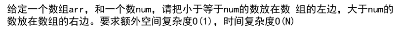

**思路**

- 将数组划分为两片区域，
- 左侧为小于 num 的区域
- 右侧为为排序区域
- 遍历数组，
  - 如果遍历到的数小于 num,就把这个数放到小于 num 的区域的下一个位置，并更新小于 num 区域的大小
  - 如果不小于，就继续遍历。

**具体实现**

- 需要一个指针 p=-1;
- 遍历数组，`i<num.len`，
  - 如果`num[i]<num`,则交换 num[i] 和 num[++p];
- 遍历完毕后,小于 num 的数就在 0~p 的区域

```java
package 左程云算法课初级班基础知识学习笔记._9_快速排序;

import java.util.Arrays;

public class Problem_1 {
 public static void main(String[] args) {
  int T[] = {9,8,7,6,5,4,3,2,1};
  test(T, 5);
  System.out.println(Arrays.toString(T));// [4, 3, 2, 1, 5, 9, 8, 7, 6]
 }
 // 荷兰国旗问题1
 public static void test(int arr[], int num) {
  int p = 0;
  for(int i = 0;i<arr.length;i++){
   if(arr[i]<num){
    exchange(arr, i,p++);
   }
  }
 }

 public static void exchange(int arr[], int i, int j) {
  int temp = arr[i];
  arr[i] = arr[j];
  arr[j] = temp;
 }
}
```

##### 三色国旗

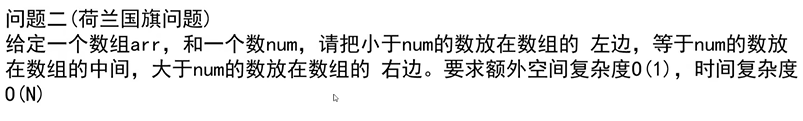

**思路**

- 将数组划分为两片区域，最左侧为小于 num 区域，最右侧为大于 num 区域
- 遍历数组，
  - 如果一个元素小于 num 就放到最左侧区域的下一个位置
  - 如果一个元素大于 num 就放到最右侧区域的上一个位置

**具体实现**

- 需要两个指针 p=-1;,q=len
- 遍历数组，`i<q`，
  - 如果`num[i]<num`,则交换 num[i] 和 num[++p] 然后 i++;
  - 如果`num[i]==num` 则 i++;
  - 如果`num[i]>num`,则交换 num[i] 和 num[--q] 然后 i 不变;
- 遍历完毕后,
  - 小于 num 的数就在 0~p 的区域，
  - 等于 num 的就在 p+1~q-1 的区域
  - 大于 num 的就在 q~len-1 的区域

```java
package 左程云算法课初级班基础知识学习笔记._9_快速排序;

import java.util.Arrays;

public class Problem_2 {
 public static void main(String[] args) {
  int T[] = { 9, 5, 7, 6, 5, 4, 3, 5, 1 };
  test(T, 5);
  System.out.println(Arrays.toString(T));// [1, 3, 4, 5, 5, 5, 6, 7, 9]
 }

 // 荷兰国旗问题2
 public static void test(int arr[], int num) {
  int head = 0;
  int end = arr.length - 1;
  // 注意这个终止条件
  for (int idx =0;idx <= end;) {
   if (arr[idx] < num) {
    exchange(arr, idx, head++);
    idx++;
   } else if (arr[idx] > num) {
    exchange(arr, idx, end--);
    // 这里不必i++
   } else {
    idx++;
   }
  }
 }

 public static void exchange(int arr[], int i, int j) {
  System.out.println("交换" + i + "," + j);
  int temp = arr[i];
  arr[i] = arr[j];
  arr[j] = temp;
 }
}
```

#### 快速排序 v1.0

**排序过程**

- 选取数组最后一个数为 num
- 小于等于 num 的数放到左侧区域，
- 大于 num 的数入栈数组右侧区域
- 将数组最后一个数和右侧区域第一个数交换
- 对左侧区域执行递归调用
- 对右侧区域执行递归调用
- 然后数组就有序了

**时间复杂度：**$O(N^2)$

- 最差情况：
  - 当待排序数组是一个有序数组时。
  - 选取的 num 数就是数组的最大值或最小值
  - 大于 num 的数放右边，小于 num 的数放左边，
    - 这一步操作需要遍历整个数组，所以耗时$O(N)$
  - 那么左侧区域的范围就是[0,n-1],右侧区域不存在
  - 或者右侧区域的范围就是[0,n-1],左侧区域不存在
  - 这就使其每一次函数调用只能确定一个数的位置，
  - 有 n 个数，需要执行函数调用 n 次，每次时间复杂度为$O(N)$
  - 即，时间复杂度为：$O(N^2)$
- 最好情况
  - 选取的 num 是数组的中位数时，
  - 大于 num 的数放右边，小于 num 的数放左边，
    - 这一步操作需要遍历整个数组，所以耗时$O(N)$
  - 需要对左侧[0,n/2]区域做递归排序
  - 需要对右侧[n/2,n-1]区域做递归排序
  - 使用 Master 公式就是 $T(N)=2T(\frac{N}{2}+O(N))$
  - 即，时间复杂度为：$O(N\log{N})$

**空间复杂度**：

- 最坏情况：$O(N)$
- 最好情况：$O(\log{N})$

#### 快速排序 v2.0

**排序过程**

- 选取数组最后一个数为 num
- 小于 num 的数放到左侧区域
- 等于 num 的数放到中间区域
- 大于 num 的数放到右侧区域
- 将数组最后一个数和右侧区域第一个数交换
- 对左侧区域执行递归调用
- 对中间区域不执行递归调用（因为已经有序了）
- 对右侧区域执行递归调用
- 然后数组就有序了

**时间复杂度：**$O(N^2)$

#### 快速排序 v3.0

**排序步骤/过程**

- **随机选取**数组中的一个数为 num
- 将其和数组中最后一个数交换
  - （这步其实没必要，只需要找到一个数就行了）
- 小于 num 的数放到左侧区域
- 等于 num 的数放到中间区域
- 大于 num 的数放到右侧区域
- 将数组最后一个数和右侧区域第一个数交换
  - （这步其实没必要，上面三步会将最后一个数放到正确的位置）
- 对左侧区域执行递归调用
- 对中间区域不执行递归调用（因为已经有序了）
- 对右侧区域执行递归调用
- 然后数组就有序了

**时间复杂度：**$O(N\log{N})$

- 由于存在随机行为，每次选到什么数都成为了概率事件
- 视频中说时间复杂度为 $O(N\log{N})$
- 但我感觉应该是：
  - 平均时间复杂度为 $Θ(N\log{N})$
  - 最差时间复杂度为 $O(N^2)$
    - 因为即使是随机选取 num,
    - 依然存在每次都选取到最大或最小数的可能，
    - 这种概率应该是$P=\frac{1}{n}*\frac{1}{n-1}*\frac{1}{n-2}*...$

```java
package 左程云算法课初级班基础知识学习笔记._9_快速排序;

import java.util.Arrays;

public class QuickSort {
 public static void main(String[] args) {
  int test[] = { 9, 8, 7, 6, 5, 4, 3, 2, 1 };
  quickSort(test, 0, test.length - 1);
  System.out.println(Arrays.toString(test));
 }

 public static void quickSort(int arr[], int left, int right) {
  if (left >= right)
  // 这个判断条件也是关键，因为mid[0] mid[1] 取值范围的原因
   return;
  int mid[] = partition(arr, left, right);
  System.out.println(Arrays.toString(arr));
  quickSort(arr, left, mid[0] - 1);
  quickSort(arr, mid[1] + 1, right);
 }

 // 对于数组 [5,4,3,2,1,0]
 // 该函数会随机选一个数作为num
 // 该函数会将其变为 [小于num的数，等于num的数，大于num的数]
 // 返回值为 等于num的数的区域 的开始和结束坐标
 public static int[] partition(int arr[], int left, int right) {
  // 随机最后一个数作为比较对象
  int num = arr[randomRange(left, right)];
  int p1 = left - 1;
  int p2 = right + 1;
  int i = left;
  while (i < p2) {
   if (arr[i] == num) {
    i++;
   } else if (arr[i] < num) {
    swap(arr, i++, ++p1);
   } else if (arr[i] > num) {
    swap(arr, i, --p2);
   }
  }
  // 返回 中间区域的范围
  return new int[] { p1 + 1, p2 - 1 };
 }

 public static void swap(int arr[], int i, int j) {
  int temp = arr[i];
  arr[i] = arr[j];
  arr[j] = temp;
 }

 public static int randomRange(int from, int to) {
  return (int) (from + Math.random() * (to - from));
 }
}
```

#### 快速排序 c 语言版

```c
#include<stdlib.h>
#include<stdio.h>
#include<time.h>

int Rand(int start,int to);
void quickQort(int arr[],int length);
void printArray(int arr[],int length);

void main()
{
 int arr[100];
 int i;
 for( i=0;i<100;i++){
  arr[i]=Rand(0,100);
 }
 quickQort(arr,100);
 printArray(arr,100);
}


int Rand(int start,int to){
 srand((unsigned)time(NULL)+rand());
 return start+rand()%(to-start);
}
void exchange(int arr[],int i,int j){
 if(i!=j){
  arr[i]=arr[i]^arr[j];
  arr[j]=arr[i]^arr[j];
  arr[i]=arr[i]^arr[j];
 }
}
int pagination(int arr[],int left,int right){
 int i = left;
 int midVal = arr[left];
 while(i<right){
  if(arr[i]<midVal) exchange(arr,left++,i++);
  else if(midVal<arr[i]) exchange(arr,right--,i);
  else i++;
 }
 return left;
}
void process(int arr[],int left,int right){
 if(left<right){
  int mid = pagination(arr,left,right);
  process(arr,left,mid-1);
  process(arr,mid+1,right);
 }
}
void quickQort(int arr[],int length){
 process(arr,0,length-1);
}
void printArray(int arr[],int length){
 int i=0;
 printf("[");
 for( i=0;i<length;i++){
  if(i!=length-1)printf("%d,",arr[i]);
  else printf("%d",arr[i]);
 }
 printf("]\n");
}
```

## [11]堆

### [11.1]堆的数据结构

**前置知识**

- 完全二叉树：满二叉树或即将变满的二叉树就是完全二叉树。
- 二叉树的顺序存储结构
- 

**堆的顺序存储结构**

- **堆是一颗完全二叉树**
- 堆的结构类似于上面的二叉树的顺序存储结构，
- **但第 0 个位置存储第 0 个元素**，所以
- $i$ 的左孩子为: $2i+1$
- $i$ 的右孩子为: $2i+2$
- $i$ 的父孩子为: $(i-1)/2$
- **大根堆**：根节点的值为最大值
- **小根堆**：根节点的值为最小值

**堆的堆化操作**

- 从某个节点的子节点中找出最大值
- 如果最大值比当前节点的值大
- 交换这两个节点的值
- 交换后，继续向下寻找比根节点值大的节点然后交换
- 直到没有子节点或没有子节点比父节点大为止

```java
class Heap {
 int heapLen = 0;
 int heap[] = new int[10];
 // 堆化：从某个的子节点地位提升的过程，假皇帝被贬的过程
 public void heapify(int currentIdx) {
  int leftIdx = 2 * currentIdx + 1;
  int rightIdx = leftIdx + 1;
  while (leftIdx < this.heapLen) {// 判断是否存在子节点
   // 找出子节点中最大节点的下标
   int maxIdx = rightIdx < this.heapLen && this.heap[rightIdx] > this.heap[leftIdx] ? rightIdx : leftIdx;
   if (this.heap[currentIdx] >= this.heap[maxIdx])
    break;
   Utils.exchange(heap, currentIdx, maxIdx);// 父节点和子节点交换
   currentIdx = maxIdx;
   leftIdx = 2 * currentIdx + 1;
   rightIdx = leftIdx + 1;
  }
 }
}
```

**堆的添加操作**

- 时间复杂度$O(logN)$
- 先将要插入的数放在堆的末尾的位置
- 然后将该元素的值和所在子树的根节点的值做比较
- 如果比根节点的值大，则和根节点交换
- 交换后，继续往上和根节点比较，
- 直到不比根节点的数大，或到达根节点

```java
class Heap {

 int heapLen = 0;
 int heap[] = new int[10];

 public void heapAdd(int nums[]) {
  for (int i = 0; i < nums.length; i++) {
   heapAdd(nums[i]);
  }
 }

 // 堆插入操作,插入一个数
 public void heapAdd(int num) {
  heapInsert(this.heapLen, num);
 }

 // 堆插入操作,仅可以在[0,length]位置插入一个数
 public void heapInsert(int i, int num) {
  if (isFull())// 堆满则扩容
   resize();

  // 先将其插入到末尾
  int currentIdx = i < this.heapLen ? i : this.heapLen++;// 获取插入位置并更新堆大小
  this.heap[currentIdx] = num;

  // 子节点依次打败父节点，提升地位的过程：
  int fatherIdx = (currentIdx - 1) / 2;
  while (this.heap[currentIdx] > this.heap[fatherIdx]) {
   // 如果当前节点比其父节点大，则交换
   Utils.exchange(heap, currentIdx, fatherIdx);
   currentIdx = fatherIdx;
   fatherIdx = (currentIdx - 1) / 2;
  }

  // 子节点篡位的过程
  heapify(i);// 从i位置往下堆化
 }
 // 扩容
 private void resize() {
  // 分配内存
  int help[] = new int[this.heap.length * 2];
  // 拷贝
  for (int i = 0; i < this.heap.length; i++) {
   help[i] = this.heap[i];
  }
  this.heap = help;
 }
}
```

**扩容的时间复杂度**

- 数据量为$N$,每次扩容$2$倍,
- 扩容的次数就为$logN$
- 每次扩容需要复制原数据到新数组，复杂度$N$
- 则总共的扩容代价为$NlogN$
- 平均下来，每次添加操作的复杂度就是$logN$

```java
 // 扩容
 private void resize() {
  // 分配内存
  int help[] = new int[this.heap.length * 2];
  // 拷贝
  for (int i = 0; i < this.heap.length; i++) {
   help[i] = this.heap[i];
  }
  this.heap = help;
 }
```

**实现堆的完整代码**

```java
package 左程云算法课初级班基础知识学习笔记._11_堆;

import java.util.Arrays;

public class Main {
 public static void main(String[] args) {
  Heap heap = new Heap();
  int test[] = { 9, 8, 7, 6, 5, 4, 3, 2, 1, 0 };
  heap.heapSort(test);
  System.out.println(Arrays.toString(test));
 }
}

class Heap {
 int heapLen = 0;
 int heap[] = new int[10];

 public void heapSort(int nums[]) {
  init();
  heapAdd(nums);
  for (int i = nums.length - 1; i >= 0; i--) {
   // 从末尾遍历
   nums[i] = popMax();
  }
 }

 // 弹出最大的数
 public Integer popMax() {
  if (isEmpty()) {
   return null;
  }
  int maxNum = this.heap[0];
  // 将末尾节点的数放置到根节点上，然后缩小堆的大小
  Utils.exchange(this.heap, 0, --this.heapLen);
  heapify(0);// 从根节点开始堆化
  return maxNum;
 }

 // 堆化：从某个的子节点地位提升的过程，假皇帝被贬的过程
 public void heapify(int currentIdx) {
  int leftIdx = 2 * currentIdx + 1;
  int rightIdx = leftIdx + 1;
  while (leftIdx < this.heapLen) {// 判断是否存在子节点
   // 找出子节点中最大节点的下标
   int maxIdx = rightIdx < this.heapLen && this.heap[rightIdx] > this.heap[leftIdx] ? rightIdx : leftIdx;
   if (this.heap[currentIdx] >= this.heap[maxIdx])
    break;
   Utils.exchange(heap, currentIdx, maxIdx);// 父节点和子节点交换
   currentIdx = maxIdx;
   leftIdx = 2 * currentIdx + 1;
   rightIdx = leftIdx + 1;
  }
 }

 // 堆插入操作,插入一个数组
 public void heapAdd(int nums[]) {
  for (int i = 0; i < nums.length; i++) {
   heapAdd(nums[i]);
  }
 }

 // 堆插入操作,插入一个数
 public void heapAdd(int num) {
  heapInsert(this.heapLen, num);
 }

 // 堆插入操作,仅可以在[0,length]位置插入一个数
 public void heapInsert(int i, int num) {
  if (isFull())// 堆满则扩容
   resize();

  // 先将其插入到末尾
  int currentIdx = i < this.heapLen ? i : this.heapLen++;// 获取插入位置并更新堆大小
  this.heap[currentIdx] = num;

  // 子节点依次打败父节点，提升地位的过程：
  int fatherIdx = (currentIdx - 1) / 2;
  while (this.heap[currentIdx] > this.heap[fatherIdx]) {
   // 如果当前节点比其父节点大，则交换
   Utils.exchange(heap, currentIdx, fatherIdx);
   currentIdx = fatherIdx;
   fatherIdx = (currentIdx - 1) / 2;
  }

  // 子节点篡位的过程
  heapify(i);// 从i位置往下堆化
 }

 // 是否满
 private boolean isFull() {
  return this.heapLen == this.heap.length;
 }

 // 是否空
 private boolean isEmpty() {
  return this.heapLen == 0;
 }

 // 清空
 private void init() {
  this.heapLen = 0;
 }

 // 扩容
 private void resize() {
  // 分配内存
  int help[] = new int[this.heap.length * 2];
  // 拷贝
  for (int i = 0; i < this.heap.length; i++) {
   help[i] = this.heap[i];
  }
  this.heap = help;
 }
}

class Utils {
 public static void exchange(int arr[], int i, int j) {
  int temp = arr[i];
  arr[i] = arr[j];
  arr[j] = temp;
 }
}
```

### [11.2]堆排序

**利用堆进行排序**

- 时间复杂度：$O(NlogN)$
- 将数组中的数依次放入堆中,【时间复杂度：$O(logN)$】
- 从后往前遍历原数组,
  - 从堆中取出最大值,【时间复杂度：$logN$】
  - 放回原数组

```java
package 左程云算法课初级班基础知识学习笔记._11_堆;

import java.util.Arrays;

public class Main {
 public static void main(String[] args) {
  Heap heap = new Heap();
  int test[] = { 9, 8, 7, 6, 5, 4, 3, 2, 1, 0 };
  heap.heapSort(test);
  System.out.println(Arrays.toString(test));
 }
}
class Heap {
 int heapLen = 0;
 int heap[] = new int[10];

 public void heapSort(int nums[]) {
  init();
  heapAdd(nums);
  for (int i = nums.length - 1; i >= 0; i--) {
   // 从末尾遍历
   nums[i] = popMax();
  }
 }

 // 弹出最大的数
 public Integer popMax() {
  if (isEmpty()) {
   return null;
  }
  int maxNum = this.heap[0];
  // 将末尾节点的数放置到根节点上，然后缩小堆的大小
  Utils.exchange(this.heap, 0, --this.heapLen);
  heapify(0);// 从根节点开始堆化
  return maxNum;
 }
}
```

### java 内置堆：优先级队列

```java
package 左程云算法课初级班基础知识学习笔记._11_堆;

import java.util.Arrays;
import java.util.PriorityQueue;

public class Test {
 public static void main(String[] args) {
  int test[] = { 9, 8, 7, 6, 5, 4, 3, 2, 1, 0 };
  heapSort(test);
  System.out.println(Arrays.toString(test));
 }

 public static void heapSort(int arr[]) {
  // 优先级队列，就是堆，默认为小根堆
  PriorityQueue pq = new PriorityQueue<Integer>();
  for (int index = 0; index < arr.length; index++) {
   pq.add(arr[index]);
  }
  for (int index = 0; index < arr.length; index++) {
   arr[index] = (int) pq.poll();
  }
 }
}
```

### 系统内置了现成的数据结构为什么还要自己手写实现？

- **内置的数据结构只能对数据做系统允许的有限数量的操作**，如添加数据，删除数据，
- 但不能随意修改指定位置的数据后再以**很小的时间复杂度**再恢复到原先的状态，也就是说，
- **系统提供的数据结构对数据的操作是受到限制的，自己实现的数据结构对数据的操作是任意的、可自由发挥的**

### 例题

**对几乎有序的数组排序**  


**思路**

- 假设 k=6
- 这意味着，[0,5]位置上的最小的数，就是整个数组的最小的数
- 所以只需要先把 k 个数放入小根堆中，
- 然后每次把数组中的数添加一个入推，再拿出一个元素放回数组

```java
package 左程云算法课初级班基础知识学习笔记._11_堆;

import java.util.PriorityQueue;

public class Question_1 {
 public static void main(String[] args) {

 }

 public static void sort(int arr[],int k){
  PriorityQueue<Integer> pq = new  PriorityQueue<>();
  int i = 0;
  while(i < Math.min(arr.length, k+1)){
   pq.add(arr[i++]);
  }
  int j = 0;
  while (j < arr.length) {
   arr[j++] = pq.poll();
   if(i<arr.length)
    pq.add(arr[i++]);
  }
 }
}
```

## 基于比较的排序总结

- 上述排序算法都是基于比较的排序,
- 完全可以通过比较器或模板方法，
- 将上述算法复用到对含有多个属性的对象的排序中

> 不基于比较的排序：桶排序(计数排序、基数排序）

## 计数排序

**概念**

- 如有一个数组 A，其中的数代表员工的年龄，要求对其进行排序
- 由于人的年龄范围不会太宽泛，可以假设年龄区间在[0,150]
- 准备一个长度和年龄区间范围一致的数组 B，
- 遍历员工的年龄数组 A
  - 遇到 0 岁,则 B[0]++
  - 遇到 1 岁,则 B[1]++
  - 遇到 13 岁,则 B[13]++
  - ...
- 遍历完数组 A 后，遍历数组 B
- 如果遇到 B[10]=5,
- 则表示员工中年龄为 10 岁的员工有 5 个
- 所以向数字 A 中写入 5 个 10
- ....

## 基数排序

**概念**

- 基数是指，二进制有两个基数：0、1，八进制有八个基数，0~7.
- 基数是几，就准备几个桶（队列，数组），桶可以是队列、数组、栈、啥都行
- 如数据是 10 进制，就准备一个长度为 10 的桶数组 B
- 遍历数组 A，依次放入桶中，
  - 先根据元素的个位来决定放入哪个桶，个位为 0 就放入 0 号桶
- 遍历完毕后，遍历桶数组，按照先入先出取出桶中的元素，放到原数组中。
- 然后再根据元素十位数来执行上述操作，
- 循环往复...

**示例代码：支持负数的基数排序**

```java
package 左程云算法课初级班基础知识学习笔记._12_桶排序;

import java.util.Arrays;

public class RadixSort {
 public static void main(String[] args) {
  int[] test = { 9, 8, -7, 5, -4, 6, 3, -8, 4, 6, 2, 1, -6, -4 };
  radixSort(test, 10);
  System.out.println(Arrays.toString(test));// [-8, -7, -6, -4, -4, 1, 2, 3, 4, 5, 6, 6, 8, 9]
 }

 static void radixSort(int arr[], int radix) {
  int maxLen = findMaxBitLen(arr, radix);
  int help[] = new int[arr.length];
  for (int i = 1; i <= maxLen; i++) {
   // 统计
   int counter[] = new int[2 * radix - 1];// 假设radix为10进制，则要统计 [-9,-1] and [0] and [+1,+9] 也就是2*radix-1
   for (int j = 0; j < arr.length; j++) {
    // 如果遍历到 -??4
    // 则counter["-4"]++
    // 表示又统计到个位为-4的数一次
    // 因为getDigit()的返回值范围为[-9,0,+9],所以将其加9，则范围就成了[0,18]
    counter[radix - 1 + getDigit(arr[j], i, radix)]++;
   }
   // 计算前缀和，这就表示之前一共有多少位
   for (int j = 1; j < counter.length; j++) {
    counter[j] = counter[j - 1] + counter[j];
   }
   // 如果遍历到 ??5 且counter["5"]=8 则表示 7号位置就是??5应当存在的位置
   for (int j = arr.length - 1; j >= 0; j--) {
    help[--counter[radix - 1 + getDigit(arr[j], i, radix)]] = arr[j];
   }
   // 复制到arr
   for (int j = 0; j < arr.length; j++) {
    arr[j] = help[j];
   }
  }
 }

 // 找到数组中位数最长的数的位数，如189 就是3位数
 static int findMaxBitLen(int arr[], int radix) {
  int max = 0;
  for (int i = 0; i < arr.length; i++) {
   max = Math.max(Math.abs(max), Math.abs(arr[i]));
  }
  int len = 0;
  while (max > 0) {
   len++;
   max /= radix;
  }
  return len;
 }

 // 获取一个数的第i位 如1458 的第1位为8 第2位为5
 static int getDigit(int num, int i, int radix) {
  while (i > 1 && num != 0) {
   num /= radix;
   i--;
  }
  return num % radix;
 }
}
```

## 排序算法稳定性

**排序算法的稳定性：**  
排序后，相同值的元素之间相对位置保持不变，称排序算法具有稳定性。

**不具有稳定性的排序算法**

- **选择排序**
  - 回顾：看成有序部分和无序部分，从无序部分中选择一个最小的元素和无序部分的第一个元素交换。交换这一步破坏了稳定性
  - 
- **快速排序**
  - 回顾：荷兰国旗问题，一旦产生元素交换行为就有可能破坏稳定性
  - 
- **堆排序**
- 堆化的过程会破坏稳定性
- 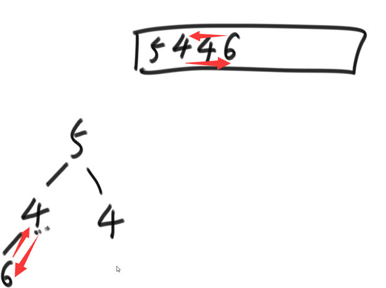

**可以实现具有稳定性的排序算法**

- **冒泡排序**
  - 要求元素值相等的时候不能交换值，否则会破坏相对位置
- **插入排序**
  - 要求在插入阶段的时候，在两元素相等时停止交换
- **归并排序**
  - 要求在 merge 合并的时候，当元素相等时，先处理第一个数组的元素，保持相对位置
- **一切基于桶排序思想的排序**
  - 基数排序
  - 计数排序（？）

**应用**

使用具有稳定性的排序算法对商品进行价格升序排序，  
然后再根据商品的好评率对上一步的排序结果进行降序排序，  
排序结果就是物美价廉的商品

## 排序总结

- 
- 最后三个排序算法最常用。
- 所谓的十大排序算法中，除了上述这些排序算法，其他算法都不常用
- 最常用的是快速排序，
  - 虽然快速排序和归并的最差时间复杂度是相同的，但实际的上快速排序时间复杂度的系数、常数项小。
- 基于比较的排序算法中**目前为止没有找到**时间复杂度**小于** $O(N*logN)$ 的算法
- 基于比较的排序算法中时间复杂度 **为** $O(N*logN)$ 的算法中 **空间复杂度** 为 $O(1)$ ，同时又 **具有稳定性** 的算法， **目前为止没有找到**
- 所以目前来说，算法时间复杂度小、空间复杂度低、具有稳定性 不能同时满足

**工程上对排序算法的改进**

- 充分利用$O(NlogN)$算法和$O(N^2)$算法各自的优势。
  - $O(N^2)$小样本情况下常数项低、系数小

  ```js
  function Sort(arr[]){
   // 小样本量时，插入排序的时间复杂度低
   if(arr.length<=60) return insertSort(arr)
   // 大样本量时，使用快速排序
   return quickSort(arr)
  }
  ```

- 稳定性问题：面试问题，为什么 arrays.sort()对基础类型使用快速排序，而对非基础类型使用归并排序？
  - 因为基础类型不需要考虑算法稳定性，而非基础类型要考虑算法稳定性

**常见的坑（没用的知识）**

- 归并排序使用 **内部缓存法（非常难）** 可以实现空间复杂度为$O(1)$,但会失去稳定性，不如直接用堆排序。
- **原地归并排序法**可以实现空间复杂度为$O(0)$,但会使得算法时间复杂度变为$O(N^2)$ 不如直接用插入排序。
- 快速排序可以做到稳定，但非常难，但空间复杂度会变为 $O(N)$ ,不如直接用归并排序。
  - **谷歌：quick sort + 01 stable sort**
- 所有对现有算法的改进都不重要，因为目前为止没有人找到时间复杂度小于 $O(N*logN)$ 空间复杂度为 $O(1)$ 且具有稳定性的算法。
- 有一道题目，要求把数组中奇数放左边，偶数放右边，还要保持相对次序，要求时间复杂度 O(N) 空间复杂度 O(1).
  - “奇数放左边，偶数放右边” 的过程和经典的快速排序中 partition 过程是等效的，
  - 但快速排序中 partition 过程无法做到稳定性，那谁能做到? 面试官能做到？
  - 简单来说就是荷兰国旗问题，但是要求稳定，能做到，但非常的难，论文级别的算法“01 stable sort”

## hash 表和有序表概述

### hash 表

- 这里的 hash 表是指 hashset 和 hashmap 等通过 hash 增删改查的数据结构
- 操作的耗时为$O(1)$

hashset

- 无序
- 仅存 value 的集合

hashmap

- 无序
- 存储的 key:value 的集合
- 对于基本数据类型的 key，hashmap 在存 key 时，是拷贝这个基本数据类型作为 key
- 对于引用数据类型的 key，hashmap 在存 key 时，是拷贝这个引用数据类型的地址作为 key，占 8 字节 32 比特

### 有序表

- 红黑树、AVL 树、size-balance-tree、跳表都是有序表，只是底层的具体实现不同
- 操作的耗时为$O(logN)$
- 对于基础类型，内部按值传递
- 对于引用数据类型，必须提供比较器，或实现 comparable 接口

treeset

- 有序
- 需要实现 compareable 接口

treemap

- 根据 key 来有序组织的表
- 由于是有序的，有一些新的接口
  - containsKey(?)
  - firstKey()
  - lastKey()
  - floorKey(?)
  - ceilingKey(?)

无论是这里的有序表还是无序表，大量刷题的过程中，中等难度的题都不会涉及到实现原理的问题，只需要会用就行，只有很难的题才需要理解这些数据结构的原理

### 链表

**反转单链表和双链表（水题）**

- head=f(head)
- 

**打印两个有序链表的公共部分（水题）**

- 类似于快速排序的 merge 过程，在元素值相等时打印输出
- 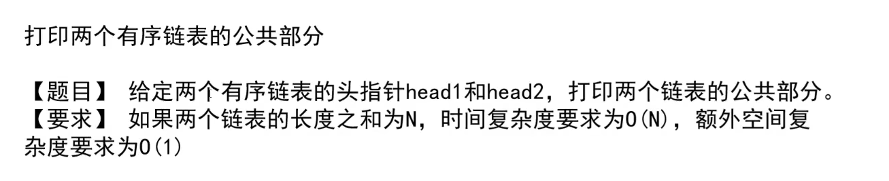

### 面试时链表解题方法论

- 笔试时，不用太在乎空间复杂度，主要考虑时间复杂度
- 面试时，主要考虑时间复杂度，但要找到最省空间的方法
  - 否则无法达到面试官的考点，无法留下深刻印象
- **重要技巧**
  - 使用额外数据结构的方式（哈希表等）
  - 快慢指针

**例题 1**  


**笔试解题思路**

- 方法 1：遍历所有元素，全部入栈，然后再遍历一遍，依次出栈，然后判断是否相等，全部相等则是回文
  - 
- 方法 2：遍历前一半的元素，依次入栈，遍历后一半的元素，依次弹出，然后判断是否相等，若全部相等则是，若中途不相等则不是
  - 但是由于是链表，无法知道何时到达一半的位置，需要使用快慢指针
  - 

**快慢指针**

- 满指针走一步，快指针走两步
- 快指针走完，慢指针走到一半的位置
- 需要注意的问题
  - 但需要考虑链表长度为奇偶数时的问题，
  - 还有就是有时候需要在快指针走到头时，
  - 要求链表长度为偶数时
  - 慢指针停在中间位置的下一个位置或上一个位置的问题
  - 要能处理数据量非常小的时候的问题，链表长度为 1、2、3 时，中点位置如何计算
  - 对于这些问题，只能多写多练

**面试解题思路**

- 由于要求空间复杂度为$O(1)$,所以说不能使用栈
- 方法是，先使用快慢指针找到中间的位置，
- 然后从中间的位置开始反转后续单链表的指向，即 mid = reverse(mid)
- 
- 然后分别从头遍历和从末尾遍历，比较是否完全一致，以此觉得返回 true、false
- 返回前，要恢复链表的指向
- 
- 
- 这种写法就是考察编程能力
- 刷题要分别按笔试和面试的做题思路侧重点来同时练习

**单链表荷兰国旗问题** 

**笔试写法**，  
把单链表的每个节点放入数组，然后用快速排序的 partition 算法（无法做到稳定性），然后遍历数组中的节点，修改指针指向。

**面试写法**，

- 需要 6 个变量 构成三个循环单链表
  - 小于 num 的头指针
  - 小于 num 的尾指针
  - 等于 num 的头指针
  - 等于 num 的尾指针
  - 大于 num 的头指针
  - 大于 num 的尾指针
- 遍历链表，依次判断应当插入到哪一个循环单链表中，
- 遍历完毕后，依次将三个循环单链表，首尾相连，返回。
- **但是**，需要考虑极端情况的处理，
- 如没有等于 5 的元素，则会出现空指针。
- 
- 
- 

**复杂链表的拷贝**


**空间复杂度为 O(n)的解法**

- 遍历链表 为每个节点创建新节点，存入 hashmap<老节点地址,新节点的地址>
- 再次遍历链表，map.get(老节点地址).next = map.get(老节点.next)
- 新链表的头节点 = map.get(老链表的头节点)

```ts
function copy(list: linkedList) {
 var result = null;
 var map = new Map();
 for (node of list) {
  map.set(node, new Node(node.value));
 }
 for (node of list) {
  map.get(node).next = map.get(node.next);
  map.get(node).random = map.get(node.random);
 }
 return map.get(list.head);
}
```

**空间复杂度为 O(1)的解法**

- 原链表
  - 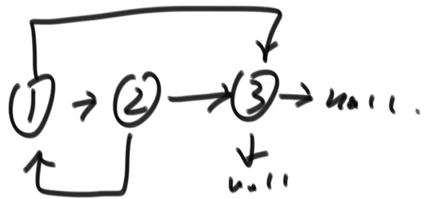
- 遍历链表，为每个节点创建新节点，然后就插入在当前节点和下一个节点之间。
  - 
- 再次遍历链表,
  - 一次获得两个节点，分别获得老链表节点和新链表节点
  - 老链表节点.random = 新链表节点.random.next
  - 
- 再次遍历链表，分离新链表和老链表

```ts
function copy(list: linkedList) {
 // 拷贝节点，并在当前位置插入
 let current = list;
 while (current != null) {
  let copyNode = new Node(current.value);
  copyNode.next = current.next;
  current.next = copyNode;
  current = copyNode.next;
 }
 // 调整新节点的random指针的指向
 current = list;
 while (current != null) {
  let oldNode = current;
  let copyNode = current.next;
  copyNode.random = oldNode.random.next;
  current = current.next.next;
 }
 // 分离新旧节点
 current = list;
 resultList = current.next;
 while (current != null) {
  let copyNode = current.next;
  copyNode.next = copyNode.next.next;
  current = current.next.next;
 }
 return resultList;
}
```

**单链表最难的题：两个链表的相交的节点**  


**前置问题：一个链表的入环节点**

- leetcode142 题
- 实现函数：获取有环单链表的入环节点
- **空间复杂度为 O(N)的方法：**
  - 用 hash 表，遍历链表，每获取一个节点就查表是否存在，存在就返回，否则把当前节点放入表中，继续遍历下一个节点
  - 
- **不用 hash 表找到入环节点的方法**
  - 用快慢指针，快慢指针的初始位置任意
  - 慢指针走一步，快指针走两步
  - 如果快指针走到 null，则链表无环
  - 否则链表有环，且快慢指针一定会在环上相遇
  - 当快指针=慢指针时，让快指针回到开始位置
  - 然后让块指针走一步，慢指针也走一步
  - 最终快慢指针一定会相遇在入环节点上
  - 

**言归正传**

回到原题，该题需要分类讨论

- 先分别对两个链表执行上述操作，找出各自链表的入环节点
- 如果链表 1 的入环节点==null && 链表 2 的入环节点==null
  - 则说明两链表要么是两个独立的链表 要么是最后有公共部分
  - 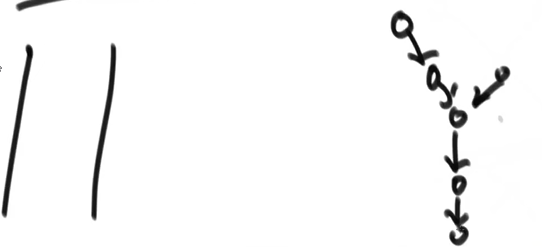
  - 所以遍历两链表，分别找出链表 1 的尾节点 链表 2 的尾节点
  - 如果链表 1 的尾节点!=链表 2 的尾节点 则属于第一种情况 否则属于第二种情况
  - 对于第一种情况 返回 null
  - 
  - 对于第二种情况 需要找到相交的节点
  - 
  - 需要知道两链表各自的长度，较长的链表从位置： （长链表长度-短链表长度） 处出发
  - 较短的链表从起始位置处出发，同时遍历两链表，当两指针相等时，就是相交节点
- 如果链表 1 的入环节点==null && 链表 2 的入环节点!=null
  - 则两个链表不可能相交，返回 null
- 如果链表 1 的入环节点!=null && 链表 2 的入环节点!=null
  - 则有三种情况
  - 
  - 只需要分别对两链表执行获取入环节点操作，如果两个入环节点相等，则就是第二种情况，直接返回该位置地址即可
  - 对于第一和第三种情况，只需要继续从链表 1 的入环节点继续遍历，如果能遍历到入环节点 2 则就是第三种情况，返回任意一个节点的地址即可，否则就是第一种情况，返回 null
  - 
  - 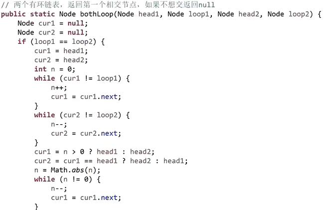
- 

## 二叉树

### 什么是二叉树递归遍历

> 直接画几张图吧：

**递归序**


二叉树的递归变量，会访问一个节点三次，进入节点一次，回到节点两次

```js
function A(node) {
 // -------时刻1--------
 // | 第1次来到【函数A】 : 可以打印输出，可以做递归的结束条件判断
 if (!node) return;
 //   do something
 // -------时刻1--------

 A(node.left); // 递归调用

 // -------时刻2--------
 // | 第2次来到【函数A】： 第一次递归调用结束
 // -------时刻2--------

 A(node.right); // 递归调用

 // -------时刻3--------
 // | 第3次来到【函数A】： 第一次递归调用结束
 // -------时刻3--------
}
```

**先序遍历**

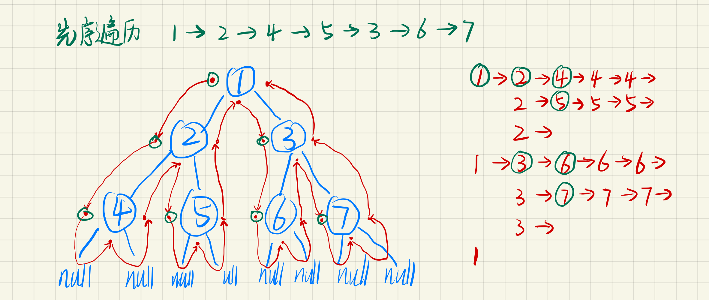

```js
function firstRootOrder(node: TreeNode) {
 if (!node) return;
 print(node.val);
 firstRootOrder(node.left);
 firstRootOrder(node.right);
}
```

**中序遍历**


```js
function middleRootOrder(node: TreeNode) {
 if (!node) return;
 middleRootOrder(node.left);
 print(node.val);
 middleRootOrder(node.right);
}
```

**后序遍历**


```js
function afterRootOrder(node: TreeNode) {
 if (!node) return;
 afterRootOrder(node.left);
 afterRootOrder(node.right);
 print(node.val);
}
```

### 二叉树的非递归遍历

> 任何递归函数 都可以改成非递归函数！  
> 递归就是操作系统来管理栈，非递归就是自己来管理栈。  
> 非递归遍历在面试中经常出现，考察是否理解递归过程

#### 先序遍历

**先序遍历 1:根 左 右**

- 先将根节点入栈
- 然后进入循环
  - 弹出栈顶元素 处理他
  - 依次入栈右节点和左节点 【为了使弹出时先弹出左节点】
  - 循环结束条件：栈空
- 然后函数返回

  ```js
  function preOrder(root:TreeNode){
   let stack = new Stack<TreeNode>()
   stack.push(root);
   while(!stack.isEmpty()){
    let current = stack.pop()
    console.log(current.value)
    if(current.right){
     stack.push(current.right)
    }
    if(current.left){
     stack.push(current.left)
    }
   }
  }
  ```

- 

**先序遍历 2：根 右 左**

- 只需要将先序遍历 1 中的 压子树的顺序调换即可

#### 后序遍历

**后序遍历 1：左 右 根**

- 在先序遍历 2【根 右 左】的基础上
- 额外分配一个栈，称收集栈
- 每次把遍历到的节点放入收集栈
- 遍历完毕后，弹出收集栈的顺序，就是后序遍历

  ```js
  function posOrder(root: TreeNode) {
   let stack1 = new Stack();
   let stack2 = new Stack();
   stack1.push(root);
   while (!stack1.isEmpty()) {
    let current = stack1.pop();
    stack2.push(current);
    if (current.left) {
     stack1.push(current.left);
    }
    if (current.right) {
     stack1.push(current.right);
    }
   }
   while (!stack2.isEmpty()) {
    console.log(stack2.pop());
   }
  }
  ```

- 

**后序遍历 2：右 左 根**

- 同后序遍历 1 一样，但要
- 在先序遍历 1【根 左 右】的基础上
- 

#### 中序遍历

- 对于每颗子树，都先从根节点开始将其左边界入栈
- 然后弹出打印
- 然后将该节点的右树重复该过程

```js
function minRootOrder(root: TreeNode) {
 let stack = new Stack();
 let current = root;
 while (!stack.isEmpty() || current != null) {
  // 左边界全部入栈
  while (current) {
   stack.push(current);
   current = current.left;
  }
  current = stack.pop(); // 弹出栈顶
  console.log(current);
  current = current.right; // 指向右子树
 }
}
```


#### 二叉树的深度优先遍历

- 二叉树的深度优先遍历就是其先序（后序？）遍历

#### 二叉树的宽度优先遍历

- 就是层序遍历
- 先将根节点放入队列
- 然后进入循环
  - 弹出节点，打印
  - 将弹出节点的左右子树的根节点依次放入队列
  - 循环结束条件：栈空

```js
function deepFirstOrder(root: TreeNode) {
 let queue = new Queue();
 queue.add(root);
 while (queue.isEmpty()) {
  let current = queue.poll();
  console.log(current);
  current.left && queue.add(current.left);
  current.right && queue.add(current.right);
 }
}
```

### 题目 1

#### 求一颗二叉树的宽度【使用 hash 表的方法】

- 示例：宽度为 3 的二叉树
- 
- 关键在于要能知道当前在第几层，还要能统计该层的节点数，
- 节点数最多的层的节点数就是二叉树的宽度
- 用 hash 表，

```js
function deepFirstOrder(root: TreeNode) {
  if(!root) return 0;
  let queue = new Queue();
  let levelMap = new Map<TreeNode,number>();
  let currentLevel = 1// 当前所在层
  let currentCount = 0// 当前层的节点数统计
  let max = -1
  queue.add(root);// 先将根节点入队
  levelMap.add(root,1);// 用hashmap记录根节点的层号
  while (queue.isEmpty()) {
    let current = queue.poll();
  // 查hash表，该节点是第几层的节点，如果是当前层的节点，计数
 if(currentLevel==levelMap.get(current)){
  currentCount++
 }else{
  // 如果不是当前层的节点，说明进入了下一层，则对上一层结算
  max = Math.max(max,currentCount)
  // 归零，但由于当前节点也需要统计，所以设置为1
  currentCount = 1
 }
 if(current.left){
  // 如果左节点存在，记录其所在的层为当前层的下一层
  levelMap.add(current.left,currentLevel+1);
  queue.add(current.left);
 }
 if(current.right){
  // 如果右节点存在，记录其所在的层为当前层的下一层
  levelMap.add(current.right,currentLevel+1);
  queue.add(current.right);
 }
  }
  // 由于结算仅发生在进入下一层的时候，
  // 遍历到最后一层的时候不会触发到切换层的else分支
  // 所以这里是在对最后一层的节点数进行结算
 max = Math.max(max,currentCount)
  return max;
}
```

#### 求一颗二叉树的宽度【不使用 hash 表，节省空间的方法】

```js
function getTreeWide(root: TreeNode) {
 if (!root) return 0;
 let queue = new Queue();
 queue.enqueue(root); // 根节点入队
 let currentLayerEndNode = root; // 当前层的最后一个节点
 let nextLayerEndNode = null; // 下一层的最后一个节点
 let counter = 0; // 统计当前层的节点数量
 let max = 0;
 while (!queue.isEmpty()) {
  let current = queue.Dequeue();
  if (current.left) {
   nextLayerEndNode = current.left;
   queue.enqueue(current.left);
  }
  if (current.right) {
   nextLayerEndNode = current.right; // 更新为下一层的最后一个节点
   queue.enqueue(current.right);
  }
  // 判断本层是否遍历完毕
  if (current == currentLayerEndNode) {
   currentLayerEndNode = nextLayerEndNode; // 因为要遍历下一层了
   nextLayerEndNode = null;
   counter++;
   max = Math.max(max, counter); // 结算
   counter = 0;
  } else {
   counter++;
  }
 }
 return max;
}
```

### 题目 2

#### 如何判断一个树是否是搜索二叉树

> tips:经典的二叉树中的节点，可以认为是没有重复值的

思路：

- 搜索二叉树的左节点比根节点小，右节点比根节点大
- 搜索二叉树的中序遍历，一定是升序排序
- 所以用中序遍历，遍历过程中，遍历到的数打破了升序顺序则不是搜索二叉树

**在递归过程中检查是否是搜索二叉树**

```js
int previousVal = Math.MIN_VALUE
function isBST(current:TreeNode){
 if(current==null) return true
 if(!isBST(current.left)) return false // 左树如果不是搜索二叉树，则整颗树也不是
 if(previousVal<=current.val) previousVal = current.val // 前一个节点的值应当比当前节点的值小
 else return false // 否则就不是搜索二叉树
 return isBST(current.right) // 判断右树是否是搜索二叉树
}
```

**另一种更直观的方法**

```js
function isBST(root:TreeNode){
 List list = new ArrayList()
 midOrder(root,list)
 if(list.length<=2) return true
 for(let i = 0;i<list.length-1;i++){
  if(list[i]<list[i+1]) continue;
  else return false
 }
 return true
}
function midOrder(node:TreeNode,list){
 if(!node) return
 midOrder(node.left,list)
 list.add(node.val,list)
 midOrder(node.right,list)
}
```

**非递归方式实现**

```js
// 可以之间在中序遍历的基础上修改：
function minRootOrder(root: TreeNode) {
 let previous = null; // 新增代码
 let stack = new Stack();
 let current = root;
 while (!stack.isEmpty() || current != null) {
  // 左边界全部入栈
  while (current) {
   stack.push(current);
   current = current.left;
  }
  current = stack.pop(); // 弹出栈顶

  // -------------------开始:非递归方式的打印时机-------------------
  // console.log(current);

  if (previous == null || previous < current.val) {
   previous = current.val;
  } else {
   return false;
  }

  // -------------------结束:非递归方式的打印时机-------------------

  current = current.right; // 指向右子树
 }

 return true; // 新增代码
}
```

#### 如何判断一颗二叉树是完全二叉树

**思路：**

- 按宽度遍历，也就是深度优先遍历
- 1.任意节点，如果没有左孩子，但有右孩子。违反了完全二叉树的定义，直接 return false
- 2.在不违反 1 的情况下，如果遇到了一个节点，左右子树双全，或者说不满，或者简单来说，它有左无右，或无左无右
  - 则后续遇到的节点必须全部是页节点。
- 

```js
function isCBT(node: TreeNode) {
 // ----
 let toFindLeaf = false; // 记录是否发生了情况2,表示是否去找叶节点
 // ----
 let queue = new Queue();
 queue.EnQueue(node);
 while (!queue.isEmpty()) {
  let current = queue.DeQueue();
  // -----------------------------------------------
  // 处理遍历到的节点
  // 情况1 有右无左
  if (current.left == null && current.right) {
   return false;
  }
  // 情况2
  if (!toFindLeaf) {
   if (current.left == null || current.right == null)
    // 如果有一个节点，左右子树不双全
    toFindLeaf = true; // 则后续的节点需要全是叶节点
  } else {
   if (current.left || current.right) {
    // 如果不是叶节点则返回false
    return false;
   }
  }
  // -----------------------------------------------
  current.left && queue.EnQueue(current.left);
  current.right && queue.EnQueue(current.right);
 }
}
```

### 二叉树的递归套路【重要】【动态规划】

> 假设可以问左右子树分别获取信息，然后罗列判断条件，判断需要从左右子树获取哪些信息  
> 这种递归套路**可以解决一切树型动态规划问题(面试二叉树最难题目)** DP

#### 判断一颗树是否是 AVL 平衡二叉树

**平衡二叉树**：

- 左子树平衡
- 右子树平衡
- 左右子树的高度差不超过 1 （<=1）
- 所以需要知道左右子树的高度信息，和其是否平衡

```js

class AVLTreeInfo{
 AVLTreeInfo(public height,public isBalanced){}
}

function isBalanced(root :TreeNode){
 return process(root).isBalanced
}
function process(node:TreeNode){
 if(!node) return new AVLTreeInfo(0,true) // 基准情况,空节点的高度为0 且平衡
 AVLTreeInfo leftInfo = process(node.left)
 AVLTreeInfo rightInfo = process(node.right)
 // 当前树的高度为左右子树的最高高度 + 本层的高度1
 let height = Math.max(leftInfo.height,rightInfo.height) + 1
 // 当前树平衡，要求左子树平衡，右子树平衡，左右子树高度差不超过1
 let isBalanced = leftInfo.isBalanced && rightInfo.isBalanced && Math.abs(leftInfo.height-rightInfo.height)<=1
 return new AVLTreeInfo(height,isBalanced)
}
```

#### 判断一颗树是否是满二叉树

笨办法 1，遍历，先求树的最大深度 L，再求数的节点数 N，如果满足$N=2^L-1$ 则是

套路法 1：

- 需要知道左右子树是否是满树
- 需要知道左右子树的深度
- 左右子树是满树 且 左右子树的深度相同，则是满二叉树
- 对于空节点，认为是满是，深度为 0
- 如果一棵树有左无右，则左子树深度为 1，右子树深度为 0，这个树就不是

```js
class TreeInfo{
 constructor(public isFull,public depth){}
}
function isFullTree(root:TreeNode){
 return process(root).isFull
}
function process(node:TreeNode){
 if(!node) return new TreeInfo(true,0)
 let leftInfo = process(node.left)
 let rightInfo = process(node.right)
 let depth = Math.max(leftInfo.depth,rightInfo.depth) + 1
 let isFull = leftInfo.isFull && leftInfo.isFull && leftInfo.depth == rightInfo.depth
 return new TreeInfo(depth,isFull)
}
```

套路法 2：

- 收集左右子树的节点数和高度信息
- 如果满足$N=2^L-1$ 则是

```js
class TreeInfo{
 constructor(public depth,public nodes){}
}
function isFullTree(root:TreeNode){
 if(!root) return true// 认为空树是满树
 let treeInfo = process(root)
 return Math.pow(2,treeInfo.depth) -1 = treeInfo.nodes
}
function process(node:TreeNode){
 if(!node) return new TreeInfo(0,0)
 let leftInfo = process(node.left)
 let rightInfo = process(node.right)
 let depth = Math.max(leftInfo.depth,rightInfo.depth) + 1
 let nodes = leftInfo.nodes+rightInfo.nodes + 1
 return new TreeInfo(depth,nodes)
}
```

#### 判断一颗树是否是搜索二叉树

搜索二叉树

- 左树是搜索二叉树
- 右树是搜索二叉树
- 左树的最大值< 根的值 < 右树的最小值

```js
class BSTinfo{
 contractor(public isBST,public maxVal,public minVal){}
}
function isBST(root:TreeNode){
 return process(root).isBST
}
function process(current:TreeNode){
 if(!current) return null;

 BSTinfo leftInfo = process(current.left)
 BSTinfo rightInfo = process(current.right)

 let minVal = current.val
 let maxVal = current.val
 let isBST = true

 if(leftInfo){
  minVal = Math.min(minVal,leftInfo.minVal)
  maxVal = Math.max(maxVal,leftInfo.maxVal)
 }
 if(rightInfo){
  minVal = Math.min(minVal,rightInfo.minVal)
  maxVal = Math.max(maxVal,rightInfo.maxVal)
 }

 if(leftInfo){
  isBST = isBST &&  leftInfo.isBST && leftInfo.maxVal < current.val
 }
 if(rightInfo){
  isBST = isBST &&  rightInfo.isBST &&  current.val < rightInfo.minVal
 }
 return new BSTinfo(isBST,minVal,maxVal)
}
```

### 题目 2

### 找最低公共祖先

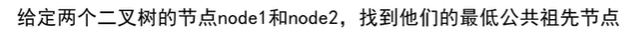

>   
> DE 的最低公共祖先是 B  
> EF 的最低公共祖先是 E

我的思路：

- 先用之前的动态规划的方式，将节点所在的路径上的节点串成链
- 如果 A 在 B 的链上，则 A 是公共祖先节点，反之亦然
- 否则遍历(其实可以直接遍历)长链上的节点，如果该节点能在短链上能找到，则该节点就是要找的节点

```js
function findCommonFather(root:TreeNode,nodeA:TreeNode,nodeB:TreeNode){
 let listA = process(nodeA) // 假设能找到这条链
 let listB = process(nodeB) // 假设能找到这条链
 let tempA = (listA.length>listB.length) listA:listB
 let tempB =(listA.length>listB.length) listB:listA
 // 从最长的链上找
 for(int i=0;i<tempA;i++){
  for(int j=0;j<tempB;j++){
   if(tempA[i]==tempB[j]) return tempA
  }
 }
 return null
}


class Info{
 constructor(public isFind,public list){}
}
// 动态规划，找到这条链

function process(node:TreeNode,val:number){
 if(!node) return null
 if(node.val==val){
  let list = []
  list.push(node)
  return list
 }
 let leftInfo = process(node.left)
 let rightInfo = process(node.right)
 let list = leftInfo.list || rightInfo.list
 if(list) list.push(node)
 return list
}
```

思路 2

- 依然是动态规划，问左右子树要答案
- 当前节点是要找的节点就返回当前节点
- 左右两边都没有找到就返回 null
- 左右两边任意一边找到了就返回这一边
- 左右两边都找到了就返回当前节点
- 
- 

```js
function findCommonFather(current, targetA, targetB) {
 if (current == null || current == targetA || current == targetB) {
  return current; // 自己就是要找的节点
 }
 resLeft = findCommonFather(current.left, targetA, targetB);
 resRight = findCommonFather(current.right, targetA, targetB);

 if (resLeft == null && resRight == null) {
  return null; // 左边右边都没有找到
 }
 if (resLeft && resRight) {
  return current; // 左边右边都找到了，则自己就是公共节点
 }
 return resLeft ? resLeft : resRight; // 左边找到就返回左边，右边找到就返回右边
}
```

### 如何找二叉树中某节点的后继节点

根据定义来说，某个节点的后继就是中序遍历时该节点的下一个节点

从结构上来说，一个节点的后继就是

- 如果这个节点有右子树，则后继就是右树上的最左节点
- 如果这个节点没有右子树，则其后继就要从其父节点找
  - 如果这个节点是父节点的右子树，则一直往上找，
  - 直到这个节点在父节点中是左子树，那么该节点的父节点就是后继
  - 

```ts
function findNext(node: TreeNode) {
 if (!node) return null;
 if (node.right) {
  let current = node.right;
  while (current.left) {
   current = current.left;
  }
  return current;
 }
 let current = node;
 let father = current.father;
 while (father && father.right == current) {
  current = current.father;
  father = father.father;
 }
 return father;
}
```

#### 二叉树的序列化和反序列化

```js
function EnCode(node:TreeNode,visiter){
 if(!visiter) visiter = new Array<string>()
 if(!node){
  res.push("#")
 }else{
  res.push(res.val + "")
 }
 EnCode(node.left,visiter)
 EnCode(node.right,visiter)
 return visiter
}
function DnCode(visiter){
 if(visiter.pop()=="#"){
  return null
 }
 let head = new TreeNode(visiter.pop())
 head.left = EnCode(visiter)
 head.right = EnCode(visiter)
 return head
}
```

#### 纸条折痕问题，微软面试题

将纸条反复对折 n 次，输出其折痕顺序

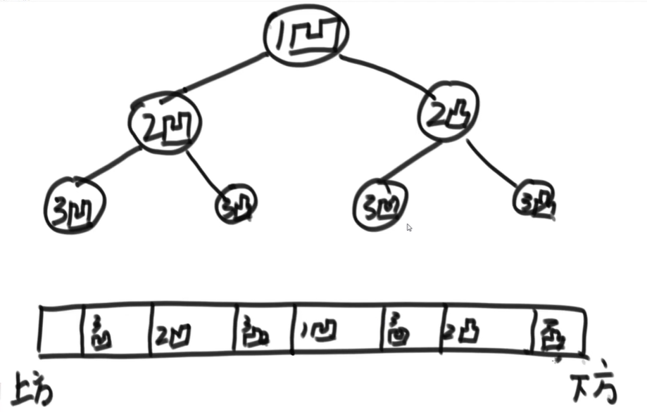


## 图

> 表达图的数据结构的方式比较多，但算法都是一样的  
> 可以选一种擅长的数据结构，把算法写熟练，碰到不同的数据结构，就写一个接口，把两种数据结构对应起来，这样就可以用旧的算法解新的题

### 图的模板代码

> 图的存储方式，邻接表 邻接矩阵

```java
package 左程云算法课初级班基础知识学习笔记._13_图的通用模板;

import java.util.HashMap;
import java.util.HashSet;

public class Graph {
 // 点集 其中键可以是任何数据结构，表示节点的值，
 // 但如果刷题，值一般是不重复的value，可以用数组来实现，会更快
 public HashMap<Integer, Node> nodes;

 // 边集合
 public HashSet<Edge> edges;

 Graph() {
  this.nodes = new HashMap<>();
  this.edges = new HashSet<>();
 }
}
```

```java

package 左程云算法课初级班基础知识学习笔记._13_图的通用模板;

import java.util.ArrayList;

public class Node {
 public int value;// 数据项，可以是int 可以是一个复杂的数据类型
 public int in;// 入度
 public int out;// 出度
 public ArrayList<Node> nexts;// 节点的下一跳（从自己所在位置出发的目的地）
 public ArrayList<Edge> edges;// 节点的边（发出的）

 Node(int value) {
  this.value = value;
  this.in = 0;
  this.out = 0;
  this.nexts = new ArrayList<>();
  this.edges = new ArrayList<>();
 }
}
```

```java
package 左程云算法课初级班基础知识学习笔记._13_图的通用模板;

public class Edge {
 public Node from;
 public Node to;
 public int weight;// 权重
 Edge(Node from, Node to, int weight) {
  this.from = from;
  this.to = to;
  this.weight = weight;
 }
}
```

### 从矩阵图结构转换到模板图结构

```java
package 左程云算法课初级班基础知识学习笔记._13_图的通用模板;

public class GraphCreater {
 /*
  * 将矩阵转换成Graph
  * matrix: [
  * * [fromNodeValue,toNodeValue,Weight],
  * * [fromNodeValue,toNodeValue,Weight]
  * ]
  */
 static Graph createGraphUseMatrix(Integer matrix[][]) {
  Graph graph = new Graph();
  for (int i = 0; i < matrix.length; i++) {
   Integer fromValue = matrix[i][0];
   Integer toValue = matrix[i][1];
   Integer weightVal = matrix[i][2];
   if (!graph.nodes.containsKey(fromValue)) {
    graph.nodes.put(fromValue, new Node(fromValue));
   }
   if (!graph.nodes.containsKey(toValue)) {
    graph.nodes.put(toValue, new Node(toValue));
   }
   Node fromNode = graph.nodes.get(fromValue);
   Node toNode = graph.nodes.get(toValue);
   Edge edge = new Edge(fromNode, toNode, weightVal);
   fromNode.out++;
   toNode.in++;
   fromNode.edges.add(edge);
   graph.edges.add(edge);
  }
  return graph;
 }
}

```

### 图的宽度优先遍历和宽度优先遍历

> 和二叉树的宽度有限遍历不同，二叉树没有回路，图可能有回路，算法要避免在回路中形成死循环

```java
package 左程云算法课初级班基础知识学习笔记._13_图的通用模板;

import java.util.HashSet;
import java.util.LinkedList;
import java.util.Queue;
import java.util.Set;
import java.util.Stack;

public class Utils {

 // 从一个点出发，做宽度优先遍历
 void wideFirstOrder(Node node) {
  if (node == null)
   return;

  Queue<Node> queue = new LinkedList<Node>();// 深度优先，使用队列实现先进先出
  Set<Node> set = new HashSet<Node>();// 集合，遍历过的点的集合，防止重复遍历

  queue.add(node);
  set.add(node);

  while (!queue.isEmpty()) {

   Node current = queue.poll();
   System.out.println(current.value);

   for (Node next : current.nexts) {// 依次将当前节点的下一跳加入到队列，等待遍历
    if (!set.contains(next)) {
     queue.add(next);// 如果没有遍历过才添加到队列
     set.add(next);
    }
   }
  }
 }

 // 从一个点出发 深度优先遍历
 void deepFirstOrder(Node node) {
  if (node == null)
   return;
  Stack<Node> stack = new Stack<Node>();
  Set<Node> set = new HashSet<Node>();
  stack.add(node);
  set.add(node);
  System.out.println(node); // 先处理这个节点
  while (!stack.isEmpty()) {
   Node current = stack.pop();
   for (Node next : current.nexts) {
    // 找到一个没有遍历的节点
    if (!set.contains(next)) {
     set.add(next);// 注册当前节点防止后续重复处理
     stack.add(current);// 入栈父节点，因为后续还要来遍历他的next节点，找到另一条没走过的路
     System.out.println(next); // 处理当前节点
     break;// 跳出当前循环，开始处理找到的这个没有遍历过的节点
    }
   }
  }
 }
}
```

### 拓扑排序

> 应用：编译流程的确定,编译文件的依赖关系的图是有向图，且应当没有循环依赖，也就是没有环  
> 

**原理**

- 先找到一个入度为 0 的节点 {应该说，先找到所有的}
- 处理这个节点｛处理所有的节点｝
- 在图中删除这个节点，更新图中其他节点的入度
- 于是图中就会出现另一个入度为零的节点
- 循环

```java
 static List<Node> topologyOrder(Graph graph) {

  HashMap<Node, Integer> inValMap = new HashMap<Node, Integer>(); // 记录所有节点入度的hash表
  Queue<Node> zeroinVal = new LinkedList<>(); // 入度为零的队列
  List<Node> result = new LinkedList<Node>();// 排序结果

  // 先把图中所有节点遍历，添加到表中
  for (Node node : graph.nodes.values()) {
   inValMap.put(node, node.in);// 记录所有节点的入度
   if (node.in == 0) {
    zeroinVal.add(node);// 记录入度为0的节点
   }
  }

  while (!zeroinVal.isEmpty()) {
   Node current = zeroinVal.poll();// 拿出队列中入度为0的节点，放入排序结果中
   result.add(current);
   for (Node next : current.nexts) {
    inValMap.put(next, inValMap.get(next) - 1); // 由于一个节点的出度就是另一个节点的入度,所以更新其他节点的入度就是在原来的基础上-1
    if (inValMap.get(next) == 0) {
     zeroinVal.add(next); // 如果更新后，入度为零，则添加到队列
    }
   }
  }
  return result;
 }
```

### 无向图拓扑排序

用于生成最小生成树的算法，

最小生成树，就是保证图中的所有的点都可以**直接或间接**的联通 但是联通后，边的**权重**是最小的


#### kruskal 算法

**过程**

- 有一个待排序图，另创建一个空图
- **从边的角度考虑**
- 按权重从小到大遍历所有的边
- 把这条边添加到空图中，但要检查并防止产生环
  - （因为形成环则表示添加的这条边后所连接的节点原先就已经能够间接的和其他部分联通了，图中的节点只需要保证间接连接）

实际上，就是根据权重从小到大依次用边来构建局部的图，新的边可能会连接两个局部的图，从而形成一个更大的图，也可能新边只是一条连接一个局部的图的内部两个节点的一条边

**如何判断添加边后是否形成环？**

- 需要使用并查集
- 先将图中所有的节点各自放入单独的集合中,并最后存进 hash 表，如： [A:{A} B:{B} C:{C} D:{D}]
- 如果添加的一条边是[from:A,to:B] 则先检测 A:{A}中是否有 B B:{B}中是否有 A,也就是判断 AB 是否在同一个集合中
- 如果不在，就合并两个集合，得到：[A:{A,B} B:{A,B} C:{C} D:{D}]
- 如果又添加一条边[from:B,to:C] 则可得到 [A:{A,B,C} B:{A,B,C} C:{A,B,C} D:{D}]
- 如果又添加一条边[from:C,to:D] 则可得到 [A:{A,B,C,D} B:{A,B,C,D} C:{A,B,C,D} D:{A,B,C,D}]
- 但如果又添加一条边：[from:C,to:A] 则会发现，C、A 所在的集合是{A,B,C},这意味着添加这条边就会形成环，所以不能添加
- 至此所有的节点都联通，且没有形成环

#### 简易并查集的实现

```java
class SimpleUnionFind {
  HashMap<Node, Set<Node>> map = new HashMap();

  void init(Collection<Node> ndoes) {
   for (Node node : ndoes) {
    Set<Node> set = new HashSet<Node>();
    set.add(node);
    map.put(node, set);
    map.put(node, set);
   }
  }

  boolean isSameSet(Node n1, Node n2) {
   // 判断两个节点是否在同一个集合
   return map.get(n1) == map.get(n2);
  }

  void union(Node n1, Node n2) {
   // 合并两个节点所在的集合
   Set<Node> setA = map.get(n1);
   Set<Node> setB = map.get(n2);

   for (Node node : setB) {
    setA.add(node);// 将集合B中的节点放入集合A
    map.put(node, setA);// 节点现在在集合A中，所以从新调成其指向
   }
  }
 }
```

#### K 算法的具体实现

```java
 // KruskalMST算法实际就是在计算一个无向图要保证全联通，实际需要保留哪些边，所以返回值是边的集合
 public static Set<Edge> KruskalMST(Graph graph) {
  Set<Edge> result = new HashSet<Edge>();// 边的集合
  SimpleUnionFind unionFind = new SimpleUnionFind();// 简易并查集
  PriorityQueue<Edge> heap = new PriorityQueue<Edge>(new Comparator<Edge>() {
   // 优先级队列就是堆，这里要传递一个比较器。
   public int compare(Edge o1, Edge o2) {
    return o1.weight - o2.weight;// o1-o2 就是降序排序，按照权重排序
   };
  });
  unionFind.init(graph.nodes.values());// 初始化简易并查集
  heap.addAll(graph.edges);// 把所有边添加到堆中，这样堆顶就是权重最小的边
  while (!heap.isEmpty()) {
   Edge edge = heap.peek();
   if (!unionFind.isSameSet(edge.from, edge.to)) {
    // 不在同一个集合中则说明添加这条边不会产生回路
    unionFind.union(edge.from, edge.to);// 合并两个集合
    result.add(edge);// 添加这条边
   }
  }
  return result;
 }
```

#### prim 算法


**流程**

- 随便选一个节点，如 A
- 标记 A 为已经处理，将 A 的所有边放入堆中，然后拿出权重最低的边也就是 1
- 1 是链接 AC 的，A 已经处理，C 未处理，所以将 C 标记为处理，然后将 C 的所有边放入堆中，再次拿出权重最低的边，将拿到 1，但是 1 是连接 AC 的，而 AC 已经标记为处理过了，所以再次拿出一条边，这将是 4，4 连接 CF,C 处理过了，F 未处理，标记 F 为已处理，然后将 F 的边入堆，然后再次拿出权重最小的边，这将是 2
- 循环往复。

```java
 // prim算法是站在节点的角度考虑，返回的值是这个图生成最小生成树所需的边的集合
 public static Set<Edge> PrimMST(Graph graph) {
  Set<Edge> result = new HashSet<Edge>();
  Set<Node> nodeSet = new HashSet<Node>();// 用于判断是否是已经联通过的节点
  PriorityQueue<Edge> heap = new PriorityQueue<Edge>(new Comparator<Edge>() {
   @Override
   public int compare(Edge o1, Edge o2) {
    return o1.weight - o2.weight;
   }
  });

  // for循环是为了防止出现森林的情况，就是说图中存在两片独立而不联通的区域
  for (Node node : graph.nodes.values()) {
   if (!nodeSet.contains(node)) {
    nodeSet.add(node);// 添加节点到集合中表示处理过了
    heap.addAll(node.edges); // 添加所有发出的边
    while (!heap.isEmpty()) {
     for (Edge edge : heap) {// 从堆中拿出权重最低的边
      if (!nodeSet.contains(edge.to)) {// 仅当目的节点未被处理时
       nodeSet.add(edge.to);
       result.add(edge);// 记录这条边
       heap.addAll(edge.to.edges);// 添加该节点发出的所有边。
      }
     }
    }
   }
  }

  return result;
 }
```

### 迪杰斯特拉算法


```java


 // 求一个节点到图中其他节点的最短距离，
 static HashMap<Node, Integer> dijkstra(Node node) {
  // 记录图中其他节点到node的最短距离
  HashMap<Node, Integer> distanceMap = new HashMap<Node, Integer>();
  // 更新完毕的节点,已经使用最短路径到达的节点
  HashSet<Node> arrivedNodeSet = new HashSet<Node>();
  // node 到 node 的距离是0
  distanceMap.put(node, 0);
  // 找到到node距离最小路径的节点
  Node minNode = getMinDistanceNode(distanceMap, arrivedNodeSet);
  while (minNode != null) {
   Integer distance = distanceMap.get(minNode);// 当前节点到node的距离
   for (Edge edge : minNode.edges) {// 遍历该节点的边
    Node toNode = edge.to;// 获取边的目的节点
    if (!distanceMap.containsKey(edge.to)) {
     // 如果是一个新的节点，则在distanceMap中添加一条记录，距离就是distance+边的权重
     distanceMap.put(toNode, distance + edge.weight);
    }
    // 更新距离，如果从node到这些节点的路径变得更短了就更新
    distanceMap.put(toNode, Math.min(distanceMap.get(toNode), distance + edge.weight));
   }
   arrivedNodeSet.add(minNode);// 处理完毕，让下次不会被选中
   minNode = getMinDistanceNode(distanceMap, arrivedNodeSet);
  }
  return distanceMap;
 }
 // 获取最短路径的节点，但排除excldeSet集合
 static Node getMinDistanceNode(HashMap<Node, Integer> distanceMap, Set<Node> excludeSet) {
  Integer min_distance = Integer.MAX_VALUE;
  Node min_node = null;
  for (Entry<Node, Integer> entry : distanceMap.entrySet()) {
   Node node = entry.getKey();
   Integer distance = entry.getValue();
   if (!excludeSet.contains(node) && distance < min_distance) {
    min_node = node;
    min_distance = distance;
   }
  }
  return min_node;
 }
```

## 前缀树

可以很方便的根据字符串前缀查询。


```java
package 左程云算法课初级班基础知识学习笔记._14_前缀树;


public class TrieTree {
 class Node {
  int pass = 0;// 路径上经过该节点几次
  int end = 0;// 以该节点结尾几次
  Node[] nexts = new Node[26];// 经典写法，可以认为是26个字母26个方向、路径，子节点的指针，初始为空
  // HashMap<Character,Node> nexts = new HashMap<Character,Node>(); //
  // 如果字符不止26个可以用hashMap、HashSet
 }

 Node root = new Node();// 根节点

 // 插入一个字符串记录，即使是空串
 void insert(String string) {
  char[] chars = string.toLowerCase().toCharArray();
  Node current = root;
  current.pass++;
  for (int i = 0; i < chars.length; i++) {
   int direction = chars[i] - 'a';
   if (current.nexts[direction] == null)// 如果路径不存在则新建
    current.nexts[direction] = new Node();
   current.nexts[direction].pass++;// 经过此节点的串的个数++
   current = current.nexts[direction];// 跳到下一个
  }
  current.end++;// 结尾
 }

 // 删除字符串
 void delete(String string) {
  if (search(string) != 0) {
   char[] chars = string.toLowerCase().toCharArray();
   Node current = root;
   current.pass--;
   for (int i = 0; i < chars.length; i++) {
    int direction = chars[i] - 'a';
    current.nexts[direction].pass--;
    if (current.nexts[direction].pass == 0) {
     current.nexts[direction] = null;// 直接丢弃后续的节点引用
     return;
    }
    current = current.nexts[direction];// 跳到下一个
   }
   current.end--;// 字符串结束
  }
 }

 // 查询一个字符串插入了几次，包括空串
 int search(String string) {
  char[] chars = string.toLowerCase().toCharArray();
  Node current = root;
  for (int i = 0; i < chars.length; i++) {
   int direction = chars[i] - 'a';
   if (current.nexts[direction] == null) {
    // 查到一半路没了
    return 0;
   }
   current = current.nexts[direction];
  }
  return current.end;// 以此节点为截止的字符串个数。
 }

 // 查询以【perfix】开头的字符串的个数
 int searchPrefix(String prefix) {
  char[] chars = prefix.toLowerCase().toCharArray();
  Node current = root;
  for (int i = 0; i < chars.length; i++) {
   int direction = chars[i] - 'a';
   if (current.nexts[direction] == null) {
    // 查到一半路没了
    return 0;
   }
   current = current.nexts[direction];
  }
  return current.pass;// 经过此节点的串的个数
 }

}

```

## 贪心算法


### 解题套路


### 题目 1


> **思路**
>
> - [ ] 按会议开始时间排序
> - [ ] 按会议时间长短排序
> - [x] 按会议结束时间排序
>   - 【因为实际上会议结束时间早的，开始时间也早，会议持续时间也短。】

 

### 题目 2

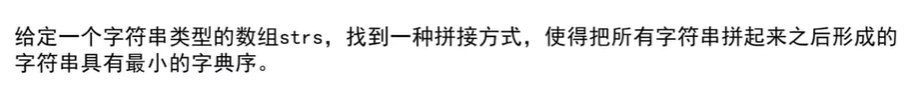 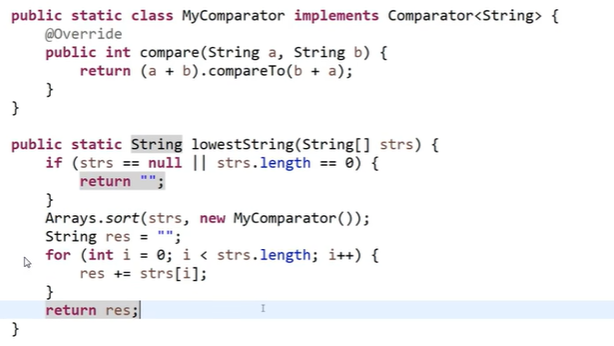

### 题目 3

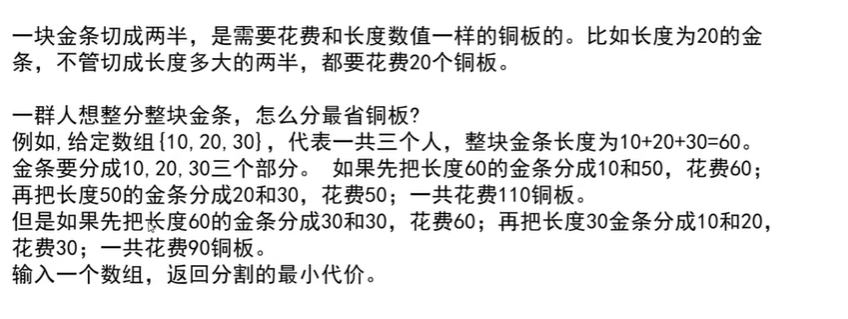

**思路**

- 先将所有项目根据成本放入小根堆，
- 在小根堆中弹出所有当前能够投资的项目，根据利润放入另一大根堆。
- 大根堆堆顶，就是当前能够投资且利润最高的项目。
- 说白了，就是打怪升级的思路，先找出能打得过的怪物
- 再从能打的过的怪物中找出经验值（回报）最高的怪物

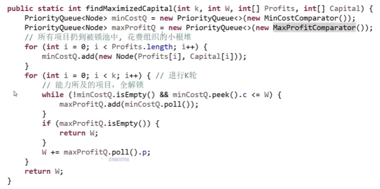

### 题目 4

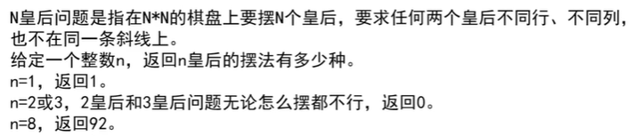

> **思路**
>
> - 用暴力递归，按行落子，每次落一个子，落子前检查落子是否合法，如是否共列，共斜线

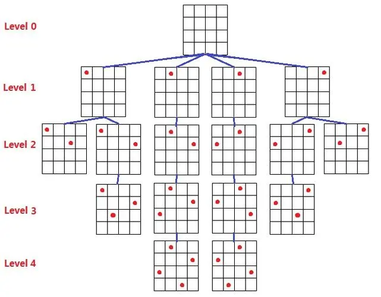


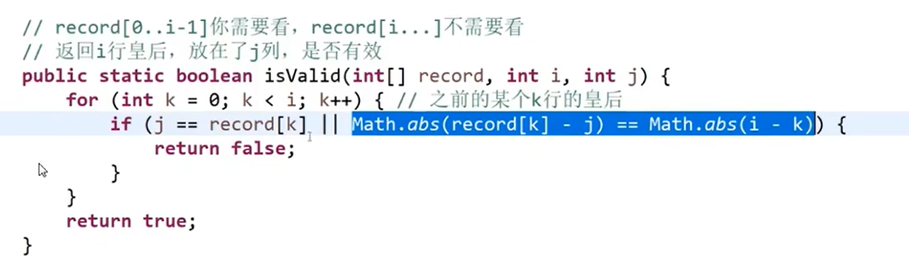

**使用位运算优化版本**

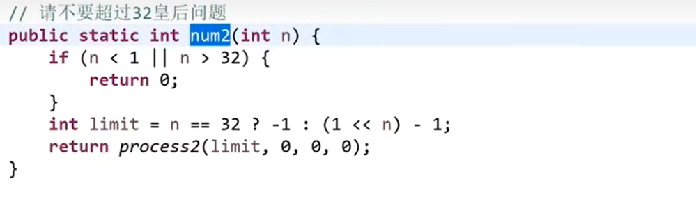


## 暴力递归【动态规划的基础】


### 汉诺塔问题

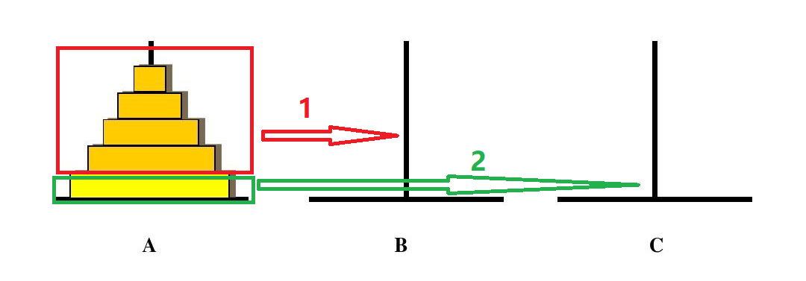

要把一堆圆盘从 from 移动到 to,首先要把最上面的 n-1 个圆盘移动到 other,然后才能把最底下的圆盘移动到 to,然后就可以把 other 上的圆盘移到 to 上。 在这个过程中，把 n-1 个圆盘移动到 other 也是相同的操作，但是对于 n-1 个圆盘来说，他的 from、to、other 便不一定是原来的了，而是：from' = 原 from;to' = 原 other;other = 原 to,

```js
function hannuota(i, from, to, other) {
 if (i == 1) console.log(`move ${i} from ${from} to ${to}`);
 else {
  hannuota(i - 1, from, other, to); // 先把之上的圆盘全部移到other
  console.log(`move ${i} from ${from} to ${to}`); // 再把最底下的最大的圆盘移到目标位置to上
  hannuota(i - 1, other, to, from); // 再把暂时放在other上的圆盘放到to上
 }
}
```

### 打印输出字符串所有子串

**思路**

- 遍历字符串的所有字符
- 对于任何一个字符，都给出包含和不包含的两条路径
- 最终会形成一个完全二叉树


更省空间的算法


### 打印字符串的全排列


```js
function process(char[] chars,int pos,Array<string> result) {
 if(pos==chars.length){
  result.push(new string(chars));
  return;
 }
 let doneSet = new Set<char>();
 for(int i=pos;i<chars.length;i++){
  if(!doneSet.contains(chars[i])){
   doneSet.add(chars[i]);// 防止重复
   exchange(chars,pos,i);
   process(chars,pos+1,result);
   exchange(chars,pos,i);
  }
 }
}
```

### 纸牌游戏


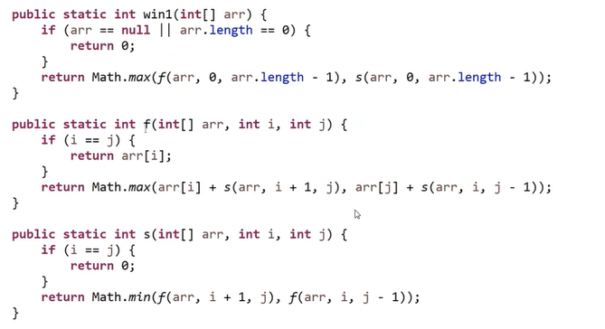

### 逆序栈

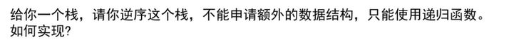


```js
function reverseStack(stack, targetPos, newVal) {}
```

### 字符串转换问题

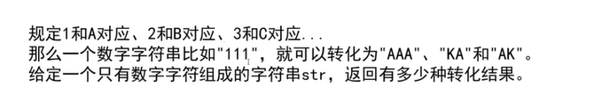

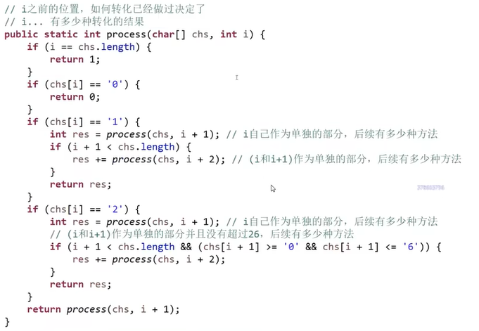

### 背包问题


