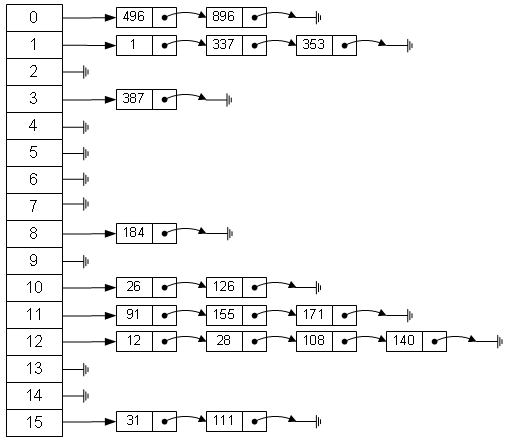

# 左程云算法课【提升班】学习笔记

## 目录

- [左程云算法课【提升班】学习笔记](#左程云算法课提升班学习笔记)
  - [目录](#目录)
  - [哈希函数与哈希表](#哈希函数与哈希表)
    - [经典哈希函数的特征](#经典哈希函数的特征)
    - [对哈希函数特征的推广](#对哈希函数特征的推广)
    - [经典 hash 表的实现](#经典-hash-表的实现)
    - [bitMap 位图的简易实现](#bitmap-位图的简易实现)
    - [BloomFilter(布隆姆过滤器)的实现](#bloomfilter布隆姆过滤器的实现)
    - [一致性 hash](#一致性-hash)
      - [要解决的问题](#要解决的问题)
      - [一致性 hash 的基本原理](#一致性-hash-的基本原理)
      - [一致性 hash 存在的问题和解决方法](#一致性-hash-存在的问题和解决方法)
  - [并查集](#并查集)
  - [MKP 算法](#mkp-算法)
  - [Manacher 算法](#manacher-算法)
  - [滑动窗口](#滑动窗口)
  - [单调栈](#单调栈)

## 哈希函数与哈希表

<details>
<summary>2^n</summary>

|    背！    |
| :--------: |
|   2^0=1    |
|   2^1=2    |
|   2^2=4    |
|   2^3=8    |
|   2^4=16   |
|   2^5=32   |
|   2^6=64   |
|  2^7=128   |
|  2^8=256   |
|  2^9=512   |
| 2^10=1024  |
| 2^11=2048  |
| 2^12=4096  |
| 2^13=8192  |
| 2^14=16384 |
| 2^15=32768 |
| 2^16=65536 |

</details>

### 经典哈希函数的特征

- 定义域是无穷的，
  - 如：任意长度的字符串
- 值域是有限的，
  - 如 MD5() 值域范围：0~2^{64}-1
  - SH1() 值域范围：0~2^{128}-1128 个二进位 => 0~16^32-1 也是就 32 个 16 进制字符
- 相同的输入得到相同的输出 (Same in Same out)
- 不同的输入可能得到相同的输出 哈希碰撞
  - 因为定义域无穷，值域有限，必然导致碰撞，只是几率很小而已
- 值域特征：离散、均匀
  - 对于一些有规律的输入，通过 hash 函数将得到一些无规律的输出，这些输出是**离散的**、**无规律的**、**均匀分布的**。

### 对哈希函数特征的推广

如果一个 hash 函数的定义域为 I,值域为 O,将 hash 函数的输出取模 N 后,得到结果的集合 K∈[0,N-1]

由于 hash 函数的特性使得其输出在 O 上离散且均匀分布，那么取模 N 后，其结果也会在集合 K 上离散且均匀分布

<details>
<summary>相关题目</summary>

**题目**

有一组数、共有 40 亿个数，要求拿到其中出现最多次数的数。限制内存 1G.

**经典解法**

使用 hash 表，顺序遍历这 40 亿个数，统计每个数出现的次数，然后输出出现最多次的数。

存在问题：hash 表的一条记录中，key 占用 4B value 占用 4B,共 8B,如果遇到最坏情况，40 亿个数是不重复的，则需要 320 亿字节，即 32GB 存储空间。

**利用 hash 函数特征的解法**

总的思路就是：先将 40 亿个数放到 100 个桶中，然后在到这 100 个桶中分别统计其中出现最多次数的数的次数，找出出现次数最多的数。

做法就是，对于 40 亿个数，先对其中每一个数做 hash 运算，得到结果后取模 100，结果为 0 则将这个数放入 0 号桶。

由于 hash 函数的特性，对于相同的数，一定会落入相同的桶中，对于不同的数，可能会落入相同的桶，也可能不会，但会在 100 个桶中离散、均匀分布。

这个过程中，一定会出现 hash 碰撞，就比如说，数字 5 经过计算后放入 3 号桶 数字 123 经过计算后，也是放入 3 号桶。但这种 hash 碰撞并不会导致问题。

```ts
// 伪代码
function main(){
 list = [40亿个数];
 buckets:Array<Array> = [100个桶];

 for(var i =0;i<list.lenght;i++){
  k = hash(list[i])%100
  buckets[k].push(list[i]);
 }

 res = 0;
 for(var i = 0; i<buckets.length;i++){
  Map map = new HashMap();
  for(var j=0;j<buckets[i].length;j++){
   num = buckets[j][j];
   map.set(num,map.get(num)+1);// 统计
   if(map.get(num)>map.get(res)){
    res=num;// 记录出现次数最多的数
   }
  }
 }
}
```

</details>

### 经典 hash 表的实现



**插入**

- 要插入一个数 X 或者要插入一条记录、键值对：{key:X,value:12345}
- 先计算`p=hash(X)%hash表长`
- 那么 x 就存放在表的 p 位置
- 如果有另外一个数 Y 通过计算发现也要存放在 p 的位置,则用链表的方式存储。

**查找**

- 要查找 X,
- 先计算`p=hash(X)%hash表长`
- 那么 x 就存放在表的 p 位置
- 遍历表的 p 位置所存储的链表，找到 X

**扩容**

- **为什么扩容**
  - 因为`hash()%hash表长`的结果离散、均匀分布的
  - 所以当插入 N 个记录后，hash 表中的每个链表的长度的平均值应该是`N/hash表长`
  - 当 N 特别大或 hash 表长特别小时，查询效率就会变低。
- **如何扩容**
  - 创建一个新的 hash 表，比如说新的表长是之前的 2 倍
  - 遍历原表元素，然后把原 hash 表中的元素依次插入到新表中
    - `[时间复杂度O(N)]`
    - 在这个过程中，要计算`p=hash(X)%新hash表长`
      - `[时间复杂度O(1)]`
    - 把这个元素插入到`HashTable[p]`位置的链表中，
      - `[时间复杂度O(1)]`
      - 如果链表的长度为 k 则时间复杂为 O(K) 如能保证 k 很小，则可认为时间复杂度为 O(1)
      - 实际来说，链表的长度最大为`N/新hash表长`。
- **扩容的时间复杂度、单次插入操作的时间复杂度**
  - 已经插入了 N 和元素，问经过了几次扩容？
    - 可以认为 hash 表的长度一开始为 2，链表的长度限制在 k=2，
    - 则因扩容导致的表长度的变化为 [ 2 4 8 16 32 64 .... N ]
    - 所以经过了 log_2(N)次扩容
    - 如果限制 k=N/表长，则扩容次数虽然小于 logN，
    - 但是级别也是 logN，也就是说还是认为，经过 O(logN) 次扩容
    - 其中每次扩容的代价是 O(N)
    - 所以总的扩容代价为 O(NlogN)
    - 所以均摊到每一次插入操作上，单次扩容的代价为 O(logN)
    - 所以**理论上**，单次插入操作的时间复杂度为 O(logN).
  - **为什么可以认为实际上单次的插入操作时间复杂度为 O(1)?**
    - 虽然单次插入操作导致的扩容操作的的时间复杂度为 O(logN),
    - 但是可以把链表长度限制 K 定的很大，使其扩容次数远远小于 O(logN),
    - 使其趋向于一个常数，也就是趋向于 O(1)
- JVM 的离线扩容技术
  - 在 java 虚拟机中，虚拟机检测到 hash 表中的链表长度太长时，会自动重建一个 hash 表，
  - 且不占用户的在线资源，重建完毕后，原 hash 表的指针指向重建好的 hash 表地址。

<details>

<summary>题目：利用HashTable设计RandomPool</summary>


```java
import java.util.HashMap;
import java.util.Map;

public class 利用HashTable设计RandomPool {
 public static void main(String[] args) {
  RandomPool rPool = new RandomPool();
  rPool.insert("123");
  rPool.insert("456");
  rPool.insert("789");
  rPool.insert("xxxxxx");
  rPool.insert("101112");
  rPool.delete("xxxxxx");
  for (int i = 0; i < 10; i++) {
   System.out.println(rPool.getRandom());
  }
 }
}

class RandomPool {
 // 记录元素个数
 int size = 0;
 // 为了删除一个元素方便
 Map<String, Integer> ValueToIdx = new HashMap<>();
 // 为了等概率随机获取一个元素方便
 Map<Integer, String> IdxToValue = new HashMap<>();

 void insert(String val) {
  if (ValueToIdx.containsKey(val)) {
   return;// 已经存在
  }
  ValueToIdx.put(val, size);
  IdxToValue.put(size, val);
  size++;
 }

 // 随机获取一个元素
 String getRandom() {
  if (size == 0)
   return null;
  // random-> [0,1)
  // size -> [0,length]
  // rdmIdx = random * size
  // rdmIdx-> [0,length-1]
  Integer rdmIdx = (int) (Math.random() * (double) size);
  return IdxToValue.get(rdmIdx);
 }

 void delete(String val) {
  if (!ValueToIdx.containsKey(val)) {
   return;// 不存在
  }
  swap(ValueToIdx.get(val), size - 1);// 把要删除的元素和最后一个交换
  size--;// size-- 即可
 }

 private void swap(Integer I, Integer J) {
  if (I != J &&
    0 <= I && I < size &&
    0 <= J && J < size) {
   String tempI = IdxToValue.get(I);
   String tempJ = IdxToValue.get(J);

   IdxToValue.put(I, tempJ);
   ValueToIdx.put(tempJ, I);

   IdxToValue.put(J, tempI);
   ValueToIdx.put(tempI, J);
  }
 }
}
```

</details>

### bitMap 位图的简易实现

```java
import java.util.BitSet;

public class bitMap的实现 {
 public static void main(String[] args) {
  bitMap bMap = new bitMap(64);
  for (int i = 0; i < bMap.lengthOfBit; i++) {
   bMap.setBit(i, i%2==0? true:false);
  }
  System.out.println(bMap.toString());
  //输出 [1010101010101010101010101010101010101010101010101010101010101010]
 }
}

class bitMap {
 long[] data;// long 4字节，32bit
 int lengthOfBit;
 int capacityOfData;

 bitMap(int lengthOfBit) {
  this.lengthOfBit = lengthOfBit;
  capacityOfData = (int) Math.ceil(lengthOfBit / 32d);
  data = new long[capacityOfData];
 }

 void setBit(int idxOfBit, boolean flag) {
  if (0 <= idxOfBit && idxOfBit < lengthOfBit) {
   int index = idxOfBit / 32;
   int offset = idxOfBit % 32;
   long mask = 1L << offset;
   if (flag) {
    data[index] = data[index] | mask;
   } else {
    data[index] = data[index] & ~mask;
   }
  }
 }

 boolean getBit(int idxOfBit) {
  if (0 <= idxOfBit && idxOfBit < lengthOfBit) {
   int index = idxOfBit / 32;
   int offset = idxOfBit % 32;
   long mask = 1L << offset;
   return (data[index] & mask) != 0;
  }
  return false;
 }

 @Override
 public String toString() {
  StringBuilder sb = new StringBuilder();
  sb.append('[');
  for (int i = 0; i < lengthOfBit; i++) {
   if (getBit(i)) {
    sb.append("1");
   } else {
    sb.append("0");
   }
  }
  sb.append(']');
  return sb.toString();
 }
}
```

### BloomFilter(布隆姆过滤器)的实现

> 作用，判断一个网址是否在黑名单中

<details>
<summary>要解决的问题</summary>

**题目 1**

考虑有一个 URL 黑名单，内含 100 亿个 URL 地址，最大长度为 64B,现在希望判断一个 URL 是否在这个黑名单中，且希望时间复杂度为 O(1),如何实现？

**直观解法：**

用 HashSet 实现,每条记录占 64B,一共 100 亿条记录，

**总共占用 6400 亿字节，即 6400,000,000,000B==6400GB** 可以发现这是极其占用空间的算法。

**题目 2**

有一个爬虫程序，有 1000 个线程分别在运行，其中每个线程所做的事就是递归的爬取一个网站中出现的链接，

要求 1000 个线程不能重复爬取已经爬取过的网页，如何实现？

</details>

**原理**

- 用多个 hash 函数来计算这个 URL 的特征
- 用位图来记录这些特征。

**实现**

- 创建一个长度为 N 的 bitMap
- 实现 K 个不同的 Hash 函数
- 有一个网址字符串：S
- **插入操作**
  - 插入字符串 S
  - 使用 K 个 hash 函数分别对 S 做运算，得到特征[t1,t2,t3,...,tk]
    - t_1 = hash_1(S)%N
    - t_2 = hash_2(S)%N
    - ....
    - t_k = hash_k(S)%N
  - 然后在 bitMap 中记录这个特征、或者说着色
  - bitMap.set(t_1,true)
  - bitMap.set(t_2,true)
  - bitMap.set(t_3,true)
  - ...
  - bitMap.set(t_k,true)
- **查询操作**
  - 查询字符串 S 是否在记录中
  - 使用 K 个 hash 函数分别对 S 做运算，得到特征[t1,t2,t3,...,tk]
    - t_1 = hash_1(S)%N
    - t_2 = hash_2(S)%N
    - ....
    - t_k = hash_k(S)%N
  - 然后在 bitMap 中查询这个特征,得到结果 [r1,r2,r3,...,rk]
    - r1 = bitMap.get(t_1)
    - r2 = bitMap.get(t_2)
    - r3 = bitMap.get(t_3)
    - r4 = ...
    - rk = bitMap.get(t_k)
  - 如果这个结果中全是 true,则大概率 S 在这个记录中
- **存在的问题**
  - 从其原理可以看出，只能做添加操作，不能做删除操作。
  - 插入过的记录，一定能在位图中查找到
    - 插入的一条记录会导致在位图中着色，所以执行查询操作时，用同样的算法获取到的位图依然是着色过的。
  - 没插入过的记录，依然有可能会在位图中查找到，
    - 比如说插入了无数条记录，把位图全部着色了，那么查询任何一个字符串是否在位图中存在，结果都是存在。
- **参数的关系**
  - N 为样本量、P 为失误率、M 为位图的长度、K 为 Hash 函数的个数
  - M 和 P 的关系:(N、K 固定时)
    - 如果 M 特别小，那么失误率 P 就会很大
    - 如果 M 特别大，那么失误率 P 就会很小
    - 
  - K 和 P 的关系:(N、M 固定时)
    - K==1 时，P 失误率可能会达到一个不高不低的水平
    - K 很大时，又会把位图快速填满，使其急速耗尽，导致 P 失误率又变高。
    - 
- **参数的确定**
  - N 样本量
  - P 预期失误率
  - M 位图 bit 数
  - K Hash 函数个数
  - M K 的理论值
    - $M_{\text{理论值}}=-\frac{N \ln{P}}{(\ln{2})^2}$
    - $K_{\text{理论值}}=\ln{2}*\frac{M}{N}\approx{0.7 \frac{M}{N}}$
  - M K P 的实际值计算
    - $M_{\text{实际值}} = M_{\text{理论值}}$按字节取整
      - 或者比如说理论值为 26GB 直接取 28GB,这可以极大降低失误率
    - $K_{\text{实际值}} = ceil(K_{\text{理论值}})$
    - $P_{\text{实际值}}=(1-e^{-\frac{N K_{\text{实际值}}}{M_{\text{实际值}}}})^{K_{\text{实际值}}}$
  - **计算案例**
    - (如果 N==100 亿，P=0.0001，万分之 1，那么 M\_理论值/8==26GB)
    - 当 M*实际值取=28GB,K*实际值=13,P\_实际值=十万分之 6，这将远远小于预期失误率。

**代码实现和测试**

```java
import java.util.Arrays;
import java.util.BitSet;

/**
 * BloomFilter的实现
 */
public class BloomFilter的实现 {
 // 测试
 public static void main(String[] args) {
  BloomFilter bf = new BloomFilter(10000, 0.00001);

  System.out.println(bf);

  for (int i = 0; i < 10000; i++) {
   bf.put(i + "");
  }
  System.out.println("添加记录完毕");

  // System.out.println(bf);

  for (int i = 0; i < 10000; i++) {
   if (!bf.mayContain(i + "")) {
    System.out.printf("bug: 本应该存在，但 %d 不存在\n", i);
   }
  }
  System.out.println("查询已添加的记录完毕");

  for (int i = 10000; i < 900000; i++) {
   if (bf.mayContain(i + "")) {
    System.out.printf("失误，本不该存在，但 %d 存在\n", i);
   }
  }
  System.out.println("查询未添加的记录完毕");
 }
}

/**
 * BloomFilter
 */
class BloomFilter {

 private int N;// 存储的元素个数
 private int K;// hash函数个数
 private int M;// bit数
 private BitSet bitMap;// bitMap
 private int[] primes;// hash函数种子，质数

 BloomFilter(int N, double P_falseRate) {
  // N为要存取的元素个数，
  // P_falseRate 为预期失误率
  if (N <= 0 || P_falseRate <= 0)
   new Error("N must >= 1,falseRate must > 1");
  /*
   * Given:
   *
   * n: how many items you expect to have in your filter (e.g. 216,553)
   * p: your acceptable false positive rate {0..1} (e.g. 0.01 → 1%)
   * we want to calculate:
   *
   * m: the number of bits needed in the bloom filter
   * k: the number of hash functions we should apply
   * The formulas:
   *
   * m = -n*ln(p) / (ln(2)^2) the number of bits
   * k = m/n * ln(2) the number of hash functions
   */

  // 根据公式计算需要分配的字节数
  double M = -N * Math.log(P_falseRate) / (Math.pow(Math.log(2), 2));
  // 根据公式计算需要的Hash函数个数
  double K = M / N * Math.log(2);

  this.N = N;
  this.M = (int) Math.ceil(M);
  this.K = (int) Math.ceil(K);
  this.bitMap = new BitSet(N);
  this.primes = PrimesGenerator.getPrimes(this.K);
 }

 void put(String val) {
  for (int i = 0; i < primes.length; i++) {
   bitMap.set((int) ((HashFunction.hash(val, primes[i]) % M)), true);
  }
 }

 boolean mayContain(String val) {
  for (int i = 0; i < primes.length; i++) {
   if (!bitMap.get((int) ((HashFunction.hash(val, primes[i]) % M))))
    return false;
  }
  return true;
 }

 @Override
 public String toString() {
  return "BloomFilter [N=" + N + ", K=" + K + ", M=" + M + ", bitMap=" + bitMap + ", primes="
    + Arrays.toString(primes) + "]";
 }

}

// 质数生成器
class PrimesGenerator {
 static int[] getPrimes(int N) {
  if (N <= 0)
   return null;
  int[] res = new int[N];
  res[0] = 3;
  for (int idx = 1; idx < res.length; idx++) {
   for (int num = res[idx - 1] + 1; true; num++) {
    if (isPrime(num)) {
     res[idx] = num;
     break;
    }
   }
  }
  return res;
 }

 private static boolean isPrime(int num) {
  double maxDivisor = Math.sqrt(num);
  for (int divisor = 2; divisor <= maxDivisor; divisor++) {
   if (num % divisor == 0)
    return false;
  }
  return true;
 }
}

// hash函数
class HashFunction {
 static long hash(String str, int basePrimeSeed) {
  long res = 0;
  for (Byte val : str.getBytes()) {
   res = res * basePrimeSeed + val % basePrimeSeed;
  }
  return res;
 }
}
```

上述代码执行结果

```bash
BloomFilter [N=10000, K=17, M=239627, bitMap={}, primes=[3, 5, 7, 11, 13, 17, 19, 23, 29, 31, 37, 41, 43, 47, 53, 59, 61]]
添加记录完毕
查询已添加的记录完毕
失误，本不该存在，但 100734 存在
失误，本不该存在，但 100735 存在
失误，本不该存在，但 195801 存在
失误，本不该存在，但 195802 存在
失误，本不该存在，但 195803 存在
失误，本不该存在，但 624564 存在
失误，本不该存在，但 624565 存在
失误，本不该存在，但 624566 存在
查询未添加的记录完毕
```

### 一致性 hash

> 一致性 hash 是现在分布式技术的底层原理

#### 要解决的问题

<details>
<summary>查看详情</summary>

**看一个实际场景**

- 业务逻辑层是几台等效的电脑，运行的是相同的业务逻辑层代码
- 业务逻辑层的负载均衡也许是使用 Nginx 反向代理实现的，请求具体交个谁处理，都是做相同的逻辑处理，所以他们是等效的。
- 持久层（或者是一些临时缓存）是三台数据库服务器，这三台服务器上存的东西是不一样的，他们不等效。
- 比如要存一个键值对数据，要实现持久层的负载均衡，
- 那么就要知道把这个数据存到哪一台服务器上
- 经典的做法是：
  - 计算`k=hash(要存的数据的键)%持久层服务器数`
  - 这样就可以把数据存在第 k 台服务器上。
- 查询操作
  - 查询的时候用相同的算法计算 k
  - 然后就到第 k 台服务器上去查找数据
- 

> **现在的问题是，现在公司业务扩展，要在持久层增加【或减少】一台服务器，那么就要迁移数据，这就要将原来的三台上存储的所有的数据，从新计算 `k = hash(key)%当前服务器数量`，然后重新存到相应的第 K 台服务器上。这种做法的代价显然是极高的，因为要调整所有数据的归属关系。**

</details>

#### 一致性 hash 的基本原理

**数据的存储**

- 假设 hash 使用的是 md5 算法，该算法的值域在$[0,2^{64}-1]$
- 把该值域看成一个环。
- 使用机器的唯一特征，如主机名、ip 地址、mac 地址来计算 hash，得到 M1 M2 M3, 把他们画到环上。
- 如果要存储一个数据{key:V,value:"???"},
- 则使用值域相同的算法计算 hash(V)，画到环上，
- 找到离这个位置顺时针最近的位置的主机，把数据存到这台机器上

<div class="this" style="width:50%">

 

</div>

**数据的查询**

- 查询和数据的存储一样，
- 使用数据 V 计算 hash(V)，
- 然后在环上找到最近的主机
- 向这台主机请求查询数据

**添加主机**

- 假设新添加的一台主机，通过其唯一属性计算 M4 = hash(主机唯一标识),
- 然后发现 M4 在环中的位置位于 M2 和 M3 之间，
- 那么只需要把 M3 上的所有数据中，数据的 hash 运算结果在[M2,M4]之间的数据，将这部分数据拷贝到 M4 上即可。
- 

**移除主机**

- 以上述添加主机后的状态为例，
- 移除 M4 主机，只需要把 M4 上的所有数据保存到 M3 中即可。

#### 一致性 hash 存在的问题和解决方法

**问题 1**

只有在主机数很多的情况下，这些主机的位置才会表现出均匀落在环上，

当初始的主机数很少的情况下，初始主机的位置并不一定会均匀的落在环上

所以这就会导致负载不均衡。

**问题 2**

即便 `问题1` 解决了，也就是说初始的主机位置正好均分了环，但当移除或添加主机后，就不均分环了，也就是说马上就会负载不均衡。

**问题的解决：虚拟节点**

- 假如有 3 台主机，M1、M2、M3
- 为这三台主机分别分配 1000 个字符串，每个字符串都可以通过 MD5 算法计算出一个在环上的虚拟节点位置，这些位置均匀分布。
- 用这些虚拟节点去占领环上的区间。
- 只需要在底层写一个简单的接口，来确定存储和查询操作时，到底把请求转交给谁
- 现在，整个环由 3000 个虚拟节点均匀的抢占，即便移除一台机器，剩余的 2000 个虚拟节点依然是均匀分布的，负载均衡的。

**虚拟节点的新优点**

- 现在因为使用了虚拟节点，于是便可以更方便的管理实际主机所分配到的任务量
- 比如说三台主机 M1 M2 M3 的性能相同，就可以分配虚拟节点个数 1000 1000 1000，这三台主机所分配到的任务量就是等量的: 33.3%
- 比如说三台主机 M1 M2 M3 的性能不同，M1 机器是其他机器性能的两倍，就可以分配虚拟节点个数 2000 1000 1000，M1 就分配到了 50%的任务量 M2、M3 就分别分配到了 25%的任务量

## 并查集

**原理**

原始的定义中把内部使用到的结构称之为图，但我感觉把这叫做树比较好理解，只不过，平常所说的树，是根节点保存着子节点的地址，而这里是子节点保存着父节点的地址。

初始化一个元素为一个单独的集合，就是在一片森林中添加一颗树，这个树只有一个节点，就是这个元素本身，它的父节点就是他自己。

> **举例来说**  
> `{a=Tree{parent:a,items:[a]},b=Tree{parent:b,items:[b]},c=Tree{parent:c,items:[c]}}`

**合并两个集合**

就是让一颗树成为另一颗树的子树，具体来说，就是把让元素少的树的根节点的指向父级元素的指针指向另一颗树的树的根节点或其上的任意节点。

> **举例来说** 初始值和集合对应关系：  
> `{a=Tree{parent:a,items:[a]},b=Tree{parent:b,items:[b]},c=Tree{parent:c,items:[c]}}`
>
> 合并 a 和 b 所在集合后值和集合对应关系：  
> `{a=Tree{parent:a,items:[a]},b=Tree{parent:a,items:[b]},c=Tree{parent:c,items:[c]}}`

**判断两个元素是否在一个集合**

就是判断两个元素所在的树的树根是否相同。

**扁平化**

可以看到，无论是合并集合操作还是判断两元素是否在同一集合的操作，都涉及到查找一个元素的根节点是什么这样的操作，如果这个节点离根节点很远，这样的操作就会很费时，

扁平化就是在执行`findRoot()[/findHead()]`查询一个元素的根节点的同时，顺便把沿途遍历到的节点直接挂在根节点上，这样下次在查找这些元素的根节点时，时间复杂度就是 O(1)。

**时间复杂度**

这个算法从 1964 年被发明后，其时间复杂度的证明直到 1989 年，也就是 25 年后才证明，算法导论中也花了一章的篇幅来讲解其证明。

其结论是，时间复杂度为 $O(α(N))$,其中 α 是一个增长很慢的函数，当$N=10^80$即宇宙原子总量时，$a(N)<6$，总的来说，就是，当 N 很大时，可以近似认为`findRoot()`的时间复杂度为`O(1)`

**实现**

```java
import java.util.ArrayList;
import java.util.HashMap;
import java.util.List;
import java.util.Map;
import java.util.Stack;

public class 并查集的实现 {
 public static void main(String[] args) {
  List<Integer> list = new ArrayList<>();
  for (int i = 1; i <= 5; i++) {
   list.add(i);
  }
  UnionFindSet unionFindSet = new UnionFindSet(list);
  System.out.println("初始状态:\n" + unionFindSet.toString());
  System.out.println("查询1、2是否在同一集合:\n" + unionFindSet.isSameSet(1, 2));// 判断是否在同一个集合
  System.out.println("查询后状态:\n" + unionFindSet.toString());
  System.out.println("执行合并集合1、2操作");
  unionFindSet.union(1, 2);
  System.out.println("集合合并后状态：\n" + unionFindSet.toString());
  System.out.println("执行合并集合2、3操作");
  unionFindSet.union(2, 3);
  System.out.println("集合合并后状态：\n" + unionFindSet.toString());
  System.out.println("执行合并集合3、4操作");
  unionFindSet.union(3, 4);
  System.out.println("集合合并后状态：\n" + unionFindSet.toString());
  System.out.println("查询1、2是否在同一集合(查询操作同时会将集合扁平化):\n" + unionFindSet.isSameSet(1, 2));// 判断是否在同一个集合
  System.out.println("查询后状态:\n" + unionFindSet.toString());
 }
}

// 并查集：一种合并、查询操作极快的集合数据结构
class UnionFindSet<T> {
 /**
  * Element
  */
 public class Element<T> {
  T val;

  public Element(T val) {
   this.val = val;
  }

  @Override
  public String toString() {
   return "{" + val.toString() + "}";
  }
 }

 Map<T, Element<T>> elementMap = new HashMap<>();
 Map<Element<T>, Element<T>> fatherMap = new HashMap<>();
 Map<Element<T>, Integer> sizeMap = new HashMap<>();

 UnionFindSet(Iterable<T> items) {
  for (T item : items) {
   Element<T> element = new Element(item);
   elementMap.put(item, element);// item to element
   fatherMap.put(element, element);// 初始情况，父级是自己
   sizeMap.put(element, 1);// 初始size为1
  }
 }

 Element<T> findRoot(Element<T> current) {
  Stack<Element<T>> path = new Stack<>();
  Element<T> cur = current;
  Element<T> far = fatherMap.get(cur);
  while (cur != far) {// 父节点是自己的节点就是根节点
   path.push(cur);
   cur = far;
   far = fatherMap.get(cur);
  }
  // return far;

  // 扁平化，沿途经过的所有节点全部挂到根节点上，优化下一次的查找效率。
  while (!path.isEmpty()) {
   fatherMap.put(path.pop(), far);
  }
  return far;// 返回根节点
 }

 boolean isSameSet(T v1, T v2) {
  // 判断两元素是否在同一个集合
  return elementMap.containsKey(v1) && elementMap.containsKey(v2)
    && findRoot(elementMap.get(v1)) == findRoot(elementMap.get(v2));
 }

 void union(T v1, T v2) {
  if (elementMap.containsKey(v1) && elementMap.containsKey(v2)) {
   Element<T> r1 = findRoot(elementMap.get(v1));
   Element<T> r2 = findRoot(elementMap.get(v2));
   if (r1 != r2) {
    Element<T> big = sizeMap.get(r1) > sizeMap.get(r2) ? r1 : r2;
    Element<T> sml = big == r1 ? r2 : r1;
    fatherMap.put(sml, big);// 把小的树 放到大的树上
    sizeMap.put(big, sizeMap.get(big) + sizeMap.get(sml));// 累加集合大小
    sizeMap.remove(sml);// 移除小树的大小记录。
   }
  }
 }

 @Override
 public String toString() {
  return "UnionFindSet [elementMap=" + elementMap + ", fatherMap=" + fatherMap + ", sizeMap=" + sizeMap + "]";
 }
}
```

## MKP 算法

> 判断 str1 = "ABC1234de" 中是否存在字符串 str2 = "1234"， 若存在则返回其在 str1 中的开始位置。

**暴力解法**

从 str1 的第 i 位置开始，判断从 str1 的[i,str2.length)区间的子串是否和 str2 相等，相等则返回 i。

str1 的长度为 M，str2 的长度为 N,则该算法的时间复杂度为 $O(N*M)$

**KMP 解法**


```java
import java.util.Arrays;

public class KMP算法实现 {
 public static void main(String[] args) {
  testNext();
  testKMP();
 }
 public static void testNext() {
  int[] next = getNextArray(new int[] { 1, 2, 3, 1, 2, 3, 4, 5 });
  System.out.println(Arrays.toString(next));
 }
 public static void testKMP() {
  System.out.println(KMP_getIndexOf("123456789", "456"));
  System.out.println(KMP_getIndexOf("12312345", "1234"));
  System.out.println(KMP_getIndexOf("123k123m123k123mb", "123k123mb"));
 }

 static int KMP_getIndexOf(String str1, String str2) {
  if (str2.length() > str1.length())
   return -1;

  char[] s1 = str1.toCharArray();
  char[] s2 = str2.toCharArray();
  int[] next = getNextArray(s2);

  int i = 0;
  int j = 0;

  while (i < s1.length && j < s2.length) {
   if (s1[i] == s2[j]) {
    i++;
    j++;
   } else if (next[j] >= 0) {
    j = next[j];
   } else {
    i++;
   }
  }
  return j == s2.length ? i - j : -1;
 }

 // 递推方式计算next数组
 static int[] getNextArray(char[] array) {
  if (array.length == 1) {
   return new int[] { -1 };
  } else if (array.length == 2) {
   return new int[] { -1, 0 };
  }
  int[] next = new int[array.length];

  next[0] = -1;// 按定义，不存在，人为定义为-1
  next[1] = 0;// 按定义为0

  for (int idx = 2; idx < next.length; idx++) {
   for (int preIdx = next[idx - 1]; 0 <= preIdx; preIdx = next[preIdx]) {
    if (array[preIdx] == array[idx - 1]) {
     next[idx] = preIdx + 1;
     break;
    }
   }
  }
  return next;
 }
}
```

## Manacher 算法

> 一个求一个字符串中的最长回文子串的算法

**一般解法：中心扩散法**

- 略

**Manacher 算法的原理**

- 略

**代码**

```java
import java.util.Arrays;

/**
 * Manacher
 */
public class Manacher {
 public static void main(String[] args) {
  // System.out.println(Arrays.toString(preProcess("123312")));
  System.out.println(getMaxLenStr("qq111222q1231321bbb"));
  System.out.println(getMaxLenStr("qq222111q123321q111222bbb"));
 }

 static int getMaxLenStr(String str_raw) {
  char[] str_ = preProcess(str_raw);
  int[] radius = new int[str_.length];
  int pre_I = -1;
  int pre_R = -1;
  int max_L = -1;
  for (int idx = 0; idx < str_.length; idx++) {
   // 找到之前的对称的最长半径
   radius[idx] = idx < pre_R ? radius[pre_I - (idx - pre_I)] : 0;
   while (0 <= idx - radius[idx] &&
     idx + radius[idx] < str_.length &&
     str_[idx - radius[idx]] == str_[idx + radius[idx]]) {
    radius[idx]++;
   }
   if (pre_R < idx + radius[idx]) {
    pre_R = idx + radius[idx];
    pre_I = idx;
   }
   if (max_L < radius[idx]) {
    max_L = radius[idx];
   }
  }
  return max_L - 1;
 }

 static char[] preProcess(String str) {
  char[] data = new char[str.length() * 2 + 1];
  for (int i = 0, j = 0; i < data.length; i++) {
   data[i] = (i & 1) == 1 ? str.charAt(j++) : '#';
  }
  return data;
 }
}
```

## 滑动窗口

略

## 单调栈

略
