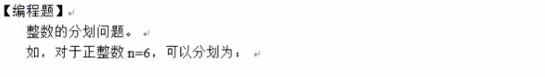
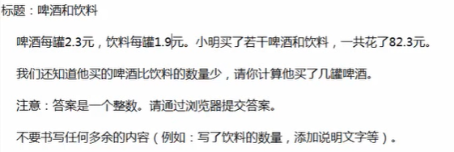
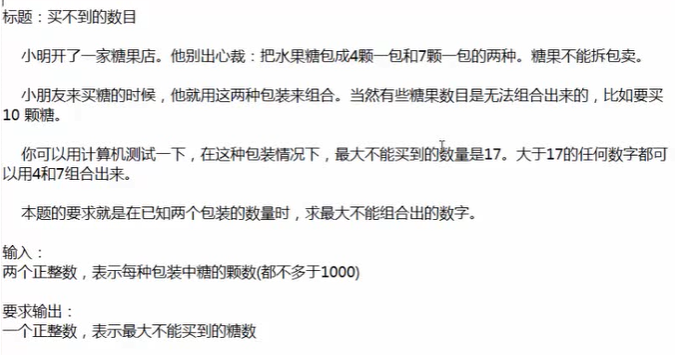

 

# 【红客研习社】2021蓝桥杯JAVA算法特训课学习笔记

## 笔记目录

- [【红客研习社】2021蓝桥杯JAVA算法特训课学习笔记](#红客研习社2021蓝桥杯java算法特训课学习笔记)
  - [笔记目录](#笔记目录)
  - [递归与循环](#递归与循环)
    - [循环改递归](#循环改递归)
    - [经典递归](#经典递归)
      - [N取M个有多少取法](#n取m个有多少取法)
      - [求全排列](#求全排列)
      - [求两个串的最长公共子序列](#求两个串的最长公共子序列)
      - [递归真题：反转串](#递归真题反转串)
      - [递归真题：杨辉三角形](#递归真题杨辉三角形)
      - [递归真题：排列问题](#递归真题排列问题)
      - [递归真题：整数划分](#递归真题整数划分)
      - [递归真题：溜掉的金额](#递归真题溜掉的金额)
  - [浮点数的注意事项](#浮点数的注意事项)
    - [浮点数运算非常危险](#浮点数运算非常危险)
    - [啤酒和饮料](#啤酒和饮料)
    - [比酒量](#比酒量)
      - [暴力解法：并使用有理分数](#暴力解法并使用有理分数)
      - [递归解法：并使用有理分数](#递归解法并使用有理分数)
    - [有理分数的完整实现](#有理分数的完整实现)
    - [IEEE754中的特殊值](#ieee754中的特殊值)
    - [java的舍入模式：四舍六入五成双](#java的舍入模式四舍六入五成双)
  - [整数的基本性质和应用](#整数的基本性质和应用)
    - [最大公约数的几种计算方法](#最大公约数的几种计算方法)
    - [最小公倍数的几种求解方法](#最小公倍数的几种求解方法)
    - [求a的n次幂的几种求解方法](#求a的n次幂的几种求解方法)
    - [第100002个素数](#第100002个素数)
      - [快速求第k位素数:埃氏筛法](#快速求第k位素数埃氏筛法)
      - [快速求第k位素数:欧拉筛](#快速求第k位素数欧拉筛)
    - [买不到的数目](#买不到的数目)
  - [不定方程的解法](#不定方程的解法)
    - [暴力解法:适用于较小的数](#暴力解法适用于较小的数)
    - [优化解法1：优化for循环层数](#优化解法1优化for循环层数)
    - [优化解法2：先求特解，在用通解公式求所有特解](#优化解法2先求特解在用通解公式求所有特解)
    - [题目：买不到的数](#题目买不到的数)
      - [利用数组的解法：低效](#利用数组的解法低效)
      - [利用不定方程的解法：高效](#利用不定方程的解法高效)
    - [某个正规大赛赛题：花朵数](#某个正规大赛赛题花朵数)
      - [正确解法：此方法可以求任意位数的花朵数](#正确解法此方法可以求任意位数的花朵数)
      - [错误解法：暴力尝试](#错误解法暴力尝试)
      - [六角幻方](#六角幻方)
  - [随机算法的应用](#随机算法的应用)
    - [概率模拟](#概率模拟)
    - [扑克点数24](#扑克点数24)
  - [博弈问题](#博弈问题)
    - [高僧斗法](#高僧斗法)
      - [一般解法：博弈论+深度优先+缓存](#一般解法博弈论深度优先缓存)
    - [组合博弈论](#组合博弈论)
    - [高僧斗法问题转换为尼姆堆](#高僧斗法问题转换为尼姆堆)

## 递归与循环

- 理论上任何循环都可改写为递归
  - 递归可以改写成递归
  - 循环可以改写成递归
  - 循环改递归可以避免栈溢出的问题
  - 有些语言没有循环语句，只能使用递归，如Lisp clojure
- 尾递归
  - 尾递归就是：递归调用仅出现在函数末尾，编译器将会优化成不需要压栈的代码
  - java不支持尾递归
  - C语言可以使用goto实现尾递归，但goto不推荐使用

### 循环改递归

- 改递归的关键是发现逻辑的相似性
  - 如果没有相似性，需要主动构造
  - 不能相似的原因可能是缺少参数
- 不要忘记递归出口
- 应该把程序的状态推向递归的出口
- 递归和数学的递推公式类似

**简单for循环改递归**

```java
public class _01_简单循环改递归 {

 public static void main(String[] args) {
  System.out.println("-----f0-----");
  f0();
  System.out.println("-----f1-----");
  f1(0);
  System.out.println("-----f2-----");
  f2(0);
  System.out.println("-----f3-----");
  f3(0, 9);
  System.out.println("-----f4-----");
  f4(9);
 }

 // for循环 打印输出 0~9
 static void f0() {
  for (int i = 0; i <= 9; i++) {
   System.out.println(i);
  }
 }

 // 写法1
 static void f1(int i) {
  if (i > 9)
   return;
  System.out.println(i);
  f1(i + 1);
 }

 // 写法2
 static void f2(int i) {
  if (0 <= i && i <= 9) {
   System.out.println(i);
   f2(i + 1);
  }
 }

 // 写法3：添加参数
 static void f3(int begin, int end) {
  if (begin > end)
   return;
  System.out.println(begin);
  f3(begin + 1, end);
 }

 // 写法4
 static void f4(int k) {
  if (k > 0)
   f4(k - 1);
  System.out.println(k);
 }
 // 写法N
 // .....
}
```

**递归求解数组元素和**

```java
public class _02_递归求解数组元素和 {
 public static void main(String[] args) {
  int[] arr = { 1, 2, 3, 4, 5 };
  System.out.println(f1(arr, 0));
  System.out.println(f2(arr, arr.length - 1));
  System.out.println(f3(arr, 0, arr.length - 1));
 }

 // 方法1：从i~end
 static int f1(int[] array, int idx) {
  if (idx == array.length) {
   return 0;
  }
  return array[idx] + f1(array, idx + 1);
 }

 // 方法2：从i~0
 static int f2(int[] array, int idx) {
  if (idx == -1) {
   return 0;
  }
  return array[idx] + f2(array, idx - 1);
 }

 // 方法3：二分法
 static int f3(int[] array, int left, int right) {
  if (left == right) {
   return array[left];
  } else {
   int mid = left + (right - left) / 2;
   return f3(array, left, mid) + f3(array, mid + 1, right);
  }

 }
}
```

**递归判断串相等1**

```java
/**
 * _03_递归判断串相等
 */
public class _03_递归判断串相等 {

 public static void main(String[] args) {
  System.out.println(isSameString("123", "123"));
  System.out.println(isSameString("123", "234"));
 }

 static boolean isSameString(String str1, String str2) {
  if (str1 == str2) {
   return true;
  } else if (str1.length() != str2.length()) {
   return false;
  } else {
   return isEqual(str1, str2, 0);
  }
 }

 static boolean isEqual(String s1,String s2,int idx){
  if(idx==s1.length())return true;
  if(s1.charAt(idx)!=s2.charAt(idx)){
   return false;
  }else{
   return isEqual(s1,s2,idx+1);
  }
 }
}
```

**递归判断串相等2**

```java
/**
 * _03_递归判断串相等2
 */
public class _03_递归判断串相等2 {

 public static void main(String[] args) {
  System.out.println(isSameString("123", "123"));
  System.out.println(isSameString("123", "234"));
 }

 static boolean isSameString(String str1, String str2) {
  if (str1.length() != str2.length())
   return false;
  else if (str1.length() == 0)
   return true;
  else if (str1.charAt(0) != str2.charAt(0))
   return false;
  else
   return isSameString(str1.substring(1), str2.substring(1));
 }
}
```

### 经典递归

#### N取M个有多少取法

```java
/**
 * _04_N取M个有多少取法
 */
public class _04_N取M个有多少取法 {

 public static void main(String[] args) {
  System.out.println(f(10, 3));
 }

 static int f(int n, int m) {
  // 如果栈溢出，则很有可能是有某中情况没有考虑到
  if(n<m)return 0;// 不可能从n个中取出m个
  if(n==m)return 1;// k中取k个只要一种情况
  if(m==0)return 1;// a中取0个只能一种取法，就是什么都不取

  // 所有的取法中，一定可以分为两个集合，一个集合存在某个特定球，另一个集合不存在某个特定的球，
  // 分别考虑这个球存存在或不存在，就可以分为两种情况，
  // 若这个球要取出，就是还要再从剩余的n-1个球中取m-1个球
  // 若这个球不取出，就是还要再从剩余的n-1个球中取m个球
  // n中取m个有多少种，可以考虑其中一个特定的球取或不取的两种情况
  return f(n - 1, m - 1) + f(n-1, m);
 }
}
```

#### 求全排列

```java
import java.util.Arrays;
// abc的全排列 
// 每一个元素都可以放到开始的位置，剩余的位置放剩余的元素，
// 对于剩余的位置，也是在剩余的元素中的每一个元素，都可以放到剩余位置的第一个位置
// 第一位  第二位  第三位
//   a  b  c  
//   a  c  b  
//   b  a  c
//   b  c  a
//   c  a  b
//   c  b  a
public class _05_求N个元素的全排列 {
 public static void main(String[] args) {
  f(new int[] { 0, 1, 2 }, 0);
 }

 static void f(int[] datas, int current) {
  if (current == datas.length) {// 写length-1也可以
   System.out.println(Arrays.toString(datas));
  } else {
   for (int i = current; i < datas.length; i++) {
    swap(datas, current, i);// 试探
    f(datas, current + 1);// 将当前局面交给下一次递归
    swap(datas, current, i);// 回溯
   }
  }
 }

 static void swap(int[] datas, int i, int j) {
  if (i != j) {
   datas[i] = datas[i] ^ datas[j];
   datas[j] = datas[i] ^ datas[j];
   datas[i] = datas[i] ^ datas[j];
  }
 }
}
```

#### 求两个串的最长公共子序列

- 注意是子序列，不是子串
- 子序列在原串中不一定连续，子串在原串中一定连续
- abc和xbacd的公共子序列是ac bc
- 注意，用递归求解此题效率不高，主要是练习递归程序的编写

**递归法：暴力，低效**

```java
public class _06_求两个串的最长公共子序列 {
 public static void main(String[] args) {
  System.out.println(f("abc", "xacbd"));
 }

 static int f(String s1, String s2) {
  if (s1.length() == 0 || s2.length() == 0)
   return 0;
  if (s1.charAt(0) == s2.charAt(0)) {// 比较第一个字符串，是否相等，相等则递归比较后序字符串
   return 1 + f(s1.substring(1), s2.substring(1));
  } else {// 不相等则递归比较，实际上就是在决策当前元素要或不要的问题
   return Math.max(
     f(s1, s2.substring(1)), // s1不动，比较s2的后序部分，
     f(s1.substring(1), s2)// s2不动，比较s1的后序部分
   );
  }
 }
}
```

#### 递归真题：反转串


```java
public class _07_递归求解反串 {
 public static void main(String[] args) {
  System.out.println(reverse("123456789"));
 }
 static String reverse(String str) {
  if (str == null || str.length() <= 1)
   return str;// 长度为0或1的反串为自身
  else
   return reverse(str.substring(1)) + str.charAt(0);
 }
}
```

#### 递归真题：杨辉三角形


```java
public class _08_杨辉三角形 {
 public static void main(String[] args) {
  System.out.println(f(5, 2));
 }
 static int f(int row, int col) {
  if (row == 0)// 处理所有第0行
   return 1;
  if (col == 0 || col == row)//处理所有第0列和对角线上的元素
   return 1;
  return f(row - 1, col) + f(row - 1, col - 1);//递归，当前元素是上一行的两个元素的和
 }
}
```

#### 递归真题：排列问题


```java
public class _09_排列问题 {
 public static void main(String[] args) {
  System.out.println(f(3, 2));
 }

 static int f(int m, int n) {
  if (m == 0 || n == 0)// 因为是排列问题，A为0时B无论有多少个，对于后续B的排列顺序，都属于一种情况
   return 1;
  // 因为这里的排列问题实际上就是每个位置上都是要么选A要么选B,所以就是考虑这两种情况,然后把这两种情况s数相加即可
  return f(m - 1, n) + f(m, n - 1);
 }
}
```

#### 递归真题：整数划分




```java
import java.lang.reflect.Array;
import java.util.ArrayList;
import java.util.Arrays;
import java.util.Collection;
import java.util.Collections;
import java.util.HashMap;
import java.util.Iterator;
import java.util.LinkedList;
import java.util.List;
import java.util.Map;
import java.util.Scanner;
import java.util.function.BiConsumer;

public class _10_整数划分 {
 public static void main(String[] args) {
  Scanner sc = new Scanner(System.in);
  int N = sc.nextInt();
  f(N, 0);
 }

 static LinkedList<Integer> list = new LinkedList<>();

 static void f(int num, int sum) {
  if (sum == num) {
   System.out.println(list);
  } else {
   // n从大到小取，因为输出格式是从大到小
   for (int n = num; 1 <= n; n--) {
    if (sum + n > num)
     continue;// 剪枝
    if (list.size() != 0 && n > list.getLast())
     continue;// 后一个值不能大于前一个值
    list.add(n);
    f(num, sum + n);
    list.removeLast();
   }
  }
 }
}
```

#### 递归真题：溜掉的金额


```java
import java.util.Arrays;
import java.util.Collection;
import java.util.Collections;
import java.util.LinkedList;
import java.util.List;
import java.util.Scanner;

public class _11_漏掉的金额 {
 // 输出：
 // 1 2 4
 // 1 3 3
 // 3 4
 // 3 4
 public static void main(String[] args) {
  String example = "6 5 3 2 4 3 1";
  Scanner sc = new Scanner(System.in);
  target_sum = sc.nextInt();
  N = sc.nextInt();
  details = new int[N];
  selected = new boolean[N];
  for (int i = 0; i < details.length; i++) {
   details[i] = sc.nextInt();
  }
  Arrays.sort(details);
  f(0, 0);
 }

 static int target_sum;
 static int N;
 static int[] details;
 static boolean[] selected;

 static void f(int cur_sum, int cur_idx) {
  if (cur_sum > target_sum)
   return;
  else if (cur_sum == target_sum) {
   List<Integer> list = new LinkedList<>();
   for (int i = 0; i < selected.length; i++) {
    if (selected[i] == false) {
     list.add(details[i]);
    }
   }
   Collections.sort(list);
   System.out.println(list);
   return;
  } else {
   if (cur_idx == details.length)
    return;
   // 选
   selected[cur_idx] = true;
   f(cur_sum + details[cur_idx], cur_idx + 1);
   // 不选
   selected[cur_idx] = false;
   f(cur_sum + 0, cur_idx + 1);
   
  }
 }
}
```

## 浮点数的注意事项

### 浮点数运算非常危险

```java
public class _12_啤酒和饮料_谨慎使用浮点数 {
 public static void main(String[] args) {
  System.out.println(0.1 + 0.2);// 0.30000000000000004
  System.out.println(0.3);// 0.3
  System.out.println(0.1 + 0.2 == 0.3);// false
 }
}
```

### 啤酒和饮料



```java
public class _13_啤酒和饮料 {
 public static void main(String[] args) {
  for (int yi = 1; yi < 83; yi++) {
   for (int pi = 1; pi < yi; pi++) {
    if (2.3 * pi + 1.9 * yi == 82.3) {// 直接浮点数等值比较可能出错
     System.out.println(pi);
    }
   }
  }

  for (int yi = 1; yi < 83; yi++) {
   for (int pi = 1; pi < yi; pi++) {
    if (23 * pi + 19 * yi == 823) {// 扩大十倍，避免使用浮点数
     System.out.println(pi);
    }
   }
  }
 }
}
```

### 比酒量


#### 暴力解法：并使用有理分数

```java
import java.util.LinkedList;
import java.util.List;

public class _14_比酒量_暴力法 {
 public static void main(String[] args) {
  // 初始人数
  for (int a1 = 20; 4 <= a1; a1--) {
   for (int a2 = 0; a2 <= a1 - 1; a2++) {
    for (int a3 = 0; a3 <= a2 - 1; a3++) {
     for (int a4 = 0; a4 <= a3 - 1; a4++) {
      Frac k1 = new Frac(1, a1);
      Frac k2 = new Frac(1, a2);
      Frac k3 = new Frac(1, a3);
      Frac k4 = new Frac(1, a4);
      if (k1.add(k2).add(k3).add(k4).equal_ONE()) {
       System.out.printf("%d,%d,%d,%d%n", a1, a2, a3, a4);
      }
     }
    }
   }
  }
 }
}

// 有理分数
class Frac {
 int a, b;

 Frac(int a, int b) {
  this.a = a;
  this.b = b;
  int k = gcd(a, b);
  if (k != 1) {
   this.a /= k;
   this.b /= k;
  }
 }

 // 加法
 Frac add(Frac o) {
  return new Frac(this.a * o.b + o.a * this.b, this.b * o.b);
 }

 // 判断是否为1
 boolean equal_ONE() {
  return a == b;
 }

 int gcd(int a, int b) {
  if (b == 0)
   return a;
  else
   return gcd(b, a % b);
 }
}
```

#### 递归解法：并使用有理分数

```java
import java.util.LinkedList;
import java.util.List;

public class _14_比酒量 {
 public static void main(String[] args) {
  for (int rest_people = 20; 4 <= rest_people; rest_people--) {
   f(0, rest_people, new Frac(0, 1));
   // 输出：
   // [20, 5, 4, 2]
   // [18, 9, 3, 2]
   // [15, 10, 3, 2]
   // [12, 6, 4, 2]
  }
 }

 static LinkedList<Integer> result = new LinkedList<>();

 static void f(int step, int rest_people, Frac sum) {
  if (step == 4 && rest_people == 0) {
   if (sum.equal_ONE()) {
    System.out.println(result);
   }
  } else {
   // 倒下的人数
   for (int off = 1; off <= rest_people; off++) {
    result.addLast(rest_people);
    f(step + 1, rest_people - off, sum.add(new Frac(1, rest_people)));
    result.removeLast();// 回溯
   }
  }
 }
}

// 有理分数
class Frac {
 int a, b;

 Frac(int a, int b) {
  this.a = a;
  this.b = b;
  int k = gcd(a, b);
  if (k != 1) {
   this.a /= k;
   this.b /= k;
  }
 }

 // 加法
 Frac add(Frac o) {
  return new Frac(this.a * o.b + o.a * this.b, this.b * o.b);
 }

 // 判断是否为1
 boolean equal_ONE() {
  return a == b;
 }

 int gcd(int a, int b) {
  if (b == 0)
   return a;
  else
   return gcd(b, a % b);
 }
}
```

### 有理分数的完整实现

```java
public class _15_有理分数的完整实现 {
 public static void main(String[] args) {
  // 约分测试
  System.out.println(new Frac(2, 4));
  System.out.println(new Frac(4, 8));
  System.out.println(new Frac(-2, 4));
  System.out.println(new Frac(2, -4));
  // 加减乘除测试
  System.out.println(new Frac(1, 4).add(new Frac(1, 4)));
  System.out.println(new Frac(1, 4).sub(new Frac(1, 4)));
  System.out.println(new Frac(1, 4).mul(new Frac(1, 4)));
  System.out.println(new Frac(1, 4).div(new Frac(1, 4)));
 }
}

// 有理分数
class Frac {
 int a, b;

 Frac(int a, int b) {
  this.a = a;
  this.b = b;
  int k = gcd(a, b);
  if (k != 1) {
   this.a /= k;
   this.b /= k;
  }
 }

 // 加法
 Frac add(Frac o) {
  return new Frac(this.a * o.b + o.a * this.b, this.b * o.b);
 }

 // 乘法
 Frac mul(Frac o) {
  return new Frac(this.a * o.a, this.b * o.b);
 }

 // 相反数
 Frac negative() {
  return new Frac(-a, b);
 }

 // 倒数
 Frac inverse() {
  return new Frac(b, a);
 }

 // 减法,减一个数等于加一个数的相反数
 Frac sub(Frac o) {
  return this.add(o.negative());
 }

 // 除法，除一个数等于乘一个数的倒数
 Frac div(Frac o) {
  return this.mul(o.inverse());
 }

 // 判断是否为1
 boolean equal_ONE() {
  return a == b;
 }

 int gcd(int a, int b) {
  if (a <= 0)
   a = -a;// 注意此处对负数的处理
  if (b <= 0)
   b = -b;// 注意此处对负数的处理
  if (b == 0)
   return a;
  else
   return gcd(b, a % b);
 }

 @Override
 public String toString() {
  return "Frac [a=" + a + ", b=" + b + "]";
 }
}
```

### IEEE754中的特殊值

浮点数运算中的五个特殊值

- `Infinity`
- `-Infinity`
- `0.0`
- `-0.0`
- `NaN`

```java
public class _16_浮点数特殊值 {
 public static void main(String[] args) {
  // IEEE754中有五个特殊值
  // * Infinity
  // * - Infinity
  // * 0.0
  // * -0.0
  // * NaN  非数Not A Number

  // System.out.println(0 / 0);// 算数异常报错
  System.out.println(0.0 / 0);// NaN
  System.out.println(3.0 / 0);// Infinity
  System.out.println(1.0 / 0);// Infinity

  // 无穷的特性
  // 相加相乘仍为无穷
  // 相减相除为非数
  double Infinity = 1.0 / 0;
  System.out.println(Infinity + 1);// 无穷+1=无穷
  System.out.println(Infinity - 1);// 无穷-1=无穷
  System.out.println(Infinity + Infinity);// 无穷+无穷=无穷
  System.out.println(Infinity - Infinity);// 无穷-无穷=NaN
  System.out.println(Infinity * Infinity);// 无穷*无穷=无穷
  System.out.println(Infinity / Infinity);// 无穷/无穷=NaN
  System.out.println(1 / Infinity);// 1/无穷=无穷小=0.0
  System.out.println(1 / -Infinity);// 1/负无穷=负无穷小=-0.0
  System.out.println(-Infinity);// 无穷的相反数为负无穷
  System.out.println(Infinity * -1);// 无穷的相反数为负无穷
 }
}

```

### java的舍入模式：四舍六入五成双

```java
import java.math.BigDecimal;
import java.math.MathContext;
import java.math.RoundingMode;

public class _17_四舍六入五成双 {
 public static void main(String[] args) {
  BigDecimal a = BigDecimal.valueOf(1);
  BigDecimal b = BigDecimal.valueOf(3);
  BigDecimal k1 = a.divide(b, new MathContext(4));// MathContext可以控制精度，保留几位小数
  System.out.println(k1);

  // HALF_UP是通常理解的四舍五入，达到了0.5就进位
  // 即
  // 0.1 => 0
  // 0.4 => 0
  // 0.5 => 1
  // 0.51 => 1
  // 0.66666 => 0.6667
  BigDecimal k2 = BigDecimal.valueOf(2).divide(BigDecimal.valueOf(3), new MathContext(4, RoundingMode.HALF_UP));
  System.out.println(k2);

  // HALF_DOWN 是超过了0.5才进位
  // 即
  // 0.4 => 0
  // 0.5 => 0
  // 0.51 => 1
  // 0.61 => 1
  BigDecimal k3 = BigDecimal.valueOf(2).divide(BigDecimal.valueOf(3), new MathContext(4, RoundingMode.HALF_DOWN));
  System.out.println(k3);

  // HALF_EVEN 是四舍六入五成双 在等于5的时候，往偶数方向进位或舍去
  // 即
  // 0.1 => 0
  // 0.4 => 0
  // 0.5 => 0
  // 1.5 => 2
  // 2.5 => 2
  // 3.5 => 4
  // 0.6 => 1
  // 0.7 => 1
  BigDecimal k4 = BigDecimal.valueOf(2).divide(BigDecimal.valueOf(3), new MathContext(4, RoundingMode.HALF_EVEN));
  System.out.println(k4);
 }
}
```

## 整数的基本性质和应用

### 最大公约数的几种计算方法

```java
public class _18_最大公约数 {
 public static void main(String[] args) {
  System.out.println(gcd_1(5, 10));
  System.out.println(gcd_2(5, 10));
 }

 // 用循环方式暴力求最大公约数｛低效｝
 static int gcd_1(int a, int b) {
  if (a < 0)
   a = -a;// 一般不讨论负数的最大公约数
  if (b < 0)
   b = -b;

  int min = a < b ? a : b;
  for (int k = min; k > 1; k--) {
   if (a % k == 0 && b % k == 0) {
    return k;
   }
  }
  return 1;
 }
 // 辗转相除的原理

 // 取余
 // a = 【k1 * n】 + c1
 // b = 【k2 * n】 + c2
 // (a+b) % n = ( a % n + b % n ) % n
 // (a+b) % n = ( ([k1 * n] + c1) % n + ([k2 * n] + c2) % n ) % n
 // (a+b) % n = ( [k1 * n] % n + c1 % n + [k2 * n] % n + c2 % n ) % n
 // (a+b) % n = ( 0 + c1 % n + 0 + c2 % n ) % n
 // (a+b) % n = ( c1 % n + c2 % n ) % n
 // (a+b) % n = ( c1 + c2 ) % n


 // 辗转相除法，递归求余方式算最大公约数
 static int gcd_2(int a, int b) {
  if (a < 0)
   a = -a;// 一般不讨论负数的最大公约数
  if (b < 0)
   b = -b;
  if (b == 0)
   return a;
  else
   return gcd_2(b, a % b);
 }

 // 辗转相除，for循环求解
 // static int gcd_3(int a, int b) {

 // }
}

```

### 最小公倍数的几种求解方法

```java
public class _19_最小公倍数 {
 public static void main(String[] args) {
  System.out.println(gcf_1(5, 10));
  System.out.println(gcf_1(4, 9));
  System.out.println(gcf_2(4, 9));
 }

 static int gcf_1(int a, int b) {
  int max = a > b ? a : b;
  int min = a > b ? b : a;
  for (int i = 1; i < min; i++) {
   if (max * i % min == 0)
    return max * i;
  }
  return max * min;
 }

 // 利用最大公约数和最小公倍数之间的关系求解
 static int gcf_2(int a, int b) {
  return a * b / gcd(a, b);
 }

 static int gcd(int a, int b) {
  if (b == 0)
   return a;
  return gcd(b, a % b);
 }
}
```

### 求a的n次幂的几种求解方法

```java
import java.util.EnumSet;

public class _20_求a的n次幂 {
 public static void main(String[] args) {
  System.out.println(pow(3, 3));
  System.out.println(pow_mod(3, 3,100));
  System.out.println(quick_pow_1(3, 3));
  System.out.println(quick_pow_2(3, 3));
 }

 static int pow(int a, int n) {
  int res = 1;
  for (int i = 1; i <= n; i++) {
   res *= a;
  }
  return res;
 }

 // 如果n特别大的话或者题目要求取余的话
 // 取余时需要注意
 // res = (a*a*a...*a)%n
 // res = (a%n*a%n*a%n....a%n)%n
 static int pow_mod(int a, int n, int mod) {
  int res = 1;
  for (int i = 1; i <= n; i++) {
   res = (res * a) % mod;
  }
  return res % mod;
 }

 // 快速求解幂
 static int quick_pow_1(int a, int n) {
  if (n == 0)
   return 1;
  else if (n % 2 == 0) {
   int k = quick_pow_1(a, n / 2);
   return k * k;
  } else {
   return a * quick_pow_1(a, n - 1);
  }
 }
 // 快速求解幂
 static int quick_pow_2(int base, int exp) {
  int res = 1;
  while (exp != 0) {
   if ((exp & 1) == 1) {
    res *= base;
   }
   base *= base;
   exp >>= 1;
  }
  return res;
 }
}
```

### 第100002个素数


#### 快速求第k位素数:埃氏筛法

- 埃拉托斯特尼筛法(埃氏筛法)
- 时间复杂度：O(nlog(n))

```java
public class _22_快速求第k位素数_埃氏筛法 {
 public static void main(String[] args) {
  for (int i = 1; i < 20; i++) {
   System.out.print(getPrimeAt(i) + " ");
   // OUTPUT:
   // 2 3 5 7 11 13 17 19 23 29 31 37 41 43 47 53 59 61 67
  }
  System.out.println("");
  for (int i = 1; i < 20; i++) {
   System.out.print(getPrimeAt_(i) + " ");
   // OUTPUT:
   // 2 3 5 7 11 13 17 19 23 29 31 37 41 43 47 53 59 61 67
  }
  System.out.println("");
  System.out.println(getPrimeAt(100002));
  // OUTPUT:
        // 1299743 
 }

 static int getPrimeAt(int i) {
  int counter = 0;
  // 思路就是，先假设数组中全是素数，isSu[k]==true 表示k是素数，然后往后把k的倍数全部标记为不是素数
  // 但是初始化isSu[]为全部是true会有额外耗时，
  // 因为不是素数就是合数，换一种思路就是，用数组isHe[num] 表示num是不是合数，
  // 由于全部是false，就是全部是素数
  boolean[] isHe = new boolean[10000000];// 默认全是false，全是素数
  for (int num = 2; num < isHe.length; num++) {
   if (isHe[num]) {
    // 不是素数就是合数
    continue;
   } else {
    counter++;// 找到一个素数,计数
    if (counter == i)
     return num;
    // 是素数
    // 则素数的倍数，全部都是合数
    for (int k = 2 * num; k < isHe.length; k += num) {
     isHe[k] = true;// 标记为合数
    }
   }
  }
  return -1;
 }
 // 和上面完全相同的算法
 static int getPrimeAt_(int i) {
  int counter = 0;
  byte[] flag = new byte[10000000];// 0代表素数，1代表合数
  for (int num = 2; num < flag.length; num++) {
   if (flag[num] == 1) {
    continue;// 合数跳过
   } else {
    // 不是合数就是素数
    counter++;// 计数
    if (counter == i)
     return num;// 找到就返回这个数

    for (int num_he = 2 * num; num_he < flag.length; num_he += num) {
     flag[num_he] = 1;// 标记为合数
    }
   }
  }
  return -1;
 }
}

```

#### 快速求第k位素数:欧拉筛

- 欧拉筛，线性筛
- 时间复杂度：O(n)

> 基本思想 ：在埃氏筛法的基础上，让每个合数只被它的最小质因子筛选一次，以达到不重复的目的。
相比埃氏筛，欧拉筛多用了一个数组 list 存放所有筛选出来的质数，并进行相关判断，确保所有的合数都是被它的最小质因数所筛去，以此保证每个数只被筛选了一次，要么是素数，要么是合数。

```java
/**
 * _22_快速求第k位素数_欧拉筛
 */
public class _22_快速求第k位素数_欧拉筛 {
 public static void main(String[] args) {

  System.out.println("");
  for (int i = 1; i < 20; i++) {
   System.out.print(getPrimeAt(i) + " ");
   // OUTPUT:
   // 2 3 5 7 11 13 17 19 23 29 31 37 41 43 47 53 59 61 67
  }
  System.out.println("");
  System.out.println(getPrimeAt(100002));
     // OUTPUT:
        // 1299743
 }

 // 和上面完全相同的算法
 static int getPrimeAt(int idx) {
  int prime_counter = 0;
  int[] primes = new int[1000002];// 存素数
  byte[] flags = new byte[10000000];// 0代表素数，1代表合数
  for (int cur_num = 2; cur_num < flags.length; cur_num++) {
   // 是素数
   if (flags[cur_num] == 0) {
    // prime_counter 素数计数器正好可以用来当下标用
    primes[prime_counter] = cur_num;// 记录这个数
    prime_counter++;// 计数，找到一个素数
    if (prime_counter == idx)
     return cur_num;// 找到就返回这个数
   }

   // 标记为合数：
   // 遍历当前找到的所有素数,乘上当前数，一定是合数
   for (int k = 0; k < prime_counter; k++) {

    // 过去的所有素数乘以当前素数，也是合数
    int he_num = primes[k] * cur_num; //

    if (he_num >= flags.length)// 防止越界
     break;

    flags[he_num] = 1;// 标记为合数

    // 提高效率的最最最最最最最最最最最最最最最最最最最最最关键的一句：
    if (cur_num % primes[k] == 0)
     // 表示cur_num曾经被 primes[k] 筛掉过，
     break;

   }
  }
  return -1;// 表示内部空间不足了
 }
}

```

### 买不到的数目




## 不定方程的解法

一般来说，方程的数目和未知数的个数一致

```
4x + 5y = 7
6x + 3y = 9
```

只有一个方程，则解的个数可能无限多个

```
4x + 5y = 7
```

所以一般会加限定条件

```
4x + 5y = 7
x+y==? 或 x y 都是正整数...
```

### 暴力解法:适用于较小的数

```java
public class _23_不定方程的暴力枚举解法 {
 public static void main(String[] args) {
  test0();
 }
 // 4x-5y=7 (x、y都是正整数)

 // 解法1
 // 对于xy都不大的数，暴力枚举
 static void test0() {
  for (int x = 0; x < 100; x++) {
   for (int y = 0; y < 100; y++) {
    if ((4 * x - 5 * y) == 7) {
     // System.out.printf("4*%d-5*%d==7\n", x, y);
     System.out.printf("%d,%d%n", x, y);
    }
   }
  }
 }
}
```

### 优化解法1：优化for循环层数

```java
public class _23_不定方程的优化解法1 {
 public static void main(String[] args) {
  test1();
 }

 // 解法2：对于x、y特别大的数才需要用这种方法。
 // 4x-5y=7 (x、y都是正整数)
 // 一次方程可以表示为:
 // ax + by = c
 // ax = c - by
 // 因为 y是整数，方程左右两边都是整数
 // 又因为a、x是整数,
 // 所以 (c-by)%a==0 x=(c-by)/a,
 // 这样就把双层循环优化成了单层循环，
 static void test1() {
  for (int y = 0; y < 100; y++) {
   // 4x - 5y = 7
   // 4x = 7 + 5y
   // (7+5y)%4==0
   if ((7 + 5 * y) % 4 == 0) {
    int x = (7 + 5 * y) / 4;
    if (x < 100) {// 再对x的范围约束
     System.out.printf("%d,%d%n", x, y);
    }
   }
  }
 }
}

```

### 优化解法2：先求特解，在用通解公式求所有特解

```java
public class _23_不定方程的优化解法2 {
 public static void main(String[] args) {
  test2();
 }

 // 解法3：先求出一个特解，在用一次方程的通解公式直接计算出x和y
 // 4x-5y=7 (x、y都是正整数)
 // 一次方程可以表示为:
 // ax + by = c a=4，b=-5 , c=7
 // ax = c - by
 // 因为 y是整数，方程左右两边都是整数
 // 又因为a、x是整数,
 // 所以 (c-by)%a==0 x=(c-by)/a,
 // 这样就能找到一组特解｛x=x_0,y=y_0｝。

 // 然后使用一次方程的通解公式
 // x= x_0 + bt (t=0,±1,±2,±3,±4,±5)
 // y= y_0 - at (t=0,±1,±2,±3,±4,±5)
 static void test2() {
  // ax + by = c a=4，b=-5 , c=7
  int a = 4;
  int b = -5;
  int c = 7;
  int x0 = 0, y0 = 0;
  // 求一个特解
  for (int y = 0; y < 100; y++) {
   if ((c - (b) * y) % a == 0) {
    int x = (c - (b) * y) / a;
    System.out.printf("特解：%d,%d%n", x, y);
    x0 = x;// 求特解
    y0 = y;// 求特解
    break;
   }
  }
  // 求所有通解
  // t++
  for (int t = 0; t < 100; t++) {
   int x = x0 + b * t;
   int y = y0 - a * t;
   System.out.printf("%d,%d%n", x, y);
  }
  // t--
  for (int t = 0; -100 < t; t--) {
   int x = x0 + b * t;
   int y = y0 - a * t;
   System.out.printf("%d,%d%n", x, y);
  }
 }
}
```

### 题目：买不到的数


题目所给的数一定是互质的

- 互质，两个数的最大公约数为1，也就是无法进一步约分的数

```
ax+by=c (x,y整数，a,b互质)

反例
4y + 6y = 10 // 9买不到
4y + 6y = 20 // 19买不到
4y + 6y = 30 // 29买不到
............ // 买不到的数可能有无限多个
```

**思路**

枚举所有买法，找出所有可以买到的数目

1表示能买，0表示不能买

```java
int a = 7,b = 8;
x=1,y=1;// 枚举ab
res = a*x+b*y
num[res]=1; // 用1标记表示能凑出这个数
```

如果结果是 00101001111110111111011111111111

最大的不能凑出的数就是:

```
00101001111110111111011111111111
--------------------^-----------这一位所代表的数
```

找的方法就是,先关注a和b中最小的数，如果a=7,b=8,最小数就是7

```
00101001111110111111011111111111
---------------------^^^^^^^----
连续找出7个数都能凑出，
那么第8个数也一定能凑出，
因为第8位数就是第1位+a
```

#### 利用数组的解法：低效

```java
import java.util.Arrays;

public class _24_买不到的数_数组法 {
 public static void main(String[] args) {
  System.out.println(f(3, 5));
  System.out.println(f(4, 7));
  System.out.println(f(10, 13));
  System.out.println(f(30, 41));
  System.out.println(f(257, 191));
  // 输出（一般快，但存在越界风险）：
  // 7
  // 17
  // 107
  // 1159
  // 48639
 }

 static int N = 100000;

 static int f(int a, int b) {
  boolean[] couldBuy = new boolean[N];
  for (int i = 0; i < N / a; i++) {
   for (int j = 0; j < (N - a * i) / b; j++) {
    couldBuy[a * i + b * j] = true;
   }
  }
  int min = a < b ? a : b;
  int len = 0;
  for (int i = 0; i < couldBuy.length; i++) {
   if (couldBuy[i])
    len++;
   else
    len = 0;

   // 连续能买到min次，则后续的数都能买到。
   if (len == min) {
    return i - len;
   }
  }
  return -1;
 }
}
```

#### 利用不定方程的解法：高效

```java

public class _24_买不到的数_不定方程 {
 public static void main(String[] args) {
  System.out.println(f(3, 5));
  System.out.println(f(4, 7));
  System.out.println(f(10, 13));
  System.out.println(f(30, 41));
  System.out.println(f(257, 191));
  // 输出很快：
  // 7
  // 17
  // 107
  // 1159
  // 48639
 }

 static int f(int a, int b) {
  // ax+by=c
  // by = c-ax;
  // y = (c-ax)/b
  //
  // x = x0 + bt;
  // y = y0 - at;
  int c = 0;
  int min = a < b ? a : b;
  int len = 0;
  while (true) {
   boolean find = false;
   for (int x0 = 0; a * x0 <= c; x0++) {
    if ((c - a * x0) % b == 0) {
     int y0 = (c - a * x0) / b;
     if (y0 < 0)
      continue;
     else {
      find = true;
     }
    }
   }
   if (find) {
    len++;
    if (len == min)
     return c - len;
   } else {
    len = 0;
   }
   c++;
  }
 }
}

```

### 某个正规大赛赛题：花朵数


#### 正确解法：此方法可以求任意位数的花朵数

**流程**

以立方数为例：

```
这几种组合都是使用的相同的分配模式
135 
153 
315
351
513
531
他们都是 [1=1次,3=1次,5=1次，其他0省略]
计算和就是 1^3 + 5^3 + 3^3 = 153
结果153也是 [1=1次,3=1次,5=1次，其他0省略]
```

```java
import java.math.BigInteger;
import java.util.Arrays;

public class _25_花朵数 {
 static int N = 21;// N=3 就是求经典水仙花数，N=21就是求本题

 public static void main(String[] args) {
  dfs(0, N);
  // 输出：
  // 128468643043731391252
  // 449177399146038697307
 }

 // 可以认为是频次统计
 static int[] counter = new int[10];// 0~9的计数

 // base_e21[5]里存的是5的21次方
 static BigInteger[] base_exp = new BigInteger[10];// 0~9 的21次方
 static {
  for (int i = 0; i < base_exp.length; i++) {
   base_exp[i] = BigInteger.valueOf(i).pow(N);
  }
 }

 // dfs所做的是确定21个数字，有几个0，几个1 几个2.....几个9.
 // 因为，水仙花数是把每一位数的N次方相加，
 // 每一位数的具体次序不会影响相加的结果，
 // 只要相加的结果的位数满足要求则就是水仙花数
 static void dfs(int step, int rest) {
  if (step == counter.length) {
   if (rest == 0) {
    // System.out.println(Arrays.toString(counter));
    process();
   }
  } else {
   for (int i = 0; i <= rest; i++) {
    counter[step] = i;// 这一位出现i次
    dfs(step + 1, rest - i);
    // counter[step] = 0;// 回溯
   }
  }
 }

 // 用频次统计结果计算 各个位次方的和，然后判断这个和
 static void process() {
  BigInteger bi_sum = BigInteger.ZERO;
  for (int i = 0; i < counter.length; i++) {
   bi_sum = bi_sum.add(base_exp[i].multiply(BigInteger.valueOf(counter[i])));
  }
  String str_sum = bi_sum.toString();
  // 这个数的位数首先要满足要求
  if (str_sum.length() == N) {
   // System.out.println(str_sum);
   // 这个数的各个数出现的频次要符合要求
   int[] counter_sum = new int[10];
   for (int i = 0; i < str_sum.length(); i++) {
    counter_sum[str_sum.charAt(i) - '0']++;// 统计
   }
   for (int i = 0; i < counter_sum.length; i++) {
    if (counter[i] == counter_sum[i]) {// 一致性判断
     continue;
    } else {
     return;
    }
   }
   System.out.println(str_sum);
  }
 }
}
```

#### 错误解法：暴力尝试

这种解法就是从100000000000000000000到999999999999999999999

依次遍历，找出符合要求的数

```java
import java.math.BigDecimal;
import java.math.BigInteger;

public class _25_花朵数_错误暴力解法 {
 public static void main(String[] args) {
  StringBuilder from_sb = new StringBuilder();
  StringBuilder to_sb = new StringBuilder();
  from_sb.append("1");
  for (int i = 0; i < 20; i++) {
   from_sb.append("0");
  }
  for (int i = 0; i < 21; i++) {
   to_sb.append("9");
  }
  String from_s = from_sb.toString();
  String to_s = to_sb.toString();

  BigInteger k1 = new BigInteger(from_s);
  BigInteger k2 = new BigInteger(to_s);

  for (; k1.compareTo(k2) <= 0; k1 = k1.add(BigInteger.ONE)) {
   // System.out.println(k1);
   BigInteger res = BigInteger.valueOf(0);
   char[] chars = k1.toString().toCharArray();
   for (int i = 0; i < chars.length; i++) {
    // 每项的21次方
    BigInteger each = new BigInteger(chars[i] + "").pow(21);
    res = res.add(each);
    if (res.compareTo(k1) > 0)
     break;
   }
   if (res.compareTo(k1) == 0)
    System.out.println(k1);
  }

 }

}

```

#### 六角幻方


**没写出来....**

```java
import java.util.Arrays;

public class _26_六角幻方 {
 // 一共1~19个数，和为(1+19)*19/2=190，
 // 填5行，每行都相等，这说明每行的和为190/5 = 38,题中
 // ---* * *
 // --* * * *
 // -* * * * *
 // --* * * *
 // ---* * *

 // * * *
 // * * * *
 // * * * * *
 // * * * *
 // * * *

 public static void main(String[] args) {
  f(1, 0, 38, 0);
  System.out.println(counter);
 }

 static int[][] nums = new int[][] {
   new int[] { 15, 13, 10 },
   new int[] { 4, 5, 6, 7 },
   new int[] { 8, 9, 3, 11, 12 },
   new int[] { 2, 14, 1, 16 },
   new int[] { 17, 18, 19 }
 };

 static int counter = 0;

 static void f(int cur_i, int cur_j, int preLineSum, int curLineSum) {
  if (cur_i == nums.length - 1 && cur_j == nums[cur_i].length/* 最后一个合法位置的下一个位置是递归的出口 */) {
   counter++;
   // System.out.println(Arrays.toString(nums[0]) + sumArray(nums[0]));
   // System.out.println(Arrays.toString(nums[1]) + sumArray(nums[1]));
   // System.out.println(Arrays.toString(nums[2]) + sumArray(nums[2]));
   // System.out.println(Arrays.toString(nums[3]) + sumArray(nums[3]));
   // System.out.println(Arrays.toString(nums[4]) + sumArray(nums[4]));
   // System.out.println();
  } else {
   // 计算正确的当前位置
   if (cur_j == nums[cur_i].length) {
    cur_i++;
    cur_j = 0;
    preLineSum = curLineSum;
    curLineSum = 0;
   }

   if (curLineSum > 38) {// 剪枝
    return;
   }
   if (cur_j == 0 && preLineSum != 38) {
    return;// 剪枝
   }
   if (cur_i == 3 && cur_j == 0) {
    // 剪枝
    if (((nums[0][0] +
      nums[1][0] +
      nums[2][0]) != 38

    ) || ((nums[0][2] +
      nums[1][3] +
      nums[2][4]) != 38)) {
     return;
    }
   }

   int i = cur_i;// 从cur_i开始
   int j = cur_j;// 从cur_j开始
   for (/* 应该空着 */; i < nums.length; i++) {
    for (/* 应该空着 */; j < nums[i].length; j++) {
     swap(nums, cur_i, cur_j, i, j);
     f(cur_i, cur_j + 1, preLineSum, curLineSum + nums[cur_i][cur_j]);// 去到下一个位置
     swap(nums, cur_i, cur_j, i, j);// 回溯
    }
    j = 0;// 末尾恢复【重要！】
   }
  }
 }

 static void swap(int[][] datas, int a_i, int a_j, int b_i, int b_j) {
  if (a_i != b_i && a_j != b_j) {
   datas[a_i][a_j] = datas[a_i][a_j] ^ datas[b_i][b_j];
   datas[b_i][b_j] = datas[a_i][a_j] ^ datas[b_i][b_j];
   datas[a_i][a_j] = datas[a_i][a_j] ^ datas[b_i][b_j];
  }
 }

 static int sumArray(int[] arr) {
  int res = 0;
  for (int i = 0; i < arr.length; i++) {
   res += arr[i];
  }
  return res;
 }
}
```

## 随机算法的应用

### 概率模拟

30个人的班级，生日重复的概率有多大

```java
public class _27_概率模拟生日重复 {

 public static void main(String[] args) {
  System.out.println(f());
 }

 // 模拟次数
 static int N = 1000000;

 static double f() {
  int count = 0;
  for (int t = 0; t < N; t++) {
   int[] k = new int[365];
   for (int i = 1; i <= 30; i++) {
    int year = (int) (Math.random() * 365);
    if (k[year] == 1) {
     count++;
     break;
    } else {
     k[year] = 1;
    }
   }
  }
  return count / (double) N;
 }
}
```

### 扑克点数24

给定四张扑克牌（输入），用+-*/计算，结果正好为24

常规解法就是四张牌排列组合，运算符号也排列组合，然后计算，还要考虑到计算优先级的问题。

这里的解法是使用随机生成操作符，随机打乱顺序，

然后按照逆波兰数计算，结果为24则找到一种组合，

然后用在将其翻译成正常的算数表达式，要考虑优先级和括号

```java
import java.util.Arrays;
import java.util.EmptyStackException;
import java.util.Random;
import java.util.Scanner;
import java.util.Stack;

import javax.sound.midi.Track;

public class _28_扑克点数24 {
 public static void main(String[] args) {
  Scanner sc = new Scanner(System.in);
  int[] nums = new int[4];
  for (int i = 0; i < nums.length; i++) {
   nums[i] = sc.nextInt();
  }
  process(nums);
  // 输入：
  // 7 8 5 3
  // 输出：
  // [8, 5, 7, 3, x, -, -]
  // (8-(5-7x3))=24
 }

 static void process(int[] nums) {
  // 1 + 2 + 3 + 4 // 四个数中间可以插入三个操作符
  // 前四个放数字，后三个个放操作符
  Object[] k = new Object[7];
  for (int t = 0; t < 10000; t++) {
   // 放入全部4个数字
   for (int i = 0; i < nums.length; i++) {
    k[i] = nums[i];
   }
   // 放入3个随机操作符
   for (int i = 4; i < k.length; i++) {
    k[i] = getRandomOp();
   }
   // 对于这三个随机操作符，打乱几次来尝试
   for (int i = 0; i < 10; i++) {
    reArrange(k);// 打乱顺序
    // 计算是否等于24
    if (computed(k) == 24) {
     System.out.println(Arrays.toString(k));
     System.out.println(interpreter(k) + "=24");
     return;// 找出一个即可
    }
   }
  }
  System.out.println("not fond.");
 }

 // 逆波兰数表达式的解释器
 static String interpreter(Object[] arr) {
  Stack<String> result = new Stack<>();
  for (int i = 0; i < arr.length; i++) {
   if (arr[i] instanceof Integer) {
    result.push(arr[i] + "");
   } else {
    char op = (char) arr[i];
    if (op == '+' || op == '-')
     result.push("(" + result.pop() + op + result.pop() + ")");
    else
     result.push(result.pop() + op + result.pop());
   }
  }
  return result.pop();
 }

 // 随机获取一个操作符
 static Character getRandomOp() {
  switch ((int) (Math.random() * 4)) {
   case 0:
    return '+';
   case 1:
    return '-';
   case 2:
    return 'x';
   default:
    return '/';
  }
 }

 // 随机打乱顺序
 static void reArrange(Object[] items) {
  for (int i = 0; i < items.length; i++) {
   swap(items, i, (int) (Math.random() * items.length));// 随机找一个元素和当前元素交换
  }
 }

 // 交换
 static void swap(Object[] datas, int i, int j) {
  Object t = datas[i];
  datas[i] = datas[j];
  datas[j] = t;
 }

 // 计算
 static int computed(Object[] items) {
  Stack<Integer> stack = new Stack<>();
  try {
   for (int i = 0; i < items.length; i++) {
    if (items[i] instanceof Integer) {
     stack.push((Integer) items[i]);
    } else {
     switch ((Character) items[i]) {
      case '+':
       stack.push(stack.pop() + stack.pop());
       break;
      case '-':
       stack.push(stack.pop() - stack.pop());// 注意顺序
       break;
      case 'x':
       stack.push(stack.pop() * stack.pop());
       break;
      default:
       Integer k1 = stack.pop();
       Integer k2 = stack.pop();
       if (k1 % k2 != 0)
        throw new Exception("无法整除");
       stack.push(k1 / k2);
       break;
     }
    }
   }
   if (stack.size() == 1) {
    return stack.pop();
   }
  } catch (Exception e) {
  }
  return -1;
 }
}
```

## 博弈问题

博弈问题的编程大体框架

```ts
function 先手函数(自己的局面,对手的局面){

 if(递归出口：边界情况1){
  return 输0；
 }
 if(递归出口：边界情况2){
  return 平1;
 }
 if(递归出口：边界情况3){
  return 赢2;
 }

 对手历史最低得分 = 赢2 // 输0 、平1、 赢2

 for(遍历所有自己可做出的决策){

  // 做出决策，然后把局面交给对手
  对手的输赢情况或得分 = 先手函数(对手的局面,做出决策后我的新局面);// 得到对手的输赢情况
  
  if(对手的输赢情况或得分 < 对手历史最低得分){
   对手历史最低得分 = 对手的输赢情况或得分
  }
  if(对手历史最低得分==输0){
   break;// 剪枝 ，找到使对手输的决策
  }

 }
    if(对手的输赢情况==输){
     我的输赢情况 = 赢
    }else if(对手的输赢情况=平){
     我的输赢情况 = 平
    }else{
     我的输赢情况 = 输
    }
    return 我的输赢情况;
}
```

### 高僧斗法


#### 一般解法：博弈论+深度优先+缓存

对于N比较小的情况，可以很快得到结果

```java
import java.util.Arrays;
import java.util.HashMap;
import java.util.LinkedList;
import java.util.Scanner;

public class _29_高僧斗法 {
 public static void main(String[] args) {
  Scanner sc = new Scanner(System.in);
  LinkedList<Integer> list = new LinkedList<>();
  String[] nums = sc.nextLine().split(" ");
  for (int i = 0; i < nums.length; i++) {
   list.add(Integer.parseInt(nums[i]));
  }
  datas = list.toArray(new Integer[list.size()]);
  f(0);
 }
 static Integer[] datas;
 // hashMap 记录当前局面的状态的输赢情况，用于在下一次遇到相同局面时直接查表返回结果
 static HashMap<State, Boolean> cache = new HashMap<>();

 static boolean f(int k) {
  State curState = new State(datas);
  if (cache.containsKey(curState)) {
   return cache.get(curState);// 取出之前计算的结果
  }
  if (isFailure()/* 检查局面是否导致自己输了 */) {
   cache.put(curState, false);
   return false;
  }
  // 遍历每个小和尚,除了最后一个
  for (int i = 0; i < datas.length - 1; i++) {
   for (int step = 1/* 遍历该小和尚可以走多少步 */; datas[i] + step < datas[i + 1]/* 新位置不能等于或超过下一个小和尚的位置 */; step++) {
    datas[i] += step;// 这个小和尚走step步后达到新位置
    boolean res = f(k + 1);// 把局面交给对手,进入k+1轮
    datas[i] -= step;// 回溯
    if (res == false) {// 对手输，则我赢
     if (k == 0) {// 仅在第一次输出
      System.out.println(datas[i] + " " + (datas[i] + step)/* 记住要加括号！！！ */);// 打印旧位置和新位置
     }
     cache.put(curState, true);
     return true;// 对手输，则我赢
    }
   }
  }
  cache.put(curState, false);
  return false;// 找不到让对手输的情况，则我输
 }
 static boolean isFailure() {
  for (int i = 0; i < datas.length - 1; i++) {
   // [6 7 8 9]就是输了，否则就没有
   if (datas[i] + 1 != datas[i + 1]) {
    return false;
   }
  }
  return true;
 }
}
// 记录当前局面的特征
class State {
 Integer[] dates;
 State(Integer[] arr) {
  dates = Arrays.copyOf(arr, arr.length);
 }
 @Override
 public boolean equals(Object obj) {
  // TODO Auto-generated method stub
  if (obj instanceof State) {
   return Arrays.equals(dates, ((State) obj).dates);
  } else
   return false;
 }
 @Override
 public int hashCode() {
  // TODO Auto-generated method stub
  return Arrays.hashCode(dates);
 }
}
```

### 组合博弈论

```
尼姆定理，任何无偏二人游戏都可看成尼姆堆

无偏二人游戏:棋子对两人来说是无差别的游戏，

象棋、五子棋、围墙都不是无偏二人游戏，因为各自只能操作自己的棋子

经典尼姆堆问题

三堆硬币，两个人可以先后从某一堆中取出任意多个硬币，

谁先拿完硬币谁就赢，或者说轮到某个人时，无硬币可拿了他便输了。

尼姆定理：

三堆硬币， 个数分别为 2 4 5
二进制分别为：
 0 1 1
 1 0 0
 1 0 1
-------------
每一个列上，1的个数为偶数，对方先手，则对方必输，

可以这样理解，一共偶数个1，他拿走一个1，一定会还留有一个1给我拿走，我不可能输

```

### 高僧斗法问题转换为尼姆堆

```
可以把小和尚之间的空隙看成是“空隙数尼姆堆”，

每次让小和尚向前移动就是拿走尼姆堆中的空隙

谁先拿完空隙，谁就赢了。

a ... b .... c

需要注意的问题：移动b,也就是拿走bc之间的空隙，会导致ab之间的空隙增加。

假如尼姆堆的二进制1的个数为偶数，对方先手，移动了b，打破了这种状态，

则我方可以移动a或b使得二进制1的个数恢复成偶数个。
```


