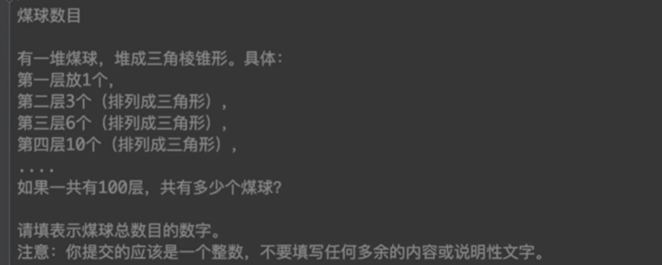

# 蓝桥杯 2016 年 javaB 组真题刷题笔记

## 目录

- [蓝桥杯 2016 年 javaB 组真题刷题笔记](#蓝桥杯-2016-年-javab-组真题刷题笔记)
  - [目录](#目录)
  - [\[01\]煤球数目](#01煤球数目)
  - [\[02\]生日蜡烛](#02生日蜡烛)
    - [方法 1：枚举开始过生日的岁数和现在的岁数](#方法-1枚举开始过生日的岁数和现在的岁数)
    - [方法 2：枚举过生日的次数](#方法-2枚举过生日的次数)
  - [\[03\]搭积木](#03搭积木)
    - [递归：一维数组全排列](#递归一维数组全排列)
    - [递归：二维数组全排列+判断是否符合条件](#递归二维数组全排列判断是否符合条件)
    - [递归【效率较高】：二维数组全排列+在选择元素的过程中剪枝](#递归效率较高二维数组全排列在选择元素的过程中剪枝)
    - [错误写法：二维数组的递归全排列错误写法](#错误写法二维数组的递归全排列错误写法)
  - [\[04\]分小组](#04分小组)
  - [\[05\]抽签](#05抽签)
  - [\[06\]寒假作业](#06寒假作业)
    - [最优解法：递归调用，全排列，但每次确定三个数](#最优解法递归调用全排列但每次确定三个数)
    - [错误解法：递归调用，13 个数的全排列, 算法是正确的，但极其耗时](#错误解法递归调用13-个数的全排列-算法是正确的但极其耗时)
  - [\[07\]剪邮票](#07剪邮票)
    - [写法 1：递归方式的 12 选 5 枚举组合 + 非递归方式检查节点是否连通](#写法-1递归方式的-12-选-5-枚举组合--非递归方式检查节点是否连通)
    - [写法 2：递归方式的 12 选 5 枚举组合 + 递归方式检查节点是否连通](#写法-2递归方式的-12-选-5-枚举组合--递归方式检查节点是否连通)
    - [之前的错误写法：不是排列问题而是组合问题](#之前的错误写法不是排列问题而是组合问题)
      - [写法 1：递归方式的 12 选 5 枚举排列+非递归方式检查节点是否连通](#写法-1递归方式的-12-选-5-枚举排列非递归方式检查节点是否连通)
      - [写法 2：递归方式的 12 选 5 枚举排列+递归方式检查节点是否连通](#写法-2递归方式的-12-选-5-枚举排列递归方式检查节点是否连通)
  - [\[08\]取球博弈](#08取球博弈)
    - [解法 1:递归](#解法-1递归)
    - [解法 2:递归+状态缓存](#解法-2递归状态缓存)
  - [\[09\]交换瓶子](#09交换瓶子)
    - [递归版](#递归版)
    - [非递归版](#非递归版)
  - [\[10\]压缩变换](#10压缩变换)
    - [直觉解法](#直觉解法)
    - [利用线段树优化的解法](#利用线段树优化的解法)

## [01]煤球数目



```java
public class _01_煤球数目 {
 // 题意：
 // 1----------*
 // 2--------* * *
 // 3-----* * * * * *
 // 4-* * * * * * * * * *
 // 注意求的是100层总共的值,不是第100层的值

 // 规律:
 //
 // *-------------------------- (0)+1
 // * * *---------------------- (0 + 1) + 2
 // * * * * * *---------------- ((0 + 1) + 2) + 3
 // * * * * * * * * * *-------- (((0 + 1) + 2) + 3) + 4
 public static void main(String[] args) {
  Long sum = 0l;
  Long k = 0l;
  for (Long i = 1l; i <= 100; i++) {
   k += i;
   sum += k;
  }
  System.out.println(sum);
  //结果： 171700
 }
}
```

## [02]生日蜡烛


### 方法 1：枚举开始过生日的岁数和现在的岁数

```java
public class _02_生日蜡烛 {
 public static void main(String[] args) {
  for (int start = 1; start <= 100; start++) {
   for (int end = start; end <= 100; end++) {
    // 求和公式：（首项+末项）乘 项数 除 二
    //
    // end-start+1 = 年数
    // 2岁 - 1岁 = 相差1年 所以要知道项数还要加1
    // 如：
    // 10 - 5 + 1 = 6
    // 5 6 7 8 9 109️九个数
    double k = (start + end) * (end - start + 1) / 2.0;
    if (k == 236) {
     System.out.println(start);
     System.out.println(end);
     System.out.println(k);
     // 输出：
     // 26  <------要提交的答案
     // 33
     // 236.0
    }
   }
  }
 }

}
```

### 方法 2：枚举过生日的次数

```java
public class _02_生日蜡烛 {
public class _02_生日蜡烛 {
 public static void main(String[] args) {
  // 解法2：
  // 等差数列求和公式 == (首项+末项)*项数÷2
  // 因为： 末项 = 首项+(项数-1)*公差
  // 所以：(首项+首项+(项数-1)*公差)*项数÷2
  // 所以：== ( a_0 + a_0 + (n-1) * d ) * n / 2
  // 因为：d==1
  // 所以：== ( a_0 + a_0 + (n-1) ) * n / 2
  // 所以：== ( 2*a_0 + (n-1) ) * n / 2
  // 因为：sum==236
  // 所以：236 == ( 2*a_0 + (n-1) ) * n / 2
  // 所以：236*2/n-(n-1) == 2 * a_0
  // 设 k == 236*2/n-(n-1)
  // 因为 a_0 是整数，
  // 所以 k%2 == 0
  // 所以：a_0 == k/2
  for (double n = 1; n < 100; n++) {
   double k = 236 * 2.0 / n - (n - 1);
   if (k % 2.0 == 0) {
    double a_0 = k / 2;
    System.out.println(a_0);
    // 输出：
    // 236.0
    // 26  <------要提交的答案
    // -25.0
   }
  }
 }
}
```

## [03]搭积木

问题说明：

小明最近喜欢搭数字积木，一共有 10 块积木，每个积木上有一个数字，0~9。

搭积木规则：每个积木放到其它两个积木的上面，并且一定比下面的两个积木数字小。最后搭成 4 层的金字塔形，必须用完所有的积木。

下面是两种合格的搭法：

```
   0
  1 2
 3 4 5
6 7 8 9

   0
  3 1
 7 5 2
9 8 6 4
```

请你计算这样的搭法一共有多少种？

请填表示总数目的数字。注意：你提交的应该是一个整数，不要填写任何多余的内容或说明性文字。

**思路**

```
用二维数组存储，全排列，
条件是 k = data[i][j]   k<data[i+1][j] && k<data[i+1][j+1]

0
3 1
7 5 2
9 8 6 4
```

### 递归：一维数组全排列

```java
import java.util.Arrays;

public class _03_搭积木 {
 public static void main(String[] args) {
  _03_搭积木 handle = new _03_搭积木();
  handle.process(0);
  System.out.println(handle.counter);
  // 输出：768
 }

 int counter = 0;
 int[] num = { 0, 1, 2, 3, 4, 5, 6, 7, 8, 9 };

 void process(int step) {
  if (step == 10) {
   if (check(num)) {
    System.out.println(Arrays.toString(num));
    counter++;
   }
  } else {
   for (int i = step; i < num.length; i++) {
    exchange(num, step, i);
    process(step + 1);
    exchange(num, step, i);
   }
  }
 }

 boolean check(int[] arr) {

  // 题意中的金字塔结构
  // ------0
  // -----3 1
  // ----7 5 2
  // ---9 8 6 4

  // 抽象成二维数组：
  // 0
  // 3 1
  // 7 5 2
  // 9 8 6 4

  // 用一维数组对应： [0,3,1,7,5,2,9,8,6,4]

  for (int i = 0, increasement = 1; // 初始在0行，下一行的位置在+1 再下一行是+2
    increasement <= 3; // 最多加3
    i += increasement, increasement++// 定位到下一行
    ) {
   for (int j = 0; // 0
     j < increasement; // incureasement 某种程度上代表了当前所在的行，
     j++) {
    int currentLine = i;
    int nextLine = i + increasement;// 下一行
    int n = arr[currentLine + j];
    int n1 = arr[nextLine + j];
    int n2 = arr[nextLine + j + 1];
    if (n < n1 && n < n2) {
     continue;
    } else {
     return false;
    }
   }
  }
  return true;
 }

 void exchange(int[] arr, int i, int j) {
  if (i != j) {
   arr[i] = arr[j] ^ arr[i];
   arr[j] = arr[j] ^ arr[i];
   arr[i] = arr[j] ^ arr[i];
  }
 }
}
```

### 递归：二维数组全排列+判断是否符合条件

```java

import java.util.Arrays;

public class _03_搭积木 {
 public static void main(String[] args) {
  _03_搭积木 handle = new _03_搭积木();
  handle.process(0, 0);
  System.out.println(handle.counter);
  // 输出 768
 }

 int counter = 0;
 boolean[][] selected = new boolean[4][4];
 int[][] result = new int[4][4];
 int[][] nums = {
   { 0 },
   { 1, 2 },
   { 3, 4, 5 },
   { 6, 7, 8, 9 }
 };

 // 全排列
 void process(int curI, int curJ) {
  if (curI == 3 && curJ == 4) {

   if (check(result)) {

    // System.out.println(Arrays.toString(result[0]));
    // System.out.println(Arrays.toString(result[1]));
    // System.out.println(Arrays.toString(result[2]));
    // System.out.println(Arrays.toString(result[3]));
    // System.out.println("");

    counter++;
   }
  } else {
   // 这一步操作是把行坐标和列坐标调整到正确的位置
   if (curJ >= nums[curI].length// 列坐标达到当前行最大值
   ) {
    curI += 1;// 行指针指向下一行
    curJ = 0;// 列坐标指向0
   }

   // 从当前位置及后续位置中挑选一个元素放到当前位置
   for (int i = 0; i < nums.length; i++) {
    for (int j = 0; j < nums[i].length; j++) {
     if (!selected[i][j]) {

      selected[i][j] = true;

      result[curI][curJ] = nums[i][j];

      process(curI, curJ + 1);// 递归，确定下一个位置的元素

      selected[i][j] = false;
     }
    }
   }
  }
 }
 boolean check(int[][] arr) {
  for (int i = 0; i < arr.length - 1; i++) {
   for (int j = 0; j <= i; j++) {
    int n = arr[i][j];
    int n1 = arr[i + 1][j];
    int n2 = arr[i + 1][j + 1];
    if (n < n1 && n < n2) {
     continue;
    } else {
     return false;
    }
   }
  }
  return true;
 }
}
```

### 递归【效率较高】：二维数组全排列+在选择元素的过程中剪枝

```java

import java.util.Arrays;

public class _03_搭积木 {
 public static void main(String[] args) {
  _03_搭积木 handle = new _03_搭积木();
  handle.process(0, 0);
  System.out.println(handle.counter);
  // 输出 768
 }

 int counter = 0;
 boolean[][] selected = new boolean[4][4];
 int[][] result = new int[4][4];
 int[][] nums = {
   { 0 },
   { 1, 2 },
   { 3, 4, 5 },
   { 6, 7, 8, 9 }
 };

 // 全排列
 void process(int curI, int curJ) {
  if (curI == 3 && curJ == 4) {
   // System.out.println(Arrays.toString(result[0]));
   // System.out.println(Arrays.toString(result[1]));
   // System.out.println(Arrays.toString(result[2]));
   // System.out.println(Arrays.toString(result[3]));
   // System.out.println("");
   counter++;
  } else {

   // 这一步操作是把行坐标和列坐标调整到正确的位置
   if (curJ >= nums[curI].length// 列坐标达到当前行最大值
   ) {
    curI += 1;// 行指针指向下一行
    curJ = 0;// 列坐标指向0
   }

   // 从当前位置及后续位置中挑选一个元素放到当前位置
   for (int i = 0; i < nums.length; i++) {
    for (int j = 0; j < nums[i].length; j++) {
     if (!selected[i][j]) {

      selected[i][j] = true;

      result[curI][curJ] = nums[i][j];

      if ((curI - 1 >= 0 && result[curI - 1][curJ] >= result[curI][curJ]) ||
        (curI - 1 >= 0 && curJ - 1 >= 0 && result[curI - 1][curJ - 1] >= result[curI][curJ])) {
       selected[i][j] = false;// 回溯
       continue;// 剪枝
      }

      process(curI, curJ + 1);// 递归，确定下一个位置的元素

      selected[i][j] = false;
     }
    }
   }
  }
 }
}
```

### 错误写法：二维数组的递归全排列错误写法

```java
import java.util.Arrays;

public class _03_搭积木 {
 public static void main(String[] args) {
  _03_搭积木 handle = new _03_搭积木();
  handle.process(0, 0, 0);
  System.out.println(handle.counter);
  // 输出 27648
 }

 int counter = 0;
 int[][] nums = {
   { 0 },
   { 1, 2 },
   { 3, 4, 5 },
   { 6, 7, 8, 9 }
 };

 void process(int curI, int curJ, int step) {
  if (step == 10) {
   if (check(nums)) {
    counter++;
   }
  } else {
   if (curJ >= nums[curI].length// 列坐标达到当前行最大值
   ) {
    // 这一步操作是把行坐标和列坐标调整到正确的位置
    curI += 1;// 行指针指向下一行
    curJ = 0;// 列坐标指向0
   }
   for (int i = curI; i < nums.length; i++) {
    // 错误之处就在于：`int j = curJ`
    for (int j = curJ; j < nums[i].length; j++) {
     exchange(nums, curI, curJ, i, j);
     process(curI, curJ + 1, step + 1);// 行坐标不变，列坐标+1 表示进入下一个位置，实际坐标
     exchange(nums, curI, curJ, i, j);// 回溯
    }
   }
  }
 }

 boolean check(int[][] arr) {
  for (int i = 0; i < arr.length - 1; i++) {
   for (int j = 0; j < arr[i].length; j++) {
    int n = arr[i][j];
    int n1 = arr[i + 1][j];
    int n2 = arr[i + 1][j + 1];
    if (n < n1 && n < n2) {
     continue;
    } else {
     return false;
    }
   }
  }
  return true;
 }

 void exchange(int[][] arr, int a_i, int a_j, int b_i, int b_j) {
  if (a_i != b_i && a_j != b_j) {
   arr[a_i][a_j] = arr[a_i][a_j] ^ arr[b_i][b_j];
   arr[b_i][b_j] = arr[a_i][a_j] ^ arr[b_i][b_j];
   arr[a_i][a_j] = arr[a_i][a_j] ^ arr[b_i][b_j];
  }
 }
}
```

## [04]分小组

```java
/*
分小组

9名运动员参加比赛，需要分3组进行预赛。
有哪些分组的方案呢？

我们标记运动员为 A,B,C,... I
下面的程序列出了所有的分组方法。

该程序的正常输出为：
ABC DEF GHI
ABC DEG FHI
ABC DEH FGI
ABC DEI FGH
ABC DFG EHI
ABC DFH EGI
ABC DFI EGH
ABC DGH EFI
ABC DGI EFH
ABC DHI EFG
ABC EFG DHI
ABC EFH DGI
ABC EFI DGH
ABC EGH DFI
ABC EGI DFH
ABC EHI DFG
ABC FGH DEI
ABC FGI DEH
ABC FHI DEG
ABC GHI DEF
ABD CEF GHI
ABD CEG FHI
ABD CEH FGI
ABD CEI FGH
ABD CFG EHI
ABD CFH EGI
ABD CFI EGH
ABD CGH EFI
ABD CGI EFH
ABD CHI EFG
ABD EFG CHI
..... (以下省略，总共560行)。

public class A
{
    public static String remain(int[] a)
    {
        String s = "";
        for(int i=0; i<a.length; i++){
            if(a[i] == 0) s += (char)(i+'A');
        }
        return s;
    }

    public static void f(String s, int[] a)
    {
        for(int i=0; i<a.length; i++){
            if(a[i]==1) continue;
            a[i] = 1;
            for(int j=i+1; j<a.length; j++){
                if(a[j]==1) continue;
                a[j]=1;
                for(int k=j+1; k<a.length; k++){
                    if(a[k]==1) continue;
                    a[k]=1;
                    System.out.println(__________________________________);  //填空位置
                    a[k]=0;
                }
                a[j]=0;
            }
            a[i] = 0;
        }
    }

    public static void main(String[] args)
    {
        int[] a = new int[9];
        a[0] = 1;

        for(int b=1; b<a.length; b++){
            a[b] = 1;
            for(int c=b+1; c<a.length; c++){
                a[c] = 1;
                String s = "A" + (char)(b+'A') + (char)(c+'A');
                f(s,a);
                a[c] = 0;
            }
            a[b] = 0;
        }
    }
}

仔细阅读代码，填写划线部分缺少的内容。

注意：不要填写任何已有内容或说明性文字。
*/
```

```java
填写内容：remain(a)

答案：s + " "+ (char)(i+'A') + (char)(j+'A') + (char)(k+'A') + " " + remain(a)
```

> **做题思路**，
>
> 不要盯着代码看，直接执行它，然后调试出结果。

```java
/**
 * _04_分小组
 */
public class _04_分小组 {

 public static String remain(int[] a) {
  String s = "";
  for (int i = 0; i < a.length; i++) {
   if (a[i] == 0)
    s += (char) (i + 'A');
  }
  return s;
 }

 public static void f(String s, int[] a) {
  for (int i = 0; i < a.length; i++) {
   if (a[i] == 1)
    continue;
   a[i] = 1;
   for (int j = i + 1; j < a.length; j++) {
    if (a[j] == 1)
     continue;
    a[j] = 1;
    for (int k = j + 1; k < a.length; k++) {
     if (a[k] == 1)
      continue;
     a[k] = 1;

     // 测试
     String s2 = "" + (char) (i + 'A') + (char) (j + 'A') + (char) (k + 'A');
     System.out.println(s + " " + s2 + " " + remain(a));
     /**
      * 输出：
      * ABC DEF GHI
      * ABC DEG FHI
      * ABC DEH FGI
      * ABC DEI FGH
      */

     // 填空位置
     // System.out.println(____________________________________);

     a[k] = 0;
    }
    a[j] = 0;
   }
   a[i] = 0;
  }
 }

 public static void main(String[] args) {
  int[] a = new int[9];
  a[0] = 1;

  for (int b = 1; b < a.length; b++) {
   a[b] = 1;
   for (int c = b + 1; c < a.length; c++) {
    a[c] = 1;
    String s = "A" + (char) (b + 'A') + (char) (c + 'A');
    f(s, a);
    a[c] = 0;
   }
   a[b] = 0;
  }
 }
}
```

## [05]抽签

```
/*
抽签

X星球要派出一个5人组成的观察团前往W星。
其中：
A国最多可以派出4人。
B国最多可以派出2人。
C国最多可以派出2人。
....

那么最终派往W星的观察团会有多少种国别的不同组合呢？

下面的程序解决了这个问题。
数组a[] 中既是每个国家可以派出的最多的名额。
程序执行结果为：
DEFFF
CEFFF
CDFFF
CDEFF
CCFFF
CCEFF
CCDFF
CCDEF
BEFFF
BDFFF
BDEFF
BCFFF
BCEFF
BCDFF
BCDEF
....
(以下省略，总共101行)


public class A
{
    public static void f(int[] a, int k, int n, String s)
    {
        if(k==a.length){
            if(n==0) System.out.println(s);
            return;
        }

        String s2 = s;
        for(int i=0; i<=a[k]; i++){
            _____________________________;   //填空位置
            s2 += (char)(k+'A');
        }
    }

    public static void main(String[] args)
    {
        int[] a = {4,2,2,1,1,3};

        f(a,0,5,"");
    }
}


仔细阅读代码，填写划线部分缺少的内容。

注意：不要填写任何已有内容或说明性文字。
*/
```

```bash
答案
f(a,k+1,n-i,s2)
```

```java
public class _05_抽签 {
 /*
  * 抽签
  *
  * X星球要派出一个5人组成的观察团前往W星。
  * 其中：
  * A国最多可以派出4人。
  * B国最多可以派出2人。
  * C国最多可以派出2人。
  * ....
  *
  * 那么最终派往W星的观察团会有多少种国别的不同组合呢？
  *
  * 下面的程序解决了这个问题。
  * 数组a[] 中既是每个国家可以派出的最多的名额。
  * 程序执行结果为：
  * DEFFF
  * CEFFF
  * CDFFF
  * CDEFF
  * CCFFF
  * CCEFF
  * CCDFF
  * CCDEF
  * BEFFF
  * BDFFF
  * BDEFF
  * BCFFF
  * BCEFF
  * BCDFF
  * BCDEF
  * ....
  * (以下省略，总共101行)
  */
 public static void f(int[] a, int k, int n, String s) {
  if (k == a.length) {
   if (n == 0)
    System.out.println(s);
   return;
  }

  String s2 = s;
  for (int i = 0; i <= a[k]; i++) {
   // i表示，枚举去('A'+k)国的观察者人数，从0~a[k]
   // 递归，
   // k+1，表示决定下一个国家观察团人数，
   // n-i,表示还有多少个观察者剩余没有被分配。
   f(a, k + 1, n - i, s2); // 填空位置

   s2 += (char) (k + 'A');
  }
 }

 public static void main(String[] args) {
  int[] a = {
    4, // A
    2, // B
    2, // C
    1, // D
    1, // E
    3 // F
  };

  f(a, 0, 5, "");
 }
}
```

## [06]寒假作业

```

题目描述
本题为填空题，只需要算出结果后，在代码中使用输出语句将所填结果输出即可。

现在小学的数学题目也不是那么好玩的。 看看这个寒假作业：

   □ + □ = □
   □ - □ = □
   □ × □ = □
   □ ÷ □ = □
每个方块代表 1~13 中的某一个数字，但不能重复。

比如：

 6  + 7 = 13
 9  - 8 = 1
 3  * 4 = 12
 10 / 2 = 5
以及：

 7  + 6 = 13
 9  - 8 = 1
 3  * 4 = 12
 10 / 2 = 5
就算两种解法。（加法，乘法交换律后算不同的方案）

你一共找到了多少种方案？

运行限制
最大运行时间：1s

最大运行内存: 128M
```

### 最优解法：递归调用，全排列，但每次确定三个数

递归调用，全排列，但每次确定三个数，满足要求再进入下一层递归调用

````markdown
另外要注意，判断 a/b==c 的表达式应该写成：

```java
if (b != 0 && a % b == 0 && a / b == c){
 // ...
}
```
````

```java
import java.util.Arrays;

public class _06_寒假作业 {
 public static void main(String[] args) {
  _06_寒假作业 handle = new _06_寒假作业();
  handle.dfs(0, '+');
  System.out.println(handle.counter);
  // 输出：64
 }

 boolean[][] selected = new boolean[5][3];
 int[][] result = new int[5][3];
 int[][] data = {
   { 1, 2, 3 },
   { 4, 5, 6 },
   { 7, 8, 9 },
   { 10, 11, 12 },
   { 13 },
 };
 int counter = 0;

 void dfs(int step, char op) {
  if (step == 4) {
   counter++;
   // System.out.printf("%d+%d=%d\n", result[0][0], result[0][1], result[0][2]);
   // System.out.printf("%d-%d=%d\n", result[1][0], result[1][1], result[1][2]);
   // System.out.printf("%d*%d=%d\n", result[2][0], result[2][1], result[2][2]);
   // System.out.printf("%d/%d=%d\n", result[3][0], result[3][1], result[3][2]);
   // System.out.println("");
   // System.out.println(count);
  } else {
   for (int a_i = 0; a_i < data.length; a_i++) {
    for (int a_j = 0; a_j < data[a_i].length; a_j++) {
     if (!selected[a_i][a_j]) {
      selected[a_i][a_j] = true;
      for (int b_i = 0; b_i < data.length; b_i++) {
       for (int b_j = 0; b_j < data[b_i].length; b_j++) {
        if (!selected[b_i][b_j]) {
         selected[b_i][b_j] = true;
         for (int c_i = 0; c_i < data.length; c_i++) {
          for (int c_j = 0; c_j < data[c_i].length; c_j++) {
           if (!selected[c_i][c_j]) {
            selected[c_i][c_j] = true;

            // 每次挑选三个数，这三个数满足等式要求才进入下一层递归调用。
            int a = data[a_i][a_j];
            int b = data[b_i][b_j];
            int c = data[c_i][c_j];

            switch (op) {
             case '+':
              if (a + b == c) {
               result[0][0] = a;
               result[0][1] = b;
               result[0][2] = c;
               dfs(step + 1, '-');
              }
              break;
             case '-':
              if (a - b == c) {
               result[1][0] = a;
               result[1][1] = b;
               result[1][2] = c;
               dfs(step + 1, '*');
              }
             case '*':
              if (a * b == c) {
               result[2][0] = a;
               result[2][1] = b;
               result[2][2] = c;
               dfs(step + 1, '/');
              }
             case '/':
              // 注意b!=0 a%b==0
              if (b != 0 && a % b == 0 && a / b == c) {
               result[3][0] = a;
               result[3][1] = b;
               result[3][2] = c;
               dfs(step + 1, ' ');
              }
             default:
              break;
            }
            selected[c_i][c_j] = false;
           }
          }
         }
         selected[b_i][b_j] = false;
        }
       }
      }
      selected[a_i][a_j] = false;
     }
    }
   }
  }
 }
}
```

### 错误解法：递归调用，13 个数的全排列, 算法是正确的，但极其耗时

```java
import java.util.Arrays;

public class _06_寒假作业 {
 public static void main(String[] args) {
  _06_寒假作业 handle = new _06_寒假作业();
  handle.dfs(0, 0);
  System.out.println(handle.counter);

 }

 boolean[][] selected = new boolean[5][3];
 int[][] result = new int[5][3];
 int[][] data = {
   { 1, 2, 3 },
   { 4, 5, 6 },
   { 7, 8, 9 },
   { 10, 11, 12 },
   { 13 },
 };
 int counter = 0;

 void dfs(int curI, int curJ) {
  if (curJ >= data[curI].length) {
   curI += 1;
   curJ = 0;
  }
  if (curI == 4) {
   if (check(result)) {
    counter++;
    System.out.printf("%d+%d=%d\n", result[0][0], result[0][1], result[0][2]);
    System.out.printf("%d-%d=%d\n", result[1][0], result[1][1], result[1][2]);
    System.out.printf("%d*%d=%d\n", result[2][0], result[2][1], result[2][2]);
    System.out.printf("%d/%d=%d\n", result[3][0], result[3][1], result[3][2]);
    System.out.println("");
    System.out.println(counter);
   }
  } else {
   for (int i = 0; i < data.length; i++) {
    for (int j = 0; j < data[i].length; j++) {
     if (!selected[i][j]) {
      selected[i][j] = true;
      result[curI][curJ] = data[i][j];
      dfs(curI, curJ + 1);
      selected[i][j] = false;
     }
    }
   }
  }
 }

 boolean check(int[][] matrix) {
  return (matrix[0][0] + matrix[0][1] == matrix[0][2] &&
    matrix[1][0] - matrix[1][1] == matrix[1][2] &&
    matrix[2][0] * matrix[2][1] == matrix[2][2] &&
    (matrix[3][1] != 0 &&
      matrix[3][0] % matrix[3][1] == 0 &&
      matrix[3][0] / matrix[3][1] == matrix[3][2]));
 }
}
```

## [07]剪邮票

```
剪邮票

如【图1.jpg】, 有12张连在一起的12生肖的邮票。

现在你要从中剪下5张来，要求必须是连着的。

(仅仅连接一个角不算相连)

比如，【图2.jpg】，【图3.jpg】中，粉红色所示部分就是合格的剪取。

请你计算，一共有多少种不同的剪取方法。

请填写表示方案数目的整数。

注意：你提交的应该是一个整数，不要填写任何多余的内容或说明性文字。

```


> 思路 12 选 5，然后检查选出的 5 张中是否连通。

> 注意这是组合问题不是排列问题，

### 写法 1：递归方式的 12 选 5 枚举组合 + 非递归方式检查节点是否连通

```java
import java.util.Arrays;
import java.util.HashSet;
import java.util.Set;
import java.util.Stack;

public class _07_剪邮票 {
 public static void main(String[] args) {
  _07_剪邮票 handle = new _07_剪邮票();
  handle.process(0, 0, 0);
  System.out.println(handle.counter);
  // 输出： 116,答案就是116

 }

 int counter = 0;
 int selected[][] = new int[3][4];

 void process(int curI, int curJ, int getter) {
  // 手中拿到的数目是5，
  if (getter == 5) {

   if (check()) {

    counter++;

    System.out.println(Arrays.toString(selected[0]));
    System.out.println(Arrays.toString(selected[1]));
    System.out.println(Arrays.toString(selected[2]));
    System.out.println("");
    System.out.println(counter);
   }

  } else {

   // 调整到正确坐标
   if (curJ >= selected[curI].length) {
    curI += 1;// 跳转到下一行
    curJ = 0;// 跳转到第一列
   }

   // 行越界直接结束搜索
   if (curI == selected.length) {
    return;
   }

   // 这里是组合问题，不是排列问题，因此
   // 对于每张邮票只有选或不选两种选择，

   // 选，然后进入下一个位置,
   selected[curI][curJ] = 1;
   process(curI, curJ + 1, getter + 1);

   // 不选，然后进入下一个位置,
   selected[curI][curJ] = 0;
   process(curI, curJ + 1, getter);
  }
 }

 boolean check() {

  // 找到一个坐标作为起始坐标
  int start_I = 0, start_J = 0;
  outerFor: for (int i = 0; i < selected.length; i++) {
   for (int j = 0; j < selected[i].length; j++) {
    if (selected[i][j] == 1) {
     start_I = i;
     start_J = j;
     break outerFor;
    }
   }
  }

  int count = 0;

  // 非递归先根遍历。
  // 从这个坐标开始，往选中的且相连的节点扩散，
  Stack<Position> unprocessed = new Stack<>();
  Set<Position> processed = new HashSet<>();
  unprocessed.push(new Position(start_I, start_J));
  while (!unprocessed.isEmpty()) {

   Position curPos = unprocessed.pop();// 拿出该节点

   // 处理当前节点
   if ( curPos.isCorrectPosAt(selected) && // 要求坐标是合法的
     selected[curPos.i][curPos.j] == 1 && // 要求是被选中的
     !processed.contains(curPos)// 要求是未处理的节点
   ) {
    // 这里就找到一个符合要求的节点。
    count++;// 统计

    int curI = curPos.i;
    int curJ = curPos.j;
    // ---a1
    // a2 aa a3
    // ---a4
    // aa的周围4个数，要检查他们是否被选中，然后放入栈中。
    unprocessed.push(new Position(curI - 1, curJ));
    unprocessed.push(new Position(curI, curJ - 1));
    unprocessed.push(new Position(curI, curJ + 1));
    unprocessed.push(new Position(curI + 1, curJ));

    processed.add(curPos);// 表示该节点已经处理,防止进入死循环
   }

  }

  return count == 5;
 }

 class Position {
  int i, j;

  public Position(int i, int j) {
   this.i = i;
   this.j = j;
  }

  boolean isCorrectPosAt(int[][] map) {
   return (0 <= i && i < map.length &&
     0 <= j && j < map[i].length);
  }

  @Override
  public int hashCode() {
   final int prime = 31;
   int result = 1;
   result = prime * result + getEnclosingInstance().hashCode();
   result = prime * result + i;
   result = prime * result + j;
   return result;
  }

  @Override
  public boolean equals(Object obj) {
   if (this == obj)
    return true;
   if (obj == null)
    return false;
   if (getClass() != obj.getClass())
    return false;
   Position other = (Position) obj;
   if (!getEnclosingInstance().equals(other.getEnclosingInstance()))
    return false;
   if (i != other.i)
    return false;
   if (j != other.j)
    return false;
   return true;
  }

  private _07_剪邮票 getEnclosingInstance() {
   return _07_剪邮票.this;
  }
 }
}
```

### 写法 2：递归方式的 12 选 5 枚举组合 + 递归方式检查节点是否连通

```java
import java.util.Arrays;
import java.util.HashSet;
import java.util.Set;
import java.util.Stack;

import javax.swing.text.Position;

public class _07_剪邮票 {
 public static void main(String[] args) {
  _07_剪邮票 handle = new _07_剪邮票();
  handle.process(0, 0, 0);
  System.out.println(handle.counter);
  // 输出： 13920
 }

 int counter = 0;
 int selected[][] = new int[3][4];

 // 全排列
 void process(int curI, int curJ, int getter) {
  if (getter == 5) {
   if (check()) {
    counter++;
    // System.out.println(Arrays.toString(selected[0]));
    // System.out.println(Arrays.toString(selected[1]));
    // System.out.println(Arrays.toString(selected[2]));
    // System.out.println("");
    // System.out.println(counter);
   }
  } else {
   // 计算正确坐标
   if (curJ >= selected[curI].length) {
    curI += 1;
    curJ = 0;
   }
   // 行坐标越界直接终止递归
   if (curI >= selected.length) {
    return;
   }

   // 选中当前元素
   selected[curI][curJ] = 1;
   process(curI, curJ + 1, getter + 1);

   // 不选当前元素
   selected[curI][curJ] = 0;
   process(curI, curJ + 1, getter + 0);
  }
 }

 boolean check() {
  // 找到一个坐标作为起始坐标
  int start_I = 0, start_J = 0;
  outerFor: for (int i = 0; i < selected.length; i++) {
   for (int j = 0; j < selected[i].length; j++) {
    if (selected[i][j] == 1) {
     start_I = i;
     start_J = j;
     break outerFor;
    }
   }
  }

  int count = check_process(new Position(start_I, start_J), new HashSet<>());
  return count == 5;
 }

 int check_process(Position curPos, Set<Position> processed) {
  int count = 0;
  if (curPos.isCorrectPosAt(selected) &&
    selected[curPos.i][curPos.j] == 1 &&
    !processed.contains(curPos)) {
   count++;
   processed.add(curPos);
   // ---a1
   // a2 aa a3
   // ---a4
   count += check_process(new Position(curPos.i - 1, curPos.j), processed);
   count += check_process(new Position(curPos.i, curPos.j - 1), processed);
   count += check_process(new Position(curPos.i, curPos.j + 1), processed);
   count += check_process(new Position(curPos.i + 1, curPos.j), processed);
  }
  return count;
 }

 class Position {
  int i, j;

  public Position(int i, int j) {
   this.i = i;
   this.j = j;
  }

  boolean isCorrectPosAt(int[][] map) {
   return (0 <= i && i < map.length &&
     0 <= j && j < map[i].length);
  }

  @Override
  public int hashCode() {
   final int prime = 31;
   int result = 1;
   result = prime * result + getEnclosingInstance().hashCode();
   result = prime * result + i;
   result = prime * result + j;
   return result;
  }

  @Override
  public boolean equals(Object obj) {
   if (this == obj)
    return true;
   if (obj == null)
    return false;
   if (getClass() != obj.getClass())
    return false;
   Position other = (Position) obj;
   if (!getEnclosingInstance().equals(other.getEnclosingInstance()))
    return false;
   if (i != other.i)
    return false;
   if (j != other.j)
    return false;
   return true;
  }

  private _07_剪邮票 getEnclosingInstance() {
   return _07_剪邮票.this;
  }
 }
}
```

### 之前的错误写法：不是排列问题而是组合问题

#### 写法 1：递归方式的 12 选 5 枚举排列+非递归方式检查节点是否连通

```java
import java.util.Arrays;
import java.util.HashSet;
import java.util.Set;
import java.util.Stack;

public class _07_剪邮票 {
 public static void main(String[] args) {
  _07_剪邮票 handle = new _07_剪邮票();
  handle.process(0);
  System.out.println(handle.counter);
  // 输出： 13920

 }

 int counter = 0;
 int selected[][] = new int[3][4];

 void process(int step) {
  if (step == 5) {
   if (check()) {
    counter++;
    // System.out.println(Arrays.toString(selected[0]));
    // System.out.println(Arrays.toString(selected[1]));
    // System.out.println(Arrays.toString(selected[2]));
    // System.out.println("");
    // System.out.println(counter);

   }
  } else {
   for (int i = 0; i < selected.length; i++) {
    for (int j = 0; j < selected[i].length; j++) {
     if (selected[i][j] == 0) {
      selected[i][j] = 1;
      process(step + 1);
      selected[i][j] = 0;
     }
    }
   }
  }
 }

 boolean check() {

  // 找到一个坐标作为起始坐标
  int start_I = 0, start_J = 0;
  outerFor: for (int i = 0; i < selected.length; i++) {
   for (int j = 0; j < selected[i].length; j++) {
    if (selected[i][j] == 1) {
     start_I = i;
     start_J = j;
     break outerFor;
    }
   }
  }

  int count = 0;

  // 非递归先根遍历。
  // 从这个坐标开始，往选中的且相连的节点扩散，
  Stack<Position> unprocessed = new Stack<>();
  Set<Position> processed = new HashSet<>();
  unprocessed.push(new Position(start_I, start_J));
  while (!unprocessed.isEmpty()) {
   Position curPos = unprocessed.pop();// 拿出该节点

   // 处理当前节点
   if (curPos.isCorrectPosAt(selected) && // 要求坐标是合法的
     selected[curPos.i][curPos.j] == 1 && // 要求是被选中的
     !processed.contains(curPos)// 要求是未处理的节点
   ) {
    // 这里就找到一个符合要求的节点。
    count++;// 统计

    int curI = curPos.i;
    int curJ = curPos.j;
    // ---a1
    // a2 aa a3
    // ---a4
    // aa的周围4个数，要检查他们是否被选中，然后放入栈中。
    unprocessed.push(new Position(curI - 1, curJ));
    unprocessed.push(new Position(curI, curJ - 1));
    unprocessed.push(new Position(curI, curJ + 1));
    unprocessed.push(new Position(curI + 1, curJ));

    processed.add(curPos);// 表示该节点已经处理,防止进入死循环
   }

  }

  return count == 5;
 }

 class Position {
  int i, j;

  public Position(int i, int j) {
   this.i = i;
   this.j = j;
  }

  boolean isCorrectPosAt(int[][] map) {
   return (0 <= i && i < map.length &&
     0 <= j && j < map[i].length);
  }

  @Override
  public int hashCode() {
   final int prime = 31;
   int result = 1;
   result = prime * result + getEnclosingInstance().hashCode();
   result = prime * result + i;
   result = prime * result + j;
   return result;
  }

  @Override
  public boolean equals(Object obj) {
   if (this == obj)
    return true;
   if (obj == null)
    return false;
   if (getClass() != obj.getClass())
    return false;
   Position other = (Position) obj;
   if (!getEnclosingInstance().equals(other.getEnclosingInstance()))
    return false;
   if (i != other.i)
    return false;
   if (j != other.j)
    return false;
   return true;
  }

  private _07_剪邮票 getEnclosingInstance() {
   return _07_剪邮票.this;
  }

 }
}
```

#### 写法 2：递归方式的 12 选 5 枚举排列+递归方式检查节点是否连通

```java
import java.util.Arrays;
import java.util.HashSet;
import java.util.Set;
import java.util.Stack;

import javax.swing.text.Position;

public class _07_剪邮票 {
 public static void main(String[] args) {
  _07_剪邮票 handle = new _07_剪邮票();
  handle.process(0);
  System.out.println(handle.counter);
  // 输出： 13920
 }

 int counter = 0;
 int selected[][] = new int[3][4];

 // 全排列
 void process(int step) {
  if (step == 5) {
   if (check()) {
    counter++;
    // System.out.println(Arrays.toString(selected[0]));
    // System.out.println(Arrays.toString(selected[1]));
    // System.out.println(Arrays.toString(selected[2]));
    // System.out.println("");
    // System.out.println(counter);
   }
  } else {
   for (int i = 0; i < selected.length; i++) {
    for (int j = 0; j < selected[i].length; j++) {
     if (selected[i][j] == 0) {
      selected[i][j] = 1;
      process(step + 1);
      selected[i][j] = 0;
     }
    }
   }
  }
 }

 boolean check() {
  // 找到一个坐标作为起始坐标
  int start_I = 0, start_J = 0;
  outerFor: for (int i = 0; i < selected.length; i++) {
   for (int j = 0; j < selected[i].length; j++) {
    if (selected[i][j] == 1) {
     start_I = i;
     start_J = j;
     break outerFor;
    }
   }
  }

  int count = check_process(new Position(start_I, start_J), new HashSet<>());
  return count == 5;
 }

 int check_process(Position curPos, Set<Position> processed) {
  int count = 0;
  if (curPos.isCorrectPosAt(selected) &&
    selected[curPos.i][curPos.j] == 1 &&
    !processed.contains(curPos)) {
   count++;
   processed.add(curPos);
   // ---a1
   // a2 aa a3
   // ---a4
   count += check_process(new Position(curPos.i - 1, curPos.j), processed);
   count += check_process(new Position(curPos.i, curPos.j - 1), processed);
   count += check_process(new Position(curPos.i, curPos.j + 1), processed);
   count += check_process(new Position(curPos.i + 1, curPos.j), processed);
  }
  return count;
 }

 class Position {
  int i, j;

  public Position(int i, int j) {
   this.i = i;
   this.j = j;
  }

  boolean isCorrectPosAt(int[][] map) {
   return (0 <= i && i < map.length &&
     0 <= j && j < map[i].length);
  }

  @Override
  public int hashCode() {
   final int prime = 31;
   int result = 1;
   result = prime * result + getEnclosingInstance().hashCode();
   result = prime * result + i;
   result = prime * result + j;
   return result;
  }

  @Override
  public boolean equals(Object obj) {
   if (this == obj)
    return true;
   if (obj == null)
    return false;
   if (getClass() != obj.getClass())
    return false;
   Position other = (Position) obj;
   if (!getEnclosingInstance().equals(other.getEnclosingInstance()))
    return false;
   if (i != other.i)
    return false;
   if (j != other.j)
    return false;
   return true;
  }

  private _07_剪邮票 getEnclosingInstance() {
   return _07_剪邮票.this;
  }

 }
}

```

## [08]取球博弈

```
两个人玩取球的游戏。

一共有N个球，每人轮流取球，每次可取集合{n1,n2,n3}中的任何一个数目。

如果无法继续取球，则游戏结束。

此时，持有奇数个球的一方获胜。

如果两人都是奇数，则为平局。

假设双方都采用最聪明的取法，

第一个取球的人一定能赢吗？

试编程解决这个问题。

输入格式：

第一行3个正整数n1 n2 n3，空格分开，表示每次可取的数目 (0<n1,n2,n3<100)

第二行5个正整数x1 x2 ... x5，空格分开，表示5局的初始球数(0<xi<1000);

输出格式：

一行5个字符，空格分开。分别表示每局先取球的人能否获胜。

能获胜则输出+，

次之，如有办法逼平对手，输出0，

无论如何都会输，则输出-

输入样例：

1 2 3

1 2 3 4 5

样例输出：

+ 0 + 0 -

输入样例：

1 4 5

10 11 12 13 15

样例输出：

0 - 0 + +

输入样例：

2 3 5

7 8 9 10 11

样例输出：

+ 0 0 0 0

请严格按要求输出，不要画蛇添足地打印类似：“请您输入...” 的多余内容。

所有代码放在同一个源文件中，调试通过后，拷贝提交该源码。

注意：不要使用package语句。不要使用jdk1.7及以上版本的特性。

注意：主类的名字必须是：Main，否则按无效代码处理
```

### 解法 1:递归

```java
import java.util.Scanner;

public class _08_取球博弈 {
 public static void main(String[] args) {
  Scanner sc = new Scanner(System.in);

  for (int i = 0; i < choices.length; i++) {
   choices[i] = sc.nextInt();
  }
  for (int i = 0; i < init.length; i++) {
   init[i] = sc.nextInt();
  }
  sc.close();

  for (int i = 0; i < init.length; i++) {
   int num = process(init[i], 0, 0);
   char ch;
   if (num == 1)
    ch = '-';
   else if (num == 2)
    ch = '0';
   else
    ch = '+';
   if (i != init.length - 1) {
    System.out.print(ch + " ");
   } else {
    System.out.print(ch);
   }
  }

 }

 // 选择
 static int[] choices = new int[3];
 // 初始值
 static int[] init = new int[5];

 static int process(int rest, int userA, int userB) {
  // 剩余无球可以拿（取任何一个球都会导致剩余球变负数）
  if (rest - choices[0] < 0 &&
    rest - choices[1] < 0 &&
    rest - choices[2] < 0) {
   // 我是基数，对手偶数，我赢，得分最高
   if ((userA & 1) == 1 && (userB & 1) == 0) {
    return 3;// '+';
   }
   // 我是偶数，对手基数，他赢，得分最低
   else if ((userA & 1) == 0 && (userB & 1) == 1) {
    return 1;// '-';
   }
   // 都是偶数 或 都是基数，平局，得分最中等
   else {
    return 2;// '0';
   }
  } else {
   // 找到让对手得分最低的策略
   Integer worstScore = null;
   for (int i = 0; i < choices.length; i++) {
    if (rest - choices[i] >= 0/* 可以取 */) {
     // 将局势交给对手 得到对手的得分
     int otherScore = process(rest - choices[i], userB, userA + choices[i]);
     if (worstScore == null || otherScore < worstScore) {
      worstScore = otherScore;
     }
    }
   }
   // 可以找到一种让对手输的策略,则我会赢
   if (worstScore == 1)
    return 3;
   // 无法赢，但可以找到一种让对手平局的策略,则我会平
   if (worstScore == 2)
    return 2;
   // 找不到赢的策略也找不到平局的策略,则我会输
   else// if (worstScore == 3)
    return 1;
  }
 }
}

```

### 解法 2:递归+状态缓存

```java
import java.util.Scanner;

public class _08_取球博弈 {
 public static void main(String[] args) {
  Scanner sc = new Scanner(System.in);

  for (int i = 0; i < choices.length; i++) {
   choices[i] = sc.nextInt();
  }
  for (int i = 0; i < init.length; i++) {
   init[i] = sc.nextInt();
  }
  sc.close();

  for (int i = 0; i < init.length; i++) {
   int num = process(init[i], 0, 0);
   char ch;
   if (num == 1)
    ch = '-';
   else if (num == 2)
    ch = '0';
   else
    ch = '+';
   if (i != init.length - 1) {
    System.out.print(ch + " ");
   } else {
    System.out.print(ch);
   }
  }

 }

 // 选择
 static int[] choices = new int[3];
 // 初始值
 static int[] init = new int[5];

 static int[][][] cache = new int[1000][2][2];

 static int process(int rest, int userA, int userB) {
  // 以剩余球数以及自己和对手球的奇偶性做状态特征即可
  int result = cache[rest][userA & 1][userB & 1];
  if (result != 0)// 为0说明这个状态没有被缓存过,因为缓存的值只会是1、2、3
   return result;

  // 剩余无球可以拿（取任何一个球都会导致剩余球变负数）
  if (rest - choices[0] < 0 &&
    rest - choices[1] < 0 &&
    rest - choices[2] < 0) {

   // 我是基数，对手偶数，我赢，得分最高
   if ((userA & 1) == 1 && (userB & 1) == 0) {
    result = 3;
    // return 3;// '+';
   }
   // 我是偶数，对手基数，他赢，得分最低
   else if ((userA & 1) == 0 && (userB & 1) == 1) {
    result = 1;
    // return 1;// '-';
   }
   // 都是偶数 或 都是基数，平局，得分最中等
   else {
    result = 2;
    // return 2;// '0';
   }
  } else {
   // 找到让对手得分最低的策略
   Integer worstScore = null;
   for (int i = 0; i < choices.length; i++) {
    if (rest - choices[i] >= 0/* 可以取 */) {
     // 将局势交给对手 得到对手的得分
     int otherScore = process(rest - choices[i], userB, userA + choices[i]);
     if (worstScore == null || otherScore < worstScore) {
      worstScore = otherScore;
     }
    }
   }

   // 可以找到一种让对手输的策略,则我会赢
   if (worstScore == 1)
    result = 3;
   // return 3;
   // 无法赢，但可以找到一种让对手平局的策略,则我会平
   else if (worstScore == 2)
    result = 2;
   // return 2;
   // 找不到赢的策略也找不到平局的策略,则我会输
   else// if (worstScore == 3)
    result = 1;
   // return 1;
  }
  cache[rest][userA & 1][userB & 1] = result;
  return result;
 }
}

```

## [09]交换瓶子

```
**问题描述**

有N个瓶子，编号 1 ~ N，放在架子上。
比如有5个编号瓶子：2 1 3 5 4。
要求每次拿起2个瓶子，交换它们的位置。
经过若干次后，使得瓶子的序号为：1 2 3 4 5。
对于这么简单的情况，显然，至少需要交换2次就可以复位。如果瓶子更多呢？

【输入】 输入格式为两行：
第一行: 一个正整数N（N<10000）, 表示瓶子的数目。
第二行：N个正整数，用空格分开，表示瓶子目前的排列情况。

【输出】输出数据为一行一个正整数，表示至少交换多少次，才能完成排序。

5
5 4 3 2 1
-------------
1 4 3 2 5
1 2 3 4 5

5
5 4 3 1 2
-------------
1 4 3 5 2
1 2 3 5 4
1 2 3 4 5

5
4 5 3 1 2
-------------
1 5 3 4 2
1 2 3 4 5
```

### 递归版

> **思路**
>
> 遍历数组，第 i 为数的值应当为 i,
>
> 如果不是,则找到 i 在数组中的实际位置，然后和当前位置的值交换，然后去下一个位置。
>
> 一开始以为要用递归，所以写成了递归，其实直接 for 循环就好了

```java
import java.util.Arrays;
import java.util.Scanner;

public class _09_交换瓶子 {
 public static void main(String[] args) {
  Scanner sc = new Scanner(System.in);
  N = sc.nextInt();
  data = new int[N + 1];
  for (int i = 1; i <= N; i++) {
   data[i] = sc.nextInt();
  }
  sc.close();
  order(1);
 }

 static int N;
 static int[] data;
 static int counter = 0;

 static void order(int curIdx) {
  if (curIdx == N + 1) {
   System.out.println(Arrays.toString(data));
   System.out.println(counter);
   return;
  } else {
   if (data[curIdx] != curIdx) {
    int realIdx = findIndex(data, curIdx, curIdx);
    exchange(data, realIdx, curIdx);
    counter++;
   }
   order(curIdx + 1);
  }
 }

 // 从当前位置开始去搜索一个数的坐标
 static int findIndex(int[] arr, int from, int target) {
  for (int i = from; i < arr.length; i++) {
   if (arr[i] == target) {
    return i;
   }
  }
  return -1;
 }

 static void exchange(int[] arr, int i, int j) {
  if (i != j) {
   arr[i] = arr[i] ^ arr[j];
   arr[j] = arr[i] ^ arr[j];
   arr[i] = arr[i] ^ arr[j];
  }
 }
}

```

### 非递归版

```java
import java.util.Arrays;
import java.util.Scanner;

public class _09_交换瓶子 {
 public static void main(String[] args) {
  Scanner sc = new Scanner(System.in);
  N = sc.nextInt();
  data = new int[N + 1];
  for (int i = 1; i <= N; i++) {
   data[i] = sc.nextInt();
  }
  sc.close();
  order();
  System.out.println(counter);
 }

 static int N;
 static int[] data;
 static int counter = 0;

 static void order() {
  for (int curIdx = 1; curIdx <= N; curIdx++) {
   if (data[curIdx] != curIdx) {
    int realIdx = findIndex(data, curIdx, curIdx);
    exchange(data, realIdx, curIdx);
    counter++;
   }
  }
 }

 // 从当前位置开始去搜索一个数的坐标
 static int findIndex(int[] arr, int from, int target) {
  for (int i = from; i < arr.length; i++) {
   if (arr[i] == target) {
    return i;
   }
  }
  return -1;
 }

 static void exchange(int[] arr, int i, int j) {
  if (i != j) {
   arr[i] = arr[i] ^ arr[j];
   arr[j] = arr[i] ^ arr[j];
   arr[i] = arr[i] ^ arr[j];
  }
 }
}
```

## [10]压缩变换

```
压缩变换（16JavaB9）
小明最近在研究压缩算法。

他知道，压缩的时候如果能够使得数值很小，就能通过熵编码得到较高的压缩比。

然而，要使数值很小是一个挑战。

最近，小明需要压缩一些正整数的序列，这些序列的特点是，后面出现的数字很大可能是刚出现过不久的数字。对于这种特殊的序列，小明准备对序列做一个变换来减小数字的值。


变换的过程如下：

 从左到右枚举序列，每枚举到一个数字，如果这个数字没有出现过，刚将数字变换成它的相反数，

 如果数字出现过，则看它在原序列中最后的一次出现后面（且在当前数前面）出现了几种数字，用这个种类数替换原来的数字。

比如，序列(a1, a2, a3, a4, a5)=(1, 2, 2, 1, 2)在变换过程为：

a1: 1未出现过，所以a1变为-1；

a2: 2未出现过，所以a2变为-2；

a3: 2出现过，最后一次为原序列的a2，在a2后、a3前有0种数字，所以a3变为0；

a4: 1出现过，最后一次为原序列的a1，在a1后、a4前有1种数字，所以a4变为1；

a5: 2出现过，最后一次为原序列的a3，在a3后、a5前有1种数字，所以a5变为1。

现在，给出原序列，请问，按这种变换规则变换后的序列是什么。

原序列 1 2 2 1 2

变换后 -1 -2 0 1 1

输入格式：

输入第一行包含一个整数n，表示序列的长度。

第二行包含n个正整数，表示输入序列。

输出格式：

输出一行，包含n个数，表示变换后的序列。

例如，输入：

5

1 2 2 1 2

程序应该输出：

-1 -2 0 1 1

再例如，输入：

12

1 1 2 3 2 3 1 2 2 2 3 1

程序应该输出：

-1 0 -2 -3 1 1 2 2 0 0 2 2

数据规模与约定

对于30%的数据，n<=1000；

对于50%的数据，n<=30000；

对于100%的数据，1 <=n<=100000，1<=ai<=10^9

资源约定：

峰值内存消耗（含虚拟机）< 256M

CPU消耗< 3000ms

请严格按要求输出，不要画蛇添足地打印类似：“请您输入...” 的多余内容。

所有代码放在同一个源文件中，调试通过后，拷贝提交该源码。

注意：不要使用package语句。不要使用jdk1.7及以上版本的特性。

注意：主类的名字必须是：Main，否则按无效代码处理。
```

### 直觉解法

> 这种解法的耗时之处就在于，当在对类似于数组 [1 2 3 4 5 6 7 7 6 5 4 3 2 1] 统计两个1之间的、
>
> 两个2之间的、两个3之间的不同元素个数时，会做很多重复计算。时间复杂度达到O(N),
>
> 这样整个算法的时间复杂度就达到了O(N^2)

```java
import java.util.Arrays;
import java.util.HashMap;
import java.util.HashSet;
import java.util.Map;
import java.util.Scanner;
import java.util.Set;

public class _10_压缩变换 {
 public static void main(String[] args) {
  Scanner sc = new Scanner(System.in);
  N = sc.nextInt();
  raw = new int[N];
  res = new int[N];
  for (int i = 0; i < N; i++) {
   raw[i] = sc.nextInt();
   res[i] = raw[i];
  }
  sc.close();
  process();
  System.out.println(Arrays.toString(res));
 }

 static int N;
 static int[] raw;// 存原数组
 static int[] res;// 存结果

 static Map<Integer, Integer> lastIdxMap = new HashMap<>();

 static void process() {
  for (int idx = 0; idx < N; idx++) {
   int val = raw[idx];// 记录这个位置数的原始值
   if (!lastIdxMap.containsKey(val)) {
    // 对于新出现的数，改为相反数
    res[idx] = -val;
   } else {
    // 对于曾出现的数
    // 替换为，从这个数曾经最后一次出现的位置到当前位置(不包含这两个位置)之间的独立的数的个数
    res[idx] = differCount(raw, lastIdxMap.get(val) + 1, idx - 1);
   }
   lastIdxMap.put(val, idx);// 记录这个数的最后出现位置
  }
 }

 // 统计两个位置之间（包含这两个位置）的数字的种类数
 static int differCount(int[] arr, int from, int to) {
  Set<Integer> set = new HashSet<>();
  for (int idx = from; idx <= to; idx++) {
   set.add(arr[idx]);
  }
  return set.size();
 }
}
```

### 利用线段树优化的解法

```java
import java.util.Arrays;
import java.util.HashMap;
import java.util.HashSet;
import java.util.Map;
import java.util.Scanner;
import java.util.Set;

import javax.management.Query;

public class _10_压缩变换 {
 public static void main(String[] args) {
  test0();// 解题
  // test1();
 }

 static void test0() {
  Scanner sc = new Scanner(System.in);
  N = sc.nextInt();
  data = new int[N];
  seg = new SegmentTree(N);
  for (int i = 0; i < N; i++) {
   data[i] = sc.nextInt();
  }
  sc.close();
  process();
  printResult();
 }

 // 模拟题目的数据规模测试
 // 模拟数据规模测试算法速度 // 耗时：1337 ms
 static void test1() {
  data = Generator.getRandomArray(100000);
  seg = new SegmentTree(data.length);
  long t1 = System.currentTimeMillis();
  process();
  printResult();
  long t2 = System.currentTimeMillis();
  System.out.printf("耗时：%d ms", t2 - t1);
 }


 static int N;
 static int[] data;// 存原数组
 static SegmentTree seg;// 线段树，统计区间中独立元素个数
 static Map<Integer, Integer> lastIdxMap = new HashMap<>();

 // 处理
 static void process() {
  for (int curIdx = 0; curIdx < data.length; curIdx++) {
   int val = data[curIdx];// 记录这个位置数的原始值
   if (!lastIdxMap.containsKey(val)) {
    // 对于新出现的数，改为相反数
    data[curIdx] = -val;
    seg.insert(curIdx, 1);
   } else {
    // 对于曾出现的数
    // 替换为，从这个数曾经最后一次出现的位置到当前位置(不包含这两个位置)之间的独立的数的个数
    int preIdx = lastIdxMap.get(val);

    data[curIdx] = seg.query(preIdx + 1, curIdx - 1);

    // 移除旧位置的元素,因为只需要统计一个数上一次出现和这一次出现之间的数的种类数
    // 而在下一次统计时的“上次出现的位置”就是当前这个数出现的位置，只需要统计这两个数之间的数
    seg.insert(preIdx, -1);
    seg.insert(curIdx, 1);// 在新位置记录元素
   }
   lastIdxMap.put(val, curIdx);// 记录这个数的最后出现位置
  }
 }
 static void printResult() {
  StringBuilder sb = new StringBuilder();
  for (int i = 0; i < data.length; i++) {
   if (i < data.length - 1) {
    sb.append(data[i] + " ");
   } else {
    sb.append(data[i]);
   }
  }
  System.out.println(sb.toString());
 }
}

class SegmentTree {
 int data[];
 int arrLength;
 int capacity;

 SegmentTree(int length) {
  // 层数就是 1 + ceil( log_2(end-start+1) )
  double layer = 1d + Math.ceil(log_2((double) length));
  // 满二叉树元素个数,个层元素数的和，等比数列求和：S_n = a1*((1-q^n)/(1-q)) 公比：q = 2
  double capacity = 1d * (1d - Math.pow(2d, layer)) / (1d - 2d);

  this.arrLength = length;
  this.capacity = (int) Math.ceil(capacity);
  this.data = new int[this.capacity];
 }

 void insert(int targetIdx, int increasement) {
  if (!(0 <= targetIdx && targetIdx < this.arrLength))
   return;
  int left = 0;
  int right = arrLength - 1;
  int mid = left + (right - left) / 2;
  int curIdx = 0;
  while (true) {
   data[curIdx] += increasement;// 统计
   // System.out.printf("debug:[[left,mid,right],value]:[[%d,%d,%d],%s]\n", left,
   // mid, right, data[curIdx]);

   if (right == left) {
    // 到达叶节点
    return;
   }
   // 计算下一轮的位置信息。
   // 第i个节点的左子树的是2i+1 右子树是2i+2
   // ----------------------0:[0,4]
   // -------------1:[0,2]-----------2:[3,4]
   // -------3:[0,1]----4:[2,2]---5:[3,3]-----6:[4,4]
   // ---7:[0,0]-7:[1,1]
   // 计算中间位置
   mid = left + (right - left) / 2;
   // 注意第一个是小于等于
   if (targetIdx <= mid) {
    right = mid;
    curIdx = 2 * curIdx + 1;// 进入左子树
   } else if (targetIdx > mid) {
    left = mid + 1;
    curIdx = 2 * curIdx + 2;// 进入右子树
   }
  }
 }

 int query(int targetLeft, int targetRight) {
  return query(0, 0, arrLength - 1, targetLeft, targetRight);
 }

 private int query(int curIdx, int curLeft, int curRight, int targetLeft, int targetRight) {
  if (curLeft <= curRight && // 过滤非法的当前区间
    targetLeft <= targetRight// 过滤非法的目标区间
  ) {
   // System.out.printf("debug:[[left,mid,right],value]:[[%d,%d,%d],%s]\n", left,
   // mid, right, data[curIdx]);
   if (curLeft == targetLeft && targetRight == curRight) {
    // 所查找的区间和当前所在区间完全匹配,直接返回其统计结果
    return data[curIdx];
   } else {
    int mid = curLeft + (curRight - curLeft) / 2;
    int k = 0;
    if (targetRight <= mid) {
     // 查找的区间在左子树
     k += query(2 * curIdx + 1, curLeft, mid, targetLeft, targetRight);// 左子树查询
    } else if (mid < targetLeft) {
     // 查找的区间在右子树
     k += query(2 * curIdx + 2, mid + 1, curRight, targetLeft, targetRight);// 右子树查询
    } else {
     // 查找的区间横跨左右子树,则分别去查找
     k += query(2 * curIdx + 1, curLeft, mid, targetLeft, mid);// 左子树查询
     k += query(2 * curIdx + 2, mid + 1, curRight, mid + 1, targetRight);// 右子树查询
    }
    return k;
   }
  }
  return 0;
 }

 static double log_2(double x) {
  // > 需要使用换底公式：log_A{B} = log_n{B}/log_n{A}
  // > 即log_2{B} = log_n{B}/log_n{2}
  return Math.log(x) / Math.log(2);
 }

 @Override
 public String toString() {
  return "SegmentTree [data=" + Arrays.toString(data) + ", arrLength=" + arrLength + ", capacity=" + capacity
    + "]";
 }


}

class Generator {
 static int[] getRandomArray(int length) {
  int[] res = new int[length];
  for (int i = 0; i < res.length; i++) {
   res[i] = (int) randomRange(0, 1e9);
  }
  return res;
 }

 static double randomRange(double from, double to) {
  return from + (Math.random() * (to - from));
 }
}
```
