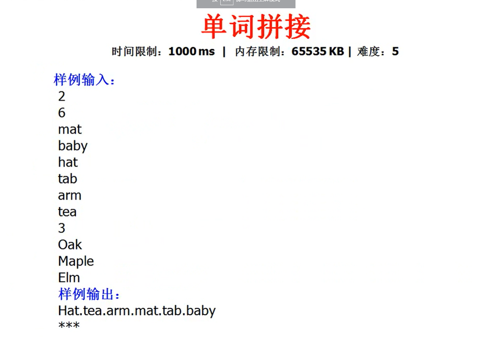
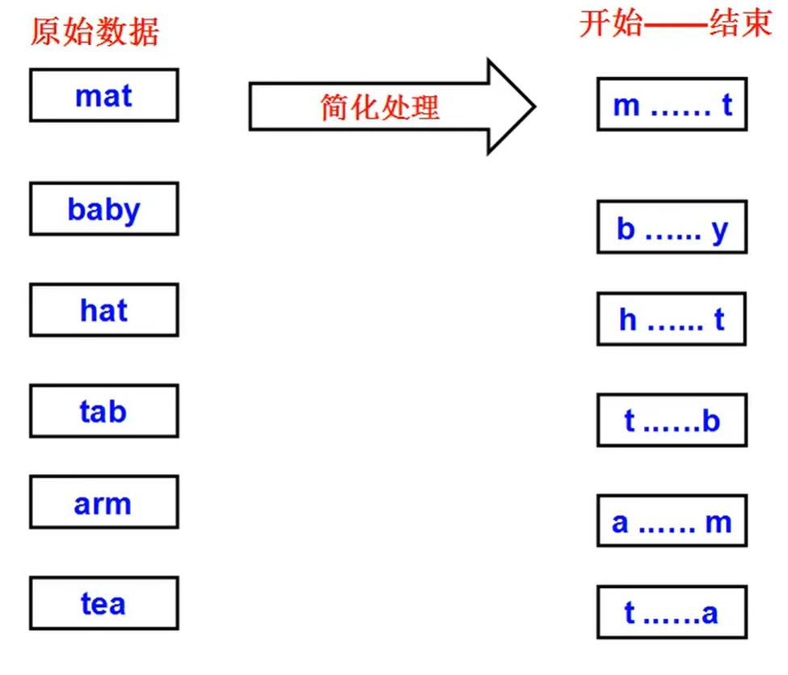
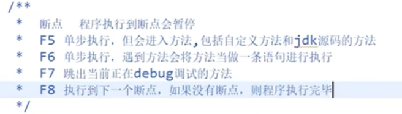
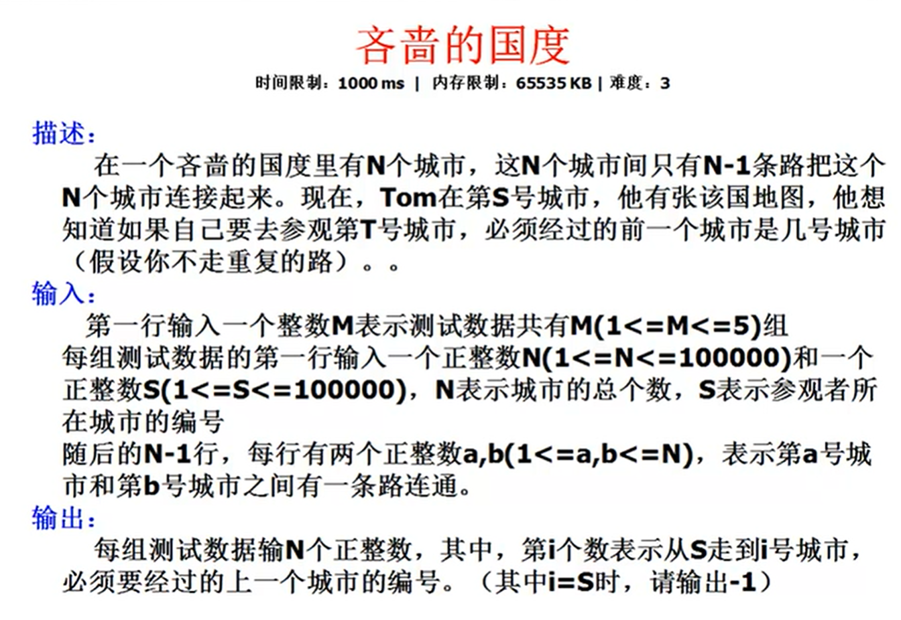

# 蓝桥杯培训内部2014年预赛讲解学习笔记

## 目录

- [蓝桥杯培训内部2014年预赛讲解学习笔记](#蓝桥杯培训内部2014年预赛讲解学习笔记)
  - [目录](#目录)
  - [李白打酒](#李白打酒)
  - [大数阶乘](#大数阶乘)
  - [单词拼接](#单词拼接)
    - [我的暴力解法:字典序预先排序+DFS+HashMap+回溯](#我的暴力解法字典序预先排序dfshashmap回溯)
  - [ACM导弹拦截](#acm导弹拦截)
    - [解题尝试1](#解题尝试1)
    - [解题尝试2:对于M的求解，似乎就是求最长递减子序列](#解题尝试2对于m的求解似乎就是求最长递减子序列)
    - [解题尝试3:正确解法，动态规划求解M，求最长递减子序列](#解题尝试3正确解法动态规划求解m求最长递减子序列)
  - [括号配对问题](#括号配对问题)
    - [单栈实现(我认为是最优解)](#单栈实现我认为是最优解)
    - [双栈实现：弄复杂了](#双栈实现弄复杂了)
  - [吝啬的国度](#吝啬的国度)
    - [广度优先遍历\_非递归实现](#广度优先遍历_非递归实现)
    - [深度优先遍历实现\_非递归实现](#深度优先遍历实现_非递归实现)
    - [深度优先\_递归实现](#深度优先_递归实现)
  - [01背包问题](#01背包问题)
    - [贪心算法的错误尝试](#贪心算法的错误尝试)
    - [动态规划解法](#动态规划解法)
  - [蛇形填数1](#蛇形填数1)
    - [尝试版本1：有bug](#尝试版本1有bug)
    - [尝试版本2：感觉是最优解了](#尝试版本2感觉是最优解了)
  - [蛇形填数2](#蛇形填数2)
  - [蛇形填数3](#蛇形填数3)

## 李白打酒


```java
public class _01_李白打酒 {
 public static void main(String[] args) {
  dfs(2, 5, 10);
  System.out.println(count);
  /*
   * 输出：
   * ababbbbbabababb
   * abbabbabbbababb
   * abbabbbaabbbabb
   * abbabbbabaabbbb
   * abbbaabbabbbabb
   * abbbaabbbaabbbb
   * abbbabaabbabbbb
   * baababbbbbababb
   * baabbabbabbbabb
   * baabbabbbaabbbb
   * baabbbaabbabbbb
   * babaababbbbbabb
   * babaabbabbabbbb
   * bababaababbbbbb
   * 14
   */
 }

 static int count = 0;
 static StringBuilder sb = new StringBuilder();

 static void dfs(int restWine/* 剩多少酒 */, int restShop/* 剩多少店没逢 */, int restFllower/* 剩多少朵花没遇 */) {
  if (restWine == 0 && restFllower == 0 && restShop == 0/* 喝完酒，遇完花，逢完店 */) {
   String string = sb.toString();
   if (string.charAt(string.length() - 1) == 'b'/* 只统计最后遇到的是花的情况 */) {
    System.out.println(string);
    count++;// 找到一种情况
   }
  } else {

   if (0 < restShop /* 还能遇到店 */  && restWine != 0 /* 是否需要保证没有提前把酒喝完？ 实测对最终统计结果没有影响，因为统计的是遇到花后喝掉一斗后剩余酒为0的情况，这就要求剩余酒量在遇到最后一朵花前至少为1 */) {
    sb.append("a");
    dfs(restWine + restWine/* 加一倍 */, restShop - 1, restFllower);
    sb.deleteCharAt(sb.length() - 1);// 回溯
   }
   if (  0 < restFllower /* 还能遇到花 */  && restWine != 0 /* 是否需要保证还有酒?,如果没有酒还喝酒就会导致剩余酒为负数，这种情况最后不会被统计在内，所以这个条件可写可不写，写就是剪枝的作用 */) {
    sb.append("b");
    dfs(restWine - 1/* 喝一斗 */, restShop, restFllower - 1);
    sb.deleteCharAt(sb.length() - 1);// 回溯
   }
  }
 }
}
```

## 大数阶乘


> **数组长度的粗略估计**  
> 也可以这样想，把 5000！看做是 5000 个 四位数相乘，  
> 一个四位数最多是9999，所以再简单粗暴点，直接看做是10000，  
> 这样也是就5000 个 10000相乘，结果就是5的后面 4x5000个0，也就是有 20000位


> **计算过程**  
> 假设已经计算出3的阶乘的每一位的数值的数组了，现在要计算4的阶乘，  
> 只需要把4乘上上一轮的数组中的每一位数，  
> 然后在统一处理进位的问题


> **数据长度的更新**  
> 可以在本轮的最后一位上判断是否存在进位，存在就扩展位数

**完整实现**

```java
import java.util.Arrays;

public class _02_大数阶乘 {
 public static void main(String[] args) {
  // 输出为：3628800 和计算器计算结果一致
  System.out.println(comput(10));

  // 输出为：93326215443944152681699238856266700490715968264381621468592963895217599993229915608941463976156518286253697920827223758251185210916864000000000000000000000000
  System.out.println(comput(100));

 }

 /*
  * num[j]中存的数的最大值是9，
  * num[j] 中能存储的最大值是Integer.MAX_VALUE
  * 所以N的最大值至少是 Integer.MAX_VALUE/9
  */
 static String comput(int N) {
  int[] num = new int[N * String.valueOf(N).length()/* 注意这个数组的大小是如何计算的，直接假设是n个和n位数相同的数相乘 */];
  num[0] = 1; // 初始化为1的阶乘
  int len = 1;// 数组中的有效位数为1
  // 依次求2的阶乘，3的阶乘,4的阶乘....指导n的阶乘
  for (int i = 2; i <= N; i++) {
   for (int j = 0; j < len; j++) {
    num[j] *= i;
   }
   // System.out.println(Arrays.toString(num));
   for (int j = 0; j < len; j++) {
    if (j == len - 1 /* 已在最后一位（最高位） */ && num[len - 1] / 10 != 0/* 还有进位未处理 */) {
     len++;
    }
    num[j + 1] += num[j] / 10;// 处理进位,低位向高位进
    num[j] %= 10;// 处理当前位，对10取余
   }
   // System.out.println(Arrays.toString(num));
  }
  StringBuilder sb = new StringBuilder();
  for (int i = 0; i < len; i++) {
   sb.append(num[i]);
  }
  sb.reverse();// 反转
  return sb.toString();
 }
}
```

## 单词拼接







**欧拉路**

- 整个图连通【重要前提】
- 只有一个节点的入度比出度大1
- 只有一个节点的出度比入度小1
  - 换句话说，有一节点入度为0出度为1，有另一节点出度为0，入度为1
  - 入度为0的点就是路径入口，出度为0的点就是路径出口
- 

**欧拉回路**

- 整个图连通【重要前提】
- 所有顶点的入度等于出度
- 就是说可以从任何一个节点作为节点，然后走完整个图的所有节点
- 这样起点可以是任何位置。
- 


**中途学习eclipse使用的笔记**



### 我的暴力解法:字典序预先排序+DFS+HashMap+回溯

```
输入
2
6
mat
baby
hat
tab
arm
tea
3
oak
maple
elm

输出
hat.tea.arm.mat.tab.baby
***
```

```java
import java.util.*;

public class _03_单词拼接 {
 public static void main(String[] args) {
  Scanner sc = new Scanner(System.in);
  int N = Integer.valueOf(sc.nextLine());
  List<String> res = new LinkedList<>();
  for (int i = 0; i < N; i++) {
   Graph g = new Graph();
   g.buildGraph(sc);
   res.add(g.dfs(null));// 把结果先存到数组中
  }
  sc.close();

  for (String str : res) {
   if (str != null) {
    System.out.println(str);
   } else {
    System.out.println("***");
   }
  }

 }
}

class Node implements Comparable<Node> {
 Character start, ended;
 String content;

 public Node(String content) {
  super();
  this.content = content;
  this.start = content.charAt(0);
  this.ended = content.charAt(content.length() - 1);
 }
 @Override
 public int compareTo(Node o) {
  // 这样先排序，再 DFS 搜索，找到的第一个答案就是题目要的字典序最小的答案
  // 否则则需要 DFS 搜索出所有的结果，然后再比较字典序
  
  // 这句是最关键的，有题目问，把一个字符串数组中的字符串拼接起来，找到使其拼接结果的字典序最小的字符串。其方法就是先对数组中的字符串排序，排序的比较方法就是这个函数：
  return (this.content + o.content).compareTo(o.content + this.content);
 }
}

class Edge {// 写了但没用
 Node from, to;

 public Edge(Node from, Node to) {
  super();
  this.from = from;
  this.to = to;
 }
}

class Graph {
 List<Node> nodes = new LinkedList<>();
 List<Edge> edges = new LinkedList<>();// 没有用
 Set<Node> used = new HashSet<>();
 HashMap<Character, List<Node>> startMap = new HashMap<>();// 这个实际上没有用
 HashMap<Character, List<Node>> endedMap = new HashMap<>();// 只有这个有用

 void buildGraph(Scanner sc) {
  int M = Integer.valueOf(sc.nextLine());// 注意要统一使用nextLine()
  for (int i = 0; i < M; i++) {
   String word = sc.nextLine();
   Node node = new Node(word);
   nodes.add(node);
   if (!startMap.containsKey(node.start)/* 防止未初始化 */) {
    startMap.put(node.start, new LinkedList<>());
   }
   if (!endedMap.containsKey(node.ended)) {
    endedMap.put(node.ended, new LinkedList<>());
   }
   startMap.get(node.start).add(node);
   endedMap.get(node.ended).add(node);
  }
  Collections.sort(nodes);// 排序，保证字典序最小
  for(List<Node> list :startMap.values()) {
   Collections.sort(list);// 排序，保证字典序最小
  }
  for(List<Node> list :endedMap.values()) {
   Collections.sort(list);// 排序，保证字典序最小
  }
 }

 LinkedList<String> result = new LinkedList<>();

 String dfs(Node current) {
  if (used.size() == nodes.size()) {
   StringBuilder sb = new StringBuilder();
   for (String item : result) {
    sb.append(item);
    sb.append('.');
   }
   if (result.size() >= 1) {
    sb.deleteCharAt(sb.length() - 1);
   }
   return sb.toString();

  } else if (current == null) {
   // 确定开头的元素
   for (Node cur : nodes /* 把所有节点依次当做开头位置，依次尝试 */) {
    used.add(cur);// 标记为使用
    result.add(cur.content);
    String res = dfs(cur);
    result.removeLast();// 回溯
    used.remove(cur);// 回溯
    if (res != null) {
     return res;// 找到答案，因为节点已经按字典序排序了，拼接起来的字符串一定是字典序最小的
    }
   }
  } else {
   // 确定当前字符串的下一个字符串
   if (startMap.containsKey(current.ended)/*直接查表：看是否有一个单词的开头是当前单词的结尾*/) {
    for (Node next : startMap.get(current.ended) /* 当前字符串的结尾，是下一个字符串的开头 */) {
     if (!used.contains(next)/* never used */) {
      used.add(next);// 标记为使用
      result.add(next.content);
      String res = dfs(next);
      result.removeLast();// 回溯
      used.remove(next);// 回溯
      if (res != null) {
       return res;// 找到答案
      }
     }
    }
   }
  }
  return null;// 没找到
 }
}
```

## ACM导弹拦截

```
防御导弹
Problem
某国为了防御敌国的导弹袭击，发展出一种导弹拦截系统。但是这种导弹拦截系统有一个缺陷：虽然它的第一发炮弹能够达到任意的高度，但是以后每一发炮弹都不能高于前一发的高度。某天，雷达捕捉到敌国的导弹来袭。由于该系统还在使用阶段，所以只有一套系统，因此有可能不能拦截所有的导弹。

Input
最多20个整数，分别表示导弹依次飞来的高度（雷达给出高度数据是不大于30000的正整数）

Output
两个整数M和N。表示：这套系统最多能拦截 M 枚导弹，如果要拦截所有导弹最少要配备 N 套这种导弹系统。

Sample Input
300 250 275 252 200 138 245

Sample Output
5 2
```

### 解题尝试1

> 实际上这个思路对N的求解似乎是正确的。
>
> 对M的求解似乎是错误的
>
> 这里对题意错误了，以为是导弹依次来袭，然后依次得知高度信息，实际上这里的意思是导弹同时来袭，同时得到高度信息。
>
> 是在知道所有导弹的高度信息的情况下做决策，而不是在依次知道高度信息的情况下做决策。
>

**思路**

最多20个整数就是最多20发导弹，

先考虑两个极端情况

假设来袭导弹的高度是递增的，那么拦截第一发后导弹后，第二发导弹就必须要另一套系统来拦截。

这样每一发导弹都需要另一套系统来拦截

假设来袭导弹的高度是递减的，那么一套系统就可以拦截所有导弹。

可以这样想，用现实的眼光来看，假设有20套系统，现在有一发导弹来袭，让哪一套系统来拦截？

当然是让拦截代价最低的系统来拦截，而拦截代价就是:(开火前能打高度 减去 开火后能打高度)，

这样对所有系统的剩余拦截高度范围的消耗最小。

```
输入
300 250 275 252 200 138 245
[138, 245, 30001, 30001, 30001, 30001, 30001, 30001, 30001, 30001, 30001, 30001, 30001, 30001, 30001, 30001, 30001, 30001, 30001, 30001]
输出：
[4, 3, 0, 0, 0, 0, 0, 0, 0, 0, 0, 0, 0, 0, 0, 0, 0, 0, 0, 0]
4
2
```

```java
import java.util.*;


public class _04_ACM导弹拦截 {
 public static void main(String[] args) {
  // 最多20发导弹
  Scanner sc = new Scanner(System.in);

  String[] inputs = sc.nextLine().split(" ");
  int[] heights = new int[inputs.length];// 20发导弹高度信息
  for (int i = 0; i < heights.length; i++) {
   heights[i]= Integer.valueOf(inputs[i]);
  }
  
  
  // 对于只有一套系统的情况，
  int sysOne = 30001;//剩余可拦截高度信息
  int cntOne = 0;//单系统拦截的导弹数统计
  for (int i = 0; i < heights.length; i++) {
   int targetHeight = heights[i];// 目标高度
   if(sysOne > targetHeight) {
    sysOne = targetHeight;
    cntOne++;
   }
  }

  // 对于有20套系统的情况：
  
  int len = 1;// 启用的拦截系统数
  int[] sys = new int[20];// 20套导弹拦截系统 剩余可拦截高度信息
  int[] cnt = new int[20];// 20套导弹拦截系统 单系统拦截的导弹数
  
  for (int i = 0; i < sys.length; i++) {
   sys[i]=30001;// 导弹的高度不超过30000（可能会等于），则系统初始最高可打的高度也设置成这个
  }

  for (int i = 0; i < heights.length; i++) {// 依次处理来袭导弹的高度信息
   int targetHeight = heights[i];// 目标高度
   
   int minCost = Integer.MAX_VALUE;
   int bestSys = -1;// 最终决定让谁开火
   for (int j = 0; j < len; j++) {// 遍历20套系统
    int cost = sys[j] - targetHeight;// 找到代价最小的策略
    if(sys[j] > targetHeight/*可以击落*/ && cost<minCost/*代价最小*/) {
     minCost=cost;
     bestSys = j;
    }
   }
   // 实在是无法拦截才启动增添新系统
   if(bestSys==-1/*依然无法*/&&len<sys.length/*还能增加系统，实际上不需要这个判断*/) {
    ++len;
    bestSys = len-1;
   }
   // 拦截
   sys[bestSys] = targetHeight;
   cnt[bestSys]++;// 统计开火次数
  }
  System.out.println(Arrays.toString(sys));
  System.out.println(Arrays.toString(cnt));
  
  System.out.println(cntOne);
  System.out.println(len);
 }
}
```

### 解题尝试2:对于M的求解，似乎就是求最长递减子序列

**思路**

实际上要明白一个问题，是不是每一发导弹都是能拦截就拦截，

如果是能拦截就拦截，那如果第一发导弹的高度是1，后续导弹的高度是 5 4 3 2

则只能拦截到第一发导弹，后续4发导弹都无法拦截，整个拦截系统都因第一发导弹而瘫痪

如果不拦截第一发导弹，则后续四发导弹都能拦截，这应该才是最优解。

对于任何一发导弹是否拦截，都要看后续有没有高度连续递减的导弹可以拦截。

> 对于M的求解，似乎就是求最长递减子序列。

```
输入
300 250 275 252 200 138 245
程序输出（不应该输出4）
4 2
```

```java
import java.util.*;

public class _05_ACM导弹拦截_错误解法求最长递减子序列 {
 public static void main(String[] args) {
  // 最多20发导弹
  Scanner sc = new Scanner(System.in);

  String[] inputs = sc.nextLine().split(" ");
  int[] heights = new int[inputs.length];// 20发导弹高度信息
  for (int i = 0; i < heights.length; i++) {
   heights[i] = Integer.valueOf(inputs[i]);
  }

  // 求最长递减子序列
  // 对于只有一套系统的情况，
  int maxLen = Integer.MIN_VALUE;
  for(int startIdx = 0/*开始位置*/;startIdx<heights.length;startIdx++) {
   int len =1;
   int prev= heights[startIdx];
   for(int curIdx=startIdx+1;curIdx<heights.length;curIdx++) {
    if(prev>heights[curIdx]) {
     len++;
     prev=heights[curIdx];// 这一步就错了，下一步是递减的，但下一步并不一定是长的走法，也许跳过这一步能走得更远
    }
   }
   System.out.println(len);
   if(maxLen<len) {
    maxLen=len;
   }
  }
  
  
  // 对于有20套系统的情况：

  int len = 1;// 启用的拦截系统数
  int[] sys = new int[20];// 20套导弹拦截系统 剩余可拦截高度信息
  int[] cnt = new int[20];// 20套导弹拦截系统 单系统拦截的导弹数

  for (int i = 0; i < sys.length; i++) {
   sys[i] = 30001;// 导弹的高度不超过30000（可能会等于），则系统初始最高可打的高度也设置成这个
  }

  for (int i = 0; i < heights.length; i++) {// 依次处理来袭导弹的高度信息
   int targetHeight = heights[i];// 目标高度

   int minCost = Integer.MAX_VALUE;
   int bestSys = -1;// 最终决定让谁开火
   for (int j = 0; j < len; j++) {// 遍历20套系统
    int cost = sys[j] - targetHeight;// 找到代价最小的策略
    if (sys[j] > targetHeight/* 可以击落 */ && cost < minCost/* 代价最小 */) {
     minCost = cost;
     bestSys = j;
    }
   }
   // 实在是无法拦截才启动增添新系统
   if (bestSys == -1/* 依然无法 */ && len < sys.length/* 还能增加系统，实际上不需要这个判断 */) {
    ++len;
    bestSys = len - 1;
   }
   // 拦截
   sys[bestSys] = targetHeight;
   cnt[bestSys]++;// 统计开火次数
  }
  System.out.println(maxLen+" "+len);
 }
}
```

### 解题尝试3:正确解法，动态规划求解M，求最长递减子序列

**动态规划求最长递减子序列**

```
看这样一个例子：
300 250 275 252 200 138 245

考虑以第1个数 300 结尾的递减子序列的长度：为1 就是 [300]   为什么？ 因为往前看没有任何数比自身大，那么算算上自身这一位 就是 1
考虑以第2个数 250 结尾的递减子序列的长度：为2 就是 [300,250]   为什么？ 因为往前看会有最近的300比自身大，而以300结尾的最长递减子序列长度为1，那么算算上自身这一位 就是 2
考虑以第3个数 275 结尾的递减子序列的长度：为2 就是 [300,275]   为什么？ 因为往前看会有最近的300比自身大，而以300结尾的最长递减子序列长度为1，那么算算上自身这一位 就是 2
考虑以第4个数 252 结尾的递减子序列的长度：为3 就是 [300,275,252]   为什么？ 因为往前看会有最近的275比自身大，而以275结尾的最长递减子序列长度为2，那么算算上自身这一位 就是 3
考虑以第5个数 200 结尾的递减子序列的长度：为4 就是 [300,275,252,200] 为什么？ 因为往前看会有最近的252比自身大，而以252结尾的最长递减子序列长度为3，那么算算上自身这一位 就是 4
考虑以第6个数 138 结尾的递减子序列的长度：为5 就是 [300,275,252,200,138] 为什么？ 因为往前看会有最近的200比自身大，而以200结尾的最长递减子序列长度为4，那么算算上自身这一位 就是 5
考虑以第7个数 245 结尾的递减子序列的长度：为4 就是 [300,275,252,245]  为什么？ 因为往前看会有最近的252比自身大，而以252结尾的最长递减子序列长度为3，那么算算上自身这一位 就是 4
```

```
输入
300 250 275 252 200 138 245
程序输出（输出正确！！！！）
5 2
```

```java
import java.util.*;

public class _06_ACM导弹拦截_动态规划求最长递减子序列 {
 public static void main(String[] args) {
  // 最多20发导弹
  Scanner sc = new Scanner(System.in);

  String[] inputs = sc.nextLine().split(" ");
  int[] heights = new int[inputs.length];// 20发导弹高度信息
  for (int i = 0; i < heights.length; i++) {
   heights[i] = Integer.valueOf(inputs[i]);
  }

  // 求最长递减子序列
  // 对于只有一套系统的情况，
  int[] dp=new int[heights.length];
  int maxLen = Integer.MIN_VALUE;
  for(int curIdx = 0/*开始位置*/;curIdx<heights.length;curIdx++) {
   int len = 1 ;
   for(int preIdx=curIdx;0<=preIdx;preIdx--) {// 往前找
    if(heights[preIdx]>heights[curIdx]) {
     len+=dp[preIdx];
     break;
    }
   }
   dp[curIdx]=len;
   if(maxLen<len) {
    maxLen=len;
   }
  }
  System.out.println(Arrays.toString(dp));
  
  
  // 对于有20套系统的情况：

  int len = 1;// 启用的拦截系统数
  int[] sys = new int[20];// 20套导弹拦截系统 剩余可拦截高度信息
  int[] cnt = new int[20];// 20套导弹拦截系统 单系统拦截的导弹数

  for (int i = 0; i < sys.length; i++) {
   sys[i] = 30001;// 导弹的高度不超过30000（可能会等于），则系统初始最高可打的高度也设置成这个
  }

  for (int i = 0; i < heights.length; i++) {// 依次处理来袭导弹的高度信息
   int targetHeight = heights[i];// 目标高度

   int minCost = Integer.MAX_VALUE;
   int bestSys = -1;// 最终决定让谁开火
   for (int j = 0; j < len; j++) {// 遍历20套系统
    int cost = sys[j] - targetHeight;// 找到代价最小的策略
    if (sys[j] > targetHeight/* 可以击落 */ && cost < minCost/* 代价最小 */) {
     minCost = cost;
     bestSys = j;
    }
   }
   // 实在是无法拦截才启动增添新系统
   if (bestSys == -1/* 依然无法 */ && len < sys.length/* 还能增加系统，实际上不需要这个判断 */) {
    ++len;
    bestSys = len - 1;
   }
   // 拦截
   sys[bestSys] = targetHeight;
   cnt[bestSys]++;// 统计开火次数
  }
  System.out.println(maxLen+" "+len);
 }
}
```

## 括号配对问题


非常简单

### 单栈实现(我认为是最优解)

```
输入
5
{}{}
[][]
()()
[()]{}
[[[}}}

输出
Yes
Yes
Yes
Yes
No
```

```java
import java.util.*;

public class _08_括号配对问题_单栈实现_最优解 {
 public static void main(String[] args) {
  Scanner sc = new Scanner(System.in);
  int N = Integer.valueOf(sc.nextLine());
  List<Boolean> result = new LinkedList<>();
  for (int i = 0; i < N; i++) {
   result.add(check(sc.nextLine()));
  }
  sc.close();
  for (Boolean res : result) {
   if (res)
    System.out.println("Yes");
   else
    System.out.println("No");
  }
 }
 static boolean check(String expression) {
  Stack<Character> left = new Stack<>();
  for (char ch : expression.toCharArray()) {
   if (ch == '(' || ch == '[' || ch == '{'/*右括号*/) {
    left.push(ch);// 压入栈
    continue;
   }else if(ch == ')' || ch == ']' || ch == '}'/*左括号*/) {
    Character R = ch;
    Character L= !left.isEmpty() ? left.pop():null;
    if(L!=null && ((L == '[' && R == ']') || (L == '(' && R == ')') || (L == '{' && R == '}'))/*右括号应当能和栈顶元素匹配*/) {
     continue;
    }else {
     return false;
    }
   }
  }
  return left.size()==0;// 一定要栈空！
 }
}
```

### 双栈实现：弄复杂了

```java
import java.util.*;

public class _08_括号配对问题_单栈实现_最优解 {
 public static void main(String[] args) {
  Scanner sc = new Scanner(System.in);
  int N = Integer.valueOf(sc.nextLine());
  List<Boolean> result = new LinkedList<>();
  for (int i = 0; i < N; i++) {
   result.add(check(sc.nextLine()));
  }
  sc.close();
  for (Boolean res : result) {
   if (res)
    System.out.println("Yes");
   else
    System.out.println("No");
  }
 }
 static boolean check(String expression) {
  Stack<Character> left = new Stack<>();
  for (char ch : expression.toCharArray()) {
   if (ch == '(' || ch == '[' || ch == '{'/*右括号*/) {
    left.push(ch);// 压入栈
    continue;
   }else if(ch == ')' || ch == ']' || ch == '}'/*左括号*/) {
    Character R = ch;
    Character L= !left.isEmpty() ? left.pop():null;
    if(L!=null && ((L == '[' && R == ']') || (L == '(' && R == ')') || (L == '{' && R == '}'))/*右括号应当能和栈顶元素匹配*/) {
     continue;
    }else {
     return false;
    }
   }
  }
  return true;
 }
}
```

## 吝啬的国度




```
样例输入：
1
10 1
1 9
1 8
8 10
10 3
8 6
1 2
10 4
9 5
3 7
样例输出:
-1 1 10 10 9 8 3 1 1 8
```

### 广度优先遍历_非递归实现

**程序输入输出**

```
输入
1
10 1
1 9
1 8
8 10
10 3
8 6
1 2
10 4
9 5
3 7
输出
[-1, 1, 10, 10, 9, 8, 3, 1, 1, 8]


输入
1
10 8
1 9
1 8
8 10
10 3
8 6
1 2
10 4
9 5
3 7
输出
[8, 1, 10, 10, 9, 8, 3, -1, 1, 8]
```

```java
import java.util.*;

public class _09_吝啬的国度_广度优先遍历bfs_非递归实现 {
 public static void main(String[] args) {
  Scanner sc = new Scanner(System.in);
  Graph g = new Graph();
  int k = sc.nextInt();
  for (int i = 0; i < k; i++) {
   g.create(sc);
   System.out.println(Arrays.toString(g.bfs()));
  }
 }

 static class Node {
  Set<Edge> froms = new HashSet<>();
  Set<Edge> nexts = new HashSet<>();
  int idx;

  public Node(int idx) {
   super();
   this.idx = idx;
  }
 }

 static class Edge {
  Node from, to;

  public Edge(Node from, Node to) {
   super();
   this.from = from;
   this.to = to;
  }
 }

 static class Graph {
  Set<Node> nodes = new HashSet<>();
  Set<Edge> edges = new HashSet<>();
  Map<Integer, Node> idxToNode = new HashMap<>();

  int initIdx;
  int N;
  void create(Scanner sc) {
   N = sc.nextInt();// 总节点数
   initIdx = sc.nextInt();// 初始位置
   for (int i = 0; i < N - 1/* n-1条边 */; i++) {
    int idxA = sc.nextInt();
    int idxB = sc.nextInt();
//    System.out.println(idxA + "<--->" + idxB);
    Node nodeA, nodeB;

    if (!idxToNode.containsKey(idxA)) {
     nodeA = new Node(idxA);
     idxToNode.put(idxA, nodeA);
     nodes.add(nodeA);
    }
    if (!idxToNode.containsKey(idxB)) {
     nodeB = new Node(idxB);
     idxToNode.put(idxB, nodeB);
     nodes.add(nodeB);
    }

    nodeA = idxToNode.get(idxA);
    nodeB = idxToNode.get(idxB);

    Edge edgeA2B = new Edge(nodeA, nodeB);// 无向图
    Edge edgeB2A = new Edge(nodeB, nodeA);
//    nodeA.froms.add(edgeB2A);
//    nodeB.froms.add(edgeA2B);
    nodeA.nexts.add(edgeA2B);
    nodeB.nexts.add(edgeB2A);
    edges.add(edgeA2B);
    edges.add(edgeB2A);
   }
  }

//  Map<Integer, Integer> result = new HashMap<>();
  

  
  int[] bfs() {
   int[] result= new int[N];
   Set<Node> visited = new HashSet<>();
   Queue<Node> queue = new LinkedList<>();
   Node from = idxToNode.get(initIdx);
   visited.add(from);
   result[from.idx - 1] = -1;
   queue.add(from);
   while (!queue.isEmpty()) {
    Node cur = queue.poll();
    visited.add(cur);
    for (Edge edge : cur.nexts) {
     Node next = edge.to;
     if (!visited.contains(next)) {
      result[next.idx - 1] = cur.idx;
      queue.add(next);
     }
    }
   }
   return result;
  }
 }
}
```

### 深度优先遍历实现_非递归实现

**程序输入输出**

```
输入
1
10 1
1 9
1 8
8 10
10 3
8 6
1 2
10 4
9 5
3 7
输出
[-1, 1, 10, 10, 9, 8, 3, 1, 1, 8]
```

```java
import java.util.*;

public class _09_吝啬的国度_深度度优先dfs_非递归实现 {
 public static void main(String[] args) {
  Scanner sc = new Scanner(System.in);
  Graph g = new Graph();
  int k = sc.nextInt();
  for (int i = 0; i < k; i++) {
   g.create(sc);
   System.out.println(Arrays.toString(g.dfs()));
  }
 }

 static class Node {
  Set<Edge> froms = new HashSet<>();
  Set<Edge> nexts = new HashSet<>();
  int idx;

  public Node(int idx) {
   super();
   this.idx = idx;
  }
 }

 static class Edge {
  Node from, to;

  public Edge(Node from, Node to) {
   super();
   this.from = from;
   this.to = to;
  }
 }

 static class Graph {
  Set<Node> nodes = new HashSet<>();
  Set<Edge> edges = new HashSet<>();
  Map<Integer, Node> idxToNode = new HashMap<>();

  int initIdx;
  int N;
  void create(Scanner sc) {
   N = sc.nextInt();// 总节点数
   initIdx = sc.nextInt();// 初始位置
   for (int i = 0; i < N - 1/* n-1条边 */; i++) {
    int idxA = sc.nextInt();
    int idxB = sc.nextInt();
//    System.out.println(idxA + "<--->" + idxB);
    Node nodeA, nodeB;

    if (!idxToNode.containsKey(idxA)) {
     nodeA = new Node(idxA);
     idxToNode.put(idxA, nodeA);
     nodes.add(nodeA);
    }
    if (!idxToNode.containsKey(idxB)) {
     nodeB = new Node(idxB);
     idxToNode.put(idxB, nodeB);
     nodes.add(nodeB);
    }

    nodeA = idxToNode.get(idxA);
    nodeB = idxToNode.get(idxB);

    Edge edgeA2B = new Edge(nodeA, nodeB);// 无向图
    Edge edgeB2A = new Edge(nodeB, nodeA);
//    nodeA.froms.add(edgeB2A);
//    nodeB.froms.add(edgeA2B);
    nodeA.nexts.add(edgeA2B);
    nodeB.nexts.add(edgeB2A);
    edges.add(edgeA2B);
    edges.add(edgeB2A);
   }
  }

//  Map<Integer, Integer> result = new HashMap<>();
  

  // 深度优先遍历
  int[] dfs() {
   Set<Node> visited = new HashSet<>();
   int[] result= new int[N];
   Node from = idxToNode.get(initIdx);
   Stack<Node> stack = new Stack<>();
   visited.add(from);
   result[from.idx - 1] = -1;
   stack.push(from);
   while (!stack.isEmpty()) {
    Node cur = stack.pop();
    visited.add(cur);
    for (Edge edge : cur.nexts) {
     Node next = edge.to;
     if (!visited.contains(next)) {
      result[next.idx - 1] = cur.idx;
      stack.push(next);
     }
    }
   }
   return result;
  }
 }
}
```

### 深度优先_递归实现

```java
import java.util.*;

public class _09_吝啬的国度_深度优先遍历dfs_递归实现 {
 public static void main(String[] args) {
  Scanner sc = new Scanner(System.in);
  Graph g = new Graph();
  int k = sc.nextInt();
  for (int i = 0; i < k; i++) {
   g.create(sc);
   g.dfs(null);
   System.out.println(Arrays.toString(g.result));
  }
 }

 static class Node {
  Set<Edge> froms = new HashSet<>();
  Set<Edge> nexts = new HashSet<>();
  int idx;

  public Node(int idx) {
   super();
   this.idx = idx;
  }
 }

 static class Edge {
  Node from, to;

  public Edge(Node from, Node to) {
   super();
   this.from = from;
   this.to = to;
  }
 }

 static class Graph {
  Set<Node> nodes = new HashSet<>();
  Set<Edge> edges = new HashSet<>();
  Map<Integer, Node> idxToNode = new HashMap<>();

  int initIdx;
  int N;

  void create(Scanner sc) {
   N = sc.nextInt();// 总节点数
   result = new int[N];
   initIdx = sc.nextInt();// 初始位置
   for (int i = 0; i < N - 1/* n-1条边 */; i++) {
    int idxA = sc.nextInt();
    int idxB = sc.nextInt();
//    System.out.println(idxA + "<--->" + idxB);
    Node nodeA, nodeB;

    if (!idxToNode.containsKey(idxA)) {
     nodeA = new Node(idxA);
     idxToNode.put(idxA, nodeA);
     nodes.add(nodeA);
    }
    if (!idxToNode.containsKey(idxB)) {
     nodeB = new Node(idxB);
     idxToNode.put(idxB, nodeB);
     nodes.add(nodeB);
    }

    nodeA = idxToNode.get(idxA);
    nodeB = idxToNode.get(idxB);

    Edge edgeA2B = new Edge(nodeA, nodeB);// 无向图
    Edge edgeB2A = new Edge(nodeB, nodeA);
//    nodeA.froms.add(edgeB2A);
//    nodeB.froms.add(edgeA2B);
    nodeA.nexts.add(edgeA2B);
    nodeB.nexts.add(edgeB2A);
    edges.add(edgeA2B);
    edges.add(edgeB2A);
   }
  }

//  Map<Integer, Integer> result = new HashMap<>();
  Set<Node> visited = new HashSet<>();
  int[] result;
  void dfs(Node from) {
   if (from == null) {
    from = idxToNode.get(initIdx);
    visited.add(from);
//    result.put(from.idx, -1);
    result[from.idx-1]=-1;
   }
   
   for (Edge edge : from.nexts) {
    Node next = edge.to;
//    System.out.println(from.idx + "->" + next.idx);
    if (next != from/* 防止走回头路 */&& !visited.contains(next)) {
     visited.add(next);
//     result.put(next.idx, from.idx);
     result[next.idx-1]=from.idx;
     dfs(next);
    }
   }
  }
 }
}
```

## 01背包问题

```
有 N 件物品和一个容量是 V 的背包。每件物品只能使用一次。

第 i 件物品的体积是 vi，价值是 wi。

求解将哪些物品装入背包，可使这些物品的总体积不超过背包容量，且总价值最大。
输出最大价值。

输入格式
第一行两个整数，N，V，用空格隔开，分别表示物品数量和背包容积。

接下来有 N 行，每行两个整数 vi,wi，用空格隔开，分别表示第 i 件物品的体积和价值。

输出格式
输出一个整数，表示最大价值。

数据范围
0<N,V≤1000
0<vi,wi≤1000
输入样例
4 5
1 2
2 4
3 4
4 5
输出样例：
8
```

**三种解法**

- 暴力穷举
- 动态规划
- 贪心算法

### 贪心算法的错误尝试

```java
import java.util.*;

public class _10_01背包问题 {
 public static void main(String[] args) {
  Scanner sc = new Scanner(System.in);
  int N = sc.nextInt();// 物品数
  int V = sc.nextInt();// 背包容量
  Item[] items = new Item[N];
  for (int i = 0; i < N; i++) {
   items[i] = new Item(sc.nextInt(), sc.nextInt());
  }
  sc.close();
  
  
  // 思路是利用排序算法的稳定性来实现
  Arrays.sort(items,(o1, o2) -> {
   return Integer.compare(o1.weight, o2.weight);// 体积小的在前面
  });
  
  Arrays.sort(items,(o1, o2) -> {
   return -Integer.compare(o1.value, o2.value);//  价值大的相对在前
  });
  
  System.out.println(Arrays.toString(items));
  int valTotal = 0;
  for(int i=0;i<items.length;i++) {
   
   if(items[i].weight<=V) {
    System.out.println(items[i]);
    
    V-=items[i].weight;
    valTotal+=items[i].value;
   }
  }
  System.out.println(valTotal);
 }

 static class Item {
  int weight, value;
  public Item(int value, int weight) {
   super();
   this.weight = weight;
   this.value = value;
  }
  @Override
  public String toString() {
   return "Item [weight=" + weight + ", value=" + value + "]";
  }
 }

}
```

### 动态规划解法

```
dp[i][j] = 价值
表示，从物品0~i中任取，放到容量为j的背包中的最大价值
```

```java
import java.util.*;

public class _10_01背包问题_动态规划尝试 {
 public static void main(String[] args) {
  Scanner sc = new Scanner(System.in);
  int N = sc.nextInt();// 物品数
  int V = sc.nextInt();// 背包容量
  int[] values = new int[N];
  int[] volume = new int[N];

  for (int i = 0; i < N; i++) {
   volume[i] = sc.nextInt();
   values[i] = sc.nextInt();
  }
  sc.close();
//  dp[把第i个物品][放入容量为j的背包的]=总价值
//  dp[把第i个物品][放入容量为j的背包的]=dp[i-1][j-weight[i]]+value[i]
  int[][] dp = new int[N][V + 1];
  for (int j = 0; j < V + 1; j++) {
   dp[0][j] = volume[0] <= j ? values[0] : 0;
  }
  int resMaxVal = 0;
  for (int i = 1; i < N; i++) {
   for (int j = 0; j < V + 1; j++) {
    dp[i][j] = volume[i] <= j
      ? Math.max(dp[i - 1][j - volume[i]] + values[i], dp[i - 1][j])
      : dp[i - 1][j];
    if (dp[i][j] > resMaxVal) {
     resMaxVal = dp[i][j];
    }
   }

  }
  System.out.println(resMaxVal);

 }
}
```

## 蛇形填数1


### 尝试版本1：有bug

```
输入
4
输出
[10, 11, 12, 1]
[9, 0, 13, 2]
[8, 15, 14, 3]
[7, 6, 5, 4]
```

```java
import java.util.*;
public class _11_蛇形填数 {
 public static void main(String[] args) {
  Scanner sc = new Scanner(System.in);
  int N = sc.nextInt();
  sc.close();
  int[][] nums = new int[N][N];
  int left=0,right=N-1,
   top=0,bottom=N-1;
  int y=0,x=N-1;
  int num=1;
  while(left<=right&&top<=bottom) {
   while(y<bottom) nums[y++][x]=num++;
   while(left<x) nums[y][x--]=num++;
   while(top<y) nums[y--][x]=num++;
   while(x<right-1) nums[y][x++]=num++;
   top++;
   left++;
   right--;
   bottom--;
  }
  for (int i = 0; i < nums.length; i++) {
   System.out.println(Arrays.toString(nums[i])); 
  }
 }
}
```

### 尝试版本2：感觉是最优解了

```
输入
5
输出
[14, 15, 16, 17, 1]
[13, 25, 26, 18, 2]
[12, 24, 27, 19, 3]
[11, 23, 21, 20, 4]
[10, 8, 7, 6, 5]
```

```java
import java.util.*;
public class _11_蛇形填数 {
 public static void main(String[] args) {
  Scanner sc = new Scanner(System.in);
  int N = sc.nextInt();
  sc.close();
  int[][] nums = new int[N][N];
  int left=0,right=N-1,// 二维数组的最左侧、最右侧、最顶部、最底部
   top=0,bottom=N-1;
  int num=1;
  while(left<=right&&top<=bottom) {
   for(int y=top;y<=bottom;y++) {// 最左侧一列   
    nums[y][right]=num++;
   }
   for(int x=right-1;left<=x;x--) {// 最底部一行  
    nums[bottom][x]=num++;
   }
   for(int y=bottom;top+1<=y;y--) {// 最右侧一列  
    nums[y][left]=num++;
   }
   for(int x=left;x<=right-1;x++) {// 最顶部一行 
    nums[top][x]=num++;
   }
   left++;right--;// 缩小边框范围
   top++;bottom--;
  }
  for (int i = 0; i < nums.length; i++) {
   System.out.println(Arrays.toString(nums[i])); 
  }
 }
}
```

## 蛇形填数2


```
输入
4
输出
[16, 15, 14, 13]
[5, 4, 3, 12]
[6, 1, 2, 11]
[7, 8, 9, 10]
```

```java
import java.util.*;
public class _11_蛇形填数2 {
 public static void main(String[] args) {
  Scanner sc = new Scanner(System.in);
  int N = sc.nextInt();
  sc.close();
  int[][] nums = new int[N][N];
  int left=0,right=N-1,// 二维数组的最左侧、最右侧、最顶部、最底部
   top=0,bottom=N-1;
  int num=N*N;
  while(left<=right&&top<=bottom) {
   for(int x=left;x<=right;x++) {// 最顶部一行 
    nums[top][x]=num--;
   }
   for(int y=top+1;y<=bottom;y++) {// 最左侧一列   
    nums[y][right]=num--;
   }
   for(int x=right-1;left<=x;x--) {// 最底部一行  
    nums[bottom][x]=num--;
   }
   for(int y=bottom-1;top+1<=y;y--) {// 最右侧一列  
    nums[y][left]=num--;
   }
   left++;right--;// 缩小边框范围
   top++;bottom--;
  }
  for (int i = 0; i < nums.length; i++) {
   System.out.println(Arrays.toString(nums[i])); 
  }
 }
}
```

## 蛇形填数3


**我的思路**

对于左上角的数字，看成是填充矩阵的对角线，矩阵的宽分别为1,2,3,....N;

对于右下角的数字，看成是填充矩阵对角线，矩阵的宽度分别为 N-1,N-2,....1;,矩阵相对于填充数组的位置分别为 1，2，3，...N-1;


```java
import java.util.*;
public class _11_蛇形填数3 {
 public static void main(String[] args) {
  Scanner sc = new Scanner(System.in);
  int N = sc.nextInt();
  sc.close();
  int[][] nums = new int[N][N];
  int num = 1;
  int len=1;
  while(len<=N) {
   if(len%2==0) {// 方向不同
    for (int i = 0; i < len; i++) {
     nums[i][len-i-1]=num++;// 遍历矩阵对角线
    } 
   }else {
    for (int i = 0; i < len; i++) {
     nums[len-i-1][i]=num++;// 遍历矩阵对角线
    }
   }
   len++;
  }
  len=N-1;
  int offset =1;
  while(1<=len) {
   if(len%2==0) {// 方向不同
    for (int i = 0; i < len; i++) {
     nums[offset+i][offset+len-i-1]=num++;// 遍历矩阵对角线，相对于原数组的偏移为offset
    } 
   }else {
    for (int i = 0; i < len; i++) {
     nums[offset+len-i-1][offset+i]=num++;// 遍历矩阵对角线
    }
   }
   offset++;
   len--;
  }
  for (int i = 0; i < nums.length; i++) {
   System.out.println(Arrays.toString(nums[i])); 
  }
 }
}
```
