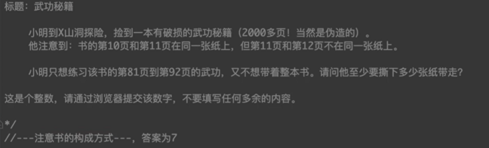
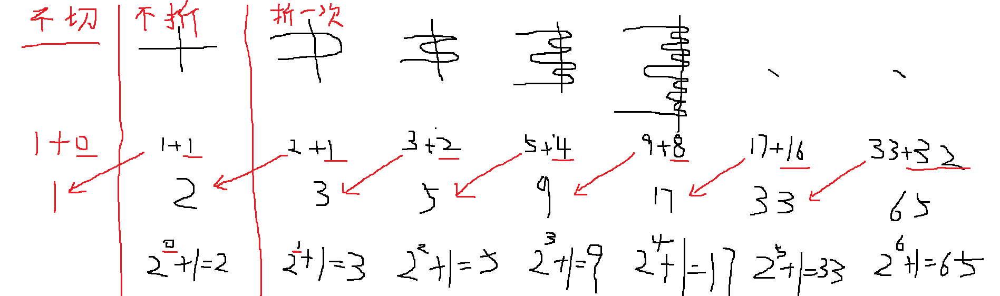
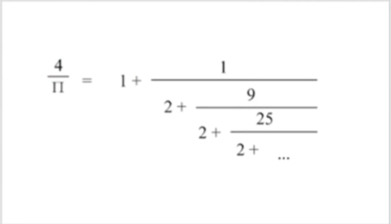

# 蓝桥杯 2014 年 javaB 组真题刷题笔记

## 目录

- [蓝桥杯 2014 年 javaB 组真题刷题笔记](#蓝桥杯-2014-年-javab-组真题刷题笔记)
  - [目录](#目录)
  - [\[01\]武功秘籍](#01武功秘籍)
  - [\[02\]切面条](#02切面条)
  - [\[03\]猜字母](#03猜字母)
  - [\[04\]大衍数列](#04大衍数列)
  - [\[05\]圆周率](#05圆周率)
  - [\[06\]奇怪的分式](#06奇怪的分式)
  - [\[07\]扑克排序](#07扑克排序)
  - [\[08\]分糖果](#08分糖果)
  - [\[09\]地宫取宝](#09地宫取宝)
  - [\[10\]矩阵翻硬币](#10矩阵翻硬币)

## [01]武功秘籍



> **思路**
>
> - 书的结构推导: [n,m]表示在一张纸上
> - [10-11] [12-13] [14,15] [16,17] [18,19]
> - [20-21] [22-23] [24,25] [26,27] [28,29]
> - ......略
> - [80-81] [82-83] [84,85] [86,87] [88,89] 5 张纸
> - [90-91] [92-93] [94,95] [96,97] [98,99] 2 张纸
> - 所以一共 7 张纸

## [02]切面条


**两种思路**


## [03]猜字母


```java
package 蓝桥杯历年真题刷题笔记._2014_java_B_;

public class _03_猜字母 {
 public static void main(String[] args) {
  char[] str = new char[2014];
  for (int i = 0; i < 106; i++) {// 拼接106次
   for (int j = 0; j < 19; j++) {// 构成a-s的字符序列
    str[i * 19 + j] = (char) ('a' + j);
   }
  }
  int len = 2014;
  while (len != 1) {
   int next = 0;
   for (int i = 0; i < len; i++) {
    if ((i + 1) % 2 == 1) {// 下标是奇数
     len--;// 长度缩减
    } else {// 下标是偶数
     str[next++] = str[i];// 往前挪
    }
   }
  }
  System.out.println(str[0]);
 }
}

```

## [04]大衍数列


> 坑：对偶数项，意思是对于偶数项，不是“对偶数”项

```java
package 蓝桥杯历年真题刷题笔记._2014_java_B_;

public class _04_大衍数列 {
 public static void main(String[] args) {
  for (int i = 1; i < 100; i++) {
   if (i % 2 == 0)
    System.out.println(i * i / 2);
   else
    System.out.println((i * i - 1) / 2);
  }
 }
}
```

## [05]圆周率




> **注意**  
> 图中不是 11 是 π ，眼花了
> $$\frac{4}{π}=1+\frac{1}{2+\frac{9}{2+\frac{25}{2+...}}}$$
> 或者说：
> $$\frac{4}{π}=1+\frac{1^2}{2+\frac{3^2}{2+\frac{5^2}{2+...}}}$$

> **坑**
>
> - 要注意，n 最后等于 0，i 最后等于 1，
> - 所以最后
>
> $$x=2+\frac{1}{2+\frac{9}{2+\frac{29}{...}}}$$
>
> 所以 x 要减 1
>
> $$\frac{4}{π}=(x-1)$$ > $$\frac{1}{π}=\frac{x-1}{4}$$ > $$π=\frac{4}{x-1}$$

```java
package 蓝桥杯历年真题刷题笔记._2014_java_B_;

public class _05_圆周率 {
 public static void main(String[] args) {
  double x = 111;
  for (int n = 10000; n >= 0; n--) {
   int i = 2 * n + 1;// 保证i是奇数,最后i=1 !!!!!!!!!!!!!!!
   x = 2 + (i * i / x);// 要注意x是图中的哪一部分
  }
  System.out.println(String.format("%.4f",4/(x-1)));
  // 3.1415
 }
}
```

## [06]奇怪的分式

上小学的时候，小明经常自己发明新算法。一次，老师出的题目是：1/4 乘以 8/5 ，小明居然把分子拼接在一起，分母拼接在一起，答案是：18/45 （参见下图）


老师刚想批评他，转念一想，这个答案凑巧也对啊，真是见鬼！对于分子、分母都是 1~9 中的一位数的情况，还有哪些算式可以这样计算呢？请写出所有不同算式的个数（包括题中举例的）。显然，交换分子分母后，例如：4/1 乘以 5/8 是满足要求的，这算做不同的算式。但对于分子分母相同的情况，2/2 乘以 3/3 这样的类型太多了，不在计数之列!

注意：答案是个整数（考虑对称性，肯定是偶数）。请通过浏览器提交

> **思路，**
>
> - 枚举,然后判断约分后的分式是否相等
>
> **要注意，**
>
> - 小数也许可能会在运算的过程中丢失精度，
> - 从而导致两个分式由于运算顺序的不同或者数的大小不同而结果不同，
> - 反正使用 double 做浮点数运算很可能会得到错误的结果

**正确解法 1:使用有理分数表示**

```java
package 蓝桥杯历年真题刷题笔记._2014_java_B_;

public class _06_奇怪的分式 {
 public static void main(String[] args) {
  int count = 0;
  for (int n1_a = 1; n1_a <= 9; n1_a++) {
   for (int n1_b = 1; n1_b <= 9; n1_b++) {
    if (n1_a == n1_b)// 分子分母相等的情况不算
     continue;

    for (int n2_a = 1; n2_a <= 9; n2_a++) {
     for (int n2_b = 1; n2_b <= 9; n2_b++) {
      if (n2_a == n2_b)// 分子分母相等的情况不算
       continue;

      Frac f1 = new Frac(n1_a, n1_b);
      Frac f2 = new Frac(n2_a, n2_b);
      Frac f3 = new Frac(n1_a * 10 + n2_a, n1_b * 10 + n2_b);

      // f1*f2 == f3;
      if (f1.multiple(f2).equals(f3)) {
       count++;

       System.out.printf("%d/%d*%d/%d==%d/%d\n",
         n1_a, n1_b,
         n2_a, n2_b,
         n1_a * 10 + n2_a,
         n1_b * 10 + n2_b);
      }

     }
    }
   }
  }

  System.out.printf("共有%d种。", count);
  /*
   * 输出：
   * 1/2*5/4==15/24
   * 1/4*8/5==18/45
   * 1/6*4/3==14/63
   * 1/6*6/4==16/64
   * 1/9*9/5==19/95
   * 2/1*4/5==24/15
   * 2/6*6/5==26/65
   * 4/1*5/8==45/18
   * 4/9*9/8==49/98
   * 6/1*3/4==63/14
   * 6/1*4/6==64/16
   * 6/2*5/6==65/26
   * 9/1*5/9==95/19
   * 9/4*8/9==98/49
   * 共有14种。
   */
 }

 static class Frac {
  int ra;
  int rb;

  public Frac(int ra, int rb) {
   this.ra = ra;
   this.rb = rb;
   int k = gcd(ra, rb);
   if (k > 1) {//约分
    this.ra /= k;
    this.rb /= k;
   }
  }

  Frac multiple(Frac obj) {
   return new Frac(
     this.ra * obj.ra,
     this.rb * obj.rb);
  }
  // Greatest Common Divisor(GCD)
  static int gcd(int a, int b) {
   return b == 0 ? a : gcd(b, a % b);
  }

  public boolean equals(Frac obj) {
   return (this.ra == obj.ra && this.rb == obj.rb);
  }
 }
}
```

**正确解法 2：分数的乘法运算后约分**

```java
package 蓝桥杯历年真题刷题笔记._2014_java_B_;

public class _06_奇怪的分式 {
 public static void main(String[] args) {
  int count = 0;
  for (int n1_a = 1; n1_a <= 9; n1_a++) {
   for (int n1_b = 1; n1_b <= 9; n1_b++) {
    if (n1_a == n1_b)// 分子分母相等的情况不算
     continue;
    for (int n2_a = 1; n2_a <= 9; n2_a++) {
     for (int n2_b = 1; n2_b <= 9; n2_b++) {
      if (n2_a == n2_b)// 分子分母相等的情况不算
       continue;

      // 第三个分式
      int n3_a = n1_a * 10 + n2_a;
      int n3_b = n1_b * 10 + n2_b;
      int d3 = gcd(n3_a,n3_b);// 约分
      n3_a/=d3;
      n3_b/=d3;

      // 前两个分数的乘积
      int multiple_a = n1_a*n2_a;// 分式的乘法:(分子x分子)/(分母x分母)
      int multiple_b = n1_b*n2_b;// 分式的乘法:(分子x分子)/(分母x分母)
      int multiple_d = gcd(multiple_a,multiple_b);
      multiple_a/=multiple_d;// 约分
      multiple_b/=multiple_d;

      // 两个数都经过了约分，都是最简分式，如果分子除分母相等，说明两分子和分母各相等，
      // 所以也可以直接比较分子分母是否相等,本质上和使用有理分数表示法等效。
      double res1 = multiple_a/(double)multiple_b;
      double res2 = n3_a/(double)n3_b;
      if (res1 == res2) {
       count++;
       System.out.printf(
         "%d/%d*%d/%d==%d/%d\n",
         n1_a, n1_b,
         n2_a, n2_b,
         n1_a * 10 + n2_a,
         n1_b * 10 + n2_b);
      }

     }
    }
   }
  }
  // 1/2*5/4==15/24
  // 1/4*8/5==18/45
  // 1/6*4/3==14/63
  // 1/6*6/4==16/64
  // 1/9*9/5==19/95
  // 2/1*4/5==24/15
  // 2/6*6/5==26/65
  // 4/1*5/8==45/18
  // 4/9*9/8==49/98
  // 6/1*3/4==63/14
  // 6/1*4/6==64/16
  // 6/2*5/6==65/26
  // 9/1*5/9==95/19
  // 9/4*8/9==98/49
  // 共有14种。
  System.out.printf("共有%d种。", count);
 }

 static int gcd(int a, int b) {
  return b == 0 ? a : gcd(b, a % b);
 }
}
```

**错误解法 1：使用浮点数运算计算分数乘法**

```java
package 蓝桥杯历年真题刷题笔记._2014_java_B_;

public class _06_奇怪的分式 {
 public static void main(String[] args) {
  int count = 0;
  for (int n1_a = 1; n1_a <= 9; n1_a++) {
   for (int n1_b = 1; n1_b <= 9; n1_b++) {
    if (n1_a == n1_b)// 分子分母相等的情况不算
     continue;
    for (int n2_a = 1; n2_a <= 9; n2_a++) {
     for (int n2_b = 1; n2_b <= 9; n2_b++) {
      if (n2_a == n2_b)// 分子分母相等的情况不算
       continue;

      int n3_a = n1_a * 10 + n2_a;
      int n3_b = n1_b * 10 + n2_b;

      double k1 = n1_a / (double) n1_b;
      double k2 = n2_a / (double) n2_b;
      double k3 = n3_a / (double) n3_b;

      // 浮点数运算
      if (k1 * k2 == k3) {
       count++;
       System.out.printf(
         "%d/%d*%d/%d==%d/%d\n",
         n1_a, n1_b,
         n2_a, n2_b,
         n1_a * 10 + n2_a,
         n1_b * 10 + n2_b);
      }

     }
    }
   }
  }
  System.out.printf("共有%d种。", count);
  /*
   * 1/2*5/4==15/24
   * 1/4*8/5==18/45
   * 1/6*4/3==14/63
   * 1/6*6/4==16/64
   * 2/1*4/5==24/15
   * 4/1*5/8==45/18
   * 4/9*9/8==49/98
   * 6/1*3/4==63/14
   * 6/1*4/6==64/16
   * 6/2*5/6==65/26
   * 9/1*5/9==95/19
   * 9/4*8/9==98/49
   * 共有12种。
   */
 }
}

```

**错误解法 2：约分后，仍然使用浮点数运算计算分数乘法**

```java
package 蓝桥杯历年真题刷题笔记._2014_java_B_;

public class _06_奇怪的分式 {
 public static void main(String[] args) {
  int count = 0;
  for (int n1_a = 1; n1_a <= 9; n1_a++) {
   for (int n1_b = 1; n1_b <= 9; n1_b++) {
    if (n1_a == n1_b)// 分子分母相等的情况不算
     continue;
    for (int n2_a = 1; n2_a <= 9; n2_a++) {
     for (int n2_b = 1; n2_b <= 9; n2_b++) {
      if (n2_a == n2_b)// 分子分母相等的情况不算
       continue;

      int n3_a = n1_a * 10 + n2_a;
      int n3_b = n1_b * 10 + n2_b;

      // 分别求最大公约数
      int d1 = gcd(n1_a, n1_b);
      int d2 = gcd(n2_a, n2_b);
      int d3 = gcd(n3_a, n3_b);

      // 分别约分后求商
      double k1 = (n1_a / d1) / ((double) n1_b / d1);
      double k2 = (n2_a / d2) / ((double) n2_b / d2);
      double k3 = (n3_a / d3) / ((double) n3_b / d3);

      // 使用浮点数运算计算分数乘法
      if (k1 * k2 == k3) {
       count++;
       System.out.printf(
         "%d/%d*%d/%d==%d/%d\n",
         n1_a, n1_b,
         n2_a, n2_b,
         n1_a * 10 + n2_a,
         n1_b * 10 + n2_b);
      }

     }
    }
   }
  }
  /*
   * 输出
   * 1/2*5/4==15/24
   * 1/4*8/5==18/45
   * 1/6*4/3==14/63
   * 1/6*6/4==16/64
   * 2/1*4/5==24/15
   * 4/1*5/8==45/18
   * 4/9*9/8==49/98
   * 6/1*3/4==63/14
   * 6/1*4/6==64/16
   * 6/2*5/6==65/26
   * 9/1*5/9==95/19
   * 9/4*8/9==98/49
   * 共有12种。
   */

  System.out.printf("共有%d种。", count);
 }

 static int gcd(int a, int b) {
  return b == 0 ? a : gcd(b, a % b);
 }
}
```

## [07]扑克排序

AA223344，一共 4 对扑克牌。请你把它们排成一行。

要求：两个 A 中间有 1 张牌，两个 2 之间有 2 张牌，两个 3 之间有 3 张牌，两个 4 之间有 4 张牌。

4A3A2432， 2342A3A4

请填写出所有符合要求的排列中，字典序最小的那个。
例如：

22AA3344 比 A2A23344 字典序小。当然，它们都不是满足要求的答案。

请通过浏览器提交答案。“A”一定不要用小写字母 a，也不要用“1”代替。字符间一定不要留空格。

> **思路**
>
> - 全排列所有字符构成字符串
> - 检查字符串是否满足要求然后添加到列表中
> - 对列表中的字符串排序，对于字符串会默认根据字典序排序
> - 列表中第 0 个就是字典序最小的字符串。

**check_v2：使用 String 类的 API 做检查**

```java
package 蓝桥杯历年真题刷题笔记._2014_java_B_;

import java.util.ArrayList;
import java.util.Collections;
import java.util.HashSet;
import java.util.List;
import java.util.Set;

public class _07_扑克排序 {
 public static void main(String[] args) {
  f(arr, 0);
  List<String> list = new ArrayList<>();
  list.addAll(result_set);
  Collections.sort(list);// 排序后，第一个就是字典序最小的
  System.out.println(list);
  System.out.println(list.get(0));
  // 输出：
  // 2342A3A4
 }

 static char[] arr = { 'A', 'A', '2', '2', '3', '3', '4', '4' };
 static Set<String> result_set = new HashSet<>();

 static void f(char[] arr, int step) {
  if (step == arr.length) {
   String str = new String(arr);
   if (check_v2(str)) {
    result_set.add(str);
   }
  } else {
   for (int i = step; i < arr.length; i++) {
    exchange(arr, step, i);
    f(arr, step + 1);
    exchange(arr, step, i);
   }
  }
 }

 private static boolean check_v2(String str) {
  // 应该直接使用API提高做题效率
  return (str.lastIndexOf('A') - str.indexOf('A') + 1 == 2 + 1 &&
    str.lastIndexOf('2') - str.indexOf('2') + 1 == 2 + 2 &&
    str.lastIndexOf('3') - str.indexOf('3') + 1 == 2 + 3 &&
    str.lastIndexOf('4') - str.indexOf('4') + 1 == 2 + 4);
 }

 static void exchange(char[] arr, int i, int j) {
  if (i != j) {
   arr[i] = (char) (arr[i] ^ arr[j]);
   arr[j] = (char) (arr[i] ^ arr[j]);
   arr[i] = (char) (arr[i] ^ arr[j]);
  }
 }
}
```

**check_v1：变量统计字符数**

```java
package 蓝桥杯历年真题刷题笔记._2014_java_B_;

import java.util.ArrayList;
import java.util.Collections;
import java.util.HashSet;
import java.util.List;
import java.util.Set;

public class _07_扑克排序 {
 public static void main(String[] args) {
  f(arr, 0);
  List<String> list = new ArrayList<>();
  list.addAll(result_set);
  Collections.sort(list);// 排序后，第一个就是字典序最小的
  System.out.println(list);
  System.out.println(list.get(0));
  // 输出：
  // 2342A3A4
 }

 static char[] arr = { 'A', 'A', '2', '2', '3', '3', '4', '4' };
 static Set<String> result_set = new HashSet<>();

 static void f(char[] arr, int step) {
  if (step == arr.length) {
   if (check_v1(arr)) {
    StringBuilder sb = new StringBuilder();
    for (int num : arr) {
     sb.append((char) num);
    }
    result_set.add(sb.toString());
   }
  } else {
   for (int i = step; i < arr.length; i++) {
    exchange(arr, step, i);
    f(arr, step + 1);
    exchange(arr, step, i);
   }
  }
 }

 private static boolean check_v1(char[] arr) {

  boolean enA = false;
  boolean en2 = false;
  boolean en3 = false;
  boolean en4 = false;
  int countA = 0;
  int count2 = 0;
  int count3 = 0;
  int count4 = 0;

  for (int i = 0; i < arr.length; i++) {

   if (arr[i] == 'A' && !enA)// 碰到第一个A,开始计数
    enA = true;
   else if (arr[i] == 'A' && enA)// 碰到最后一个A,停止计数
    enA = false;
   if (enA && arr[i] != 'A')// 当前字符不是A且已开启计数,则统计两A之间的字符数
    countA++;

   if (arr[i] == '2' && !en2)
    en2 = true;
   else if (arr[i] == '2' && en2)
    en2 = false;
   if (en2 && arr[i] != '2')
    count2++;

   if (arr[i] == '3' && !en3)
    en3 = true;
   else if (arr[i] == '3' && en3)
    en3 = false;
   if (en3 && arr[i] != '3')
    count3++;

   if (arr[i] == '4' && !en4)
    en4 = true;
   else if (arr[i] == '4' && en4)
    en4 = false;
   if (en4 && arr[i] != '4')
    count4++;
  }
  return (countA == 1 &&
    count2 == 2 &&
    count3 == 3 &&
    count4 == 4);
 }

 static void exchange(char[] arr, int i, int j) {
  if (i != j) {
   arr[i] = (char) (arr[i] ^ arr[j]);
   arr[j] = (char) (arr[i] ^ arr[j]);
   arr[i] = (char) (arr[i] ^ arr[j]);
  }
 }
}
```

## [08]分糖果

题目描述

问题描述

有 n 个小朋友围坐成一圈。老师给每个小朋友随机发偶数个糖果，然后进行下面的游戏：

每个小朋友都把自己的糖果分一半给左手边的孩子。

一轮分糖后，拥有奇数颗糖的孩子由老师补给 1 个糖果，从而变成偶数。

反复进行这个游戏，直到所有小朋友的糖果数都相同为止。

你的任务是预测在已知的初始糖果情形下，老师一共需要补发多少个糖果。

输入

程序首先读入一个整数 N(2< N< 100)，表示小朋友的人数。

接着是一行用空格分开的 N 个偶数（每个偶数不大于 1000，不小于 2）

输出

要求程序输出一个整数，表示老师需要补发的糖果数。

样例输入

3

2 2 4

样例输出

4

```java
package 蓝桥杯历年真题刷题笔记._2014_java_B_;

import java.util.Arrays;
import java.util.Scanner;

public class _08_分糖果 {
 public static void main(String[] args) {
  Scanner sc = new Scanner(System.in);
  int N = sc.nextInt();
  int arr[] = new int[N];
  int half[] = new int[N];
  int ans = 0;
  for (int i = 0; i < arr.length; i++) {
   arr[i] = sc.nextInt();
  }
  sc.close();

  while (!isSame(arr)) {
   for (int i = 0; i < arr.length; i++) {
    half[i] = arr[i] / 2;// 拿出一半
    arr[i] -= half[i];// 减少
   }
   for (int i = 0; i < arr.length; i++) {
    arr[i] += half[(i + 1) % arr.length];// 当前的获取隔壁的一半
   }
   for (int i = 0; i < arr.length; i++) {
    if (arr[i] % 2 == 1) {
     arr[i]++;// 糖果是奇数，补一颗
     ans++;// 计数
    }
   }
   System.out.println(Arrays.toString(arr));
  }
  System.out.println(ans);
 }

 // 数组中所有数都一样
 static boolean isSame(int[] arr) {
  int k = arr[0];
  for (int i = 0; i < arr.length; i++) {
   if (arr[i] != k)
    return false;
  }
  return true;
 }
}
```

## [09]地宫取宝

题目描述
X 国王有一个地宫宝库，是 n × m n × mn×m 个格子的矩阵，每个格子放一件宝贝，每个宝贝贴着价值标签。

地宫的入口在左上角，出口在右下角。

小明被带到地宫的入口，国王要求他只能向右或向下行走。

走过某个格子时，如果那个格子中的宝贝价值比小明手中任意宝贝价值都大，小明就可以拿起它（当然，也可以不拿）。

当小明走到出口时，如果他手中的宝贝恰好是 k kk 件，则这些宝贝就可以送给小明。

请你帮小明算一算，在给定的局面下，他有多少种不同的行动方案能获得这 k kk 件宝贝。

输入格式
第一行 3 个整数，n , m , k 含义见题目描述。
接下来 n 行，每行有 m 个整数 C_i 用来描述宝库矩阵每个格子的宝贝价值。

输出格式
输出一个整数，表示正好取 k kk 个宝贝的行动方案数。

该数字可能很大，输出它对 1000000007 10000000071000000007 取模的结果。

样例输入 1：
2 2 2
1 2
2 1

样例输出 1：
2

样例输入 2：
2 3 2
1 2 3
2 1 5

样例输出 2：
14

数据范围
$ 1 ≤ n , m ≤ 50 $
$ 1 ≤ k ≤ 12 $
$ 0 ≤ C_i ≤ 12 $

**优化前：暴力递归解法**

```java
package 蓝桥杯历年真题刷题笔记._2014_java_B_;

import java.util.ArrayList;
import java.util.List;
import java.util.Scanner;

public class _09_地宫取宝 {

 static int N = 0;
 static int M = 0;
 static int K = 0;

 public static void main(String[] args) {
  Scanner sc = new Scanner(System.in);
  N = sc.nextInt();
  M = sc.nextInt();
  K = sc.nextInt();
  int[][] matrix = new int[N][M];
  for (int x = 0; x < N; x++) {
   for (int y = 0; y < M; y++) {
    matrix[x][y] = sc.nextInt();
   }
  }
  sc.close();
  f(matrix, 1, 0, 0);
  System.out.println(count);
 }

 static List<Integer> list = new ArrayList<>();
 static int count = 0;

 static void f(int[][] matrix, int step, int cur_x, int cur_y) {
  if (cur_x == N - 1 && cur_y == M - 1) {// 走到最后一个格子
   // 已经拾取足够数量的宝物，计数
   if (list.size() == K)
    count++;
   // 未拾取足够数量宝物，但是拾取当前位置的宝物即可满足条件，计数
   if (list.size() == K - 1 && isMaxNumAtList(list, matrix[cur_x][cur_y]))
    count++;
  } else if (cur_x < N && cur_y < M) {
   int val = matrix[cur_x][cur_y];
   // 当前值若比拥有的值都要大
   if (isMaxNumAtList(list, val)) {
    // 可以拿

    // 可以拿 然后拿
    list.add(val);
    f(matrix, step + 1, cur_x + 1, cur_y + 0);// 往右走
    f(matrix, step + 1, cur_x + 0, cur_y + 1);// 往下走
    list.remove(list.size() - 1);// 回溯

    // 可以拿 但不拿
    f(matrix, step + 1, cur_x + 1, cur_y + 0);// 往右走
    f(matrix, step + 1, cur_x + 0, cur_y + 1);// 往下走

   } else {
    // 不可以拿 不拿
    f(matrix, step + 1, cur_x + 1, cur_y + 0);// 往右走
    f(matrix, step + 1, cur_x + 0, cur_y + 1);// 往下走
   }
  }
 }

 static boolean isMaxNumAtList(List<Integer> list, int val) {
  for (Integer item : list) {
   if (val <= item)
    return false;
  }
  return true;
 }
}
```

**优化后：带记忆的暴力递归**

```java
package 蓝桥杯历年真题刷题笔记._2014_java_B_;

import java.util.HashMap;
import java.util.Map;
import java.util.Scanner;

public class _09_地宫取宝 {

 public static void main(String[] args) {
  Scanner sc = new Scanner(System.in);
  N = sc.nextInt();
  M = sc.nextInt();
  K = sc.nextInt();
  for (int x = 0; x < N; x++) {
   for (int y = 0; y < M; y++) {
    matrix[x][y] = sc.nextInt();
   }
  }
  sc.close();
  int res = f(0, 0, 0, -1);
  System.out.println(res);
 }

 static int N = 0;
 static int M = 0;
 static int K = 0;
 static int[][] matrix = new int[50][50];
 static int count = 0;

 static Map<State, Integer> map = new HashMap<>();

 static int f(int cur_x, int cur_y, int bagSize, int bagMaxVal) {
  if (cur_x == N - 1 && cur_y == M - 1) {// 走到最后一个格子
   // 已经拾取足够数量的宝物，计数
   if (bagSize == K) {
    return 1;
   } else
   // 未拾取足够数量宝物，但是拾取当前位置的宝物即可满足条件，计数
   if (bagSize == K - 1 && (bagMaxVal < matrix[cur_x][cur_y])) {
    return 1;
   } else {
    return 0;
   }
  } else if (cur_x < N && cur_y < M) {
   State curState = new State(cur_x, cur_y, bagSize, bagMaxVal);
   if (map.containsKey(curState)) {
    return map.get(curState);
   } else {
    int cnt = 0;
    int curVal = matrix[cur_x][cur_y];
    // 当前值若比拥有的值都要大
    if (bagMaxVal < curVal) {
     // 可以拿

     // 可以拿 然后拿
     cnt += f(cur_x + 1, cur_y, bagSize + 1, curVal);// 往右走
     cnt += f(cur_x, cur_y + 1, bagSize + 1, curVal);// 往下走

     // 可以拿 但不拿
     cnt += f(cur_x + 1, cur_y, bagSize, bagMaxVal);// 往右走
     cnt += f(cur_x, cur_y + 1, bagSize, bagMaxVal);// 往下走

    } else {
     // 不可以拿 不拿
     cnt += f(cur_x + 1, cur_y, bagSize, bagMaxVal);// 往右走
     cnt += f(cur_x, cur_y + 1, bagSize, bagMaxVal);// 往下走
    }
    map.put(curState, cnt);
    return cnt;
   }
  }
  return 0;
 }

 public static class State {

  int x, y, bagSize, bagMaxVal;

  public State(int x, int y, int bagSize, int bagMaxVal) {
   this.x = x;
   this.y = y;
   this.bagSize = bagSize;
   this.bagMaxVal = bagMaxVal;
  }

  @Override
  public int hashCode() {
   final int prime = 31;
   int result = 1;
   result = prime * result + x;
   result = prime * result + y;
   result = prime * result + bagSize;
   result = prime * result + bagMaxVal;
   return result;
  }

  @Override
  public boolean equals(Object obj) {
   if (this == obj)
    return true;
   if (obj == null)
    return false;
   if (getClass() != obj.getClass())
    return false;
   State other = (State) obj;
   if (x != other.x)
    return false;
   if (y != other.y)
    return false;
   if (bagSize != other.bagSize)
    return false;
   if (bagMaxVal != other.bagMaxVal)
    return false;
   return true;
  }

 }

}
```

## [10]矩阵翻硬币

问题描述
　　小明先把硬币摆成了一个 n 行 m 列的矩阵。

随后，小明对每一个硬币分别进行一次 Q 操作。

对第 x 行第 y 列的硬币进行 Q 操作的定义：将所有第 i*x 行，第 j*y 列的硬币进行翻转。

其中 i 和 j 为任意使操作可行的正整数，行号和列号都是从 1 开始。

当小明对所有硬币都进行了一次 Q 操作后，他发现了一个奇迹——所有硬币均为正面朝上。

小明想知道最开始有多少枚硬币是反面朝上的。于是，他向他的好朋友小 M 寻求帮助。

聪明的小 M 告诉小明，只需要对所有硬币再进行一次 Q 操作，即可恢复到最开始的状态。然而小明很懒，不愿意照做。于是小明希望你给出他更好的方法。帮他计算出答案。

输入格式
　　输入数据包含一行，两个正整数 n m，含义见题目描述。

输出格式
　　输出一个正整数，表示最开始有多少枚硬币是反面朝上的。

样例输入

2 3

样例输出

1

数据规模和约定

对于 10%的数据，n、m <= 10^3；

对于 20%的数据，n、m <= 10^7；

对于 40%的数据，n、m <= 10^15；

对于 10%的数据，n、m <= 10^1000（10 的 1000 次方）。

**思路**


- 很容易得出，如果一枚硬币被翻了奇数次，那么它原来的状态肯定是反面朝上，所以，我们要找的就是被翻了奇数次的硬币
- Q 操作的定义：将所有第 i*x 行，第 j*y 列的硬币进行翻转。正向看可能不好想，那么我们反向看一下，对于一个横坐标为 N 的硬币，在翻哪些硬币（横坐标 x）的时候会翻到它呢？其实就是这个数 N 所有的约数，比如横坐标为 4 的硬币，那么，在翻横坐标为 1，2，4 的硬币时都会翻到它，纵坐标的情况是一样的。
- 对于一个硬币，我们必须同时考虑其横坐标 x 和纵坐标 y，假如横坐标被翻了 a 次，纵坐标被翻了 b 次，则这个硬币总共被翻了 a\*b 次，若想要这个硬币被翻奇数次，a 和 b 必须都得是奇数，即 x 和 y 都有奇数个约数
- 那么问题来了：哪些数有奇数个约数呢？不管你知不知道，反正现在你知道了，完全平方数有奇数个约数。那么什么又是完全平方数呢，简单的说就是 n^2，n 为自然数，也就是 0，2，4，9……
- 问题又来了，怎么求完全平方数的个数呢，首先，我们已经知道了这个矩阵式 n*m 的，而且是从 1 开始编号的，对于 n，我们可以求 sqrt（n），然后取整，容易想出，在 1-n 的范围内的完全平方数的个数为（int）（sqrt（n））个，而 sqrt（n）*sqrt（m）就是所有的横纵坐标都是完全平方数的硬币的个数。

```java
package 蓝桥杯历年真题刷题笔记._2014_java_B_;

import java.math.BigInteger;
import java.util.Scanner;

public class _10_矩阵翻硬币 {
 public static void main(String[] args) {
  Scanner sc = new Scanner(System.in);
  BigInteger M = new BigInteger(sc.next());// 需要读取字符串，不能使用sc.nextInt,因为数值很大
  BigInteger N = new BigInteger(sc.next());
  sc.close();
  System.out.println(M.sqrt().multiply(N.sqrt()));
 }
}
```
