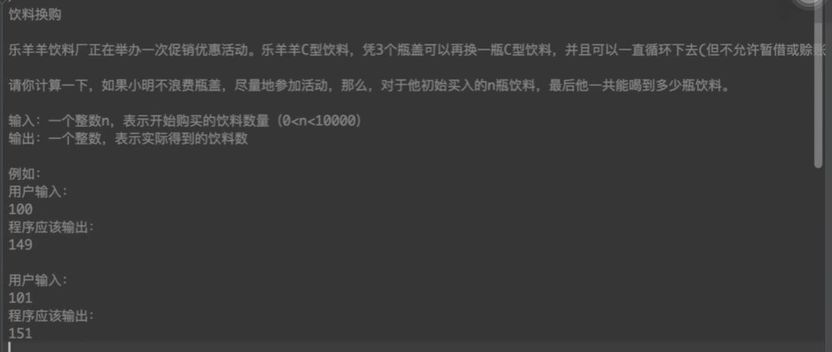
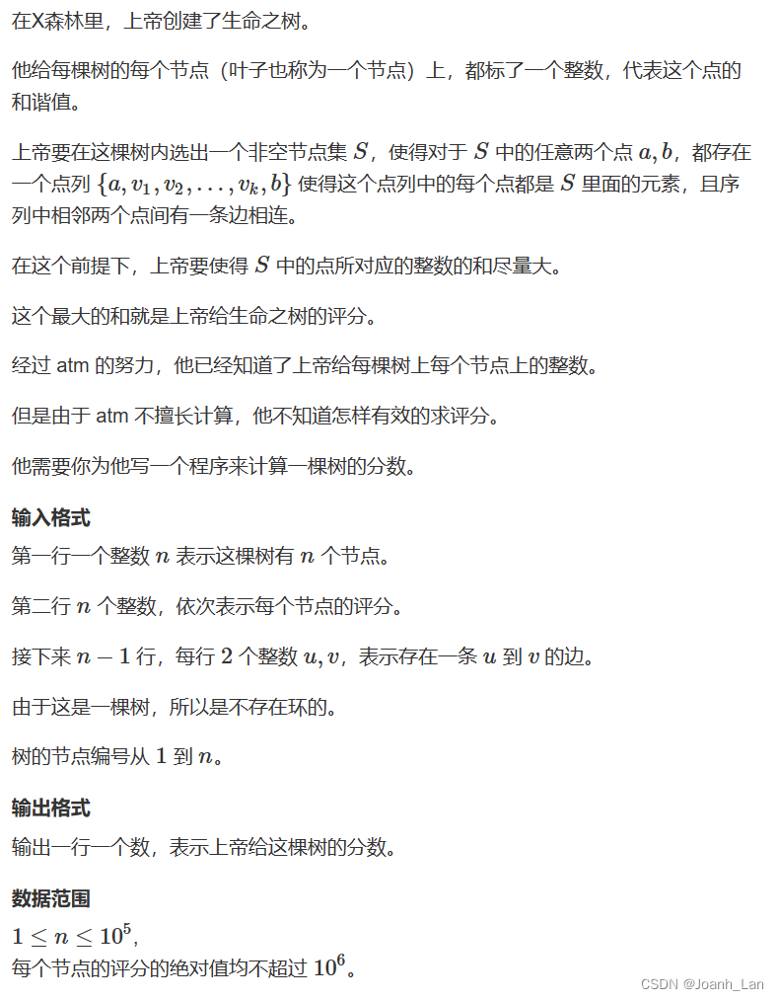

# 蓝桥杯 2015 年 javaB 组真题刷题笔记

## 目录

- [蓝桥杯 2015 年 javaB 组真题刷题笔记](#蓝桥杯-2015-年-javab-组真题刷题笔记)
  - [目录](#目录)
  - [\[01\]三角形面积](#01三角形面积)
  - [\[02\]立方变自身](#02立方变自身)
  - [\[03\]三羊献瑞](#03三羊献瑞)
  - [\[04\]循环节长度](#04循环节长度)
  - [\[05\]九数组分数](#05九数组分数)
  - [\[06\]加法变乘法](#06加法变乘法)
  - [\[07\]牌型种类](#07牌型种类)
    - [优化版](#优化版)
    - [暴力版：for 循环](#暴力版for-循环)
    - [模拟过程版：无法出结果，时间复杂度 13^13](#模拟过程版无法出结果时间复杂度-1313)
  - [\[08\]饮料换购](#08饮料换购)
    - [易于理解版](#易于理解版)
    - [优化](#优化)
  - [\[09\]垒骰子](#09垒骰子)
    - [递归模拟法:极度耗时，可以拿到 10%的分数](#递归模拟法极度耗时可以拿到-10的分数)
    - [记忆性递归:速度非常快，但是 N 极大时，栈会溢出，可以拿到 60%的分数](#记忆性递归速度非常快但是-n-极大时栈会溢出可以拿到-60的分数)
    - [递归改非递归：解决栈溢出错误，但内存溢出报错。](#递归改非递归解决栈溢出错误但内存溢出报错)
    - [改成动态规划版：n==10000000 时 5 秒出答案](#改成动态规划版n10000000-时-5-秒出答案)
    - [最优解法：求冲突矩阵的幂](#最优解法求冲突矩阵的幂)
      - [**前置知识：快速幂运算**](#前置知识快速幂运算)
      - [矩阵乘法和矩阵的幂运算](#矩阵乘法和矩阵的幂运算)
  - [\[10\]生命之树](#10生命之树)
    - [次优解：递归方式实现，存在栈溢出问题](#次优解递归方式实现存在栈溢出问题)
    - [最优解：非递归方式实现](#最优解非递归方式实现)

## [01]三角形面积

三角形面积

如图 1 所示。图中的所有小方格面积都是 1。那么，图中的三角形面积应该是多少呢?

请填写三角形的面积。不要填写任何多余内容或说明性文字。


$=\text{大正方形面积}-\text{三个小三角形的面积}$

$=8*8-4*8/2 - 6*4/2 - 2*8/2$

$=64-16-12-8$

$=64-36$

$=28$

## [02]立方变自身

立方变自身

观察下面的现象,某个数字的立方，按位累加仍然等于自身。 1^3 = 1 8^3 = 512 5+1+2=8 17^3 = 4913 4+9+1+3=17 …

请你计算包括 1,8,17 在内，符合这个性质的正整数一共有多少个？

请填写该数字，不要填写任何多余的内容或说明性的文字。

```java
package 蓝桥杯历年真题刷题笔记._2015_java_B_;


public class _02_立方变自身 {
 public static void main(String[] args) {
  for (int i = 1; i <= 1000; i++) {
   int i_3 = i * i * i;
   String i_3_str = i_3 + "";
   if (strToEachNumSun(i_3_str)==i) {
    System.out.println(i);
   }
  }
  // 输出
  // 1
  // 8
  // 17
  // 18
  // 26
  // 27
 }

 static int strToEachNumSun(String str) {
  char[] chars = str.toCharArray();
  int num = 0;
  for (int i = 0; i < chars.length; i++) {
   num += chars[i] - '0';
  }
  return num;
 }
}
```

## [03]三羊献瑞

 

```
   a b c d
 + e f g b
-------------------
 e f c b k

由于只有abcd efgk 七个数是独立的，所以只需要暴力枚举，从0~9中选8个数的排序


```

```java
package 蓝桥杯历年真题刷题笔记._2015_java_B_;

import java.util.ArrayList;
import java.util.Arrays;
import java.util.HashSet;
import java.util.List;
import java.util.Map;
import java.util.Set;

public class _03_三羊献瑞 {
 public static void main(String[] args) {
  f(0);
 }

 static boolean[] selectted = new boolean[10];
 static int[] nums = new int[8];

 static void f(int step) {
  if (step == nums.length) {
   //// a b c d
   // + e f g b
   // -------------------
   // e f c b k
   if (//
                 nums[0] * 1000 + nums[1] * 100 + nums[2] * 10 + nums[3] +
                 nums[4] * 1000 + nums[5] * 100 + nums[6] * 10 + nums[1] ==
              nums[4] * 10000 + nums[5] * 1000 + nums[2] * 100 + nums[1] * 10 + nums[7] &&
                   nums[0]!=0 &&
                 nums[4]!=0
     )
    System.out.println(Arrays.toString(nums));
  } else {
   for (int i = 0; i < selectted.length; i++) {
    if (!selectted[i]) {
     selectted[i] = true;
     nums[step] = i;
     f(step + 1);
     selectted[i] = false;
    }
   }
  }
 }
}
```

## [04]循环节长度

循环节长度

两个整数做除法，有时会产生循环小数，其循环部分称为：循环节。

比如，11/13=6=>0.846153846153..... 其循环节为[846153] 共有 6 位。

下面的方法，可以求出循环节的长度。

请仔细阅读代码，并填写划线部分缺少的代码。 1

```
    public static int f(int n, int m)
    {
        n = n % m;
        Vector v = new Vector();

        for(;;)
        {
            v.add(n);
            n *= 10;
            n = n % m;
            if(n==0) return 0;
            if(v.indexOf(n)>=0)
   _______________//填空

        }
    }
```

```java
没完全理解，解析来自CSDN

① 我们在做这些题目的时候做好是先大概看一下代码理清一下自己的思路，大概看懂这个代码究竟是干什么的，从代码中可以知道假如没有横线中的代码那么肯定会永远循环下去，所以横线中的肯定是返回某个值，可以知道的是当我们往集合中假如元素的时候判断当前加入的n是否集合中有过，假如有过那么进入到if的判断中那就是我们需要填的代码所以我们可以猜测可能是填的是集合的长度，因为这个是可以由题目中给出的例子可以推断出来的，但是这个循环节是从索引为零这个位置开始的，但是有没有循环节不是从索引为零这个位置开始的呢？比如7 / 18这些循环节就是不是从零开始的，所以我们减去重复的元素中在集合中第一次出现的位置这样的答案才是对的

并且还需要知道Java的这个根据已知的集合元素求解出元素在集中中第一次出现的位置的API

② 答案是：return (v.size() - v.indexOf(n));
```

## [05]九数组分数

```java
1,2,3...9 这九个数字组成一个分数，其值恰好为1/3，如何组法？

下面的程序实现了该功能，请填写划线部分缺失的代码。

public class A
{
    public static void test(int[] x)
    {
        int a =              x[0]*1000 + x[1]*100 + x[2]*10 + x[3];
        int b = x[4]*10000 + x[5]*1000 + x[6]*100 + x[7]*10 + x[8];
        if(a*3==b) System.out.println(a + " " + b);
    }

    public static void f(int[] x, int k)
    {
        if(k>=x.length){
            test(x);
            return;
        }

        for(int i=k; i<x.length; i++){
            {int t=x[k]; x[k]=x[i]; x[i]=t;}
            f(x,k+1);
            _______________________________________       // 填空
        }
    }

    public static void main(String[] args)
    {
        int[] x = {1,2,3,4,5,6,7,8,9};
        f(x,0);
    }
}
```

```java
// 应该是填:
{int t=x[k]; x[k]=x[i]; x[i]=t;}
```

## [06]加法变乘法

我们都知道：1+2+3+ ... + 49 = 1225

现在要求你把其中两个不相邻的加号变成乘号，使得结果为 2015

比如： 1+2+3+...+10*11+12+...+27*28+29+...+49 = 2015

就是符合要求的答案。

请你寻找另外一个可能的答案，并把位置靠前的那个乘号左边的数字提交。 （对于示例，就是提交 10）。

```java
package 蓝桥杯历年真题刷题笔记._2015_java_B_;

public class _06_加法变乘法 {
 public static void main(String[] args) {
  // 1+2+3+4+5....+49 一共有49个数
  // i表示第一个乘号出现在第i个数之后的位置,j表示第二个乘号出现在第j个数之后的位置
  // 1+2+3+4+5...46*47+48*49 j最多可以出现在48之后的位置，i最多可以出现在46之后的位置

  int sum = (1 + 49) * 49 / 2;// 先将1+2+3+..+49求和
  int k = 0;
  for (int i = 1; i <= 46; i++) {
   for (int j = i + 2; j <= 48; j++) {
    // 将i+(i+1) 替换为 i*(i+1)
    // 将j+(j+1) 替换为 j*(j+1)
    k = sum - (i + i + 1) - (j + j + 1);
    k += i * (i + 1) + j * (j + 1);
    if (k == 2015) {
     System.out.println(i + " " + j);
    }
   }
  }
  /*
   * 输出
   * 10 27
   * 16 24
   */
 }
}

```

## [07]牌型种类


### 优化版

```java
package 蓝桥杯历年真题刷题笔记._2015_java_B_;

public class _07_牌型种类 {
 public static void main(String[] args) {
  f(0, 0);
  System.out.println(count);
  // 输出：3598180
 }

 static int count = 0;

 static void f(int step, int cardTotalNum) {
  if (step > 13 || cardTotalNum > 13)
   return;// 拿了不止13次 或 拿了的总牌数超过13张牌
  if (step == 13 && cardTotalNum == 13) {// 拿了13次，且总共拿了13张牌
   count++;
   return;
  }
  // 考虑这张牌被发到0次、1次、2次、3次、4次,的5种情况
  for (int i = 0; i <= 4; i++) {
   f(step + 1, cardTotalNum + i);
  }
 }
}
```

### 暴力版：for 循环

```java
 static void find() {
        int ans = 0;
        for (int one = 0; one < 5; one++)// 考虑one这张牌被发到0次、1次、2次、3次、4次,的5种情况
            for (int two = 0; two < 5; two++)
                for (int three = 0; three < 5; three++)
                    for (int four = 0; four < 5; four++)
                        for (int five = 0; five <5; five++)
                            for (int six = 0; six < 5; six++)
                                for (int serven = 0; serven < 5; serven++)
                                    for (int eight = 0; eight < 5; eight++)
                                        for (int nine = 0; nine < 5; nine++)
                                            for (int ten = 0; ten < 5; ten++)
                                                for (int eleven = 0; eleven < 5; eleven++)
                                                    for (int twoleve = 0; twoleve <5 ; twoleve++)
                                                        for (int threeteen = 0; threeteen < 5; threeteen++) {
                                                            int sum = one+two+three+four+five+six+serven+eight+nine+ten+eleven+twoleve+threeteen;
                                                            if(sum==13) {
                                                                ans++;
                                                            }
                                                        }
        System.out.println(ans);
    }
```

### 模拟过程版：无法出结果，时间复杂度 13^13

```java
package 蓝桥杯历年真题刷题笔记._2015_java_B_;

import java.lang.reflect.Array;
import java.util.Arrays;
import java.util.HashMap;
import java.util.Map;

public class _07_牌型种类 {
 public static void main(String[] args) {
  f(0);
  System.out.println(count);
 }

 static char[] cardNameVal = {
   // 一副牌，不考虑花色
   'A', '2', '3', '4', '5', '6', '7', '8', '9', 'T', 'J', 'Q', 'K'
 };
 static Map<Character, Integer> cards = new HashMap<>();
 static {
  for (int i = 0; i < cardNameVal.length; i++) {
   cards.put(cardNameVal[i], 4);
  }
 }
 // 代表已经发到的牌
 static char[] result = new char[13];// 本轮发到的牌
 static int count = 0;

 static void f(int step) {
  if (step == result.length) {
   count++;
   // System.out.println(Arrays.toString(result));
  } else
   for (int i = 0; i < cardNameVal.length; i++) {
    int resut = cards.get(cardNameVal[i]);
    if (resut != 0) {
     cards.put(cardNameVal[i], resut - 1);
     result[step] = cardNameVal[i];
     f(step + 1);
     cards.put(cardNameVal[i], resut);
    }
   }
 }
}
```

## [08]饮料换购



### 易于理解版

```java
package 蓝桥杯历年真题刷题笔记._2015_java_B_;

public class _08_饮料换购 {
 public static void main(String[] args) {
  System.out.println(process(101));
 }

 static int process(int n) {
  int k = 0;
  while (n >= 3) {
   k += 3;// 喝三瓶
   n -= 3;// 少三瓶
   n += 1;// 多一瓶
  }
  k+=n;
  return k;
 }
}
```

### 优化

```java
package 蓝桥杯历年真题刷题笔记._2015_java_B_;

public class _08_饮料换购 {
 public static void main(String[] args) {
  System.out.println(process(100));
 }

 static int process(int n) {
  int k = 0;
  do {
   int newNum = n / 3;// 能兑换多少瓶
   int resNum = n % 3;// 不能兑换的瓶数
   k += n-resNum;// 只喝已经兑换的部分
   n = newNum + resNum;// 新兑换到的饮料和未能兑换到的部分
  } while (n >= 3);// 剩余的不能兑换
  k += n % 3;// 喝掉未兑换的
  return k;
 }
}

```

## [09]垒骰子

  

### 递归模拟法:极度耗时，可以拿到 10%的分数

```java
package 蓝桥杯历年真题刷题笔记._2015_java_B_;

import java.util.Scanner;

public class _09_垒骰子 {
 public static void main(String[] args) {
  Scanner sc = new Scanner(System.in);
  N = sc.nextInt();
  M = sc.nextInt();
  for (int i = 1; i <= M; i++) {
   int j = sc.nextInt();
   int k = sc.nextInt();
   confilict[j][k] = true;
   confilict[k][j] = true;
  }
  count = f(0, 0);

  System.out.println(count);
 }

 static int N = 0;
 static int M = 0;
 static long count = 0;

 // confilictMap[0][any]，confilictMap[any][0] 0和任何数都不冲突
 static boolean[][] confilict = new boolean[7][7];
 static int[] opposite = new int[7];
 static {
  opposite[0] = 0;// 可以认为0的反面是0
  opposite[1] = 4;// 1的反面是4
  opposite[2] = 5;
  opposite[3] = 6;
  opposite[4] = 1;// 4的反面是1
  opposite[5] = 2;
  opposite[6] = 3;
 }

 static long f(int step, int previousTop) {
  if (step == N) {
   return 1; // 找到一种情况
  } else {
   long count = 0;
   for (int curTop = 1; curTop <= 6; curTop++) {
    // 当前选择的面的反面，不能和之前的top冲突
    if (!confilict[opposite[curTop]][previousTop]) {
     count += 4 * f(step + 1, curTop);// 确定当前层后，递归往上堆积层，而每层的top面确定后，都有四种情况。
     count %= 1e9 + 7;
    }
   }
   return count;
  }
 }
}
```

### 记忆性递归:速度非常快，但是 N 极大时，栈会溢出，可以拿到 60%的分数

```java
package 蓝桥杯历年真题刷题笔记._2015_java_B_;

import java.util.HashMap;
import java.util.Map;
import java.util.Scanner;

public class _09_垒骰子 {
 public static void main(String[] args) {
  Scanner sc = new Scanner(System.in);
  N = sc.nextLong();
  M = sc.nextLong();
  for (int i = 1; i <= M; i++) {
   int j = sc.nextInt();
   int k = sc.nextInt();
   confilict[j][k] = true;
   confilict[k][j] = true;
  }

  System.out.println(f((long) 0, 0));
 }

 static Long N = (long) 0;
 static Long M = (long) 0;
 static long count = 0;

 // confilictMap[0][any]，confilictMap[any][0] 0和任何数都不冲突
 static boolean[][] confilict = new boolean[7][7];
 static int[] opposite = new int[7];
 static {
  opposite[0] = 0;// 可以认为0的反面是0
  opposite[1] = 4;// 1的反面是4
  opposite[2] = 5;
  opposite[3] = 6;
  opposite[4] = 1;// 4的反面是1
  opposite[5] = 2;
  opposite[6] = 3;
 }
 static Map<LayerState, Long> layerInfoMap = new HashMap<LayerState, Long>();

 static long f(Long layer, int previousTop) {
  if (layer == N) {
   return 1; // 找到一种情况
  } else if (layerInfoMap.containsKey(new LayerState(layer, previousTop))) {
   return layerInfoMap.get(new LayerState(layer, previousTop));
  } else {
   long count = 0;
   for (int curTop = 1; curTop <= 6; curTop++) {
    // 当前选择的面的反面，不能和之前的top冲突
    if (!confilict[opposite[curTop]][previousTop]) {
     count += 4 * f(layer + 1, curTop);
     count %= 1e9 + 7;
    }
   }
   layerInfoMap.put(new LayerState(layer, previousTop), count);
   return count;
  }
 }

 static class LayerState {
  Long layer;
  Integer previousTop;

  public LayerState(Long layer, Integer previousTop) {
   this.layer = layer;
   this.previousTop = previousTop;
  }

  @Override
  public int hashCode() {
   final int prime = 31;
   int result = 1;
   result = prime * result + ((layer == null) ? 0 : layer.hashCode());
   result = prime * result + ((previousTop == null) ? 0 : previousTop.hashCode());
   return result;
  }

  @Override
  public boolean equals(Object obj) {
   if (this == obj)
    return true;
   if (obj == null)
    return false;
   if (getClass() != obj.getClass())
    return false;
   LayerState other = (LayerState) obj;
   if (layer == null) {
    if (other.layer != null)
     return false;
   } else if (!layer.equals(other.layer))
    return false;
   if (previousTop == null) {
    if (other.previousTop != null)
     return false;
   } else if (!previousTop.equals(other.previousTop))
    return false;
   return true;
  }

 }
}
```

### 递归改非递归：解决栈溢出错误，但内存溢出报错

```java
package 蓝桥杯历年真题刷题笔记._2015_java_B_;

import java.util.HashMap;
import java.util.Map;
import java.util.Scanner;

public class _09_垒骰子 {
 public static void main(String[] args) {
  Scanner sc = new Scanner(System.in);
  N = sc.nextLong();
  M = sc.nextLong();
  for (int i = 1; i <= M; i++) {
   int j = sc.nextInt();
   int k = sc.nextInt();
   confilict[j][k] = true;
   confilict[k][j] = true;
  }

  // 初始化第一层
  for (Integer previousTop = 1; previousTop <= 6; previousTop++) {
   layerInfoMap.put(new LayerState((long) 1, previousTop), (long) 1);
  }
  // 第二层及之后
  for (long layer = 2; layer <= N; layer++) {
   for (Integer previousTop = 1; previousTop <= 6; previousTop++) {
    long count = 0;
    for (int curiousTop = 1; curiousTop <= 6; curiousTop++) {
     // 当前选择的面的反面，不能和之前的top冲突
     if (!confilict[opposite[curiousTop]][previousTop]) {
      count += 4 * layerInfoMap.get(new LayerState(layer - 1, curiousTop));
      count %= 1e9 + 7;
     }
    }
    layerInfoMap.put(new LayerState(layer, previousTop), count);
   }
  }
  // 结算
  long sum = 0;
  for (int curTop = 1; curTop <= 6; curTop++) {
   sum += 4*layerInfoMap.get(new LayerState(N, curTop));
   sum %= 1e9 + 7;
  }
  System.out.println(sum);
 }

 static Long N = (long) 0;
 static Long M = (long) 0;
 static long count = 0;

 // confilictMap[0][any]，confilictMap[any][0] 0和任何数都不冲突
 static boolean[][] confilict = new boolean[7][7];
 static int[] opposite = new int[7];
 static {
  opposite[0] = 0;// 可以认为0的反面是0
  opposite[1] = 4;// 1的反面是4
  opposite[2] = 5;
  opposite[3] = 6;
  opposite[4] = 1;// 4的反面是1
  opposite[5] = 2;
  opposite[6] = 3;
 }
 static Map<LayerState, Long> layerInfoMap = new HashMap<LayerState, Long>();

 static class LayerState {
  Long layer;
  Integer layerTop;

  public LayerState(Long layer, Integer layerTop) {
   this.layer = layer;
   this.layerTop = layerTop;
  }

  @Override
  public int hashCode() {
   final int prime = 31;
   int result = 1;
   result = prime * result + ((layer == null) ? 0 : layer.hashCode());
   result = prime * result + ((layerTop == null) ? 0 : layerTop.hashCode());
   return result;
  }

  @Override
  public boolean equals(Object obj) {
   if (this == obj)
    return true;
   if (obj == null)
    return false;
   if (getClass() != obj.getClass())
    return false;
   LayerState other = (LayerState) obj;
   if (layer == null) {
    if (other.layer != null)
     return false;
   } else if (!layer.equals(other.layer))
    return false;
   if (layerTop == null) {
    if (other.layerTop != null)
     return false;
   } else if (!layerTop.equals(other.layerTop))
    return false;
   return true;
  }

 }
}
```

### 改成动态规划版：n==10000000 时 5 秒出答案

```java
package 蓝桥杯历年真题刷题笔记._2015_java_B_;

import java.util.HashMap;
import java.util.Map;
import java.util.Scanner;

public class _09_垒骰子 {
 public static void main(String[] args) {
  Scanner sc = new Scanner(System.in);
  N = sc.nextLong();
  M = sc.nextLong();
  for (int i = 1; i <= M; i++) {
   int j = sc.nextInt();
   int k = sc.nextInt();
   confilict[j][k] = true;
   confilict[k][j] = true;
  }
  long[][] info = new long[2][7];
  long layer;
  int preLayer = 1;
  int curLayer = 0;
  for (layer = 0; layer <= N+1; layer++) {
   if (layer == 0) {
    // 初始化第一层
    for (Integer previousTop = 1; previousTop <= 6; previousTop++) {
     info[curLayer][previousTop] = 1;
    }
   } else if (layer <= N)
    for (Integer previousTop = 1; previousTop <= 6; previousTop++) {
     long count = 0;
     for (int currentTop = 1; currentTop <= 6; currentTop++) {
      // 当前选择的面的反面，不能和之前的top冲突
      if (!confilict[opposite[currentTop]][previousTop]) {
       count += 4 * info[preLayer][currentTop];
       count %= 1e9 + 7;
      }
     }
     info[curLayer][previousTop] = count;
    }
   else {
    // 结算
    long sum = 0;
    for (int curTop = 1; curTop <= 6; curTop++) {
     sum += 4 * info[curLayer][curTop];
     sum %= 1e9 + 7;
    }
    System.out.println(sum);
   }
   curLayer = curLayer == 0 ? 1 : 0;
   preLayer = preLayer == 0 ? 1 : 0;
  }
 }

 static Long N = (long) 0;
 static Long M = (long) 0;
 static long count = 0;

 // confilictMap[0][any]，confilictMap[any][0] 0和任何数都不冲突
 static boolean[][] confilict = new boolean[7][7];
 static int[] opposite = new int[7];
 static {
  opposite[0] = 0;// 可以认为0的反面是0
  opposite[1] = 4;// 1的反面是4
  opposite[2] = 5;
  opposite[3] = 6;
  opposite[4] = 1;// 4的反面是1
  opposite[5] = 2;
  opposite[6] = 3;
 }
 static Map<LayerState, Long> layerInfoMap = new HashMap<LayerState, Long>();

 static class LayerState {
  Long layer;
  Integer layerTop;

  public LayerState(Long layer, Integer layerTop) {
   this.layer = layer;
   this.layerTop = layerTop;
  }

  @Override
  public int hashCode() {
   final int prime = 31;
   int result = 1;
   result = prime * result + ((layer == null) ? 0 : layer.hashCode());
   result = prime * result + ((layerTop == null) ? 0 : layerTop.hashCode());
   return result;
  }

  @Override
  public boolean equals(Object obj) {
   if (this == obj)
    return true;
   if (obj == null)
    return false;
   if (getClass() != obj.getClass())
    return false;
   LayerState other = (LayerState) obj;
   if (layer == null) {
    if (other.layer != null)
     return false;
   } else if (!layer.equals(other.layer))
    return false;
   if (layerTop == null) {
    if (other.layerTop != null)
     return false;
   } else if (!layerTop.equals(other.layerTop))
    return false;
   return true;
  }

 }
}
```

### 最优解法：求冲突矩阵的幂

#### **前置知识：快速幂运算**

快速幂运算是一种用于快速计算幂运算的算法。在计算 a 的 n 次幂时，快速幂算法能够将运算次数从 O(n) 降低到 O(log n)，因此可以极大地提高计算速度。该算法的原理基于分治和递归思想。

快速幂运算的基本原理是利用指数的二进制展开式来进行计算。

例 1，对于非递归情况的例子

由于 $a^{(b+c)} = a^b * a^c$

而对于 a^11，11 的二进制表示为 1011，

因此 $a^{(1011)_2} = a^{(1000)_2} * a^{(0010)_2} * a^{(0001)_2}$

因此 $a^{11} = a^{2^3} * a^{2^1} * a^{2^0}$

即 $a^{11} = a^{8} * a^{2} * a^{1}$

例 2，对于递归情况的例子

对于指数是偶数的情况

$a^{2} = a^{1} * a^{1}$

$a^{4} = a^{2} * a^{2}$

$a^{8} = a^{4} * a^{4}$

对于指数是奇数的情况，可以将其分解成一个 1+偶数 的形式

$a^{1} = a^{1} * a^{0}$

$a^{3} = a^{1} * a^{2}$

$a^{5} = a^{1} * a^{4}$

所以，

对于 n=a^b 如果 b=k1+k2，则 a^b = a^k1 \* a^k2

所以当 b 是偶数时，可以认为 a^b = a^(b/2) \* a^(b/2)

所以当 b 是奇数时,则 k=b-1 是偶数，可以认为 a^b =a^1 \* a^(k)

这种拆分方式可以使用递归实现，每次将指数折半，直到指数为 0。

具体实现时，可以使用以下伪代码：

```csharp
function pow(base, exponent):
    if exponent == 0:
        return 1
    else if exponent % 2 == 0:
        temp = pow(base, exponent / 2)
        return temp * temp
    else:
        temp = pow(base, (exponent - 1) / 2)
        return base * temp * temp
```

易于理解版

```csharp
function pow(base, exponent):
    if exponent == 0:
        return 1
    else if exponent % 2 == 0:
        temp = pow(base, exponent / 2)
        return temp * temp
    else:
        return base * pow(base, exponent - 1)
```

该算法的时间复杂度为 O(log n)，因为每次递归调用时指数都会折半。此外，为了进一步优化，可以使用迭代而非递归来实现算法。具体实现方式与递归类似，只是将递归改为循环。

快速幂算法是一种非常实用的算法，可以用于各种数学问题，例如计算斐波那契数列、计算组合数、求解线性递推关系等等。

**迭代方式版**

使用迭代的方式实现快速幂运算，避免使用递归调用和栈的开销。

具体实现方式如下：

```java
public static long pow(long base, long exponent) {
    long result = 1;
    while (exponent > 0) {
        if ((exponent & 1) == 1) { // 判断指数的二进制末位是否为1
            result *= base;
        }
        base *= base; // 底数平方
        exponent >>= 1; // 右移一位，相当于除以2
    }
    return result;
}
```

其计算过程，可以看例 1，

这个实现方式的思路与递归的实现方式类似，但是使用了迭代的方式来避免递归和栈的开销。具体来说，每次将指数右移一位（相当于除以 2），同时将底数平方，如果指数的二进制末位为 1，则累乘当前底数。最终的结果就是所有累乘结果的乘积。这种实现方式的时间复杂度为 $O(\log n)$，空间复杂度为 $O(1)$，是一种比较优秀的实现方式。

#### 矩阵乘法和矩阵的幂运算

> **思路**
>
> 看不懂了,不浪费时间了,照着题解敲了一遍，直接下一题了。

```java
package 蓝桥杯历年真题刷题笔记._2015_java_B_;

import java.util.HashMap;
import java.util.Map;
import java.util.Scanner;

public class _09_垒骰子 {
 static Long N = (long) 0;
 static Long M = (long) 0;
 static long[][] confilict = new long[7][7];
 static int[] opposite = new int[7];
 static {
  opposite[0] = 0; // 可以认为0的反面是0
  opposite[1] = 4; // 1的反面是4
  opposite[2] = 5;
  opposite[3] = 6;
  opposite[4] = 1; // 4的反面是1
  opposite[5] = 2;
  opposite[6] = 3;

  for (int i = 1; i < 7; i++) {
   for (int j = 1; j < 7; j++) {
    confilict[i][j] = 1;
   }
  }
 }

 public static void main(String[] args) {
  Scanner sc = new Scanner(System.in);
  N = sc.nextLong();
  M = sc.nextLong();
  // 构建冲突矩阵
  for (int i = 1; i <= M; i++) {
   int j = sc.nextInt();
   int k = sc.nextInt();
   confilict[opposite[j]][k] = 0;
   confilict[opposite[k]][j] = 0;
  }
  long[][] res = mPow(confilict, N - 1);
  long k = 0;
  for (int i = 1; i < 7; i++) {
   for (int j = 1; j < 7; j++) {
    k += res[i][j];
   }
  }
  System.out.println(k);
  System.out.println(k * pow(4, N));
 }

 static long[][] multiple(long a[][], long b[][]) {
  long[][] res = new long[7][7];
  for (int i = 1; i < 7; i++) {
   for (int j = 1; j < 7; j++) {
    long add = 0;
    for (int k = 1; k < 7; k++) {
     add += a[i][k] * b[k][j];
    }
    res[i][j] = add;
   }
  }
  return res;
 }

 static long[][] mPow(long a[][], long n) {
  long[][] res = new long[7][7];
  for (int i = 1; i < 7; i++) {
   res[i][i] = 1;// 单位矩阵，对角线元素为1
  }
  while (n != 0) {
   if ((n & 1) == 1)
    res = multiple(res, a);
   a = multiple(a, a);
   n >>= 1;
  }
  return res;
 }

 static long pow(long num, long e) {
  long res = 1;
  while (e != 0) {
   if ((e & 1) == 1)
    res = res * num;
   num = num * num;
   e >>= 1;
  }
  return res;
 }
}
```

## [10]生命之树



输入样例：

```
5
1 -2 -3 4 5
4 2
3 1
1 2
2 5
```

输出样例：

```
8
```

**算法题的五种解法（CC150）**

- 举例法，从具体例子推广到一般的规则，公式符号化
- 模式匹配法，相似问题的变体
- 简单推广法，从简化版到复杂版（修改约束条件）
- 简单构造法：从 n=1 开始，递推或递归
- 数据结构头脑风暴法：链表、数组、二叉树、堆、栈、队列、前缀和、树状数组、区间树

这题的本质就是无根树转根树的递归


### 次优解：递归方式实现，存在栈溢出问题

**易于理解版：存在精度问题、栈溢出问题**

```java
package 蓝桥杯历年真题刷题笔记._2015_java_B_;

import java.util.HashMap;
import java.util.HashSet;
import java.util.List;
import java.util.Map;
import java.util.Scanner;
import java.util.Set;
import java.util.ArrayList;

public class _10_生命之树 {
 public static void main(String[] args) {
  Graph g = new Graph();
  g.convert();
  g.dfs(g.nodes.iterator().next(), null);
  System.out.println(g.maxScore);
 }
}

class Graph {
 Set<Node> nodes = new HashSet<>();
 Set<Edge> edges = new HashSet<>();

 void convert() {
  Scanner sc = new Scanner(System.in);
  List<Node> indexNodes = new ArrayList<>();
  int N = sc.nextInt();
  for (int i = 1; i <= N; i++) {
   Node node = new Node(sc.nextInt());
   indexNodes.add(node);
   this.nodes.add(node);
  }
  for (int i = 1; i <= N - 1; i++) {
   Node nodeA = indexNodes.get(sc.nextInt() - 1);
   Node nodeB = indexNodes.get(sc.nextInt() - 1);
   Edge e1, e2;// 无向图，可以认为就是有两条边方向相反的边
   nodeA.nexts.add(e1 = new Edge(nodeA, nodeB));
   nodeB.nexts.add(e2 = new Edge(nodeB, nodeA));
   this.edges.add(e1);
   this.edges.add(e2);
  }
  sc.close();
 }

 int maxScore = 0;
 Map<Node, Integer> memory = new HashMap<>();

 void dfs(Node current, Node parent) {

  int curMaxWeight = current.weight;

  for (Edge next : current.nexts) {
   Node child = next.to;
   if (child != parent) {// 防止陷入死循环
    if (!memory.containsKey(child)) {// 记忆性递归
     dfs(child, current);
    }
    int childMaxWeight = memory.get(child);
    // 权值为负的子树直接不考虑
    if (childMaxWeight > 0)
     curMaxWeight += childMaxWeight;
   }
  }

  memory.put(current, curMaxWeight);
  if (maxScore < curMaxWeight) {
   maxScore = curMaxWeight;
  }
 }
}

class Node {
 int weight;
 Set<Edge> nexts = new HashSet<>();

 Node(int w) {
  weight = w;
 }
}

class Edge {
 Node from;
 Node to;

 Edge(Node f, Node t) {
  from = f;
  to = t;
 }
}
```

### 最优解：非递归方式实现

**优化版：解决了精度问题和栈溢出问题，因为将递归写法改写成了非递归算法**

```java
package 蓝桥杯历年真题刷题笔记._2015_java_B_;

import java.util.HashMap;
import java.util.HashSet;
import java.util.List;
import java.util.Map;
import java.util.Scanner;
import java.util.Set;
import java.util.Stack;
import java.util.ArrayList;

public class _10_生命之树 {
 public static void main(String[] args) {
  Graph g = Graph.convert();
  g.dfs(g.nodes.iterator().next(), null);
  System.out.println(g.maxScore);
 }
}

class Graph {
 Set<Node> nodes = new HashSet<>();
 Set<Edge> edges = new HashSet<>();

 // 读取输入
 static Graph convert() {
  Graph graph = new Graph();
  Scanner sc = new Scanner(System.in);
  List<Node> indexNodes = new ArrayList<>();
  Long N = sc.nextLong();
  for (int i = 1; i <= N; i++) {
   Node node = new Node(sc.nextLong());
   indexNodes.add(node);
   graph.nodes.add(node);
  }
  for (int i = 1; i <= N - 1; i++) {
   Node nodeA = indexNodes.get(sc.nextInt() - 1);
   Node nodeB = indexNodes.get(sc.nextInt() - 1);
   Edge e1, e2;// 无向图，可以认为就是有两条边方向相反的边
   nodeA.nexts.add(e1 = new Edge(nodeA, nodeB));
   nodeB.nexts.add(e2 = new Edge(nodeB, nodeA));
   graph.edges.add(e1);
   graph.edges.add(e2);
  }
  sc.close();
  return graph;
 }

 Long maxScore = Long.MIN_VALUE;// 设置为系统最小值

 // 深度优先遍历
 void dfs(Node current, Node parent) {

  Stack<DfsFrame> firstRootOrderFrames = new Stack<>();
  Stack<DfsFrame> afterRootOrderFrames = new Stack<>();// 收集栈，用于收集先序遍历的结果后序遍历

  firstRootOrderFrames.push(new DfsFrame(current, parent));

  // 先序遍历
  while (!firstRootOrderFrames.isEmpty()) {// 先根遍历
   DfsFrame frame = firstRootOrderFrames.pop();
   afterRootOrderFrames.push(frame);// 放到收集栈，先序遍历的顺序压入栈后就是后序遍历
   Node cur = frame.current;
   Node par = frame.parent;
   for (Edge edge : cur.nexts) {
    // 将子节点放入先根遍历栈
    Node child = edge.to;
    if (child != par) {// 防止产生回路
     firstRootOrderFrames.push(new DfsFrame(child, cur));
    }
   }
  }

  // 后序遍历
  while (!afterRootOrderFrames.isEmpty()) {

   DfsFrame frame = afterRootOrderFrames.pop();
   Node cur = frame.current;
   Node par = frame.parent;

   if (cur.weight > maxScore) {
    maxScore = cur.weight;// 当前节点的值大于历史记录的最大值，则记录当前值为历史最大值
   }
   if (par != null // 父节点存在,因为根节点没有父节点
     &&
     par.weight + cur.weight > par.weight// 父节点的权重加上当前节点的权重可使得父节点的权重增加
   ) {
    par.weight += cur.weight;// 把子节点的权重添加到父节点上
   }
  }
 }

}

class Node {
 Long weight;
 Set<Edge> nexts = new HashSet<>();

 Node(Long w) {
  weight = w;
 }
}

class Edge {
 Node from;
 Node to;

 Edge(Node f, Node t) {
  from = f;
  to = t;
 }
}

// 数据帧
class DfsFrame {
 Node current;
 Node parent;

 DfsFrame(Node c, Node p) {
  current = c;
  parent = p;
 }
}
```
