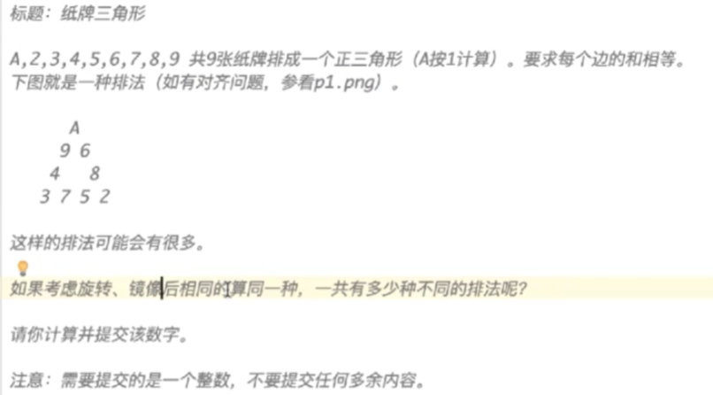

# 蓝桥杯 2017 年 javaB 组真题刷题笔记

## 目录

- [蓝桥杯 2017 年 javaB 组真题刷题笔记](#蓝桥杯-2017-年-javab-组真题刷题笔记)
  - [目录](#目录)
  - [\_01\_购物单](#_01_购物单)
    - [编程实现：利用正则表达式实现](#编程实现利用正则表达式实现)
  - [\_02\_纸牌三角形](#_02_纸牌三角形)
  - [\_03\_承压计算](#_03_承压计算)
  - [\_04\_魔方状态](#_04_魔方状态)
  - [\_05\_取数位](#_05_取数位)
  - [\_06\_最大公共子串](#_06_最大公共子串)
  - [\_07\_日期问题](#_07_日期问题)
  - [\_08\_包子凑数](#_08_包子凑数)
  - [\_09\_分巧克力](#_09_分巧克力)
  - [\_10\_K倍区间](#_10_k倍区间)
    - [使用前缀和的解法](#使用前缀和的解法)
    - [使用线段树的解法](#使用线段树的解法)

## _01_购物单

```
第八届蓝桥杯【省赛试题第一题】

标题： 购物单
    小明刚刚找到工作，老板人很好，只是老板夫人很爱购物。老板忙的时候经常让小明帮忙到商场代为购物。小明很厌烦，但又不好推辞。

    这不，XX大促销又来了！老板夫人开出了长长的购物单，都是有打折优惠的。
小明也有个怪癖，不到万不得已，从不刷卡，直接现金搞定。

现在小明很心烦，请你帮他计算一下，需要从取款机上取多少现金，才能搞定这次购物。

    取款机只能提供100元面额的纸币。小明想尽可能少取些现金，够用就行了。
你的任务是计算出，小明最少需要取多少现金。

以下是让人头疼的购物单，为了保护隐私，物品名称被隐藏了。

-----------------
****     180.90       88折
****      10.25       65折
****      56.14        9折
****     104.65        9折
****     100.30       88折
****     297.15        半价
****      26.75       65折
****     130.62        半价
****     240.28       58折
****     270.62        8折
****     115.87       88折
****     247.34       95折
****      73.21        9折
****     101.00        半价
****      79.54        半价
****     278.44        7折
****     199.26        半价
****      12.97        9折
****     166.30       78折
****     125.50       58折
****      84.98        9折
****     113.35       68折
****     166.57        半价
****      42.56        9折
****      81.90       95折
****     131.78        8折
****     255.89       78折
****     109.17        9折
****     146.69       68折
****     139.33       65折
****     141.16       78折
****     154.74        8折
****      59.42        8折
****      85.44       68折
****     293.70       88折
****     261.79       65折
****      11.30       88折
****     268.27       58折
****     128.29       88折
****     251.03        8折
****     208.39       75折
****     128.88       75折
****      62.06        9折
****     225.87       75折
****      12.89       75折
****      34.28       75折
****      62.16       58折
****     129.12        半价
****     218.37        半价
****     289.69        8折

需要说明的是，88折指的是按标价的88%计算，而8折是按80%计算，余者类推。
特别地，半价是按50%计算。
请提交小明要从取款机上提取的金额，单位是元。
答案是一个整数，类似4300的样子，结尾必然是00，不要填写任何多余的内容。

特别提醒：不许携带计算器入场，也不能打开手机。
```

### 编程实现：利用正则表达式实现

```java
import java.lang.reflect.Array;
import java.util.ArrayList;
import java.util.Arrays;
import java.util.Scanner;

public class _01_购物单 {
 public static void main(String[] args) {
  Scanner sc = new Scanner(System.in);
  double total = 0;
  while (true) {
   String str = sc.nextLine();
   if (str.equals("break"))
    break;
   String[] strs = str.replaceAll("[ ]+", ",").split(",");

   double price = Double.valueOf(strs[1]);
   double discount = 1;
   if (strs[2].startsWith("半")) {
    discount = 0.5;
   } else if (strs[2].length() == 2) {
    discount = Double.valueOf(strs[2].substring(0, 1)) / 10d;
   } else if (strs[2].length() == 3) {
    discount = Double.valueOf(strs[2].substring(0, 2)) / 100d;
   } else {
    System.out.println("error!!!!!!!!!");
    break;
   }
   System.out.println(price);
   System.out.println(discount);
   total += price * discount;
  }
  System.out.println(total);
  // 输出：5136.859500000001
 }
}
```

## _02_纸牌三角形



```java
public class _02_纸牌三角形 {
 public static void main(String[] args) {
  dfs(0);
  System.out.println(counter / (3 * 2));// 可旋转3次，镜像两次。
 }

 static int data[] = { 1, 2, 3, 4, 5, 6, 7, 8, 9 };
 static int counter = 0;

 static void dfs(int curStep) {
  if (curStep == data.length) {
   if (check()) {
    counter++;
   }
  } else {
   for (int i = curStep; i < data.length; i++) {
    swap(data, curStep, i);
    dfs(curStep + 1);
    swap(data, curStep, i);
   }
  }
 }

 static boolean check() {
  int i = data[0] + data[1] + data[2] + data[3];
  int j = data[3] + data[4] + data[5] + data[6];
  int k = data[6] + data[7] + data[8] + data[0];
  return i == j && j == k;
 }

 static void swap(int[] arr, int i, int j) {
  if (i != j) {
   arr[i] = arr[i] ^ arr[j];
   arr[j] = arr[i] ^ arr[j];
   arr[i] = arr[i] ^ arr[j];
  }
 }
}
```

## _03_承压计算

```
题目描述 :
X星球的高科技实验室中整齐地堆放着某批珍贵金属原料。
每块金属原料的外形、尺寸完全一致，但重量不同。
金属材料被严格地堆放成金字塔形。

                             7
                            5 8
                           7 8 8
                          9 2 7 2
                         8 1 4 9 1
                        8 1 8 8 4 1
                       7 9 6 1 4 5 4
                      5 6 5 5 6 9 5 6
                     5 5 4 7 9 3 5 5 1
                    7 5 7 9 7 4 7 3 3 1
                   4 6 4 5 5 8 8 3 2 4 3
                  1 1 3 3 1 6 6 5 5 4 4 2
                 9 9 9 2 1 9 1 9 2 9 5 7 9
                4 3 3 7 7 9 3 6 1 3 8 8 3 7
               3 6 8 1 5 3 9 5 8 3 8 1 8 3 3
              8 3 2 3 3 5 5 8 5 4 2 8 6 7 6 9
             8 1 8 1 8 4 6 2 2 1 7 9 4 2 3 3 4
            2 8 4 2 2 9 9 2 8 3 4 9 6 3 9 4 6 9
           7 9 7 4 9 7 6 6 2 8 9 4 1 8 1 7 2 1 6
          9 2 8 6 4 2 7 9 5 4 1 2 5 1 7 3 9 8 3 3
         5 2 1 6 7 9 3 2 8 9 5 5 6 6 6 2 1 8 7 9 9
        6 7 1 8 8 7 5 3 6 5 4 7 3 4 6 7 8 1 3 2 7 4
       2 2 6 3 5 3 4 9 2 4 5 7 6 6 3 2 7 2 4 8 5 5 4
      7 4 4 5 8 3 3 8 1 8 6 3 2 1 6 2 6 4 6 3 8 2 9 6
     1 2 4 1 3 3 5 3 4 9 6 3 8 6 5 9 1 5 3 2 6 8 8 5 3
    2 2 7 9 3 3 2 8 6 9 8 4 4 9 5 8 2 6 3 4 8 4 9 3 8 8
   7 7 7 9 7 5 2 7 9 2 5 1 9 2 6 5 3 9 3 5 7 3 5 4 2 8 9
  7 7 6 6 8 7 5 5 8 2 4 7 7 4 7 2 6 9 2 1 8 2 9 8 5 7 3 6
 5 9 4 5 5 7 5 5 6 3 5 3 9 5 8 9 5 4 1 2 6 1 4 3 5 3 2 4 1
x x x x x x x x x x x x x x x x x x x x x x x x x x x x x x

其中的数字代表金属块的重量（计量单位较大）。 最下一层的X代表30台极高精度的电子秤。
假设每块原料的重量都十分精确地平均落在下方的两个金属块上， 最后，所有的金属块的重量都严格精确地平分落在最底层的电子秤上。
电子秤的计量单位很小，所以显示的数字很大。
工作人员发现，其中读数最小的电子秤的示数为： 2086458231
请你推算出：读数最大的电子秤的示数为多少？
注意：需要提交的是一个整数，不要填写任何多余的内容。

题目大意：
已知某个读数最小的电子秤为：2086458231，问读数最大的电子秤是多少。
```

```
思路
7   // 7的重量均匀落在5和8上
5 8 
7 8 8
9 2 7 2
```

## _04_魔方状态


## _05_取数位

题目描述
求1个整数的第k位数字有很多种方法。
以下的方法就是一种。

```java
public class Main
{
    static int len(int x){
        if(x<10) return 1;
        return len(x/10)+1;
    }
    
    // 取x的第k位数字
    static int f(int x, int k){
        if(len(x)-k==0) return x%10;
  return ______填空______; // 递归即可，答案： f(x/10,k)
    }
    
    public static void main(String[] args)
    {
        int x = 23513;
        System.out.println(f(x,3));
    }
}
```

## _06_最大公共子串

最大公共子串长度问题就是：
求两个串的所有子串中能够匹配上的最大长度是多少。

比如：“abcdkkk” 和 “baabcdadabc”，
可以找到的最长的公共子串是"abcd",所以最大公共子串长度为4。

下面的程序是采用矩阵法进行求解的，这对串的规模不大的情况还是比较有效的解法。

```java
public class Main
{
    static int f(String s1, String s2)
    {
        char[] c1 = s1.toCharArray();
        char[] c2 = s2.toCharArray();
        
        int[][] a = new int[c1.length+1][c2.length+1];
        
        int max = 0;
        for(int i=1; i<a.length; i++){
            for(int j=1; j<a[i].length; j++){
                if(c1[i-1]==c2[j-1]) {
                    a[i][j] = __________________;  //填空 : a[i-1][j-1]+1
                    if(a[i][j] > max) max = a[i][j];
                }
            }
        }
        
        return max;
    }
    
    public static void main(String[] args){
        int n = f("abcdkkk", "baabcdadabc");
        System.out.println(n);
    }
}
```

## _07_日期问题

```
题目描述
小明正在整理一批历史文献。这些历史文献中出现了很多日期。小明知道这些日期都在 1960 年 1 月 1 日至 2059 年 12 月 31 日。令小明头疼的是，这些日期采用的格式非常不统一，有采用年/月/日的，有采用月/日/年的，还有采用日/月/年的。

更加麻烦的是，年份也都省略了前两位，使得文献上的一个日期，存在很多可能的日期与其对应。

比如 02/03/04，可能是 2002 年 03 月 04 日、2004 年 02 月 03 日或 2004 年 03 月 02 日。

给出一个文献上的日期，你能帮助小明判断有哪些可能的日期对其对应吗？

输入描述

一个日期，格式是 "AA/BB/CC" ( 0≤A,B,C≤9)。

输出描述

输出若干个不相同的日期，每个日期一行，格式是 "yyyy-MM-dd"。多个日期按从早到晚排列。

输入输出样例
示例输入

02/03/04

输出

2002-03-04
2004-02-03
2004-03-02
```

```java
import java.util.HashSet;
import java.util.Scanner;
import java.util.Set;

/**
 * _07_日期问题
 */
public class _07_日期问题 {

 public static void main(String[] args) {
  Scanner sc = new Scanner(System.in);
  String info = sc.nextLine();
  int aa = Integer.parseInt(info.substring(0, 2));
  int bb = Integer.parseInt(info.substring(3, 5));
  int cc = Integer.parseInt(info.substring(6, 8));
  // System.out.println(aa);
  // System.out.println(bb);
  // System.out.println(cc);

  check(1900 + aa, bb, cc);
  check(2000 + aa, bb, cc);

  check(1900 + cc, aa, bb);
  check(2000 + cc, aa, bb);

  check(1900 + cc, bb, aa);
  check(2000 + cc, bb, aa);

  // 集合自带排序和去重
  for (String item : res) {
   System.out.println(item);
  }
 }

 static Set<String> res = new HashSet<>();

 static void check(int yyyy, int mm, int dd) {
  if (1960 <= yyyy && yyyy <= 2059 &&
    1 <= mm && mm <= 12 &&
    1 <= dd && dd <= 31) {
   switch (mm) {
    case 2:
     if (isLeaf(yyyy) && dd <= 29) {
      break;
     } else if (dd <= 28) {
      break;
     } else {
      return;
     }
     // 4 6 9 11月：30天，
     // 2月：润29 平28
     // 其他月：31天
    case 4:
    case 6:
    case 9:
    case 11:
     if (dd <= 30)
      break;
     else
      return;
   }
   String k = yyyy + "-" + (mm <= 9 ? "0" + mm : mm) + "-" + (dd <= 9 ? "0" + dd : dd);
   res.add(k);
  }
 }

 static boolean isLeaf(int yyyy) {
  return yyyy % 400 == 0 || (yyyy % 4 == 0 && yyyy % 100 != 0);
 }
}
```

## _08_包子凑数

```
题目：

小明几乎每天早晨都会在一家包子铺吃早餐。他发现这家包子铺有 N 种蒸笼，其中第 i 种蒸笼恰好能放Ai​ 个包子。每种蒸笼都有非常多笼，可以认为是无限笼。

每当有顾客想买 X 个包子，卖包子的大叔就会迅速选出若干笼包子来，使得这若干笼中恰好一共有 X 个包子。比如一共有 3 种蒸笼，分别能放 3、4 和 5 个包子。当顾客想买 11 个包子时，大叔就会选 2 笼 3 个的再加 1 笼 5 个的（也可能选出 1 笼 3 个的再加 2 笼 4 个的）。

当然有时包子大叔无论如何也凑不出顾客想买的数量。比如一共有 3 种蒸笼，分别能放 4、5 和 6 个包子。而顾客想买 7 个包子时，大叔就凑不出来了。

小明想知道一共有多少种数目是包子大叔凑不出来的。

输入描述
第一行包含一个整数 N （1≤N≤100)。

以下 N 行每行包含一个整数 Ai​ (1≤Ai​≤100)。

输出描述
一个整数代表答案。如果凑不出的数目有无限多个，输出 INF。

输入输出样例
示例 1

输入

2
4
5
输出

6
样例说明

凑不出的数目包括：1, 2, 3, 6, 7, 11。

示例 2

输入

2
4
6
输出

INF
样例说明

所有奇数都凑不出来，所以有无限多个

运行限制
最大运行时间：1s
最大运行内存: 256M
```

## _09_分巧克力

## _10_K倍区间

```
K倍区间
题目描述：
给定一个长度为 N 的数列，A1,A2,…AN，如果其中一段连续的子序列 Ai,Ai+1,…Aj 之和是 K 的倍数，我们就称这个区间 [i,j] 是 K 倍区间。
你能求出数列中总共有多少个 K 倍区间吗？

输入格式
第一行包含两个整数 N 和 K。
以下 N 行每行包含一个整数 Ai。

输出格式
输出一个整数，代表 K 倍区间的数目。

数据范围
1≤N,K≤100000,
1≤Ai≤100000
输入样例：

5 2
1
2
3
4
5

输出样例：

6
```

### 使用前缀和的解法

```java
import java.util.Scanner;

public class _10_K倍区间 {
 public static void main(String[] args) {
  Scanner sc = new Scanner(System.in);
  int N = sc.nextInt();
  int K = sc.nextInt();
  int result = 0;
  int[] perFixSum = new int[N + 1];
  for (int i = 1; i <= N; i++) {
   perFixSum[i] = perFixSum[i - 1] + sc.nextInt();
  }
  for (int left = 1; left <= N; left++) {
   for (int right = left; right <= N; right++) {
    if((perFixSum[right]-perFixSum[left-1])%K==0){
     result++;
    }
   }
  }
  System.out.println(result);
 }
}
```

### 使用线段树的解法

```java
import java.util.Scanner;

public class _10_K倍区间 {
 public static void main(String[] args) {
  Scanner sc = new Scanner(System.in);
  int N = sc.nextInt();
  int K = sc.nextInt();
  int result = 0;
  int[] nums = new int[N];
  RangeTree rt = new RangeTree(N);
  for (int i = 0; i < N; i++) {
   nums[i] = sc.nextInt();
   rt.insert(i, nums[i]);
  }
  for (int left = 0; left < N; left++) {
   for (int right = left; right < N; right++) {
    if (rt.search(left, right) % K == 0) {
     result++;
    }
   }
  }
  System.out.println(result);
 }
}

class RangeTree {
 int curV;
 int curL;
 int curR;
 int curM;
 RangeTree left;
 RangeTree right;

 RangeTree(int length) {
  this(0, length - 1);
 }

 RangeTree(int l, int r) {
  curL = l;
  curR = r;
  curM = curL + (curR - curL) / 2;
  if (curL != r) {
   left = new RangeTree(curL, curM);
   right = new RangeTree(curM + 1, curR);
  }
 }

 void insert(int i, int num) {
  curV += num;
  if (curL != curR) {
   if (i <= curM) {
    left.insert(i, num);
   } else {
    right.insert(i, num);
   }
  }
 }

 int search(int tarL, int tarR) {
  if (curL == tarR) {
   return curV;
  } else {
   if (tarR <= curM) {
    return left.search(tarL, tarR);
   } else if (curM < tarL) {
    return right.search(tarL, tarR);
   } else {
    return left.search(tarL, curM) + right.search(curM + 1, tarR);
   }
  }
 }
}

```
