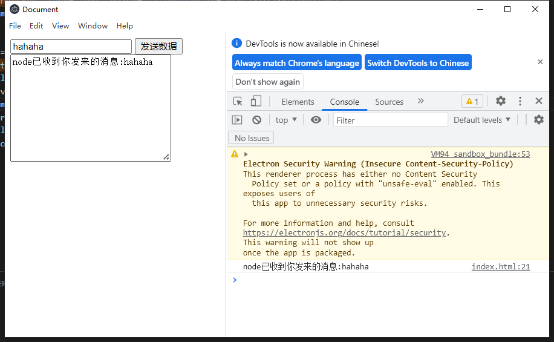

## 介绍

- Electron开发利用的是纯 Web 技术，基于 Chromium 和 Node.js, 让你可以使用 HTML, CSS 和 JavaScript 构建应用。
- Electron完全跨平台，她兼容 Mac、Windows 和 Linux，可以构建出三个平台的应用程序。

## 基本范式

```js
// main.js
const {app,BrowserWindow} = require("electron")

const createWindow = ()=>{
    const mainWindow = new BrowserWindow({
        width:500,
        height:500,
        webPreferences:{
            // 以下两行代码开启集成node环境且关闭上下文隔离，使得在页面中能直接执行node的api，但这是不安全且不推荐的
            nodeIntegration:true,
            contextIsolation:false
        }
    })
    // 加载网页
    // mainWindow.loadURL("https://yiguiding.gitee.io")

    // 加载本地页面
    mainWindow.loadFile("./src/index.html");

    // 打开开发工具
    mainWindow.webContents.openDevTools()
}
app.whenReady().then(createWindow);
```

```json
// package.json
{
  "main": "main.js",
  "scripts": {
    "devElec": "nodemon --exec electron ./"
  },
  "devDependencies": {
    "electron": "^21.3.0",
    "nodemon": "^2.0.20"
  }
}
```

## 主进程和渲染进程间通信案例实现



`package.json`

```json
{
  "version": "0.0.0",
  "main": "./src/main.js",
  "scripts": {
    "dev": "nodemon --exec electron ./"
  },
  "devDependencies": {
    "electron": "^21.3.0",
    "nodemon": "^2.0.20"
  },
  "dependencies": {}
}
```

`main.js`

```js
const { log } = require("console");
const {app,BrowserWindow} = require("electron");
const path = require("path");

const createWindow = ()=>{
    const mainWindow = new BrowserWindow({
        width:500,
        height:500,
        webPreferences:{
            //以下两行代码开启集成node环境且关闭上下文隔离，使得在页面中能直接执行node的api
            // nodeIntegration:true,
            // contextIsolation:false

            // 预加载文件（必须是绝对路径）
            preload:path.resolve(__dirname,"./preload.js")
        }
    })
    //加载网页
    // mainWindow.loadURL("https://yiguiding.gitee.io")

    //加载本地页面
    mainWindow.loadFile(path.resolve(__dirname,"./webApp/index.html"));

    // 打开开发工具
    mainWindow.webContents.openDevTools()
}
app.whenReady().then(()=>{
    createWindow()
    app.on('activate', () => {//如果没有窗口打开则打开一个窗口 (macOS)
        if (BrowserWindow.getAllWindows().length === 0) createWindow()
    })
});

// 管理窗口的生命周期
app.on('window-all-closed', () => {
    if (process.platform !== 'darwin') app.quit() //在Windows和Linux上，关闭所有窗口通常会完全退出一个应用程序。MacOS则
})


const { ipcMain } = require("electron")
// 用于从主进程到渲染进程的异步通信。
ipcMain.handle('sendMsg', async (event,msg) => {
    console.log(msg);
    return new Promise((resolve,reject)=>{
        resolve({
            msg:"node已收到你发来的消息:"+msg,
            status:"OK",
        })
    })
})
```

`preload.js`

```js
// 预加载文件，可用于将node的api提供给webApp
// 此文件内可以直接访问nodejs

const { contextBridge,ipcRenderer } = require("electron")
contextBridge.exposeInMainWorld("myApis",{//在window上挂载一个对象
    sendMsg:  async (msg) => { return await ipcRenderer.invoke("sendMsg",msg) } //ipcRenderer相当于触发了主进程的一个事件并传递相应的数据
})
```

`index.html`

```html
<!DOCTYPE html>
<html lang="en">
<head>
    <meta charset="UTF-8">
    <meta http-equiv="X-UA-Compatible" content="IE=edge">
    <meta name="viewport" content="width=device-width, initial-scale=1.0">
    <title>Document</title>
</head>
<body>
    <input id="inputBox" type="text" value=""> <button id="btn">发送数据</button>
    <textarea name="" id="resultBox" cols="30" rows="10">
    </textarea>
    <script>
        var btn = document.querySelector("#btn")
        var inputBox = document.querySelector("#inputBox")
        var resultBox = document.querySelector("#resultBox")
        btn.addEventListener("click",async()=>{
            var msg = inputBox.value
            var response = await window.myApis.sendMsg(msg)
            resultBox.innerText = response.msg
            console.log(response.msg);
        })
    </script>
</body>
</html>
```

<style>
    gold{
        color:black;
        background-color:gold;
    }
    green{
        color:white;
        background-color:green;
    }
    warn{
        color:white;
        background-color:red;
    }
</style>
