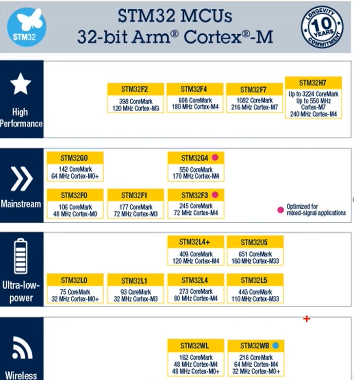
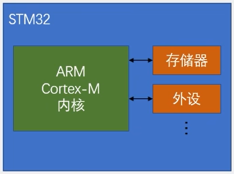
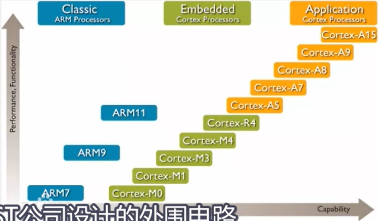
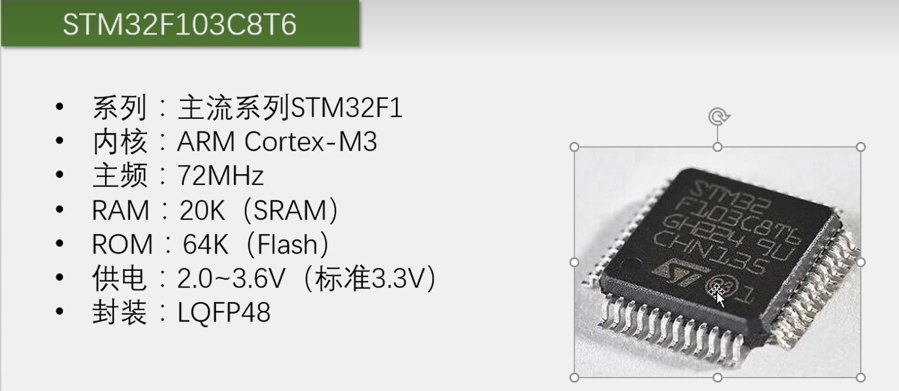
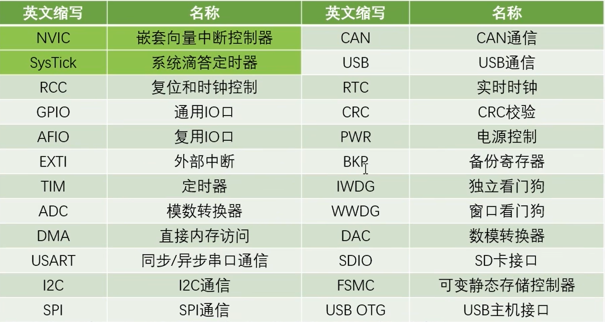

## 简介

**STM32**

- `STM32`是ST公司基于`ARM Cortex-M`内核开发的32位微控制器
- STM32系列产品
  - 高性能
  - 主流
  - 低功耗
  - 无线

**ARM**

- ARM既指ARM公司，也指ARM处理器内核
- ARM各系列内核型号
  - 经典ARM处理器
    - `ARM1` `ARM2` `...` `ARM11`
  - 嵌入式
    - `Cortex-M0`` Cortex-M1` `Cortex-M2` `...`
      - `M` -> `Microcontroller` 微处理器
    - `Cortex-R4`
      - `R` -> `RealTime`面向实时性高的场景
  - 应用级
    - `Cortex-A5` `Cortex-A8` `Cortex-A15` `...`  
      - `A` -> `Application`

## STM32F103C8T6

### 片上资源/外设

- 前两个是内核级别的外设
- 这是`STM32F1`整个系列所有的外设

### 命名规则

### 最小系统

