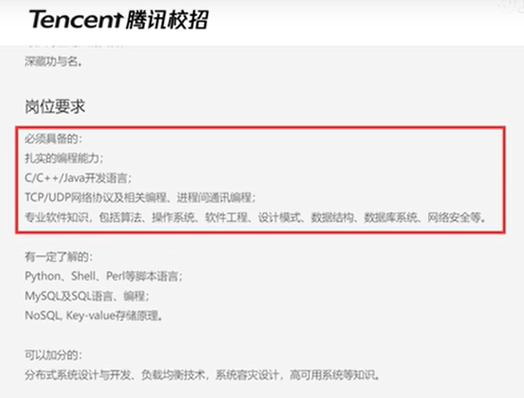

# 对某学长关于计算机四门基础课学习建议的笔记

## 计算机技术的划分

- 技术应用：使用现有的已经设计好的技术完成业务开发需求，对计算机基础要求不高
  - 比如：使用java开发网站，使用c++开发游戏，比较侧重业务和技术的结合
- 技术研发：设计开发技术本身，对计算机基础要求比较高
  - 比如：开发编程语言、编译器、数据库、游戏引擎
- 现状：
  - 行业内大多数程序员都是在做技术应用，而做技术应用，不管是前端后端，c++还是java，薪资差距并不大，其核心竞争力主要在工程能力，就是使用现有技术服务于具体业务需求，产出一个产品或者说用编程解决实际问题的能力。

## 计算机知识的划分

- 计算机基础：数据结构、操作系统、计网、计算机组成、编译原理、数学...
  - 不懂这些底层知识技术原理，只是会使用别人设计好的东西、个人竞争力将会比较有限、就业方向将受到限制
- 编程技能：
  - 编程技能:c++ c# java python
  - 设计思想：设计模式
  - 技术工具：数据库、应用框架、编译器
  - 以上的编程技能、思想、技术概念都是建立在计算机基础之上的

## 学习侧重点

### 计算机考研

- 笔试（计算机基础知识）：
  - 《计算机学科专业基础（408）》：
    - 数据结构
    - 操作系统
    - 计网
    - 计算机组成

- 面试（编程技能）：
  - 计算机相关的项目工程能力、编程技能，有没有拿得出手的项目
  - 有没有大厂实习经历或者实验室履历
  - 有没有好的竞赛奖项等
  - 没有上述东西，复试不好过，很多人初试成绩不错，结果因为复试没有拿得出手的东西而没有过

### 计算机就业

（腾讯校招要求）

- 编程技能：熟练掌握一门编程语言
- 计算机基础知识：
  - 笔试会有算法题（数据结构）
  - 面试会有操作系统、计算机网络，不同的岗位问的问题侧重点不同

### 结论

- 不管是想要考研或者想拿到大厂offer，都需要有两个方面的能力：计算机理论基础知识、项目实践能力（编程技能）。
- 考研和找好工作拿大厂offer，在学习内容上不冲突

## 学习建议

- 最好先深入学习一门编程语言
- 计算机基础知识学习顺序：数据结构 操作系统 计网 计算机组成
- 虽然现在还有很多院校是自命题，但改考408是大趋势，应该按照408准备，防止自命题的院校突然改考408
  - 黑皮书

## 对于不同阶段人的学习建议

- 时间充裕，学习教材尽量选择经典教材，不要过早接触考研教材，考研教材主要针对应试题目，而不是真正掌握这门学科
- 时间不充裕着急考研的，直接按照目标院校的笔试内容准备，直接学考研教材，上岸之后再巩固，对于面试，直接上github学开源项目，理清项目结构和内容，说得出来，一样能加分
- 已经在工作的，先工作入行为主，赚钱活命重要；这些基础知识有时间还是要学，虽然可能目前的岗位用不到，但你不能不会，资本的要求是高效，高效意味着更明确的岗位分工，高可替代性的流水线才能让生产不受限于某一个人，才能跑赢市场，才能生存，很多技术知识并不是企业用不到，只是你目前的岗位上用不到。作为个人想要有底气，就一定要打造自己的稀缺性（学的深）和高适配性（学的广）；这些计算机基础知识才是计算机学科的核心

### 四门课的具体学习建议

可以先到慕课找听的进视频课建立基本概念，然后再看相关书籍巩固和深入，最后到github找开源项目实践

- 数据结构
  - 一门区分码农和程序员的课
  - 码农的代码是能跑就行，程序员的代码是高效的，甚至能开源给别人用
  - 书
    - 大话数据结构
    - 数据结构与算法分析
  - 刷题：
    - 力扣
    - 不要直接上手无序题和热门题，先根据标签巩固知识点，要清楚各类数据结构的使用场景，巩固完了知识点再看热门题
- 操作系统
  - 学操作系统不是要写操作系统
  - 意义在于清除系统资源的调配，学会更多软件工程的解决思路
  - 书：
    - 操作系统导论；有很多真实代码而不是伪代码
    - 深入理解计算机系统；CSAPP经典教材
- 计算机网络
  - 书：《计算机网络自顶向下方法》通俗易懂
- 计算机组成原理
  - 了解计算运行机制，更大限度发挥性能
  - 硬件方向，必学内容
  - 软件方向，对解决调优问题有帮助
  - 书：
    - 计算机组成与设计
    - 深入理解计算机系统
