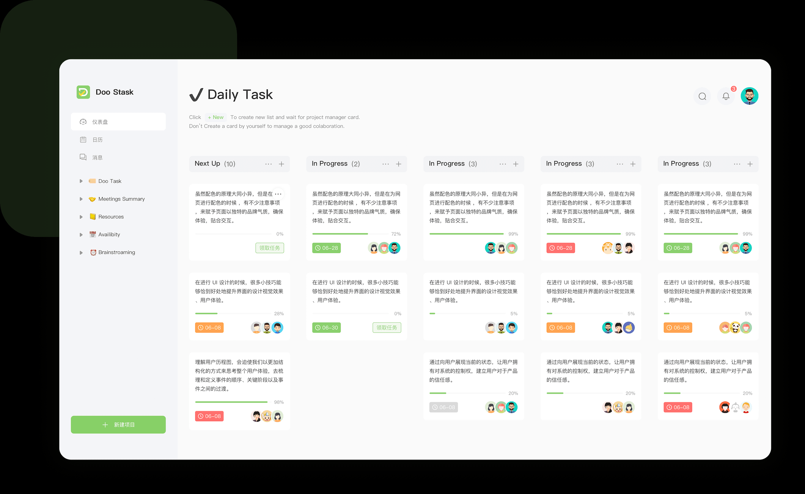
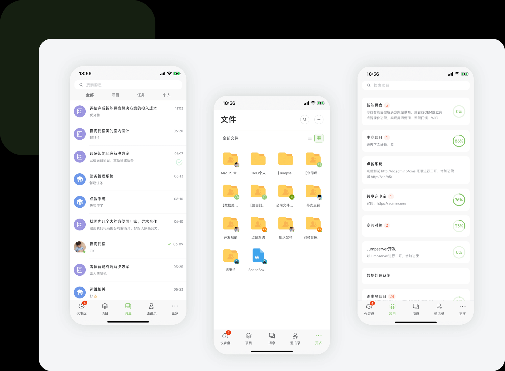

## ideas

### toDoList

概念草图

服务端密码应该存储明文密码的第一次hash运算的字符串，用户名明文存储，邮箱明文存储。

登录时密码验证流程，客户端请求登录，服务端生成随机字符串，并维持会话，客户端获取该随机字符串，客户端将随机字符串和经过hash运算后的密码再做一次hash运算，结合用户名或者用户id，发送给服务端。服务端收到后做同样的运算，然后比对两次结果，如果一致则判断登录成功。

服务端数据库，因为暂时没学数据库，所以打算用文件操作来做。数据库是一个json文件，使用队列来对其进行增删改查，防止访问冲突抛出异常。要注意权限，可以是一个用户id对应一个单独的json文件。

需要考虑手机端适配问题

<!-- 营销策略：30天免费使用，10元获取永久使用权 -->

待参考图

 
 
 
 
