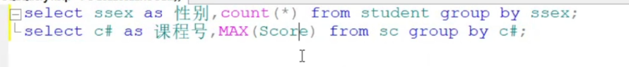

数据库
**题型及分值**

- 选择题：20x2分=40分
  - 第一章：5题
- 填空题：5x1分 =5分
  - 第一章：1~2题
- 简答题：4x5分=20分
- 设计题：35分

## 第一章

**掌握数据库的4个概念**：

- 数据（data)
- 数据库系统(DataBase System,DBS)
  - 数据库管理系统(DataBase Management System,DBMS)
  - 数据库(DataBase,DB)
  - 数据库管理员（DadaBase Administrator，DBA）
- 考点：
  - 缩写对应的中文
  - 之间的关系，谁包含谁
  - 选择题：数据库系统的核心：数据模型
  - 填空题：
    - 数据库系统中最重要的软件：DBMS
    - 最重要的用户：DBA

**掌握数据库技术经历的三个阶段**

- 人工管理阶段
- 文件系统阶段
- 数据库系统阶段
- 考点：
  - 填空题，(必考)
  - 选择题：各个阶段有什么优缺点

**掌握并理解数据库系统的特点**

- `数据结构化`
- 数据的共享性高、冗余度低且易扩充
- 数据独立性高（物理独立性、逻辑独立性）
- 数据由数据库管理系统统一管理和控制
- 考点：
  - 这几条特点本身（选择，多选，防止抠字眼）
  - 什么是物理独立性，什么是逻辑独立性（不会直接考默写，会在选择题中考理解）

**数据模型**

- 概念模型（最著名的：实体-联系模型,E-R图）
- 逻辑模型和物理模型(这两者也共称为数据模型)

**掌握数据模型的组成要素**

- 数据结构
- 数据操作
- 数据的完整性约束条件
- 考点
  - 背下来，可能是填空题

**掌握常用的数据模型**

- 层次模型——树型
- 网状模型——图
- 关系模型——二维表（也称 表、关系）

**掌握并理解数据库系统的模式**

- 模式
- 外模式
- 内模式
- 考点：
  - 选择题
  - 简答题：什么是外模式，什么是内模式，模式（背概念）
  - 填空题：外模式对应视图和基本表，模式对应基本表，内模式对应存储文件

**掌握数据库的二级映像和数据独立性**

- 外模式/模式映像——物理独立性
- 模式/内模式映像——逻辑独立性
- 考点：
  - 数据库的逻辑独立性是由 _**模式/内模式映像**_ 影像提供的

**外码**

- 按照参照完整性规则，外码的值或者等于**以此码为主码的关系中某个元组主码的值**，或者**取空值或NULL**

## 第二章

**理解关系数据结构及形式化定义**

- 理解“域”的定义，例如：性别取值范围为’男’,’女’
- 掌握笛卡尔积
- 理解关系（主码，候选码，全码、外码等基本概念）

**掌握关系模式**
关系模式的形式化表示：R（U，D，DOM，F）

**理解关系的完整性**
实体完整性-主码不为空
参照完整性-两个表
用户定义完整性

**理解并掌握关系代数**（重点）
**并、交、差、笛卡尔积**、选择、投影、连接

填空题
1.一般情况下，当对关系R和S使用自然连接时，要求R和S含有一个或多个共有的____属性_____。

2.关系数据库的实体完整性规则规定基本关系的**主属性**都不能取**空值或NULL** 。

3.在关系A（S，SN,D)和B（D，CN，NM）中，A的主码是S，B的主码是D，则D在A中称为_**外码**_ 。

4.关系R与S的交可以用关系代数的5种基本运算表示为 _**R-（R-S）**_ 。

4.关系操作的特点是___**集合**____。

5.关系R与S的连接可以用关系代数的5种基本运算表示为 _**σ_F(R×S)**__ 。

6.关系中主码的取值必须唯一且非空，这条规则是实体__**实体**__完整性规则。

7.关系代数中专门的关系运算包括：****选择****、投影、连接和除法。

8.关系代数中专门的关系运算包括：选择、投影、连接和_**除法**_。

考聚集函数

