- 课程的**重点**：五大基本部件的原理及实现。
- 课程的**难点**：各部件互连构成整机系统，即整机概念的建立。

# 1. 第一章

## 1.1. 存储程序概念

**几个时间节点**

- ENIAC-世界上第一台电子数字计算机，`1946年2月`问世.  
  - 设计开始于`1943年`  
  - 一直使用到`1955年`  
- 美籍匈牙利数学家冯·诺依曼等人在`1946年6月`提出存储程序概念.
- EDSAC-事实上的第一台存储程序计算机 `1949年`诞生。  
- EDVAC-冯·诺依曼设计的存储程序计算机 `1951年`诞生。  

**存储程序概念**：
>
> 1. 计算机（指硬件）应由`运算器`、`存储器`、`控制器`、`输入设备`和`输出设备`五大基本部件组成；
> 2. 计算机内部采用二进制来表示指令和数据；
> 3. `将编好的程序和原始数据事先存入存储器中，然后再启动计算机工作`，这就是存储程序的基本含义。

**CPU、主机、外设**

- 中央处理器（CPU）
    > `CPU = 运算器 + 控制器`
- 主机
    > `主机 = 中央处理器 + 主存储器`
- 外部设备
    > `除去主机以外的硬件装置`（如输入设备、输出设备、辅助存储器等）

## 1.2. 运算器、存储器、控制器、输入设备和输出设备、总线

### 1.2.1. 输入设备

略

### 1.2.2. 输出设备

略

### 1.2.3. 运算器

- 对信息进行处理和运算的部件，
- 经常进行的运算是算术运算和逻辑运算
- 运算器的核心是算术逻辑运算部件ALU
- 运算器中有若干个寄存器（如累加寄存器、暂存器等）。

### 1.2.4. 存储器

- 用来存放程序和数据的部件
- 是计算机能够实现“存储程序控制”的基础。

**三级存储系统**

- **主存储器**:可由CPU`直接访问`，用来存放当前`正在执行的程序和数据`。
- **辅助存储器**:设置在主机外部，CPU`不能直接访问`，用来存放暂时`不参与运行的程序和数据`，需要时再传送到主存。
- **高速缓冲存储器（Cache）**:CPU`可以直接访问`，用来存放`当前正在执行的程序中的活跃部分（副本）`，以便快速地向CPU提供指令和数据。

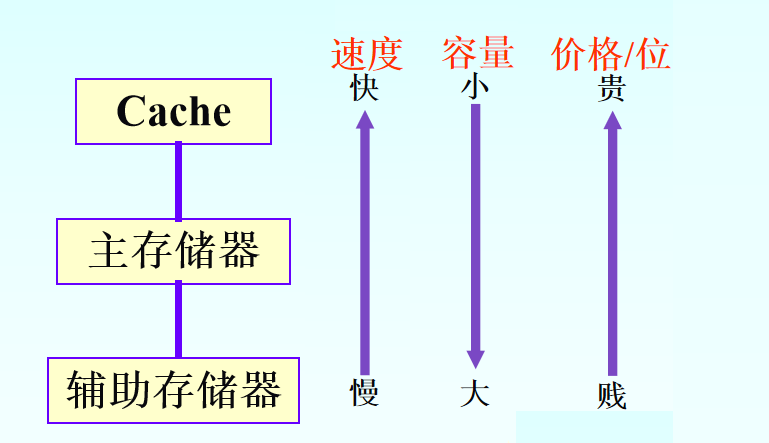

### 1.2.5. 控制器

- 控制器是整个计算机的指挥中心
- 控制器中主要包括`时序控制信号形成部件`和一些`专用的寄存器`。

### 1.2.6. 总线  

- 总线将`各大基本部件`，按某种方式连接起来就构成了计算机的硬件系统。
- 总线是一组能为多个部件服务的公共信息传送线路，它能分时地发送与接收各部件的信息。

**特点**

- 共享
- 分时

**按传送信息的不同又可以细分为：**

- 地址总线 Address Bus
  - 单方向的多根信号线
  - CPU `--->` 主存和外设
  - 传递的是 `地址信息`
- 数据总线 Data Bus
  - 双方向的多根信号线
  - CPU 写入数据 `--->` 主存和外设
  - CPU 读取数据 `<---` 主存和外设
  - 传递的是`数据信息`
- 控制总线 Control Bus
  - 双方向的多根信号线
  - CPU送出的`控制命令` `--->` 主存/外设
  - 反馈给CPU的`状态信号`  `<---` 主存/外设
  - 传递的是`控制命令`和`状态信号`

**按传送信息的方向可以细分为：**

- 单向总线
  - 信息只能向一个方向传送，如地址总线。
- 双向总线
  - 信息可以向两个方向上传送，如数据总线。

**三态门电路**

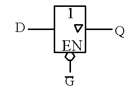
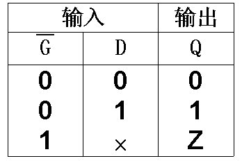
> 三种状态是：
>
> - “0”状态
> - “1”状态
> - 浮空状态(应该就是指悬空，高阻态，实际电压由外电路决定)

说白了，就是用G控制D的状态信息能否传递到Q，`!G==0`时，D的的状态信息流向Q, `!G==1`时，D的状态信息和Q的状态信息和被`隔离`开，  
G的作用相当于水龙头的开关，相当于三极管的基极，相当于场效应管的控制极

## 1.3. 一些概念

**冯·诺依曼结构**

说白了，就是把程序和数据放在同一个存储器中的这种结构叫冯·诺依曼结构

内存条中某字节存储的信息，可能是程序指令，可能是数据。

> 冯·诺依曼结构也称`普林斯顿结构`，是一种将`程序指令存储器`和`数据存储器`合并在一起的`存储器结构`。指令存储地址和数据存储地址指向同一个存储器的不同物理位置。
> 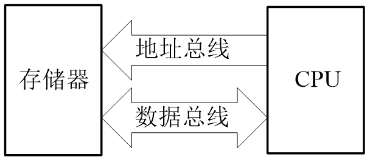

**计算机系统**
> `计算机系统=硬件系统+软件系统`  
> 硬件是计算机系统的物质基础，软件是计算机系统的灵魂。硬件和软件是相辅相成的，不可分割的整体。
> 对于程序设计人员来说，`硬件和软件在逻辑上是等价的`。

>**硬件软化**：原来由硬件实现的操作改由软件来实现。它可以增强系统的功能和适应性。

> **软件硬化**：原来由软件实现的操作改由硬件来实现。它可以显著降低软件在时间上的开销。

> 固件是指那些存储在能永久保存信息的器件（如ROM）中的程序，是具有软件功能的硬件。
>

**实际机器和虚拟机器**
虚拟计算机是指以软件或以软件为主实现的机器。

**机器字长**
机器字长是指参与运算的数的基本位数，它是由加法器、寄存器、数据总线的位数决定的。

**字节、位、字**
> 1Byte字节=8bit位  
> 不同的计算机，字（Word）可以不相同，但对于系列机来说，在同一系列中，字却是固定的，如80X86系列中，一个字等于16位；IBM303X系列中，一个字等于32位。

**数据通路宽度**
> 数据总线一次所能并行传送信息的位数，称为数据通路宽度。

**主存容量**
> 一个主存储器所能存储的全部信息量称为主存容量。  
> **容量单位：**
>
> - 字节数 字节编址的计算机
> - 字数×字长 字编址的计算机

**运算速度**
> 以MIPS和MFLOPS作为计量单位来衡量运算速度。
>
> - MIPS表示每秒百万条指令。
> - MFLOPS每秒表示百万次浮点运算。
> - 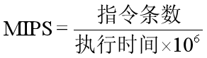
> - 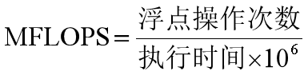

# 2. 第二章

## 2.1. 原码 反码 补码

nbit机器数值数据的表示

- **原码**
  - 一位符号位+(n-1)位表示数值
- **反码**
  - 正数的反码是其原码本身
  - 负数的反码是其原码的数值位取反
- **补码**
  - 正数的补码是其原码本身
  - 负数的补码是其反码的数值位+1，或者说把它的数值位改为其补数

## 2.2. 浮点数

> **规格化的浮点数**  
> 为了提高运算的精度，需要充分地利用尾数的有效数位，通常采取规格化的浮点数形式，即规定尾数的最高数位必须是一个有效值。

## 2.3. 汉字

**汉字GB2312-80标准的`区位码` `国标码` `机内码`**

>
> 国标码＝区位码（十六进制）＋2020H  
> 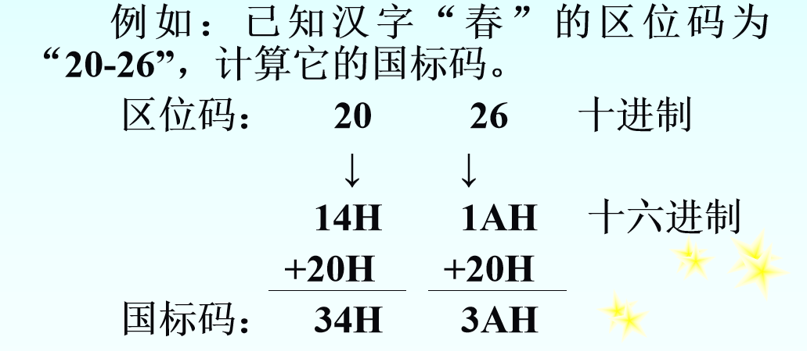  

>
> 汉字机内码＝汉字国标码＋8080H
>   
>

**为什么**
> `+20H` 应该是为了和`ASIIC`码中的前32个控制字符的编码错开  
> `+80H` 应该是为了让操作系统能够区分ASIIC码（最高位为0）和 汉字（最高位为1）。

# 3. 第三章 指令系统

- 指令和指令系统(指令集)是计算机中最基本的概念。
- 指令是`指示计算机执行某些操作的命令`，  
- 一台计算机的`所有指令的集合`构成该机的指令系统，也称指令集。

## 3.1. 指令基本格式

### 3.1.1. 指令的组成

- 
- `操作码`：指明操作的性质及功能。
  - 操作码长度
    - 为了能表示整个指令系统中的全部指令，指令的操作码字段`应当具有足够的位数`。
  - 分类
    - 操作码的编码可以分为**规整型**和**非规整型**两类：
    - 1.规整型（定长编码）
      - 操作码字段的位数和位置是固定的。
      - 指令系统共有`m`条指令，指令中`操作码字段的位数`为`N`位，
      - 则 `N ≥ log2 m`
    - 2.非规整型（变长编码）
      - 操作码字段的位数不固定
      - 操作码分散地放在指令字的不同位置上
      - 扩展操作码法(最常用的非规整型编码方式):
        - 让操作数地址个数多的指令（如三地址指令）的操作码字段短些，
        - 操作数地址个数少的指令（如一或零地址指令）的操作码字段长些。
- `地址码`：指明`操作数的地址`，特殊情况下也可能直接给出`操作数本身`。

### 3.1.2. 指令的结构

- **双操作数`指令`的结构**：
  - `操作码`：要执行的操作，某个算数运算or逻辑运算
  - `地址码`：应包含以下信息：
    - 第一操作数地址，用A1表示；
    - 第二操作数地址，用A2表示；
    - 操作结果存放地址，用A3表示；
    - 下条将要执行指令的地址，用A4表示。
    - 这些信息可以在指令中明显的给出，称为`显地址`；
    - 也可以依照某种事先的约定，用隐含的方式给出，称为`隐地址`。
- **双操作数指令的5种格式**：
  - 格式1：四地址指令
    - 
    - `(A1)OP(A2)→A3`
    - `A4=下条将要执行指令的地址`
    - 解释：a1和a2做op操作，结果存到a3中，程序跳转到a4处执行
    - 执行一条四地址指令需5次访问主存。
      - 1.读取这条指令本身
      - 2.读取A1中的数据
      - 3.读取A2中的数据
      - 4.将数据写入A3
      - 5.读取A4中的数据
  - 格式2：三地址指令
    - 
    - `(A1)OP(A2)→A3`
    - `(PC)+1=下条将要执行指令的地址`
    - 解释：a1和a2做op操作，结果存到a3中，程序跳转到下一条指令执行
    - 执行一条三地址指令需4次访问主存。
      - 1.读取这条指令本身
      - 2.读取A1中的数据
      - 3.读取A2中的数据
      - 4.将数据写入A3
  - 格式3：二地址指令
    - 
    - `(A1)OP(A2)→A1`
    - `(PC)+1=下条将要执行指令的地址`
    - 解释：a1和a2做op操作，结果存到a1中，程序跳转到下一条指令执行
    - A1中原存内容在指令执行后被覆盖。
    - 执行一条二地址指令需4次访问主存。
      - 1.读取这条指令本身
      - 2.读取A1中的数据
      - 3.读取A2中的数据
      - 4.将数据写入A1
  - 格式4：一地址指令
    - 
    - `(Acc)OP(A1)→Acc`
    - `(PC)+1=下条将要执行指令的地址`
    - 解释：将Acc累加器中的数和A1做OP操作，结果存到Acc中
    - 执行一条一地址指令需2次访问主存。
      - 1.读取这条指令本身
      - 2.读取A1中的数据
  - 格式5：零地址指令
    - 
    - 操作数地址是隐含的。
    - 参加运算的操作数放在堆栈中，
    - 运算结果也放在堆栈中。

### 3.1.3. 指令的长度

- 指令长度应 `尽可能短`、`等于字节的整数倍`，
- 指令长度可以等于机器字长，也可以大于或小于机器字长

**定长指令字结构和变长指令字结构**

- 在一个指令系统中，若所有指令的长度都是相等的，称为`定长指令字结构`；
- 若各种指令的长度随指令功能而异，称为`变长指令字结构`。
  
### 3.1.4. 指令长短的优缺点

- 从`缩短程序长度`，用户使用方便，`增加操作并行度等方面来看`，选用三地址指令格式较好；
- 从`缩短指令长度`，`减少访存次数`，`简化硬件设计等方面来看`，一地址指令格式较好。
- 对于同一个问题，
  - 用三地址指令编写的程序最短，但指令长度最长，
  - 而用二、一、零地址指令来编写程序，程序的长度一个比一个长，但指令的长度一个比一个短。

## 寻址技术

- 寻找操作数的地址
- 寻找下一条将要执行的指令地址
- 寻址技术包括
  - 编址方式
  - 寻址方式

**编址方式**

- 一个地址对应一个读写数据的物理位置（寄存器、内存某字节）
- 在计算机中需要编址的设备主要有
  - CPU中的通用寄存器、
  - 主存储器和
  - 输入输出设备等3种。

**编址单位**

- 字编址
- 字节编址
- 位编址

**指令中地址码的位数**

- 简单来说，地址码的`位数`和`编址的单位`将共同决定其寻址能力，
- 如，地址码位数为`10bit`,采用字节编址，则其寻址能力就是`1024Bit=1MB`

**寻址的分类**

- `数据寻址` 寻找操作数的地址称为`数据寻址`
- `指令寻址` 寻找下一条将要执行的指令地址称为`指令寻址`
  - 可以细分为
  - `顺序寻址`：程序计数器PC加1，自动形成下一条指令的地址
  - `跳跃寻址`：需要通过程序转移类指令实现

**寻址方式**

- **立即寻址**
  - 
  - OP就是操作码
  - 立即数就是操作数，不是地址
  - `操作数S=立即数`
  - 优点，不用再访问内存了
  - 缺点，不能修改操作数，其数值大小受限于指令位数
- **寄存器寻址**
  - 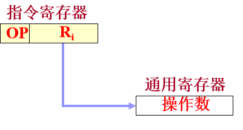
  - 指令中给的地址是寄存器的地址(或者说编号)
  - `EA = Ri`
  - `操作数S=(Ri)`
  - 优点,
    - 访问速度快，
    - 因为寄存器少，编址所有寄存器所需bit位数就少，在指令中所占的字段宽度也就短
- **直接寻址(绝对寻址)**
  - 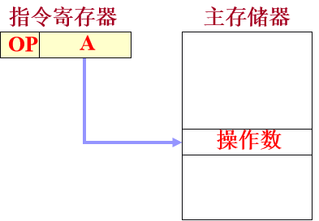
  - 指令中给的地址A,就是操作数在内存中的地址
  - `EA=A`
  - `操作数S=(A)`
  - 操作数地址是写死的，无法修改，也不相对于程序所在位置，所以又叫做绝对寻址
- **间接寻址（一级）**
  - 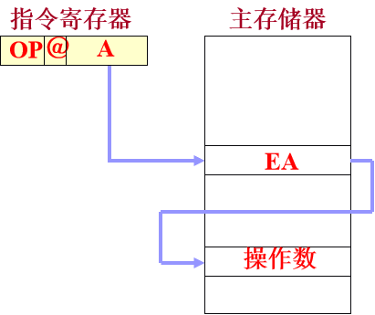
  - 简单来说，就是指令中给出的地址A,是操作数地址的地址
  - `EA=(A)`
  - `操作数S=((A))`
  - 优点，扩大了寻址范围，程序会变得更灵活（要修改操作数不必修改程序A的值，只需要修改EA的值）
  - ＠标志位。
    - 通常在指令格式中划出一位作为标志位，
    - 标识所给地址是操作数的地址（直接寻址）,还是操作数地址的地址（间接寻址）
    - ＠=0 直接寻址
    - ＠=1 间接寻址
- **多级间接寻址**
  - 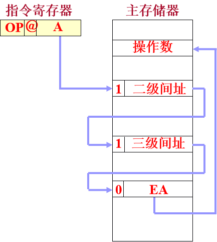
  - 多级间接标志：
    - 0：找到有效地址
    - 1：继续间接寻址
- **寄存器间接寻址**
  - 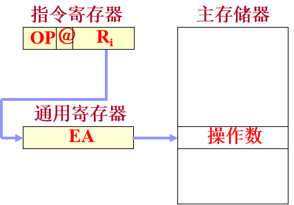
  - 一图胜千言，显而易见，指令中地址字段存放的是位数较短的寄存器的地址（编号）,寄存器中存放的是操作数在内存中的地址，
  - 优点是用短指令，寻址长地址
  - EA=(Ri)
  - 操作数S=((Ri))
- **变址寻址**
  - 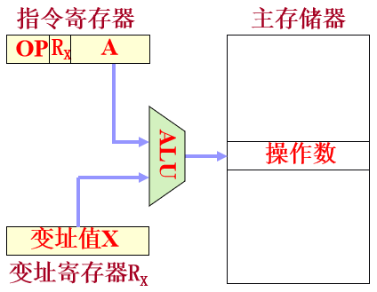
  - 形式地址A + 变址寄存器RX的内容 = 操作数有效地址
  - EA=A+(RX)
  - 操作数S=(A+(RX))
- **基址寻址**
  - 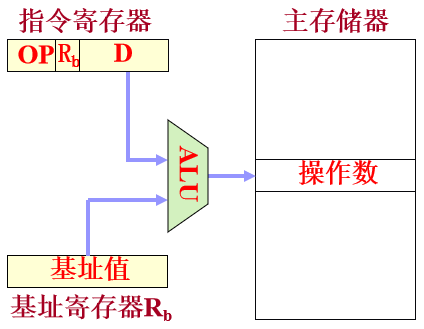
  - 基址寄存器Rb的内容 + 位移量D相加，= 操作数有效地址：
  - EA = (Rb) + D
  - 基址寄存器的内容称为基址值，指令的地址码字段是一个位移量，位移量可正可负。
  - 类似C语言数组的寻址方式 `A[5]=8` 就是 `(A+5) = 8`
