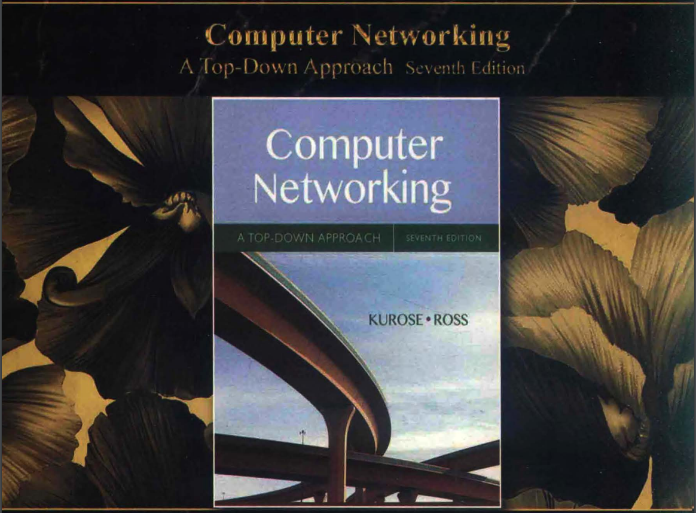
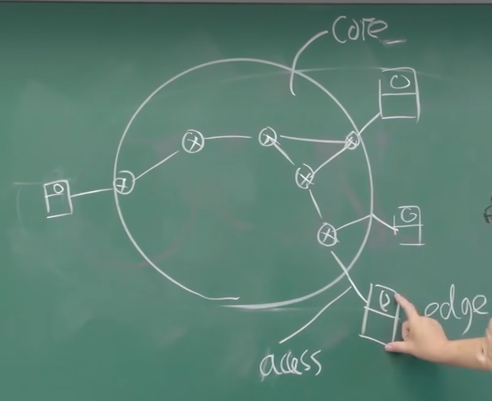

# 《计算机网络（自顶向下方法 第7版，James F.Kurose，Keith W.Ross）》学习笔记

## 目录

- [《计算机网络（自顶向下方法 第7版，James F.Kurose，Keith W.Ross）》学习笔记](#计算机网络自顶向下方法-第7版james-fkurosekeith-wross学习笔记)
  - [目录](#目录)
  - [第一章计算机网络和因特网（绪论、基本术语、概念）](#第一章计算机网络和因特网绪论基本术语概念)
  - [应用层](#应用层)
    - [功能、服务](#功能服务)
  - [传输层](#传输层)
  - [网络层](#网络层)
    - [数据平面](#数据平面)
    - [控制平面](#控制平面)
  - [数据链路层、物理层](#数据链路层物理层)
  - [局域网](#局域网)
  - [网络安全](#网络安全)
  - [无线网、移动网](#无线网移动网)
  - [多媒体网络](#多媒体网络)
  - [网络管理](#网络管理)

## 第一章计算机网络和因特网（绪论、基本术语、概念）

**内容概述**

- 该书内容主要侧重于计算机网络的高层，对于底层的数据链路层、物理层，合并到一章来讲解
- 每章分为两部分
  - 前一部分：介绍该层的 **原理** ：**具备的功能** 和 **提供的服务**
    - **功能** ：具备的能力，通过调用下层提供的服务而使得本层具备了一定的能力
    - **服务** ：功能的体现，根据自身所具备的能力，向上层提供服务
  - 第二部分：实例讲解，讲解主流的协议
    - 应用层：http协议讲解 FTP协议讲解 SMTP POP3
    - 传输层：TCP（传输控制）协议讲解  UDP（用户数据包）协议讲解
    - 网路层: ip协议

**各层功能概述**

- 应用层
  - 提供的服务：应用层规定了两个 **远程的应用进程（不在同一台主机上）** 之间应该遵守的规范和协议
  - 浏览器和服务器、ftp客户端和ftp服务端
- 传输层
  - 提供的服务：传输层提供**进程到进程**的服务（端口到端口，某台主机的某个进程占用的某个端口）
  - TCP向上层提供**可靠**的数据传输服务，且**面向连接**
    - 面相于对可靠性比较高的应用，邮件，FTP，SFTP，
    - 代价：时延代价、空间代价；发送前存留数据包副本，对数据包编号，对方收到数据包后要确认，错误校验，检错重传，超时重传，乱序排序
    - **可靠** ：不出错，不失序，不重复，不丢失
    - **面向连接** ：请求连接建立，响应连接建立确认，发请求，响应
  - UDP向上层提供**不可靠**的数据传输服务
    - 面向于对**实时性**要求比较高，但对可靠性要求不高的应用，实时语音，实时视屏通话，网络直播
- 网路层
  - 提供的服务：网络层提供**端到端**的服务（主机到主机）
  - 特点： 尽力而为，不可靠，基本乱序，可能丢失
  - **点到点** P2P point to point 主机到网络设备，网络设备到网络设备，网卡到网卡 **数据链路层**
  - **端到端** E2E End to End 主机到主机，**网络层**  **由P2P构成**
  - 网络层工作方式
    - **传统方式**
    - **现代SDN（Software Defined Network 软件定义网络）方式**
  - 传统方式： **IP协议** + **路由协议**  `{`
    - 路由协议：路由器间交换路由信息的协议，
    - 路由算法：路由器计算路由表的算法，供IP协议使用，
    - 路由转发：路由器根据IP数据报的目标地址，查找路由表，根据路由表中指定的端口转发数据报
    - `}`
    - 缺点：功能僵化，不可编程
  - 现代SDN（软件定义网络）方式
    - 数据平面：交换机，
    - 控制平面：网络操作系统（特指），运行网络应用，计算**流表（字段包括：源ip目标ip源mac目标mac....）** 计算完毕后把流表下发给数据平面的交换机，交换机根据流表对收到数据包匹配，根据流表所描述的行为来对分组做相应的操作：转发，发洪（一对多转发），block，改字段

**概念**

- 网络: 由若干**节点**和连接这些节点的**链路**构成
- 计算机网络: 一些相互连接的、以共享资源为目的的、自治的计算机的集合。
- 互联网：internet泛指互联网，网络的网路
- Internet：特指因特网，主机(host)或者说端系统(end system)通过通信链路communication link 和分组交换机packet switch
- 协议：<red>对等层实体在通信过程当中应该遵守的规则的集合，包括语法语义和时序。<red>

因特网Internet是什么？

- 具体构成角度:
  - **节点**
    - **主机**/**端系统**（host/end system） 及 其上运行的**应用程序**
    - **路由器** **交换机** 等**网络交换设备**
  - **边**
    - **通信链路**
    - 接入网链路，主机连接到互联网的链路
    - 主干链路，路由器间的链路
- 服务角度：
  - 使用通信设施通信的分布式的**应用进程**
  - 为分布式的应用进程提供服务的**基础设施**：源主机及目标主机应用层以下的所有层、所有的通信链路及通信设备
    - 通信基础设施为应用提供了通信编程接口 socket

网络的结构

- 边缘edge子系统：主机，应用程序
- 接入access子系统：有线、无线通信链路
- 核心core子系统：互联的路由器
- 

边缘edge子系统应用进程间通信模式

- 客户端/服务端CS模式：web浏览器/服务器
- 对等pear-pear模式：没有服务器或服务器很少

网络核心数据传输方式

- 电路交换：在源和目标主机间建立一条独享的链路连接，能够保证性能，但建立连接需要时间，且连接后不使用就会造成资源的浪费
  - 频分FDM
  - 时分TDM
  - 波分
- 分组交换： 以分组为单位存储转发数据，传输时使用全部带宽，延迟比电路交换大，有排队时延
  - 排队延迟：分组到达速率》链路输出速率，分组将会排队
  - 丢失：分组排队会消耗路由器缓存，缓存用完，新来的分组将会被丢弃
  - 数据报网络
    - 根据数据包的目标地址决定下一跳
    - 在不同阶段路由可以改变
  - 虚电路网络
    - 每个分组虚电路标签VCID
    - 在呼叫建立时决定路径，在呼叫过程中路径保持不变
    - 路由器维持每个呼叫的状态信息

四种分组延迟
处理延迟
排队延迟

- 传输延迟：存储转发时延，将分组完整发送到链路上的时间：$\frac{L}{R}$
  - L:分组长度bit
  - R:链路带宽bps
- 传播时延：$\frac{d}{s}$
  - d：链路长度m
  - s：信息在传输介质上的传播速度（$2 * 10^8 m/s$）

## 应用层

### 功能、服务

## 传输层

## 网络层

### 数据平面

### 控制平面

## 数据链路层、物理层

## 局域网

## 网络安全

## 无线网、移动网

## 多媒体网络

## 网络管理

