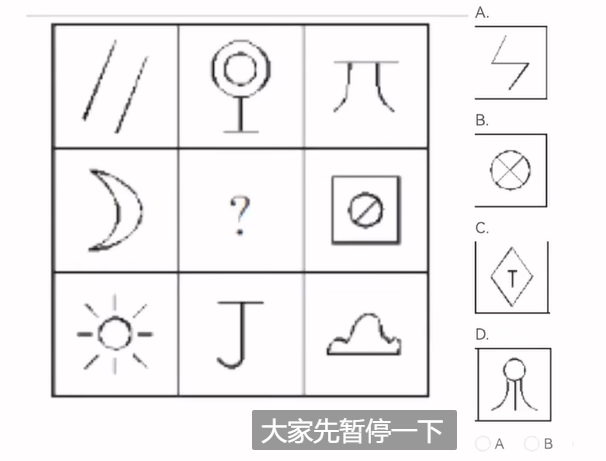
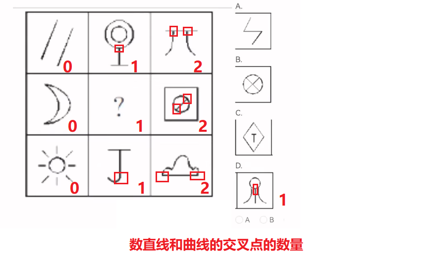
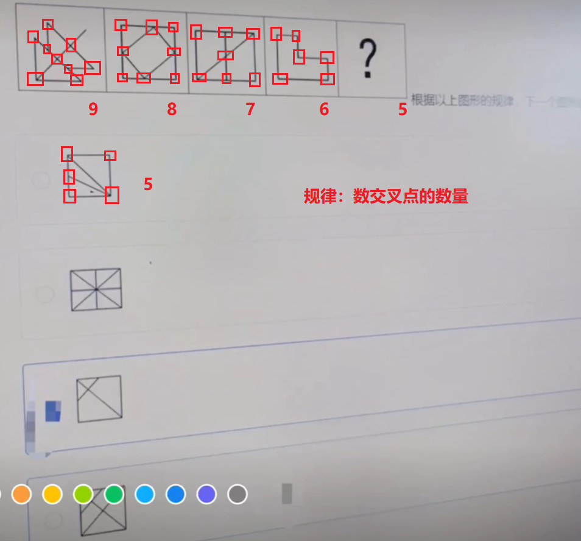
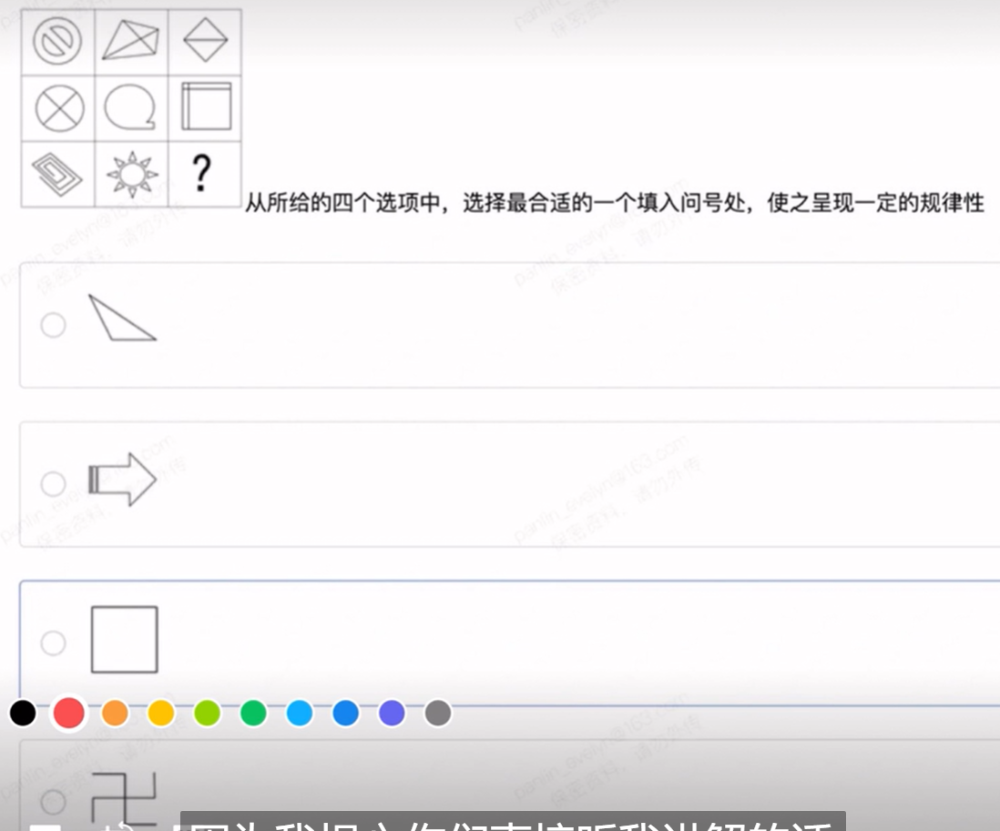
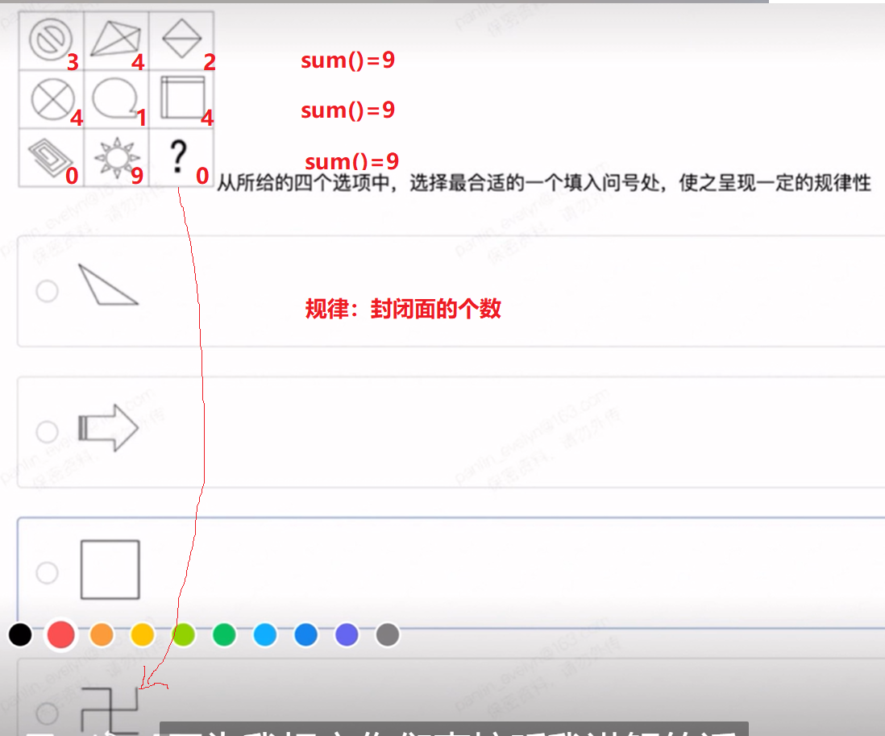
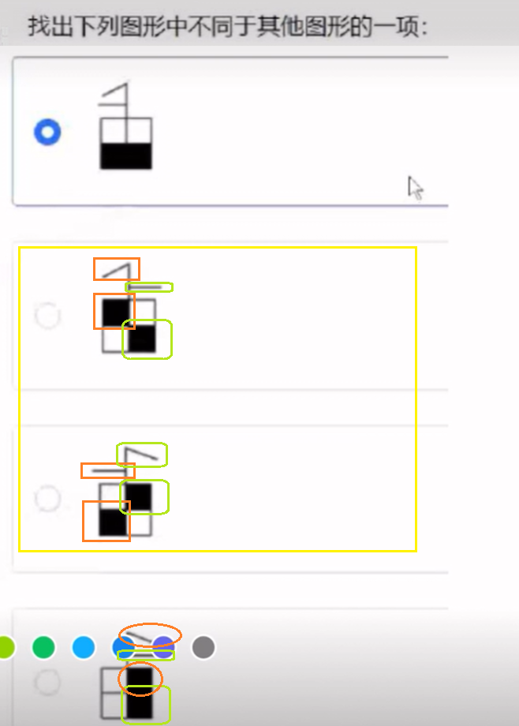
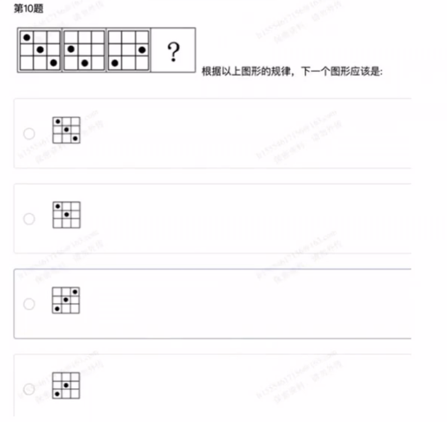
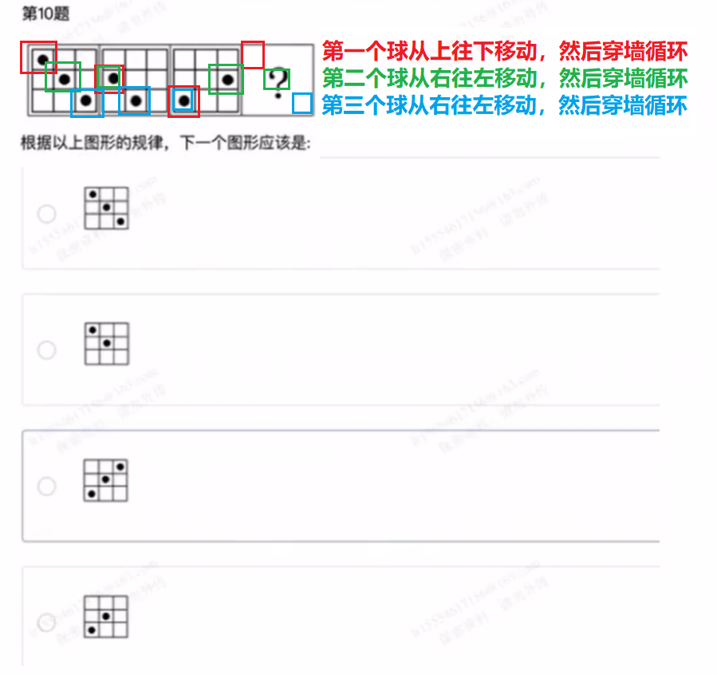
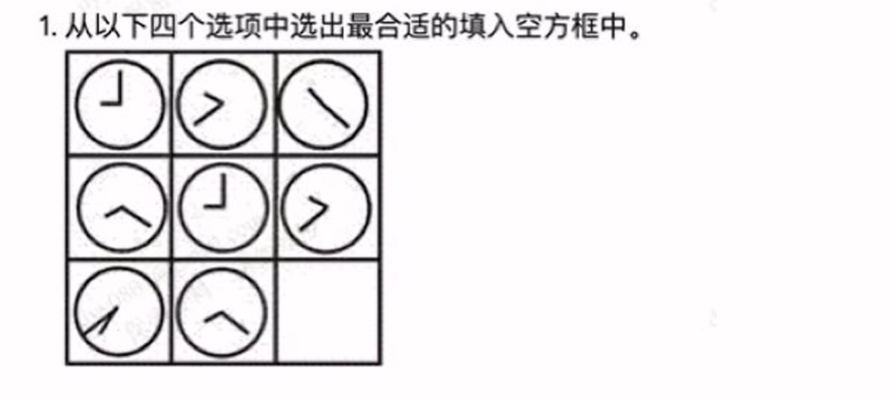
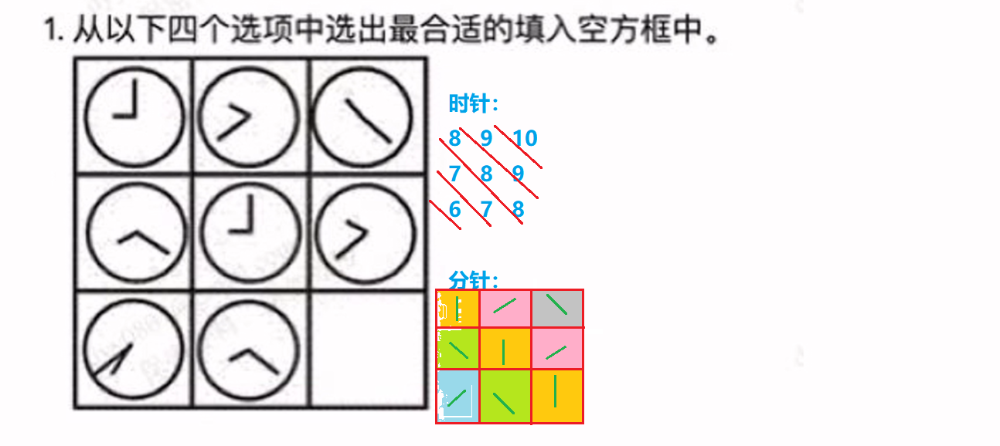

# 行测题做题思路笔记

- 属性：对称轴、中心对称、轴对称、转变、直角、
- 数量：
  - 面的数量、
  - 点数（交叉点的数量、曲线和直线的交叉点的数量）
  - 对称轴数量
- 封闭、开放

## 题1

- 根据最后量个图像不是对称图形，排除属性

**答案**

## 题2

**答案：**

## 题3

**答案**

## 题4

**答案**

## 题5

**答案**

## 题6

**答案**

