# 重学高数：高数基础课学习笔记

> 这次笔记一定要简略！！！，不要又记的详细的跟高数书一样！！！，如果一样那还看什么笔记，之间看高数书不就行了！！！

## 目录

- [重学高数：高数基础课学习笔记](#重学高数高数基础课学习笔记)
  - [目录](#目录)
  - [第一章：极限与连续](#第一章极限与连续)
    - [极限](#极限)
      - [极限的定义](#极限的定义)
      - [无穷小的定义](#无穷小的定义)
      - [一些解释和补充](#一些解释和补充)
      - [极限的性质](#极限的性质)
        - [一般性质](#一般性质)
        - [极限的运算性质](#极限的运算性质)
        - [极限存在准则](#极限存在准则)
      - [极限的重要例题](#极限的重要例题)
      - [无穷小的性质](#无穷小的性质)
  - [连续与间断](#连续与间断)
  - [导数与微分](#导数与微分)

## 第一章：极限与连续

### 极限

- 定义
- 性质

#### 极限的定义

**总表**
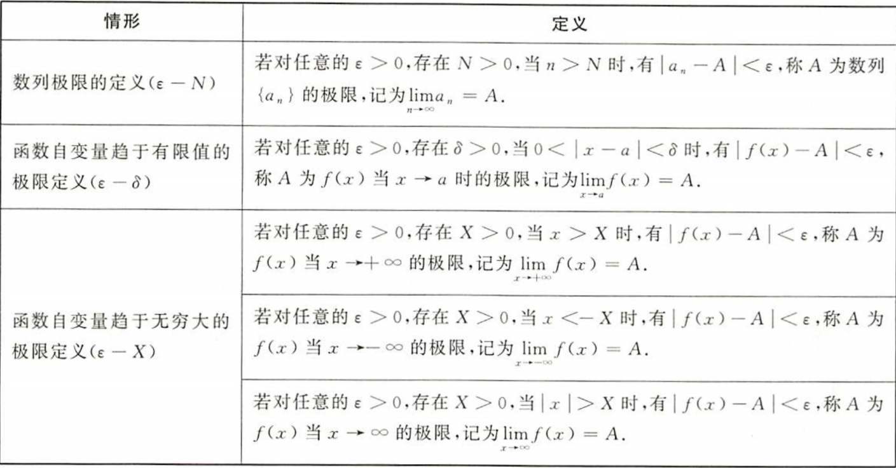

- 数列极限
  - 任取ε>0,就是想说ε可以很取很小,但是无论它取多小，都可以找到一项N,在这一项之后的每一项和A的距离比这个ε还要小，也就是数列在逼近A, A就是数列的极限。
  - 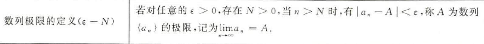
- 函数极限
  - 就是说x逼近a时，f(x)的值逼近A,A就是f(x)在x逼近a时的极限。
  - 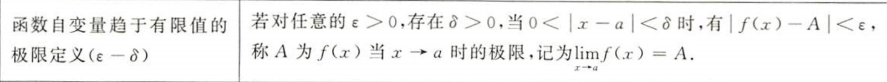
- 无穷大的三种情况
  - 以`x->+∞`举例说明含义：
    - 就是说，x取的越来越大时，f(x)的值逼近A，A就是x->+无穷时的极限
  - 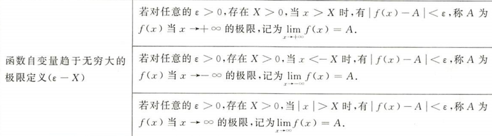

#### 无穷小的定义

- 定义：
  - 是说一个函数f(x)在x->a的条件下,f(x)->0,称f(x)在x->a是为无穷小
  - 需要注意研究对象是函数，且往往需要一个条件。
  - 当然肯定也可以说，x在x->0时为无穷小，因为它是函数：f(x)=x。
  - 另外，0也是无穷小，而且它是不需要任何条件的无穷小。
  - 注意，无穷小是在说函数的极限，所以没有正负，无论其从左靠近0还是从右靠近0,极限都是0.
    - $\lim\limits_{x \to 0^-}{x}=0$
    - $\lim\limits_{x \to 0^+}{x}=0$
  - 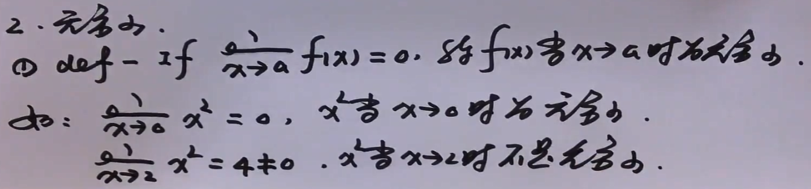
- 无穷小的层次
  - 是为了比较两个无穷小量之间谁更小问题，谁向0跑的快，谁就更小。
  - 假设: 在x->a时,α(x)->0 且 β(x)->0 。
    - **高阶无穷小：**
      - 就是说β比α向0变化的更快，不在一个层次。
      - 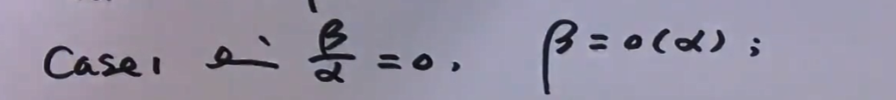
    - **同阶无穷小：**
      - 就是相差k倍（k!=0,k!=∞）
      - 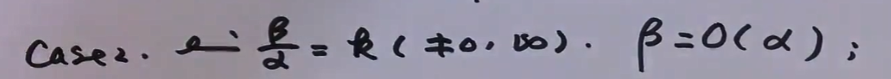
        - **等价无穷小：**
          - 就是k=1的特殊情况
          - 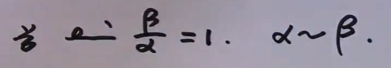
    - 比如
      - 案例1
        - x->0 时 f1(x)=x^2 -> 0
        - x->0 时 f2(x)=x -> 0
        - f1和f2在x->0时都是无穷小
        - 但lim{f1/f2}=0,f1是f2的高阶无穷小。
  - 注意
    - 比较要使用除法
    - 比较不能简单的使用相减来比较，因为无穷小没有符号，
    - 如果知道a>0,b<0,自然就能知道a-b>0,所以：a>b
    - 但是对于无穷小，
    - a->0, a不大于0，也不小于0，也不等于0
    - a->0,b->0 时 就不能确定： `a-b ? 0`
    - 无法确定是大于号还是小于还是等于号，也就无法确定大小。

#### 一些解释和补充

注意：

- x->a(x趋向于a、x逼近a)的两个含义
  - 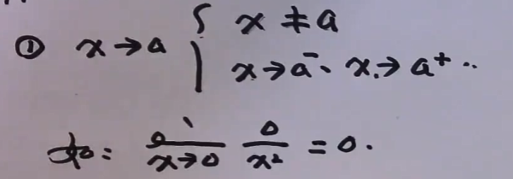
  - 说白了，x->a就是在说x逼近a，而且是从左右两侧逼近a,并且是永远不等于a。
  - 更数学的表达就是：$\forallε>0,有：0<|x-a|<ε$
    - 这里的任取，就是说可以取很大，也可以取很小，但其实最想强调的是取很小。
- 函数在那个点的极限和在那个点的函数值没有必然的联系
  - 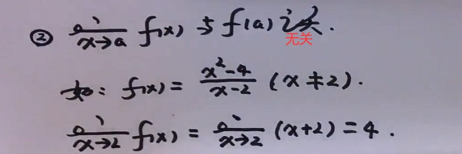
- 去心领域
  - 一般还会说任取ε>0,其实就是为了让ε可以取很小，
  - 这样x就会逼近a,所以实际意义就是x->a
  - 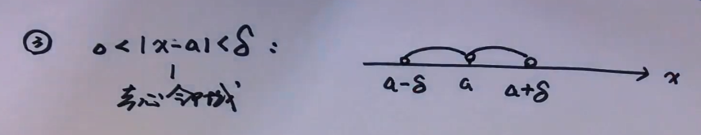
- 左右极限
  - 左极限
    - x在数轴从左到右靠经a,f(x)的值向B靠近，B是函数f(x)在$x->a^-$时的极限
    - 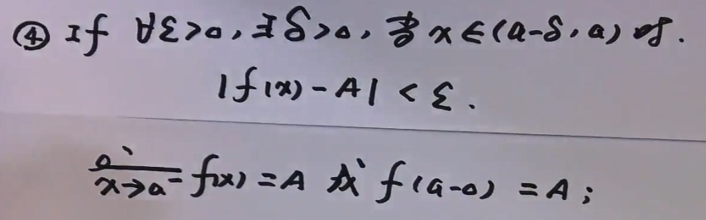
  - 右极限
    - 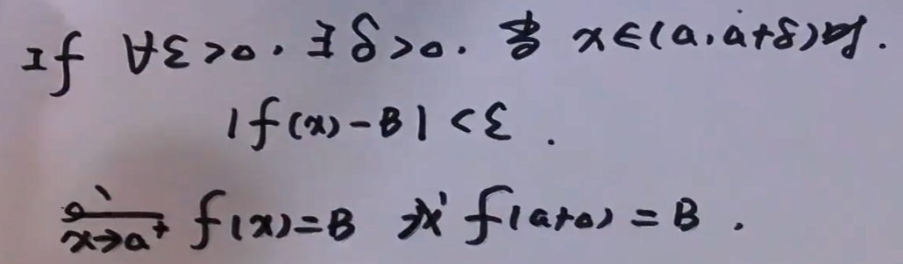
- 函数极限存在的充要条件: 左右极限都存在且相等
  - 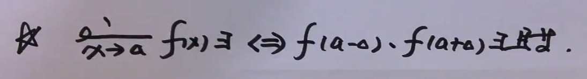
  - tag:重要考点
- 正无穷和负无穷是不一样的
  - 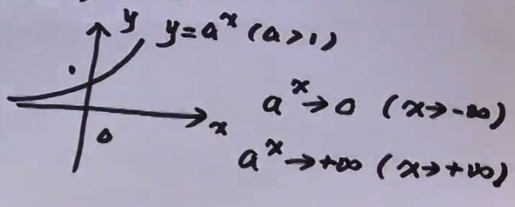
- 对于形式为$a^{\frac{?}{x-b}}$或$a^{\frac{?}{b-x}}$的函数，当x->b时，函数有左右极限，但是两极限值不相等，也就是极限不存在。
  - 这个函数形式实际是根据上图，y=a^x的图形构建出的。
  - 
  - 证明：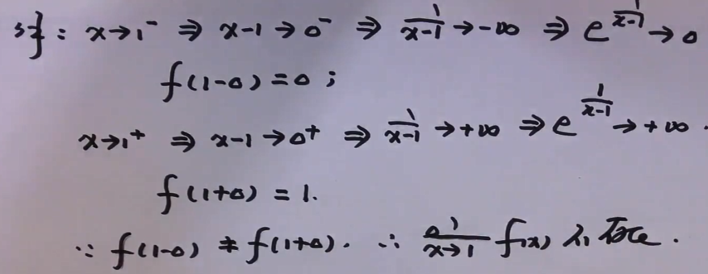
- 无穷有三种情况
  - 如果函数在自变量趋向于正无穷和负无穷时，函数值不相同，那么这两种情况就需要分别讨论，记成x->+∞和x->-∞
  - 如果都一样就记成x->∞
  - 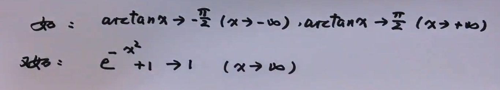

#### 极限的性质
>
> 这些定理都有具体证明，但暂不笔记了，纠结这些证明太浪费时间了，学习进度无法推进，挫败感极强，等学完在看吧。

##### 一般性质

- 唯一性：
  - 极限存在必唯一
- 保号性：
  - 说的是在x->a时，如果f(x)->A>0，那么必然在x=a附近的去心邻域内(半径为ε>0)，f(x)函数值>0
  - 极限值大于0，去心邻域内的函数值大于0
  - 极限值小于0，去心邻域内的函数值小于0
  - 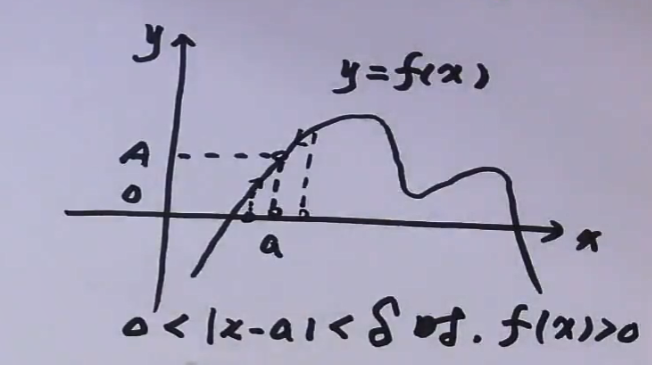
  - 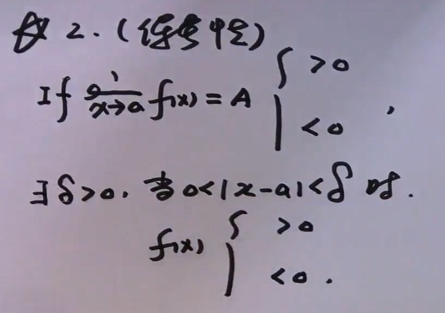
  - tag:重要考点
  - 例题：
    - 例题1
      - f(0)= 1
      - x->0时 lim [f(x)-1]/(x^2)=-1
      - 证明f(0)是极值点。
      - 就是根据保号性推导出在极限点附近的正负号，也就推出其大于0还是小于0，再更具其在0上的值来推断是否为极值
      - 
    - 例题2
      - 分别讨论其在左右领域的符号，得到在左领域导数为正，在右领域导数为负，题目还告知其在领域中心点的导数为0，所以可以确定是极值点。
      - 
      - 
  - 定理3：
    - tag:没讲

##### 极限的运算性质

- ...

##### 极限存在准则

- 准则1：夹闭定理
  - 数列型、函数型
  - 数列型：
    - 就是构造一个比原数列小的数列，然后构造一个比原数列大的数列，但是要让他们的极限比较好计算，如果左右两个数列的极限都是A,则中间这个数的极限也必然是A
    - 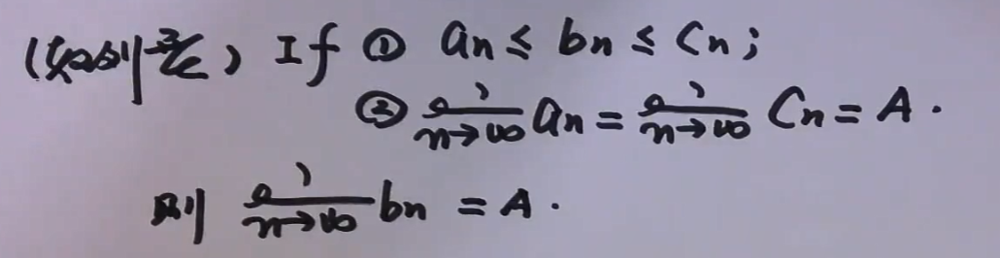
  - 例题
    - 例题1
      - 构造较小的数列和较大的数列
      - 求左右两个数列的极限
      - 另外可以知道这种形式的数列极限，极限值为底数的最大值
      - 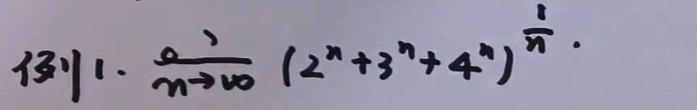
      - 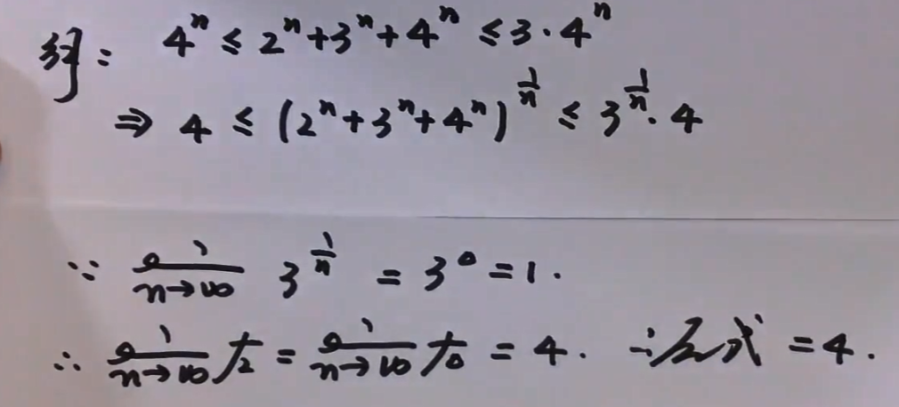
    - 例题2
      - 化简后发现形式和上一题一致，然后可以知道函数值就是底数的最大值，画图可得到分段函数
      - 
      - 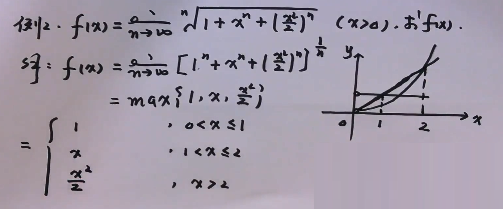
        - - tag:小考点
- 准则2：单调有界数列必有极限
  - 证明过程超纲
  - 注意：
    - 有界
      - 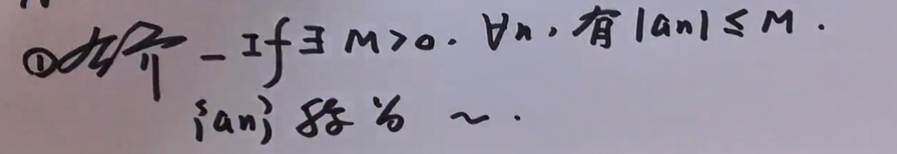
    - 有下界
      - 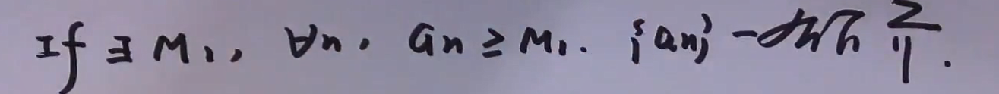
    - 有上界
      - 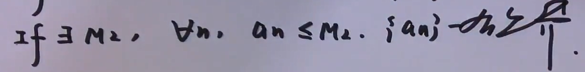
    - 有界<=充分必要=>有上界且有下界
      - 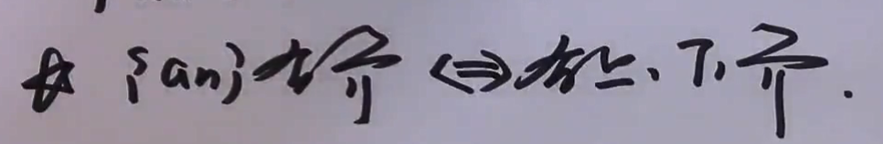
      - 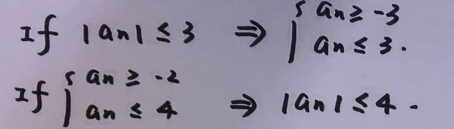
    - 单调有界数列必有极限
      - 比如一个单调递增的数列，由于是数列，那么第1项一定是数列的下界，
        - 如果这个数列没有上界，那么这个数列的极限是正无穷大
        - 如果这个数列拥有上界，那就既有上界又有下界，极限必然存在。
        - 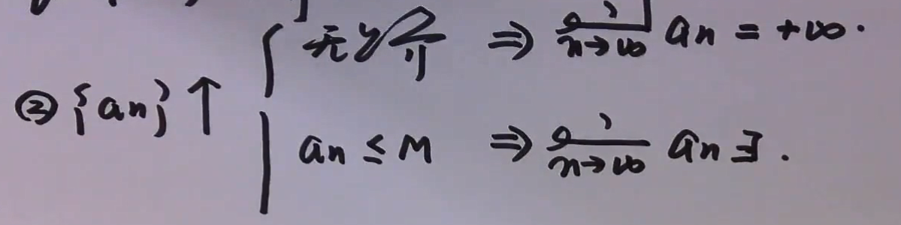
      - 单调递减的数列，第一项一定是其上界
        - 如果数列没有下界，数列极限为负无穷大
        - 如果数列拥有下界，那就既有上界又有下界，极限必然存在
        - 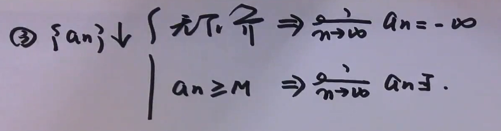
      - 几个重要的不等式
        - 1
          - 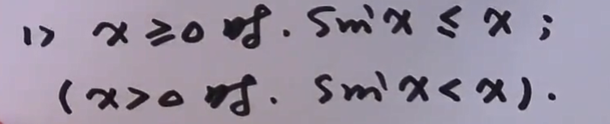
          - 
        - 2
          - 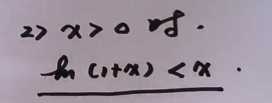
          - 
        - 3
          - 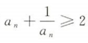
-

#### 极限的重要例题

**型-n次和的极限**
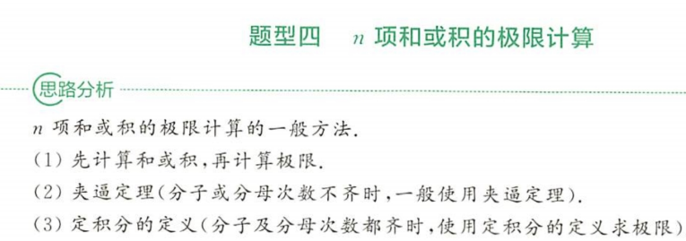

- 先求和或求积，后求极限
  - 
- 分子或分母次数不齐，用夹逼定理
  - 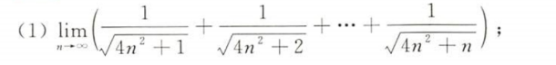
  - 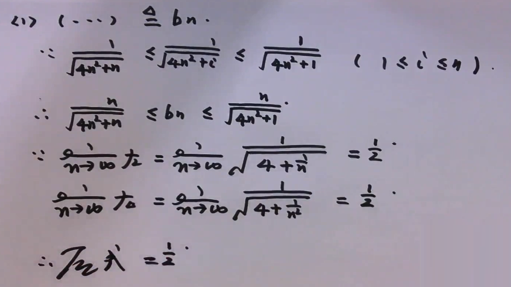
  - 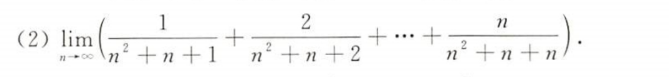
  - 
- 分子分母次数都齐，用定积分的定义
  - 补充知识：
    - 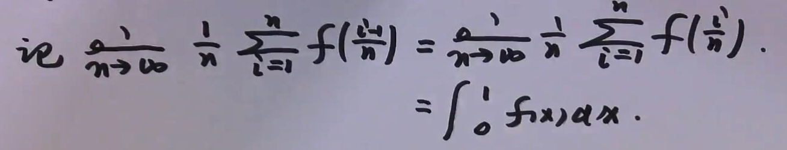
  - 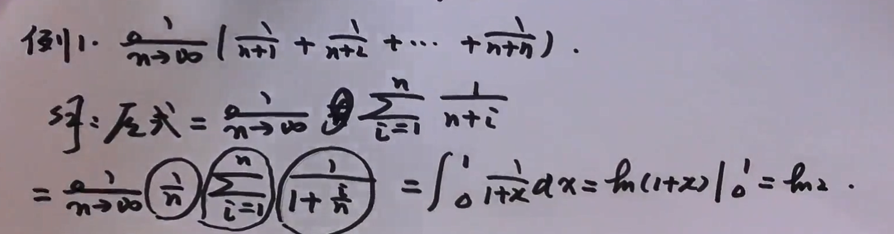
  - 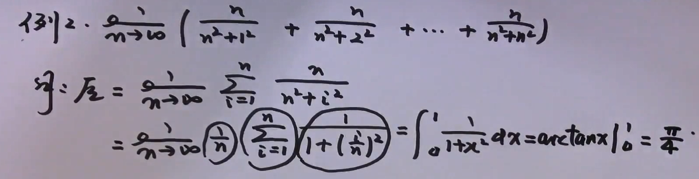

**极限存在的证明**

- 例题
  - 例题1
    - 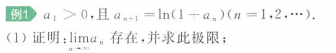
    - 第一步证明其有界
      - 根据a_1>0,设a_k>0，然后只要说明a_{k+1}也大于0，那就能证明一切a_n>0；也就是有下界
    - 第二步说明其单调性
      - 在根据重要不等式：x>0时，`ln(1+x)<x`
      - 可知，第a_{n+1}项是小于第a_n项的，也就是单调递减
      - 单调递减、有下界，所以极限存在
    - 第三步，计算极限
      - 设极限为A,根据递推式，对递推式等号两边分别求极限，得到A=ln(1+A),则A=0
    - 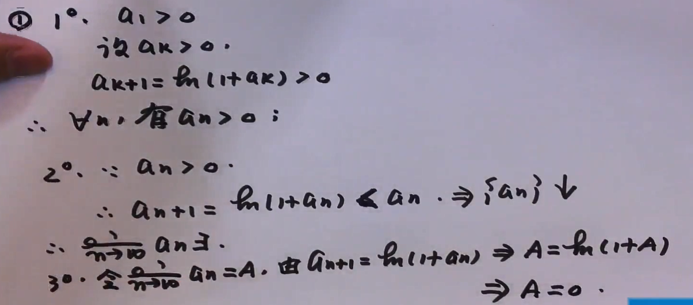
    - 
  - 例题2
    - 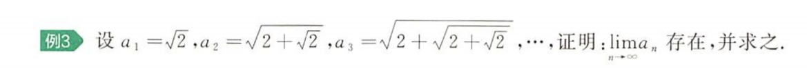
    - 第一步写出递推式
    - 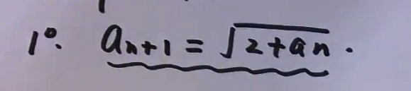
    - 第二步证明数列单调性
    - 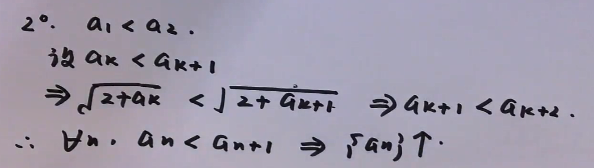
    - 第三步证明数列有界
    - 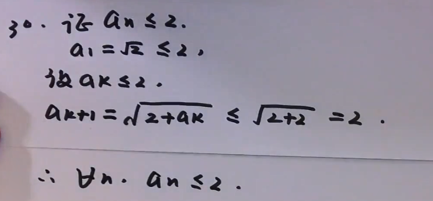
    - 第四步，说明极限存在
    - 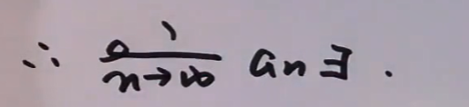
    - 第五步，计算极限
    - 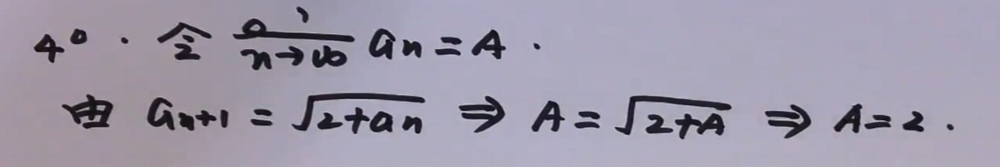
  - 例题3
    - 
    - 步骤和上面一样，说明a_n 和 a_{n+1}都大于或小于某个数从而得出有界的结论
    - 然后这里通过相邻项相减得到一个式子，观察发现这个式子必然小于0，从而得出单调递减
    - 从而证明极限存在
    - 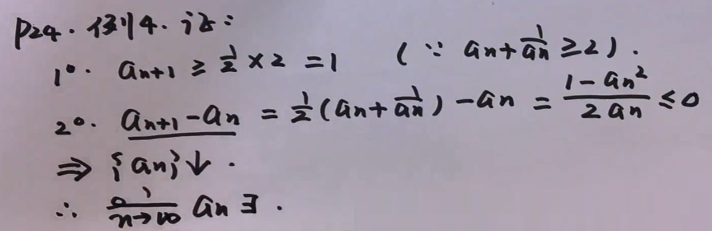

#### 无穷小的性质

一般性质

- 1基本的
  - 1
    - 有限个无穷小相乘为无穷小
    - 有限个无穷小相加为无穷小
    - 常数乘以无穷小为无穷小
    - 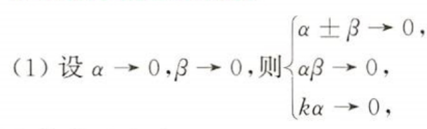
  - 2
    - 有界函数乘无穷小为无穷小
    - 
  - 3
    - 充分必要条件
    - 
- 2等价无穷小性质
  - 重点前两个
  - 
- 3常用等价无穷小
  - 重点前三个
  - 
  
两个重要极限

- 
- 重要不等式
  - 
    - 
  - 

不定型

- 
- 注意
- 三大习惯
  - 
- 两个常识
  - （....等价无穷小）
  - （....任两者都为三阶无穷小）
  - 
- 对加减法中使用等价无穷小要注意阶数一致
  - 

例题

- 1
  - 
  - 
- 2
  - 
  - 
- 3
  - 
  - 
- 4
  - 
  - 
- 5
  - 
  - 
- 6
  - 
  - 
- 7
  - 
  - 
- 8
  - 
  - 

$1^∞$ 型

- 解题技巧
  - 
- 例题
  - 
  - 
  - 
    - 
    - 
  - 
    - 

$\frac{∞}{∞}$型

- 使用洛必达法则
  - 例题1
    - 
    - 结论：
  - 例题2
    - 
    - 结论： 
- 使用结论：
  - 例题1：
    - 
    - 
  - 例题2：
    - 
    - 
  - 例题3：
    - 
    - 

$0*∞$型

- 

$∞-∞$型

- 两种情形：
  - 有分母
  - 无分母
  - 
- 无分母例题
  - 1
    - 
    - 
  - 2
    - 
    - 
    - 
  - 3
    - 
- 有分母例题
  - 1
    - 
    - 

$∞^0$型和$0^0$型

- 解题技巧
  - 写成$e^{ln?}$形式
  - 
- 例题
  - 

## 连续与间断

连续的定义

- 函数在x=a处连续,函数在这一点：左极限=右极限=函数值
- 函数在[a,b]连续,
  - 两点含义：
    - 在区间(a,b)内，处处连续
    - 在a点处只有右极限，在b点处只有左极限
      - (a+0)=f(a) f(b-0)=f(b)
  - 记作f(x)∈C[a,b]
    - C就是Continue


间断的定义

- 函数在x=a处间断，在x-a时f(x)的极限!=f(a)
- 分类
  - 第一类：f(a-0)存在、f(a+0)存在
    - f(a-0)=f(a+0)!=f(a) 称a为可去间断点
    - f(a-0)!=f(a+0)----- 称a为跳跃间断点
  - 第二类间断点：f(a-0)、(a+0)至少一个不存在
  - 
  - 
- 例题
  - 1：
    - 求间断点和分类
    - 
    - 
    - 
    - 
  - 2：
    - 
    - 

函数在闭区间上连续的性质

- 
- 1：存在最值
  - 
- 2：有界
  - 
- 3：零点
  - 
- 4：介值
  - 值域上的任一点称为介值
  - 
  - 
  - 
- 5：介值定理
  - 
  - 注意：
    - 碰到这些条件一般就是使用截止定理得`f(x)∈C[a,b]`
    - 
    - 例题：
    - 1
      - 
      - 
    - 2
      - 
      - 

## 导数与微分
