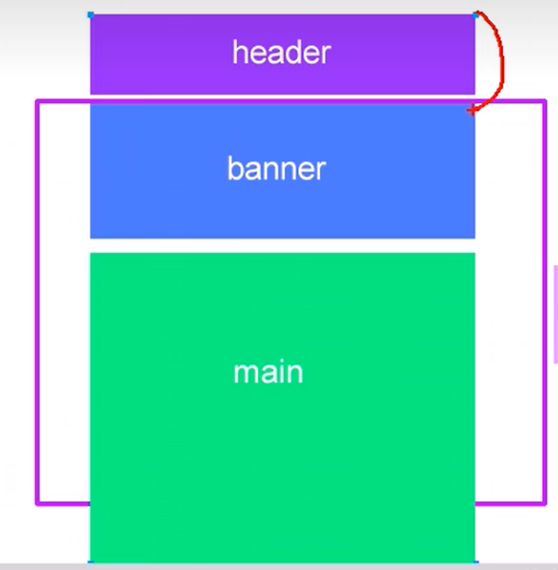

# jsWebApis学习笔记之DOM

## 目录

- [jsWebApis学习笔记之DOM](#jswebapis学习笔记之dom)
  - [目录](#目录)
  - [内容组成](#内容组成)
    - [Web API](#web-api)
    - [DOM](#dom)
      - [DOM的一些概念](#dom的一些概念)
  - [获取元素](#获取元素)
    - [根据ID获取](#根据id获取)
    - [根据标签获取](#根据标签获取)
    - [根据类名获取](#根据类名获取)
    - [查询选择器](#查询选择器)
    - [特殊元素标签的获取](#特殊元素标签的获取)
  - [事件](#事件)
    - [常用事件类型](#常用事件类型)
      - [面试题：mousemove与mouseenter的区别](#面试题mousemove与mouseenter的区别)
    - [DOM事件流](#dom事件流)
    - [注册事件](#注册事件)
      - [传统注册方式](#传统注册方式)
      - [方法监听注册方式](#方法监听注册方式)
        - [事件监听方法的使用](#事件监听方法的使用)
      - [解绑事件](#解绑事件)
      - [事件委托](#事件委托)
        - [面试题：事件委托原理](#面试题事件委托原理)
    - [事件对象](#事件对象)
      - [事件对象的属性和方法](#事件对象的属性和方法)
    - [鼠标事件对象](#鼠标事件对象)
      - [获取鼠标在页面中的坐标](#获取鼠标在页面中的坐标)
      - [案例：拖拽移动元素](#案例拖拽移动元素)
    - [键盘事件对象](#键盘事件对象)
      - [案例：使输入框获得焦点](#案例使输入框获得焦点)
      - [案例：放大显示输入内容](#案例放大显示输入内容)
  - [操作元素](#操作元素)
    - [修改元素内容](#修改元素内容)
    - [修改元素属性](#修改元素属性)
    - [修改元素样式](#修改元素样式)
    - [修改元素类名](#修改元素类名)
    - [单标签(表单)元素属性的修改](#单标签表单元素属性的修改)
    - [操作元素示例](#操作元素示例)
  - [节点操作](#节点操作)
  - [元素偏移量offset系列属性](#元素偏移量offset系列属性)
  - [元素可视区client系列属性](#元素可视区client系列属性)
  - [元素滚动scroll系列属性](#元素滚动scroll系列属性)
  - [页面window.scroll](#页面windowscroll)
  - [offset、client、scroll三系列总结](#offsetclientscroll三系列总结)
  - [dom核心知识点总结](#dom核心知识点总结)
    - [创建](#创建)
    - [增](#增)
    - [删](#删)
    - [改](#改)
    - [查](#查)
    - [属性操作](#属性操作)
    - [事件操作](#事件操作)
  - [一些案例](#一些案例)
    - [全选框](#全选框)
    - [全选框2](#全选框2)
    - [tab栏切换制作](#tab栏切换制作)
    - [新浪下拉菜单](#新浪下拉菜单)
    - [简单留言发布案例实现](#简单留言发布案例实现)
    - [动态生成表格](#动态生成表格)
    - [实例：防止复制内容](#实例防止复制内容)
      - [禁止鼠标右键菜单](#禁止鼠标右键菜单)
      - [禁止鼠标选中文字](#禁止鼠标选中文字)
      - [禁止f12键](#禁止f12键)
    - [实例：阻止链接跳转](#实例阻止链接跳转)

## 内容组成

- JavaScript基础语法是ECMA组织制定的

- Web Apis 是W3C组织制定的标准
  - 主要学习BOM DOM


### Web API

- **API**（application programming interface应用程序编程接口）是一些预先定义的函数，提供给应用程序和开发人员基于某软件或硬件访问一组例程的能力，而又无需访问源码、理解内部工作机制细节

- **Web API**是浏览器提供的一套操作浏览器功能和页面的API （BOM DOM）
  - alert()是BOM API

### DOM

- **DOM**（Document Object Model文档对象模型），是**W3C**组织推荐的处理**可扩展标记语言**的标准**编程接口**
  - 可扩展标记语言：
    - HTML
    - XML

#### DOM的一些概念

- **DOM树**
    

- **文档document** ：一个页面就是一个文档
- **元素element** ：页面中所有的标签都是元素
- **节点node** ：页面中所有内容都可看做节点（标签，属性，文本，注释等）

- **对象** ，DOM把文档，元素，节点看做对象

## 获取元素

- 根据ID获取

- 根据标签获取
- 根据HTML5新增方法获取
- 特殊元素获取

### 根据ID获取  

`document.getElementById("idName")`

```html
<div id="Demo1">123</div>
<script>
    //参数是区分大小写的字符串
    //返回一个对象
    var Demo1=document.getElementById("Demo1")

    //测试：
    console.log(Demo1)// <div id="Demo1">123</div>
    console.log(typeof Demo1)// object
    console.dir(Demo1)// dir()用于打印查看元素对象，可以看到其属性和方法

//注意：默认情况下，script标签需写在#Demo1 标签之后，因为文档页面从上往下加载，script加载时#Demo1标签必须已经存在，
</script>
```

### 根据标签获取  

获取整个页面的某标签`document.getElementsByTagName()`

```html
<ul>
    <li>1</li>
    <li>2</li>
    <li>3</li>
    <li>4</li>
    <li>5</li>
</ul>
<script>
    // 获得元素是动态的。个人理解：对元素的修改会同步到html，对html的修改会同步到获得到的元素

    //返回值为获取的元素对象的集合，是伪数组
    // 即使只有一个li，用该函数获取是有一个元素的伪数组，
    //如果页面中没有li标签，返回值是空的伪数组
    // document.getElementsByTagName获取到的是整个页面的相应标签
    var elements2=document.getElementsByTagName("li")
    console.log(elements2)
    console.log(elements2[0])
    console.dir(elements2)
    console.dir(elements2[0])

</script>
```

获取某个标签的子标签`element.getElementsByTagName()`

```html
<ul>
    <li>0</li>
    <li>0</li>
    <li>0</li>
    <li>0</li>
    <li>0</li>
</ul>
<ol id="olDemo">
    <li>1</li>
    <li>2</li>
    <li>3</li>
    <li>4</li>
    <li>5</li>
</ol>
<script>
    // element.getElementsByTagName 获取到的是某元素的所有子标签
    var ol=document.getElementById("olDemo")
    var ol_li=ol.getElementsByTagName("li")
    console.log(ol_li)
    console.log(ol_li[0])
    console.dir(ol_li)
    console.dir(ol_li[0])
</script>
```

### 根据类名获取  

- getElementsByClassName()

- **该方法是是HTML5标准**，ie678不支持html5  

获取整个页面的某标签`document.getElementsByClassName()`

```html
<div class="classN1">1</div>
<div class="classN1">2</div>

<script>
    var divs=document.getElementsByClassName("classN1")
    console.log(divs);
    console.dir(divs);
</script>
```

### 查询选择器  

- **该方法是HTML5标准**  

querySelector返回查询到的**第一个**元素

```html
    <div class="father">
        <div id="id1" class="class1">1</div>
        <div class="class1">2</div>
    </div>

    <script>
        // 传入的字符串类似css的选择器语法
        // querySelector返回第一个查询到的元素
        var divs=document.querySelector(".father>div#id1.class1")
        console.log(divs);
        console.dir(divs);
    </script>
```

querySelectorAll返回查询到的**所有**元素

```html
    <div class="father">
        <div id="id1" class="class1">1</div>
        <div class="class1">2</div>
    </div>

    <script>
        // 返回值为存放节点的伪数组
        var divs=document.querySelectorAll(".father>div.class1")
        console.log(divs);
        console.dir(divs);
    </script>
```

### 特殊元素标签的获取

```html
<script>
    //body标签直接用document.body获取
    var bodyEle=document.body
    console.log(bodyEle);
    console.dir(bodyEle);

    //body标签用document.documentElement获取
    var htmlEle=document.documentElement
    console.log(htmlEle);
    console.dir(htmlEle);
</script>
```

## 事件

- 事件是可以被js检测到的行为

- 可以理解为触发响应机制
- 事件三要素（组成）
  - 事件源：事件被触发的元素对象
  - 事件类型：事件是如何触发的，鼠标点击？ 鼠标经过？
  - 事件处理程序: 通过函数赋值的方式完成
- 执行事件的步骤
  - 获取事件源
  - 注册事件（绑定事件）
  - 添加事件处理程序（函数赋值）

**示例**

```html
<button id="btn">点击</button>
<script>
    //事件源
    var btn=document.getElementById("btn")
    //事件类型，事件处理程序
    btn.onclick = function(){
        //do something...
        alert("点击了按钮")
    }
</script>
```

### 常用事件类型

- `element.onclick` 鼠标点击

- `element.onfocus` 获得鼠标焦点
- `element.onblur` 失去鼠标焦点
- `element.onmouseover` 鼠标经过
- `element.onmouseout` 鼠标离开
- `element.onmousemove` 鼠标移动
- `element.onmouseup` 鼠标弹起触发
- `element.onmousedown` 鼠标按下触发
- `element.onkeyup` 键盘弹起 松开按键时会触发一次
- `element.onkeydown` 键盘按下 按下后会一直不断触发
- `element.onkeypress` 键盘按下，按下后会一直不断触发 但不能识别功能键，如ctrl shift
- 按键事件执行顺序为down->press->up

#### 面试题：mousemove与mouseenter的区别

- 当鼠标移动到元素上时就会触发moseenter事件

- mouseover是鼠标经过自身盒子会触发，经过子盒子，父盒子也会触发该事件
- moseenter是只有鼠标经过自身盒子才会触发，
- 因为moseenter不支持冒泡，子元素的事件不会传播到父级
- 常和moseenter搭配的mouseleave也不支持冒泡，

### DOM事件流

- 事件流描述的是从页面中接收事件的顺序

- 时间发生时，事件会在元素节点之间按特定顺序传播，该过程称为DOM事件流
- 模型三阶段
  - 捕获阶段、
  - 目标阶段、
  - 冒泡阶段
- 事件冒泡：IE提出
- 事件冒泡：网景提出
- 注意
  - js代码中只能执行捕捉阶段和冒泡阶段中的一种事件
  - onclick和attachEvent只能得到冒泡阶段的事件
  - addEventListener
    - 可以得到两种中任意一种阶段的事件，
    - 默认接收冒泡阶段的事件，
    - 第三个参数设置为true时，接收捕获阶段的事件
  - 实际开发中很少使用事件捕捉，更关注事件冒泡
  - 有些事件没有冒泡：onblur onfocus onmouseenter onmouseleave
  - 事件冒泡有事会带来麻烦，有时又很有用


**两种事件传播方式测试**

<div id="demoVMOWIEJF" style="display: inline-block;background-color: skyblue; ">
    <div>
        <button style="margin: 20px;">捕获阶段事件传播测试</button>
    </div>
</div>
<div id="demoFBERT45" style="display: inline-block;background-color: skyblue; ">
    <div>
        <button style="margin: 20px;">冒泡阶段事件传播测试</button>
    </div>
</div>
<script>
    var father1=document.querySelector("#demoVMOWIEJF>div")
    father1.addEventListener("click",function(){
        alert("father:检测到捕获阶段事件click")
    },
    true
    )
    father1.firstElementChild.addEventListener("click",function(){
        alert("child:检测到捕获阶段事件click")
    },
    true
    )
    var father2=document.querySelector("#demoFBERT45>div")
    father2.addEventListener("click",function(){
        alert("father:检测到冒泡阶段事件click")
    },
    false
    )
    father2.firstElementChild.addEventListener("click",function(){
        alert("child:检测到冒泡阶段事件click")
    },
    false
    )
</script>

```html
<div id="demoVMOWIEJF" style="display: inline-block;background-color: skyblue; ">
    <div>
        <button style="margin: 20px;">捕获阶段事件传播测试</button>
    </div>
</div>
<div id="demoFBERT45" style="display: inline-block;background-color: skyblue; ">
    <div>
        <button style="margin: 20px;">冒泡阶段事件传播测试</button>
    </div>
</div>
<script>
    var father1=document.querySelector("#demoVMOWIEJF>div")
    father1.addEventListener("click",function(){
        alert("father:检测到捕获阶段事件click")
    },
    true
    )
    father1.firstElementChild.addEventListener("click",function(){
        alert("child:检测到捕获阶段事件click")
    },
    true
    )

    var father2=document.querySelector("#demoFBERT45>div")
    father2.addEventListener("click",function(){
        alert("father:检测到冒泡阶段事件click")
    },
    false
    )
    father2.firstElementChild.addEventListener("click",function(){
        alert("child:检测到冒泡阶段事件click")
    },
    false
    )
    
</script>
```

### 注册事件

- 给元素添加事件称为注册事件或绑定事件
- 注册事件有两种方式
  - 传统方式
  - 方法监听注册方式

#### 传统注册方式

- 利用on开头的事件名注册，如onclick
- `<button onclick="alert('hi~')"></button>`
- `btn.onclick=function(){}`
- 特点：注册事件的**唯一性** 同一个元素同一个事件只能设置一个处理函数，最后注册的处理函数将会覆盖前面注册的处理函数

#### 方法监听注册方式

- w3c标准 推荐的方式

- `addEventListener()` **方法监听** ie678不支持
- `attachEvent(eventNameWithOn,callback)`代替，**仅ie8及之前支持** 是一个非标准特性，应尽量不要在生产环境中使用
- 同一个元素同一个事件可以注册多个**监听器（事件处理函数）**
- 按注册顺序依次执行

##### 事件监听方法的使用

- `element.addEventListener(type,listener[,useCapture])`

- `type`:事件类型字符串，如click moseover 注意不带on
- `listener`：事件处理函数，事件发生时，会调用该监听函数
- `useCapture`:可选参数，布尔值，默认false，与DOM事件流相关

#### 解绑事件

- 传统方法：`element.onclick=null`

- 事件监听方法:
    1. 注册：`element.addEventListener(事件类型,非匿名函数名)`
    2. 解绑：
        - `element.addEventListener(事件类型,非匿名函数名)`
        - 或  `element.detachEvent(eventNameWithOn,非匿名函数名)` **仅ie8及之前支持**

**两种方法的测试**

<div id="demoBIUBITYy">
    <button>传统注册事件</button>
    <button>方法监听注册事件</button>
</div>
<script>
    var buttons=document.querySelectorAll("#demoBIUBITYy>button")
    buttons[0].onclick=function(){
        alert("传统注册事件,触发消息1")
    }
    buttons[0].onclick=function(){
        alert("传统注册事件,触发消息2")
    }
    buttons[1].addEventListener("click",function(){
        alert("方法监听注册事件,触发消息1")
    })
    buttons[1].addEventListener("click",function(){
        alert("方法监听注册事件,触发消息2")
    })
</script>

```html
<div id="demoBIUBITYy">
    <button>传统注册事件</button>
    <button>方法监听注册事件</button>
</div>
<script>
    var buttons=document.querySelectorAll("#demoBIUBITYy>button")
    buttons[0].onclick=function(){
        alert("传统注册事件,触发消息1")
    }
    buttons[0].onclick=function(){
        alert("传统注册事件,触发消息2")
    }
    
    buttons[1].addEventListener("click",function(){
        alert("方法监听注册事件,触发消息1")
    })
    buttons[1].addEventListener("click",function(){
        alert("方法监听注册事件,触发消息2")
    })
</script>
```

**封装兼容性事件注册函数**

```js
    function myAddEventListener(element,eventName,callback)
    {
        if(document.addEventListener)//兼容性处理原则：首先照顾大多数浏览器，再处理特殊浏览器
        {
            element.addEventListener(eventName,callback);
        }else if(document.attachEvent)
        {
            element.attachEvent("on"+eventName,callback);
        }else{
            element["on"+eventName]=callback;
        }
    }
```

**封装兼容性事件解绑函数**

```js
    function myAddEventListener(element,eventName,callback)
    {
        if(document.removeEventListener)//兼容性处理原则：首先照顾大多数浏览器，再处理特殊浏览器
        {
            element.addEventListener(eventName,callback);
        }else if(document.detachEvent)
        {
            element.detachEvent("on"+eventName,callback);
        }else{
            element["on"+eventName]=null;
        }
    }
```

#### 事件委托

- 时间委托也称事件代理，在JQuery中称事件委派

- 对于ul>li这样结构的元素标签，实现点击li后弹出对话框，需要给所有li注册事件，li越多，访问DOM的次数也越多，这就会延长整个页面交互就绪的时间。

##### 面试题：事件委托原理

不是用for循环为每个子节点单独设置事件监听器，而是事件监听器设置在其父节点上，然后利用event.target属性和冒泡原理控制每个子节点

**事件委托测试**

<ul id="demoHsfweo9">
    <li>123</li>
    <li>123</li>
    <li>123</li>
    <li>123</li>
    <li>123</li>
</ul>
<script>
    var ul = document.querySelector("#demoHsfweo9");
    ul.addEventListener("click",function(event){
        for(var i=0;i<ul.children.length;i++)
        {
            ul.children[i].style.backgroundColor=""
        }
        event.target.style.backgroundColor="pink"
    })
</script>

```html
<ul id="demoHsfweo9">
    <li>123</li>
    <li>123</li>
    <li>123</li>
    <li>123</li>
    <li>123</li>
</ul>
<script>
    var ul = document.querySelector("#demoHsfweo9");
    ul.addEventListener("click",function(event){
        for(var i=0;i<ul.children.length;i++)
        {
            ul.children[i].style.backgroundColor=""
        }
        event.target.style.backgroundColor="pink"
    })
</script>
```

### 事件对象

```js
element.onclick=function(event){
    console.log(event)
}
```

- 事件对象代表了事件的状态，如键盘按下的状态，鼠标的位置，鼠标的按钮状态

- 事件对象是事件处理函数的第一个形参获取到的对象
- 事件对象只有事件发生才会存在，是系统自动创建并传递的
- 事件对象是与事件相关的一系列数据的集合，
  - 如鼠标点击事件发生后，事件对象中就包含鼠标的坐标信息
- 事件对象的形参名可以自定义
- 兼容性问题：ie678需要通过window.event来获取事件对象
  - 兼容性写法 `event=event||window.event`
  
#### 事件对象的属性和方法

1. **获取的是触发事件的元素对象** `event.target`
    - 与`this`的区别：this永远指向被绑定事件的元素
    - 简单来说：对于click事件，this返回的是绑定该事件的元素，target返回的是被点击的元素
    - `event.currentTarget` 和 `this` 的值一致
    - 兼容性问题：**ie678**仅支持`event.srcElement`属性
    - 兼容性写法：
        1. `var e=event||window.event;`
        1. `var target=e.target||e.srcElement`
1. **获取事件类型** `event.type` ，不带on
1. **阻止默认事件默认行为** `event.preventDefault()` dom标准函数，阻止默认事件默认行为，如不让链接跳转
    - 兼容性问题：
        - **ie678** 调用该属性：`e.returnValue;`
        - 新旧浏览器通用写法： return false; 但只能用于传统的注册方式
1. **阻止冒泡** `event.stopPropagation()` dom标准方法 直译为停止传播
    - 兼容性问题：ie678仅支持 event.cancelBubble=true 直译为取消冒泡

### 鼠标事件对象

#### 获取鼠标在页面中的坐标

- 鼠标相关事件能获取到坐标

- `event.clientX` 鼠标相对于**浏览器窗口可视区域**的X坐标,**左上角为(0,0)**,无论页面是否拖动
- `event.clientY`
- `event.pageX` 鼠标相对于**整个html文档页面**的X坐标 **IE678不支持**
- `event.pageY`
- `event.screenX` 鼠标相对于**电脑屏幕**的X坐标
- `event.screenY`

- 画了张图：


#### 案例：拖拽移动元素

<div id="demoKjowejf9" style="position: fixed; background-color:skyblue;width:100px;height:100px; cursor:move;"></div>
<script>
    var demoKjowejf9=document.querySelector("#demoKjowejf9")
    function move(event){
        // console.log(event.target);
        demoKjowejf9.style.left=event.clientX - parseInt(demoKjowejf9.style.width)/2  +"px"
        demoKjowejf9.style.top=event.clientY -  parseInt(demoKjowejf9.style.height)/2  +"px"
    }
    demoKjowejf9.addEventListener("mousedown",function(event){
        // console.log(event);
        document.addEventListener("mousemove",move)
    })
    demoKjowejf9.addEventListener("mouseup",function(event){
        // console.log(event);
        document.removeEventListener("mousemove",move)
    })
</script>

```html
<div id="demoKjowejf9" style="position: fixed; background-color:skyblue;width:100px;height:100px; cursor:move;"></div>
<script>
    var demoKjowejf9=document.querySelector("#demoKjowejf9")
    function move(event){
        // console.log(event.target);
        demoKjowejf9.style.left=event.clientX - parseInt(demoKjowejf9.style.width)/2  +"px"
        demoKjowejf9.style.top=event.clientY -  parseInt(demoKjowejf9.style.height)/2  +"px"
    }
    demoKjowejf9.addEventListener("mousedown",function(event){
        // console.log(event);
        document.addEventListener("mousemove",move)
    })
    demoKjowejf9.addEventListener("mouseup",function(event){
        // console.log(event);
        document.removeEventListener("mousemove",move)
    })
</script>
```

### 键盘事件对象

触发事件名

- 按键事件执行顺序为down->press->up
- `element.onkeyup` 键盘弹起 松开按键时会触发一次
- `element.onkeydown` 键盘按下 按下后会一直不断触发
- `element.onkeypress` 键盘按下，按下后会一直不断触发 但不能识别功能键，如ctrl shift
键盘事件对象属性
- `event.key` 按键值，低版本浏览器不支持
- `event.keyCode` 按键ASCII值
- `keyup` 和 `keydown` 事件不区分字母大小写，a和A都是65
- `keypress` 事件区分字母大小写，a是97 A是65

#### 案例：使输入框获得焦点

<input type="text" id="demoNFOEWFH1234">
<script>
    var demoNFOEWFH1234 = document.querySelector("#demoNFOEWFH1234")
    document.addEventListener("keyup",function(e){//用keyup可以避免字符被输入进文本框
        // console.log(e.keyCode);
        if(e.keyCode==83)
        {
            demoNFOEWFH1234.focus();//使输入框获得焦点
        }
    })
</script>

```html
<input type="text" id="demoNFOEWFH1234">
<script>
    var demoNFOEWFH1234 = document.querySelector("#demoNFOEWFH1234")
    document.addEventListener("keyup",function(e){//用keyup可以避免字符被输入进文本框
        // console.log(e.keyCode);
        if(e.keyCode==83)
        {
            demoNFOEWFH1234.focus();//使输入框获得焦点
        }
    })
</script>
```

#### 案例：放大显示输入内容

注意对于文本框来说，keydown keypress事件发生时，文字还未填入文本框中
keyup事件发生时，文字已经落入文本框

<style>
     #demo123WEFWF{
        position: relative;
     }
    #demo123WEFWF input{
        padding: 0;
        margin-top: 0px;
        height: 20px;
        width: 200px;
        box-sizing: border-box;
        outline: none;
        /*height: 50px;*/
    }
    #demo123WEFWF div{
        box-sizing: border-box;
        display: none;
        margin-bottom: 8px;
        padding-left: 10px;
        height:40px;
        width: 200px;
        background-color: white;
        box-shadow: 0 0 8px gray;
        line-height: 40px;
        font-size: 30px;

        word-break: keep-all;
        overflow-x: auto;
        overflow-y: hidden;
    }
    #demo123WEFWF div::-webkit-scrollbar{
    /*清除滚动条 */
        /* display: none; */
        height: 2px;
    }
    #demo123WEFWF div::-webkit-scrollbar-thumb{
        /* height: 3px;*/
        background-color: gray;
    }
    #demo123WEFWF::after{
        position:absolute;
        top: 40px;
        left: 10px;
        display: block;
        content: "";
        width: 0;
        height: 0;
        border-top: 5px solid white;
        border-bottom: 5px solid transparent;
        border-left: 5px solid transparent;
        border-right: 5px solid transparent;
    }
</style>
<div id="demo123WEFWF">
    <div></div>
    <input type="text" >
</div>
<script>
    var demo123WEFWF = document.querySelector("#demo123WEFWF")
    var input = demo123WEFWF.querySelector("input")
    var div = demo123WEFWF.querySelector("div")
    input.addEventListener("keyup",function(event){
        if(this.value=="")
        {
            div.style.display="none"
        }else{
            div.style.display="block"
            div.innerHTML=this.value;
            div.scrollLeft =div.scrollWidth;//使滚动条右对齐，以始终显示最新内容
        }
    })
    input.addEventListener("focus",function(){//获得焦点后显示盒子
        if(this.value!="")
            div.style.display="block"
    })
    input.addEventListener("blur",function(){//失去焦点后隐藏盒子
        div.style.display="none"
    })
</script>

```html
<style>
     #demo123WEFWF{
        position: relative;
     }
    #demo123WEFWF input{
        padding: 0;
        margin-top: 0px;
        height: 20px;
        width: 200px;
        box-sizing: border-box;
        outline: none;
        /* height: 50px; */
    }
    #demo123WEFWF div{
        box-sizing: border-box;
        display: none;
        margin-bottom: 8px;
        padding-left: 10px;
        height:40px;
        width: 200px;
        background-color: white;
        box-shadow: 0 0 8px gray;
        line-height: 40px;
        font-size: 30px;

        word-break: keep-all;
        overflow-x: auto;
        overflow-y: hidden;
    }
    #demo123WEFWF div::-webkit-scrollbar{
    /* 清除滚动条 */
        /* display: none; */
        height: 2px;
    }
    #demo123WEFWF div::-webkit-scrollbar-thumb{
        /* height: 3px; */
        background-color: gray;
    }
    #demo123WEFWF::after{
        position:absolute;
        top: 40px;
        left: 10px;
        display: block;
        content: "";
        width: 0;
        height: 0;
        border-top: 5px solid white;
        border-bottom: 5px solid transparent;
        border-left: 5px solid transparent;
        border-right: 5px solid transparent;
    }
</style>
<div id="demo123WEFWF">
    <div></div>
    <input type="text" >
</div>
<script>
    var demo123WEFWF = document.querySelector("#demo123WEFWF")
    var input = demo123WEFWF.querySelector("input")
    var div = demo123WEFWF.querySelector("div")
    input.addEventListener("keyup",function(event){
        if(this.value=="")
        {
            div.style.display="none"
        }else{
            div.style.display="block"
            div.innerHTML=this.value;
            div.scrollLeft =div.scrollWidth;//使滚动条右对齐，以始终显示最新内容
        }
    })
    input.addEventListener("focus",function(){//获得焦点后显示盒子
        if(this.value!="")
            div.style.display="block"
    })
    input.addEventListener("blur",function(){//失去焦点后隐藏盒子
        div.style.display="none"
    })
</script>
```

## 操作元素

### 修改元素内容

- `element.innerText`
  - IE发起的标准
  - 写入的字符串被当成纯文本
  - 读取时会过滤掉html标签、空格、换行

- `element.innerHtml`
  - W3C发起的标准
  - 写入的文本有html标签则会解析
  - 读取时保留html标签、空格、换行

**修改元素内容示例**

<button id="btn">修改元素内容</button>
<p id="textBox1"></p>
<p id="textBox2"></p>
<script>
    var btn=document.getElementById("btn")
    var textBox1=document.getElementById("textBox1")
    btn.onclick = function(){
        var date=new Date()
        console.log(date);
        //写入纯文本
        textBox1.innerText='<strong>' + date + "</strong>"
        //写入可包含html标签的文本
        textBox2.innerHTML='<strong>' + date + "</strong>"
    }
</script>

```html
    <button id="btn">修改元素内容</button>
    <p id="textBox1"></p>
    <p id="textBox2"></p>
    <script>
        var btn=document.getElementById("btn")
        var textBox1=document.getElementById("textBox1")
        btn.onclick = function(){
            var date=new Date()
            console.log(date);
            //写入纯文本
            textBox1.innerText='<strong>' + date + "</strong>"
            //写入可包含html标签的文本
            textBox2.innerHTML='<strong>' + date + "</strong>"
        }
    </script>
```

### 修改元素属性

获取、修改标签内置属性

- `element.src`
- `element.title`
- `element.herf`
- `element.id`
- `element.alt`
- `element.display`

获取、修改标签自定义属性

- `element.getAttribute("标签内置属性名")`
- `element.getAttribute("自定义属性名")`
- `element.setAttribute("标签内置属性名","属性值")`
- `element.setAttribute("自定义属性名","属性值")`
- H5新增方法:
  - h5规定自定义属性以`data-`开头，下述方法只能获取以这种方式命名的属性
  - `element.dataset.index` 获取的是`data-index`属性
  - `element.dataset["index"]` 获取的是`data-index`属性
  - `element.dataset.listName` 获取的是`data-list-name`属性

移除属性

- `element.removeAttribute("属性名")`

```html
<div 自定义属性名="属性值"></div>
<script>
    var div=document.querySelector("div")
    console.log(div.getAttribute("自定义属性名"))
    div.setAttribute("自定义属性名","属性值")
</script>

```

### 修改元素样式

- `element.style` **行内样式属性** 优先级较高
  - `element.style.backgroundColor="pink"` 修改背景颜色，驼峰命名法
  - `element.style.fontSize`
  - `element.style.width`
  
### 修改元素类名

- `element.ClassName` **类名样式属性**
  - 因为class是保留字，所以不能使用，名为ClassName
  - `element.ClassName="类名1 类名2"` 修改背景颜色，驼峰命名法

### 单标签(表单)元素属性的修改

- 对于`input`等的单标签，需通过`element.value`更改标签内容

- element.type
- element.value
- element.value.length
- element.checked
- element.selected
- element.disabled

### 操作元素示例

**修改单标签元素内容**

<input id="input2" type="text" value="请输入内容" style="color: #999;">
<button id="btn2">提交</button>
<script>
    var btn2=document.getElementById("btn2")
    var input2=document.getElementById("input2")
    btn2.onclick = function(){//点击按钮后禁用输入框和按钮
        //this 表示函数的调用者，也就是btn2
        this.disabled=true
        input2.disabled=true
        input2.value+=" 数据已锁定"
    }
    input2.onfocus=function(){//点击后获得焦点 清空输入框默认值
        if(this.value=="请输入内容")
            this.value=""
        this.style.color="#333"
    }
    input2.onblur=function(){//失去焦点后 若输入框为空 填写默认值
        if(this.value=="")
            this.value="请输入内容"
        this.style.color="#999"
    }
</script>

```html
<input id="input2" type="text" value="请输入内容" style="color: #999;">
<button id="btn2">提交</button>
<script>
    var btn2=document.getElementById("btn2")
    var input2=document.getElementById("input2")
    btn2.onclick = function(){//点击按钮后禁用输入框和按钮
        //this 表示函数的调用者，也就是btn2
        this.disabled=true
        input2.disabled=true
        input2.value+=" 数据已锁定"
    }
    input2.onfocus=function(){//点击后获得焦点 清空输入框默认值
        if(this.value=="请输入内容")
            this.value=""
        this.style.color="#333"
    }
    input2.onblur=function(){//失去焦点后 若输入框为空 填写默认值
        if(this.value=="")
            this.value="请输入内容"
        this.style.color="#999"
    }
</script>
```

**密码框明文密文显示切换**

<input id="input3" type="password" value="密码123">
<button id="btn3">切换显示方式</button>
<script>
    var btn3=document.getElementById("btn3")
    var input3=document.getElementById("input3")
    btn3.onclick = function(){//点击按钮后显示明文密码
        if(input3.type=="password")
            input3.type="text"
        else
            input3.type="password"
    }
</script>

```html
<input id="input3" type="password" value="密码123">
<button id="btn3">切换显示方式</button>
<script>
    var btn3=document.getElementById("btn3")
    var input3=document.getElementById("input3")
    btn3.onclick = function(){//点击按钮后显示明文密码
        if(input3.type=="password")
            input3.type="text"
        else
            input3.type="password"
    }
</script>
```

## 节点操作

- 节点类型 `node.nodeType`
  - 元素节点：nodeType=1
  - 属性节点：nodeType=2
  - 文本节点：nodeType=3 包含文本空格换行等...）

- 节点名 `node.nodeName`
- 节点值 `node.nodeValue`
- **获取父节点** `node.parentNode` 没有父节点返回空
- **获取子节点** `node.childNodes` （标准） 包含元素子节点间的换行 空格等 可以用for循环遍历所有的子节点提取出节点类型为文本节点的节点 但一般不使用这种方式
- **获取子元素节点** `node.children` （非标准，但已得到各浏览器支持）是一个只读属性
- 第一个子节点 `node.firstChild` 包括文本节点
- 最后一个子节点 `node.lastChild` 包括文本节点
- 第一个子元素节点 `node.firstElementChild` 找不到返回null 存在兼容性问题ie678不支持
- 最后一个子元素节点 `node.lastElementChild` 找不到返回null 存在兼容性问题
- 解决兼容性的实际开发写法
  - 第一个子元素节点 `node.children[0]`
  - 最后一个子元素节点 `node.children[node.children.length - 1 ]`
- **获取下一个兄弟节点** `node.nextSibling`
- **获取前一个兄弟节点** `node.previousSibling`
- **获取下一个兄弟元素节点** `node.nextElementSibling` ie678不支持
- **获取前一个兄弟元素节点** `node.previousElementSibling` ie678不支持
- **兼容性获取兄弟元素节点**

    ```js
    function getNextElementSibling(node)
    {
        for(var i=0;i<node.children.length;i++)
        {
            if(node.children[i].nodeType==1)
            {
                return node.children[i]
            }
        }
        return null;
    }
    ```

- **创建元素节点** `document.createElement("标签名")`

- **附加子节点** node.appendChild(newNode)
- **在某个子元素之前附加子节点** node.insertBefore(newNode,基准元素)

- **删除节点** `node.removeChild(待删除的子节点)` 返回删除的节点

- **克隆节点** `待克隆节点Node.cloneNode()` 参数为空或为false是浅拷贝，没有元素内容；参数为true是深拷贝

- `document.write("<div></div>")` 直接将n内容写入页面的内容流，**如果文档流已经执行完毕，执行该语句会导致页面全部重绘**

- 创建元素的效率问题（经典面试题）
  - 方法1
    - `document.write("<div></div>")` **如果文档流已经执行完毕，执行该语句会导致页面全部重绘**
  - 方法2
    - `node.appendChild(document.createElement("div"))` **效率高** 循环执行1000次耗时17ms
  - 方法3
    - `node.innerHtml+="<div></div>"`  **效率低** 循环执行1000次耗时3s 因为要拼接字符串
  - 方法4
        1. `list=[];`
        2. `list.push("<div>循环执行1000次</div>");`
        3. `node.innerHtml=list.join("")` **效率最高** 耗时8ms 不用拼接字符串

## 元素偏移量offset系列属性

- 可以动态的获取元素的**位置**，**大小**

- 获取的元素**位置**偏移量是相对于带有定位属性的父元素的，若所有父元素都没有定位属性则相对于body
- 获取的元素**大小**，也就是宽高，包含**width/height + padding + border**
- 返回的数值**没有单位**
- 是一个**只读**属性

**常用属性**

- `element.offsetParent` 返回该元素**带有定位属性的父级**，如果找不到则返回body
- `element.offsetTop` 返回元素的上偏移（相对于offsetParent）
- `element.offsetLeft` 返回元素的左偏移（相对于offsetParent）
- `element.offsetWidth` 返回元素的宽度（包含width padding border）
- `element.offsetHeight` 返回元素的宽度（包含height padding border）

offset和style属性的区别

- offset得到的是元素盒子的宽高（包含padding border），style得到的是元素行内样式中设置的宽高（不包含padding border）
- offset没有单位 style有单位
- offset是只读属性 style是可读写属性

**商品细节展示**

效果图:


```html
<!-- div#demoOHdfn9e的父级需为body -->
<style>
    #demoOHdfn9e{
        position: relative;
        margin: 0;
        width: 400px;
        height: 400px;
        background: url(./images/jsWebApis学习笔记之DOM/2022-07-05-04-19-00.png);
        background-size: contain;
    }
    #demoOHdfn9e .mask{
        display: none;
        position: absolute;
        width: 200px;
        height: 200px;
        background-color: gold;
        opacity: 0.5;
        cursor: move;
    }
    #demoOHdfn9e .big{
        display: none;
        position: absolute;
        left: 100%;
        top: 0;
        width: 500px;
        height: 500px;
        overflow: hidden;
    }
    #demoOHdfn9e .big img{
        position: absolute;

    }
</style>
<div id="demoOHdfn9e">
    <div class="mask"></div>
    <div class="big"></div>
</div>
<script>
    var demoOHdfn9e = document.querySelector("#demoOHdfn9e")
    var mask = document.querySelector("#demoOHdfn9e>.mask")
    var big = document.querySelector("#demoOHdfn9e>.big")
    var img = document.querySelector("#demoOHdfn9e>.big>img")
    function updataPos(e){//更新子盒子的位置
            //鼠标相对于父级盒子的坐标
            var innerMousePosX = e.pageX - demoOHdfn9e.offsetLeft
            var innerMousePosY = e.pageY - demoOHdfn9e.offsetTop
            //计算子盒子相对于父盒子的偏移
            var newMaskPosX = innerMousePosX-mask.offsetWidth/2
            var newMaskPosY = innerMousePosY-mask.offsetHeight/2
            //限制小盒子的移动范围
            if(newMaskPosX < 0)
            {
                newMaskPosX=0
            }else if(demoOHdfn9e.offsetWidth-mask.offsetWidth < newMaskPosX )
            {
                newMaskPosX=demoOHdfn9e.offsetWidth-mask.offsetWidth
            }
            if( newMaskPosY < 0 )
            {
                newMaskPosY= 0
            }
            else if(demoOHdfn9e.offsetHeight-mask.offsetHeight < newMaskPosY)
            {
                newMaskPosY=demoOHdfn9e.offsetHeight-mask.offsetHeight
            }
            mask.style.left=newMaskPosX + "px";
            mask.style.top=newMaskPosY + "px"
            //根据比例计算大图的宽高
            img.style.width=demoOHdfn9e.offsetWidth * big.offsetWidth / mask.offsetWidth + "px"
            img.style.height=demoOHdfn9e.offsetHeight * big.offsetHeight / mask.offsetHeight + "px"
            //根据比例移动大图
            img.style.left = - newMaskPosX * img.offsetWidth / demoOHdfn9e.offsetWidth  + "px"
            img.style.top = - newMaskPosY * img.offsetHeight / demoOHdfn9e.offsetHeight + "px"
        }
    demoOHdfn9e.addEventListener("mouseenter",function(e){
        mask.style.display="block";
        big.style.display="block";
        demoOHdfn9e.addEventListener("mousemove",updataPos);
    })
    demoOHdfn9e.addEventListener("mouseleave",function(){
        mask.style.display="none";
        big.style.display="none";
        demoOHdfn9e.removeEventListener("mousemove",updataPos);
    })
</script>
```

## 元素可视区client系列属性

- client可获得元素的大小（内容+padding），边框的大小

- `element.clientTop` 上边框的大小
- `element.clientLeft` 左边框的大小
- `element.clientWidth` 内容区域+padding的宽
- `element.clientHeight` 内容区域+padding的高


## 元素滚动scroll系列属性

- element.scrollTop 被卷去的上侧边距 (没有bottom)
- element.scrollLeft 被卷去的左侧边距 （没有right）
- element.scrollWidth 自身实际宽度
- element.scrollHeight 自身实际高度
- 滚动事件`element.onscroll`

**草图**


**测试**

<div id="demo1237hf834r9">
    内容内容内容内容内容内容内容内容内容内
    容内容内容内容内容内容内容内容内容内容内容内容内
    容内容内容内容内容内容内容内容内容内容内容内容内容内容
    内容内容内容内容内容内容内容内容内容内容内容内容内容内容内容
    内容内容内容内容内容内容内容内容内容内容内容内容内容内容内容内容内
    容内容内容内容内容内容内容内容内容内容内容内容内容内容内容内容内容内容
    容内容内容内容内容内容内容内容内容内容内容内容内容内容内容内容内容内容
    容内容内容内容内容内容内容内容内容内容内容内容内容内容内容内容内容内容
    容内容内容内容内容内容内容内容内容内容内容内容内容内容内容内容内容内容
    容内容内容内容内容内容内容内容内容内容内容内容内容内容内容内容内容内容
    容内容内容内容内容内容内容内容内容内容内容内容内容内容内容内容内容内容
    容内容内容内容内容内容内容内容内容内容内容内容内容内容内容内容内容内容
    容内容内容内容内容内容内容内容内容内容内容内容内容内容内容内容内容内容
</div>
<p id="demoNDNDURNO"></p>
<style>
    #demo1237hf834r9{
        width: 200px;
        height: 200px;
        overflow: auto;
        word-break: keep-all;
    }
</style>
<script>
    var demo1237hf834r9 = document.querySelector("#demo1237hf834r9")
    var demoNDNDURNO = document.querySelector("#demoNDNDURNO")
    demo1237hf834r9.addEventListener("scroll",function(){
        demoNDNDURNO.innerHTML=
        "scrollTop:" + demo1237hf834r9.scrollTop + "<br>" +
        "scrollLeft:" + demo1237hf834r9.scrollLeft + "<br>" +
        "scrollWidth:" + demo1237hf834r9.scrollWidth + "<br>" +
        "scrollHeight:" + demo1237hf834r9.scrollHeight;
    })
</script>

```html
<div id="demo1237hf834r9">
    内容内容内容内容内容内容内容内容内容内
    容内容内容内容内容内容内容内容内容内容内容内容内
    容内容内容内容内容内容内容内容内容内容内容内容内容内容
    内容内容内容内容内容内容内容内容内容内容内容内容内容内容内容
    内容内容内容内容内容内容内容内容内容内容内容内容内容内容内容内容内
    容内容内容内容内容内容内容内容内容内容内容内容内容内容内容内容内容内容
    容内容内容内容内容内容内容内容内容内容内容内容内容内容内容内容内容内容
    容内容内容内容内容内容内容内容内容内容内容内容内容内容内容内容内容内容
    容内容内容内容内容内容内容内容内容内容内容内容内容内容内容内容内容内容
    容内容内容内容内容内容内容内容内容内容内容内容内容内容内容内容内容内容
    容内容内容内容内容内容内容内容内容内容内容内容内容内容内容内容内容内容
    容内容内容内容内容内容内容内容内容内容内容内容内容内容内容内容内容内容
    容内容内容内容内容内容内容内容内容内容内容内容内容内容内容内容内容内容
</div>
<p id="demoNDNDURNO"></p>
<style>
    #demo1237hf834r9{
        width: 200px;
        height: 200px;
        overflow: auto;
        word-break: keep-all;
    }
</style>
<script>
    var demo1237hf834r9 = document.querySelector("#demo1237hf834r9")
    var demoNDNDURNO = document.querySelector("#demoNDNDURNO")
    demo1237hf834r9.addEventListener("scroll",function(){
        demoNDNDURNO.innerHTML=
        "scrollTop:" + demo1237hf834r9.scrollTop + "<br>" +
        "scrollLeft:" + demo1237hf834r9.scrollLeft + "<br>" +
        "scrollWidth:" + demo1237hf834r9.scrollWidth + "<br>" +
        "scrollHeight:" + demo1237hf834r9.scrollHeight;
    })
</script>
```

## 页面window.scroll

- 页面被卷去的头部：window.pageYoffset

- 页面被卷去的左侧：window.pageXoffset
- 

**案例测试**


```html
<body>
<div id="demofowefj3490">
    侧边栏测试 
</div>
<div style="margin: 0 auto; width:1000px;height: 2000px; background-color: pink;">主体内容</div>
<style>
    #demofowefj3490{
        position: absolute;
        bottom: 200px;
        right: 50px;
        width: 50px;
        height: 200px;
        background-color: skyblue;
    }
</style>
<script>
    var demofowefj3490 = document.querySelector("#demofowefj3490")
    var offsetTop = demofowefj3490.offsetTop 
    document.addEventListener("scroll",function()
    {
        if(window.pageYOffset >= offsetTop)
        {
            demofowefj3490.style.position = "fixed";
            demofowefj3490.style.top = "0";
        }else
        {
            demofowefj3490.style.position = "absolute";
            demofowefj3490.style.top = "";
        }
    })
</script>
</body>
```

## offset、client、scroll三系列总结

- offsetWidth 元素的宽度，包含边框

- clientWidth 元素的宽度，content+padding部分的宽度；不包含边框；
- scrollWidth 元素内容的实际宽度，大于等于content的宽度
- offset主要用来获取在页面中的偏移位置
- client主要用来获取元素的宽高
- offset主要用来获取被滚动条卷去的内容部分的宽高
- 获取整个页面在窗口中的滚动距离用window.pageYOffset


## dom核心知识点总结

### 创建

- `document.write()`

- `element.innerHTML`  
- `document.createElement()`  

### 增

- `node.appendChild()`

- `node.insertBefore()`

### 删

- `node.removeChild(childNode)`

### 改

修改元素属性

- `element.src`
- `element.href`
- `element.title`

修改普通元素内容

- `element.innerHTML`
- `element.innerText`

修改表单元素

- `element.value`
- `element.type`
- `element.disabled`
- 注意： `element.active` 似乎不存在

修改元素样式

- `element.style`
- `element.className`

### 查

DOM的API(古老用法不推荐)

- `document.getElementById()`
- `document.getElementsByTagName()`

H5的新方法(提倡)

- `document.querySelector()`
- `document.querySelectorAll()`

利用节点关系获取元素

- `node.parentNode`
- `node.children`
- `node.previousElementSibling`
- `node.nextElementSibling`

### 属性操作

主要针对于自定义属性

- `element.setAttribute(属性名,属性值)`
- `element.getAttribute(属性名)`
- `element.removeAttribute(属性名)`

### 事件操作

- `element.onclick` 鼠标点击

- `element.onfocus` 获得鼠标焦点
- `element.onblur` 失去鼠标焦点
- `element.onmouseover` 鼠标经过
- `element.onmouseout` 鼠标离开
- `element.onmousemove` 鼠标移动
- `element.onmouseup` 鼠标弹起触发
- `element.onmousedown` 鼠标按下触发
- `element.onkeyup` 键盘弹起 松开按键时会触发一次
- `element.onkeydown` 键盘按下 按下后会一直不断触发
- `element.onkeypress` 键盘按下，按下后会一直不断触发 但不能识别功能键，如ctrl shift
- 按键事件执行顺序为down->press->up

## 一些案例

### 全选框

<table id="tb1" >
    <thead>
        <tr style="background-color: rgb(174, 174, 174);">
            <td><input type="checkbox">全选</td><td>商品名称</td><td>价钱</td>
        </tr>
    </thead>
    <tbody>
        <tr>
            <td><input type="checkbox"></td><td>XXX</td><td>123元</td>
        </tr>
        <tr>
            <td><input type="checkbox"></td><td>XXX</td><td>123元</td>
        </tr>
        <tr>
            <td><input type="checkbox"></td><td>XXX</td><td>123元</td>
        </tr>
        <tr>
            <td><input type="checkbox"></td><td>XXX</td><td>123元</td>
        </tr>
    </tbody>
</table>
<script>
    var tb1InputMaster=document.querySelector("#tb1>thead input")
    var tb1_btOthers=document.querySelectorAll("#tb1>tbody input")
    console.log(tb1InputMaster)
    tb1InputMaster.onclick=function(){
        if(this.checked){
            for(var i = 0;i<tb1_btOthers.length;i++)
            {
                tb1_btOthers[i].checked=true;
            }
        }else{
            for(var i = 0;i<tb1_btOthers.length;i++)
            {
                tb1_btOthers[i].checked=false;
            }
        }
    }
</script>

```html
<table id="tb1" >
    <thead>
        <tr style="background-color: rgb(174, 174, 174);">
            <td><input type="checkbox">全选</td><td>商品名称</td><td>价钱</td>
        </tr>
    </thead>
    <tbody>
        <tr>
            <td><input type="checkbox"></td><td>XXX</td><td>123元</td>
        </tr>
        <tr>
            <td><input type="checkbox"></td><td>XXX</td><td>123元</td>
        </tr>
        <tr>
            <td><input type="checkbox"></td><td>XXX</td><td>123元</td>
        </tr>
        <tr>
            <td><input type="checkbox"></td><td>XXX</td><td>123元</td>
        </tr>
    </tbody>
</table>
<script>
    var tb1InputMaster=document.querySelector("#tb1>thead input")
    var tb1_btOthers=document.querySelectorAll("#tb1>tbody input")
    console.log(tb1InputMaster)
    tb1InputMaster.onclick=function(){
        if(this.checked){
            for(var i = 0;i<tb1_btOthers.length;i++)
            {
                tb1_btOthers[i].checked=true;
            }
        }else{
            for(var i = 0;i<tb1_btOthers.length;i++)
            {
                tb1_btOthers[i].checked=false;
            }
        }
    }
</script>
```

### 全选框2

<style>
  * {
    margin: 0;
    padding: 0;
  }

  #table_dfjiwe00 {
    border-collapse: collapse;
    border-spacing: 0;
    border: 1px solid #c0c0c0;
    width: 500px;
    margin: 0 auto;
    text-align: center;
  }

  #table_dfjiwe00 th {
    background-color: #09c;
    font: bold 16px "微软雅黑";
    color: #fff;
    height: 24px;
  }

  #table_dfjiwe00 td {
    border: 1px solid #d0d0d0;
    color: #404060;
    padding: 10px;
  }

  #table_dfjiwe00 .allCheck {
    width: 80px;
  }
</style>
<table id="table_dfjiwe00">
  <tr>
    <th class="allCheck">
      <input type="checkbox" name="" id="checkAll" />
      <span class="all">全选</span>
    </th>
    <th>商品</th>
    <th>商家</th>
    <th>价格</th>
  </tr>
  <tr>
    <td>
      <input type="checkbox" name="check" class="ck" />
    </td>
    <td>小米手机</td>
    <td>小米</td>
    <td>￥1999</td>
  </tr>
  <tr>
    <td>
      <input type="checkbox" name="check" class="ck" />
    </td>
    <td>小米净水器</td>
    <td>小米</td>
    <td>￥4999</td>
  </tr>
  <tr>
    <td>
      <input type="checkbox" name="check" class="ck" />
    </td>
    <td>小米电视</td>
    <td>小米</td>
    <td>￥5999</td>
  </tr>
</table>
<script>
  let headerInputBox = document.querySelector("#table_dfjiwe00 th input"); // 头部的input
  let headerInputSpan = document.querySelector("#table_dfjiwe00 th span"); //头部的input的状态信息
  let bodyInputBoxs = document.querySelectorAll("#table_dfjiwe00 td input"); // 底部的所有input
  function isAllChecked() {
    // 检查底部的所有input是否全部被勾选
    for (let index = 0; index < bodyInputBoxs.length; index++) {
      const element = bodyInputBoxs[index];
      if (!element.checked) return false; // 有一个没有被打钩
    }
    return true; // 全部被打钩
  }
  function refreshCheckAll() {
    // 刷新头部的inputbox的状态
    if (isAllChecked()) {
      // 检查是否全部被打钩
      headerInputBox.checked = true; // 更新顶部的input的勾选状态
      headerInputSpan.innerText = "取消";
    } else {
      headerInputBox.checked = false;
      headerInputSpan.innerText = "全选";
    }
  }
  function checkAll(status) {
    // 改变底部的所有input的状态
    bodyInputBoxs.forEach((item) => (item.checked = status));
  }
  headerInputBox.addEventListener("click", (event) => {
    checkAll(headerInputBox.checked); // 顶部的input被勾选，则同步改变所有底部的input的状态
    refreshCheckAll();
  });
  bodyInputBoxs.forEach((item) => {
    item.addEventListener("click", (event) => {
      // 底部的单个input的状态改变， 刷新头部的勾选状态
      refreshCheckAll();
    });
  });
</script>

```html
    <style>
      * {
        margin: 0;
        padding: 0;
      }

      #table_dfjiwe00 {
        border-collapse: collapse;
        border-spacing: 0;
        border: 1px solid #c0c0c0;
        width: 500px;
        margin: 100px auto;
        text-align: center;
      }

      #table_dfjiwe00 th {
        background-color: #09c;
        font: bold 16px "微软雅黑";
        color: #fff;
        height: 24px;
      }

      #table_dfjiwe00 td {
        border: 1px solid #d0d0d0;
        color: #404060;
        padding: 10px;
      }

      #table_dfjiwe00 .allCheck {
        width: 80px;
      }
    </style>
    <table id="table_dfjiwe00">
      <tr>
        <th class="allCheck">
          <input type="checkbox" name="" id="checkAll" />
          <span class="all">全选</span>
        </th>
        <th>商品</th>
        <th>商家</th>
        <th>价格</th>
      </tr>
      <tr>
        <td>
          <input type="checkbox" name="check" class="ck" />
        </td>
        <td>小米手机</td>
        <td>小米</td>
        <td>￥1999</td>
      </tr>
      <tr>
        <td>
          <input type="checkbox" name="check" class="ck" />
        </td>
        <td>小米净水器</td>
        <td>小米</td>
        <td>￥4999</td>
      </tr>
      <tr>
        <td>
          <input type="checkbox" name="check" class="ck" />
        </td>
        <td>小米电视</td>
        <td>小米</td>
        <td>￥5999</td>
      </tr>
    </table>
    <script>
      let headerInputBox = document.querySelector("#table_dfjiwe00 th input"); // 头部的input
      let headerInputSpan = document.querySelector("#table_dfjiwe00 th span"); //头部的input的状态信息
      let bodyInputBoxs = document.querySelectorAll("#table_dfjiwe00 td input"); // 底部的所有input

      function isAllChecked() {
        // 检查底部的所有input是否全部被勾选
        for (let index = 0; index < bodyInputBoxs.length; index++) {
          const element = bodyInputBoxs[index];
          if (!element.checked) return false; // 有一个没有被打钩
        }
        return true; // 全部被打钩
      }

      function refreshCheckAll() {
        // 刷新头部的inputbox的状态
        if (isAllChecked()) {
          // 检查是否全部被打钩
          headerInputBox.checked = true; // 更新顶部的input的勾选状态
          headerInputSpan.innerText = "取消";
        } else {
          headerInputBox.checked = false;
          headerInputSpan.innerText = "全选";
        }
      }

      function checkAll(status) {
        // 改变底部的所有input的状态
        bodyInputBoxs.forEach((item) => (item.checked = status));
      }

      headerInputBox.addEventListener("click", (event) => {
        checkAll(headerInputBox.checked); // 顶部的input被勾选，则同步改变所有底部的input的状态
        refreshCheckAll();
      });

      bodyInputBoxs.forEach((item) => {
        item.addEventListener("click", (event) => {
          // 底部的单个input的状态改变， 刷新头部的勾选状态
          refreshCheckAll();
        });
      });
    </script>
```

### tab栏切换制作


```html
<style>
    #lableBox{
        margin: 0 auto;
        width: 600px;
        height: 600px;
        background-color: gray;
    }
    #lableBox ul{
        margin: 0;
        padding: 0;
        list-style: none;
    }
    #lableBox .head ul{
        display: flex;
        justify-content: space-evenly;
        align-items: center;
        background-color: green;
    }
    #lableBox .head li{
        flex: 1;
        text-align: center;
        /* background-color: red; */
    }
    .current{
        background-color: red;
    }
    #lableBox .body li{
        display: none;
    }
</style>
<div id="lableBox">
    <div class="head">
        <ul>
            <li class="current" index="">标签1</li>
            <li class="" index="">标签2</li>
            <li class="" index="">标签3</li>
            <li class="" index="">标签4</li>
            <li class="" index="">标签5</li>
        </ul>
    </div>
    <div class="body">
        <ul>
            <li style="display: block;">内容1</li>
            <li>内容2</li>
            <li>内容3</li>
            <li>内容4</li>
            <li>内容5</li>
        </ul>
    </div>
</div>
<script>
    var lables=document.querySelectorAll("#lableBox .head li")
    var items=document.querySelectorAll("#lableBox .body li")

    for(var i=0;i<lables.length;i++)//给li添加序号
    {
        lables[i].setAttribute("index",i)
    }


    for(var i=0;i<lables.length;i++)
    {
        lables[i].onclick=function(){

            for(var i=0;i<lables.length;i++)//设置所有标签背景色为空
            {
                lables[i].className=""
            }

            this.className="current"//设置选中的标签背景色为红色


            for(var i=0;i<items.length;i++)//设置所有内容为不显示
            {
                items[i].style.display="none"
            }

            items[this.getAttribute("index")].style.display="block"//根据选中标签索引显示内容
        }
    }

</script>
```

### 新浪下拉菜单

<style>
    #demoQWRWEFE *,
    #demoQWRWEFE*::after,
    #demoQWRWEFE *::before
    {
        padding: 0;
        margin: 0;
        content: "";
        list-style: none;
    }
    #demoQWRWEFE{
        margin: 0 auto;
        width: 500px;
        /* height: 50px; */
        background-color: red;
    }
    #demoQWRWEFE>ul{
        display: flex;
        justify-content: space-evenly;
        align-items: center;
    }
    #demoQWRWEFE>ul>li{
        flex: 1;
        position: relative;
        /* height: 50px; */
        text-align: center;
        background-color: green;
        border: 1px solid gray;
    }
    #demoQWRWEFE>ul>li:hover{
        background-color: rgb(1, 112, 1);
    }
    #demoQWRWEFE>ul>li>ul{
        z-index:10;
        display: none;
        position: absolute;
        top:100%;
        left: 0;
        width: 100px;
        background-color: rgb(222, 222, 222);
    }
    #demoQWRWEFE>ul>li>ul>li:hover{
        background-color: rgb(131, 131, 131);
    }
</style>
<div id="demoQWRWEFE">
    <ul>
        <li>
            <span>标签1</span>
            <ul>
                <li>123</li>
                <li>123</li>
                <li>123</li>
                <li>123</li>
            </ul>
        </li>
        <li>
            <span>标签2</span>
            <ul>
                <li>123</li>
                <li>123</li>
                <li>123</li>
                <li>123</li>
            </ul>
        </li>
        <li>
            <span>标签3</span>
            <ul>
                <li>123</li>
                <li>123</li>
                <li>123</li>
                <li>123</li>
            </ul>
        </li>
        <li>
            <span>标签4</span>
            <ul>
                <li>123</li>
                <li>123</li>
                <li>123</li>
                <li>123</li>
            </ul>
        </li>
        <li>
            <span>标签5</span>
            <ul>
                <li>123</li>
                <li>123</li>
                <li>123</li>
                <li>123</li>
            </ul>
        </li>
        <li>
            <span>标签6</span>
            <ul>
                <li>123</li>
                <li>123</li>
                <li>123</li>
                <li>123</li>
            </ul>
        </li>
    </ul>
</div>

<script>
    var demoQWRWEFE=document.querySelector("#demoQWRWEFE")
    var lis = demoQWRWEFE.children[0].children
    for(var i=0;i<lis.length;i++ )
    {
        //注意是给li添加事件 而不是给 li>span 和 li>ul 分别添加事件 否则会有bug
        lis[i].onmouseover=function(){
            for(var i=0;i<lis.length;i++ ){
                lis[i].children[1].style.display=""
            }
            this.children[1].style.display="block"
        }
        lis[i].onmouseout=function(){
            for(var i=0;i<lis.length;i++ ){
                lis[i].children[1].style.display=""
            }
        }
    }

</script>

```html
<style>
    #demoQWRWEFE *,
    #demoQWRWEFE *::after,
    #demoQWRWEFE *::before
    {
        padding: 0;
        margin: 0;
        content: "";
        list-style: none;
    }
    #demoQWRWEFE{
        margin: 0 auto;
        width: 500px;
        /* height: 50px; */
        background-color: red;
    }
    #demoQWRWEFE>ul{
        display: flex;
        justify-content: space-evenly;
        align-items: center;
    }
    #demoQWRWEFE>ul>li{
        flex: 1;
        position: relative;
        /* height: 50px; */
        text-align: center;
        background-color: green;
        border: 1px solid gray;
    }
    #demoQWRWEFE>ul>li:hover{
        background-color: rgb(1, 112, 1);
    }
    #demoQWRWEFE>ul>li>ul{
        display: none;
        position: absolute;
        top:100%;
        left: 0;
        width: 100px;
        background-color: rgb(222, 222, 222);
    }
    #demoQWRWEFE>ul>li>ul>li:hover{
        background-color: rgb(131, 131, 131);
    }
</style>
<div id="demoQWRWEFE">
    <ul>
        <li>
            <span>标签1</span>
            <ul>
                <li>123</li>
                <li>123</li>
                <li>123</li>
                <li>123</li>
            </ul>
        </li>
        <li>
            <span>标签2</span>
            <ul>
                <li>123</li>
                <li>123</li>
                <li>123</li>
                <li>123</li>
            </ul>
        </li>
        <li>
            <span>标签3</span>
            <ul>
                <li>123</li>
                <li>123</li>
                <li>123</li>
                <li>123</li>
            </ul>
        </li>
        <li>
            <span>标签4</span>
            <ul>
                <li>123</li>
                <li>123</li>
                <li>123</li>
                <li>123</li>
            </ul>
        </li>
        <li>
            <span>标签5</span>
            <ul>
                <li>123</li>
                <li>123</li>
                <li>123</li>
                <li>123</li>
            </ul>
        </li>
        <li>
            <span>标签6</span>
            <ul>
                <li>123</li>
                <li>123</li>
                <li>123</li>
                <li>123</li>
            </ul>
        </li>
        
    </ul>
</div>

<script>
    var demoQWRWEFE=document.querySelector("#demoQWRWEFE")
    var lis = demoQWRWEFE.children[0].children
    for(var i=0;i<lis.length;i++ )
    {   
        //注意是给li添加事件 而不是给 li>span 和 li>ul 分别添加事件 否则会有bug
        lis[i].onmouseover=function(){
            for(var i=0;i<lis.length;i++ ){
                lis[i].children[1].style.display=""
            }
            this.children[1].style.display="block"
        }
        lis[i].onmouseout=function(){
            for(var i=0;i<lis.length;i++ ){
                lis[i].children[1].style.display=""
            }
        }
    }
</script>
```

### 简单留言发布案例实现

<style>
    #demoQweqdqw{
        margin: 0 auto;
        width: 500px;
        height: 500px;
        background-color: gray;
    }
    #demoQweqdqw textarea{
        display: block;
        padding: 0;
        margin: 0;
        border: 1px solid gray;
        outline: none;
        box-sizing: border-box;
        width: 100% !important;
        min-height:100px;
    }
    #demoQweqdqw>button{
        float: right;
        display: block;
        height: 20px;
    }
    #demoQweqdqw ul{
        margin-top: 50px;
        padding: 0;
    }
    #demoQweqdqw li{
        position: relative;
        list-style: none;
        background-color: #fff;
        margin:10px 5px;
        padding-bottom:20px;
        word-break: break-all;
    }
    #demoQweqdqw li>button{
        position: absolute;
        right: 0px;
        bottom: 0;
        float:inline-end;
    }
</style>
<div id="demoQweqdqw">
    <h3>简易评论框</h3>
    发表评论：
    <textarea ></textarea>
    <button>发布评论</button>
    <ul>
    </ul>
</div>

<script>
    var textarea=document.querySelector("#demoQweqdqw>textarea")
    var button=document.querySelector("#demoQweqdqw>button")
    var ul=document.querySelector("#demoQweqdqw>ul")

    button.onclick=function(){
        var temp=document.createElement("li")
        console.log(textarea.value);
        if(textarea.value!='')
        {
            temp.innerHTML=textarea.value + "<button>删除评论</button>"
            temp.querySelector("button").onclick=function(){
                ul.removeChild(this.parentNode)
            }
            ul.appendChild(temp)

            textarea.value=""
        }
    }
</script>

### 动态生成表格

<style>
    #demoNQEUH123{
        width: 500px;
        margin: 100px auto;
        border-collapse: collapse;
        text-align: center;
    }
    #demoNQEUH123 td,
    #demoNQEUH123 th{
        border: 1px solid #333;
    }
    #demoNQEUH123 thead tr{
        height: 40px;
        background-color: #ccc;
    }

</style>
<table id="demoNQEUH123">
    <thead>
        <tr>
            <th>姓名</th>
            <th>科目</th>
            <th>成绩</th>
            <th>操作</th>
        </tr>
    </thead>
    <tbody>
        <!-- <tr>
            <td>dyg</td>
            <td>javascript</td>
            <td>99.9</td>
            <td>删除</td>
        </tr>
        <tr>
            <td>dyg</td>
            <td>javascript</td>
            <td>99.9</td>
            <td>删除</td>
        </tr>
        <tr>
            <td>dyg</td>
            <td>javascript</td>
            <td>99.9</td>
            <td>删除</td>
        </tr> -->
    </tbody>
</table>
<script>
    var datas=[
        {
            name:"dyg",
            class:"javascript",
            score:99.9,
        },
        {
            name:"kkk",
            class:"javascript",
            score:95.9,
        },
        {
            name:"jjj",
            class:"javascript",
            score:92.9,
        }
    ];
    var tbody=document.querySelector("#demoNQEUH123>tbody")
    for(var i=0;i<datas.length;i++)
    {
        var tempTr=document.createElement("tr")
        for(key in datas[i])
        {
            console.log(key);
            tempTr.innerHTML+="<td>" + datas[i][key] + "</td>";
        }
        tempTr.innerHTML+="<td>" + "<a href='javascript:;'>删除数据</a>" + "</td>";
        tempTr.querySelector("a").onclick=function(){
            this.parentNode.parentNode.parentNode.removeChild(this.parentNode.parentNode)
        }
        tbody.appendChild(tempTr)
    }
</script>

```html
<style>
    #demoNQEUH123{
        width: 500px;
        margin: 100px auto;
        border-collapse: collapse;
        text-align: center;
    }
    #demoNQEUH123 td,
    #demoNQEUH123 th{
        border: 1px solid #333;
    }
    #demoNQEUH123 thead tr{
        height: 40px;
        background-color: #ccc;
    }

</style>
<table id="demoNQEUH123">
    <thead>
        <tr>
            <th>姓名</th>
            <th>科目</th>
            <th>成绩</th>
            <th>操作</th>
        </tr>
    </thead>
    <tbody>
        <!-- <tr>
            <td>dyg</td>
            <td>javascript</td>
            <td>99.9</td>
            <td>删除</td>
        </tr>
        <tr>
            <td>dyg</td>
            <td>javascript</td>
            <td>99.9</td>
            <td>删除</td>
        </tr>
        <tr>
            <td>dyg</td>
            <td>javascript</td>
            <td>99.9</td>
            <td>删除</td>
        </tr> -->
    </tbody>
</table>
<script>
    var datas=[
        {
            name:"dyg",
            class:"javascript",
            score:99.9,
        },
        {
            name:"kkk",
            class:"javascript",
            score:95.9,
        },
        {
            name:"jjj",
            class:"javascript",
            score:92.9,
        }
    ];
    var tbody=document.querySelector("#demoNQEUH123>tbody")
    for(var i=0;i<datas.length;i++)
    {
        var tempTr=document.createElement("tr")
        for(key in datas[i])
        {
            console.log(key);
            tempTr.innerHTML+="<td>" + datas[i][key] + "</td>";
        }
        tempTr.innerHTML+="<td>" + "<a href='javascript:;'>删除数据</a>" + "</td>";
        tempTr.querySelector("a").onclick=function(){
            this.parentNode.parentNode.parentNode.removeChild(this.parentNode.parentNode)
        }
        tbody.appendChild(tempTr)              
    }
</script>
```

### 实例：防止复制内容

#### 禁止鼠标右键菜单

```html
<div id="demowoejf923fe">
    这是一段不能直接复制的文字
</div>
<script>
    var div = document.querySelector("#demowoejf923fe");
    div.addEventListener("contextmenu",function(event){
        event.preventDefault()
    });
</script>
```

#### 禁止鼠标选中文字

```html
<div id="demoGEOJweoir932">
    这是一段不能直接复制的文字
</div>
<script>
    var div = document.querySelector("#demoGEOJweoir932");
    // div.addEventListener("contextmenu",function(event){
    //     event.preventDefault()
    // });
    div.addEventListener("selectstart",function(event){
        event.preventDefault()
    });
</script>
```

#### 禁止f12键

```js
document.addEventListener("keydown",function(event){
    if(event.keyCode==123)
    {
        event.preventDefault()
    }
})
```

### 实例：阻止链接跳转

```html
//两种方法
<a href="javascript:;"></a>
<a href="javascript:void(0);"></a>
```
